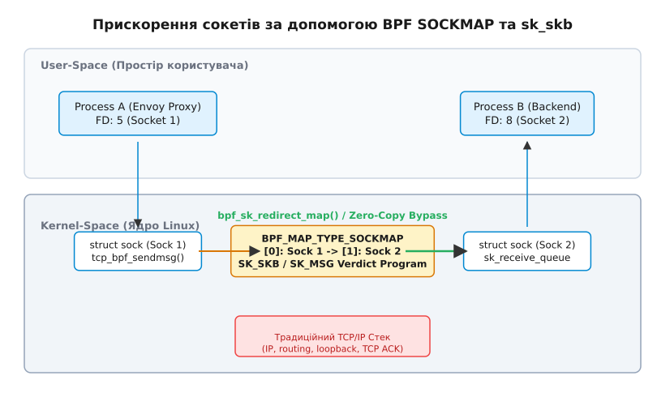

# Прискорення сокетів BPF: sockmap та sk_skb

<preknowlist>
- [Сокети Linux](topic:sys-unix/socket-api-linux) — системні виклики сокетів, файлові дескриптори, черги відправки та прийому.
- [Архітектура мережевого стеку Linux](topic:sys-unix/network-stack-architecture) — структура sk_buff, проходження пакетів через шари L3/L4.
</preknowlist>

Сучасна обчислювальна інфраструктура — від високонавантажених розподілених баз даних до мікросервісних сіток Service Mesh у Kubernetes — значною мірою спирається на локальну взаємодію між процесами (Inter-Process Communication, IPC). Коли додаток звертається до локального проксі-сервера (Envoy, HAProxy, NGINX) або два контейнери на одній фізичній ноді обмінюються даними через мережевий інтерфейс `loopback` (`127.0.0.1`), операційна система виконує колосальний обсяг марної роботи.

Дані, що передаються між двома сокетами на одній фізичній машині, проходять повний шлях через стек протоколів TCP/IP: формуються заголовки TCP та IP, обчислюються контрольні суми, контролюється вікно перевантаження, створюються та скасовуються таймери повторної передачі. При цьому байти двічі копіюються між простором користувача та ядром, хоча фізичний мережевий дріт у процесі взагалі не бере участі.

Технологія eBPF (Extended Berkeley Packet Filter) пропонує фундаментальну зміну цієї парадигми за допомогою двох ключових інструментів: сокетних карт (`BPF_MAP_TYPE_SOCKMAP`, `BPF_MAP_TYPE_SOCKHASH`) та програмованих хуків вердикту сокетів (`BPF_PROG_TYPE_SK_SKB`, `BPF_PROG_TYPE_SK_MSG`). Замість проходження через TCP/IP стек, eBPF здійснює коротке замикання (short-circuiting) на рівні структур даних ядра, перенаправляючи пакети або вектора сторінок пам'яті безпосередньо з вихідного сокета у чергу прийому цільового сокета за принципом Zero-Copy (або Near-Zero-Copy).

Детальний аналіз інженерної мотивації та хронології розробки цієї технології наведено у вставці 📜 [Історія еволюції BPF sockmap](topic:sys-unix/bpf-sockmap-and-sk-skb/hist-sockmap-evolution.md).

---

## 1. Анатомія накладних витрат локального TCP-трафіку

Щоб зрозуміти, чому традиційний передач даних через `localhost` є повільним, розглянемо крок за кроком шлях одного блоку даних між Процесом A (наприклад, прикладною службою) та Процесом B (наприклад, Sidecar-проксі Envoy) через стандартний TCP-сокет.

```
Традиційний шлях локального TCP-трафіку через loopback (lo):

 [Process A (User Space)]                     [Process B (User Space)]
       | send()                                      ^ recv()
       v (Copy #1: user -> kernel)                   | (Copy #2: kernel -> user)
 [sk_buff Creation]                           [sk_receive_queue]
       |                                             ^
       v                                             |
 [TCP Layer: seq, ack, window, timers]        [TCP Layer: validate, reorder]
       |                                             ^
       v                                             |
 [IP Layer: routing, headers]                 [IP Layer: rx process]
       |                                             ^
       v                                             |
 [Loopback Device (lo): qdisc, tx] ---------> [Loopback Device (lo): netif_rx]
```

При виконанні системного виклику `send()` або `write()` відбувається наступна послідовність дій ядра:

1. **Перемикання контексту та перше копіювання**: Ядро виконує перехід із простору користувача (User-Space) у простір ядра (Kernel-Space). Виділяється системний буфер сокета — структура `sk_buff` (socket buffer). Дані з буфера користувача Процесу A копіюються в сторінки пам'яті `sk_buff`.
2. **Обробка на рівні TCP (L4)**: Ядро заповнює заголовок TCP. Присвоюються послідовні номери байтів (Sequence Number), зафіксовується прапор підтвердження (ACK), розраховується контрольна сума TCP (TCP Checksum), описується стан вікна ковзання (Sliding Window). Створюються внутрішні таймери повторної відправки (Retransmission Timers) на випадок втрати пакета.
3. **Обробка на рівні IP (L3)**: Формується заголовок IP. Підсистема маршрутизації (Routing Subsystem) ядра приймає рішення щодо вихідного інтерфейсу і з'ясовує, що адреса призначення `127.0.0.1` належить віртуальному інтерфейсу зворотного зв'язку (`loopback`, `lo`).
4. **Рівень пристрою та черги (QDisc)**: Пакет передається у чергу дисципліни обробки трафіку (QDisc) інтерфейсу `lo`.
5. **Зворотний підйом по стеку**: Інтерфейс `lo` генерує програмне переривання (NET_RX softirq). Ядро витягує `sk_buff` з вхідної черги, передає його в підсистему IP, перевіряє заголовок, переходить до TCP-рівня, де перевіряє порядкові номери та підтвердження.
6. **Постановка в чергу прийому**: Буфер `sk_buff` додається до черги `sk_receive_queue` сокета Процесу B.
7. **Друге копіювання та прокидання**: Процес B, який очікує на виклику `recv()`, `read()` або події `epoll_wait()`, прокидається. Виконується друге копіювання даних зі сторінок ядра у буфер користувача Процесу B.

У цьому ланцюжку присутні дві фундаментальні проблеми:
* **Марні обчислення**: Алгоритми контролю перевантаження (CUBIC, BBR), розрахунки порядкових номерів та таймери повторного відправлення розроблені для нестабільних мережевих середовищ із можливими втратами пакетів і затримками. Для пам'яті одного й того самого процесора ці механізми дають лише нульову корисну роботу при значному навантаженні на CPU.
* **Подвійне копіювання та подрібнення cache**: Байти переходять через оперативну пам'ять двічі, вимиваючи корисний вміст із кешів процесора L1/L2/L3.

> 🔧 **Навіщо це.**
> У мікросервісній архітектурі з Sidecar Proxy (наприклад, Istio або Linkerd) кожен запит виконує цей шлях 4 рази. Застосування BPF sockmap дає змогу уникнути 3 з 4 проходів TCP/IP стеку, знижуючи затримку (latency) на 40–60% та звільняючи до 25% CPU для корисного навантаження додатків.

---

## 2. Механізм короткого замикання (Short-Circuiting)

Ідея BPF прискорення полягає у виключенні нижніх рівнів TCP/IP стеку з ланцюжка передачі даних. Якщо ядро знає, що сокет відправника (Socket A) підключений до сокета отримувача (Socket B) на цьому ж хості, воно може передати буфер даних безпосередньо з точки запису Сокета A у чергу прийому Сокета B.


*Рис. 1. Архітектура перенаправлення даних сокетів без копіювання за допомогою BPF SOCKMAP*

Щоб реалізувати це без зміни коду додатків у просторі користувача, eBPF підключається безпосередньо до системних викликів сокета шляхом перевизначення таблиці операцій протоколу (Protocol Operations Override).

### 2.1 Перевизначення `struct proto` та `tcp_bpf_prot`

У ядрі Linux кожен мережевий сокет описується структурою `struct sock`. У цій структурі є вказівник `sk_prot` на об'єкт `struct proto`, який містить таблицю вказівників на функції, що реалізують мережеві операції (`sendmsg`, `recvmsg`, `close`, `backlog_rcv` тощо).

Для звичайного TCP-сокета `sk_prot` вказує на глобальну структуру ядра `tcp_prot`.

Коли сокет додається до BPF-карти сокетів (`SOCKMAP` або `SOCKHASH`), ядро Linux виконує наступну транзитивну операцію:

1. Створюється внутрішня обгортка сокета `struct sk_psock`.
2. Ядро створює динамічну копію таблиці операцій сокета і підміняє вказівник `sk_prot` сокета зі стандартної `tcp_prot` на спеціалізовану таблицю **`tcp_bpf_prot`**.
3. Функції цієї нової таблиці перевизначають стандартні точки входу:
   * `sk->sk_prot->sendmsg` замінюється на **`tcp_bpf_sendmsg`**;
   * `sk->sk_prot->sendpage` замінюється на **`tcp_bpf_sendpage`**;
   * `sk->sk_prot->close` замінюється на **`sock_map_close`**.

Тепер, коли Процес A викликає `write(fd, buf, len)` або `send(fd, buf, len, 0)`, VFS шар ядра викликає не стандартну функцію `tcp_sendmsg()`, а BPF-обгортку `tcp_bpf_sendmsg()`.

### 2.2 Внутрішня структура ядра `struct sk_psock`

Ключовим сполучним елементом між сокетом `struct sock` та BPF-системою є внутрішня структура ядра `struct sk_psock` (socket BPF context). Вона виділяється ядром динамічно під час першого додавання сокета до будь-якої сокетної карти.

Поля структури `struct sk_psock`:
* **`sk`**: Вказівник на оригінальний сокет `struct sock *`.
* **`sk_proto`**: Збережений оригінальний вказівник на таблицю `struct proto` (`tcp_prot`), який відновлюється при видаленні сокета з карти.
* **`progs`**: Набір вказівників на завантажені BPF-програми (`sk_parser`, `sk_verdict`, `sk_msg`).
* **`link`**: Список карт `SOCKMAP` або `SOCKHASH`, у яких зареєстровано даний сокет. Один сокет може перебувати у декількох картах одночасно.
* **`ingress_skb`**: Черга накопичених пакетів прийому.
* **`ingress_msg`**: Черга вектора сторінок `sk_msg` при використанні BPF `SK_MSG`.
* **`work`**: Структура асинхронної роботи `struct work_struct` для обробки відкладеного заповнення черги (backlog processing).

Завдяки структурі `sk_psock` ядро зберігає повний стан BPF-хуків без модифікації базового коду протоколу TCP.

---

## 3. Сокетні карти: BPF_MAP_TYPE_SOCKMAP та BPF_MAP_TYPE_SOCKHASH

Основою для ідентифікації та адресації цільових сокетів є спеціальні типи BPF-карт. Вони зберігають не просто числа чи масиви байтів, а реальні вказівники ядра на структури `struct sock *` із системним підрахунком посилань (Reference Counting).

Повний перелік параметрів API, типів ключів та прапорців карт наведено у вставці 📋 [Довідник API: SOCKMAP та sk_skb](topic:sys-unix/bpf-sockmap-and-sk-skb/api-sockmap-sk-skb.md).

### 3.1 `BPF_MAP_TYPE_SOCKMAP`

`SOCKMAP` є впорядкованим масивом сокетів, де ключем виступає 32-бітне ціле число (`__u32`), а значенням під час оновлення з простору користувача — файловий дескриптор сокета `fd`.

```
Поля карти BPF_MAP_TYPE_SOCKMAP:
+-------------------+-----------------------------------+
| Ключ (__u32)     | Значення (struct sock *)          |
+-------------------+-----------------------------------+
| 0                 | Вказівник на struct sock (Proxy)  |
| 1                 | Вказівник на struct sock (Backend)|
+-------------------+-----------------------------------+
```

При виконанні виклику `bpf_map_update_elem(map_fd, &key, &sock_fd, BPF_ANY)` з простору користувача, ядро виконує такі кроки:
1. За файловим дескриптором `sock_fd` знаходить внутрішню структуру сокета `struct sock *`.
2. Перевіряє, чи сокет є TCP-сокетом у стані `TCP_ESTABLISHED`.
3. Збільшує лічильник посилань сокета (`sock_hold(sk)`), запобігаючи його видаленню з пам'яті при передчасному закритті файлового дескриптора.
4. Підміняє `sk_prot` на `tcp_bpf_prot` та ініціалізує `struct sk_psock`.
5. Записує вказівник `struct sock *` у слот масиву `SOCKMAP`.

### 3.2 `BPF_MAP_TYPE_SOCKHASH`

`SOCKHASH` реалізує хеш-таблицю сокетів. На відміну від `SOCKMAP`, ключем у `SOCKHASH` може бути довільна структура даних, визначена розробником (наприклад, 5-tuple структура, яка описує IP-адреси та порти з'єднання).

Це дозволяє мережевим агентам (таким як Cilium) відстежувати тисячі динамічних сокетних з'єднань без необхідності ведення таблиць індексів у просторі користувача.

### 3.3 Управління життєвим циклом сокета у карті

Якщо процес користувача аварійно завершується або викликає `close(fd)`, ядро перехоплює це через перевизначений метод `sock_map_close()`.

Послідовність очищення:
1. Ядро видаляє вказівник на сокет з усіх карт `SOCKMAP` / `SOCKHASH`, у яких він перебував.
2. Деактивуються BPF-хуки для цього сокета.
3. Відновлюється оригінальна таблиця `sk_prot` (`tcp_prot`).
4. Викликається `sock_put(sk)` для зменшення лічильника посилань.

Завдяки цьому механізму запобігається поява "висячих" вказівників (dangling pointers) у ядрі, гарантуючи безпеку пам'яті (Memory Safety).

---

## 4. Програми BPF: SK_SKB та SK_MSG

Самі по собі сокетні карти лише зберігають посилання на сокети. Для виконання операцій перенаправлення до карт прикріплюються BPF-програми двох типів: `BPF_PROG_TYPE_SK_SKB` та `BPF_PROG_TYPE_SK_MSG`.

### 4.1 `BPF_PROG_TYPE_SK_SKB`: STREAM_PARSER та STREAM_VERDICT

Програми типу `SK_SKB` оперують буферами сокетів `struct __sk_buff`. Вони прикріплюються до `SOCKMAP` за допомогою системного виклику `bpf_prog_attach()` з одним із двох типів:

#### 1. `BPF_SK_SKB_STREAM_PARSER` (Парсер потоку)
TCP є потоковим протоколом без збереження меж повідомлень. Якщо прикладний протокол (наприклад, HTTP/1.1 або TLS) вимагає обробки цілісних кадрів, BPF-парсер витягує заголовки з вхідного потоку байтів і визначає довжину кадру.

Парсер повертає:
* `len > 0`: Довжина сформованого повідомлення у байтах. Ядро чекає накопичення цієї кількості байтів, після чого передає зібраний `sk_buff` програмі `STREAM_VERDICT`.
* `0`: Даних недостатньо, ядро має продовжувати збір байтів.
* `< 0`: Помилка парсингу кадру, потік розривається.

#### 2. `BPF_SK_SKB_STREAM_VERDICT` (Вердикт маршрутизації)
Програма вердикту приймає остаточне рішення щодо долі накопиченого `sk_buff`. 

Програма може повернути один із трьох результатів:
* **`SK_DROP` (0)**: Відкинути пакет. Сокет відправника отримує помилку.
* **`SK_PASS` (1)**: Пропустити пакет надалі за стандартним сценарієм ядра через стек TCP/IP.
* **`SK_REDIRECT`**: Перенаправити пакет.

Якщо функція повертає `SK_REDIRECT`, ядро витягує цільову структуру `struct sock *` з `map` за ключем `key`. Далі `sk_buff` безпосередньо відв'язується від вихідного сокета і прив'язується до черги прийому `sk_receive_queue` цільового сокета.

```
Схема перенаправлення SK_SKB STREAM_VERDICT:

 [tcp_bpf_sendmsg] -> [SK_SKB Parser] -> [SK_SKB Verdict] 
                                                |
                                    bpf_sk_redirect_map()
                                                |
                                                v
                              [sk_receive_queue Target Sock]
```

### 4.2 `BPF_PROG_TYPE_SK_MSG`: Перенаправлення на рівні системного виклику

Хоча `SK_SKB` усуває обробку на рівні TCP/IP, ця техніка все одно вимагає створення структури `sk_buff` та виділення під неї пам'яті у ядрі.

Програми типу `BPF_PROG_TYPE_SK_MSG` працюють ще вище — безпосередньо у контексті системного виклику `sendmsg()`, до того, як ядро сформує `sk_buff`.

Контекстом цієї програми є структура `struct sk_msg_md`, яка вказує на масив сторінок пам'яті користувача (`scatterlist`), переданих у виклику `sendmsg()`.

Переваги `SK_MSG`:
1. **Нульова аллокація `sk_buff`**: Ядро взагалі не виділяє пам'ять під буфери сокетів для трафіку відправки.
2. **Пряме перенесення сторінок (Page Redirection)**: Сторінки пам'яті користувача переміщуються в кільцевий буфер прийому цільового сокета.
3. **Пакетне застосування вердиктів (bpf_msg_apply_bytes)**: BPF-програма може викликати `bpf_msg_apply_bytes(msg, 1048576)`, вказуючи ядру автоматично перенаправляти наступний 1 Мегабайт даних без повторного запуску BPF-програми на кожному виклику `send()`.

---

## 5. Динамічне перехоплення з'єднань за допомогою BPF_PROG_TYPE_SOCK_OPS

У реальних виробничих середовищах ручне додавання сокетів до карт з простору користувача є незручним і вимагає постійного моніторингу процесів. Для автоматизації цього процесу eBPF пропонує тип програм `BPF_PROG_TYPE_SOCK_OPS`.

Програма `SOCK_OPS` прикріплюється до cgroup v2 (`/sys/fs/cgroup`) і автоматично викликається ядром під час зміни стану сокетів.

Основні події (opcodes):
* **`BPF_SOCK_OPS_ACTIVE_ESTABLISHED`**: Викликається на клієнтському сокеті при успішному виконанні системного виклику `connect()`.
* **`BPF_SOCK_OPS_PASSIVE_ESTABLISHED`**: Викликається на серверному сокеті при прийнятті нового з'єднання через `accept()`.

Під час цих подій BPF-програма витягує мережеві атрибути (IP-адреси, порти) і викликає допоміжну функцію ядра `bpf_sock_hash_update()`. Ця функція самостійно додає сокет, що викликав подію, до карти `SOCKHASH`. У результаті всі нові TCP-з'єднання у системі автоматично стають учасниками BPF-прискорення без жодного виклику з утиліт користувача.

---

## 6. Управління заторами та блокуваннями (Flow Control & Backlog)

Оскільки BPF sockmap оминає стандартний TCP-стек, постає питання: як здійснюється контроль заповнення черг (Flow Control), якщо сокет-отримувач повільно читає дані або його процес заблокований?

Для розв'язання цієї проблеми ядро Linux реалізує механізм `sk_psock_backlog`:

1. **Перевірка лімітів бувера `sk_rcvbuf`**: При перенаправленні даних BPF-система перевіряє поточний розмір черги прийому цільового сокета. Якщо розмір заповнення перевищує `sk_rcvbuf`, перенаправлення призупиняється.
2. **Переведення у Backlog Queue**: Якщо сокет заблокований у системному виклику або обробляє інші дані, байти переміщуються у внутрішню чергу `psock->ingress_skb` або `psock->ingress_msg`.
3. **Планувальник `work_struct`**: Ядро ставить у системну чергу обробки асинхронний таск `psock->work`. Як тільки сокет звільняється, робочий потік ядра вивантажує накопичені байти у чергу прийому додатку та будить його через `sk->sk_data_ready()`.

Завдяки цьому механізму BPF sockmap повністю зберігає семантику блокування та неблокуючого введення-виведення (POSIX Socket Compliance), запобігаючи переповненню пам'яті.

---

## 7. Взаємодія з kTLS (Kernel TLS Offload)

Одним із найскладніших бар'єрів при оптимізації локального трафіку є шифрування Transport Layer Security (TLS). Якщо два сервіси спілкуються через TLS, перенаправлення зашифрованих байтів у ядрі на рівні сокета є марним, оскільки проксі-сервер або бекенд не зможе прочитати зашифрований корисний вантаж без TLS-декриптора.

З появою в ядрі Linux підсистеми **kTLS** (Kernel TLS, Linux 5.2+) стало можливим поєднання kTLS та BPF SOCKMAP.

```
Потік обробки kTLS + BPF SOCKMAP:

[App A (Cleartext)] -> kTLS (AES-GCM Encrypt in Kernel) -> [BPF SK_MSG Redirect] 
                                                                  |
[App B (Cleartext)] <- kTLS (AES-GCM Decrypt in Kernel) <---------+
```

Механіка взаємодії:
1. Додатки виконують стандартне TLS-рукостискання (Handshake) у просторі користувача.
2. Після узгодження симетричних ключів шифрування (AES-GCM), сесійні ключі передаються в ядро через `setsockopt(fd, SOL_TLS, TLS_TX, ...)`.
3. За шифрування та розшифрування відповідає ядро Linux (kTLS).
4. BPF-програма `SK_MSG` прикріплюється до сокета поверх kTLS. Коли додаток пише відкритий текст у сокет, kTLS виконує шифрування, після чого BPF `bpf_msg_redirect_map()` перенаправляє зашифрований потік у цільовий сокет.
5. На сокеті-отримувачі kTLS автоматично розшифровує байти під час зчитування.

Це дає змогу зберегти захист даних TLS і водночас повністю оминути стек TCP/IP.

---

## 8. Простеження та діагностика сокетних карт (Tracing & Observability)

Для адміністрування та налагодження BPF SOCKMAP підсистеми ядро Linux надає стандартний інтерфейс `bpftool` та точку трасування tracepoints.

### 8.1 Інспекція карт за допомогою `bpftool`

Перевірити наявність та вміст сокетних карт у системі можна через інструмент `bpftool`:

```bash
# Перелік усіх активних карт у системі
bpftool map show

# Перегляд деталей конкретної SOCKMAP карти (наприклад, ID 42)
bpftool map dump id 42
```

### 8.2 Динамічне трасування через `bpftrace`

За допомогою `bpftrace` можна відстежувати події перенаправлення сокетів та аналізувати затримки:

```bash
# Відстеження викликів функцій перенаправлення сокетів у ядрі
bpftrace -e 'kprobe:tcp_bpf_sendmsg { @[comm] = count(); }'
```

Також ядро підтримує спеціалізовані точки трасування (tracepoints):
* `tracepoint:sockmap:sock_map_update`: Сповіщає про додавання сокета до сокетної карти.
* `tracepoint:sockmap:sock_map_drop`: Сповіщає про відкидання пакета BPF-програмою вердикту.

---

## 9. Практичний вимір продуктивності та ціна технології

Застосування BPF sockmap дає суттєвий прирост продуктивності, але вимагає розуміння інженерних компромісів.

### 9.1 Порівняльна таблиця характеристик IPC

| Метрика / Механізм | Стандартний TCP (loopback) | UNIX Domain Sockets | BPF SOCKMAP / SK_MSG |
| :--- | :--- | :--- | :--- |
| **Оминання TCP/IP стеку** | Ні | Так | Так |
| **Копіювання пам'яті** | 2 копіювання (User↔Kernel) | 2 копіювання | 1 копіювання (Zero-Copy kernel path) |
| **Прозорість для додатків** | Не вимагає змін коду | Вимагає зміни адресації сокета | **Абсолютно прозоро** (TCP socket API) |
| **Затримка (Latency, p99)** | ~18-25 мкс | ~8-12 мкс | **~4-6 мкс** |
| **Пропускна здатність** | ~25 Гбіт/с | ~45 Гбіт/с | **~85-100+ Гбіт/с** |
| **Підтримка TLS** | Ручна (User-Space) | Ручна | **Автоматична (через kTLS)** |

### 9.2 Обмеження та крайові випадки

Попри визначну ефективність, технологія має декілька обмежень:

1. **Тільки TCP та UDP (Linux 5.6+)**: Механізм первинно створювався для TCP-сокетів у стані `TCP_ESTABLISHED`. Незв'язані сокети або сокети Raw/ICMP не підтримуються.
2. **Складність контролера простору користувача**: Агент керування повинен точно відстежувати події створення та закриття сокетів (найчастіше за допомогою `BPF_PROG_TYPE_SOCK_OPS` та cgroups). Помилка в індексації сокетів у карті призведе до відкидання трафіку (`SK_DROP`) або передачі даних у чужий сокет.
3. **Модифікація пакетів**: Якщо BPF-програмі потрібно змінити вміст даних (Payload Munging), необхідно використовувати `bpf_msg_pull_data()`, що може розірвати неперервність сторінок пам'яті і частково знизити ефект zero-copy.

Повний приклад реалізації BPF-програми та контролера простору користувача мовами C та C++ наведено у вставці ⚙️ [Практика: Перенаправлення TCP-трафіку](topic:sys-unix/bpf-sockmap-and-sk-skb/proj-sockmap-proxy.md).

---

## Підсумок

`BPF_MAP_TYPE_SOCKMAP` та програми `sk_skb` / `sk_msg` є фундаментальною зміною в архітектурі мережевого стеку Linux. Виключаючи застарілі обчислювальні шар TCP/IP для трафіку, що не покидає межі оперативної пам'яті хоста, eBPF дозволяє досягти продуктивності IPC на рівні швидкості шини пам'яті. Цей механізм став основою сучасної хмарної інфраструктури, забезпечуючи високу ефективність Service Mesh, проксі-систем та мікросервісних платформ нового покоління.
