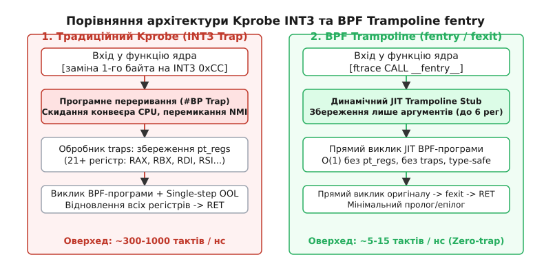
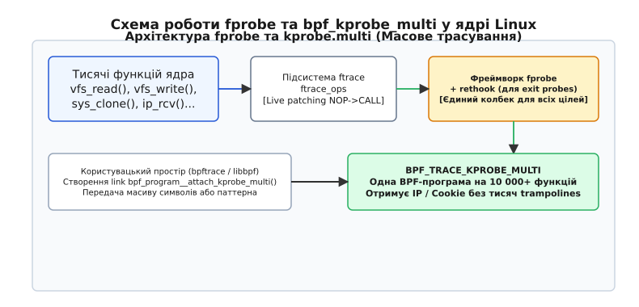

# Сучасні оверхеди трасування: BPF Trampoline та fprobe

<preknowlist>
- [Динамічне зондування: kprobes та uprobes](topic:sys-unix/uprobes-and-kprobes) — точки переривання INT3, out-of-line виконання та збереження pt_regs.
- [Трасування ядра ftrace](topic:sys-unix/ftrace-kernel-tracing) — мочки `__fentry__`, nop-інструкції та механізм live patching.
- [Архітектура eBPF](topic:sys-unix/ebpf-programming-model-and-toolchain) — віртуальна машина ядра, верифікатор типізованого коду та JIT-компіляція.
</preknowlist>

При трасуванні високочастотної функції ядра Linux, що викликається мільйони разів на секунду (наприклад, `ip_rcv` у мережевому стеку 10GbE-адаптера або `schedule` у планировщику задач), встановлення класичного зонда `kprobe` призводить до миттєвого падіння пропускної здатності мережі або зсуву затримок процесора на 20–30%. Причина лежить у системному механізмі переривань: кожна точка `kprobe` базується на вставці інструкції `INT3`, яка примушує процесор скидати конвеєр інструкцій, генерувати програмне виключення `#BP`, перемикати контекст стек-кадру в режим NMI/exception та зберігати понад 200 байтів регістрового стану у структуру `pt_regs`.

Усунення цього оверхеду вимагало принципово нового підходу до динамічного інструментування. Поєднання компіляторних мочок `__fentry__`, метаданих типізації BTF (BPF Type Format) та генеративного JIT-компільованого машинного коду створило **BPF Trampoline** — механізм прямого виклику BPF-програм із затримкою у 5–15 наносекунд замість мікросекунд. Для задач масового трасування тисяч функцій одночасно було розроблено фреймворк **`fprobe`**, що поєднав підсистеми `ftrace` та `rethook`.

---

## 1. Чому традиційний Kprobe обвалює продуктивність

Щоб зрозуміти ціну сучасної спостережуваності (observability), необхідно детально розібрати внутрішній механізм виконання традиційного зонда `kprobe` та оцінити кожну ланку його виконання на рівні архітектури процесора.

Коли інструмент трасування (наприклад, застарілий модуль або програма BPF типу `BPF_PROG_TYPE_KPROBE`) реєструє `kprobe` на довільну функцію ядра (наприклад, `sys_clone` або `do_unlinkat`), ядро виконує послідовність дій для підготовки точки інструментування. 

Спочатку ядро знаходить адресу першої інструкції цільової функції у пам'яті й атомарно перезаписує її перший байт опкодом `0xCC` (`INT3` на архітектурі x86_64). Оригінальна інструкція копіюється у спеціально виділений OOL-буфер (out-of-line execution buffer).

При досягненні цієї адреси потоком виконання процесор стикається з опкодом `0xCC`. Виконання коду призупиняється на апаратному рівні. Процесор скидає всі інструкції, які перебували у конвеєрі (pipeline flush), і генерує програмне виключення точки зупинки `#BP` (Breakpoint Trap, Vector 3).

Управління передається від звичайного потоку ядра до обробника виключень trap handler. Обробник переривань зупиняє виконання поточного процесу, переключає кадр стеку і виконує повне збереження вмісту всіх регістрів процесора загального призначення у структуру `pt_regs`:

```c
/* Контекст, що примусово формується при кожному виклику kprobe */
struct pt_regs {
    unsigned long r15;
    unsigned long r14;
    unsigned long r13;
    unsigned long r12;
    unsigned long bp;
    unsigned long bx;
    unsigned long r11;
    unsigned long r10;
    unsigned long r9;
    unsigned long r8;
    unsigned long ax;
    unsigned long cx;
    unsigned long dx;
    unsigned long si;
    unsigned long di;
    unsigned long orig_ax;
    unsigned long ip;
    unsigned long cs;
    unsigned long flags;
    unsigned long sp;
    unsigned long ss;
};
```

Диспетчер `kprobes` шукає відповідний колбек у хеш-таблиці та передає йому вказівник на створену структуру `pt_regs`. BPF-програма змушена зчитувати вхідні аргументи функції з полів цієї структури через системні хелпери `bpf_probe_read_kernel()`, оскільки верифікатор не має інформації про типи аргументів і не дозволяє пряме розіменування вказівників.

Після завершення обробника ядро вмикає прапорець покрокового виконання `TF` (Trap Flag) у регістрі `EFLAGS`, налаштовує вказівник інструкцій `RIP` на збережену інструкцію в OOL-буфері й виконує її. Після виконання цієї єдиної інструкції процесор генерує друге виключення `#DB` (Debug Exception), обробник якого вимикає `TF`, відновлює оригінальний `RIP` зі зміщенням і повертає потік у цільову функцію ядра.

Подвійне переривання (`#BP` та `#DB`), примусове збереження 21 регістра, скид конвеєра інструкцій та псування кеш-пам'яті L1i/L2 створюють сумарний оверхед від **300 до 1000 наносекунд** на кожен виклик. Якщо функція викликається 1 000 000 разів на секунду, система витрачає до 1 секунди процесорного часу виключно на обробку зонда.

Спроба оптимізації через Optprobes (заміна `INT3` на 5-байтний відносний стрибок `JMP`) частково зменшила затримки, але створила нові проблеми: не всі функції ядра мають 5-байтні атомарно замінні інструкції на початку, а введення захисту від Spectre v2 (Retpolines) зробило непрямі стрибки через OOL-буфери знову вартісними через регулярний скид передбачувача переходів (branch predictor).

Детальний аналіз хронології розвитку систем трасування наведено у матеріалі [Історія еволюції оверхедів трасування](topic:sys-unix/bpf-trampoline-and-fprobe/hist-tracing-overhead.md).

---

## 2. Еволюція ftrace та підґрунтя zero-trap інструментування

Шлях до повністю безтрапового трасування розпочався зі створення підсистеми **ftrace** (Function Tracer). Розробники ядра спільно з авторами компіляторів GCC та Clang впровадили спеціальний механізм компіляції ядра.

За наявності прапорця `-mfentry` компілятор вставляє на самому початку кожної C-функції ядра (ще до формування прологу стеку `push rbp`) виклик спеціальної заглушки:

```asm
# Машинний код на самому початку кожної функції ядра (x86_64)
call __fentry__
```

Під час завантаження ядра підсистема ftrace знаходить усі ці адреси за допомогою ELF-метаданих і за допомогою живого патчингу (live patching) атомарно перезаписує 5 байтів `call __fentry__` на 5-байтну інструкцію `NOP` (`0x0f 0x1f 0x44 0x00 0x00`).

У звичайному стані інструкція `NOP` має практично нульовий оверхед: вона декодується й відкидається суперскалярним конвеєром CPU без споживання обчислювальних тактів. Коли виникає потреба відтрасувати конкретну функцію, ядро замінює `NOP` назад на `CALL` до центрального обробника ftrace.

Проте застарілий механізм `kprobe-ftrace` мав фундаментальне обмеження: ftrace викликав загальну функцію `ftrace_caller`, яка все одно формувала повну структуру `pt_regs` для забезпечення сумісності з API kprobe. Щоб досягти максимальної продуктивності, потрібен був механізм, який міг би з'єднати інструкцію `__fentry__` безпосередньо з код BPF-програми без посередників.

---

## 3. Архітектура BPF Trampoline: Динамічний JIT-міст

З появою ядра Linux 5.5 у січні 2020 року було впроваджено **BPF Trampoline**. Його ідея полягає у відмові від будь-яких статичних обробників та універсальних форм `pt_regs`.

BPF Trampoline — це динамічно згенерований асемблерний міст (JIT stub), який підсистема BPF компілює безпосередньо у виконувану пам'ять під час завантаження програми.


*Порівняння шляхів виконання: Kprobe (з перериванням INT3 і збереженням pt_regs) проти BPF Trampoline (прямий виклик JIT z 0-trap оверхедом).*

### Механізм взаємодії з BTF (BPF Type Format) та безпека пам'яті CO-RE

Генерація точного асемблерного мосту стала можливою завдяки метаданим **BTF**. Формат BTF міститься у віртуальному файлі `/sys/kernel/btf/vmlinux` і описує повну структуру типів ядра: назви функцій, кількість аргументів, їхні розміри та точні типи вказівників.

Коли користувач завантажує BPF-програму типу `BPF_PROG_TYPE_TRACING`, наприклад:

```c
int do_sys_openat2(int dfd, const char *filename, struct open_how *how);
```

JIT-компілятор BPF Trampoline (функція `arch_prepare_bpf_trampoline` у вихідному коді ядра) робить запит до BTF і дізнається сигнатуру функції. Компільований трамплін знає, що відповідно до System V AMD64 ABI перші три аргументи передаються у регістрах `RDI`, `RSI` та `RDX`.

Згенерований трамплін не зберігає всі 21 регістр. Він виділяє на стеку масив `u64 args[3]` і виконує прямий запис лише трьох потрібних регістрів:

```asm
mov [rbp - 0x18], rdi   # args[0] = dfd
mov [rbp - 0x10], rsi   # args[1] = filename
mov [rbp - 0x08], rdx   # args[2] = how
```

Після цього трамплін передає вказівник на цей масив у BPF-програму за допомогою прямої інструкції `CALL`. Оскільки BPF-програма знає сигнатуру з BTF, вона може звертатися до полів структур через прямі розіменування (вказівники типу CO-RE — Compile Once, Run Everywhere), а верифікатор BPF гарантує безпеку цих читань під час збірки.

Під час верифікації BPF-програми типу `fentry` верифікатор позначає вказівники спеціальним типом `PTR_TO_BTF_ID`. Це означає, що верифікатор знає точний тип внутрішньої структури ядра та дозволяє розіменовувати її поля напряму через регулярні інструкції зсуву `MOV` та зчитування `LDX`. Якщо під час виконання розіменування вказівника призводить до спроби прочитати некоректну або некоректно вирівняну адресу пам'яті (Page Fault), ядро не викликає Kernel Panic: обробник помилок сторінок перехоплює цей виклик за допомогою спеціальних таблиць виправлення `fixup_exception()`, прозоро замінюючи прочитане значення на `0`.

### Управління пам'яттю JIT та захист W^X

Кожен BPF Trampoline генерується у динамічно виділеній сторінці виконуваної пам'яті ядра. Для забезпечення безпеки пам'яті ядро дотримується суворого принципу **W^X (Write XOR Execute)**: сторінка пам'яті ніколи не повинна бути одночасно доступною для запису та виконання.

Процес створення трампліна з точки зору пам'яті відбувається за таким алгоритмом:
1. Підсистема BPF запитує сторінку пам'яті через спеціальний виділювач `bpf_jit_alloc_exec()`, який використовує механізми `vmalloc_exec()`.
2. Виділена сторінка отримує початкові права `PAGE_KERNEL` (доступна для запису, але заборонена для виконання).
3. JIT-компілятор описує асемблерні інструкції мосту у звичайному буфері пам'яті.
4. Після завершення генерації коду ядро викликає функцію `set_memory_ro()` для захисту сторінки від подальшого запису та `set_memory_x()` для дозволу виконання інструкцій процесором.
5. Для захисту від атак типу Return-Oriented Programming (ROP) адреса згенерованого трампліна реєструється у спеціальній таблиці допустимих точок переходів ядра.

### Синхронізація, кешування та лічильники посилань

Для запобігання дублюванню машинного коду та забезпечення потікобезпечності ядро Linux використовує систему кешування трамплінів через глобальну хеш-таблицю `tramp_table`.

Коли додаток намагається приєднати BPF-програму до функції ядра, підсистема викликає функцію `bpf_trampoline_lookup(key)`. Ключем хешування `key` є комбінація ідентифікатора модуля ядра та адреси `IP` цільової функції.

Якщо трамплін для цієї функції вже створено (наприклад, до неї вже приєднано іншу програму `fentry`), ядро не генерує новий машинний код. Замість цього воно атомарно збільшує лічильник посилань `refcnt` у структурі `bpf_trampoline` і додає нову BPF-програму до відповідного списку `progs_hlist`.

У разі зміни складу приєднаних програм (додавання нової програми `fexit` або видалення активної `fentry`) ядро під захистом глобального мутекса `trampoline_mutex` регенерує асемблерний міст. Новий код записується у новий буфер, а заміна адреси в ftrace відбувається за допомогою атомарного інструкційного виклику. Старий машинний код трампліна вивільняється лише після проходження граційної паузи RCU (Read-Copy Update) через `synchronize_rcu()`, що гарантує відсутність потоків процесора, які все ще виконують старий трамплін.

### fentry, fexit та fmod_ret

BPF Trampoline уможливив три нові режими інструментування:

1. **`fentry` (Function Entry):** Запускається на вході у функцію ядра. Повністю замінює `kprobe`, але виконується за **5–15 наносекунд** замість 500 нс і надає типізовані аргументи.
2. **`fexit` (Function Exit):** Запускається при виході з функції. Повністю замінює `kretprobe`. Головна перевага `fexit`: програма отримує одночасний доступ як до всіх вхідних аргументів функції, так і до поверненого значення (`retval`), яке зберігається на стеку трампліна після виконання оригінального коду.
3. **`fmod_ret` (Modify Return):** Дозволяє BPF-програмі перевизначити поведінку ядра. Якщо програма `fmod_ret` повертає ненульове значення (наприклад, `-EPERM`), трамплін обходить виклик оригінальної функції ядра й одразу повертає це значення викликаючому коду. Це використовується у підсистемі безпеки BPF LSM для запобігання несанкціонованим операціям.

---

## 4. Фреймворк fprobe та масштабування масового трасування

Незважаючи на високу швидкість BPF Trampoline, генерація окремого JIT-трампліна під кожну функцію вимагає виділення виконуваної пам'яті (`bpf_jit_alloc_exec`). Якщо інструмент аналізу (наприклад, `bpftrace`) намагається відтрасувати 10 000 функцій файлової системи `vfs_*`, створення 10 000 окремих трамплінів призведе до вичерпання ресурсів пам'яті ядра.

Для масового зондування у ядрі Linux 5.18 було додано фреймворк **`fprobe`** та підсистему **`rethook`**.


*Архітектура fprobe та kprobe.multi: підключення єдиної BPF-програми до тисяч функцій ядра через ftrace_ops та rethook.*

### Механізм bpf_kprobe_multi та підсистема rethook

`fprobe` працює як високоефективний клієнт `ftrace`. Замість створення тисяч окремих трамплінів, ядро реєструє **один об'єкт `fprobe`** із єдиною структурою `ftrace_ops`, додаючи в її фільтр усі необхідні адреси функцій.

Головним споживачем `fprobe` у eBPF є тип програм **`BPF_TRACE_KPROBE_MULTI`** (`kprobe.multi`). 

Коли потік виконання викликає будь-яку з інструментованих функцій, ftrace передає управління єдиному обробнику `fprobe`. Обробник отримує адреси `IP` (Instruction Pointer), зчитує контекст і викликає BPF-програму.

Для подій виходу з функції (`kretprobe.multi`) підсистема `fprobe` оперує механізмом **`rethook`**. У застарілій підсистемі `kretprobe` ядро використовувало динамічне виділення об'єктів `kretprobe_instance` під спінлоками, що викликало сильну деградацію на багатоядерних системах через змагання за блоки пам'яті (spinlock contention).

Підсистема `rethook` усуває це обмеження. Вона виділяє пул об'єктів `rethook_node` локально для кожного процесу та використовує беклог адрес повернення на стеку виконання `task_struct`. Підмінена адреса повернення веде на статичний асемблерний трамплін `rethook_trampoline`, який прозоро зчитує збережену справжню адресу повернення з пулу потоку без використання будь-яких блокувань.

Крім того, підсистема `fprobe` містить вбудований захист від нескінченної рекурсії за допомогою лічильника `current->ftrace_recursion`. Якщо BPF-програма під час свого виконання випадково провокує виклик іншої інструментованої функції, `fprobe` виявляє рекурсивний запуск і безпечно ігнорує повторний виклик, запобігаючи переповненню стеку ядра.

Затримка зонда `fprobe` становить **20–40 наносекунд**, що дозволяє безпечно трасувати тисячі функцій ядра одночасно.

---

## 5. Обличчя архітектури ARM64 (AArch64) у порівнянні з x86_64

Реалізація BPF Trampoline на архітектурі ARM64 має важливі відмінності від x86_64, зумовлені особливістю RISC-архітектури та іншою специфікацією ABI.

У той час як на x86_64 компілятор вставляє інструкцію `call __fentry__`, на ARM64 застосовується прапорець компілятора `-mpatchable-function-entry=2,0`. Це означає, що компілятор виділяє 2 інструкції `NOP` (8 байтів) безпосередньо перед і на початку функції.

Відмінності у передачі аргументів та генерації коду:
- **Передача аргументів:** На ARM64 відповідно до стандарту AAPCS перші 8 аргументів передаються у загальних регістрах `x0`–`x7` (на відміну від 6 регістрів `rdi`, `rsi`, `rdx`, `rcx`, `r8`, `r9` у x86_64). Завдяки цьому BPF Trampoline на ARM64 підтримує функції з 8 вхідними аргументами.
- **Збереження регістрів:** Асемблерний міст ARM64 використовує парні інструкції збереження та відновлення регістрів `stp` (Store Pair) та `ldp` (Load Pair):
```asm
stp x0, x1, [sp, #16]    // Збереження аргументів x0 та x1 у стек-кадр
stp x2, x3, [sp, #32]    // Збереження аргументів x2 та x3
```
- **Вказівник повернення:** На ARM64 адреса повернення зберігається у спеціальному регістрі зв'язку `x30` (`lr` — Link Register). Трамплін мусить явно зберігати значення `x30` у кадрі стеку перед виконанням інструкції переходів `bl` (Branch with Link).

---

## 6. Покроковий асемблерний розбір згенерованого Trampoline (x86_64)

Для глибшого розуміння розглянемо машинний код x86_64, який згенеровано підсистемою BPF JIT для функції з 2 аргументами:

```asm
# ====================================================================
# ЗГЕНЕРОВАНИЙ JIT-КОД BPF TRAMPOLINE ДЛЯ X86_64
# ====================================================================

# 1. Пролог: створення кадру стеку
push   rbp
mov    rbp, rsp
sub    rsp, 0x30                  # Виділення 48 байтів на стеку

# 2. Збереження вхідних аргументів у масив args[] на стеку
mov    QWORD PTR [rbp-0x18], rdi  # args[0] = перший аргумент (RDI)
mov    QWORD PTR [rbp-0x10], rsi  # args[1] = другий аргумент (RSI)

# 3. Виклик BPF-програми fentry
lea    rdi, [rbp-0x18]            # RDI = адреса масиву args[] (контекст ctx)
mov    rax, 0xffffffffc03a1050    # RAX = адреса JIT-коду BPF fentry програми
call   rax                        # Прямий виклик BPF-програми

# 4. Виклик оригінальної функції ядра
mov    rdi, QWORD PTR [rbp-0x18]  # Відновлення RDI з args[0]
mov    rsi, QWORD PTR [rbp-0x10]  # Відновлення RSI з args[1]
mov    rax, 0xffffffff81234567    # RAX = адреса оригінальної функції ядра
call   rax                        # Виконання оригінальної функції

# 5. Збереження значення повернення
mov    QWORD PTR [rbp-0x8], rax   # args[2] = retval (результат з RAX)

# 6. Виклик BPF-програми fexit
lea    rdi, [rbp-0x18]            # RDI = адреса args[] (включаючи retval)
mov    rax, 0xffffffffc03a1100    # RAX = адреса JIT-коду BPF fexit програми
call   rax                        # Прямий виклик BPF fexit програми

# 7. Епілог: відновлення стану та повернення
mov    rax, QWORD PTR [rbp-0x8]   # RAX = оригінальний retval
leave                             # mov rsp, rbp; pop rbp
ret                               # Повернення викликаючому коду
```

У цьому згенерованому коді повністю відсутні переривання, скидання конвеєра CPU та зайве збереження регістрів. Виконання є повністю лінійним і максимальним за швидкодією.

---

## 7. Практичний посібник з інспекції активних трамплінів у системі

Інженер може перевірити стан активних трамплінів та зондів у працюючій системі Linux за допомогою набору системних утиліт та інтерфейсів `tracefs`:

### 1. Перевірка активних інструментованих функцій
Для перегляду списку функцій ядра, які наразі інструментовані за допомогою ftrace, fentry або fprobe, використовується файл `/sys/kernel/tracing/enabled_functions`:
```bash
cat /sys/kernel/tracing/enabled_functions
```
Кожен рядок файлу відображає назву функції, кількість зареєстрованих обробників та адреси напрямків викликів (ftrace_ops).

### 2. Інспектування BPF-посилань через bpftool
За допомогою утиліти `bpftool` можна отримати детальний список активних трасувальних лінків:
```bash
bpftool link list type tracing
```
Приклад виводу утиліти:
```text
12: tracing  prog 45  attach_type fentry  target_obj_id 1  target_btf_id 12405
    pids bench_cpp(14205)
```
Тут `target_btf_id 12405` вказує на точний ідентифікатор типу функції ядра у файл `/sys/kernel/btf/vmlinux`.

### 3. Перевірка метаданих BTF конкретної функції
Для перегляду сигнатури функції безпосередньо з BTF можна виконати команду:
```bash
bpftool btf dump file /sys/kernel/btf/vmlinux format raw | grep "do_sys_openat2"
```

---

## 8. Зведена таблиця порівняння механізмів

Повний перелік системних інтерфейсів, структур та прапорців секцій наведено у [Довіднику системних інтерфейсів та макросів](topic:sys-unix/bpf-trampoline-and-fprobe/api-bpf-trampoline-and-fprobe.md).

| Критерій порівняння | Kprobe (`INT3`) | Optprobe (`JMP`) | ftrace (`mcount`) | BPF Trampoline (`fentry`/`fexit`) | fprobe (`kprobe.multi`) |
| :--- | :--- | :--- | :--- | :--- | :--- |
| **Базовий механізм** | `#BP Trap` (Vector 3) | 5-байтний `JMP` у OOL | `-mfentry` `NOP`/`CALL` | Dynamic JIT Stub + `__fentry__` | `ftrace_ops` + `rethook` |
| **Затримка (Оверхед)** | ~300–1000 нс | ~100–250 нс | ~30–70 нс | **~5–15 нс** | ~20–40 нс |
| **Типізація аргументів** | Немає (`pt_regs`) | Немає (`pt_regs`) | Текстова / Немає | **Повна (BTF CO-RE)** | Немає (IP / Cookie) |
| **Одночасний вихід+аргументи**| Складно (потрібні мапи) | Складно | Ні | **Так (`fexit` args+retval)** | Обмежено (`rethook`) |
| **Модифікація повернення** | Ні | Ні | Ні | **Так (`fmod_ret`)** | Ні |
| **Масштабованість (цілі)** | Низька | Обмежена | Середня | До сотень функцій | **Тисячі функцій (10 000+)** |
| **Вимоги до ядра** | Будь-яке ядро | x86_64, ARM64 | `CONFIG_FUNCTION_TRACER` | Linux 5.5+ & BTF | Linux 5.18+ |

Практичну реалізацію та порівняльне вимірювання затримок на реальному C/C++ коді наведено у матеріалі [Практичний бенчмарк kprobe проти fentry](topic:sys-unix/bpf-trampoline-and-fprobe/proj-fentry-tracing-benchmark.md).

---

## 9. Обмеження та крайові випадки

Сучасні механізми трасування мають кілька системних обмежень, які важливо враховувати при розробці:

1. **Вбудовані функції (Inlined functions):** Якщо компілятор ядра зробив функцію вбудованою (`inline`), вона не має точки `__fentry__` та символу в BTF. Для таких функцій досі застосовується `kprobe` за конкретним зміщенням.
2. **Функції з позначкою `notrace`:** Критичні шляхи ядра (обробник ftrace, коди перемикання контексту MMU, NMI) мають атрибут `notrace` для запобігання рекурсивним зацикленням ядра.
3. **Обмеження кількості аргументів:** BPF Trampoline підтримує передачу до 6 аргументів функції на x86_64 (та до 8 на ARM64), що відповідає межі передачі через регістри за специфікацією ABI.
4. **Залежність від BTF:** BPF Trampoline вимагає наявності `/sys/kernel/btf/vmlinux`. На ядрах без BTF система автоматично повертається до зондів `kprobe`.
5. **Трасування користувацького простору (Uprobes):** BPF Trampoline розроблено виключно для ядра Linux. Зонди `uprobes` у просторі користувача досі покладаються на `INT3` і перемикання Ring 3 -> Ring 0.

Завдяки BPF Trampoline та fprobe підсистема спостережуваності ядра Linux досягла рівня, коли неперервний моніторинг (always-on production profiling) став безпечним і невід'ємним стандартом експлуатації сучасних обчислювальних систем.
