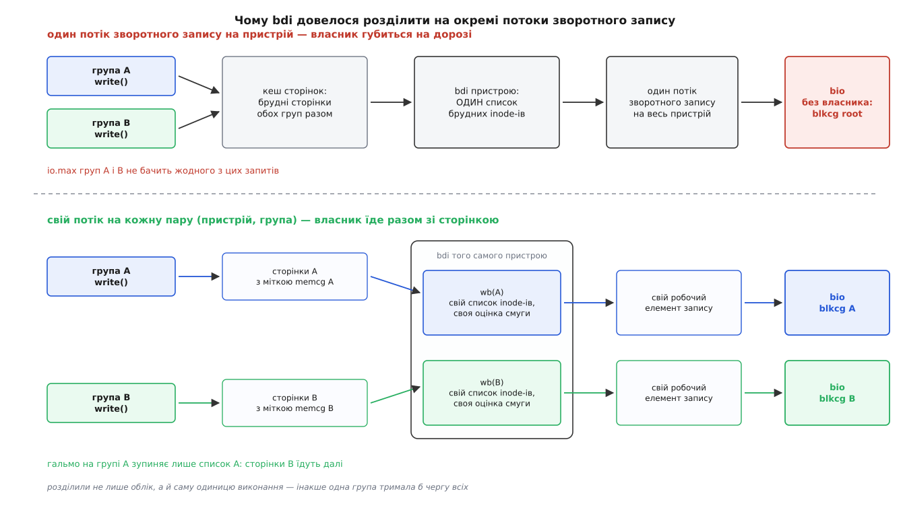
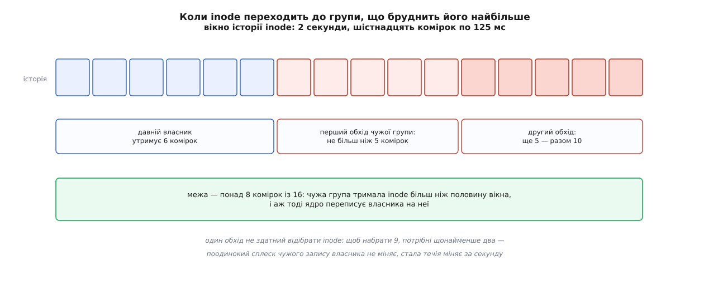
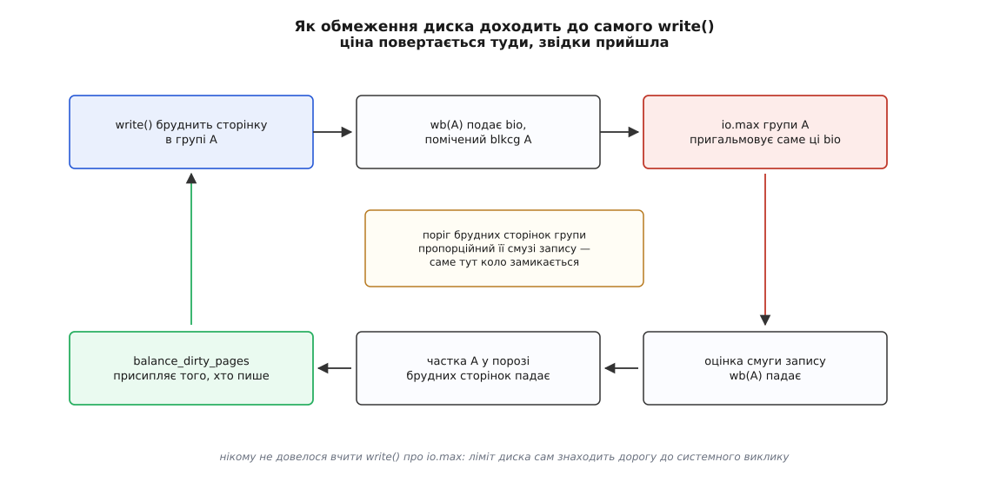

# Фоновий запис по cgroup: чия брудна сторінка й хто платить за її злив

<preknowlist>
- [Кеш сторінок, fsync і довговічність запису](root:sys-unix/page-cache-durability) — `write()` лише бруднить сторінку в пам'яті, а на диск її пізніше скидає окремий механізм — зворотний запис.
- [cgroups: облік і обмеження ресурсів](root:sys-unix/cgroups-resource-model) — групи процесів, їхня ієрархія, контролери `memory` та `io` і дві версії інтерфейсу.
- [Обмеження блокового вводу-виводу по cgroup](root:sys-unix/io-cgroup-control) — `io.max`, `io.latency` та `iocost`: чим саме контролер `io` тисне на групу.
- [Inode: файл без імені](root:sys-unix/inode-model) — вміст файлу описує inode, і саме він, а не ім'я, є одиницею обліку в ядрі.
- [Буферизований і прямий ввід-вивід](root:sys-unix/buffered-and-direct-io) — різниця між записом через кеш і записом повз нього.
- [Блоковий пристрій: сектори, блоки й черга запитів](root:sys-unix/block-device-model) — bio як одиниця запиту й черга, у яку його подають.
- [Потоки ядра: задачі без простору користувача](root:sys-unix/kernel-threads) — робота, яку ядро виконує власними задачами, поза будь-яким процесом.
- [Свопінг і витіснення сторінок](root:sys-unix/swap-and-reclaim) — чому брудну сторінку не можна просто викинути й чому витіснення впирається у зворотний запис.
</preknowlist>

## Ліміт, якого ніхто не порушив

Контейнерові виставили чесний ліміт: не більш ніж десять мегабайтів запису на секунду. Усередині запускають звичайне копіювання чотиригігабайтного файлу. Монітор диска показує шістсот мегабайтів на секунду — увесь ресурс пристрою з'їдено за сім секунд, сусідні служби задихаються.

Найцікавіше починається, коли зазирнути в облік. У самої групи лічильник записаних байтів майже нульовий: за її словами, вона диска не чіпала. Зате в кореневої групи, яка нічого не запускала, — усі чотири гігабайти. Ліміт не зламали й не обійшли. Він просто ніколи не побачив цього трафіку, бо на диск писав не той, хто писав у файл.

Причина в тому, як улаштований звичайний буферизований запис. `write()` закінчується тоді, коли байти лягли в сторінку кешу, а сторінку позначено брудною, — жоден байт при цьому не пішов на пристрій. Справжня робота з диском відбудеться колись потім: через тридцять секунд за таймером, або раніше — коли брудних сторінок набереться забагато, або коли комусь у системі забракне пам'яті. Виконає її не програма, а окрема задача ядра.

А рахунок за ввід-вивід виписують у момент подання запиту в чергу пристрою. Хто подав — той і платить. Подала задача ядра, яка не належить до жодної групи, і всі байти пішли на корінь ієрархії.

## Дві різні речі, які губляться в цьому розриві

Розрив між «забруднив» і «записав» коштує двох речей, і плутати їх не можна.

Перша — **особа платника**. У момент подання запиту від сторінки лишився самий вміст: ані процесу, ані групи в тій точці вже нема. Це втрата обліку.

Друга — **окремішність черг**. Список брудних inode-ів на пристрої був один, і обробляла його одна задача. Навіть якби платника вдалося впізнати, гальмувати його запити означало б зупинити цю єдину задачу — а разом із нею й зворотний запис сторінок усіх інших груп. Група з лімітом у мегабайт на секунду й двома гігабайтами брудного кешу перетворилася б на пробку для всієї машини. Це втрата ізоляції.

Полагодити треба обидві, причому друга диктує форму рішення: недостатньо приліпити до сторінки ярлик власника — доводиться розділити саму одиницю виконання.

## Одиниця, яку довелося розділити

Пристрій, на який скидають брудні сторінки, ядро описує структурою `backing_dev_info` (bdi, англ. *backing device* — «пристрій-підкладка», той, що стоїть за кешем). У ній колись жило геть усе: список брудних inode-ів, оцінка досягнутої смуги запису, робочий елемент, що запускає зворотний запис, ліміти на частку кешу. Одна така структура на пристрій — і, відповідно, один потік зворотного запису.

Від версії 4.2 (літо 2015 року, робота Теджуна Хео) виконавчу частину винесли в окрему структуру `bdi_writeback` — далі просто **wb**. Пристрій тепер тримає не одну таку структуру, а стільки, скільки груп забруднили на ньому хоч одну сторінку; знайти потрібну можна за ідентифікатором групи пам'яті в дереві, що висить на bdi. Кожен wb має власний список брудних inode-ів, власний робочий елемент, власну оцінку смуги й вказівник на групу вводу-виводу, якій виписувати рахунок.



*Розділили не лише облік, а й чергу з виконавцем — інакше пригальмована група тримала б зворотний запис усієї машини.*

Тепер обидві втрати закриті одним рухом. Запит, поданий із wb групи A, несе на собі мітку саме цієї групи вводу-виводу. А пригальмування цього wb зупиняє рівно його список — сторінки групи B лежать в іншому списку, і їх записує інший робочий елемент.

## Сторінка знає власника, а записують назад inode

Далі виникає розбіжність, з якої ростуть майже всі відомі межі цього механізму.

Облік пам'яті ведеться **посторінково**: коли сторінка кешу народжується, її записують на рахунок тієї групи, чий процес спричинив її появу, і ця мітка живе разом зі сторінкою до самого звільнення. А зворотний запис улаштований **поінодно**: потік зворотного запису бере зі списку inode й пише всі його брудні сторінки. Питання «чия ця сторінка» має точну відповідь; питання «чий цей inode» — не має, бо в один файл здатні писати кілька груп.

Ядро пішло на свідоме спрощення: в inode-а один власник у кожен момент, поле `i_wb` вказує на wb тієї групи, яка забруднила його першою. Просто, дешево — і неправильно щоразу, коли файл переходить із рук у руки. Файл, у який до перезапуску служби писала одна група, а після перезапуску пише інша, лишився б записаним на давно неактуального платника назавжди.

Тому власника перевіряють на кожному обході. Поки потік зворотного запису пише сторінки inode-а, файлова система повідомляє про кожну з них, яка група її забруднила. Наприкінці обходу серед цих голосів шукають переможця — не сумуванням, а [голосуванням більшості](root:sf-algorithms/majority-vote-boyer-moore) за алгоритмом Бойєра — Мура: один прохід, один кандидат і один лічильник, без жодної таблиці на групу. Це важливо, бо обхід відбувається в гарячому шляху зворотного запису, і дозволити собі там словник із лічильниками ядро не може.

Результат обходу не міняє власника відразу — він потрапляє в шістнадцятибітову історію inode-а. Вікно історії — дві секунди, поділені на шістнадцять комірок по 125 мс; один обхід має право зайняти не більш ніж п'ять комірок, а щоб власника переписали, чужій групі треба більш ніж вісім комірок із шістнадцяти — тобто дев'ять.



*Стеля в п'ять комірок на обхід означає, що одного обходу для перевороту замало: потрібні щонайменше два поспіль.*

З цих трьох чисел випливає рівно та поведінка, якої хотіли. Разовий сплеск чужого запису — п'ять комірок із шістнадцяти — власника не міняє; стала течія з іншої групи набирає потрібні дев'ять за два обходи, тобто приблизно за секунду, і inode переїжджає. Дрижання між двома власниками при цьому неможливе: щоб відібрати inode назад, треба знову пройти той самий поріг.

Ціна спрощення лишається й нікуди не дінеться. Поки дві групи пишуть в **один файл одночасно**, увесь його зворотний запис списують на одну з них — на ту, що переважає. Документація ядра каже про це прямо: такий спосіб користування підтримано погано, і його краще уникати. На практиці це означає, що спільний лог-файл, у який пишуть контейнери-сусіди, робить облік запису для них усіх фікцією.

> 🔧 **Навіщо це.** Правило проєктування, яке звідси випливає, просте: якщо ви розраховуєте на облік і обмеження запису по групах, кожен файл має мати одного постійного дописувача. Спільний файл на кількох — не «трохи неточний облік», а повністю недійсний для всіх його дописувачів, крім переможця. Служби, які пишуть у спільний каталог власними файлами, обліковуються правильно; служби, які пишуть в один файл через спільний дескриптор, — ні.

## Чому це живе тільки у другій версії cgroup

Власника сторінки визначає контролер пам'яті. Рахунок за ввід-вивід виписують контролерові блокового вводу-виводу. Щоб механізм працював, потрібна однозначна відповідь на питання: якій групі вводу-виводу відповідає ось ця група пам'яті.

У першій версії cgroup такої відповіді не існує в принципі. Кожен контролер там має власну незалежну ієрархію, і процес приписаний до кожної окремо: один процес може лежати у групі пам'яті `/db` і групі вводу-виводу `/batch`, а другий — у тій самій `/db`, але в `/interactive`. Групі пам'яті `/db` тоді просто нема чого поставити у відповідність: платників двоє й вони різні.

У другій версії ієрархія одна. Група — це один вузол дерева, до якого прив'язані обидва контролери одночасно, тож відповідність не треба обчислювати, вона є за побудовою. Тому фоновий запис по групах працює лише на cgroup v2 і лише тоді, коли на потрібній гілці ввімкнено обидва контролери — `memory` та `io`. Це, до речі, один із найвагоміших технічних аргументів, чому першу версію інтерфейсу довелося замінити, а не розширити.

## Файлова система теж мусить погодитися

Запити на запис ядро не будує саме: їх складає файлова система у своєму коді зворотного запису, бо тільки вона знає, які логічні блоки де лежать. Отже, мітку власника мусить ставити вона.

Обов'язків у файлової системи три: оголосити прапорцем на суперблоці, що вона це вміє; при створенні запиту проштампувати його групою з поточного wb; і повідомляти під час обходу, чиї саме сторінки в цей запит потрапили, — з цих повідомлень і збирається голосування, що визначає власника inode-а. Точні імена й місця цих викликів розібрано у [контракті для файлової системи](root:sys-unix/cgroup-writeback/api-cgwb-contract.md).

Сьогодні прапорець ставлять ext2, ext4, btrfs, f2fs та XFS. На всьому іншому — на мережевих файлових системах, на більшості накладених і псевдо-ФС — увесь фоновий запис іде на кореневу групу, і жодного попередження про це система не видає. Ліміт ви виставили, він навіть існує в ядрі, тільки трафік проходить повз нього.

## Дві гальмівні системи й пасок між ними

Тепер до головного питання: хто саме платить за злив брудної сторінки, коли платника нарешті впізнали.

**Переднє гальмо тисне на того, хто бруднить.** Наприкінці кожного `write()` ядро дивиться, скільки в системі брудних сторінок, і, якщо забагато, присипляє того, хто пише, доти, доки зворотний запис не наздожене. Поріг — це частка придатної до бруднення пам'яті, за замовчуванням п'ята.

Біда в тому, що для контейнера цей поріг рахувався від пам'яті **всієї машини**. Ось що виходило.

**Контейнер на гігабайт на машині з чвертю терабайта пам'яті:**

```
Глобальний домен
  придатне до бруднення   ≈ 256 ГіБ
  поріг присипляння       = 0.20 · 256 ГіБ  = 51.2 ГіБ
  поріг фонового запису   = 0.10 · 256 ГіБ  = 25.6 ГіБ

Група: memory.max = 1024 МіБ, спожито 900 МіБ, з них файлового кешу 700 МіБ
  запас до межі           = 1024 − 900      =  124 МіБ
  придатне до бруднення   =  700 + 124      =  824 МіБ
  поріг присипляння       = 0.20 · 824 МіБ  ≈  165 МіБ
  поріг фонового запису   = 0.10 · 824 МіБ  ≈   82 МіБ
```

Глобальні 51.2 ГіБ контейнер із лімітом у гігабайт не набере ніколи — переднє гальмо для нього не існує. Він бруднить свою пам'ять, доки не впреться в `memory.max`, там запускається витіснення, витіснення натикається на суцільні брудні сторінки, забрати їх не може, чекає на їхній зворотний запис — і контейнер зупиняється весь, разом із тими своїми потоками, які диска взагалі не чіпали.

Тому доменів стало два: глобальний і домен групи пам'яті. Другий рахує ту саму частку, але від того, що доступно **цій** групі: її файлові сторінки плюс запас до її ж межі. Далі беруть суворіший із двох порогів. У прикладі вище сплячку призначає межа групи: 165 МіБ проти 51.2 ГіБ. Той, хто пише, засинає задовго до `memory.max`, і витіснення ніколи не зустрічає стіни з брудного.

**Заднє гальмо тисне на диск.** Запит зворотного запису несе мітку групи, тож `io.max`, `io.latency` та `iocost` бачать його як свій і тиснуть на нього так само, як на пряме читання з тієї самої групи.

І тут лишається останнє питання, найцікавіше. Заднє гальмо стримує потік зворотного запису — задачу ядра. Той, хто пише, до неї не має жодного стосунку й нічого не чекає. Що заважає йому й далі бруднити пам'ять із повною швидкістю, поки пригальмований потік ледь-ледь тягне?

Відповідь у тому, як рахують поріг брудних сторінок для окремого wb. Цей поріг **пропорційний досягнутій смузі запису** цього wb — не заявленій, а виміряній за фактом уже виконаної роботи. Коло замикається саме тут.



*Тиск знизу піднімається вгору саме по тому шляху, яким сторінки спускалися вниз.*

Запити пригальмовано — виміряна смуга wb падає. Смуга впала — частка цього wb у порозі брудних сторінок стиснулася. Поріг стиснувся — переднє гальмо спрацьовує раніше й тримає довше. Той, хто пише, засинає в `write()` — і темп бруднення сам собою сходиться до того, що дозволяє `io.max`. Нікому не довелося вчити `write()` про ліміт диска: тиск піднявся знизу вгору тим самим шляхом, яким сторінки спускалися вниз. Історію того, як цей зворотний зв'язок збирали й чому першу спробу довелося викинути, розібрано [окремо](root:sys-unix/cgroup-writeback/hist-one-owner-per-inode.md).

## Де воно й досі протікає

Механізм закриває головну дірку, але не всі. Знати межі варто наперед.

**Метадані й журнал.** Облік ловить лише сторінки з даними файлів. Створення файлу, зміна розміру, оновлення часу доступу — це зміни метаданих, і на диск їх скидає журнал: у ext4 — окрема задача ядра, спільна для всієї файлової системи. Вона нічия, тож її запис іде на корінь. Робоче навантаження з мільйона крихітних файлів обліковується, м'яко кажучи, приблизно.

Гірше того, спроби обліковувати журнальний ввід-вивід чесно впираються в те, що журнал спільний. Якщо запит, поданий під замком журналу, потрапляє під `io.max` пригальмованої групи, замок не звільняється — і всі, хто на нього чекає, платять за чужий ліміт, хоч би яких лімітів не мали самі. Такі випадки описано в розсилках ядра як реальні виробничі збої; питання, чи взагалі варто обліковувати метадані по групах, лишається відкритим.

**Прямий ввід-вивід повз кеш** узагалі не має цієї проблеми: він подає запити в контексті того, хто його викликав, і обліковувався правильно завжди — ще до появи всього описаного механізму.

**Своп** живе окремим шляхом і зі своїм обліком; правила зворотного запису файлових сторінок до нього не застосовні.

**Непідтримана файлова система, cgroup першої версії, вимкнений контролер `io`** — у всіх трьох випадках механізм тихо вироджується в те, що було: увесь фоновий запис на корінь. Мовчки, без помилки. Тому перевірку — чи справді ваші ліміти щось обмежують — робіть не за конфігурацією, а за лічильниками: у `memory.stat` групи є поля брудних сторінок і сторінок у процесі зворотного запису, а в `io.stat` — записані байти. Практичну перевірку на живій машині зібрано в [лабораторній](root:sys-unix/cgroup-writeback/proj-whose-write-is-it.md).

Прикметно, що всі ці протікання мають спільну форму, і вона ж пояснює, чому їх так важко закрити: скрізь, де лишився **один спільний виконавець на всіх** — журнальна задача, потік непідтриманої файлової системи, кореневий wb, — облік по групах вироджується, і разом із ним зникає ізоляція. Відкласти роботу на потім можна лише разом із іменем замовника **і** його власною чергою; варто випустити з рук одне з двох — і рахунок знову виписують не тому.
