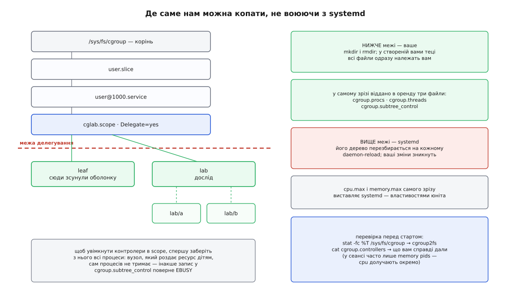
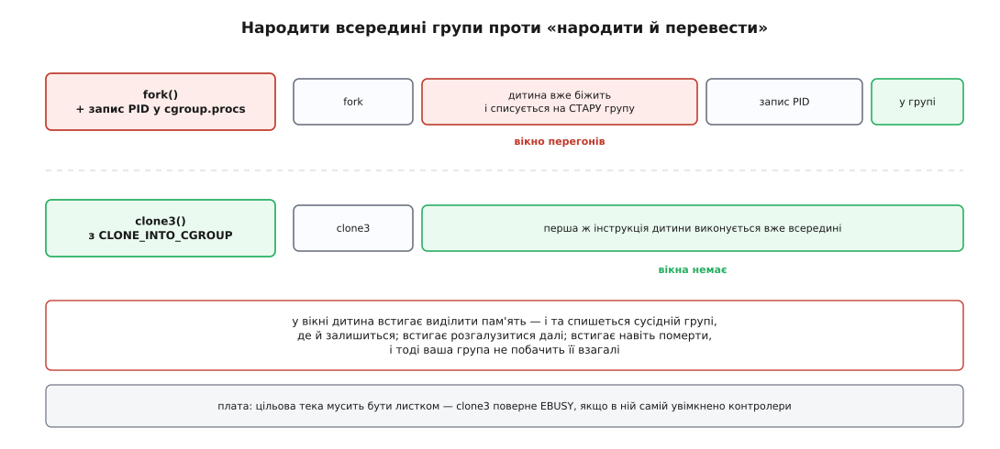

# ⚙️ cgroup своїми руками: власне піддерево, стелі, замороження і наглядач на C

Це розбір на живій машині: за півгодини ви отримаєте власний шматок `/sys/fs/cgroup`, поставите на нього стелі процесора й пам'яті, побачите на власні очі і замороження за квотою, і смерть від нестачі пам'яті всередині групи, а наприкінці напишете невеликого наглядача на C, який народжує роботу вже в потрібній групі й читає її лічильники, поки вона біжить. Усе робиться правами звичайного користувача й нічого в системі не ламає.

### Задача

Пройти повний цикл: **створити** групу, **поставити** правила, **побачити** їхню дію числами, **прочитати** лічильники з програми, **прибрати** за собою.

Головна перешкода тут не технічна. Дерево `/sys/fs/cgroup` на типовій машині — не нічийна земля: ним від першої секунди завантаження керує один менеджер, [systemd](topic:sys-unix/systemd-model), і кожен його вузол відповідає юнітові, зрізу або сеансу. Каталог, створений вами в чужому піддереві, живе рівно до наступної перезбірки конфігурації, а виставлені руками ліміти зникають ще швидше — їх перезапише той, хто вважає цей вузол своїм. Тому перше завдання — не «створити групу», а **знайти місце, де створювати її дозволено**.

### Задум: узяти піддерево в оренду

Місце таке передбачене, і зветься воно делегуванням. Менеджер може позначити один свій вузол як межу: нижче цієї межі він більше нічого не перезбирає й не чіпає, а власником каталогу робить вас. Тоді `mkdir` усередині — законна операція, і все, що ви там створите, належить вам разом з усіма файлами: ядро видає новоствореному каталогові й файлам у ньому uid того, хто його створив. Саме на цьому тримаються контейнери без root: рушій дістає піддерево й розпоряджається ним, не маючи жодних прав вище межі.



*Вище межі — чуже й перезбиране; нижче — ваше й стабільне.*

Просимо межу однією командою:

```sh
# чи це справді друга версія — має відповісти cgroup2fs
stat -fc %T /sys/fs/cgroup

# власний вузол із делегуванням; далі все відбувається в цій оболонці
systemd-run --user --scope --unit=cglab -p Delegate=yes bash
```

### Крок 1. Знайти себе і звільнити вузол

Нова оболонка вже сидить у власному вузлі `cglab.scope`. Дізнатися, де саме, можна в неї самої: `/proc/self/cgroup` у другій версії має рівно один рядок, і третє поле в ньому — шлях від кореня ієрархії.

```sh
CG=/sys/fs/cgroup$(grep '^0::' /proc/self/cgroup | cut -d: -f3)
echo "$CG"
# /sys/fs/cgroup/user.slice/user-1000.slice/user@1000.service/app.slice/cglab.scope

cat "$CG/cgroup.controllers"
# memory pids
```

Вивід другої команди — перша несподіванка. `cgroup.controllers` перелічує не всі контролери ядра, а **те, що вам віддав батько**. У користувацькому сеансі це часто лише пам'ять і кількість процесів: процесорний контролер додає роботу до кожного перемикання контексту, тож умикати його на всьому дереві сеансів дистрибутиви не поспішають. Долучається він явно й один раз:

```sh
# /etc/systemd/system/user@.service.d/delegate.conf
[Service]
Delegate=cpu cpuset io memory pids
```

Після `systemctl daemon-reload` і повторного входу в сеанс `cgroup.controllers` покаже `cpu cpuset io memory pids`. Тепер спробуємо роздати ці контролери власним дітям — і одразу впремося в правило, яке варте того, щоб побачити його помилкою, а не прочитати:

```sh
mkdir "$CG/leaf" "$CG/lab"
echo "+cpu +memory" > "$CG/cgroup.subtree_control"
# bash: echo: write error: Device or resource busy
```

`EBUSY` тут означає буквально таке: у вузлі досі сидить наша оболонка. Вузол, який роздає ресурс дітям, сам процесів тримати не може — інакше довелося б порівнювати частку вузла з часткою його ж дитини, а вузол уже включає дитину в себе. Тому оболонку треба зсунути в листок, і аж тоді роздавати:

```sh
echo $$ > "$CG/leaf/cgroup.procs"          # процес може перевести сам себе
echo "+cpu +memory" > "$CG/cgroup.subtree_control"

ls "$CG/lab" | grep -E '^(cpu|memory)\.' | head -6
# cpu.max
# cpu.stat
# cpu.weight
# memory.current
# memory.events
# memory.high
```

Каталог `lab` ми створили **до** ввімкнення контролерів, і порожнім він не залишився: файли з'явилися в ньому тієї ж миті, коли батько оголосив, що роздає `cpu` і `memory`. Ці файли створює не сама група, а її батько — тому склад каталогу залежить не від того, що вміє ядро, а від одного рядка на поверх вище. Повний перелік того, які файли від якого контролера й що в них лежить, зібрано в [довідці інтерфейсу cgroup v2](topic:sys-unix/cgroups-resource-model/api-cgroup2-interface.md).

### Крок 2. Стеля на процесор — і замороження на очах

Ставимо квоту «два процесори» й запускаємо вісім нескінченних лічильників. Кожна дужка нижче — окрема підоболонка, яка спершу переводить сама себе в `lab`, а тоді починає крутитися:

```sh
echo "200000 100000" > "$CG/lab/cpu.max"

for i in $(seq 8); do
  ( echo $BASHPID > "$CG/lab/cgroup.procs"; while :; do :; done ) &
done

sleep 10
cat "$CG/lab/cpu.stat"
kill $(cat "$CG/lab/cgroup.procs")
```

Через десять секунд `cpu.stat` каже те, чого не скаже жоден `top`: не лише скільки взяли, а **скільки не дали взяти**.

**Що прочитано після 10 секунд.**

```
nr_periods       100
nr_throttled      99
throttled_usec   7431052
usage_usec      19987340

частка часу в заморозці = 7431052 / (100 × 100000) = 0.743
середня частка ЦП       = 19987340 / 10000000     = 2.0 процесора
```

Обіцянку дотримано з точністю до тисячної: два процесори в середньому. Але прийшли вони сплеском — сімдесят чотири відсотки часу група лежала знятою з ядер, і решта машини при цьому простоювала. Ось чому в службі, яка «час від часу гальмує без видимої причини», перше, що варто прочитати, — `nr_throttled` її групи: ненульове значення закриває питання швидше за будь-який профілювальник.

### Крок 3. Гальмо, а тоді смерть

З пам'яттю цікаво те, що однакове на вигляд перевищення дає геть різний результат залежно від того, чи є що в групи відібрати.

Спершу випадок, коли є. Сторінки кеша файлів ядро викидає без жодних наслідків — тому `memory.high` тут працює як гальмо, а не як гільйотина:

```sh
echo max > "$CG/lab/cpu.max"      # стеля процесора більше не потрібна
echo 64M > "$CG/lab/memory.high"

# гігабайт у кеш сторінок — руками самої групи
( echo $BASHPID > "$CG/lab/cgroup.procs"
  exec dd if=/dev/zero of="$HOME/big" bs=1M count=1024 status=none )

cat "$CG/lab/memory.current"                 # 67 076 096  — тримається біля позначки
grep -E '^(high|max|oom)' "$CG/lab/memory.events"
# high 12043
# max 0
# oom 0
```

Дванадцять тисяч разів нитку присипляли на виході з ядра, змушуючи її саму відбирати сторінки, — і жодного разу не вбили. Гігабайт записано, група ніколи не переросла шістдесят чотири мегабайти.

Запускати `dd` зсередини групи довелося не з косметичних міркувань. Сторінка списується на того, хто торкнувся її **першим**, і залишається за ним, поки не звільниться. Якби ми створили файл в оболонці, а потім прочитали його з `lab`, сторінки були б оплачені наперед — оболонкою, — і читання не коштувало б групі нічого. Жодного гальма ми б не побачили.

Тепер випадок, коли відібрати нічого. Анонімна пам'ять, до якої програма щойно доторкнулася, нікуди не дінеться: на диску її нема, скинути в [своп](topic:sys-unix/swap-and-reclaim) ми зараз заборонимо. Потрібен той, хто цю пам'ять братиме:

```c
/* hog.c — брати пам'ять по 8 МіБ і торкатися кожної сторінки.
   Списання відбувається саме на доторку, а не на malloc.
   збірка: cc -O2 -o hog hog.c                                        */
#include <stdio.h>
#include <stdlib.h>
#include <unistd.h>

int main(void)
{
    const long chunk = 8L << 20;              /* 8 МіБ */
    long page = sysconf(_SC_PAGESIZE), took = 0;

    for (;;) {
        char *p = malloc(chunk);
        if (!p) { fprintf(stderr, "malloc відмовив на %ld МіБ\n", took); return 1; }
        for (long i = 0; i < chunk; i += page)
            p[i] = 1;                         /* доторк = сторінка списана на групу */
        took += chunk >> 20;
        printf("%ld МіБ\n", took);
        fflush(stdout);
        usleep(50 * 1000);
    }
}
```

```sh
echo max > "$CG/lab/memory.high"     # знімаємо гальмо, лишаємо саму стелю
echo 64M > "$CG/lab/memory.max"
echo 0   > "$CG/lab/memory.swap.max" # інакше група тихо піде у своп
echo 1   > "$CG/lab/memory.oom.group"

( echo $BASHPID > "$CG/lab/cgroup.procs"; exec ./hog )
echo "код виходу: $?"
# 8 МіБ
# …
# 56 МіБ
# код виходу: 137
```

**Що прочитано після смерті.**

```
memory.events:
  max              217      — стільки разів упиралися в стелю й таки відбили сторінки
  oom                1      — один раз відбити не вдалося
  oom_kill           1
  oom_group_kill     1      — убито групу цілком, а не одну задачу

код 137 = 128 + 9        — оболонка так повідомляє про SIGKILL
dmesg | tail -1
  Memory cgroup out of memory: Killed process 5127 (hog) …
```

Двісті сімнадцять зіткнень зі стелею закінчилися успішним відбором сторінок і залишилися непоміченими; двісті вісімнадцяте закінчилося вбивством. Найважливіше в цьому виводі — слово `cgroup` у рядку ядра: жертву обрали **серед задач цієї групи**, і решта машини навіть не здригнулася. Глобальний [OOM-killer](topic:sys-unix/overcommit-and-oom) на такому ж перевищенні пішов би шукати найтовстішу жертву по всій системі й міг би вбити зовсім не того, хто винен.

### Крок 4. Наглядач: народити роботу вже всередині

Усе дотепер робилося тим самим способом: процес народжується, а тоді сам себе переводить. У цьому способі є вікно.

Між `fork` і записом номера в `cgroup.procs` дитина вже виконується. За ці мікросекунди вона встигає виділити пам'ять — і та спишеться на стару групу, де й залишиться назавжди, бо перенести вже нарахований рахунок неможливо. Встигає розгалузитися далі — і ті внуки залишаться поза вашою групою. У найгіршому разі встигає померти — і ви не побачите її взагалі. На порожній машині вікно мале; на завантаженій воно розтягується рівно на стільки, скільки ваш батьківський процес сам чекав на процесор.



*Одне й те саме завдання: у першому випадку між народженням і переведенням є проміжок, у другому його немає за побудовою.*

Вікно закривається на рівні ядра. Виклик `clone3` уміє прийняти дескриптор каталогу групи й створити дитину **одразу** в ній: прапорець `CLONE_INTO_CGROUP` з полем `cgroup` у структурі аргументів з'явився в Linux 5.7. Обгортки в libc для `clone3` немає — його кличуть через `syscall` напряму ([чим ще народжують процес](topic:sys-unix/spawn-alternatives)).

Складемо з цього наглядача. Він створює групу, виставляє правила, народжує в ній команду, чекає — і звітує. Чекає він не на дитину: дитина може вмерти, лишивши по собі внуків, а нас цікавить уся робота. Тому наглядач чекає на `cgroup.events`, який перемикає поле `populated` у нуль, коли піддерево спорожніло цілком. Заразом він ставить поріг на `memory.pressure` і дізнається про застій пам'яті **до того**, як справа дійде до стелі ([тиск на ресурси](topic:sys-unix/load-and-pressure)). Обидва файли сповіщають через `POLLPRI`, тож чекання коштує нуль ([select, poll, epoll](topic:sys-unix/select-poll-epoll)).

```c
/* supervise.c — запустити команду у власній cgroup і звітувати, чим вона там жила.
   збірка: cc -O2 -Wall -Wextra -o supervise supervise.c
   вжиток: ./supervise /sys/fs/cgroup/…/cglab.scope make -j16                    */

#define _GNU_SOURCE
#include <errno.h>
#include <fcntl.h>
#include <limits.h>
#include <poll.h>
#include <signal.h>
#include <stdint.h>
#include <stdio.h>
#include <stdlib.h>
#include <string.h>
#include <sys/stat.h>
#include <sys/syscall.h>
#include <sys/wait.h>
#include <unistd.h>

#ifndef SYS_clone3
#define SYS_clone3 435              /* однаковий номер на всіх сучасних архітектурах */
#endif
#ifndef CLONE_INTO_CGROUP
#define CLONE_INTO_CGROUP 0x200000000ULL
#endif

/* struct clone_args ядра — версія з полем cgroup (Linux 5.7+) */
struct cl_args {
    uint64_t flags, pidfd, child_tid, parent_tid, exit_signal;
    uint64_t stack, stack_size, tls, set_tid, set_tid_size, cgroup;
};

static void die(const char *what) { perror(what); exit(1); }

static void put(int dir, const char *name, const char *val)
{
    int fd = openat(dir, name, O_WRONLY | O_CLOEXEC);
    if (fd < 0) die(name);
    if (write(fd, val, strlen(val)) < 0) die(name);
    close(fd);
}

static char *reread(int fd, char *buf, size_t n)          /* перечитати з початку */
{
    if (lseek(fd, 0, SEEK_SET) < 0) return NULL;
    ssize_t k = read(fd, buf, n - 1);
    if (k < 0) return NULL;
    buf[k] = '\0';
    return buf;
}

static char *slurp(int dir, const char *name, char *buf, size_t n)
{
    int fd = openat(dir, name, O_RDONLY | O_CLOEXEC);
    if (fd < 0) return NULL;
    char *r = reread(fd, buf, n);
    close(fd);
    return r;
}

/* значення ключа у файлі виду «ключ значення\n…»; -1, якщо ключа немає */
static long long key(const char *text, const char *name)
{
    size_t len = strlen(name);
    for (const char *p = text; p && *p; ) {
        if (!strncmp(p, name, len) && p[len] == ' ')
            return strtoll(p + len + 1, NULL, 10);
        p = strchr(p, '\n');
        if (p) p++;
    }
    return -1;
}

int main(int argc, char **argv)
{
    if (argc < 3) {
        fprintf(stderr, "вжиток: %s <батьківська-cgroup> <команда> [аргументи…]\n", argv[0]);
        return 2;
    }

    char path[PATH_MAX];
    snprintf(path, sizeof path, "%s/job-%d", argv[1], (int)getpid());
    if (mkdir(path, 0755) < 0) die("mkdir cgroup");

    int cg = open(path, O_RDONLY | O_DIRECTORY | O_CLOEXEC);
    if (cg < 0) die("open cgroup");

    put(cg, "memory.max",       "512M");
    put(cg, "memory.swap.max",  "0");
    put(cg, "memory.oom.group", "1");
    put(cg, "cpu.max",          "200000 100000");

    /* поріг тиску: 200 мс застою пам'яті за 2-секундне вікно.
       Дескриптор мусить лишатися відкритим — закриєш, і поріг зникне.       */
    static const char trig[] = "some 200000 2000000";
    int psi = openat(cg, "memory.pressure", O_RDWR | O_CLOEXEC);
    if (psi >= 0 && write(psi, trig, sizeof trig - 1) < 0) {
        close(psi);                      /* PSI вимкнено в ядрі — обійдемося */
        psi = -1;
    }

    /* cgroup.events треба один раз прочитати, інакше poll() не матиме
       від чого відштовхуватися: сповіщення озброюється саме читанням.       */
    int ev = openat(cg, "cgroup.events", O_RDONLY | O_CLOEXEC);
    if (ev < 0) die("cgroup.events");
    char buf[8192];
    reread(ev, buf, sizeof buf);

    struct cl_args args = {
        .flags       = CLONE_INTO_CGROUP,
        .exit_signal = SIGCHLD,
        .cgroup      = (uint64_t)cg,
    };
    long pid = syscall(SYS_clone3, &args, sizeof args);
    if (pid < 0) die("clone3");
    if (pid == 0) {                      /* перша інструкція дитини — уже в групі */
        execvp(argv[2], &argv[2]);
        _exit(127);
    }

    struct pollfd fds[2] = {
        { .fd = ev,  .events = POLLPRI, .revents = 0 },
        { .fd = psi, .events = POLLPRI, .revents = 0 },   /* -1 poll() просто ігнорує */
    };
    long stalls = 0;

    for (;;) {
        if (poll(fds, 2, -1) < 0) {
            if (errno == EINTR) continue;
            die("poll");
        }
        if (fds[1].revents & POLLPRI) {
            stalls++;
            fprintf(stderr, "[тиск] понад 200 мс застою пам'яті за останні 2 с\n");
        }
        if (fds[0].revents & POLLPRI) {
            if (!reread(ev, buf, sizeof buf)) die("cgroup.events");
            if (key(buf, "populated") == 0) break;   /* спорожніло все піддерево */
        }
    }

    int st = 0;
    while (waitpid((pid_t)pid, &st, 0) < 0)
        if (errno != EINTR) die("waitpid");

    if (slurp(cg, "cpu.stat", buf, sizeof buf))
        printf("процесор: %.3f с; періодів %lld, заморожень %lld, у заморозці %.3f с\n",
               key(buf, "usage_usec") / 1e6, key(buf, "nr_periods"),
               key(buf, "nr_throttled"), key(buf, "throttled_usec") / 1e6);

    if (slurp(cg, "memory.events", buf, sizeof buf))
        printf("пам'ять:  гальмувань %lld, упирань у стелю %lld, OOM %lld, убито %lld\n",
               key(buf, "high"), key(buf, "max"), key(buf, "oom"), key(buf, "oom_kill"));

    if (slurp(cg, "memory.peak", buf, sizeof buf))
        printf("пік:      %.1f МіБ\n", strtoll(buf, NULL, 10) / 1048576.0);

    printf("тиск:     %ld спрацювань порога\n", stalls);
    if (WIFSIGNALED(st)) printf("вихід:    сигнал %d\n", WTERMSIG(st));
    else                 printf("вихід:    код %d\n", WEXITSTATUS(st));

    close(ev);
    if (psi >= 0) close(psi);
    close(cg);
    if (rmdir(path) < 0) perror("rmdir");
    return 0;
}
```

Батьківський вузол, який передають наглядачеві першим аргументом, мусить роздавати контролери: у `cglab.scope` це вже зроблено, а в `lab` — ні, тому передаємо саме `$CG`. Інакше у створеному каталозі не буде ні `memory.max`, ні `cpu.max`, і перший же запис відмовить з `ENOENT`.

```
$ ./supervise "$CG" ./hog
[тиск] понад 200 мс застою пам'яті за останні 2 с
[тиск] понад 200 мс застою пам'яті за останні 2 с
процесор: 0.631 с; періодів 33, заморожень 0, у заморозці 0.000 с
пам'ять:  гальмувань 0, упирань у стелю 1841, OOM 1, убито 1
пік:      512.0 МіБ
тиск:     2 спрацювань порога
вихід:    сигнал 9
```

Два рядки про тиск з'явилися **за секунди до** смерті — це і є практична цінність PSI: споживання каже, скільки взяли, тиск каже, що роботі вже боляче. Наглядач, який дивиться на `memory.current`, дізнається про біду в момент вбивства; наглядач, який дивиться на `memory.pressure`, встигає підняти стелю, попросити роботу скинути кеш або хоча б записати в журнал, чому зараз усе впаде.

> 🔧 **Навіщо це.** Ці сто двадцять рядків — не навчальна іграшка, а скелет того, що робить будь-який рушій контейнерів і будь-який менеджер служб: створити вузол, виставити файли, народити процес усередині, дочекатися, поки піддерево спорожніє, зібрати підсумки, прибрати каталог. Решта рушія — це [простори імен](topic:sys-unix/namespaces), кореневий образ і мережа; облік і межі виглядають рівно так.

### Крок 5. Заморозити й убити піддерево цілком

Останні два файли варті окремої хвилини, бо вони роблять групу справді неподільною одиницею.

```sh
for i in 1 2 3; do
  ( echo $BASHPID > "$CG/lab/cgroup.procs"; while :; do :; done ) &
done

echo 1 > "$CG/lab/cgroup.freeze"
cat "$CG/lab/cgroup.events"      # populated 1 / frozen 1
```

Процеси живі й у `cgroup.procs` на місці, але процесора не беруть жодного такту — зручно, коли треба зняти знімок стану або дочекатися вільного диска. Недоторканними заморозка їх не робить: `SIGKILL` крізь неї проходить.

```sh
echo 1 > "$CG/lab/cgroup.kill"   # SIGKILL усьому піддереву, атомарно
cat "$CG/lab/cgroup.procs"       # порожньо
echo 0 > "$CG/lab/cgroup.freeze" # розморожуємо вузол, інакше він морозитиме й нових
```

Один запис замінює цілий цикл «прочитати список, розіслати сигнали, перечитати, повторити», який ніколи не був надійним: між читанням і сигналом устигали народитися нові задачі. Ядро натомість позначає групу приреченою, і задача, яка народиться після позначки, гине разом з рештою. Файл з'явився в Linux 5.14; на старших ядрах доводиться крутити цикл або спершу заморозити групу, а вже тоді розсилати сигнали.

Прибирати за собою наприкінці не обов'язково: досить вийти з оболонки, і systemd зупинить `cglab.scope` разом з усім, що ви в ньому наростили. А от `rmdir` руками працює лише знизу вгору й лише на порожньому вузлі — вузол з дітьми або з живою задачею відповідає `EBUSY`.

### Скільки це коштує

**Облік нічого не коштує, доки ви не питаєте.** Лічильники групи розкладені по процесорах і підсумовуються вгору по дереву лише тоді, коли хтось відкриває `cpu.stat` чи `memory.stat`. Одне читання коштує обходу того піддерева, у якому були оновлення, — на машині зі ста двадцятьма ядрами й кількома тисячами груп це помітно. Раз на секунду — не помітно взагалі; тисячу разів на секунду з наглядача, який «стежить за всім», — половина ядра на порожньому місці. `memory.current` дешевший за `memory.stat`, бо це одне число, а не таблиця.

**Чекання не коштує нічого.** `poll` на `cgroup.events` і на порозі тиску не витрачає нічого, поки нічого не сталося: будить вас ядро. Тому наглядач, побудований на порогах, дешевший за наглядача, побудованого на опитуванні, — і при цьому реагує швидше.

**Порожня група теж чогось варта.** Увімкнений контролер пам'яті означає набір лічильників на кожен процесор — на машині з сотнею ядер це десятки кілобайтів на кожну групу. Тисячі короткоживучих груп (одна на запит) з'їдають помітну частку пам'яті ядра ще до того, як почнеться робота.

**`rmdir` не звільняє все одразу.** Каталог зникає, а сама група живе далі, поки за нею числяться сторінки — типово сторінки кеша файлів, які ніхто не поспішає викидати. Ці «мертві» групи видно в полі `nr_dying_descendants` файлу `cgroup.stat` у батька. Цикл «створити групу — попрацювати — видалити» на кожен запит легко наганяє десятки тисяч таких мерців.

### Пастки

**Один запис — один номер.** `cgroup.procs` приймає рівно одне число за виклик `write`; `echo "$a $b" >` не спрацює, треба цикл. І запис переводить **усі** нитки процесу разом, а не одну: окремими нитками рухає `cgroup.threads`, і тільки всередині піддерева, оголошеного нитковим.

**Права на переїзд перевіряються з двох боків.** Щоб перевести задачу, замало прав на `cgroup.procs` призначення: потрібен ще запис у `cgroup.procs` спільного предка джерела й призначення ([біти прав](topic:sys-unix/permission-bits)). Саме це не дає орендареві піддерева витягти чужий процес до себе — і саме це ламає наївні скрипти, які «просто пишуть номер у файл» від імені звичайного користувача.

**Не перечитаєте — `poll` закрутиться вхолосу.** Сповіщення озброюється читанням: доки ви не прочитали файл після спрацювання, лічильник подій розходиться з тим, що запам'ятав дескриптор, і `poll` повертатиметься миттєво знову й знову. Той самий `lseek` на початок перед кожним читанням обов'язковий — інакше друге читання поверне нуль байтів.

**Поріг тиску живе, доки живе дескриптор.** Закриття файлу знімає поріг. І ще одне: непривілейованому користувачеві ядро дозволяє лише вікна, кратні двом секундам, тому `some 150000 1000000` від імені користувача поверне `EINVAL`, а `some 200000 2000000` пройде. Сам механізм PSI на частині дистрибутивів зібрано вимкненим — тоді файли `*.pressure` або відсутні, або відповідають `EOPNOTSUPP`, і вмикається він параметром ядра `psi=1`.

**Без `memory.swap.max` смерті ви не побачите.** Група з увімкненим свопом слухняно піде у своп і житиме там, повільна, але жива; лічильник `oom` залишиться нулем, а машина потроху стане. Ставити стелю пам'яті без стелі свопу — типова причина «ліміт стоїть, а не працює».

**`memory.current` — не RSS.** У ньому і кеш сторінок, і буфери сокетів, і структури ядра, які завела ця група. Порівнювати його з тим, що показує `ps`, безглуздо: це різні величини, пораховані за різними правилами ([як міряти пам'ять процесу](topic:sys-unix/memory-accounting)).

**Рахунок не їде за процесом.** Переведення задачі не переносить уже нараховану пам'ять — і це не недогляд, а свідоме рішення другої версії: сторінка знає лише, кому її списали, а не кому вона «мала б» належати. Побачити це коштує чотирьох команд:

```sh
echo "+memory" > "$CG/lab/cgroup.subtree_control"   # lab уже порожній
mkdir "$CG/lab/a" "$CG/lab/b"
( echo $BASHPID > "$CG/lab/a/cgroup.procs"; exec ./hog ) &   # стелі тут не стоїть
sleep 1; kill -STOP $!

cat "$CG/lab/a/memory.current"   # 176 160 768
echo $! > "$CG/lab/b/cgroup.procs"
cat "$CG/lab/a/memory.current"   # 176 160 768  ← не змінилося
cat "$CG/lab/b/memory.current"   #     135 168  ← майже нуль
```

Уся нарахована пам'ять залишилася числитися за групою, з якої процес уже пішов, і зникне звідти лише тоді, коли він її звільнить або помре. Практичний висновок простий: перевести довгоживучу службу в іншу групу «на льоту» — не те саме, що запустити її там; якщо облік важливий, службу треба перезапустити.

**Усередині контейнера `/proc/self/cgroup` показує інше.** Простір імен cgroup підміняє корінь: процес бачить `0::/`, хоча насправді сидить глибоко в чужому піддереві. Змонтована всередині `/sys/fs/cgroup` при цьому часто доступна лише для читання, а на старих системах узагалі може виявитися першою версією з окремою ієрархією на кожен контролер — тоді все написане вище не працює, і перевірка `stat -fc %T /sys/fs/cgroup` з першого кроку відповість `tmpfs` замість `cgroup2fs`.
