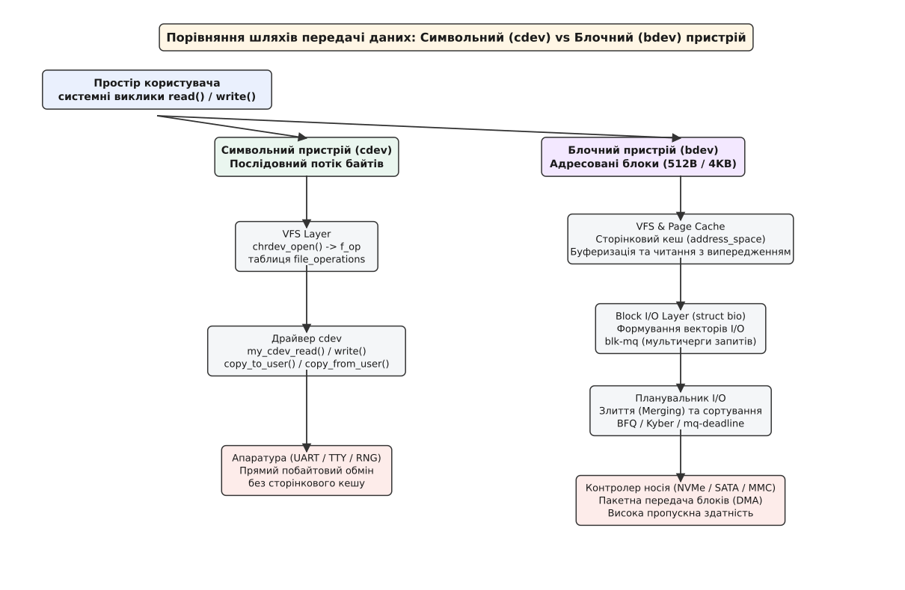
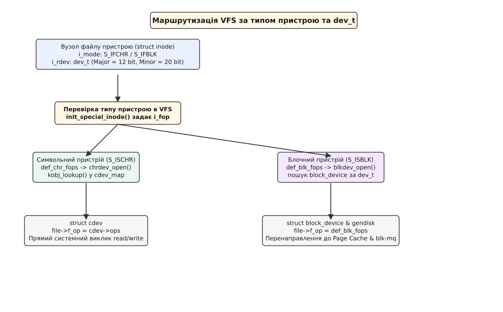

# Символьні та блочні пристрої

<preknowlist>
- [Все є файлом](topic:sys-unix/everything-is-a-file) — фундаментальна абстракція Unix, яка об'єднує різнородні ресурси під єдиним деревним простором імен.
- [Модель файлів пристроїв](topic:sys-unix/device-file-model) — як спеціальні файли у `/dev` пов'язують простір користувача з драйверами ядра.
- [Старші та молодші номери пристроїв](topic:sys-unix/major-minor-numbers) — механізм адресації `dev_t` (major/minor), що ідентифікує конкретний драйвер і екземпляр пристрою.
- [Віртуальна файлова система (VFS)](topic:sys-unix/vfs-layer) — абстрактний шар ядра, що перенаправляє системні виклики `read`, `write`, `ioctl` до операцій драйвера.
</preknowlist>

Коли програма у просторі користувача зчитує натиснуту клавішу з послідовного термінала, вона очікує отримати один-єдиний байт негайно після його появи. Коли та ж сама програма зберігає документ на SSD-накопичувач, вона передає мільйони байтів, а контролер диска записує їх у фізичні комірки флеш-пам'яті суцільними блоками фіксованого розміру.

Спроба об'єднати ці два кардинально різних фізичних світи під один універсальний код усередині операційної системи призвела б до катастрофи. Клавіатура змушена була б чекати на накопичення 4096 байтів перед відправкою події у додаток, або ж дисковий накопичувач швидко зносив би свої комірки, переписуючи 4 КіБ фізичного блоку заради кожної зміни окремого байта.

Операційні системи Unix та Linux розв'язують цю суперечність через чітке архітектурне роздвоєння файлів пристроїв у каталозі `/dev` на два фундаментальні класи: **символьні (character devices, cdev)** та **блочні (block devices, bdev)**.

## 1. Фундаментальне роздвоєння апаратури: потік проти масиву

В основі поділу пристроїв лежать фізичні властивості апаратного забезпечення, внутрішня організація мікросхем контролера та природа передачі даних:

- **Символьний пристрій (від англ. *character device*, cdev):** Представляє пристрій як **нескінченний послідовний потік байтів** (байтовий потік, byte stream). Читання або запис здійснюються байт за байтом (або довільними невеликими порціями). Дані, прочитані з символьного пристрою, зазвичай споживаються миттєво і не можуть бути зчитані повторно. Символьні пристрої не мають фіксованого розміру та у більшості випадків не підтримують позиціонування (`lseek` повертає помилку `-ESPIPE`).
- **Блочний пристрій (англ. *block device*, bdev):** Представляє пристрій як **адресований масив фіксованих блоків** (наприклад, по 512 байтів або 4 КіБ). Обмін даними відбувається виключно цілими блоками. Блочний пристрій підтримує довільний доступ (random access): програма може перемістити вказівник у будь-яку точку диска за допомогою `lseek()` і прочитати будь-який сектор у довільному порядку.

Фізична різниця виникає на рівні заліза. Послідовний порт UART або контролер миші генерують переривання на кожен прибулий байт або коротку пакетну послідовність. Дані складаються у кільцевий буфер (ring buffer) драйвера і зникають після зчитування. Натомість твердотілий накопичувач SSD або магнітний диск HDD оперують платою контролера з власним процесором, транслятором адресації FTL (Flash Translation Layer) та масивом DRAM-кешу. Вони записують дані цілими сторінками флеш-пам'яті (порядку кількох кілобайтів), а стирати можуть лише цілими блоками стирання (erase blocks), які на порядки більші за сторінку.

У ядрі Linux ця відмінність відображається і на рівні управління модулями. При відкритті символьного пристрою ядро через `fops_get()` бере посилання на модуль-власник таблиці операцій (поле `.owner`, тобто `THIS_MODULE` самого драйвера), щоб запобігти вивантаженню його коду з пам'яті під час виконання виклику `read()`. Для блочних пристроїв утримання посилань виконується як для диска `struct gendisk`, так і для відкритого об'єкта `struct block_device`.

Типовими представниками символьних пристроїв є термінали (`/dev/tty`), послідовні порти (`/dev/ttyS0`), миші, клавіатури, а також псевдопристрої ядра (`/dev/null`, `/dev/zero`, `/dev/urandom`). Блочними пристроями є жорсткі диски (`/dev/sda`), SSD-накопичувачі (`/dev/nvme0n1`), USB-флешки, SD-картки та RAM-диски (`/dev/ram0`).

## 2. Два шляхи в ядрі Linux: VFS routing та ініціалізація inode

Коли системний виклик `open()` відкриває файл у каталозі `/dev`, Віртуальна файлова система (VFS) зчитує дисковий або пам'ятневий вузол (inode) і перевіряє біти атрибута `inode->i_mode`. Якщо файл є спеціальним файлом пристрою, VFS викликає функцію `init_special_inode()`, яка розгалужує обробку залежно від маски макросів `S_ISCHR()` чи `S_ISBLK()`.

```c
// Спрощений фрагмент ініціалізації спеціального інода у ядрі Linux (fs/inode.c)
void init_special_inode(struct inode *inode, umode_t mode, dev_t rdev) {
    inode->i_mode = mode;
    if (S_ISCHR(mode)) {
        inode->i_fop = &def_chr_fops;   // єдиний робочий метод — chrdev_open()
        inode->i_rdev = rdev;
    } else if (S_ISBLK(mode)) {
        inode->i_fop = &def_blk_fops;   // вхід у блочний шар
        inode->i_rdev = rdev;
    }
}
```



*Архітектурне роздвоєння в ядрі Linux: символьний пристрій спрямовує виклики безпосередньо у драйвер, тоді як блочний проходить через Сторінковий кеш та шар Block I/O.*

### Шлях символьного пристрою (cdev)

Для символьного пристрою `inode->i_fop` ініціалізується внутрішньою таблицею `def_chr_fops`. Вона містить лише один робочий метод — `chrdev_open()`. 

Коли програма вперше виконує `open()`, ядро запускає `chrdev_open()`, яка бере 32-бітне число `i_rdev` (тип `dev_t`), і шукає зареєстрований пристрій викликом `kobj_lookup()` у глобальному реєстрі `cdev_map`, куди діапазони номерів потрапляють із `cdev_add()`. Окремий реєстр `chrdevs`, захищений мутексом `chrdevs_lock`, лише роздає й обліковує самі діапазони major-номерів. Знайшовши зареєстровану структуру `struct cdev`, ядро збільшує лічильник посилань через `kobject_get()` і підміняє вказівник `file->f_op` у об'єкті відкритого файла на таблицю операцій `file_operations`, надану безпосередньо драйвером цього пристрою.

Усі наступні системні виклики (`read()`, `write()`, `ioctl()`) заходять прямо в функції драйвера:
1. Процесор виконує системний виклик і переключається у режим ядра (kernel mode).
2. Драйвер cdev перевіряє доступність даних у своєму внутрішньому буфері.
3. Драйвер копіює дані між буфером ядра та буфером простору користувача за допомогою `copy_to_user()` або `copy_from_user()`.
4. Запит іде просто до драйвера, минаючи сторінковий кеш ядра та планувальники введення-виведення; чекати доводиться хіба що на самі дані від заліза.

### Шлях блочного пристрою (bdev)

Для блочного пристрою `inode->i_fop` отримує таблицю `def_blk_fops`. Спроба виконати `read()` або `write()` на блочному пристрої не викликає безпосередніх функцій драйвера носія. Замість цього VFS направляє запит у **Сторінковий кеш (Page Cache)** або підсистему **Block I/O Layer**.

Під час виконання виклику `blkdev_open()` ядро знаходить відповідний екземпляр `struct block_device` за номером `dev_t` (до ядра 5.11 — через реєстр `bdev_map`, від 5.11 — через інод у внутрішній псевдофайловій системі блочних пристроїв). Якщо пристрій відкривається ексклюзивно (наприклад, для монтування файлової системи), ядро виконує процедуру захоплення `bd_prepare_to_claim()`, яка гарантує, що два монтування не зможуть одночасно записати суперечливі метадані на той самий блочний розділ.

Драйвер блочного пристрою взагалі не реєструє методів `.read` або `.write` у своїй структурі `block_device_operations`. Передача даних відбувається через формування векторних об'єктів запитів `struct bio` та передачу їх у мультичерги `blk-mq` (multi-queue block I/O framework).

## 3. Символьний пристрій (cdev): механіка послідовного потоку

Символьні пристрої є найпростішою та найпотужнішою абстракцією взаємодії з залізом у ядрі. Вони використовуються скрізь, де дані передаються у формі потоку подій або де пристрій вимагає прямих керуючих команд.

### Структура `struct cdev` та реєстрація

У сучасних версіях Linux символьний пристрій у ядрі описується структурою `struct cdev` (`<linux/cdev.h>`). Драйвер виконує такі кроки для реєстрації:

```c
#include <linux/module.h>
#include <linux/fs.h>
#include <linux/cdev.h>
#include <linux/uaccess.h>

static dev_t dev_num;
static struct cdev my_cdev;

static ssize_t my_read(struct file *filp, char __user *buf, size_t count, loff_t *f_pos) {
    char data[] = "Hello from cdev!\n";
    size_t len = sizeof(data) - 1;
    
    if (*f_pos >= len) return 0; // EOF
    if (count > len - *f_pos) count = len - *f_pos;
    
    if (copy_to_user(buf, data + *f_pos, count))
        return -EFAULT;
        
    *f_pos += count;
    return count;
}

static const struct file_operations fops = {
    .owner = THIS_MODULE,
    .read = my_read,
};

static int __init my_driver_init(void) {
    alloc_chrdev_region(&dev_num, 0, 1, "my_cdev_device");
    cdev_init(&my_cdev, &fops);
    cdev_add(&my_cdev, dev_num, 1);
    return 0;
}
```

Оскільки cdev працює безпосередньо з пам'яттю процесу користувача, критично важливим є використання ядерних функцій `copy_to_user()` та `copy_from_user()`. Вони виконують перевірку правомірності доступу до віртуальних адрес та обробляють сторінкові збої (page faults), захищаючи ядро від падіння у випадку передачі битого вказівника.

### Дисципліна ліній термінала та неадресовані потоки

У символьних пристроях типу псевдотерміналів (`/dev/pts/N`) або послідовних портів між системним викликом `read()` та драйвером заліза розміщується додатковий шар — **дисципліна лінії (line discipline, n_tty)**. Вона відповідає за канонічну обробку введення: буферизацію рядків до натискання Enter, ехо-вивід символів на екран та обробку керівних комбінацій клавіш (Ctrl+C, Ctrl+Z).

Оскільки дані у символьному пристрої не прив'язані до фіксованих позицій на диску, виклик `lseek(fd, offset, SEEK_SET)` для більшості cdev є невалідним. Драйвер повертає від'ємну помилку `-ESPIPE` (Illegal seek), сигналізуючи користувачу про те, що перед ним потік, а не адресований файл.

### Спеціальні псевдопристрої ядра

Особливим класом символьних пристроїв є програмні псевдопристрої, які не мають реального фізичного заліза, але надають важливі системні сервіси:

- `/dev/null` (Major 1, Minor 3): Пристрої-поглиначі ("чорна діра"). Запис у нього завжди повертає успіх, а самі дані відкидаються; читання повертає 0 байтів (EOF).
- `/dev/zero` (Major 1, Minor 5): Джерело нульових байтів. Записане відкидається, читання повертає нескінченний потік байтів `0x00`. Використовується для обнулення пам'яті та створення порожніх файлів-контейнерів.
- `/dev/full` (Major 1, Minor 7): Пристрій-імітатор повного диска. Читання повертає нульові байти, а будь-яка спроба запису повертає помилку `-ENOSPC` (No space left on device). Використовується для тестування стійкості програм до вичерпання дискового простору.
- `/dev/random` та `/dev/urandom` (Major 1, Minor 8/9): Криптографічні генератори псевдовипадкових чисел, які живляться з криптографічного пулу ентропії ядра (апаратні переривання, таймінги клавіатури та мережевих пакетів).

## 4. Блочний пристрій (bdev): абстракція блоків та шар Block I/O

На відміну від символьних пристроїв, блочні пристрої розроблені для забезпечення максимально можливої пропускної здатності дискових накопичувачів та підтримки файлових систем.

### Фізичний сектор проти логічного блока

У підсистемі блочного введення-виведення ядра існує чітке розмежування одиниць виміру:

1. **Ядерний сектор (Kernel Sector):** Історичний константний розмір у **512 байтів**. Усі зсуви та адреси дискових секторів усередині структури `bio` ядра рахуються виключно в одиницях по 512 байтів, незалежно від типу диска.
2. **Логічний сектор пристрою (Logical Block Size):** Найдрібніша порція даних, яку дисковий контролер погоджується прочитати або записати за один АТА/NVMe запит (історично 512 байтів, у сучасних 4Kn дисках — 4096 байтів).
3. **Фізичний сектор пристрою (Physical Block Size):** Розмір розмітки атомної комірки флеш-пам'яті або магнітного сектора з кодом виправлення помилок ECC (у більшості сучасних накопичувачів — 4096 байтів).
4. **Блок файлової системи (Filesystem Block Size):** Одиниця виділення простору файловою системою (ext4, XFS, Btrfs), зазвичай 4096 байтів (4 КіБ).

Коли розмір фізичного сектора (4 КіБ) перевищує логічний сектор (512 байтів) — так званий режим емуляції **512e** — вирівнювання розділів диска стає вирішальним чинником продуктивності. Зсув розділу на невирівняне число секторів змушує контролер накопичувача виконувати модифікуюче читання (Read-Modify-Write): кожен дрібний запис перетворюється на читання сусіднього фізичного сектора, злиття й повторний запис — і швидкість дрібних записів помітно падає.

### Сторінковий кеш та планувальники I/O (`blk-mq`)

Блочні пристрої інтегровані зі Сторінковим кешем ядра (Page Cache). Читання з файлової системи спершу шукає відповідні 4-кілобайтні сторінки в оперативній пам'яті. Якщо сторінки відсутні (cache miss), VFS створює векторний об'єкт **`struct bio`**.



*Внутрішній механізм VFS: перевірка прапорців i_mode в іноді визначає, чи буде підключено драйвер cdev через chrdevs[], чи об'єкт block_device через bdev_map.*

Об'єкт `bio` описує фізичні сторінки пам'яті в RAM та цільовий сектор на диску. Кілька послідовних об'єктів `bio` потрапляють у підсистему **`blk-mq` (Multi-Queue Block I/O)**, де виконуються дві ключові оптимізації:

- **Злиття запитів (Merging):** Якщо два запити адресують сусідні сектори диска, планувальник об'єднує їх у один великий запит I/O, зменшуючи накладні витрати на команди шини.
- **Перепорядкування запитів (Sorting / Elevator Algorithms):** Планувальник I/O (BFQ, Kyber, mq-deadline) перевпорядковує запити мінімізуючи рух магнітних головок HDD або оптимізуючи паралелізм черг у NVMe.

Кожна сучасна система з багатьма ядрами процесора використовує дворівневі черги `blk-mq`: програмні черги на кожен CPU (`struct blk_mq_ctx`) об'єднуються у апаратні черги контролера (`struct blk_mq_hw_ctx`), що усуває міжпроцесорні блокування замків (lock contention) при інтенсивному навантаженні.

Окрім читання та запису, блочний рівень ядра Linux підтримує спецкоманди керування носієм: `REQ_OP_DISCARD` (апаратне очищення блоків TRIM для SSD), `REQ_OP_WRITE_ZEROES` (швидке обнулення секторів контролером) та `REQ_OP_FLUSH` (примусове скидання внутрішнього кеша диска на енергонезалежний носій).

## 5. Порівняльний системний аналіз cdev та bdev

Для чіткого розуміння різниці між двома класами пристроїв їхні характеристики зведено у порівняльну таблицю:

| Характеристика | Символьний пристрій (cdev) | Блочний пристрій (bdev) |
| :--- | :--- | :--- |
| **Адресація даних** | Неадресований потік байтів (Byte stream) | Адресовані блоки фіксованого розміру (Sectors/Blocks) |
| **Основний режим доступу** | Послідовний (Sequential) | Довільний доступ (Random access via `lseek`) |
| **Інтеграція з Page Cache** | Відсутня (пряма передача даних) | Повна інтеграція зі Сторінковим кешем ядра |
| **Головні структури ядра** | `struct cdev`, `struct file_operations` | `struct block_device`, `struct gendisk`, `struct bio` |
| **Точка передачі даних** | Безпосередньо у `.read` / `.write` драйвера | Через `blk-mq` (черги запитів) та `queue_rq()` |
| **Підтримка Direct I/O** | Не потрібна (завжди прямий доступ) | Через прапорець `O_DIRECT` у виклику `open()` |
| **Вирівнювання пам'яті** | Не вимагається (будь-який зсув і розмір) | Суворе вирівнювання адреси/розміру при `O_DIRECT` |
| **Експорт у sysfs** | `/sys/dev/char/<major>:<minor>/` | `/sys/dev/block/<major>:<minor>/` |
| **Типові пристрої** | Термінали, UART, `/dev/urandom`, миші | HDD, SSD, NVMe, USB Flash, SD-картки |

З системної точки зору різниця між ними полягає у тому, хто бере на себе складність буферизації. У символьному пристрої всю логіку обробки черг та збереження стану пише розробник конкретного драйвера. У блочному пристрої драйвер лише надає низькорівневі командні інтерфейси АТА/NVMe, а всю складну роботу з кешування, об'єднання запитів та забезпечення цілісності бере на себе загальний шар Block I/O Layer ядра Linux.

## 6. Історичний контекст, вставки та розширені інструменти

Еволюція керування пристроями в Linux пройшла довгий шлях від статично виділених нодів у `/dev` до сучасних динамічних підсистем простору користувача.

- Детальний аналіз того, як у 1990-х роках бази даних обходили кеш за допомогою `/dev/raw`, чому невдачею завершився експеримент із вбудованою ФС `devfs` та як розробники ядра створили сучасну зв'язку `sysfs` + `udev`, розкрито у вставці [історію raw-пристроїв та еволюцію devfs/udev](topic:sys-unix/character-and-block-devices/hist-raw-devices-and-devfs.md).
- Вичерпний структурний довідник ядерних типів даних (`struct cdev`, `struct gendisk`, `struct bio`, `struct file_operations`), функцій реєстрації та макросів адресації `dev_t` наведено у вставці [довідник ядерних структур cdev, bdev та sysfs](topic:sys-unix/character-and-block-devices/api-cdev-bdev-interfaces.md).
- Практичні приклади низькорівневої роботи з символьним пристроєм та Direct I/O читання з блочного пристрою мовами C та C++ зібрано у вставці [практичний проект користувацького доступу до cdev і bdev](topic:sys-unix/character-and-block-devices/proj-cdev-bdev-userspace.md).

> 🔧 **Навіщо це.** Під час налагодження системних проблем знання типу пристрою дозволяє швидко діагностувати затор у введенні-виведенні. Якщо програма «зависає» при читанні з `/dev/ttyS0` — проблема у відсутності апаратних даних від послідовного порту. Якщо програма зависає при читанні з `/dev/sdb` — затор виник у черзі запитів `blk-mq` або через фізичне перечитання битого сектора диска.
> 
> Перевірити номери Major/Minor та атрибути черги будь-якого диска в реальному часі можна через `sysfs`:
> ```bash
> # Переглянути розміри блоків і поточний планувальник I/O для накопичувача sda
> cat /sys/block/sda/queue/logical_block_size
> cat /sys/block/sda/queue/physical_block_size
> cat /sys/block/sda/queue/scheduler
> ```

## 7. Ціна підсистеми, вирівнювання Direct I/O та крайові випадки

Обидві моделі пристроїв мають власну системну ціну, особливості багатопотокового доступу та крайові випадки використання.

### Вимоги вирівнювання при Direct I/O (`O_DIRECT`)

Коли високоефективні програми (СУБД, віртуальні машини QEMU/KVM) відкривають блочний пристрій з прапорцем `O_DIRECT`, вони виключають Сторінковий кеш. Проте це накладає суворі апаратні обмеження на системний виклик `read()` або `write()`:

1. Вказівник на буфер у оперативній пам'яті мусить бути вирівняний за межею логічного сектора (виділяється через `posix_memalign()`).
2. Зсув у файлі (позиція `lseek`) мусить бути кратним розміру сектора.
3. Довжина переданої порції даних мусить бути кратною розміру сектора.

Якщо хоча б одна з цих трьох умов порушена, системний виклик `read()` або `write()` негайно повертає помилку `-EINVAL` (Invalid argument). Під час виконання Direct I/O ядро виконує закріплення сторінок у пам'яті за допомогою `pin_user_pages()`, формує безпосередню карту DMA і передає її в контролер.

### Конкуренція та паралелізм в операціях введення-виведення

Ще однією відмінністю є поведінка при багатьох паралельних потоках. Декілька потоків можуть безпечно виконувати виклики `pread()` та `pwrite()` на одному блочному пристрої з різними зсувами: ядро Linux обробить ці запити паралельно через мультичерги `blk-mq` без пошкодження даних.

Натомість спроба двох потоків одночасно читати з одного символьного пристрою (наприклад, з послідовного порту або псевдотермінала) призведе до того, що байти потоку довільним чином розподіляться між двома читачами, пошкодивши передані повідомлення.

### Віртуальні та псевдо-блочні пристрої

Не всі блочні пристрої мають фізичний шпиндель чи флеш-пам'ять. Ядро Linux реалізує низку віртуальних блочних пристроїв:

- **Loop-пристрої (`/dev/loopN`):** Дозволяють відобразити звичайний файл на диску як блочний пристрій. Це дає змогу монтувати образи ФС (ISO, RAW, QCOW2) через `mount -o loop`.
- **RAM-диски (`brd`, `/dev/ramN`):** Створюють блочний пристрій безпосередньо в оперативній пам'яті. Забезпечують надвисоку швидкість, але втрачають усі дані при вимкненні.
- **zram:** Стиснутий блочний пристрій у пам'яті. Дані стискаються алгоритмами LZ4 або ZSTD прямо в RAM. Використовується як швидкий пристрій підкачки (swap).
- **NBD (Network Block Device):** Перенаправляє всі операції читання та запису блоків через мережевий сокет на віддалений сервер.

При створенні нових блочних розділів ядро зчитує таблицю розділів MBR або GPT за допомогою внутрішнього сканера `check_partition()`. Для кожного виявленого розділу створюється додаткова структура `struct block_device`, якій присвоюється власний minor-номер (наприклад, minor 1 для `/dev/sda1`, minor 2 для `/dev/sda2`).

При аналізі продуктивності блочних пристроїв розробники та системні адміністратори можуть використовувати ядерні трасування tracepoints, зокрема `trace_block_bio_queue` та `trace_block_rq_insert`, які дозволяють зафіксувати точний час перебування кожного запиту в чергах `blk-mq` до його фізичної відправки на контролер накопичувача.

## Підсумок

Розділення пристроїв на символьні та блочні в Unix — це приклад фундаментального архітектурного рішення, яке пройшло випробування десятиліттями. Символьні пристрої зберігають просту пряму модель потокової передачі даних для подій та периферії, тоді як блочні пристрої надають потужний шар абстракції з буферизацією, сортуванням та паралельними чергами для сучасних носіїв інформації.
