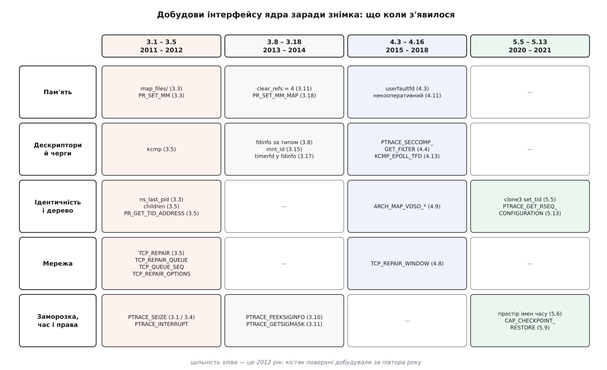

# 📋 Поверхня ядра для знімка процесу

Це перелік усього, що ядро Linux **віддає** й **приймає** заради знімка процесу: файли в `/proc/PID`, системні виклики з їхніми прапорцями, опції сокета, вузол `sysctl` і окреме повноваження. Біля кожного пункту стоїть версія ядра, у якій він з'явився, і рядок про те, **яку однобічність інтерфейсу він закрив** — бо майже кожен із них є другим боком, добудованим до вже наявного першого: до «прочитати» — «задати», до «створити» — «створити саме таким».

## Як читати ці таблиці

**Версія** — та, у якій інтерфейс став придатним до вжитку в описаному тут вигляді; де перша поява й остаточна форма розійшлися, стоять обидві. Остання колонка кожної таблиці називає ту дірку в інтерфейсі, задля якої пункт і завели.

Багато що з переліченого досі ховається за `CONFIG_CHECKPOINT_RESTORE` — окремою опцією збирання ядра. Ядра масових дистрибутивів її вмикають, але на зібраному власноруч ядрі відсутній файл у `/proc` частіше означає саме вимкнену опцію, ніж стару версію.



*Пам'ять і дескриптори почали закривати найпершими, і найгустіше — за півтора року 2011–2012. Ідентичність, час і права дотягували ще вісім років, і саме там кожна добудова вимагала не нового поля, а нового поняття: масиву номерів у `clone3`, окремого простору імен, окремого повноваження.*

## `/proc/PID`: те, що ядро показує

| Файл | Що дає | З версії | Чого бракувало доти |
|---|---|---|---|
| `maps` | межі, права й зсув кожного відображення, ім'я файлу за ним рядком | здавна | — |
| `map_files/` | посилання `початок-кінець` → сам файл; відкривається навіть тоді, коли ім'я вже видалене або лежить поза поточним коренем | 3.3 | за відображенням був лише **рядок** з іменем, а не спосіб дістати файл: `/tmp/x (deleted)` не відкриєш |
| `smaps` | статистика ділянки в сторінках (`Rss`, `Pss`, приватне проти спільного) і рядок `VmFlags` із її прапорцями | 2.6.14; `VmFlags` — 3.8 | у `maps` видно лише межі, права й спільність; скільки сторінок ділянки насправді завантажено й чи вона замкнена — звідти не дізнатися |
| `pagemap` | по 64 біти на сторінку: присутність, вивантаженість, номер фізичного кадру, `soft-dirty` | 2.6.25; біт `soft-dirty` — 3.11 | не було з чого дізнатися, які сторінки взагалі присутні — довелося б чіпати кожну |
| `clear_refs` | запис `4` скидає `soft-dirty` на всіх сторінках задачі | 3.11 | позначку «змінена після контрольної точки» не було чим скидати, тож ітеративне копіювання наперед без латок ядра не працювало |
| `fd/` | посилання з номера на об'єкт | здавна | — |
| `fdinfo/` | стан за кожним дескриптором (див. нижче) | 2.6.22 | зміщення у файлі, склад набору `epoll`, маска `signalfd` жили лише всередині ядра |
| `task/TID/children` | список дітей саме цієї задачі | 3.5 (`CONFIG_CHECKPOINT_RESTORE`; з 4.2 — `CONFIG_PROC_CHILDREN`) | дерево збиралося обходом усього `/proc` із читанням `PPid` — повільно й із гонками |
| `ns/` | посилання на кожен простір імен задачі | 3.0 і 3.8 (за видами) | простір імен не мав імені: ні назвати його, ні зайти в чужий |
| `mountinfo` | дерево монтувань із номерами `mnt_id` | 2.6.26 | `mnt_id` із `fdinfo` не було з чим звірити |
| `stat`, `status` | стан, група процесів, сеанс, маски `SigBlk`/`SigIgn`/`SigCgt`, час старту | здавна | — |
| `syscall` | номер і аргументи виклику, у якому задача стоїть зараз | 2.6.27 | знімач мусить знати, чи зупинив задачу посеред перерваного виклику, щоб потім його перезапустити |
| `timens_offsets` | зсуви монотонного годинника й годинника від увімкнення; **читається й записується** | 5.6 | монотонний годинник узагалі не мав зворотного боку |

Розкладка одного запису `pagemap`:

```
біт 63     сторінка присутня у фізичній пам'яті
біт 62     сторінка вивантажена у своп
біт 61     сторінка файлова або спільна анонімна          (з 3.5)
біт 57     сторінка захищена від запису через userfaultfd (з 5.7)
біт 56     сторінка відображена рівно в один процес       (з 4.2)
біт 55     soft-dirty: сторінку змінили після скидання    (з 3.11)
біти 0–54  номер фізичного кадру
```

З ядра 4.2 номер фізичного кадру видно лише з `CAP_SYS_ADMIN` — без нього ці біти нульові. Знімачеві номер кадру й не потрібен: йому потрібні біти 55, 62 і 63.

### Спільні поля `fdinfo`

```
$ cat /proc/4711/fdinfo/3
pos:	943718400
flags:	0100000
mnt_id:	29
ino:	1049234
```

| Поле | Що це |
|---|---|
| `pos` | зміщення в [описі відкритого файлу](topic:sys-unix/open-file-description), десяткове |
| `flags` | режим доступу й прапорці стану, вісімкове |
| `mnt_id` | номер монтування, за яким шукають рядок у `mountinfo` (з 3.15) |
| `ino` | номер inode самого об'єкта |

`pos` і `flags` є від 2.6.22. Записати `pos` назад окремим викликом не можна — і не треба: під час відновлення файл відкривають і роблять `lseek()`. Це той рідкісний випадок, коли наявного інтерфейсу вистачило й добудовувати нічого не довелося.

### Розширення `fdinfo` за типом дескриптора

| Тип | Додаткові поля | З версії | Чого бракувало доти |
|---|---|---|---|
| `eventfd` | `eventfd-count` — поточне значення лічильника | 3.8 | лічильник читався лише руйнівно: `read()` його обнуляє |
| [`epoll`](topic:sys-unix/select-poll-epoll) | рядок `tfd`/`events`/`data` на кожен стежений дескриптор | 3.8 | склад набору очікування не було з чого відтворити — `epoll_ctl` лише додає й вилучає, а перелічити не вміє |
| `inotify` | `wd`, `ino`, `sdev`, `mask`, `fhandle` на кожне [стеження за файлами](topic:sys-unix/inotify-and-fanotify) | 3.8 | перелік стежень і масок був суто внутрішнім |
| `fanotify` | `flags`, `event-flags`, `mflags`, `mask`, `ignored_mask` | 3.8 | те саме |
| [`signalfd`](topic:sys-unix/signal-mask-signalfd) | `sigmask` — маска сигналів, які приймає цей дескриптор | 3.8 | маску можна було задати при створенні, але не прочитати |
| [`timerfd`](topic:sys-unix/process-timers) | `clockid`, `ticks`, `settime flags`, `it_value`, `it_interval` | 3.17 | `timerfd_gettime()` працює лише «про себе» — знімач ззовні його не викличе |

Кожен рядок тут — те саме правило: дескриптор створюють викликом, який **приймає** налаштування, і поруч немає виклику, який їх **віддає**. Замість двадцяти нових викликів ядро віддало все одним текстовим файлом.

### `/proc/PID/ns/`: посилання на простори імен

| Посилання | З версії |
|---|---|
| `ipc`, `net`, `uts` | 3.0 |
| `mnt`, `pid`, `user` | 3.8 |
| `cgroup` | 4.6 |
| `pid_for_children` | 4.12 |
| `time`, `time_for_children` | 5.6 |

Ці посилання — не текст, а справжні дескриптори: відкритий `ns/net` тримає [мережевий простір імен](topic:sys-unix/network-namespaces) живим навіть без жодного процесу в ньому, а `setns()` (Linux 3.0) переводить у нього того, хто цей дескриптор має. Порівняння двох таких посилань за парою «пристрій, inode» — єдиний спосіб дізнатися, що дві задачі сидять в одному просторі імен.

## `ptrace`: заморозити й дістати те, чого в `/proc` немає

| Запит | Що робить | З версії | Чого бракувало доти |
|---|---|---|---|
| `PTRACE_SEIZE` | приєднатися, не зупиняючи задачу й не міняючи видимого стану | 3.1 за прапорцем `PTRACE_SEIZE_DEVEL`, у чистому вигляді — 3.4 | `PTRACE_ATTACH` зупиняє жертву так, що зупинка стає частиною стану: `/proc/PID/stat` покаже `T`, і свій `SIGSTOP` від чужого вже не відрізнити |
| `PTRACE_INTERRUPT` | зупинити захоплену задачу, не надсилаючи сигналу | 3.4 | зупинити можна було лише сигналом, а надісланий сигнал сам стає частиною стану |
| `PTRACE_LISTEN` | лишити задачу в груповій зупинці, не даючи їй бігти | 3.4 | після відновлення трасування задача, що стояла в `SIGSTOP`, побігла б |
| `PTRACE_GETREGSET` / `PTRACE_SETREGSET` | читати й писати набори регістрів на ім'я нотатки ELF: `NT_PRSTATUS`, `NT_PRFPREG`, `NT_X86_XSTATE`, `NT_ARM_TLS`… | 2.6.34 | старі `GETREGS`/`GETFPREGS` мали структуру сталого розміру й нові набори регістрів у неї не влазили |
| `PTRACE_PEEKSIGINFO` | прочитати чергу відкладених сигналів разом із `siginfo`, не забираючи їх | 3.10 | `GETSIGINFO` віддавав лише той сигнал, на якому сталася зупинка |
| `PTRACE_GETSIGMASK` / `PTRACE_SETSIGMASK` | прочитати й **задати** маску заблокованих сигналів | 3.11 | маску видно в `status` рядком `SigBlk`, а задати її чужій задачі не було чим |
| `PTRACE_SECCOMP_GET_FILTER` | вивантажити n-й [фільтр seccomp](topic:sys-unix/seccomp-filter-mechanism) як класичний BPF | 4.4 | фільтри seccomp однобічні за задумом: поставив — і не забереш назад |
| `PTRACE_SECCOMP_GET_METADATA` | прапорці фільтра, зокрема `SECCOMP_FILTER_FLAG_LOG` | 4.16 | сам код фільтра не каже, з якими прапорцями його встановлювали |
| `PTRACE_GET_SYSCALL_INFO` | у якому виклику й з якими аргументами стоїть задача | 5.3 | доводилося вгадувати за регістрами конкретної архітектури |
| `PTRACE_GET_RSEQ_CONFIGURATION` | адреса, розмір і підпис структури, якою потік користується для [перезапускних послідовностей](topic:sys-unix/rseq) — ділянок коду без замків, що починаються заново, коли їх перервали | 5.13 | цю структуру потік реєструє викликом «про себе», і ззовні її адресу не дізнатися |

Мінімальна робоча послідовність — узяти задачу, зупинити її й прочитати регістри, не лишивши по собі сліду:

```c
#define _GNU_SOURCE
#include <sys/ptrace.h>
#include <sys/uio.h>
#include <sys/wait.h>
#include <sys/user.h>
#include <elf.h>
#include <stdio.h>

int freeze_and_peek(pid_t pid, struct user_regs_struct *out)
{
    int status;

    /* приєднання, яке НЕ видно ззовні: стан зупинки не змінюється */
    if (ptrace(PTRACE_SEIZE, pid, 0, 0) < 0)
        return -1;

    /* зупинка без сигналу */
    if (ptrace(PTRACE_INTERRUPT, pid, 0, 0) < 0)
        return -1;
    waitpid(pid, &status, __WALL);

    struct iovec iov = { .iov_base = out, .iov_len = sizeof *out };
    if (ptrace(PTRACE_GETREGSET, pid, (void *) NT_PRSTATUS, &iov) < 0)
        return -1;

    ptrace(PTRACE_DETACH, pid, 0, 0);   /* задача біжить далі, ніби нічого не було */
    return 0;
}
```

Деталі приєднання й зупинок — у [моделі ptrace](topic:sys-unix/ptrace-model); тут важить одне: `SEIZE` разом з `INTERRUPT` дають зупинку, яку не видно ні батькові жертви, ні їй самій.

## `kcmp`: чи це той самий об'єкт ядра

Виклик `kcmp()` (Linux 3.5) відповідає на питання, яке з `/proc` не випливає: дескриптор 3 однієї задачі й дескриптор 9 іншої — це один об'єкт чи два однакові. До 5.12 він потребував `CONFIG_CHECKPOINT_RESTORE`, відтоді має й власну опцію збирання — `CONFIG_KCMP`.

```c
#include <sys/syscall.h>
#include <linux/kcmp.h>
#include <unistd.h>

/* glibc обгортки не має — лише через syscall() */
int same_ofd = syscall(__NR_kcmp, pid1, pid2, KCMP_FILE, fd1, fd2);
/* 0 — той самий; 1 — «менший»; 2 — «більший»; 3 — непорівнянні */
```

| Вид | Що порівнює | `idx1`, `idx2` |
|---|---|---|
| `KCMP_FILE` | чи два дескриптори вказують на **той самий опис відкритого файлу** | номери дескрипторів |
| `KCMP_FILES` | чи спільна таблиця дескрипторів | не вживаються |
| `KCMP_VM` | чи спільний адресний простір | не вживаються |
| `KCMP_FS` | чи спільні корінь, робочий каталог і `umask` | не вживаються |
| `KCMP_SIGHAND` | чи спільна таблиця диспозицій сигналів | не вживаються |
| `KCMP_IO` | чи спільний контекст вводу-виводу | не вживаються |
| `KCMP_SYSVSEM` | чи спільний список відкатів семафорів System V | не вживаються |
| `KCMP_EPOLL_TFD` | чи присутній дескриптор `idx1` у наборі `epoll` (з 4.13) | `idx2` — вказівник на `struct kcmp_epoll_slot` |

Значення 1 і 2 годяться для сортування, але **адрес усередині ядра не розкривають**: упорядкування навмисно перемішане, щоб виклик не став каналом витоку розкладки ядерної пам'яті. Для впізнавання тотожності цього досить.

## Народження з наперед заданим номером

| Спосіб | Як це виглядає | З версії | Вада |
|---|---|---|---|
| `/proc/sys/kernel/ns_last_pid` | записати `N−1` і **негайно** зробити `fork()` | 3.3 | гонка: між записом і `fork()` номер може перехопити хтось інший; діє лише в поточному просторі імен |
| `clone3()` з полем `set_tid` | масив номерів: перший — у найглибшому просторі імен, кожен наступний — у предку | `clone3()` — 5.3, `set_tid` — 5.5 | довжина масиву не більша за глибину вкладення просторів імен |

```c
#define _GNU_SOURCE
#include <linux/sched.h>
#include <sys/syscall.h>
#include <signal.h>
#include <stdint.h>
#include <unistd.h>

static pid_t spawn_with_pid(pid_t want)
{
    pid_t tids[1] = { want };
    struct clone_args args = {
        .exit_signal  = SIGCHLD,
        .set_tid      = (uint64_t) (uintptr_t) tids,
        .set_tid_size = 1,
    };
    /* обгортки в glibc немає — лише сирий виклик */
    return syscall(__NR_clone3, &args, sizeof args);
}
```

Порядок народження при цьому все одно не вільний: лідером сеансу процес стає лише сам і лише поки не є лідером групи — обмеження [керування завданнями](topic:sys-unix/job-control), яке ніякий новий виклик не скасовує. `set_tid` знімає гонку за номером, а не потребу рахувати розкладку дерева.

## `prctl(PR_SET_MM)`: межі, які інакше рахує лише `exec`

Ядро тримає в структурі пам'яті процесу межі коду, даних, купи, стека, рядка аргументів і оточення. Заповнює їх `exec` — і саме з них `/proc/PID/cmdline` бере командний рядок. Відновлена задача через `exec` не проходить, тож ці межі доводиться проставляти руками.

| Підкод | Що задає |
|---|---|
| `PR_SET_MM_START_CODE`, `PR_SET_MM_END_CODE` | межі коду |
| `PR_SET_MM_START_DATA`, `PR_SET_MM_END_DATA` | межі даних |
| `PR_SET_MM_START_STACK` | початок стека |
| `PR_SET_MM_START_BRK`, `PR_SET_MM_BRK` | початок і поточний кінець купи |
| `PR_SET_MM_ARG_START`, `PR_SET_MM_ARG_END` | межі рядка аргументів — саме їх читає `/proc/PID/cmdline` |
| `PR_SET_MM_ENV_START`, `PR_SET_MM_ENV_END` | межі оточення — `/proc/PID/environ` |
| `PR_SET_MM_AUXV` | вміст [допоміжного вектора](topic:sys-unix/auxiliary-vector) |
| `PR_SET_MM_EXE_FILE` | файл, на який показує `/proc/PID/exe` |
| `PR_SET_MM_MAP`, `PR_SET_MM_MAP_SIZE` | усе перелічене одним пакетом (з 3.18) |

`PR_SET_MM` є з ядра 3.3 (до 3.10 — за `CONFIG_CHECKPOINT_RESTORE`) і вимагає `CAP_SYS_RESOURCE`. Пакетна форма з'явилася не заради зручності: кожен підкод ядро перевіряло окремо від решти, і в новоствореному просторі користувача перевірка `CAP_SYS_RESOURCE` не проходила взагалі — а пакет дає ядру звірити всі значення разом і за один раз.

```c
#include <sys/prctl.h>
#include <linux/prctl.h>

struct prctl_mm_map m = {
    .start_code = 0x400000,   .end_code  = 0x4a1000,
    .start_data = 0x6a1000,   .end_data  = 0x6b2000,
    .start_brk  = 0x6b3000,   .brk       = 0x71c000,
    .start_stack = 0x7ffd0000,
    .arg_start  = 0x7ffd0100, .arg_end   = 0x7ffd0140,
    .env_start  = 0x7ffd0140, .env_end   = 0x7ffd0800,
    .auxv = auxv_words, .auxv_size = auxv_bytes,
    .exe_fd = exe_fd,         /* дескриптор виконуваного файлу */
};
prctl(PR_SET_MM, PR_SET_MM_MAP, &m, sizeof m, 0);

/* скільки байтів чекає САМЕ ЦЕ ядро — щоб програма, зібрана під інше,
   не подала структуру не того розміру */
unsigned int want;
prctl(PR_SET_MM, PR_SET_MM_MAP_SIZE, &want, 0, 0);
```

Поряд стоїть `PR_GET_TID_ADDRESS` (Linux 3.5, за `CONFIG_CHECKPOINT_RESTORE`): він повертає `clear_child_tid` — адресу, за якою ядро занулить слово й розбудить futex, коли потік помре. Задають її викликом `set_tid_address()`, а прочитати до 3.5 не міг навіть сам потік.

## `userfaultfd`: перехоплення збоїв за чужий процес

| Можливість | З версії | Що дає знімачеві |
|---|---|---|
| сам виклик `userfaultfd()` | 4.3 | перехопити сторінковий збій і самому підставити сторінку |
| `UFFD_FEATURE_EVENT_FORK`, `EVENT_REMAP`, `EVENT_REMOVE`, `EVENT_UNMAP`, плюс підтримка `hugetlbfs` і спільної пам'яті | 4.11 | працювати з **чужим** процесом, який під час підтягування сторінок сам робить `fork`, `mremap`, `madvise(MADV_DONTNEED)` і `munmap` |
| `UFFD_FEATURE_PAGEFAULT_FLAG_WP` і `UFFDIO_WRITEPROTECT` | 5.7 | синхронне стеження за брудними сторінками — точніше за `soft-dirty`, бо ловить сам момент запису |

Саме набір 4.11 і зветься некооперативним режимом: до нього `userfaultfd` обслуговував лише власну пам'ять програми, яка його завела, і про зміни розкладки чужого адресного простору ніхто нікого не сповіщав. Механіка самого перехоплення — у [userfaultfd](topic:sys-unix/userfaultfd).

## Режим ремонту сокета TCP

| Опція (рівень `SOL_TCP`) | Значення | Що робить | З версії |
|---|---|---|---|
| `TCP_REPAIR` | `int`: `1` увімкнути, `0` вимкнути, `−1` вимкнути без зондування вікна | перетворює сокет з автомата протоколу на структуру даних | 3.5 |
| `TCP_REPAIR_QUEUE` | `int`: `TCP_NO_QUEUE`, `TCP_RECV_QUEUE`, `TCP_SEND_QUEUE` | обирає чергу, з якою працюватимуть наступні `send`/`recv` і `TCP_QUEUE_SEQ` | 3.5 |
| `TCP_QUEUE_SEQ` | `u32` | номер послідовності вибраної черги: `write_seq` для відправлення, `rcv_nxt` для приймання; ставиться лише на **закритому** сокеті | 3.5 |
| `TCP_REPAIR_OPTIONS` | масив `struct tcp_repair_opt` | домовлені під час рукостискання опції: MSS, масштаб вікна, дозвіл на SACK, позначки часу | 3.5 |
| `TCP_REPAIR_WINDOW` | `struct tcp_repair_window` | параметри вікна обох боків | 4.8 |

```c
struct tcp_repair_opt {
    __u32 opt_code;   /* TCPOPT_MSS=2, TCPOPT_WINDOW=3,
                         TCPOPT_SACK_PERM=4, TCPOPT_TIMESTAMP=8 */
    __u32 opt_val;
};

struct tcp_repair_window {
    __u32 snd_wl1;
    __u32 snd_wnd;
    __u32 max_window;
    __u32 rcv_wnd;
    __u32 rcv_wup;
};
```

Головне правило режиму: `send()` і `recv()` **міняють призначення**. Черга відправлення читається викликом `recv(fd, buf, len, MSG_PEEK)`, черга приймання наповнюється викликом `send()`. Це не примха, а той самий прийом «другий бік уже наявного виклику»: замість чотирьох нових викликів — по одному на кожен напрямок кожної черги — переозначили два наявні.

```c
/* ── знімок ────────────────────────────────────────────── */
int on = 1, q;
setsockopt(fd, SOL_TCP, TCP_REPAIR, &on, sizeof on);

q = TCP_SEND_QUEUE;
setsockopt(fd, SOL_TCP, TCP_REPAIR_QUEUE, &q, sizeof q);
socklen_t len = sizeof snd_seq;
getsockopt(fd, SOL_TCP, TCP_QUEUE_SEQ, &snd_seq, &len);
ssize_t unacked = recv(fd, sndbuf, sizeof sndbuf, MSG_PEEK | MSG_DONTWAIT);

struct tcp_repair_window win;
len = sizeof win;
getsockopt(fd, SOL_TCP, TCP_REPAIR_WINDOW, &win, &len);

/* ── відновлення ───────────────────────────────────────── */
fd = socket(AF_INET, SOCK_STREAM, 0);
setsockopt(fd, SOL_TCP, TCP_REPAIR, &on, sizeof on);

q = TCP_RECV_QUEUE;                       /* номери — до connect */
setsockopt(fd, SOL_TCP, TCP_REPAIR_QUEUE, &q, sizeof q);
setsockopt(fd, SOL_TCP, TCP_QUEUE_SEQ, &rcv_seq, sizeof rcv_seq);
q = TCP_SEND_QUEUE;
setsockopt(fd, SOL_TCP, TCP_REPAIR_QUEUE, &q, sizeof q);
setsockopt(fd, SOL_TCP, TCP_QUEUE_SEQ, &snd_seq, sizeof snd_seq);

bind(fd, &local, sizeof local);
connect(fd, &peer, sizeof peer);   /* SYN не летить: сокет одразу ESTABLISHED */

send(fd, unacked_bytes, unacked_len, 0);            /* назад у чергу відправлення */
q = TCP_RECV_QUEUE;
setsockopt(fd, SOL_TCP, TCP_REPAIR_QUEUE, &q, sizeof q);
send(fd, pending_in, in_len, 0);                    /* назад у чергу приймання */

setsockopt(fd, SOL_TCP, TCP_REPAIR_OPTIONS, opts, sizeof opts);
setsockopt(fd, SOL_TCP, TCP_REPAIR_WINDOW, &win, sizeof win);

on = 0;
setsockopt(fd, SOL_TCP, TCP_REPAIR, &on, sizeof on);  /* розмова триває далі */
```

Три властивості режиму легко проґавити, і кожна з них ламає відновлення по-своєму. `connect()` у ньому не надсилає `SYN`, а просто ставить стан `ESTABLISHED` — рукостискання вже відбулося колись. Сокет, закритий у режимі ремонту, зникає **мовчки**: партнер не отримає ні `FIN`, ні `RST`, бо на час знімка з'єднання мусить виглядати живим з обох боків. Зсув позначок часу TCP ставлять окремо, опцією `TCP_TIMESTAMP`, — інакше після переїзду на іншу машину вони стрибнули б, і партнер відкинув би пакети.

Повноваження: спершу вимагалося `CAP_SYS_ADMIN`, у сучасних ядрах перевіряють `CAP_NET_ADMIN` у просторі користувача, якому належить мережевий простір імен сокета. На сокеті, що слухає, режим ремонту не вмикається.

## Простір імен часу

`CLONE_NEWTIME` з'явився в ядрі 5.6 (Dmitry Safonov і Andrei Vagin). Вільних бітів у `clone()` уже не лишалося, тож прапорець зайняв найстарший біт поля `CSIGNAL` — і через це його приймають **лише** `unshare()`, `clone3()` та `setns()`, а старий `clone()` — ні.

Простір часу не переставляє годинник, а тримає зсув:

```
# процес усередині простору часу, зсунутого на три доби вперед
$ cat /proc/self/timens_offsets
monotonic	259200	0
boottime	259200	0
```

| Правило | Деталь |
|---|---|
| формат рядка | `<годинник> <секунди> <наносекунди>` |
| які годинники | лише `monotonic` (`CLOCK_MONOTONIC`) і `boottime` (`CLOCK_BOOTTIME`) |
| коли можна писати | лише в щойно створений простір і лише доки в ньому не з'явився жоден процес; далі — `EACCES` |
| повноваження | `CAP_SYS_TIME` у просторі користувача, якому належить цей простір часу |
| межі | наносекунди менші за 1 000 000 000; зсув не має робити поточний час від'ємним і не більший за ~половину `KTIME_SEC_MAX` |
| `ns/time` проти `ns/time_for_children` | процес, що зробив `unshare(CLONE_NEWTIME)`, лишається у **старому** просторі; новий дістається лише його дітям |

Зсув замість запису значення — тут не вибір зручності: [монотонний годинник](topic:sys-unix/kernel-timekeeping) за визначенням не переставляється, бо переставний годинник не був би монотонним і на ньому зламалися б усі інші програми машини. Це єдине місце в переліку, де симетрію добудувати було **неможливо** — і замість другого боку виклику довелося заводити новий рід [простору імен](topic:sys-unix/namespaces).

## Повноваження

`CAP_CHECKPOINT_RESTORE` з'явилося в ядрі 5.9 (Adrian Reber, Red Hat) і дає рівно три речі:

| Дія | Було | Стало |
|---|---|---|
| запис у `/proc/sys/kernel/ns_last_pid` | `CAP_SYS_ADMIN` | `CAP_CHECKPOINT_RESTORE` |
| поле `set_tid` у `clone3()` | `CAP_SYS_ADMIN` | `CAP_CHECKPOINT_RESTORE` в усіх власницьких просторах користувача |
| читання посилань `/proc/PID/map_files/` чужого процесу | `CAP_SYS_ADMIN` у початковому просторі користувача | `CAP_SYS_ADMIN` **або** `CAP_CHECKPOINT_RESTORE` у кореневому просторі користувача |

Решта поверхні під нього не підпадає, і це варто знати наперед — знімач без `CAP_SYS_ADMIN` усе одно потребує кількох окремих повноважень:

| Дія | Повноваження |
|---|---|
| `prctl(PR_SET_MM)` | `CAP_SYS_RESOURCE` |
| режим ремонту TCP | `CAP_NET_ADMIN` у просторі користувача мережевого простору імен |
| запис `timens_offsets` | `CAP_SYS_TIME` |
| номери фізичних кадрів у `pagemap` | `CAP_SYS_ADMIN` (без нього з 4.2 — нулі) |
| `ptrace` над чужим процесом | той самий власник або `CAP_SYS_PTRACE` |
| вхід у чужий простір імен через `setns()` | `CAP_SYS_ADMIN` у цільовому просторі користувача |

Розкладання всесилля на дрібні дозволи — той самий рух, що й скрізь у [системі повноважень](topic:sys-unix/capabilities): інструментові не повинно доводитися просити владу над усім, щоб зробити одну конкретну річ.

## Що лишилося однобічним

| Величина | Читається | Задається |
|---|---|---|
| час старту процесу (`stat`, поле 22) | так | **ні** — ядро проставляє його при народженні, і відновлена задача чесно має новий |
| `CLOCK_MONOTONIC` як такий | так | **ні** — лише зсув у просторі імен часу, і лише для дітей |
| `CLOCK_REALTIME` окремо для контейнера | так | **ні** — простір часу зсуває тільки `monotonic` і `boottime` |
| лічильники витрачених ресурсів (`getrusage`) | так | **ні** — накопичуються самим ядром |
| номер потоку глибше за наявну вкладеність просторів імен | — | **ні** — `set_tid_size` не більший за глибину |

Ці п'ять рядків — не список недоробок. Кожен із них показує величину, яку ядро вважає **своїм** твердженням про світ, а не станом процесу: коли задача народилася, скільки процесорного часу витратила, скільки система працює від увімкнення. Добудувати сюди «задати» означало б дозволити процесові брехати ядру про самого себе — а це вже не знімок, а підробка.
