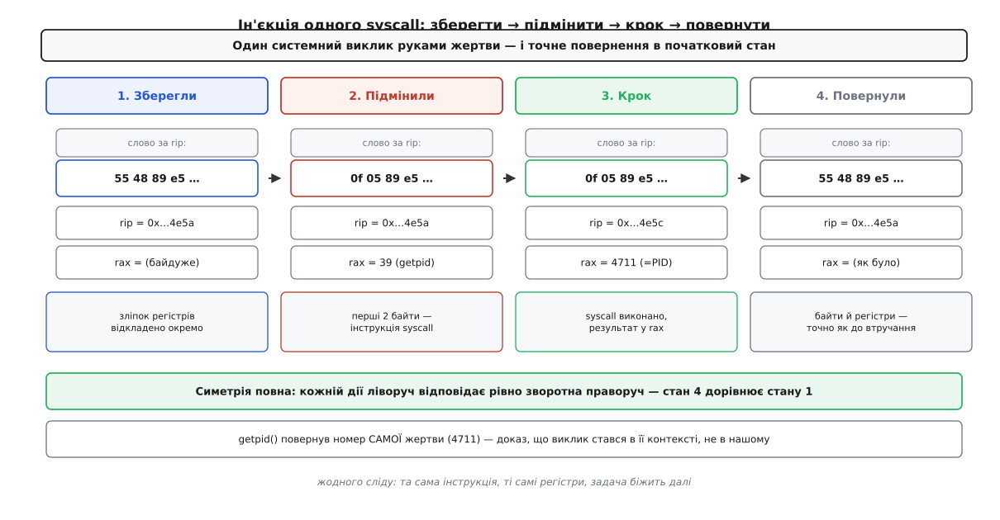

# ⚙️ Ін'єкція системного виклику в чужий процес

Це сотня рядків на C, які приєднуються до вже запущеної задачі, що ні про що не здогадується, змушують її саму викликати `getpid()` — і повертають усе так, ніби нічого не було. Той самий кістяк — приєднатися, зберегти регістри, підмінити кілька байтів, дозволити один виклик, повернути все на місце — і є перший подих паразитного коду, з якого знімач добуває те, чого ядро не показує ззовні.

## Навіщо це взагалі

Знімачеві процесу треба дізнатися речі, які видно лише зсередини задачі: диспозиції всіх сигналів (`sigaction`), стан таймерів POSIX (`timer_gettime`), деякі облікові дані. Відповідні системні виклики працюють тільки «про себе» — вони віддають стан того, хто їх викликав. Ззовні їх не поставиш: із чужого процесу немає команди «виконай `sigaction` за нього».

Розв'язок непрямий: якщо не можна викликати виклик ззовні, треба зробити так, щоб його викликала сама жертва. Повна реалізація знімача заливає в задачу цілий блоб коду й далі спілкується з ним сокетом. Але весь цей апарат виростає з однієї елементарної здатності — виконати **один** системний виклик руками чужого процесу. Саме її ми тут і збудуємо: не як іграшку, а як точний зародок справжнього механізму.

## Ідея: два важелі, з яких складається виклик

[Трасування через ptrace](topic:sys-unix/ptrace-model) дає над зупиненою задачею рівно дві сили: читати й писати її пам'ять і читати й писати її регістри. Здається, що небагато. Але системний виклик — це саме комбінація цих двох речей, і більше нічого.

Процесор, доходячи до [інструкції `syscall`](topic:sys-unix/syscall-mechanics), дивиться на регістр `rax`: там лежить номер виклику. Аргументи він бере з інших регістрів, а куди повертати керування — з лічильника команд, який на цю інструкцію і вказував. Процесорові байдуже, **хто** заповнив ці регістри: сама задача своїм кодом чи хтось ззовні через `ptrace`. Якщо в пам'яті за лічильником команд стоять байти інструкції `syscall`, а в `rax` — номер, то одна виконана інструкція зробить справжній системний виклик — і зробить його в контексті цієї задачі: з її дозволами, її просторами імен, її таблицею дескрипторів.

Звідси весь план, симетричний до останнього кроку:

1. Зупинити задачу так, щоб зупинка не була помітна.
2. **Зберегти** її регістри — це зліпок, до якого повернемося.
3. **Зберегти** слово пам'яті за лічильником команд і записати туди байти `syscall`.
4. Поставити `rax` на номер виклику, лічильник — на нашу інструкцію.
5. Дозволити виконати **рівно одну** інструкцію.
6. Прочитати результат із `rax`.
7. **Повернути** байти пам'яті, тоді регістри — точно як були.
8. Від'єднатися.

Кроки 2–3 і 7 — дзеркальні пари: що зберегли, те й повернули. У цій симетрії вся коректність прийому.



*getpid() повертає номер самої жертви — це і є доказ, що виклик відбувся в її контексті, а не в нашому. Після четвертого зліпка задача не може відрізнити свій стан від того, що був до втручання.*

## Код

Робоча програма на x86-64. Регістри читаємо переносним способом — через `PTRACE_GETREGSET` з нотатковим типом `NT_PRSTATUS`: він віддає той самий набір, який ядро кладе в аварійний дамп, і його форму знає архітектурний заголовок (`struct user_regs_struct` на x86-64, `struct user_pt_regs` на arm64).

```c
#define _GNU_SOURCE
#include <stdio.h>
#include <stdlib.h>
#include <errno.h>
#include <signal.h>
#include <unistd.h>
#include <sys/ptrace.h>
#include <sys/wait.h>
#include <sys/uio.h>        /* struct iovec */
#include <sys/user.h>       /* struct user_regs_struct */
#include <sys/syscall.h>    /* SYS_getpid */
#include <elf.h>            /* NT_PRSTATUS */

/* Прочитати/записати ВЕСЬ набір регістрів. GETREGSET переносний між
   архітектурами: iovec каже, скільки байтів набору ми готові взяти. */
static int get_regs(pid_t pid, struct user_regs_struct *r) {
    struct iovec io = { .iov_base = r, .iov_len = sizeof(*r) };
    return ptrace(PTRACE_GETREGSET, pid, (void *)NT_PRSTATUS, &io);
}
static int set_regs(pid_t pid, struct user_regs_struct *r) {
    struct iovec io = { .iov_base = r, .iov_len = sizeof(*r) };
    return ptrace(PTRACE_SETREGSET, pid, (void *)NT_PRSTATUS, &io);
}

int main(int argc, char **argv) {
    if (argc != 2) { fprintf(stderr, "вжиток: %s <pid>\n", argv[0]); return 2; }
    pid_t pid = (pid_t)atoi(argv[1]);
    int status;

    /* 1. Приєднатися БЕЗ видимої зупинки. SEIZE не шле сигналу й не лишає
          на задачі стану «зупинена сигналом», який побачив би хтось інший. */
    if (ptrace(PTRACE_SEIZE, pid, 0, 0) == -1) { perror("PTRACE_SEIZE"); return 1; }
    printf("приєднано до %d через PTRACE_SEIZE\n", pid);

    /* 2. Зупинити окремою командою — теж без сигналу — і дочекатися стопу. */
    if (ptrace(PTRACE_INTERRUPT, pid, 0, 0) == -1) { perror("PTRACE_INTERRUPT"); return 1; }
    waitpid(pid, &status, 0);

    /* 3. Зберегти регістри: saved — недоторканний зліпок, work — робоча копія. */
    struct user_regs_struct saved, work;
    if (get_regs(pid, &saved) == -1) { perror("GETREGSET"); return 1; }
    work = saved;
    unsigned long long pc = saved.rip;   /* точка, куди підсунемо syscall */

    /* 4. Зберегти слово коду за лічильником і підмінити молодші 2 байти на
          інструкцію `syscall` (0f 05). PEEK/POKE ходять словом по 8 байтів;
          решту 6 байтів лишаємо як були. errno-протокол: -1 — легітимне
          значення даних, тому помилку впізнаємо лише за errno. */
    errno = 0;
    long orig = ptrace(PTRACE_PEEKTEXT, pid, (void *)pc, 0);
    if (orig == -1 && errno) { perror("PEEKTEXT"); return 1; }

    long patched = (orig & ~0xffffL) | 0x050f;   /* у пам'яті: байт 0f, потім 05 */
    if (ptrace(PTRACE_POKETEXT, pid, (void *)pc, (void *)patched) == -1) {
        perror("POKETEXT"); return 1;
    }
    printf("за rip=0x%llx підмінено 2 байти на syscall (0f 05)\n", pc);

    /* 5. Поставити регістри так, ніби задача сама викликає getpid():
          номер — у rax, лічильник — на нашу інструкцію. getpid не має
          ні аргументів, ні побічних дій — ідеальна безпечна проба. */
    work.rip = pc;
    work.rax = SYS_getpid;               /* 39 на x86-64 */
    if (set_regs(pid, &work) == -1) { perror("SETREGSET"); return 1; }

    /* 6. Виконати РІВНО одну інструкцію. syscall входить у ядро й повертається;
          single-step ставить пастку на поверненні в user mode. */
    if (ptrace(PTRACE_SINGLESTEP, pid, 0, 0) == -1) { perror("SINGLESTEP"); return 1; }
    waitpid(pid, &status, 0);
    if (!WIFSTOPPED(status) || WSTOPSIG(status) != SIGTRAP) {
        /* Не наша пастка, а сигнал жертві. Реальний інструмент запам'ятав би
           сигнал, дозволив крок ще раз і повторив; тут просто чесно виходимо. */
        fprintf(stderr, "крок перервано сигналом %d\n", WSTOPSIG(status));
        set_regs(pid, &saved);
        ptrace(PTRACE_POKETEXT, pid, (void *)pc, (void *)orig);
        ptrace(PTRACE_DETACH, pid, 0, 0);
        return 1;
    }

    /* 7. Результат — у rax, як велить x86-64 ABI. */
    if (get_regs(pid, &work) == -1) { perror("GETREGSET"); return 1; }
    long long ret = (long long)work.rax;
    printf("getpid() у контексті жертви повернув %lld\n", ret);

    /* 8. Повернути ВСЕ точно як було: спершу байти коду, тоді регістри. */
    if (ptrace(PTRACE_POKETEXT, pid, (void *)pc, (void *)orig) == -1) { perror("restore code"); return 1; }
    if (set_regs(pid, &saved) == -1) { perror("restore regs"); return 1; }

    /* 9. Від'єднатися — задача біжить далі з тієї самої інструкції. */
    ptrace(PTRACE_DETACH, pid, 0, 0);
    printf("код і регістри повернено, від'єднано — жертва нічого не помітила\n");
    return 0;
}
```

Складання й запуск (жертва — будь-яка програма, що довго працює, скажімо `sleep 1000` із PID 4711):

```
$ cc -O2 -o inject inject.c
$ sleep 1000 &          # умовна жертва
[1] 4711
$ sudo ./inject 4711
приєднано до 4711 через PTRACE_SEIZE
за rip=0x7f3c8a1b4e5a підмінено 2 байти на syscall (0f 05)
getpid() у контексті жертви повернув 4711
код і регістри повернено, від'єднано — жертва нічого не помітила
```

Головний рядок виводу — третій. `getpid()` повернув `4711` — номер **самої жертви**, а не нашої програми. Це найкоротший доказ, що виклик відбувся всередині чужого процесу: наш `inject` має інший PID, а `getpid` завжди повертає номер того, хто його виконав. Ми виконали його руками задачі 4711.

## Пастки

Прийом звучить простіше, ніж він насправді безпечний. Кожен крок тримається на неочевидній деталі.

**Чому не `SIGSTOP`.** Найпростіший спосіб заморозити задачу — надіслати `SIGSTOP` — псує саме те, що ми хочемо зберегти незмінним. Зупинка сигналом **є частиною стану**: `/proc/PID/stat` покаже літеру `T`, батько побачить її через `waitpid()`, а якщо задача вже стояла зупиненою до нашого приходу, ми свій `SIGSTOP` від чужого не відрізнимо, коли будемо відпускати. `PTRACE_SEIZE` приєднується, нічим не проявляючись назовні, а `PTRACE_INTERRUPT` спиняє задачу окремою командою, не чіпаючи видимого стану зупинки. Вимірювач, що псує вимірюване, тут не годиться.

**Чому байти треба зберегти й повернути.** За лічильником команд лежить не порожнє місце, а реальний код програми — інструкція, яку задача мала виконати наступною. Записавши туди `syscall`, ми затерли справжні байти; якщо їх не повернути, після нашого відходу задача виконає чужу інструкцію й, найімовірніше, впаде. Тому слово зберігається до підміни й лягає назад після. І окремо: single-step **зсуває** лічильник — на x86-64 після двобайтового `syscall` він стане `pc + 2`. Саме тому наприкінці ми ставимо не «якийсь розумний» лічильник, а весь збережений зліпок регістрів: він містить і правильний `rip`, і всі інші регістри, яких ми навіть не торкалися. Відновлюємо не по пам'яті, а зі зліпка — рівно тому, що зліпок точний за визначенням.

**Вирівнювання й довжина інструкції: x86-64 проти arm64.** Тут архітектури розходяться, і код доводиться писати під кожну окремо.


*Алгоритм — той самий: зберегти, підмінити, крок, повернути. Змінюються лише байти інструкції, її довжина й імена регістрів.*

На x86-64 інструкції змінної довжини, `syscall` займає два байти (`0f 05`), а лічильник команд може стояти за будь-якою адресою — тому ми акуратно міняємо тільки молодші два байти прочитаного восьмибайтового слова, не чіпаючи решту шести. На arm64 інструкції фіксовані по чотири байти, `svc #0` — це рівно слово `d4000001`, а лічильник **завжди** кратний чотирьом, тож і підміняти можна цілим чотирибайтовим шматком без побоювань зачепити сусідню інструкцію. Різняться й регістри: номер виклику там не в `rax`, а в `x8`, результат — не в `rax`, а в `x0`, а самі поля звуться `pc` і `regs[]` замість `rip`/`rax`:

```c
/* arm64: та сама логіка, інші байти, інші поля, інший номер */
unsigned long long pc = saved.pc;                 /* не rip */
long orig    = ptrace(PTRACE_PEEKTEXT, pid, (void *)pc, 0);
long patched = (orig & ~0xffffffffL) | 0xd4000001L;   /* svc #0 — цілі 4 байти */
/* ... poke patched ... */
work.pc      = pc;
work.regs[8] = 172;          /* SYS_getpid на arm64 — в x8 */
/* ... single-step ... */
long long ret = work.regs[0];                     /* результат — в x0 */
```

Переносний `PTRACE_GETREGSET` тут якраз і рятує: сам виклик читання-запису регістрів однаковий, різниться лише структура під ним, яку підставляє архітектурний заголовок.

**Що станеться при перериванні сигналом.** Здавалося б, найнебезпечніше: поки в пам'яті задачі стоїть наш `syscall`, задачі надійде сигнал, і ядро побіжить у її обробник по зіпсутому коду. Цього не буде — і завдяки самому `ptrace`. Задача під трасуванням і зупинена: усі сигнали, що їй адресовані, не доставляються самі, а спливають до нас окремою зупинкою. Тому наш `PTRACE_SINGLESTEP` може завершитися не пасткою на поверненні з виклику, а **зупинкою доставки сигналу** — тоді `waitpid` віддасть статус зі `WSTOPSIG` не рівним `SIGTRAP`. Це нормальна ситуація, а не помилка: справжній інструмент відклав би цей сигнал (передавши його номер третім аргументом наступного кроку), повторив крок і лише тоді забрав результат. У нашому демо ми в цьому разі чесно згортаємося — повертаємо байти й регістри й виходимо, — щоб ніколи не лишити жертву з підміненим кодом. Окрема тонкість: одиничний крок через `syscall` ядро обробляє спеціально (процесор гасить покроковість на час роботи в ядрі, а пастку віддає на поверненні в user mode) — на цій межі в історії ядра навіть заводилися й лагодилися регресії, тож перевіряти статус кроку тут не педантизм, а необхідність.

**Чому потрібні права ptrace.** `PTRACE_SEIZE` на чужий процес не дадуть просто так. Модуль безпеки Yama через перемикач `/proc/sys/kernel/yama/ptrace_scope` за замовчуванням (значення `1`, «обмежене трасування») дозволяє приєднуватися лише до власних нащадків. Щоб узяти неспоріднену задачу, потрібне одне з трьох: значення `0` (класичний режим — будь-хто під тим самим користувачем), повноваження `CAP_SYS_PTRACE` (значення `2` вимагає його завжди), або щоб сама жертва заздалегідь назвала нас через `prctl(PR_SET_PTRACER)`. Значення `3` забороняє трасування геть — і назад його вже не перемкнути. Без права `SEIZE` поверне `-1` з `errno == EPERM`, і жоден наступний крок не має сенсу. Це та сама причина, чому знімок і відновлення процесу спершу вимагали всесильного `CAP_SYS_ADMIN`, а згодом дістали окреме, вужче [повноваження](topic:sys-unix/capabilities) `CAP_CHECKPOINT_RESTORE`: вміння підсадити чужому процесу довільний системний виклик — надто гостра сила, щоб роздавати її кожному.

> 🔧 **Навіщо це.** Наша проба викликає `getpid`, бо він нешкідливий. Справжній знімач першим ділом викликає цим самим прийомом `mmap` — і замість двобайтового `syscall` дістає в чужому просторі цілу ділянку пам'яті. У неї заливають повноцінний позиційно-незалежний блоб і його стек, переносять у нього керування, і далі спілкуються з ним сокетом: «перелічи диспозиції всіх сигналів», «зніми таймери», «вивантаж пам'ять через `vmsplice`». Уся ця машинерія — надбудова над одним-єдиним викликом, який ми щойно зробили руками жертви. Хто вміє інжектувати один `syscall`, той уміє інжектувати будь-що.
