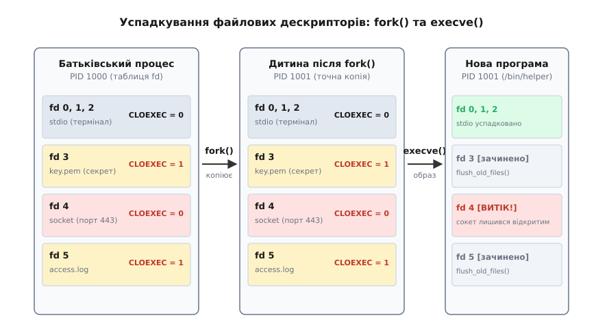
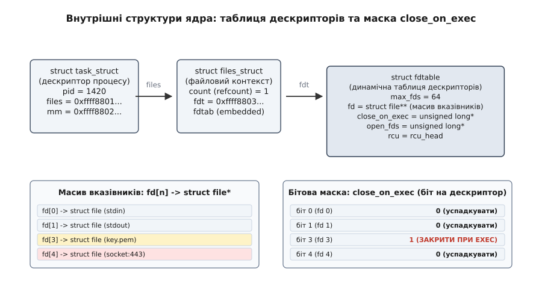
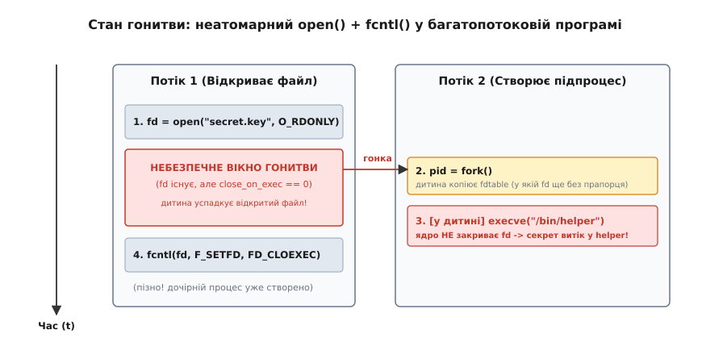
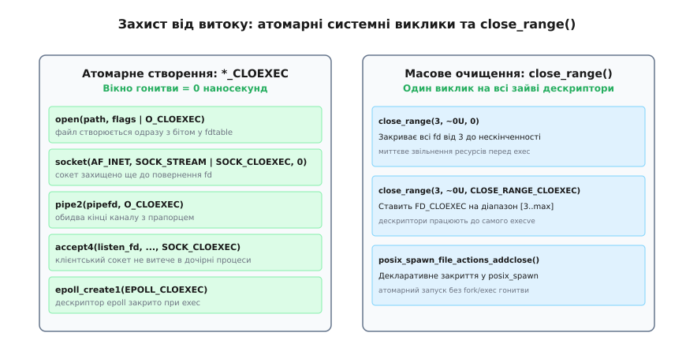

# Закриття при exec: FD_CLOEXEC

<preknowlist>
- [Файловий дескриптор](topic:sys-unix/file-descriptor) — цілочисельний індекс у таблиці відкритого вводу-виводу процесу.
- [Опис відкритого файлу](topic:sys-unix/open-file-description) — системна структура ядра, що зберігає зміщення, прапорці стану та лічильник посилань.
- [Семантика fork](topic:sys-unix/fork-semantics) — клонування адресного простору та копіювання дескрипторної таблиці батьківського процесу.
- [Семантика exec](topic:sys-unix/exec-semantics) — повна заміна образу виконуваного процесу новою бінарною програмою.
- [Потоки як завдання](topic:sys-unix/threads-as-tasks) — спільне використання таблиці файлів усіма потоками одного процесу.
- [Механіка системних викликів](topic:sys-unix/syscall-mechanics) — перехід у простір ядра та атомарне виконання операцій.
</preknowlist>

Серверний процес, запущений від імені адміністратора, відкриває файл приватного криптографічного ключа `/etc/ssl/private/server.key` з номером дескриптора 3 і створює мережевий сокет, прив'язаний до привілейованого порту 443 з дескриптором 4. Згодом для обробки звіту або стиснення статичних ресурсів сервер викликає системний виклик `fork()` і запускає зовнішню допоміжну утиліту викликом `execve("/usr/bin/gzip", ...)`.

Якщо дескриптори не налаштовано спеціальним чином, новостворена утиліта `gzip` прокидається з активними відкритими дескрипторами 3 та 4. Непривілейована зовнішня програма або скомпрометований плагін отримує прямий доступ до читання секретного ключа і може надсилати довільні пакети в закрите мережеве з'єднання.

Ця поведінка є прямим наслідком фундаментального правила класичного Unix: усі відкриті файлові дескриптори за замовчуванням успадковуються дочірніми процесами й залишаються відкритими під час виклику `execve`.

Механізм `FD_CLOEXEC` (скорочення від англ. *Close on Exec* — закрити при виконанні) та відповідні прапорці створення ресурсів існують для того, щоб розірвати це небезпечне успадкування й гарантувати, що приватні ресурси батька не потраплять у чужий адресний простір.

## Успадкування дескрипторів: fork проти execve

Щоб зрозуміти, чому проблема витоку дескрипторів (англ. *file descriptor leak*) узагалі виникає, необхідно розділити два принципово різні системні виклики: `fork()` та `execve()`.

Під час виклику `fork()` ядро операційної системи виконує функцію `copy_process()`. Вона створює новий дескриптор процесу `struct task_struct`, який є практично точною копією батьківського. Якщо прапорець `CLONE_FILES` не було виставлено (як це відбувається під час звичайного створення окремого дочірнього процесу), ядро викликає функцію `dup_fd()`, яка повністю дублює таблицю файлових дескрипторів: нова структура `struct files_struct` отримує точні копії всіх числових дескрипторів (0, 1, 2, 3 тощо).

При цьому самі файлові об'єкти в пам'яті ядра не копіюються: кожен скопійований числовий дескриптор указує на той самий опис відкритого файлу (`struct file`) у системній таблиці ядра. Лічильник посилань `f_count` для кожного відкритого файлу збільшується на одиницю.

Після завершення `fork()` обидва процеси — батько і дитина — мають абсолютно ідентичний набір відкритих файлів і поділяють спільну позицію читання/запису (`f_pos`).

Під час виклику `execve()` відбувається кардинально інший процес. Ядро завантажує новий двійковий образ виконуваного файлу і повністю знищує старий адресний простір процесу:
- Звільняються всі сторінки пам'яті старого коду, динамічної кучі (heap) та стеку викликів.
- Скидаються всі обробники сигналів: призначені користувацькі функції замінюються на типові дії (`SIG_DFL`).
- Усі допоміжні потоки виконання (threads) процесу безповоротно знищуються, і новий виконуваний образ починає роботу в єдиному головному потоці.

Проте **таблиця файлових дескрипторів за замовчуванням залишається недоторканою**. Нова програма починає своє виконання з точки входу `main()`, але під її капотом уже відкрито ті самі файлові дескриптори, що були у старого процесу перед викликом `execve()`.



*Життєвий цикл дескрипторів: fork дублює таблицю, а execve закриває лише ті дескриптори, для яких встановлено прапорець FD_CLOEXEC.*

Така поведінка була обрана авторами раннього Unix свідомо. Саме вона забезпечує роботу конвеєрів та перенаправлення стандартних потоків вводу-виводу командної оболонки:

:::tabs
```c
#include <unistd.h>
#include <fcntl.h>

/* Оболонка готує перенаправлення stdout у файл */
int fd = open("output.txt", O_WRONLY | O_CREAT | O_TRUNC, 0644);
if (fd >= 0) {
    dup2(fd, STDOUT_FILENO); /* тепер дескриптор 1 веде в output.txt */
    close(fd);
    char *argv[] = { "ls", "-la", NULL };
    execve("/bin/ls", argv, NULL); /* ls нічого не знає про файл, але пише в 1 */
}
```
```cpp
#include <unistd.h>
#include <fcntl.h>
#include <array>
#include <system_error>

void redirect_and_exec() {
    int fd = ::open("output.txt", O_WRONLY | O_CREAT | O_TRUNC, 0644);
    if (fd < 0) {
        throw std::system_error(errno, std::generic_category(), "open failed");
    }

    if (::dup2(fd, STDOUT_FILENO) < 0) {
        ::close(fd);
        throw std::system_error(errno, std::generic_category(), "dup2 failed");
    }
    ::close(fd);

    std::array<char*, 3> args = { const_cast<char*>("ls"), const_cast<char*>("-la"), nullptr };
    ::execve("/bin/ls", args.data(), nullptr);
}
```
:::

Утиліта `ls` не містить спеціального коду для відкриття файлу `output.txt`: вона просто пише байти у стандартний дескриптор 1. Оболонка підготувала цей дескриптор через `dup2()`, і завдяки тому, що дескрипторна таблиця пережила `execve()`, утиліта відразу спрямовує вивід у потрібне місце.

Але те, що є елегантним інженерним рішенням для потоків `stdin`, `stdout` та `stderr`, стає катастрофою для внутрішніх дескрипторів програми. Якщо сервер відкрив файл конфігурації з паролями, сокет до бази даних, дескриптор керування процесами або чергу подій `epoll`, сторонній двійковий файл успадкує їх усі без винятку.

## Прапорець FD_CLOEXEC у середині ядра

Для подолання цієї проблеми стандарт POSIX ввів спеціальний атрибут дескриптора — прапорець `FD_CLOEXEC`.

У моделі ядра Linux існує принципова архітектурна різниця між двома категоріями прапорців:
1. **Прапорці стану відкритого файлу (File Status Flags):** такі як `O_NONBLOCK`, `O_APPEND`, `O_ASYNC`, `O_DIRECT`. Вони є властивістю опису відкритого файлу (`struct file`, поле `f_flags`). Якщо процес або потік змінює `O_NONBLOCK` через `fcntl(fd, F_SETFL, ...)`, ця зміна миттєво стає видимою для всіх інших процесів, які поділяють той самий опис файлу (наприклад, після `fork` чи `dup`).
2. **Прапорці самого дескриптора (File Descriptor Flags):** єдиним стандартизованим представником цієї групи є `FD_CLOEXEC`. Цей прапорець не належить об'єкту `struct file`. Він зберігається у локальній таблиці дескрипторів конкретного процесу і прив'язаний виключно до конкретного числового індексу (0, 1, 2, 3 тощо).

Поглянемо на внутрішню структуру ядра Linux (`include/linux/fdtable.h`):

:::tabs
```c
/* Структури ядра Linux (простір ядра) */
struct files_struct {
    atomic_t count;
    struct fdtable __rcu *fdt;
    struct fdtable fdtab;
    spinlock_t file_lock;
    /* ... */
};

struct fdtable {
    unsigned int max_fds;
    struct file __rcu **fd;      /* Масив вказівників на структури struct file */
    unsigned long *close_on_exec; /* Бітова маска прапорців FD_CLOEXEC */
    unsigned long *open_fds;      /* Бітова маска зайнятих індексів fd */
    struct rcu_head rcu;
};
```
```cpp
/* Концептуальна модель дескрипторної таблиці ядра у C++ */
#include <vector>
#include <memory>
#include <atomic>

struct FileDescription; // Представлення системного struct file

struct ProcessFdTable {
    unsigned int max_fds{64};
    std::vector<FileDescription*> open_files;
    std::vector<bool> close_on_exec_mask;
    std::vector<bool> allocated_mask;
};
```
:::

Таблиця `struct fdtable` розбита на три паралельні масиви:
- Масив `fd` містить звичайні вказівники на структури `struct file*`.
- Масив `open_fds` містить бітову маску зайнятих дескрипторів (біт встановлений, якщо дескриптор з цим номером відкритий).
- Масив `close_on_exec` містить бітову маску прапорців закриття при виконанні.

Коли процес створюється, початкова ємність таблиці дескрипторів складає `NR_OPEN_DEFAULT` (типово 64 дескриптори, вбудовані прямо у `struct files_struct` як поле `fdtab`). Якщо програма відкриває більше 64 файлів, ядро динамічно виділяє нову структуру `struct fdtable` через функцію `expand_fdtable()`. Розмір таблиці подвоюється (64 → 128 → 256 тощо), бітові маски `close_on_exec` та `open_fds` копіюються за допомогою `memcpy()`, а стара таблиця звільняється через механізм відкладеного вивільнення RCU (`call_rcu`), що дозволяє іншим ядрам читати дескриптори без блокувань.

Якщо дескриптор під номером `N` має біт `N` у масці `close_on_exec`, що дорівнює `0`, дескриптор залишається відкритим під час `execve`. Якщо біт `N` дорівнює `1`, ядро автоматично закриє цей дескриптор.



*Організація дескрипторів у ядрі Linux: масив вказівників struct file* відокремлений від бітової маски close_on_exec.*

Коли процес викликає `execve()`, ядро проходить через ланцюжок внутрішніх викликів: `do_execveat_common()` → `bprm_execve()` → `begin_new_exec()` → `flush_old_files()`. Останній викликає підпрограму `do_close_on_exec()`:

:::tabs
```c
/* Внутрішня функція ядра Linux (простір ядра) */
static void do_close_on_exec(struct files_struct *files)
{
    unsigned int j;
    struct fdtable *fdt = files_fdtable(files);

    /* Ітерація по машинних словах бітової маски */
    for (j = 0; j < fdt->max_fds; j += BITS_PER_LONG) {
        unsigned long set = fdt->close_on_exec[j / BITS_PER_LONG];
        if (!set)
            continue;
        fdt->close_on_exec[j / BITS_PER_LONG] = 0;
        for (unsigned int fd = j; set; fd++, set >>= 1) {
            if (set & 1) {
                struct file *file = fdt->fd[fd];
                if (file) {
                    rcu_assign_pointer(fdt->fd[fd], NULL);
                    __clear_open_fd(fd, fdt);
                    filp_close(file, files);
                }
            }
        }
    }
}
```
```cpp
/* Алгоритм закриття дескрипторів ядра, виражений на C++ */
#include <vector>

struct SimulatedKernelFile {
    int refcount{1};
    void close() { /* вивільнення ресурсу */ }
};

void simulate_do_close_on_exec(std::vector<SimulatedKernelFile*>& fds, 
                               std::vector<bool>& cloexec_mask) {
    for (size_t fd = 0; fd < fds.size(); ++fd) {
        if (cloexec_mask[fd] && fds[fd] != nullptr) {
            cloexec_mask[fd] = false;
            SimulatedKernelFile* file = fds[fd];
            fds[fd] = nullptr;
            file->close();
        }
    }
}
```
:::

Ядро перевіряє бітову маску цілими машинними словами (`unsigned long`). Якщо слово містить хоча б один встановлений біт, ядро послідовно вилучає відповідні вказівники `struct file*`, очищає біт у `open_fds` і викликає `filp_close()`.

Функція `filp_close()` зменшує лічильник посилань `f_count` структури `struct file`. Якщо жоден інший процес більше не посилається на цей файл, ядро викликає метод вивільнення файлових операцій `f_op->release()`, остаточно закриваючи сокет, канал або файл на диску.

## Класичний інтерфейс fcntl та правила дублювання

В оригінальному стандарті POSIX.1-1988 єдиним методом налаштування прапорця `FD_CLOEXEC` був системний виклик `fcntl()` (англ. *file control*):

:::tabs
```c
#include <fcntl.h>
#include <unistd.h>

int set_cloexec(int fd) {
    int flags = fcntl(fd, F_GETFD);
    if (flags == -1)
        return -1;
    
    return fcntl(fd, F_SETFD, flags | FD_CLOEXEC);
}
```
```cpp
#include <fcntl.h>
#include <unistd.h>
#include <system_error>

void set_cloexec(int fd) {
    const int flags = ::fcntl(fd, F_GETFD);
    if (flags == -1) {
        throw std::system_error(errno, std::generic_category(), "fcntl(F_GETFD) failed");
    }
    
    if (::fcntl(fd, F_SETFD, flags | FD_CLOEXEC) == -1) {
        throw std::system_error(errno, std::generic_category(), "fcntl(F_SETFD) failed");
    }
}
```
:::

Зверніть увагу на канонічний трикроковий підхід:
1. Викликати `fcntl(fd, F_GETFD)` для отримання поточної маски дескрипторних прапорців.
2. Додати біт `FD_CLOEXEC` через побітове АБО (`flags | FD_CLOEXEC`).
3. Записати оновлену маску назад через `fcntl(fd, F_SETFD, ...)`.

Прямий запис константи `fcntl(fd, F_SETFD, FD_CLOEXEC)` без попереднього виклику `F_GETFD` є поганою практикою: хоча зараз `FD_CLOEXEC` є єдиним прапорцем дескриптора, майбутні версії стандартів можуть додати нові прапорці, які будуть випадково стерті прямим присвоєнням.

### Поведінка під час дублювання: dup, dup2 та dup3

Взаємодія `FD_CLOEXEC` із викликами сімейства `dup` має суворі правила:
- **`dup(fd)` та `dup2(oldfd, newfd)` завжди скидають прапорець `FD_CLOEXEC` на новому дескрипторі.** Навіть якщо вихідний `oldfd` мав встановлений `FD_CLOEXEC`, створений дескриптор за замовчуванням отримає біт `0` і залишиться відкритим при `execve`. Це зроблено тому, що основне призначення `dup2` — налаштування стандартних потоків вводу-виводу для дочірніх програм перед `exec`.
- **`fcntl(fd, F_DUPFD_CLOEXEC, minfd)`** створює дублікат дескриптора з номером `>= minfd` та **атомарно встановлює** для нього прапорець `FD_CLOEXEC`.
- **`dup3(oldfd, newfd, flags)`** дозволяє явно передати прапорець `O_CLOEXEC`. Якщо прапорець передано, дескриптор `newfd` отримує встановлений `FD_CLOEXEC`.

Повний перелік параметрів системних викликів, повертаних значень та кодів помилок наведено в окремій довідковій статті ([довідник системних викликів сімейства *_CLOEXEC](topic:sys-unix/close-on-exec/api-cloexec-interfaces.md)).

## Багатопотоковість і фатальний стан гонитви

В однопотокових програмах виклик `open()` з наступним `fcntl(fd, F_SETFD, FD_CLOEXEC)` працював надійно. Проте з появою стандарту POSIX Threads (Pthreads) у середині 1990-х років ця схема виявила фундаментальну вразливість.

Усі потоки виконання всередині одного процесу мають **одну спільну таблицю файлових дескрипторів** (`struct files_struct` зі спільним вказівником `fdt` та лічильником `files->count > 1`).

Розглянемо типову послідовність дій двох паралельних потоків веб-сервера:

Перший крок: Потік 1 обробляє клієнтський запит і відкриває файл із приватними даними сесії:

:::tabs
```c
int fd = open("/var/sessions/sess_912", O_RDONLY);
```
```cpp
int fd = ::open("/var/sessions/sess_912", O_RDONLY);
```
:::

Ядро знаходить вільний індекс у таблиці (наприклад, дескриптор 7), повертає його користувачеві й скидає біт 7 у масці `close_on_exec` у нуль.

Другий крок: Планувальник операційної системи перемикає контекст процесора на Потік 2 саме між системним викликом `open()` та запланованим викликом `fcntl()`.

Третій крок: Потік 2 виконує фонове завдання (наприклад, надсилає системний звіт, викликаючи зовнішню утиліту):

:::tabs
```c
pid_t pid = fork();
if (pid == 0) {
    char *args[] = { "logger", "-t", "backup", "OK", NULL };
    execve("/usr/bin/logger", args, NULL);
}
```
```cpp
pid_t pid = ::fork();
if (pid == 0) {
    std::array<char*, 5> args = { 
        const_cast<char*>("logger"), 
        const_cast<char*>("-t"), 
        const_cast<char*>("backup"), 
        const_cast<char*>("OK"), 
        nullptr 
    };
    ::execve("/usr/bin/logger", args.data(), nullptr);
}
```
:::

Четвертий крок: Під час виконання `fork()` дочірній процес клонує таблицю дескрипторів батька, в якій дескриптор 7 має `close_on_exec == 0`. Дочірній процес викликає `execve()`. Ядро сканує бітову маску, бачить нуль і **залишає дескриптор 7 відкритим** у новому процесі `/usr/bin/logger`.

П'ятий крок: Нарешті Потік 1 повертається до виконання й викликає `fcntl(fd, F_SETFD, flags | FD_CLOEXEC)`. Біт у батьківському процесі успішно виставляється в 1. Але для дочірнього процесу це запізно: він уже запущений зі скопійованим дескриптором.



*Стан гонитви (race condition): проміжок між поверненням open() та викликом fcntl() утворює вікно вразливості, куди потрапляє паралельний fork().*

Цей стан гонитви принципово неможливо усунути у просторі користувача. Навіть якщо розробник захистить свої виклики `open()` та `fcntl()` власним м'ютексом `pthread_mutex_t`, сторонні бібліотеки (наприклад, мережевий резолвер, логер чи аналітика) можуть створювати підпроцеси через `fork()` у фонових потоках, нічого не знаючи про ваші локальні блокування.

Практичний експеримент, що відтворює цей стан гонитви під навантаженням і вимірює відсоток витоків через каталог `/proc/self/fd/`, детально розібрано в окремому проєкті ([практичне відтворення та усунення стану гонитви](topic:sys-unix/close-on-exec/proj-multithread-race-and-fix.md)).

## Взаємодія з vfork() та clone(CLONE_VM)

Особливо гостро проблема витоку дескрипторів постає під час оптимізованого створення процесів через системний виклик `vfork()` або `clone(CLONE_VM | CLONE_VFORK)`.

Під час виклику `vfork()` батьківський процес повністю призупиняється (блокується), а дочірній процес тимчасово виконується в **тому самому адресному просторі пам'яті** та з **тією самою таблицею файлових дескрипторів**, що й батько.

Якщо розробник у коді дочірнього процесу спробує закрити непотрібний дескриптор вручну перед викликом `execve`:

:::tabs
```c
/* Небезпечна спроба ручного закриття дескриптора після vfork */
pid_t pid = vfork();
if (pid == 0) {
    close(secret_fd); /* КАТАСТРОФА: файл закривається і в батьківському процесі! */
    char *argv[] = { "app", NULL };
    execve("/bin/app", argv, NULL);
    _exit(1);
}
```
```cpp
/* Демонстрація небезпеки ручного close після vfork у C++ */
#include <unistd.h>
#include <array>

void broken_vfork_cleanup(int secret_fd) {
    pid_t pid = ::vfork();
    if (pid == 0) {
        ::close(secret_fd); // Пошкоджує стан дескриптора у батьківському процесі!
        std::array<char*, 2> argv = { const_cast<char*>("app"), nullptr };
        ::execve("/bin/app", argv.data(), nullptr);
        ::_exit(1);
    }
}
```
:::

Виклик `close(secret_fd)` у дочірньому процесі після `vfork()` негайно знищить дескриптор і для батька, оскільки вони мають спільну таблицю файлів. Коли батько прокинеться після завершення дочірнього `execve()`, його дескриптор виявиться недійсним (`EBADF`).

Прапорець `FD_CLOEXEC` повністю усуває цю пастку. Дочірній процес **не викликає `close()` вручну**. Він спокійно виконує `execve()`, і саме ядро в момент завантаження нового двійкового образу створює для нової програми окрему копію таблиці дескрипторів, у якій файли з `FD_CLOEXEC` автоматично закриваються, залишаючи дескриптори батька неушкодженими.

## Атомарна революція: сімейство прапорців _CLOEXEC

Єдиним способом повністю ліквідувати стан гонитви було перенесення операції встановлення `FD_CLOEXEC` безпосередньо у внутрішній код системних викликів ядра, які створюють дескриптори.

У 2007–2008 роках під керівництвом розробників glibc та ядра Linux було реалізовано сімейство атомарних інтерфейсів. Ядро отримало можливість приймати прапорець `O_CLOEXEC` (або `SOCK_CLOEXEC`, `EPOLL_CLOEXEC` тощо) і виставляти біт у масці `close_on_exec` **одночасно з виділенням номера дескриптора**, під внутрішнім блокуванням `files->file_lock`.

Коли системний виклик повертає новий дескриптор у простір користувача, вікно гонитви дорівнює нулю наносекунд: дескриптор уже захищений від успадкування будь-яким паралельним викликом `fork()`.



*Сучасні засоби захисту: атомарні прапорці ліквідують часове вікно, а close_range очищає дескриптори за один виклик.*

### Відкриття файлів: O_CLOEXEC

Системні виклики `open()`, `openat()` та сучасний `openat2()` підтримують прапорець `O_CLOEXEC`:

:::tabs
```c
#include <fcntl.h>

int fd = open("/etc/ssl/certs/ca.pem", O_RDONLY | O_CLOEXEC);
if (fd == -1) {
    /* обробка помилки */
}
```
```cpp
#include <fcntl.h>
#include <system_error>
#include <memory>
#include <unistd.h>

struct FileDescriptorDeleter {
    void operator()(int* fd) const noexcept {
        if (fd && *fd >= 0) {
            ::close(*fd);
            delete fd;
        }
    }
};

using SafeFileDescriptor = std::unique_ptr<int, FileDescriptorDeleter>;

SafeFileDescriptor open_secure_certificate(const char* path) {
    int raw_fd = ::open(path, O_RDONLY | O_CLOEXEC);
    if (raw_fd == -1) {
        throw std::system_error(errno, std::generic_category(), "open failed");
    }
    return SafeFileDescriptor(new int(raw_fd));
}
```
:::

### Канали міжпроцесної взаємодії: pipe2()

Класичний системний виклик `pipe(int pipefd[2])` створював канали без дескрипторних прапорців. Системний виклик `pipe2()` дозволяє атомарно виставити прапорці одразу на обох кінцях каналу:

:::tabs
```c
#define _GNU_SOURCE
#include <unistd.h>
#include <fcntl.h>

int pipefds[2];
if (pipe2(pipefds, O_CLOEXEC | O_NONBLOCK) == -1) {
    /* обробка помилки */
}
```
```cpp
#include <unistd.h>
#include <fcntl.h>
#include <array>
#include <system_error>

std::array<int, 2> create_safe_ipc_pipe() {
    std::array<int, 2> fds{-1, -1};
    if (::pipe2(fds.data(), O_CLOEXEC | O_NONBLOCK) == -1) {
        throw std::system_error(errno, std::generic_category(), "pipe2 failed");
    }
    return fds;
}
```
:::

### Мережеві сокети: socket(), socketpair() та accept4()

Під час створення сокетів прапорець `SOCK_CLOEXEC` додається через побітове АБО до параметра типу сокета (`type`):

:::tabs
```c
#include <sys/socket.h>
#include <netinet/in.h>

/* Створення серверного сокета з прапорцем SOCK_CLOEXEC */
int listen_fd = socket(AF_INET, SOCK_STREAM | SOCK_CLOEXEC, 0);

/* Прийняття нового клієнтського підключення з прапорцем SOCK_CLOEXEC */
int client_fd = accept4(listen_fd, NULL, NULL, SOCK_CLOEXEC);
```
```cpp
#include <sys/socket.h>
#include <netinet/in.h>
#include <system_error>

int create_listening_socket() {
    int fd = ::socket(AF_INET, SOCK_STREAM | SOCK_CLOEXEC, 0);
    if (fd == -1) {
        throw std::system_error(errno, std::generic_category(), "socket failed");
    }
    return fd;
}

int accept_client_connection(int listen_fd) {
    int client_fd = ::accept4(listen_fd, nullptr, nullptr, SOCK_CLOEXEC);
    if (client_fd == -1) {
        throw std::system_error(errno, std::generic_category(), "accept4 failed");
    }
    return client_fd;
}
```
:::

Виклик `accept4()` усунув одну з найдавніших проблем системного програмування: раніше кожен прийнятий TCP-сокет створювався відкритим і вимагав окремого наступного виклику `fcntl()`, що відкривало вікно витоку під час кожного з'єднання.

Історію того, як беркліївський `ioctl(FIOCLEX)` перетворився на стандарт POSIX.1-2008, описано в історичному нарисі ([від ioctl(FIOCLEX) до атомарного O_CLOEXEC](topic:sys-unix/close-on-exec/hist-cloexec-evolution.md)).

## Активація сокетів у systemd (Socket Activation)

Сучасні системи ініціалізації Linux (зокрема `systemd`) активно використовують механізм контрольованого успадкування файлових дескрипторів.

Під час активації сокетів (`systemd socket activation`) демон `systemd` сам відкриває мережевий порт (наприклад, 80 чи 443), створює сокет і прив'язує його до адреси. Коли надходить перший мережевий пакет, `systemd` запускає цільовий сервіс (`fork` + `execve`).

При цьому `systemd` застосовує такий алгоритм:
1. Усі власні внутрішні файли, журнали та сокети IPC `systemd` позначені прапорцем `FD_CLOEXEC`.
2. Лише для цільового слухаючого сокета прапорець `FD_CLOEXEC` спеціально **скидається** через `fcntl(fd, F_SETFD, 0)`.
3. Сокет переноситься на фіксований дескриптор `SD_LISTEN_FDS_START` (дескриптор 3).
4. Сервіс після запуску зчитує кількість переданих дескрипторів зі змінної середовища `LISTEN_FDS` і відразу починає приймати клієнтські з'єднання з дескриптора 3 без необхідності мати привілеї на виклик `bind()`.

## Безпекові наслідки та реальні вразливості

Витік дескрипторів файлів — це серйозний клас уразливостей системного рівня, який регулярно призводить до критичних інцидентів безпеки.

Розглянемо чотири головні наслідки неконтрольованого успадкування дескрипторів.

### 1. Підвищення привілеїв (Privilege Escalation)

Утиліта, запущена з підвищеними привілеями (наприклад, через механізм `setuid-root` або з наявністю Linux capabilities, таких як `CAP_DAC_OVERRIDE`), відкриває чутливий файл `/etc/shadow` або файл бази даних паролів.

Після виконання підготовчих операцій утиліта скидає привілеї (викликаючи `setuid(1000)`) і запускає призначену для користувача команду за допомогою `execve()`.

Якщо дескриптор файлу `/etc/shadow` було відкрито без `O_CLOEXEC`, непривілейований процес користувача дістає вже відкритий дескриптор. Хоча користувач не має прав відкрити цей файл за шляхом через стандартний виклик `open()`, ядро Unix перевіряє права доступу **лише під час відкриття файлу**. Операції `read()` та `write()` спираються на вже видані права відкритого опису файлу (`struct file`), тож непривілейований процес може прочитати всі хеші паролів системи.

### 2. Зависання конвеєрів та взаємні блокування

У конвеєрах командної оболонки `cat access.log | grep ERROR | wc -l` завершення читання даних читачем визначається моментом отримання кінця файлу (EOF, коли `read()` повертає `0`).

Ядро повертає `read() == 0` лише тоді, коли **кількість відкритих дескрипторів запису в канал дорівнює нулю**.

Якщо батьківський процес випадково передав дескриптор запису каналу сторонньому довгоживучому процесу (наприклад, демону моніторингу), лічильник записувачів ніколи не впаде до нуля. Процес `grep` або `wc` зависне назавжди, марно чекаючи на завершення потоку даних.

### 3. Блокування файлових систем і ротації журналів

Невидалені дескриптори блокують роботу операційної системи:
- Файлові блокування `flock()` та `fcntl()` не знімаються, доки дескриптор залишається відкритим у будь-якому процесі системи.
- Спроба відмонтувати диск (`umount /mnt/data`) завершується помилкою `EBUSY` (пристрій зайнятий), якщо дочірній процес утримує дескриптор файлу на цій точці монтування.
- Видалені під час ротації файли журналів (`unlink("/var/log/app.log")`) продовжують фізично займати місце на диску, тому що ядро звільняє дискові блоки лише після закриття останнього відкритого дескриптора файлу.

### 4. Вразливість у контейнерах runc (CVE-2019-5736)

Найбільш резонансною вразливістю такого типу стала проблема в рушії виконання контейнерів `runc` (CVE-2019-5736).

Під час запуску нового процесу всередині контейнера (`docker exec`) процес `runc` тимчасово приєднувався до простору імен контейнера. При цьому дескриптор власного виконуваного двійкового файлу `/proc/self/exe` залишався відкритим і доступним процесам усередині контейнера.

Зловмисник із правами `root` усередині ізольованого контейнера знаходив дескриптор процесу `runc` через `/proc/[pid]/exe`, відкривав його на запис і перезаписував бінарний файл `runc` безпосередньо на хостовій машині. Наступне виконання будь-якої команди `docker` на сервері призводило до виконання довільного коду зловмисника з найвищими привілеями хоста.

Цю вразливість було виправлено шляхом переходу на анонімні запечатані файли в оперативній пам'яті за допомогою виклику `memfd_create(..., MFD_CLOEXEC)` ([механізми sealing у memfd](topic:sys-unix/memfd-create)).

## Інспекція дескрипторів: /proc/self/fd та fdinfo

Для діагностики та виявлення витоків дескрипторів операційна система Linux надає механізми віртуальної файлової системи `procfs`.

### Каталог /proc/[pid]/fd

Каталог `/proc/self/fd/` містить символічні посилання на всі відкриті дескриптори поточного процесу.

```bash
$ ls -l /proc/self/fd
total 0
lrwx------ 1 user user 64 Aug 20 12:00 0 -> /dev/pts/1
lrwx------ 1 user user 64 Aug 20 12:00 1 -> /dev/pts/1
lrwx------ 1 user user 64 Aug 20 12:00 2 -> /dev/pts/1
lr-x------ 1 user user 64 Aug 20 12:00 3 -> /proc/28419/fd
```

Дескриптор 3 з'явився тому, що сама утиліта `ls` відкрила каталог для читання.

### Каталог /proc/[pid]/fdinfo

Файл `/proc/self/fdinfo/[fd]` надає інформацію про прапорці опису відкритого файлу та поточне зміщення:

```bash
$ cat /proc/self/fdinfo/0
pos:    0
flags:  02000002
mnt_id: 26
ino:    4
```

Значення поля `flags` задано у вісімковому форматі. Вісімкове число `02000000` відповідає прапорцю `O_CLOEXEC`.

## Масове закриття та системний виклик close_range

У складних програмах часто необхідно гарантувати, що перед викликом `execve()` закрито абсолютно всі дескриптори, крім явно дозволених стандартних потоків 0, 1 та 2.

### Проблема застарілого підходу із sysconf(_SC_OPEN_MAX)

У класичному коді закриття виконували ітеративним циклом:

:::tabs
```c
#include <unistd.h>

void legacy_close_all_fds(void) {
    int max_fd = sysconf(_SC_OPEN_MAX);
    for (int fd = 3; fd < max_fd; fd++) {
        close(fd);
    }
}
```
```cpp
#include <unistd.h>

void legacy_close_all_fds() noexcept {
    const long max_fd = ::sysconf(_SC_OPEN_MAX);
    for (long fd = 3; fd < max_fd; ++fd) {
        ::close(static_cast<int>(fd));
    }
}
```
:::

Цей підхід має дві серйозні вади:
1. **Катастрофічна неефективність:** у сучасних серверах ліміт `RLIMIT_NOFILE` часто встановлено у `1048576` (1 мільйон) або `1073741816`. Програма робить мільйон системних викликів `close()`, майже всі з яких повертають `EBADF`. Це призводить до затримок запуску кожного процесу на сотні мілісекунд.
2. **Неповнота:** якщо дескриптори було виділено за межами ліміту через конфігурацію ядра, цикл їх не закриє.

### Системний виклик close_range() (Linux 5.9+)

Для остаточного розв'язання проблеми масового закриття в ядрі Linux 5.9 з'явився системний виклик `close_range()`:

:::tabs
```c
#include <unistd.h>
#include <linux/close_range.h>

/* Сигнатура close_range */
int close_range(unsigned int first, unsigned int last, unsigned int flags);
```
```cpp
#include <unistd.h>
#include <linux/close_range.h>

extern "C" int close_range(unsigned int first, unsigned int last, unsigned int flags);
```
:::

Він виконує операцію над усім діапазоном дескрипторів від `first` до `last` за один виклик безпосередньо у внутрішніх структурах ядра.

Існує два основні сценарії використання `close_range`:

#### Сценарій 1: Негайне закриття перед викликом execve
:::tabs
```c
#define _GNU_SOURCE
#include <unistd.h>
#include <linux/close_range.h>
#include <sys/syscall.h>

void close_all_inherited_fds(void) {
    /* Закриваємо всі дескриптори від 3 до UINT_MAX */
    syscall(SYS_close_range, 3, ~0U, 0);
}
```
```cpp
#define _GNU_SOURCE
#include <unistd.h>
#include <linux/close_range.h>
#include <sys/syscall.h>
#include <system_error>

void close_all_inherited_fds() {
    if (::syscall(SYS_close_range, 3, ~0U, 0) == -1) {
        throw std::system_error(errno, std::generic_category(), "close_range failed");
    }
}
```
:::

#### Сценарій 2: Встановлення прапорця CLOSE_RANGE_CLOEXEC (Linux 5.11+)
Якщо батьківському процесу потрібно продовжувати роботу з відкритими файлами, але гарантувати їхнє автоматичне закриття під час будь-якого майбутнього `execve`, використовують прапорець `CLOSE_RANGE_CLOEXEC`:

:::tabs
```c
#define _GNU_SOURCE
#include <unistd.h>
#include <linux/close_range.h>
#include <sys/syscall.h>

void mark_fds_close_on_exec(void) {
    /* Встановити FD_CLOEXEC на всі дескриптори від 3 до нескінченності */
    syscall(SYS_close_range, 3, ~0U, CLOSE_RANGE_CLOEXEC);
}
```
```cpp
#define _GNU_SOURCE
#include <unistd.h>
#include <linux/close_range.h>
#include <sys/syscall.h>
#include <system_error>

void mark_fds_close_on_exec() {
    if (::syscall(SYS_close_range, 3, ~0U, CLOSE_RANGE_CLOEXEC) == -1) {
        throw std::system_error(errno, std::generic_category(), "close_range(CLOSE_RANGE_CLOEXEC) failed");
    }
}
```
:::

Ядро проходить по масці `close_on_exec` і виставляє всі біти за одну операцію. Файли залишаються відкритими й доступними для поточної програми, але жоден із них не потрапить у дочірній процес.

### Сучасна альтернатива: posix_spawn()

Сучасні стандарти системного програмування рекомендують використовувати інтерфейс `posix_spawn()` замість прямої комбінації `fork()` + `execve()`:

:::tabs
```c
#include <spawn.h>
#include <unistd.h>

int spawn_clean_process(const char *path, char *const argv[], char *const envp[]) {
    posix_spawn_file_actions_t actions;
    posix_spawn_file_actions_init(&actions);

    /* Закриваємо конкретні дескриптори або налаштовуємо перенаправлення */
    posix_spawn_file_actions_addclose(&actions, 3);
    posix_spawn_file_actions_addclose(&actions, 4);

    pid_t pid;
    int status = posix_spawn(&pid, path, &actions, NULL, argv, envp);
    posix_spawn_file_actions_destroy(&actions);

    return status == 0 ? (int)pid : -1;
}
```
```cpp
#include <spawn.h>
#include <unistd.h>
#include <vector>
#include <system_error>

class SpawnFileActions {
public:
    SpawnFileActions() {
        if (::posix_spawn_file_actions_init(&m_actions) != 0) {
            throw std::system_error(errno, std::generic_category(), "init actions failed");
        }
    }
    
    ~SpawnFileActions() {
        ::posix_spawn_file_actions_destroy(&m_actions);
    }
    
    void add_close(int fd) {
        if (::posix_spawn_file_actions_addclose(&m_actions, fd) != 0) {
            throw std::system_error(errno, std::generic_category(), "addclose failed");
        }
    }
    
    posix_spawn_file_actions_t* get() noexcept { return &m_actions; }

private:
    posix_spawn_file_actions_t m_actions;
};
```
:::

У Linux системний виклик `posix_spawn()` реалізовано на базі виклику `clone(CLONE_VM | CLONE_VFORK)`, що виключає копіювання таблиць сторінок пам'яті та усуває простір для станів гонитви.

> 🔧 **Навіщо це.** Якщо ви розробляєте системну службу, бібліотеку чи мережевий демон, дотримуйтеся головного правила: **кожен дескриптор файлу, сокета чи каналу має відкриватися з прапорцем `O_CLOEXEC` або `SOCK_CLOEXEC` за замовчуванням**. Вимикайте цей прапорець (`fcntl(fd, F_SETFD, 0)`) лише тоді, коли дескриптор свідомо передається у дочірній процес як потік даних. Якщо ж ваша програма запускає сторонні процеси, перед викликом `execve` або в коді ініціалізації викличте `close_range(3, ~0U, CLOSE_RANGE_CLOEXEC)` — це гарантовано захистить вашу систему від витоків ресурсів сторонніми бібліотеками.
