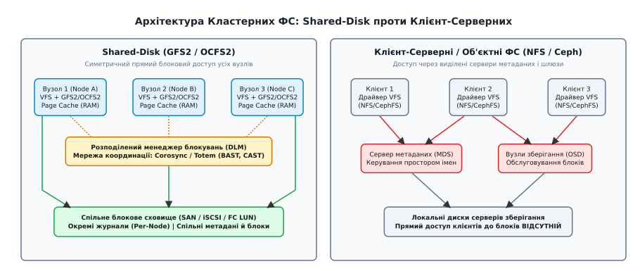
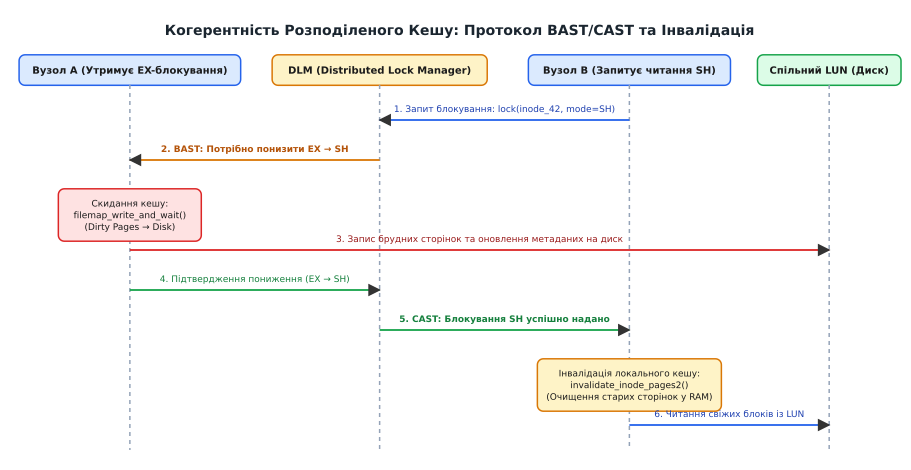
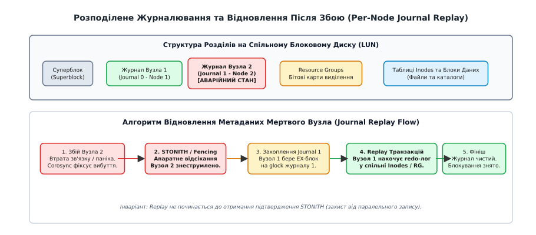
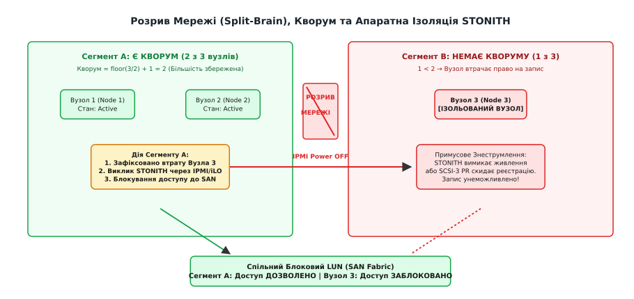

# Кластерні файлові системи: GFS2 і OCFS2

<preknowlist>
- [VFS: спільний шар над файловими системами](topic:sys-unix/vfs-layer) — абстракція inode, dentry та операцій файлової системи в ядрі.
- [Inode: файл без імені](topic:sys-unix/inode-model) — метадані файлу, лічильники посилань та блокова адресація.
- [Кеш сторінок, fsync і довговічність запису](topic:sys-unix/page-cache-durability) — буферизація читання й запису в оперативній пам'яті (page cache) та механізм dirty pages.
- [Журналювання й узгодженість після збою](topic:sys-unix/journaling-consistency) — транзакційність, журнали redo та відновлення стану метаданих після збою.
- [Родини файлових систем: ext4, XFS, Btrfs, F2FS](topic:sys-unix/filesystem-families) — класична організація дискових структур, суперблоків та екстентів у локальних ФС.
</preknowlist>

Якщо змонтувати стандартну локальну файлову систему на зразок ext4 або XFS одночасно на двох серверах, під'єднаних до спільного дискового масиву SAN (*Storage Area Network*) через Fibre Channel або iSCSI, дисковий масив буде незворотно пошкоджено за лічені секунди. Кожне ядро Linux вважає себе єдиним володарем блокового пристрою: воно тримає копії метаданих у кеші оперативної пам'яті, веде власний журнал транзакцій і самостійно вирішує, які вільні сектори виділити під нові файли через локальні бітові карти. Якщо Вузол 1 виділить вільний блок під запис нового документа, Вузол 2 про це не дізнається й одночасно призначить той самий сектор під таблицю каталогів, перезаписавши дані сусіднього вузла без жодних системних повідомлень про помилку.

Кластерні файлові системи зі спільним диском (*Shared-Disk Cluster Filesystems*) — зокрема GFS2 (*Global File System 2*) та OCFS2 (*Oracle Cluster File System 2*) — вирішують цю фундаментальну проблему, перетворюючи незалежні ядра Linux на координований кластер без єдиного вузького місця у вигляді сервера-посередника. Кожен вузол кластера має прямий апаратний доступ до спільного блокового пристрою, а взаємна узгодженість кешів сторінок, розміщення екстентів та журналів транзакцій забезпечується спеціальним механізмом між'ядерної синхронізації — розподіленим менеджером блокувань (*Distributed Lock Manager*, DLM).


*Архітектура Shared-Disk (прямий доступ усіх вузлів через SAN та координація через DLM) у порівнянні з клієнт-серверними сховищами.*

## 1. Архітектура Shared-Disk: симетричний доступ і виклик розподіленої узгодженості

У розподілених системах зберігання даних існує чіткий поділ між двома принципово різними підходами до організації доступу багатьох клієнтів до файлів:

1. **Клієнт-серверні та об'єктні сховища (NFS, SMB, CephFS, Lustre, GlusterFS)** — клієнти не мають прямого доступу до блоків на накопичувачах. Усі запити проходять через мережевий протокол до виділених серверів метаданих (*Metadata Server*, MDS) або шлюзів зберігання, які самостійно відкривають файли, серіалізують транзакції та керують дисковими операціями введення-виведення;
2. **Симетричні системи зі спільним диском (Shared-Disk: GFS2, OCFS2, GPFS / IBM Storage Scale)** — усі комп'ютери під'єднані до єдиного фізичного або логічного дискового тома (*LUN*) через високошвидкісну мережу зберігання (Fibre Channel, iSCSI, SAS або NVMe-over-Fabrics). Кожне ядро містить повноцінний драйвер файлової системи, що самостійно формує дискові команди SCSI/NVMe і виконує прямий ввід-вивід на швидкості дискової фабрики без проміжних мережевих серверів.

Головна перевага архітектури Shared-Disk — максимальна пропускна здатність і мінімальна затримка для великих операцій введення-виведення. Сервери баз даних або хости віртуалізації читають гігабайти даних напряму з дискового контролера, не навантажуючи процесори проміжних шлюзів.

Проте за цю швидкість доводиться платити високою складністю синхронізації: файлова система не має центрального координатора в пам'яті. Усі інваріанти цілісності структур даних — суперблоки, бітові карти груп виділення (*Resource Groups* у GFS2 або *Allocation Groups* у OCFS2), структури `inode`, каталоги та дискові екстенти — повинні залишатися узгодженими між десятками ядер через окрему мережу зв'язку кластера (*Cluster Interconnect*).

Детальний аналіз того, як розвивалася концепція симетричних кластерів від 1980-х років до включення в ядро Linux, наведено у вставці [📜 Історія shared-disk кластерних файлових систем](topic:sys-unix/cluster-filesystems-gfs2-ocfs2/hist-shared-disk-filesystems.md).

---

## 2. Розподілений менеджер блокувань (DLM): фундамент координації

Фундаментом, на якому тримаються GFS2 та OCFS2, є розподілений менеджер блокувань — Distributed Lock Manager (від лат. *distribuere* — розділяти, та англ. *lock* — замок/блокування). DLM не є файловою системою і нічого не знає про дискові сектори, каталоги чи файли: це абстрактний сервіс координації, який керує правами доступу вузлів кластера до довільних іменованих ресурсів (*lock resources*).

### Простір імен ресурсів та шість режимів блокування

Усі блокування функціонують у межах ізольованих просторів — *lockspaces*. Усередині простору кожен ресурс ідентифікується унікальним рядком або числовим ідентифікатором (наприклад, `inode_1048576` або `rgroup_0x4000`).

DLM ядра Linux реалізує класичну модель сумісності VAX DLM із шістьма режимами, які забезпечують гнучке керування правами від повної відсутності до абсолютної монополії:

| Режим блокування | Абревіатура | Опис прав доступу | Сумісні режими інших вузлів |
| :--- | :--- | :--- | :--- |
| **Null** | `NL` | Права відсутні. Використовується для утримання структури блокування в кеші без звернення до мережі. | `NL`, `CR`, `CW`, `PR`, `PW`, `EX` |
| **Concurrent Read** | `CR` | Дозвіл на неблоковане паралельне читання без гарантії стабільності структур. | `NL`, `CR`, `CW`, `PR`, `PW` |
| **Concurrent Write** | `CW` | Дозвіл на паралельний запис у різні частини складного ресурсу без взаємного блокування. | `NL`, `CR`, `CW` |
| **Protected Read** | `PR` (Shared) | Захищене спільне читання. Гарантує, що жоден інший вузол не змінює ресурс, поки він відкритий для читання. | `NL`, `CR`, `PR` |
| **Protected Write** | `PW` | Захищений запис. Дозволяє іншим вузлам паралельно читати лише в слабкому режимі `CR`. | `NL`, `CR` |
| **Exclusive** | `EX` | Абсолютна монополія. Дозволяє повне читання й запис, забороняючи будь-який доступ усім іншим вузлам. | `NL` |

Матриця сумісності показує фундаментальне правило: режим `Protected Read (PR)` сумісний з іншими `PR`, що дозволяє сотням вузлів одночасно читати той самий файл без мережевих затримок. Натомість режим `Exclusive (EX)` несумісний ні з чим, крім `Null`, гарантуючи атомарність змін метаданих.

### Асинхронні пастки (AST): протокол BAST і CAST

Спілкування між ядрами в DLM базується на асинхронних сповіщеннях — *Asynchronous System Traps* (AST):

1. **CAST (*Completion AST*)** — зворотний виклик, який повідомляє ядру: «Запитане блокування (або зміна режиму) успішно надане, можна виконувати читання або запис»;
2. **BAST (*Blocking AST*)** — попереджувальний сигнал тривоги. Коли Вузол 2 запитує блокування в режимі `PR`, а Вузол 1 утримує цей ресурс у режимі `EX`, DLM надсилає Вузлу 1 повідомлення BAST: «Твоє монопольне володіння блокує іншого учасника; негайно приведи свої структури до ладу й добровільно понизь режим (*demote*)».

Отримавши BAST, Вузол 1 зобов'язаний скинути всі незбережені брудні сторінки з оперативної пам'яті на спільний диск, переконатися у завершенні дискового вводу-виводу, після чого надіслати в DLM команду конверсії блокування з `EX` у `PR`. Тільки після цього Вузол 2 отримає свій `CAST` і зможе прочитати свіжі дані з диска.

### Розподілений стан без центрального сервера

DLM у ядрі Linux не має виділеного головного сервера. Стан блокувань розподіляється між усіма вузлами за допомогою хешування імен ресурсів:

* **Каталоговий вузол (*Directory Node*)** — для кожного імені ресурсу визначається вузол-директор за хеш-функцією від його назви. Він знає, який саме вузол наразі є майстром блокування;
* **Майстер ресурсу (*Resource Master*)** — вузол, який фактично керує чергами очікування (`Granted Queue`, `Convert Queue`, `Wait Queue`) для цього ресурсу;
* **Локальні копії блокувань (*Shadow Locks*)** — клієнтські вузли зберігають локальні контексти блокувань у пам'яті, щоб виконувати повторні операції читання без повторних мережевих опитувань;
* **Блок значення блокування (*Lock Value Block*, LVB)** — 32 або 64 байти додаткових службових даних, які передаються разом із повідомленнями DLM без звернення до диска (наприклад, номер версії метаданих чи розмір файлу).

Повний перелік структур даних C API, параметрів функцій `dlm_lock()` та прапорців наведено у довіднику [📋 Інтерфейси Distributed Lock Manager (DLM) та керування glocks](topic:sys-unix/cluster-filesystems-gfs2-ocfs2/api-dlm-lockspaces-and-glocks.md).

---

## 3. Модель glocks у GFS2: зв'язок VFS і DLM

У файловій системі GFS2 концепція розподілених блокувань реалізована через структуру глобальних блокувань — **glock** (`struct gfs2_glock`). Glock виступає інтелектуальним мостом між абстрактним менеджером DLM та ядровими підсистемами Linux VFS (*Virtual Filesystem*), кешем сторінок (*Page Cache*) і кешем каталогів (*dcache*).

### Анатомія та типи glocks

Усі дискові структури GFS2 прив'язані до відповідних типів glocks:

* **Inode glock (`n:<inum>`)** — контролює метадані конкретного файлу/каталогу та кешовані в RAM сторінки його вмісту. Номер glock збігається з номером дискового `inode`;
* **Resource Group glock (`r:<rg_addr>`)** — захищає групу виділення блоків (*Resource Group*). Щоб виділити вільні блоки під розширення файлу, ядро повинно захопити glock відповідної групи в режимі `EX`, змінити бітову карту на диску й звільнити блокування;
* **Superblock glock (`s:0`)** — захищає глобальний суперблок файлової системи та лічильники загального вільного простору;
* **iopen glock (`i:<inum>`)** — спеціальний glock координації видалення відкритих файлів. Якщо процес на Вузлі 1 робить `unlink("file.txt")`, файл не можна прати з диска, якщо він відкритий процесом на Вузлі 2; iopen glock утримується в режимі `PR` усіма вузлами, де файл відкритий, і блокує операцію остаточного видалення (`EX`), доки всі дескриптори не закриються;
* **Transaction / Freeze glock (`t:0`)** — керує операціями глобального заморожування файлової системи (наприклад, під час створення консистентних знімків масиву LUN);
* **Flock glock (`f:<inum>`)** — забезпечує прозору підтримку користувацьких блокувань діапазонів файлів за стандартом POSIX (`fcntl(F_SETLK)`).

### Автомат станів glock і взаємодія з кешем сторінок

Кожен `struct gfs2_glock` має внутрішній автомат станів, що відстежує чотири режими: `UN` (*Unlocked*), `DF` (*Deferred* — аналог `CW`), `SH` (*Shared* — аналог `PR`) та `EX` (*Exclusive*).


*Послідовність повідомлень BAST і CAST та синхронізація дискового кешу сторінок при зміні власника блокування.*

Взаємодія glock з кешем сторінок регулюється суворими інваріантами:

1. **Захоплення EX для запису:** Процес виконує системний виклик `write()`. GFS2 перевіряє стан `inode glock`. Якщо glock ще не в стані `EX`, надсилається запит до DLM. Отримавши `EX`, ядро дозволяє запис: дані змінюються в адресному просторі сторінок (`address_space`), сторінки позначаються як брудні (*dirty*), а операція записується в локальний журнал транзакцій;
2. **Конкурентний запит читання:** Інший вузол викликає `read()` для цього файлу і просить у DLM блокування `SH`. DLM виявляє конфлікт і надсилає BAST власнику `EX`;
3. **Примусове скидання брудного кешу:** Обробник BAST у GFS2 переводить glock у стан `GLF_DEMOTE_IN_PROGRESS` і викликає ядрову функцію `filemap_write_and_wait(inode->i_mapping)`. Усі брудні сторінки з RAM примусово записуються через дисковий контролер на диск, а журнал скидає незавершені транзакції метаданих. Після підтвердження запису на рівні сховища GFS2 повідомляє DLM про завершення деградації до `SH`;
4. **Інвалідація локального кешу:** Вузол-читач отримує CAST від DLM. Перед тим, як повернути дані системному виклику `read()`, GFS2 викликає `invalidate_inode_pages2()`. Локальний кеш сторінок очищується, старі сторінки видаляються з пам'яті, і наступне звернення обов'язково зчитує актуальні блоки безпосередньо зі спільного диска.

Практичну програмну модель цієї послідовності реалізовано у вставці [⚙️ Симуляція розподіленого менеджера блокувань та когерентності кешу](topic:sys-unix/cluster-filesystems-gfs2-ocfs2/proj-distributed-lock-sim.md).

---

## 4. Архітектура OCFS2: o2dlm, dlmfs та локальні пули виділення

Файлова система OCFS2 (*Oracle Cluster File System 2*) розроблялася з прицілом на високу продуктивність баз даних Oracle RAC та віртуальних машин, тому її архітектура має низку суттєвих відмінностей від GFS2.

### Власний стек o2cb та модуль o2dlm

На відміну від GFS2, яка традиційно використовує загальносистемний DLM ядра Linux (`dlm.ko`) разом із менеджером кластера Corosync, OCFS2 має власний автономний кластерний стек `o2cb` (*Oracle Cluster Control Block*) із вбудованим модулем `o2dlm`. Він відрізняється спрощеною конфігурацією та вбудованим механізмом відстеження працездатності вузлів через періодичні дискові пінги (*disk heartbeating*).

### Віртуальна файлова система dlmfs

Однією з найпотужніших можливостей OCFS2 є віртуальна файлова система `dlmfs`. Вона експортує розподілені блокування ядра безпосередньо у простір користувача через звичайні файлові операції VFS.

Користувацький застосунок (наприклад, процес сервера бази даних) може створити файл всередині змонтованої точки `/dlm/mydomain/lock_resource` і захопити кластерне блокування за допомогою стандартного системного виклику `flock()` або `fcntl()`:

* `flock(fd, LOCK_SH)` — захоплення розподіленого блокування `Protected Read`;
* `flock(fd, LOCK_EX)` — захоплення монопольного блокування `Exclusive`;
* Читання та запис у дескриптор `fd` за допомогою `read()` / `write()` дозволяють атомарно передавати між вузлами невеличкі службові структури даних — *Lock Value Blocks* (LVB, розміром 64 байти), не звертаючись до диска.

### Локальні алокатори простору (Local Allocator Files)

Виділення дискових блоків у кластерній системі — надзвичайно дорога операція, оскільки кожна зміна глобальної бітової карти вимагає захоплення ексклюзивного блокування DLM. Якщо десятки процесів одночасно створюють тисячі дрібних файлів, глобальне блокування бітової карти стане катастрофічним вузьким місцем.

OCFS2 вирішує це за допомогою дворівневої системи алокаторів:

1. **Глобальний алокатор (*Global Bitmap*)** — містить загальний стан дискових екстентів кластера;
2. **Локальні алокатори вузлів (*Local Alloc Files*)** — кожен вузол попередньо резервує для себе великий неперервний діапазон блоків (наприклад, 16–64 МБ) з глобальної бітової карти за одну транзакцію DLM. Усі наступні операції створення файлів на цьому вузлі виділяють сектори виключно з локального пулу в оперативній пам'яті без жодних мережевих звернень до інших вузлів. Лише коли локальний пул вичерпується, вузол знову звертається до глобальної бітової карти.

### Лічильники поколінь та валідація dcache

Щоб уникнути повної інвалідації кешу записів каталогів (`dcache`) при кожній зміні файлової системи, OCFS2 використовує лічильники поколінь `inode` (*generation counters*). Кожна зміна структури файлу інкрементує лічильник генерації в LVB блокування; вузли-читачі порівнюють локальне значення з мережевим і оновлюють тільки ті структури `dentry`, які реально змінилися.

---

## 5. Розподілене журналювання: Per-Node Journals та аварійне відновлення

Найскладніший виклик у побудові кластерної файлової системи зі спільним диском — організація журналювання транзакцій (*Journaling*).

У класичних локальних файлових системах (ext4 з журналом JBD2 або XFS) існує один журнал транзакцій, куди ядро лінійно записує блоки метаданих перед їх фіксацією на диску. Якщо дозволити кільком незалежним ядрам писати в один журнал на спільному диску, їхні послідовності транзакцій переплутаються, а вказівники голови та хвоста кільцевого буфера будуть знищені.

### Розділені журнали на кожен вузол (Per-Node Journals)

І в GFS2, і в OCFS2 застосовується принцип ізольованих журналів: при форматуванні файлової системи (`mkfs.gfs2` або `mkfs.ocfs2`) на диску створюється фіксована кількість окремих журнальних файлів: `journal0`, `journal1`, ..., `journalN-1` — по одному для кожного потенційного вузла кластера.


*Структура per-node журналів на диску та процес аварійного накатування redo-транзакцій іншим вузлом після збою.*

Коли вузол монтує файлову систему, він захоплює ексклюзивне блокування DLM на один із вільних журналів (наприклад, Вузол 1 захоплює `journal0`, а Вузол 2 — `journal1`). Під час роботи ядро пише транзакції метаданих виключно у власний журнал.

### Алгоритм аварійного відновлення після падіння вузла (Journal Replay)

Якщо один із серверів кластера зазнає раптового апаратного збою (паніка ядра, відключення живлення або апаратне зависання), його оперативна пам'ять втрачається, а незавершені дискові операції залишаються зафіксованими лише в його персональному журналі на спільному диску.

Процес відновлення цілісності відбувається автоматично живими вузлами кластера:

1. **Діагностика збою:** Кластерний менеджер членства (Corosync або `o2cb`) фіксує втрату зв'язку з Вузлом 2;
2. **Апаратна ізоляція (Fencing):** Живі вузли знеструмлюють або відрізають збійний вузол від сховища через апаратні засоби (STONITH). Це найважливіший крок: доки немає 100% гарантії, що Вузол 2 мертвий, відновлення розпочинати категорично заборонено;
3. **Захоплення журналу мертвого вузла:** Вузол 1 виявляє, що блокування DLM на `journal1` звільнилося, і захоплює його в режимі `Exclusive`;
4. **Накатування транзакцій (Redo Log Replay):** Вузол 1 зчитує незавершені транзакції з `journal1`, перевіряє їхні контрольні суми й накатує зафіксовані зміни метаданих (розподіл екстентів, оновлення `inode`, каталоги) у спільні дискові структури;
5. **Очищення та фіналізація:** Журнал `journal1` позначається як чистий, усі блокування ресурсів, які утримував мертвий вузол, очищуються в DLM, і файлова система повертається до повністю консистентного стану без зупинки роботи інших вузлів.

---

## 6. Продуктивність та підводні камені: Lock Bouncing, False Sharing та затримки

Робота зі спільним диском створює ілюзію повної прозорості: системні виклики `open()`, `read()`, `write()` виглядають так само, як і на локальному диску. Проте продуктивність кластерної файлової системи кардинально залежить від патернів доступу.

### Затримки: локальна пам'ять проти мережевого інтерконнекту

У локальній файловій системі захоплення м'ютекса для блокування `inode` займає одиниці наносекунд у процесорному кеші:

```text
Локальний spinlock / mutex у RAM:     ~10-50 нс
Мережевий раунд-тріп DLM (BAST/CAST):  ~0.5-2.0 мс  (у 50 000 разів довше!)
Синхронне скидання Page Cache на SAN:  ~1-5 мс
```

### Пінг-понг блокувань (Lock Bouncing)

Якщо два процеси на різних вузлах намагаються одночасно записувати дані в один спільний файл (наприклад, у спільний лог-файл додатку `app.log`), виникає катастрофічний ефект пінг-понгу блокувань (*Lock Bouncing* або *Lock Thrashing*):

1. Вузол 1 захоплює `EX` на `inode`, пише рядок у кеш;
2. Вузол 2 викликає `write()`, просить `EX` у DLM;
3. DLM надсилає BAST Вузлу 1;
4. Вузол 1 зупиняє роботу, скидає сторінку на дисковий масив, звільняє блокування;
5. Вузол 2 отримує CAST, інвалідує свій кеш, читає блок з диска, дописує свій рядок;
6. Вузол 1 знову викликає `write()` — і цикл повторюється.

У результаті пропускна здатність запису падає з сотень тисяч операцій введення-виведення на секунду (IOPS) до кількох сотень, оскільки кожна операція запису вироджується у синхронний мережевий раунд-тріп DLM та примусовий дисковий флеш.

### Оптимальні патерни роботи з GFS2 / OCFS2

Щоб уникнути деградації продуктивності, застосовують такі архітектурні правила:

* **Ізоляція каталогів:** кожен сервер працює у власному підкаталозі (`/mnt/cluster/node1/`, `/mnt/cluster/node2/`), що повністю усуває конфлікти за `dentry` та блокування каталогів;
* **Прямий ввід-вивід (Direct I/O):** бази даних (Oracle RAC) відкривають дискові файли з прапорцем `O_DIRECT`. Це повністю вимикає ядровий `page cache` Linux: дані записуються безпосередньо в дискові сектори через DMA, усуваючи необхідність у BAST-скиданні сторінок пам'яті;
* **Read-mostly навантаження:** якщо файли переважно читаються сотнями серверів, а записуються рідко, GFS2/OCFS2 працюють зі швидкістю локального кешу оперативної пам'яті, оскільки всі вузли утримують блокування в паралельному режимі `Protected Read (PR)`.

---

## 7. Кворум, Split-Brain та безапеляційний Fencing (STONITH)

Кластерна файлова система зі спільним диском не може безпечно функціонувати без апаратних гарантій захисту від розриву мережі — катастрофічного явища, відомого як **Split-Brain** («роздвоєння мозку»).


*Захист від split-brain: збереження кворуму більшістю вузлів та апаратне відсікання ізольованого вузла через STONITH.*

### Анатомія катастрофи Split-Brain

Уявімо кластер із трьох серверів (Вузол 1, Вузол 2, Вузол 3), під'єднаних до спільного дискового сховища. Між серверами раптово переривається мережевий зв'язок: Вузол 1 та Вузол 2 залишаються на зв'язку між собою, а Вузол 3 виявляється повністю ізольованим у мережі, але зберігає справне апаратне підключення до дискового масиву SAN.

Якщо не вжити спеціальних заходів:
1. Сегмент A (Вузол 1 і 2) вирішить, що Вузол 3 помер, захопить його `journal2` і почне накатувати незавершені транзакції;
2. Сегмент B (Вузол 3) вирішить, що померли Вузли 1 і 2, і почне самостійно змінювати ті самі бітові карти та таблиці `inode` на спільному диску.

Обидві сторони одночасно і несинхронізовано записуватимуть суперечливі метадані в один дисковий том. За кілька хвилин файлова система перетвориться на нечитабельне місиво секторів, яке не зможе відновити жоден `fsck`.

### Правило кворуму більшості

Для запобігання split-brain використовується концепція **кворуму** (від лат. *quorum* — «яких [достатньо]»). Кворум визначає мінімальну кількість голосів, необхідну для того, щоб сегмент кластера мав законне право продовжувати дискові операції:

```text
Кворум = floor(N / 2) + 1
```

де `N` — загальна початкова кількість зареєстрованих вузлів кластера:
* У 3-вузловому кластері кворум дорівнює `floor(3/2) + 1 = 2`. Сегмент із двох вузлів має кворум і продовжує роботу; ізольований сегмент з одного вузла втрачає кворум і негайно блокує всі операції вводу-виводу;
* Для 2-вузлових кластерів (де `floor(2/2) + 1 = 2`, тобто втрата будь-якого вузла веде до втрати кворуму) застосовують спеціальний сторонній арбітр — кворумний демон (*QNetd*) або спільний кворумний дисковий сектор (*Quorum Disk / tie-breaker*), що додає вирішальний додатковий голос.

### Необхідність апаратного Fencing (STONITH)

Самого лише програмного правила кворуму недостатньо. Ядро на ізольованому вузлі може не знати, що воно втратило зв'язок (наприклад, під час глибокого зависання ядра, переривань високого пріоритету або тимчасового перевантаження черги пам'яті). Якщо такий вузол «прокинеться» через 30 секунд після того, як живі вузли вже відновили його журнал, його дисковий контролер HBA виштовхне накопичені в чергах застарілі брудні сторінки безпосередньо в SAN, знищивши нові метадані.

Єдиний спосіб гарантувати безпеку — **Fencing** (від англ. *fence* — огорожа, ізоляція), реалізований за принципом **STONITH** (*Shoot The Other Node In The Head*):

1. **Апаратне знеструмлення через IPMI / BMC / iLO / iDRAC:** Сегмент із кворумом надсилає команду контролеру керування живленням збійного сервера й фізично вимикає його живлення;
2. **Керовані блоки розподілу живлення (Switched PDU):** Вимкнення живлення відповідної розетки в серверній стійці;
3. **SCSI-3 Persistent Reservations (PR):** Реєстрація ключів вузлів на рівні дискового контролера сховища. Живі вузли надсилають дисковому масиву команду `PREEMPT AND ABORT` з ключем мертвого вузла. Контролер сховища апаратно анулює реєстрацію порту HBA мертвого сервера й скидає всі його черги команд.

> ⚠️ **Залізний інваріант кластерних ФС:** Жоден живий вузол не має права розпочинати Journal Replay та відновлення метаданих збійного вузла, доки від агента fencing не надійде апаратне підтвердження успішного вимкнення або ізоляції збійного сервера.

---

## 8. Практична діагностика та інспекція кластерних структур

> 🔧 **Навіщо це.**
> Розуміння внутрішнього стану розподілених блокувань дозволяє точно локалізувати причини несподіваного зависання процесів у стані `D` (*Uninterruptible Sleep*). У дев'яноста відсотках випадків проблема криється не в повільному диску, а у підвисанні демона `dlm_controld`, втраті мережевого зв'язку інтерконнекту або очікуванні відповіді на BAST від перевантаженого сусіднього вузла.

### Аналіз стану блокувань через debugfs GFS2

Діагностичний інтерфейс GFS2 у `debugfs` дає змогу побачити стан кожного активного блокування ядра:

```bash
# Перегляд списку glock файлової системи
cat /sys/kernel/debug/gfs2/my_cluster:storage1/glocks | grep -E "^G:.*s:EX"
```

Приклад рядка діагностики:
```text
G:  s:EX n:2/1a4f0 f:lIdt t:EX d:EX/0 l:1 a:0 r:3
 H: s:EX f:H e:0 p:14820 [my_application]
```

* `s:EX` — glock утримується у монопольному стані;
* `n:2/1a4f0` — тип ресурсу `2` (inode), номер `0x1a4f0` (десятковий inode 107760);
* `f:lIdt` — прапорці (`l` = заблоковано для змін, `d` = отримано запит на demote BAST, `t` = триває конверсія);
* `H: s:EX ... p:14820` — локальний процес з PID `14820` (`my_application`) утримує блокування.

Якщо glock тривалий час має прапорець `d` (*demote requested*), але не змінює стан, це свідчить про те, що локальний процес завис у дисковому ввід-виводі під час скидання брудних сторінок.

### Перевірка стану кластерного менеджера DLM

Утиліта `dlm_tool` дозволяє отримати стан просторів блокувань та черг очікування:

```bash
# Перевірка списку зареєстрованих просторів блокувань
dlm_tool ls

# Вивантаження черги конфліктних блокувань
dlm_tool lockdebug -c gfs2_fs
```

### Відновлення та перевірка цілісності

Кластерні файлові системи підтримують повну перевірку диска, але з обов'язковою вимогою: перевірка утилітами `fsck.gfs2` або `fsck.ocfs2` повинна запускатися лише тоді, коли файлова система повністю розмонтована на **всіх** вузлах кластера, або запущена в спеціальному кластерному режимі, узгодженому через DLM:

```bash
# Перевірка цілісності GFS2 (тільки після розмонтування на всіх вузлах!)
fsck.gfs2 -y /dev/mapper/mpatha

# Перевірка та відновлення OCFS2
fsck.ocfs2 -f -y /dev/sdb1
```

---

## Підсумок: баланс між швидкістю та стійкістю

Кластерні файлові системи GFS2 та OCFS2 реалізують ідеал симетричної паралельної обробки: максимальну пропускну здатність прямого блокового доступу до SAN без жодних проміжних серверів-посередників. Ця швидкість досягається ціною складного розподіленого узгодження, де кожна зміна структури диска координується через асинхронні пастки DLM, локальні кеші сторінок примусово інвалідуються за мережевими командами BAST, а цілісність даних після збоїв гарантується per-node журналами та безапеляційним апаратним відсіканням збійних вузлів через STONITH.
