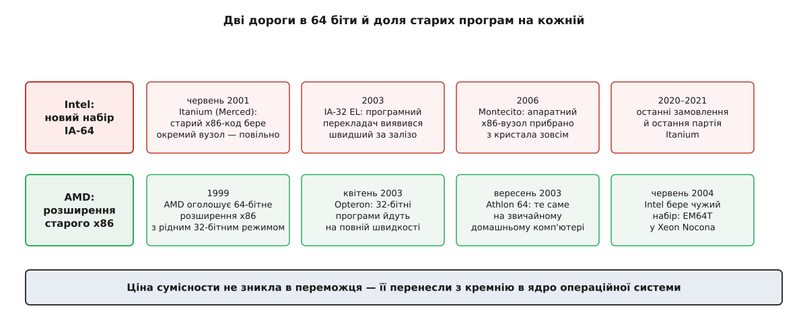

# 📜 Дві дороги в 64 біти: як шар сумісности став спільним і чому старі програми вирішили все

Шар сумісности народився двічі. Спершу — як шість разів переписаний вручну код у шести незалежних портах ядра, який у грудні 2002 року нарешті звели докупи. Паралельно — як питання, що вбило цілу процесорну архітектуру: чи має 64-бітна машина виконувати старі 32-бітні програми на повній швидкості, чи достатньо, щоб вони просто якось працювали. Друга історія пояснює, чому перша взагалі знадобилася x86-64.

## Шість портів, шість перекладів того самого

Уявлення, ніби перехід у 64 біти стався коло 2003 року разом із домашніми процесорами, оманливе. Linux мав 64-бітні порти майже десятиліттям раніше — і саме там уперше довелося вирішувати задачу про дві розрядності на одному ядрі.

Найгостріше вона стояла в SPARC. Робочі станції Sun мали великий парк 32-бітних програм, і 64-бітний порт Linux/SPARC був би нікому не потрібний, якби ті програми на ньому не запускалися. Тому в дереві ядра з'явився файл із промовистим ім'ям `sys_sparc32.c` — кількатисячний обробник, який приймав системні виклики від 32-бітних програм, перерозкладав аргументи, перебудовував структури й передавав усе далі рідному коду ядра. Схожа задача постала перед MIPS64, перед 64-бітним S/390 від IBM, перед PowerPC64, перед PA-RISC, перед IA-64.

І кожен порт розв'язував її сам.

Тут варто зупинитися, бо дублювання буває різне. Якби йшлося про схожі функції з різними іменами — це була б косметика. Але переклад типів на межі ядра — не косметика: це місце, де помилка в одному зсуві поля означає, що програма прочитає сміття замість розміру файлу, а помилка в знаковому розширенні аргументу відкриває дорогу для обходу перевірки прав. Кожен порт мав власну копію такої логіки, і кожна копія мала власні помилки. Знайшли ваду в тому, як `sys_sparc32.c` обробляє `nanosleep`, — виправили в SPARC. У MIPS та сама вада жила далі, бо ніхто не здогадався туди подивитися.

При цьому змістовна частина в усіх портах збігалася майже дослівно. Структура `timeval` має два поля цілого типу; у 32-бітної програми вони по чотири байти, у ядра — по вісім; треба прочитати два малі й скласти два великі. Цей опис не залежить від того, SPARC це чи MIPS. Від архітектури залежить лише те, які саме типи є вужчими та як вони вирівнюються, — тобто дуже вузька смуга рішень, обрамлена величезною спільною частиною.

## Грудень 2002: винести спільне, лишити архітектурі її частку

4 грудня 2002 року Стівен Ротвелл (Stephen Rothwell), австралійський розробник ядра з Канберри, надіслав у розсилку `linux-kernel` набір латок під заголовком про **шар сумісних системних викликів**. Ідея була не «написати переклад для ще однієї архітектури», а протилежна: описати переклад один раз так, щоб кожна архітектура домовляла лише своє.

Механіка виявилася простою настільки, що це радше про смак, ніж про винахідливість. З'являється спільний заголовок `include/linux/compat.h` зі структурами на кшталт `compat_timeval`, `compat_utimbuf`, `compat_itimerval` — тими самими, що раніше в кожному порті звалися `timeval32`, `struct timeval32` і подібно. Кожна архітектура, яка хоче шар, зобов'язана дати власний `asm/compat.h` і в ньому визначити базові типи: `compat_time_t`, `compat_suseconds_t`, `struct compat_timespec`. Тобто відповісти лише на питання «а що для мене означає *вужче*». Далі спільний код будує з цих цеглин усі складніші структури сам.

> 🔧 **Навіщо це.** Префікс `compat_` — не стиль іменування, а зміна власника відповідальности. До нього питання «як виглядає `timeval` для 32-бітної програми» ставили в кожному порті окремо, і кожна відповідь була локальною правдою. Після нього питання ставлять один раз у спільному коді, а архітектура відповідає тільки за ширину елементарних типів. Саме тому x86-64, порт значно молодший за SPARC64, не писав свій переклад: він прийшов на готовий каркас і дописав до нього кілька десятків рядків.

Друга половина роботи була не технічна, а організаційна, і вона показова. У ті самі тижні Лінус Торвальдс переробив `nanosleep` на нову внутрішню механіку — і, за його ж словами, полишив на «людей із compat» довести це до ладу. Ротвелл переробив, витягнувши спільну серцевину виклику в допоміжну функцію `do_nanosleep`, якою далі користувалися і рідний виклик, і сумісний. У відповіді Девідові Міллеру, супроводжувачеві SPARC, він додав рядок, у якому вся суть затії: *«Isn't it nice that it only needs to be fixed once :-)»* — «правда ж, приємно, що це треба виправити лише раз». (Розсилка `linux-kernel`, 9 грудня 2002.)

Ось що насправді дав спільний шар. Не менше коду — коду вийшло приблизно стільки ж. Він дав **єдине місце, у якому помилка існує**. Для механізму, чиї вади мають наслідки в правах доступу, це не оптимізація, а зміна порядку величини ризику.

## Розвилка: два способи дійти до 64 бітів

Поки ядро наводило лад із перекладом, індустрія розв'язувала питання ширше: як узагалі мають виглядати 64-бітні процесори для широкого ринку.

Intel відповіла: почати з чистого аркуша. Архітектура IA-64, утілена в процесорах Itanium, будувалася на ідеї, що розкладати інструкції по виконавчих пристроях має не процесор під час роботи, а [компілятор наперед](topic:hw-arch/vliw-epic) — інструкції пакуються у зв'язки, всередині яких паралельність оголошено явно, і кристалу не треба тримати складну машинерію [позачергового виконання](topic:hw-arch/out-of-order-execution), яка щоразу заново з'ясовує, що з чим можна виконати одночасно. Задум мав елегантну економію: складність переїжджає з кремнію, де за неї платять транзисторами й енергією на кожному такті, у [компілятор](topic:sf-lang/compiler-optimizations), де за неї платять один раз під час збирання.

AMD відповіла інакше. Ще 1999 року вона оголосила, що не робитиме нового [набору інструкцій](topic:hw-arch/isa), а розширить наявний x86 до 64 бітів — додасть режим із широкими регістрами й широкими адресами, лишивши старий 32-бітний режим у кристалі як повноцінний, а не як поступку.

Зверніть увагу, наскільки різні це рішення за характером. Задум Intel був про майбутнє: як має виглядати обчислення, коли старого коду вже не буде. Задум AMD був про теперішнє: як прожити перехід, поки старого коду ще повно. Обидва інженерно чесні. Розсудило їх не те, чия ідея краща, а те, скільки коштує день переходу.

*Дати — за оголошеннями виробників і повідомленнями преси того часу; дві дороги показано в одному масштабі часу.*

## Що коштували старі програми на Itanium

Itanium (кодове ім'я Merced) вийшов у червні 2001 року, на роки пізніше за початкові обіцянки. Старий x86-код він виконувати вмів: у кристалі був окремий апаратний вузол для цього. Але вмів — не означає добре. Швидкість того вузла була така, що серйозну 32-бітну програму на ньому просто не запускали; він годився хіба показати, що сумісність формально є.

Причина не в недбалості, а в тому, що дві машини надто різні за самою будовою. У x86 мало регістрів, змінна довжина інструкцій і порядок виконання, який процесор має з'ясувати сам; в IA-64 регістрів багато, інструкції фіксовані й запаковані у зв'язки, а порядок оголошено наперед. Апаратний вузол, який виконує чужі інструкції прямо, не має де взяти виграш: він не бачить наперед цілих ділянок коду й мусить чесно відпрацьовувати кожну команду поодинці, не маючи під собою тієї машинерії, яку IA-64 свідомо викинула.

Далі сталося те, що найкраще показує глибину проблеми. 2003 року Intel випустила **IA-32 EL** (*IA-32 Execution Layer*) — не залізо, а програму: [динамічний перекладач двійкового коду](topic:hw-arch/dynamic-binary-translation), який читає x86-інструкції, переводить їх у код IA-64 і, розігрівши гарячі ділянки, переоптимізовує їх укрупненими блоками. За заявами Intel, це давало 32-бітним програмам швидкість, порівнянну з тодішнім Xeon MP на 1.5 ГГц. Головне тут не число, а порівняння: **програмний перекладач виявився швидшим за апаратний вузол, зроблений для тієї самої задачі**. Тому вузол зрештою й прибрали — починаючи з покоління Montecito (2006) апаратної підтримки x86 в Itanium уже не було зовсім.

Але навіть найкращий перекладач не дає рідної швидкости, і це відчувалося на кожному кроці переходу: щоб вивести з Itanium повну користь, програму треба було перезібрати, а зібрати добрий код для IA-64 виявилося важко — увесь тягар пошуку паралельности лягав на компілятор, і компілятори того рівня писалися повільно й болісно.

## Чому перемогла нудніша ідея

У квітні 2003 року AMD випустила Opteron — серверний процесор із набором, який назвали AMD64. Через п'ять місяців, 23 вересня 2003 року, вийшов Athlon 64, і те саме опинилося на звичайному домашньому комп'ютері. Наслідок для покупця був простий до банальности: машину можна купити сьогодні, увесь наявний парк 32-бітних програм працює на ній із тією самою швидкістю, що й раніше, а 64-бітними програми стають тоді, коли до цього дійдуть руки. Переходу як окремої події немає взагалі — є поступове заміщення.

Порівняйте з альтернативою: купити Itanium означало, що завтра частина робочого парку йде повільно, доки її не перезберуть, а перезбирання залежить від постачальників кожної окремої програми.

Далі відбулося те, що остаточно закрило питання: Intel сама взяла набір конкурента. У червні 2004 року вийшли процесори Xeon на ядрі Nocona з розширенням EM64T (згодом перейменованим на Intel 64) — по суті тим самим AMD64. За широко цитованими свідченнями того часу, вирішальним важелем був тиск Microsoft, яка не хотіла супроводжувати дві несумісні 64-бітні гілки Windows для одного ринку; окремо перевірити цю мотивацію за первинними документами важко, тому тримаймо її як добре засвідчену версію, а не як задокументований факт. Комерційний підсумок — уже факт: із 2004 року в масовому x86 було одне 64-бітне розширення, і не Intel його придумала.

Itanium після цього ще довго жив у своїй ніші великих серверів, головно завдяки HP. Останні замовлення на нього приймали до початку 2020 року, остання партія відвантажена наприкінці липня 2021-го. Порт `ia64` у Linux пережив залізо ненадовго: спершу лишився без опікуна, потім його прибрали з дерева ядра.

## Що з цієї історії варто винести

Розділімо, як належить, три різні речі, які легко злипаються в одну.

**Ідея.** Задум IA-64 не був хибним. Перекласти планування паралельности на компілятор — розумна думка, і в тому самому десятилітті вона добре працювала в спеціалізованих процесорах цифрового оброблення сигналів, де код однорідний і передбачуваний. Хибним було припущення, що це так само спрацює на коді загального призначення, повному непередбачуваних розгалужень і звертань у пам'ять, де компілятор просто не знає наперед того, що процесор дізнається під час роботи.

**Реалізація.** Апаратна сумісність зі старим кодом на Itanium була реалізована, працювала і формально закривала пункт у переліку можливостей. Але «формально є» й «нею користуються» — різні стани, і різниця між ними виміряна тим самим числом, що й швидкість. Показово, що врешті ту саму функцію краще виконала програма — і зробила апаратний вузол зайвим.

**Комерційний результат.** Виграла не архітектура з кращим задумом, а та, що дозволила не переходити. І це не мораль про консерватизм ринку: вартість переходу — така сама реальна інженерна величина, як швидкість чи споживання, просто платить її не виробник, а всі користувачі разом, кожен своїм часом простою.

Лишається останнє, найменш очевидне. Обидві дороги мали заплатити за старий код — питання було тільки в тому, хто платить. Intel клала цю ціну в кремній, потім у динамічний перекладач. AMD поклала її в операційну систему: 32-бітний режим виконується апаратно й задарма, але хтось мусить перекладати кожну структуру, кожен номер виклику й кожен покажчик на межі ядра. Цим «кимось» став той самий узагальнений шар `compat_`, який Ротвелл звів докупи роком раніше — писаний зовсім для інших архітектур і готовий рівно до того моменту, коли 64-бітні x86 з'явилися на кожному столі.
