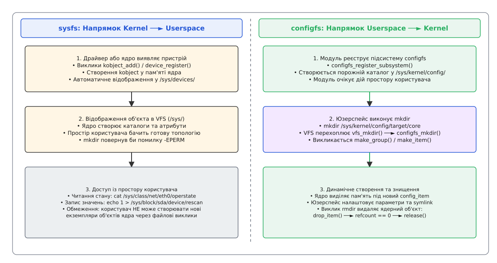
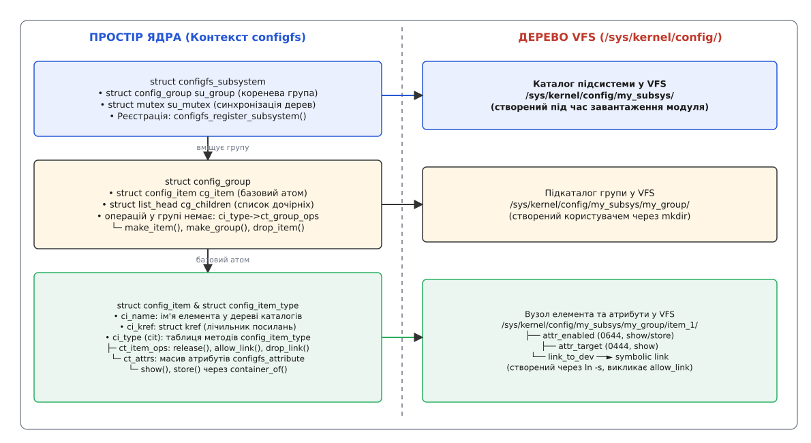
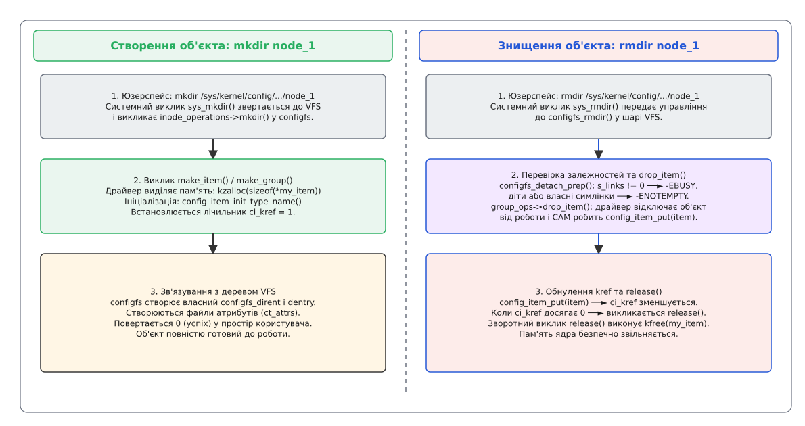

# Файлова система configfs: створення ядерних об'єктів із юзерспейсу

<preknowlist>
- [Псевдо-ФС: procfs, sysfs, tmpfs, devtmpfs](root:sys-unix/pseudo-filesystems) — віртуальні файлові системи ядра без збереження даних на фізичних дисках.
- [Файлова система sysfs, kobject та sysfs_dirent](root:sys-unix/sysfs-kobject-sysfs-dirent) — модель пристроїв Linux, ієрархія `kobject` та експорт стану ядра в юзерспейс.
- [VFS: спільний шар над файловими системами](root:sys-unix/vfs-layer) — абстракції `inode`, `dentry`, системні виклики `mkdir`, `rmdir`, `symlink`.
</preknowlist>

Коли адміністраторові потрібно налаштувати виділений iSCSI-Target у підсистемі LIO або створити динамічний USB-Gadget інтерфейс, стандартна файлова система `sysfs` виявляється безсилою. У sysfs вектор ініціації строго односпрямований: ядро виявляє фізичний пристрій чи завантажує модуль і самостійно створює записи у `/sys`, тоді як простір користувача може лише зчитувати або модифікувати параметри вже наявних об'єктів. Будь-яка спроба виконати `mkdir /sys/kernel/my_device` повертає помилку `-EPERM`, оскільки модель пристроїв забороняє юзерспейсу диктувати топологію об'єктів ядра. Для розв'язання цієї задачі у ядрі Linux існує віртуальна файлова система `configfs` (змонтована у `/sys/kernel/config/`), яка інвертує напрямок керування: кожен виклик `mkdir` створює повноцінний об'єкт у пам'яті ядра, а `rmdir` безпечно його знищує.

## Парадигмальний зсув: чому sysfs виявилася односпрямованою

У системній архітектурі Linux 2.6 віртуальна файлова система `sysfs` створювалася як дзеркальне відображення внутрішньої моделі пристроїв (англ. *Unified Device Model*). Коли шина PCI або USB виявляє новий контролер, ядро ініціалізує структуру `struct device`, вбудовує у неї `struct kobject` і реєструє відповідні каталоги у `/sys/devices/`. Життєвий цикл цих об'єктів повністю контролюється драйвером: при підключенні кабелю об'єкт з'являється у `/sys`, при відключенні — зникає.

Такий підхід точно лягає на фізичне обладнання — і розсипається на підсистемах, визначених програмно. Мережевий Target (iSCSI, NVMe-oF, Fibre Channel), композитний USB-Gadget, вузол кластерного менеджера блокувань: кількість і склад цих об'єктів ядро не може знати заздалегідь, бо їх задає адміністратор або демон уже після завантаження. Апаратної події, яка породила б відповідний `kobject`, тут просто не відбувається — а без неї модель пристроїв не має чого відображати.

Дозволити простору користувача створювати каталоги у `sysfs` викликом `mkdir` архітектори ядра відмовилися, і відмова була принциповою: `sysfs` тримає догму «один атрибут — один файл», а ієрархія каталогів відтворює точний граф `kobject`. Якби юзерспейс довільно створював там каталоги, зникла б межа між фізичним станом обладнання та користувацькими налаштуваннями. Технічно ця відмова виглядає буденно: у таблиці `inode_operations` каталогів `sysfs` методу `mkdir` немає взагалі, а VFS на його відсутність відповідає `-EPERM`. Обхідні шляхи, якими розробники користувалися доти — бінарні `ioctl()` та розбір текстових конфігурацій у `/proc`, — теж не прижилися, кожен зі своєї причини.

Відповіддю стала окрема псевдо-файлова система `configfs` (від англ. *configuration filesystem*), що ввійшла в ядро Linux 2.6.16. Вона інвертує класичну парадигму VFS:

```
sysfs:    Ядро створює об'єкт ──► VFS створює каталог ──► Юзерспейс читає/пише атрибути
configfs: Юзерспейс робить mkdir ──► VFS викликає ядро ──► Ядро виділяє memory & struct config_item
```


*Парадигмальний контраст: sysfs відображає створені ядром об'єкти, а configfs дозволяє простору користувача створювати об'єкти ядра викликом mkdir.*

Докладніше про причини виникнення цієї інфраструктури, її історію та пізнішу еволюцію API викладено у вставці [📜 Історія створення configfs та еволюція керування ядерними об'єктами](root:sys-unix/configfs-user-space-kernel-object-creation/hist-configfs-evolution.md).

## Фундаментальні будівельні блоки: `config_item`, `config_group` та `configfs_subsystem`

В основі `configfs` лежать три головні C-структури пам'яті ядра: `struct config_item`, `struct config_group` та `struct configfs_subsystem`.

### Базовий атом: `struct config_item`

Аналогом `kobject` із `sysfs` у світі `configfs` виступає структура `struct config_item`. Вона описує поодинокий конфігураційний вузол і зазвичай вбудовується (англ. *embed*) всередину більшої структури даних драйвера:

```c
/* витяг: лише ті поля, про які йдеться нижче.
   Повний склад структури — в api-вставці. */
struct config_item {
    char                          *ci_name;
    struct kref                    ci_kref;
    const struct config_item_type *ci_type;
    struct dentry                 *ci_dentry;
};
```

Кожне з цих полів відіграє критичну роль у функціонуванні вузла:
- **`ci_name`**: текстове ім'я елемента, яке передається під час системного виклику `mkdir` і стає назвою відповідного каталогу у файловій системі `/sys/kernel/config/`.
- **`ci_kref`**: атомарний лічильник посилань (`struct kref`). Він гарантує, що об'єкт не буде вилучений із оперативної пам'яті доти, доки на нього тримає посилання бодай один компонент ядра — сам драйвер, вузол дерева `configfs` або чуже символічне посилання.
- **`ci_type`**: вказівник на таблицю типів `config_item_type`, яка описує операції над об'єктом, методи очищення пам'яті та списки файлових атрибутів.
- **`ci_dentry`**: вказівник на вузол `dentry`, який зв'язує ядерний об'єкт із шаром VFS. На відміну від `sysfs`, файлова система `configfs` так і не перейшла на спільний шар `kernfs` і досі тримає власне внутрішнє дерево `configfs_dirent` поверх звичайних `dentry` та `inode`.

### Контейнер каталогу: `struct config_group`

Якщо `config_item` є поодиноким вузлом (листом дерева), то `struct config_group` виступає каталогом-контейнером, здатним містити дочірні елементи або інші групи:

```c
/* витяг; решта полів — cg_subsys, default_groups, group_entry — в api-вставці */
struct config_group {
    struct config_item              cg_item;
    struct list_head                cg_children;
};
```

Група містить у собі вкладений `cg_item`, завдяки чому сама відображається у VFS як каталог. Поле `cg_children` є головою двозв'язного списку, куди додаються всі дочірні елементи. Самих зворотновикликальних методів у групі немає: фабрика об'єктів — `make_item()` та `make_group()` — лежить у таблиці типів вкладеного елемента, за вказівником `cg_item.ci_type->ct_group_ops`. Тому одну й ту саму таблицю операцій поділяють усі групи того самого типу.

### Кореневий каталог підсистеми: `struct configfs_subsystem`

Вершиною ієрархії є структура `struct configfs_subsystem`:

```c
struct configfs_subsystem {
    struct config_group     su_group;
    struct mutex            su_mutex;
};
```

Коли модуль ядра викликає `configfs_register_subsystem(&my_subsys)`, у точці монтування `/sys/kernel/config/` створюється каталог з ім'ям підсистеми. М'ютекс `su_mutex` забезпечує абсолютну синхронізацію: він захищає дерево об'єктів від станів гонитви при одночасному виконанні `mkdir` або `rmdir` кількома паралельними процесами.


*Внутрішня організація структур пам'яті ядра configfs та їх пряме відображення у каталоги та файли VFS.*

Повний перелік сигнатур методів, структур та макросів наведено у довідникові [📋 Контракт API: структури, зворотновикликальні методи та прапори configfs](root:sys-unix/configfs-user-space-kernel-object-creation/api-configfs-structures.md).

## Життєвий цикл об'єкта: перехоплення `mkdir`, `rmdir` та підрахунок посилань `ci_kref`

Уся робота `configfs` тримається на тому, що `mkdir` і `rmdir` тут не метафора: ядро перехоплює справжні системні виклики у власній таблиці `inode_operations` і перетворює їх на виділення та звільнення структури в пам'яті.

### Створення об'єкта: Послідовність `mkdir`

Коли утиліта у просторі користувача виконує системний виклик `mkdir("/sys/kernel/config/target/core", 0755)`, ядро здійснює послідовну трансляцію виклику крізь шари абстракції:

```
mkdir() ──► sys_mkdir() ──► VFS vfs_mkdir() ──► configfs_mkdir() ──► ct_group_ops->make_item()
```

1. Шар VFS знаходить відповідний вузол `dentry` у файловій системі `configfs` і перевіряє права доступу.
2. VFS викликає метод `inode_operations->mkdir()`, який реалізовано всередині `configfs`.
3. `configfs` знаходить батьківську групу `config_group` і бере м'ютекс підсистеми `su_mutex`.
4. Викликається фабричний метод драйвера `make_item(group, name)` (або `make_group()`).
5. **Драйвер ядра**:
   - Виділяє занулену пам'ять під власну структуру: `kzalloc(sizeof(struct my_item), GFP_KERNEL)`.
   - Ініціалізує внутрішні поля структури пристрою.
   - Викликає `config_item_init_type_name(&my_item->item, name, &my_type)`. Ця функція присвоює текстове ім'я, прив'язує тип `ci_type` та встановлює початкове значення атомарного лічильника `ci_kref = 1`.
   - Повертає вказівник `&my_item->item`.
6. `configfs` зв'язує новий `config_item` із власним вузлом `configfs_dirent` та відповідним `dentry`, створює у каталозі файли атрибутів, оголошені у `ct_attrs`, і повертає `0` у простір користувача.

Якщо виклик `make_item()` повертає помилку (наприклад, `ERR_PTR(-ENOMEM)` або `ERR_PTR(-EINVAL)`), VFS миттєво скасовує створення каталогу і повертає код помилки користувачеві.

### Знищення об'єкта: Послідовність `rmdir`

Знищення об'єкта відбувається при виконанні системного виклику `rmdir("/sys/kernel/config/target/core")`:

```
rmdir() ──► sys_rmdir() ──► VFS vfs_rmdir() ──► configfs_rmdir() ──► ct_group_ops->drop_item() ──► config_item_put()
```

1. VFS передає виклик у `configfs_rmdir()`.
2. **Перевірка безпеки** у `configfs_detach_prep()`: якщо на сам каталог указує чуже символічне посилання, лічильник `s_links` ненульовий і виклик скасовується з `-EBUSY`; якщо каталог містить дочірні елементи або власні симлінки — з `-ENOTEMPTY`. (Відкриті файлові дескриптори атрибутів `rmdir` не блокують.)
3. Викликається метод драйвера `drop_item(group, item)`. Драйвер виключає об'єкт із внутрішніх списків обробки (наприклад, зупиняє передачу даних або відключає мережевий сокет) — і **сам** віддає посилання викликом `config_item_put(item)`. Так вимагає `client_drop_item()`: «якщо `->drop_item()` існує, він відповідає за `config_item_put()`». Драйвер, який не має чого прибирати, `drop_item()` не оголошує взагалі — тоді `config_item_put()` викликає `configfs` замість нього.
4. `configfs` видаляє файли атрибутів та каталог із дерева VFS.
5. Функція `config_item_put()` зменшує атомарний лічильник `ci_kref`. Коли лічильник досягає нуля, ядро автоматично викликає зворотний виклик `release(item)`, визначений у таблиці `ct_item_ops`.
6. **Деструктор `release()`**: викликає `kfree(my_item)`, безпечно повертаючи оперативну пам'ять у систему.

> 🔧 **Навіщо це.** Розділення знищення у `drop_item()` та фізичного звільнення пам'яті у `release()` усуває помилки типу *use-after-free*: доки хоч одна частина ядра тримає посилання на `config_item`, структура лишається в пам'яті. Відкритий дескриптор атрибута такою частиною бути перестав, і саме тут проходить межа версій. **До ядра 5.3** відкриття файла брало посилання на батьківський елемент (`configfs_get_config_item()` у `check_perm()`), тож після `rmdir` пам'ять доживала до `close()`. **Від 5.3**, після перероблення Ала Віро (Al Viro) з новим об'єктом `struct configfs_fragment`, відкритий файл елемента вже не тримає: `rmdir` позначає гілку мертвою (`frag_dead`), і `read()`/`write()` на тому самому дескрипторі повертають `-ENOENT` замість того, щоб іти у звільнену структуру. Дескриптор при цьому далі утримує **модуль** — через `try_module_get(ca_owner)` при відкритті, — тому `rmmod` до `close()` не пройде.


*Послідовність викликів між шаром VFS, файловою системою configfs та зворотновикликальними методами драйвера при виконанні mkdir та rmdir.*

## Символічні посилання та побудова складних графів зв'язків

Складні системні підсистеми рідко складаються з ізольованих об'єктів. У дереві LIO, наприклад, гілка сховищ живе окремо (`target/core/`, у термінах `targetcli` — *backstores*), а гілка цільових портальних груп — окремо (`target/iscsi/<iqn>/tpgt_1/`). Щоб диск став видимий через портал, треба з'єднати два ядерні об'єкти з різних гілок.

У `configfs` для вираження зв'язків між об'єктами ядра використовуються стандартні символічні посилання POSIX (англ. *symbolic links*), які створюються утилітою `ln -s`. Каталог `lun_0` заздалегідь створено викликом `mkdir`, а посилання лягає всередину нього:

```bash
ln -s /sys/kernel/config/target/core/fileio_0/disk_a \
      /sys/kernel/config/target/iscsi/iqn.2026-08.org.debian:target/tpgt_1/lun/lun_0/
```

Коли простір користувача виконує виклик `symlink(target, link_path)`, ядро реалізує таку механіку:
1. `configfs` ідентифікує об'єкт-джерело (`src` — той, у чиєму каталозі народжується посилання) та об'єкт-ціль (`target`).
2. Викликається метод джерела `ct_item_ops->allow_link(src, target)`. Немає такого методу — виклик закінчується `-EPERM`: у цьому каталозі посилання просто не передбачені.
3. **Драйвер перевіряє сумісність**: чи можна саме цей дисковий блок підключити до цього LUN. Повернений `0` означає дозвіл — далі `configfs` створює вузол посилання у VFS, бере посилання на службовий вузол цілі та збільшує її лічильник симлінків `s_links`.
4. Ненульовий `s_links` унеможливлює `rmdir` цілі: доки на об'єкт указує хоч одне чуже посилання, `configfs_detach_prep()` віддає `-EBUSY`.
5. При видаленні посилання (`rm link_path` або `unlink()`) `configfs` спершу викликає `ct_item_ops->drop_link(src, target)` — і лише потім зменшує `s_links` та віддає своє посилання. Порядок закріплено в коді навмисно: `drop_link()` мусить відпрацювати, поки ціль іще жива, інакше він поїхав би після її `drop_item()`.

Це забезпечує повну цілісність графа зв'язків у пам'яті ядра без ризику утворення висячих вказівників (англ. *dangling pointers*).

## Конкретні приклади використання підсистемами ядра

`configfs` слугує уніфікованою основою для ключових високопродуктивних підсистем Linux:

### 1. NVMe-over-Fabrics Target (`nvmet`)
Підсистема `nvmet` дозволяє експортувати блокові пристрої через мережеві протоколи NVMe/TCP та NVMe/RDMA. Вся топологія конфігурується у `/sys/kernel/config/nvmet/`, причому простори імен живуть усередині підсистеми, а не окремою гілкою верхнього рівня:
- `mkdir /sys/kernel/config/nvmet/subsystems/nvme_test`: створює нову NVMe-підсистему.
- `echo 1 > /sys/kernel/config/nvmet/subsystems/nvme_test/attr_allow_any_host`: дозволяє під'єднання будь-якого хоста.
- `mkdir /sys/kernel/config/nvmet/subsystems/nvme_test/namespaces/1`: створює простір імен усередині цієї підсистеми.
- `echo -n /dev/nvme0n1 > .../namespaces/1/device_path` та `echo 1 > .../namespaces/1/enable`: прив'язує реальний блоковий пристрій і вмикає простір імен.
- `mkdir /sys/kernel/config/nvmet/ports/1`, далі `echo tcp > ports/1/addr_trtype` і `echo 4420 > ports/1/addr_trsvcid`: створює мережевий порт і задає транспорт та номер порту TCP.
- `ln -s /sys/kernel/config/nvmet/subsystems/nvme_test /sys/kernel/config/nvmet/ports/1/subsystems/nvme_test`: публікує підсистему через цей порт — саме тут символічне посилання виражає зв'язок між двома ядерними об'єктами.

### 2. USB Gadget ConfigFS
Підсистема USB Gadget перетворює вбудовану плату Linux (наприклад, Raspberry Pi або бортовий контролер автівки) на периферійний USB-пристрій:
- `/sys/kernel/config/usb_gadget/g1/`: каталог пристрою Gadget.
- `echo 0x1d6b > idVendor` та `echo 0x0104 > idProduct`: встановлення ідентифікаторів USB.
- `mkdir functions/acm.usb0`: створення віртуального послідовного порту.
- `mkdir functions/mass_storage.usb0`: створення віртуальної флешки.
- `mkdir configs/c.1`: створення конфігурації USB.
- `ln -s functions/acm.usb0 configs/c.1/` та `ln -s functions/mass_storage.usb0 configs/c.1/`: об'єднання функцій у єдиний композитний USB-пристрій.

### 3. LIO Target (`target_core_mod`)
Підсистема LIO перетворює Linux на промисловий SAN-накопичувач (iSCSI, Fibre Channel, SRP). Утиліта `targetcli` є лише консольною обгорткою, яка виконує операції `mkdir`, `echo` та `ln -s` у каталозі `/sys/kernel/config/target/`.

Практичну реалізацію комбінованого модуля ядра з власною підсистемою `configfs` та утиліт керування мовами C і C++ наведено у вставці [⚙️ Практика: написання драйвера з інтерфейсом configfs та інструмента керування](root:sys-unix/configfs-user-space-kernel-object-creation/proj-configfs-kernel-module.md).

## Режими доступу, безпека та ізоляція у контейнерах

Взаємодія з `configfs` регулюється стандартними механізмами розмежування доступу Linux:

1. **Права доступу VFS (DAC)**:
   Режим каталогу, створеного викликом `mkdir`, у `configfs` не залежить від аргументу виклику й від маски `umask` процесу: функція `configfs_create_dir()` жорстко задає `S_IRWXU | S_IRUGO | S_IXUGO`, тобто `0755` із власником `root`. Права доступу до файлів-атрибутів визначає поле `ca_mode` у `struct configfs_attribute` — типово `0644` для читання й запису та `0444` лише для читання. Оскільки `configfs` підтримує `setattr`, адміністратор може після монтування змінити власника чи групу кореневого каталогу підсистеми (`chown`, `chmod`) і так дозволити окремій групі — скажімо, `dialout` для USB Gadget — конфігурувати саме цю підсистему без повних привілеїв суперкористувача `root`.

2. **Ізоляція у просторах імен (Namespaces)**:
   `configfs` не позначена прапором `FS_USERNS_MOUNT`, тому змонтувати її самотужки процес усередині користувацького простору імен не може — на це потрібен `CAP_SYS_ADMIN` у **початковому** просторі імен користувачів. Контейнер (Docker, LXC, systemd-nspawn) дістає `configfs` тільки тим, що господар підкидає йому вже змонтоване дерево, і типово підкидає у режимі лише для читання (`ro`), щоб недовірений контейнер не створював об'єктів ядра. Дозвіл керувати USB- чи NVMe-об'єктами — це рішення господаря змонтувати гілку на запис, а далі вже працює звичайний DAC: власник каталогу, група, біти доступу.

## Висновок: Порівняльна матриця віртуальних файлових систем ядра

Для вибору правильного інструмента при проєктуванні модулів ядра Linux необхідно чітко розрізняти призначення чотирьох головних віртуальних файлових систем:

| Файлова система | Точка монтажу | Напрямок ініціації | Основне призначення | Можливість `mkdir` з юзерспейсу |
| :--- | :--- | :--- | :--- | :--- |
| **`procfs`** | `/proc` | Kernel ──► Userspace | Інформація про процеси (`/proc/PID`), стан ядра, ресурси CPU та RAM. | Ні (повертає `-EPERM`) |
| **`sysfs`** | `/sys` | Kernel ──► Userspace | Модель пристроїв, топологія шин, драйвери апаратури, експорт `kobject`. | Ні (повертає `-EPERM`) |
| **`debugfs`** | `/sys/kernel/debug` | Двонапрямковий | Налагодження драйверів, сирі буфери, діагностика без стабільного API. | Ні (`-EPERM`) |
| **`configfs`** | `/sys/kernel/config` | **Userspace ──► Kernel** | **Динамічне створення та конфігурування об'єктів ядра користувачем.** | **Так (фундаментальний механізм)** |

Окремої згадки вартий `debugfs`: власного методу `->mkdir` у ньому немає (`debugfs_dir_inode_operations` описує лише `.lookup` і `.setattr`), тож `mkdir` там теж закінчується `-EPERM`. Каталог `tracing/instances/`, який справді приймає `mkdir` і породжує окремий буфер трасування, належить не `debugfs`, а самостійній файловій системі `tracefs` із власною таблицею `tracefs_instance_dir_inode_operations` — вона автомонтується всередину `/sys/kernel/debug/tracing` і від Linux 4.1 монтується й окремо, у `/sys/kernel/tracing`.

`configfs` усунула архітектурну прогалину в Linux, надавши безпечний, стандартизований POSIX-інтерфейс для створення об'єктів ядра у просторі користувача без ризику пошкодження пам'яті чи порушення цілісності моделі пристроїв.
