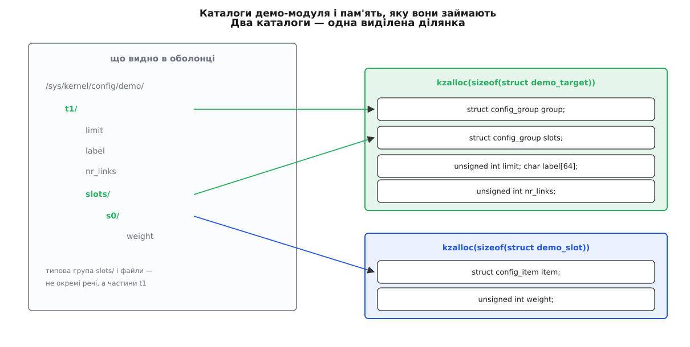

# ⚙️ Демо-модуль: власне піддерево в /sys/kernel/config

Дві сотні рядків мовою C — і в дереві налаштувань з'являється гілка `demo/`, де `mkdir` виділяє живий об'єкт у пам'яті ядра, `echo` міняє його поля, а `ln -s` оголошує зв'язок між двома об'єктами. Нижче — увесь код, який для цього потрібен, і сеанс в оболонці, де видно кожну відмову разом із її причиною.

Ось чого ми хочемо домогтися:

```
/sys/kernel/config/demo/
└── t1/                       ← mkdir створив об'єкт
    ├── limit                 ← число, 0…1024
    ├── label                 ← рядок
    ├── nr_links              ← лише читання: скільки посилань прийнято
    └── slots/                ← типова група, з'явилася сама разом із t1
        ├── s0/               ← mkdir створив підоб'єкт
        │   └── weight
        └── peer -> ../../t2  ← ln -s на сусідній об'єкт
```

Макет обрано не з примхи. `t1` мусить бути **групою**, бо всередині нього є `slots/`, а `s0` групою бути не мусить, бо дітей не має, — і в коді ця різниця вилазить одразу двома парами імен. Зв'язок між об'єктами ми теж робимо не напряму, а через `slots/`: дозвіл на посилання тоді лежить на окремому типі й не змішується з правилами самого об'єкта. Це той самий поділ, що в USB-гаджеті, де функції живуть окремо від конфігурацій, а `ln -s` каже, яка функція входить у яку.

Далі код іде шматками в тому порядку, у якому має лежати у файлі `configfs_demo.c`: кожен наступний шматок спирається на імена з попереднього.

## Дві структури й одна ділянка пам'яті

`configfs` не знає, що саме ви зберігаєте, — він бачить лише вкладений `config_item` (або `config_group`, якщо об'єкт має дітей). Тому все, що модуль хоче тримати, він кладе поруч у власну структуру й виділяє її [сам](topic:sys-unix/kernel-memory-slab).

```c
// SPDX-License-Identifier: GPL-2.0
#include <linux/configfs.h>
#include <linux/module.h>
#include <linux/slab.h>
#include <linux/string.h>
#include <linux/sysfs.h>

#define DEMO_LABEL_LEN 64
#define DEMO_LIMIT_MAX 1024

struct demo_target {
	struct config_group	group;		/* каталог t1/          */
	struct config_group	slots;		/* каталог t1/slots/    */
	unsigned int		limit;
	unsigned int		nr_links;
	char			label[DEMO_LABEL_LEN];
};

struct demo_slot {
	struct config_item	item;		/* каталог s0/          */
	unsigned int		weight;
};

static inline struct demo_target *to_demo_target(struct config_item *item)
{
	return container_of(to_config_group(item), struct demo_target, group);
}

static inline struct demo_target *slots_to_target(struct config_item *item)
{
	return container_of(to_config_group(item), struct demo_target, slots);
}

static inline struct demo_slot *to_demo_slot(struct config_item *item)
{
	return container_of(item, struct demo_slot, item);
}
```

Найважливіше тут — два `config_group` в одній структурі. Каталог `t1/` і каталог `t1/slots/` — це два різні вузли дерева, але одна-єдина ділянка, виділена одним викликом. Звідси випливає все подальше: `slots` не має власного звільнення, бо не має власної пам'яті, і зникає рівно тоді, коли зникає `t1`. А `demo_slot` виділяють окремо, бо його створює окремий `mkdir`.



*Три каталоги, дві виділені ділянки. Два з трьох каталогів — це поля однієї структури, тож `kfree` на неї буде один.*

## Три файли з двох функцій кожен

Атрибут — пара «показати» й «записати», яку макрос перетворює на `struct configfs_attribute` з готовим іменем файлу й правами.

```c
static ssize_t demo_target_limit_show(struct config_item *item, char *page)
{
	return sysfs_emit(page, "%u\n", to_demo_target(item)->limit);
}

static ssize_t demo_target_limit_store(struct config_item *item,
				       const char *page, size_t count)
{
	unsigned int v;
	int ret;

	ret = kstrtouint(page, 0, &v);	/* "abc" → -EINVAL, завелике → -ERANGE */
	if (ret)
		return ret;
	if (v > DEMO_LIMIT_MAX)
		return -ERANGE;

	to_demo_target(item)->limit = v;
	return count;			/* саме count, не 0 і не менше */
}
CONFIGFS_ATTR(demo_target_, limit);

static ssize_t demo_target_label_show(struct config_item *item, char *page)
{
	return sysfs_emit(page, "%s\n", to_demo_target(item)->label);
}

static ssize_t demo_target_label_store(struct config_item *item,
				       const char *page, size_t count)
{
	struct demo_target *t = to_demo_target(item);
	size_t len = count;

	while (len && (page[len - 1] == '\n' || page[len - 1] == '\r'))
		len--;			/* echo додає переведення рядка */
	if (len >= sizeof(t->label))
		return -ENAMETOOLONG;

	memcpy(t->label, page, len);
	t->label[len] = '\0';
	return count;
}
CONFIGFS_ATTR(demo_target_, label);

static ssize_t demo_target_nr_links_show(struct config_item *item, char *page)
{
	return sysfs_emit(page, "%u\n", to_demo_target(item)->nr_links);
}
CONFIGFS_ATTR_RO(demo_target_, nr_links);

static struct configfs_attribute *demo_target_attrs[] = {
	&demo_target_attr_limit,
	&demo_target_attr_label,
	&demo_target_attr_nr_links,
	NULL,
};
```

Буфер, що приїздить у `store()`, завжди завершений нулем — саме тому `kstrtouint()` спокійно читає його як рядок. Але `count` рахує й переведення рядка, яке додав `echo`; числові перетворювачі його терплять, а рядковий атрибут довелося б записати з «хвостом», тож у `label` ми зрізаємо його вручну.

Ім'я змінної, яку зробив макрос, збирається за жорстким взірцем: `CONFIGFS_ATTR(demo_target_, limit)` шукає функції `demo_target_limit_show` і `demo_target_limit_store`, а оголошує `demo_target_attr_limit`. Помилитися на один символ у префіксі — і компілятор скаржитиметься на невідоме ім'я в масиві, а не на макрос. `CONFIGFS_ATTR_RO` бере лише половину пари й ставить права `0444`; саме тому `nr_links` видно в `ls -l` як файл, у який не можна писати, — це не перевірка всередині коду, а режим доступу.

## Хто народжує і хто ховає

Тепер тип самого об'єкта й тип типової групи всередині нього.

```c
static void demo_target_release(struct config_item *item)
{
	kfree(to_demo_target(item));	/* єдине місце, де звільняють */
}

static const struct configfs_item_operations demo_target_item_ops = {
	.release = demo_target_release,
};

static const struct config_item_type demo_target_type = {
	.ct_item_ops	= &demo_target_item_ops,
	.ct_attrs	= demo_target_attrs,
	.ct_owner	= THIS_MODULE,
};

/* ── підоб'єкт t1/slots/s0 ─────────────────────────────────────────── */

static ssize_t demo_slot_weight_show(struct config_item *item, char *page)
{
	return sysfs_emit(page, "%u\n", to_demo_slot(item)->weight);
}

static ssize_t demo_slot_weight_store(struct config_item *item,
				      const char *page, size_t count)
{
	int ret = kstrtouint(page, 0, &to_demo_slot(item)->weight);

	return ret ? ret : count;
}
CONFIGFS_ATTR(demo_slot_, weight);

static struct configfs_attribute *demo_slot_attrs[] = {
	&demo_slot_attr_weight,
	NULL,
};

static void demo_slot_release(struct config_item *item)
{
	kfree(to_demo_slot(item));
}

static const struct configfs_item_operations demo_slot_item_ops = {
	.release = demo_slot_release,
};

static const struct config_item_type demo_slot_type = {
	.ct_item_ops	= &demo_slot_item_ops,
	.ct_attrs	= demo_slot_attrs,
	.ct_owner	= THIS_MODULE,
};

/* ── типова група t1/slots/ ────────────────────────────────────────── */

static struct config_item *demo_slots_make_item(struct config_group *group,
						const char *name)
{
	struct demo_slot *slot;

	if (strlen(name) > 8)
		return ERR_PTR(-ENAMETOOLONG);	/* NULL тут став би -ENOMEM */

	slot = kzalloc(sizeof(*slot), GFP_KERNEL);
	if (!slot)
		return ERR_PTR(-ENOMEM);

	config_item_init_type_name(&slot->item, name, &demo_slot_type);
	return &slot->item;
}

static void demo_slots_drop_item(struct config_group *group,
				 struct config_item *item)
{
	config_item_put(item);		/* не kfree: звільнить release() */
}

static int demo_slots_allow_link(struct config_item *src,
				 struct config_item *target)
{
	struct demo_target *self = slots_to_target(src);

	if (target->ci_type != &demo_target_type)
		return -EINVAL;		/* посилатися можна лише на об'єкт demo/ */
	if (target == &self->group.cg_item)
		return -ELOOP;		/* сам на себе — ні */
	if (self->nr_links >= 4)
		return -ENOSPC;

	self->nr_links++;
	return 0;
}

static void demo_slots_drop_link(struct config_item *src,
				 struct config_item *target)
{
	slots_to_target(src)->nr_links--;
}

static const struct configfs_item_operations demo_slots_item_ops = {
	.allow_link	= demo_slots_allow_link,
	.drop_link	= demo_slots_drop_link,
};

static const struct configfs_group_operations demo_slots_group_ops = {
	.make_item	= demo_slots_make_item,
	.drop_item	= demo_slots_drop_item,
};

static const struct config_item_type demo_slots_type = {
	.ct_item_ops	= &demo_slots_item_ops,
	.ct_group_ops	= &demo_slots_group_ops,
	.ct_owner	= THIS_MODULE,
};
```

`demo_slots_type` навмисно не має `release()` — і це не забудькуватість. Пам'ять групи `slots` належить структурі `demo_target`, тож звільнити її окремо означало б звільнити чужий шматок посеред живої ділянки.

Аргументи `allow_link()` легко переплутати місцями. `src` — це **не** той, на кого показує посилання, а об'єкт каталогу, **у якому** посилання створюють; `target` — той, на кого показують. Тому перевірка «чи це взагалі наша річ» дивиться на `target->ci_type`, а лічильник росте у власника `src`. Дзеркальний `drop_link()` дістає ту саму пару, але відмовити вже не може: `rm` стався, і повертати нема чого. Не оголосили `allow_link` зовсім — `ln -s` поверне `EPERM`, бо ядро не вигадує зв'язків за вас, воно питає модуль.

## Корінь піддерева

Лишилося те, що створює самі об'єкти, і те, що вішає гілку `demo/` у дерево.

```c
static struct config_group *demo_make_group(struct config_group *group,
					    const char *name)
{
	struct demo_target *t;

	t = kzalloc(sizeof(*t), GFP_KERNEL);
	if (!t)
		return ERR_PTR(-ENOMEM);

	t->limit = 1;
	strscpy(t->label, "unnamed", sizeof(t->label));

	config_group_init_type_name(&t->group, name, &demo_target_type);
	config_group_init_type_name(&t->slots, "slots", &demo_slots_type);
	configfs_add_default_group(&t->slots, &t->group);

	return &t->group;
}

static void demo_drop_item(struct config_group *group,
			   struct config_item *item)
{
	config_item_put(item);
}

static const struct configfs_group_operations demo_root_group_ops = {
	.make_group	= demo_make_group,
	.drop_item	= demo_drop_item,
};

static const struct config_item_type demo_root_type = {
	.ct_group_ops	= &demo_root_group_ops,
	.ct_owner	= THIS_MODULE,
};

static struct configfs_subsystem demo_subsys = {
	.su_group = {
		.cg_item = {
			.ci_namebuf	= "demo",
			.ci_type	= &demo_root_type,
		},
	},
};

static int __init demo_init(void)
{
	int ret;

	config_group_init(&demo_subsys.su_group);
	mutex_init(&demo_subsys.su_mutex);

	ret = configfs_register_subsystem(&demo_subsys);
	if (ret)
		pr_err("configfs_demo: реєстрація не вдалася: %d\n", ret);

	return ret;
}

static void __exit demo_exit(void)
{
	configfs_unregister_subsystem(&demo_subsys);
}

module_init(demo_init);
module_exit(demo_exit);
MODULE_LICENSE("GPL");
MODULE_DESCRIPTION("Мінімальне піддерево configfs");
```

Тут `make_group()`, а не `make_item()`, і вибору немає: типові групи живуть у списку всередині `config_group`, тож об'єкт, який їх має, мусить бути групою. Для об'єкта без дітей — як `demo_slot` — беруть `make_item()` і `config_item_init_type_name()`; це рівно та сама робота на один рівень простіша. `configfs_add_default_group()` нічого не повертає: це один рядок, що вкладає групу в список власника, і виконати його треба до того, як об'єкт поїде назад у `configfs`.

## Що встигає статися між mkdir і ls

Порядок дій усередині варто знати, бо з нього випливають дві приємні властивості. Отримавши `mkdir`, `configfs` спершу бере посилання на модуль, якому належить тип батьківського каталогу, — саме тому `rmmod` потім відмовить. Далі він кличе ваш `make_group()`. І лише **після** того, як ваша функція повернула вказівник, `configfs` вплітає групу в список дітей батька, заводить каталог і аж тоді створює файли з масиву `ct_attrs`, а потім рекурсивно повторює те саме для кожної типової групи.

Наслідок перший: недобудованого об'єкта ззовні не видно ніколи. Поки ваш код виділяє пам'ять і розставляє початкові значення, каталогу ще немає — отже, ніхто не встигне прочитати `limit`, у який ви не встигли записати одиницю. Тому початкові значення ставлять саме в `make_group()`, до `return`, як зроблено з `t->limit` і `t->label`.

Наслідок другий: відмова не лишає сміття. Якщо ви повернули `ERR_PTR(-EINVAL)`, жодного файлу ще не створено й нічого не треба прибирати — досить звільнити те, що самі виділили. Це робить перевірки в `make_group()` найдешевшим місцем для будь-якої валідації.

[Складання модуля](topic:sys-unix/kernel-modules) — звичайне, поза деревом ядра:

```make
obj-m := configfs_demo.o
KDIR  ?= /lib/modules/$(shell uname -r)/build

all:
	$(MAKE) -C $(KDIR) M=$(CURDIR) modules
clean:
	$(MAKE) -C $(KDIR) M=$(CURDIR) clean
```

## Сеанс: усе, що видно ззовні

```console
$ sudo insmod configfs_demo.ko
$ cd /sys/kernel/config/demo && sudo mkdir t1 t2
$ ls -F t1
label  limit  nr_links  slots/
$ cat t1/limit t1/label t1/nr_links
1
unnamed
0
$ echo 64 | sudo tee t1/limit > /dev/null
$ echo "камера на даху" | sudo tee t1/label > /dev/null
```

Тепер помилки — кожну з них видно в оболонці рівно такою, якою її повернув модуль:

```console
$ echo abc | sudo tee t1/limit
tee: t1/limit: Invalid argument              # kstrtouint → -EINVAL
$ echo 5000 | sudo tee t1/limit
tee: t1/limit: Numerical result out of range # наша перевірка → -ERANGE
$ sudo touch t1/mine
touch: cannot touch 't1/mine': Permission denied   # файлів тут не створюють
$ sudo ln -s ../t2 t1/slots/peer
$ cat t1/nr_links
1
$ ls -l t1/slots/peer
lrwxrwxrwx 1 root root 0 ... t1/slots/peer -> ../../t2
```

Зверніть увагу на дві різні відповіді: писали ви `../t2`, а `ls` показує `../../t2`. Шлях, який ви передали в `ln`, ядро розбирає **від поточного каталогу оболонки** (ви стояли в `demo/`), а показує його вже перерахованим від каталогу самого посилання. Саме через це в рецептах USB-гаджета пишуть `ln -s functions/acm.usb0 configs/c.1` — цей шлях правильний з кореня гаджета, а не з `c.1`.

Знищення:

```console
$ sudo mkdir t1/slots/s0
$ sudo rmdir t2
rmdir: failed to remove 't2': Device or resource busy   # EBUSY: на нього є посилання
$ sudo rmdir t1
rmdir: failed to remove 't1': Directory not empty       # ENOTEMPTY: усередині s0
$ sudo rmdir t1/slots
rmdir: failed to remove 't1/slots': Operation not permitted  # EPERM: типова група
$ sudo rm t1/slots/peer && sudo rmdir t1/slots/s0 && sudo rmdir t1 t2
$ sudo rmmod configfs_demo
```

Поки живий бодай один об'єкт, `configfs` тримає посилання на модуль-власник типу, і `rmmod` відмовить із «Module configfs_demo is in use». Порядок розбирання не запам'ятовують — його підказують коди помилок.

> 🔧 **Навіщо це.** Цей кістяк — не навчальна іграшка, а буквально та сама будова, що в `drivers/nvme/target/configfs.c` чи `drivers/usb/gadget/configfs.c`, тільки без предметної частини. Прочитавши двісті рядків вище, ви розпізнаєте в тих файлах усе, крім назв: те саме `make_group`, ті самі типові групи, ті самі `allow_link`. Різниця лише в тому, що там у `store()` замість присвоєння полю йде виклик у справжню підсистему.

## Пастки

**`NULL` — це не «помилка», це `-ENOMEM`.** Коли `make_item()` чи `make_group()` повертає `NULL`, `configfs` перетворює його на `ERR_PTR(-ENOMEM)`. Відмова через погане ім'я приїде до людини як «немає пам'яті», і шукати вона буде зовсім не там. Кожна відмова — свій `ERR_PTR(-…)`.

**`drop_item()` не звільняє.** Він робить `config_item_put()`, тобто прибирає те посилання, яке ви завели при виділенні; пам'ять звільнить `release()`, коли лічильник дійде до нуля — можливо, пізніше. `kfree` у `drop_item()` віддає ділянку, на яку ще хтось може дивитися. Якщо в `drop_item()` вам нічого робити, його можна не писати взагалі: тоді `config_item_put()` зробить сам `configfs`. А от `release()` для всього, що ви виділяли, обов'язковий — без нього ніхто не звільнить нічого, і витік буде тихий.

**`store()` повертає `count`.** Не нуль (запис на нуль байтів змусить оболонку крутитися) і не «скільки я насправді спожив»: коротка відповідь — це для простору користувача частковий запис, і `write` спробує дописати хвіст, викликавши `store()` вдруге з рештою рядка.

**4096 байтів і тиша.** Буфер атрибута — стала `SIMPLE_ATTR_SIZE`, тобто 4096, і це саме стала, а не розмір сторінки поточної машини. Запис обрізають до 4095 байтів і дописують нуль у кінці, а назовні віддають саме це, менше число: помилки не буде, `store()` побачить рядок, який виглядає цілим, — а оболонка, побачивши частковий запис, слухняно надішле хвіст другим викликом, і той хвіст приїде в `store()` уже як окреме самостійне значення. `show()` теж мусить вкластися в одну сторінку — цього за вас пильнує `sysfs_emit()`, який ще й перевіряє, що буфер починається рівно з початку сторінки (`configfs` віддає під нього окрему сторінку, тож перевірка проходить).

**Вказівник на `config_item` не можна просто зберегти.** Між тим, як ви його взяли, і тим, як скористалися, хтось може зробити `rmdir`. Хочете тримати — беріть `config_item_get()` і повертайте `config_item_put()`. А коли об'єкт узяли **в роботу** й хочете, щоб `rmdir` на нього відмовляв, а не просто чекав, — це `configfs_depend_item()` і потім `configfs_undepend_item()`; так `LIO` не дає прибрати сховок під живою сесією. Цю пару не можна кликати зсередини самих зворотних викликів `configfs` — вона бере ті самі внутрішні замки й заклинить сама на собі.

**Свої поля — свій замок.** `nr_links` вище чіпають лише зворотні виклики `configfs`, і цього досить. Щойно те саме поле почне читати робочий потік чи обробник переривання, знадобиться [власна синхронізація](topic:sys-unix/kernel-locking): `configfs` серіалізує зміни **дерева**, а не вашу структуру.
