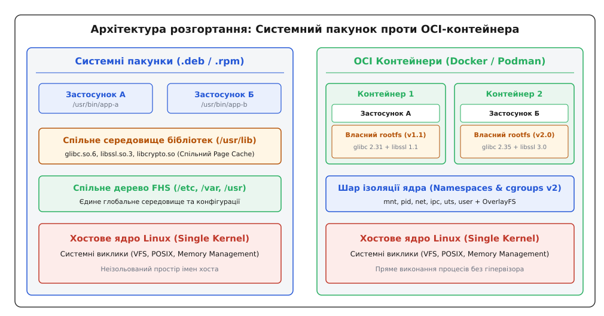
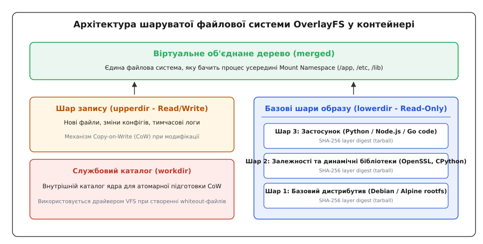

# Контейнер проти пакунка

<preknowlist>
- [Файлова система FHS](topic:sys-unix/fhs-layout) — стандарт розміщення файлів у дистрибутивах Linux.
- [Модель пакетного менеджера](topic:sys-unix/package-manager-model) — принципи обліку файлів та граф залежностей системних пакунків.
</preknowlist>

Розгортання програмного забезпечення в операційних системах сімейства Unix та Linux спирається на два фундаментально різних підходи: традиційні системні пакунки (`.deb`, `.rpm`) та сучасні OCI-контейнери (`Docker`, `Podman`).

Головне завдання, яке вирішують обидві технології, єдине: **доставити програмний продукт користувачу разом із необхідними залежностями та гарантувати його надійний запуск**. Проте відповідь на питання про те, як саме оперувати спільними ресурсами операційної системи, ці технології дають принципово протилежну.

*Порівняльна архітектура розгортання: системний пакунок інтегрується у спільне середовище хоста, тоді як OCI-контейнер створює автономний rootfs.*

---

## 1. Системний пакунок: Інтеграція у спільне середовище

Традиційний системний пакунок — це архів, який розпаковує виконувані файли, конфігурації та ресурси програми безпосередньо у глобальну файлову систему хоста за стандартом FHS (`/usr/bin`, `/usr/lib`, `/etc`).

Пакетний менеджер (APT у Debian/Ubuntu або DNF у Red Hat/Fedora) не дублює базові системні бібліотеки у складі кожного пакунка. Замість цього він будує граф залежностей за допомогою SAT-солвера, знаходить необхідні розділювані бібліотеки в системних каталогах хоста і покладається на те, що ядро завантажить їх у пам'ять для багатьох програм одночасно.

Зв'язування виконуваного файла з бібліотеками виконується динамічним компонувальником `ld.so` під час запуску процесу, що вимагає наявності сумісних версій символів ABI в системному кеші `/etc/ld.so.cache`.

**Ключові переваги пакунків:**
- **Виняткова економія ресурсів:** Системні бібліотеки (наприклад, `glibc` або `OpenSSL`) завантажуються в оперативну пам'ять хоста лише один раз і прозоро діляться між усіма запущеними процесами через спільний Page Cache ядра.
- **Централізоване усунення вразливостей:** Оновлення одного системного пакунка `libssl` у дистрибутиві негайно захищає абсолютно всі програми на хості, що його використовують, без необхідності їхньої перекомпіляції.

**Ключові недоліки пакунків:**
- **Конфлікти версій ("Пекло залежностей"):** Дві програми на одному хості не можуть використовувати різні несумісні версії однієї динамічної бібліотеки, якщо вони розгортаються в спільні системні каталоги `/usr/lib`.
- **Жорстка прив'язка до дистрибутива:** Програма, зібрана для певної версії Ubuntu, може не запуститися на Debian або RHEL через розбіжності системних символів ABI C-бібліотеки.
- **Ризики інсталяційних скриптів:** Використання керуючих скриптів `postinst` з правами `root` створює загрозу небажаної модифікації глобального стану хоста або пошкодження конфігурацій інших програм під час інсталяції.

---

## 2. OCI-контейнер: Автономність та ізоляція

Контейнер не записує свої файли у загальні системні каталоги хоста. Замість цього він постачається у вигляді незмінного образу, що містить власне автономне кореневе дерево файлової системи — **`rootfs`**.

Усередині контейнера запаковано сам застосунок, потрібні версії мовних середовищ виконання, системні утиліти, конфігурації та власні копії динамічних бібліотек. Завдяки низькорівневим механізмам ядра Linux (Namespaces для ізоляції та cgroups v2 для обмеження ресурсів) контейнерний рушій створює для процесу ізольований погляд на файлову систему, мережевий стек, пристрої та дерево процесів.

Для збереження дискового простору та прискорення доставки образи контейнерів складаються з незмінних шарів, які об'єднуються у прозоре віртуальне дерево за допомогою шаруватої файлової системи OverlayFS.

*Об'єднання незмінних базових шарів (lowerdir) із мутабельним шаром контейнера (upperdir) через OverlayFS.*

При спробі модифікації файлу з базового незмінного шару `lowerdir` ядро застосовує механізм Copy-on-Write (CoW), створюючи копію файла у верхньому шарі запису `upperdir`.

**Ключові переваги контейнерів:**
- **Гарантована консистентність середовища:** Контейнер виконується повністю однаково на ноутбуці розробника, тестовому сервері та у промисловому кластері Kubernetes, вирішуючи проблему "працює на моїй машині".
- **Безпечна ізоляція:** Застосунки ізольовані від хостової системи і не можуть пошкодити конфігурації сусідніх сервісів. Контейнери обмежують права процесів через Seccomp профілі та забирають небезпечні Linux capabilities (`CAP_SYS_ADMIN`).

**Ключові недоліки контейнерів:**
- **Дублювання оперативної пам'яті:** Кожен контейнер тримає власні копії бібліотек у пам'яті, що приводить до розриву системного Page Cache і збільшує загальне споживання RAM.
- **Дрейф оновлень безпеки (CVE Drift):** Оновлення бібліотеки на хості не впливає на контейнери; кожен контейнерний образ необхідно заново збирати через CI/CD конвеєр.
- **Накладні витрати storage driver:** Використання CoW у OverlayFS викликає затримку I/O при першій модифікації великих файлів, що вимагає використання окремих змонтованих томів (bind mounts) для баз даних.

---

## 3. Підсумкове порівняння моделей

Обидві системи доповнюють одна одну у сучасних інфраструктурах: системні пакунки формують стабільне хостове середовище ядра та базових демонів, тоді як OCI-контейнери забезпечують передбачуване розгортання прикладних застосунків.

| Архітектурна характеристика | Системний пакунок (`.deb` / `.rpm`) | OCI-контейнер (`Docker` / `Podman`) |
| :--- | :--- | :--- |
| **Розміщення файлів** | Спільне дерево FHS хоста (`/usr`) | Ізольований `rootfs` у Mount Namespace |
| **Зв'язування бібліотек** | Динамічне (через спільний `/usr/lib`) | Автономне (всередині OCI-образу) |
| **Витрати оперативної пам'яті** | Мінімальні (спільний Page Cache) | Вищі (дублювання копій у RAM) |
| **Модель обслуговування** | Централізована через `apt upgrade` | Перезбирання образів через CI/CD |

Для поглибленого вивчення низькорівневих системних викликів, внутрішнього устрою OverlayFS та прикладів коду мовами C та C++ зверніться до детальної статті [Контейнер проти пакунка: Архітектура,Дивись розгляд у [детальній статті](topic:sys-unix/containers-vs-packages/containers-vs-packages-d.md).
