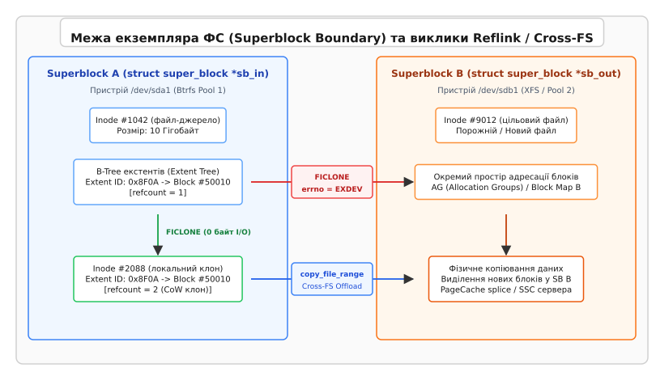
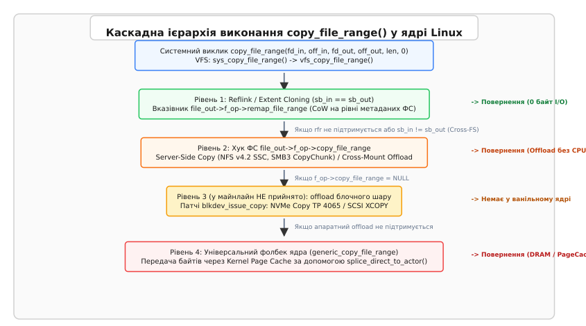
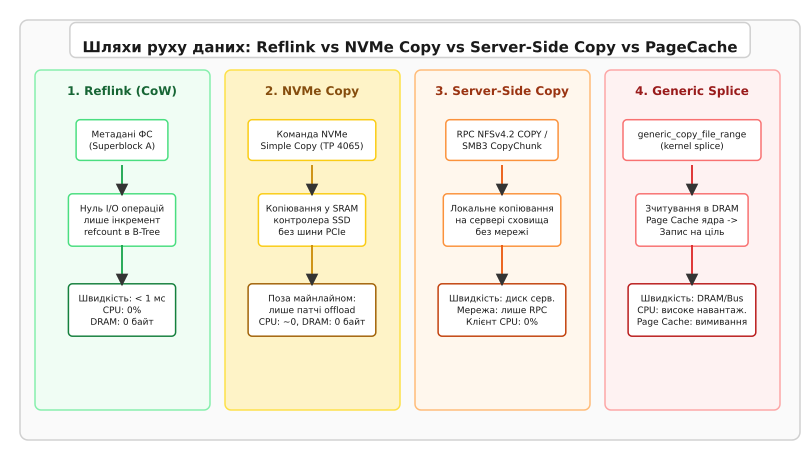

# copy_file_range, reflink та копіювання на рівні ФС

<preknowlist>
- [Віртуальна файлова система (VFS)](topic:sys-unix/vfs-layer) — абстракція ядра Linux, структура `file_operations` та маршрутизація викликів введення-виведення.
- [Копіювання через Reflink](topic:sys-unix/reflink-copies) — механіка Copy-on-Write на рівні екстентів Btrfs та XFS за допомогою `FICLONE`.
- [Системний виклик copy_file_range](topic:sys-unix/copy-file-range-syscall) — базовий API `copy_file_range(2)` та його чотирирівнева ієрархія offload.
</preknowlist>

Спроба рантайму контейнеризації `containerd` або системи управління віртуальними машинами KVM скопіювати образ диска розміром 50 Гігобайтів між двома каталогами системи може завершитися за 2 мілісекунди без жодної операції зчитування з накопичувача або вимагати 45 секунд інтенсивного прокачування даних через оперативну пам'ять (DRAM). Така кардинальна різниця у часі та навантаженні на системні ресурси визначається тим, чи зможе ядро Linux приховати фізичне переміщення байтів за завісою Copy-on-Write клонування метаданих, чи буде змушене перекласти копіювання на сервер мережевої файлової системи, чи прокачати кожен байт через сторінковий фолбек ядра.

Коли прикладний застосунок звертається до системного інтерфейсу з проханням дублювати файл, ключовим фактором ефективності є фізична та логічна межа екземпляра файлової системи (Superblock Boundary). Якщо обидва файли розташовані у межах одного тома CoW-файлової системи, операція зводиться до маніпуляцій з B-деревами. Однак як тільки вихідний та цільовий файловий дескриптор перетинають межу пристроїв, томів або мережевих точок монтування, звичайний механізм Reflink стає фізично неможливим, змушуючи ядро Linux активувати складні каскадні механізми маршрутизації на рівні VFS, блочного шару та мережевих протоколів.

## Природа Reflink та його жорсткі межі (Superblock Boundary)

Технологія Reflink (`FICLONE` / `FICLONERANGE`) забезпечує миттєве клонування файлів за допомогою створення спільних екстентів на рівні метаданих диска. Замість виділення нових фізичних блоків на накопичувачі та дублювання байтів, драйвер файлової системи створює новий inode і підв'язує його до тих самих адрес дискових екстентів, що й джерело, інкрементуючи лічильник посилань (`refcount`) у відповідних деревах екстентів.


*Клонування метаданих через Reflink можливе лише у межах одного екземпляра `super_block`. При перетині меж пристроїв `FICLONE` повертає помилку `EXDEV`, а `copy_file_range` активує Cross-FS offload або VFS-фолбек.*

Фізична можливість виконання Reflink обмежена абсолютною вимогою ядра: файлові дескриптори `fd_in` та `fd_out` повинні належати **одному й тому самому екземпляру суперблока** (`file_inode(file_in)->i_sb == file_inode(file_out)->i_sb`). Неможливість виконання Reflink між різними файловими системами або пристроями є не адміністративним обмеженням, а фундаментальним наслідком архітектури зберігання даних:

1. **Ізоляція простору адресації блоків**: Кожен екземпляр `super_block` має власну логічну карту дискових блоків (`block_t`). Адреса блоку `0x4F8A0` у файловій системі A відповідає фізичному сектору першого диска і не має жодного відношення до адреси `0x4F8A0` на другому диску або у файловій системі B.
2. **Локальність дерев метаданих**: У файловій системі XFS лічильники посилань на екстенти зберігаються у спеціалізованих B-деревах груп виділення (Allocation Groups, `refcountbt` та `rmapbt`). В Btrfs ця інформація міститься у загальносистемному дереві екстентів (Extent Tree, `btrfs_extent_data_ref`). Драйвер ФС не може вставити посилання на дисковий блок одного пристрою у B-дерево метаданих іншого накопичувача.
3. **Межі сабволюмів та пулів**: У Btrfs клонування екстентів можливе між різними субтомами (Subvolumes), якщо вони знаходяться у межах єдиного пулу накопичувачів (спільна структура `struct btrfs_fs_info`). Проте спроба клонувати файл між двома незалежними пулами Btrfs миттєво відхиляється.

На рівні внутрішнього коду драйвера XFS (`fs/xfs/xfs_reflink.c`) функція `xfs_reflink_remap_prep()` виконує перевірку сумісності екземплярів суперблока і при найменшій розбіжності відхиляє виконання операції:

```c
// Перевірка сумісності суперблоків у ядрі Linux (fs/xfs/xfs_reflink.c)
int xfs_reflink_remap_prep(struct file *file_in, loff_t pos_in,
                           struct file *file_out, loff_t pos_out,
                           loff_t *len, unsigned int remap_flags)
{
    struct inode *inode_in = file_inode(file_in);
    struct inode *inode_out = file_inode(file_out);

    // Строга перевірка належності до одного екземпляра super_block
    if (inode_in->i_sb != inode_out->i_sb) {
        return -EXDEV; // Повернення помилки при перетині меж ФС
    }

    // Перевірка прав доступу та режимів блокування
    if (IS_DAX(inode_in) || IS_DAX(inode_out)) {
        return -EOPNOTSUPP;
    }

    return generic_remap_checks(file_in, pos_in, file_out, pos_out, len, remap_flags);
}
```

У драйвері Btrfs (`fs/btrfs/reflink.c`) реалізовано аналогічний перевірочний механізм: функція `btrfs_remap_file_range_prep()` зіставляє вказівники на `root->fs_info`. Якщо два субтоми належать різним масивам або різним віртуальним пристроям, ядро перериває виконання з кодом `EXDEV`.

Якщо прикладний процес викликає системну функцію `ioctl(fd_out, FICLONE, fd_in)` для файлів із різних суперблоків, ядро повертає код помилки `EXDEV` (*Invalid cross-device link*, `errno = EXDEV`).

> 🔧 **Навіщо це.**
> Зміна статусу помилки `EXDEV` є сигналом для архітектора системного ПЗ: операція не може бути виконана за допомогою метаданих. Спроба «полагодити» `EXDEV` повторними викликами `ioctl` безглузда — застосунок повинен переключитися на декларативний системний виклик `copy_file_range` або потоковий `splice`.

Детальний аналіз історичної еволюції системних викликів копіювання, архітектурних дискусій довкола автофолбеку та рішень розробників ядра Linux винесено в окрему вставку [hist-cross-fs-evolution.md](topic:sys-unix/copy-file-range-cross-fs-reflink/hist-cross-fs-evolution.md).

## Еволюція маршрутизації Cross-FS у ядрі Linux

Системний виклик `copy_file_range(2)`, впроваджений у ядрі Linux 4.5, розроблявся як універсальний інструмент передачі даних без транзиту через буфери користувацького простору. Однак семантика його поведінки при перетині файлових систем зазнала трьох етапів кардинальної трансформації у ядрі Linux:

### Ера суворого відхилення (Linux 4.5 – 5.2)
Початково ядро Linux дотримувалося концепції строгого розділення меж. Якщо файлові дескриптори належали різним суперблокам (`sb_in != sb_out`), шар VFS не намагався виконувати копіювання, а миттєво повертав помилку `EXDEV`. Прикладне ПЗ мало самостійно перехоплювати `EXDEV` і реалізовувати власний фолбек через `splice(2)` або `read(2)` / `write(2)`.

### Ера автоматичного VFS-фолбеку (Linux 5.3 – 5.18)
У ядрі Linux 5.3 розробники VFS впровадили авто-фолбек у самій `vfs_copy_file_range()`: якщо файлові системи відрізнялися, ядро більше не повертало `EXDEV`, а викликало `generic_copy_file_range()`, яка передає дані через Kernel Page Cache механізмом `splice`. Це спростило код високорівневих систем, але викликало проблеми у виробничих середовищах:
- Застосунки, що очікували миттєвого клонування, починали непомітно зависати на десятки секунд при копіюванні великих файлів між моунт-поінтами.
- Контейнерні файлові системи (OverlayFS) при копіюванні шарів зчитування/запису витрачали гігабайти оперативної пам'яті на вимивання Page Cache.
- Виникли складнощі у мережевих файлових системах SMB3 та NFS через порушення контексту прав доступу та асинхронного переривання сигналів.

### Сучасна каскадна ієрархія (Linux 5.19+)
У ядрі 5.19 фолбек для крос-ФС спершу прибрали зовсім, а потім повернули вже свідомо й з чіткою межею — відтоді функція VFS `vfs_copy_file_range()` реалізує суворо впорядкований каскадний алгоритм обробки запиту.

```
[Запит copy_file_range(fd_in, off_in, fd_out, off_out, len, 0)]
                          │
                          ▼
             ┌──────────────────────────┐
             │ 1. sb_in == sb_out?      │
             └────────────┬─────────────┘
                Так │           │ Ні (Cross-FS)
                    ▼           ▼
       ┌──────────────────┐   ┌──────────────────────────┐
       │ remap_file_range │   │ f_op->copy_file_range    │
       │  (Reflink CoW)   │   │ (NFS SSC / SMB3 / Driver)│
       └──────────────────┘   └────────────┬─────────────┘
                                           │ Не підтримується / NULL
                                           ▼
                              ┌──────────────────────────┐
                              │ generic_copy_file_range  │
                              │ (Kernel PageCache Splice)│
                              └──────────────────────────┘
```


*Шлях обробки запиту `copy_file_range` від миттєвого Reflink у межах одного суперблока до мережевого SSC та сторінкового фолбеку ядра; рівень апаратного offload блочного шару лишається патчсетом поза майнлайном.*

Внутрішня функція ядра `vfs_copy_file_range()` послідовно виконує наступну перевірку:

```c
// Спрощений алгоритм маршрутизації у ядрі Linux (fs/read_write.c)
ssize_t vfs_copy_file_range(struct file *file_in, loff_t pos_in,
                            struct file *file_out, loff_t pos_out,
                            size_t len, unsigned int flags)
{
    // 1. Перевірка прапорців та прав доступу VFS
    if (flags != 0) return -EINVAL;
    if (!(file_in->f_mode & FMODE_READ) || !(file_out->f_mode & FMODE_WRITE))
        return -EBADF;

    // 2. Спроба виконання Reflink (якщо ФС підтримує CoW і sb_in == sb_out)
    if (file_inode(file_in)->i_sb == file_inode(file_out)->i_sb) {
        if (file_out->f_op->remap_file_range) {
            loff_t remap_len = file_out->f_op->remap_file_range(
                file_in, pos_in, file_out, pos_out, len, REMAP_FILE_CAN_SHORTEN);
            if (remap_len > 0) return remap_len;
        }
    }

    // 3. Спроба виклику драйвера файлової системи (NFS SSC, SMB3 CopyChunk)
    if (file_out->f_op->copy_file_range) {
        ssize_t ret = file_out->f_op->copy_file_range(
            file_in, pos_in, file_out, pos_out, len, flags);
        if (ret != -EOPNOTSUPP && ret != -EXDEV) return ret;
    }

    // 4. Універсальний VFS-фолбек через Kernel Page Cache та splice
    return generic_copy_file_range(file_in, pos_in, file_out, pos_out, len, flags);
}
```

Перш ніж передати запит системного виклику у внутрішню функцію, VFS викликає функцію `generic_copy_file_checks()`. Ця функція валідує відповідність діапазонів типів `loff_t` та `size_t`, перевіряє сумісність прапорців доступу та переконується, що джерело і ціль не вказують на той самий файл із перекриттям діапазонів (Overlapping Ranges), яке могло б спричинити псування даних.

Коли прикладний процес намагається передати невалідизовані значення зміщень, ядро відловлює спроби виходу за максимальний допустимий розмір файлу даної файлової системи (який визначається полем `sb->s_maxbytes`). Якщо сума зміщення та довжини перевищує `s_maxbytes`, VFS обрізає довжину запиту або повертає помилку `EFBIG`.

Крім того, шар VFS аналізує атрибути незмінності файлів (File Immutability Flags, `S_IMMUTABLE` / `S_APPEND`). Якщо цільовий inode має встановлений біт `S_IMMUTABLE` (наприклад, через `chattr +i`), ядро негайно перериває обробку виклику з поверненням помилки `EPERM`.

Окремої перевірки на прозоре стиснення екстентів (Transparent Filesystem Compression) у VFS немає — усе вирішує сам шлях даних. Якщо у файловій системі Btrfs або ZFS для джерела увімкнено стиснення `zstd` або `lzo`, виклик Reflink клонує стиснені екстенти без їх розпакування. Проте при виконанні Cross-FS копіювання на Ext4 ядро прозоро декомпресує дані у Page Cache перш ніж відправити їх цільовому пристрою.

При використанні специфічних підсистем зберігання, таких як підтоми реального часу XFS (Realtime Subvolumes) або механізм вбудованих даних Ext4 Inline Data (де маленькі файли зберігаються безпосередньо в тілі inode), VFS перевіряє сумісність форматів. Якщо джерело використовує Inline Data, ядро переключиться на сторінковий фолбек, оскільки клонування дискових екстентів для Inline Data є неможливим.

Завдяки цим перевіркам VFS не дає скласти комбінацію опцій монтування й типів накопичувачів, за якої копіювання мовчки пошкодить дані. Записи, породжені копіюванням, ідуть звичайним шляхом блочного введення-виведення, тому їх обліковує контролер `io` підсистеми `cgroups` — як і будь-який інший запис процесу.

Крім того, при виконанні копіювання у кластерних файлових системах (таких як OCFS2 або CephFS) ядро бере до уваги міжвузлові блокування distributed lock manager (DLM). Якщо інший вузол кластера утримує ексклюзивне блокування на файл, виклик чекає на його вивільнення — саме тому `copy_file_range` на кластерній ФС може заблокувати потік надовго.

У результаті системний виклик `copy_file_range` слугує єдиною та прозорою точкою входження для будь-яких дискових та мережевих маніпуляцій у сучасних версіях ядра Linux, об'єднуючи під єдиним API апаратні прискорювачі та програмні сторінкові фолбеки.

Вичерпну матрицю системних характеристик, параметрів, атомарності та кодів помилок `errno` зіставлено у довідниковій вставці [api-cross-fs-matrix.md](topic:sys-unix/copy-file-range-cross-fs-reflink/api-cross-fs-matrix.md).

## Каскадний Offload та апаратне копіювання блочного шару

Коли копіювання йде між різними файловими системами чи дисками, напрошується думка перекласти саму роботу на контролер накопичувача й не проганяти байти через системну оперативну пам'ять (DRAM). Межу тут треба провести чітко: **у ванільному ядрі Linux шляху від `copy_file_range` до апаратного копіювання блочного шару немає**. Серія патчів copy offload (`blkdev_issue_copy`, згодом `blkdev_copy_offload`, `block/blk-lib.c`) від 2021 року пройшла два десятки редакцій у розсилці `linux-block` і станом на ядра 6.x у майнлайн не прийнята. Самі команди пристроїв існують і описані стандартами — далі йдеться про те, що вміє залізо, а не про те, що вже робить ванільний VFS; із реальних шляхів offload у майнлайні працюють лише мережевий Server-Side Copy і Reflink у межах суперблока.


*Порівняння навантаження на CPU, DRAM та системну шину: Reflink виконує лише інкремент лічильників, NVMe Copy працює всередині контролера SSD (можливість заліза, не шлях ванільного ядра), Server-Side Copy виконує дублювання на боці мережевого сервера, а Generic Splice прокачує дані через оперативну пам'ять.*

### 1. NVMe Simple Copy Command (TP 4065 / NVMe 2.0)
У сучасних твердотільних накопичувачах (SSD) стандарту NVMe 2.0 реалізовано специфікацію Simple Copy (Technical Proposal 4065). Ця технологія дозволяє хост-системі відправити контролеру NVMe єдину команду з вказівкою діапазону початкових LBA-адрес джерела (Source LBAs) та цільової LBA-адреси (Destination LBA).

Контролер накопичувача виконує дублювання блоків всередині власної внутрішньої пам'яті SRAM/DRAM або шляхом внутрішньосховищного переміщення сторінок NAND-флешпам'яті. При цьому:
- Дані **не передаються** через системну шину PCI Express у системну оперативну пам'ять комп'ютера.
- Навантаження на центральний процесор (CPU) хоста є близьким до нуля (~0.1%).
- Швидкість копіювання досягає 5–8 Гігобайт/сек, обмежуючись лише внутрішньою матрицею контролера SSD.

У запропонованій реалізації блочний шар (`block/blk-lib.c`, `blkdev_issue_copy`) перевіряє вирівнювання блоків джерела та цілі на розмір логічного сектора накопичувача (512 або 4096 байтів). Якщо файл джерела фрагментовано, виклик розбивається на серію дескрипторів діапазонів (Source Range Entries).

Підтримку віртуалізованих томів LVM та Device Mapper (`dm-linear`, `dm-thin`) у тих самих патчах додавали окремою частиною: підсистема Device Mapper мала б перевіряти, чи належать фізичні екстенти цілі та джерела одному базовому накопичувачу, і лише за спільного NVMe Namespace транслювати запит у команду Simple Copy.

### 2. SCSI EXTENDED COPY / XCOPY (SPC-4)
У дискових масивах корпоративного класу (SAN/DAS), що працюють за протоколами Fibre Channel або iSCSI, копіювання блоків усередині масиву виконує SCSI-команда `EXTENDED COPY (XCOPY)`. Linux уміє обслуговувати її на боці цілі (`drivers/target/target_core_xcopy.c`), а от ініціювати XCOPY із `copy_file_range` ванільне ядро не вміє — це та сама невзята гілка copy offload. 

Хост надсилає дисковому масиву структурований дескриптор сегментів, у якому вказує унікальні ідентифікатори LUN (Logical Unit Number) джерела і цілі та діапазони блоків. Контролер дискової стійки здійснює пряме дублювання блоків між томами у власній фабриці зберігання без участі сервера гіпервізора.

## Server-Side Copy у мережевих файлових системах (NFS v4.2 та SMB3)

Мережеві файлові системи є найбільш яскравим прикладом ефективності Cross-FS offload. При копіюванні файлу розміром 100 Гігобайт між двома мережевими каталогами традиційний підхід вимагає зчитування всього файлу по мережі на локальний комп'ютер клієнта і його повторного відправлення назад на сервер (мережевий трафік складає 200 Гігобайт).

### NFS v4.2 Server-Side Copy (RFC 7862)
Протокол NFS v4.2 реалізує механізм Server-Side Copy (SSC). Коли клієнт викликає `copy_file_range` для файлів на NFS-ресурсі, драйвер `nfs.ko` надсилає серверу RPC-запит `COPY` або `CLONE`:

```c
// Спрощена структура RPC-запиту NFSv4.2 COPY
struct COPY4args {
    stateid4         copy_src_stateid;
    stateid4         copy_dst_stateid;
    offset4          copy_src_offset;
    offset4          copy_dst_offset;
    count4           copy_count;
    bool             copy_sync;
};
```

1. **Intra-Server SSC**: Якщо обидва файли (навіть з різних точок монтування NFS) знаходяться на одному фізичному NFS-сервері, сервер виконує дублювання блоків локально на власному накопичувачі (або створює CoW-клон, якщо серверна ФС — Btrfs/XFS/ZFS). Мережевий трафік між клієнтом і сервером знижується до розміру одного RPC-пакета підтвердження.
2. **Inter-Server SSC**: Якщо файли розташовані на двох різних NFS-серверах (Server A та Server B), NFS-клієнт надсилає серверу цілі B авторизаційний токен (`COPY_NOTIFY`). Сервер B встановлює пряме з'єднання з сервером A по внутрішній високошвидкісній мережі сховища і зчитує дані напряму, минаючи клієнтську машину.

### SMB3 / CIFS CopyChunk
У мережевих протоколах Microsoft SMB 3.0+ (CIFS) виклик `copy_file_range` транслюється драйвером `cifs.ko` у серію керованих викликів `FSCTL_SRV_COPYCHUNK` або `FSCTL_SRV_COPYCHUNK_WRITE`. Клієнт надсилає серверу масив дескрипторів `COPYCHUNK_DESCRIPTOR`, що містить зміщення та довжини блоків. Сервер дублює чанки локально, повертаючи клієнту кількість реально скопійованих байтів.

## Простеження та діагностика через sysfs та tracepoints

Для діагностики продуктивності та визначення конкретного механізму копіювання, обраного ядром Linux, розробники та системні адміністратори можуть використовувати системний інструментарій простеження `ftrace` та підсистему `/sys/kernel/debug/tracing`.

Ядро Linux надає вбудовані точки простеження (tracepoints) для системного виклику `copy_file_range`:

```bash
# Активація простеження системного виклику copy_file_range у ftrace
echo 1 > /sys/kernel/debug/tracing/events/syscalls/sys_enter_copy_file_range/enable
echo 1 > /sys/kernel/debug/tracing/events/syscalls/sys_exit_copy_file_range/enable

# Зчитування логу трасування у реальному часі
cat /sys/kernel/debug/tracing/trace_pipe
```

Вивід трасування дозволяє зафіксувати вхідні дескриптори, початкові зміщення, запитану довжину передачі та кількість реально скопійованих байтів, а також затримку виконання операції (latency):

```
cp-40921 [004] .... 18920.104210: sys_enter_copy_file_range: fd_in: 0x00000003, off_in: 0, fd_out: 0x00000004, off_out: 0, len: 1073741824, flags: 0
cp-40921 [004] .... 18920.104218: sys_exit_copy_file_range: 0x40000000
```

Якщо виклик `sys_exit_copy_file_range` повертає значення за 8 мікросекунд, операція була виконана за допомогою Reflink клонування метаданих. Якщо ж операція триває секунди при мізерному навантаженні на DRAM — байти копіював сервер мережевої ФС (SSC); секунди з насиченою шиною пам'яті означають сторінковий фолбек.

Крім того, статистика використання кешу сторінок та операцій скидання виводиться у файлі `/proc/vmstat` (поля `nr_dirty`, `nr_writeback`), що дозволяє фіксувати сплески вимивання сторінок під час виконання фолбеків у ядрі.

## Технічні пастки, когерентність кешу та крайові випадки

Незважаючи на потужні апаратні прискорення, використання `copy_file_range` та Cross-FS копіювання вимагає врахування низки критичних нюансів функціонування ядра:

### 1. Когерентність Page Cache та брудні сторінки (Dirty Pages)
При виконанні `copy_file_range` цільові сторінки пам'яті цільового файлу у Page Cache позначаються ядром як «брудні» (`dirty`). 

Повернення із системного виклику означає лише те, що дані успішно прийняті VFS або передані контролеру сховища. Воно **не гарантує**, що дані збережені у фізичних осередках флешпам'яті чи на пластинах диска. Для забезпечення стійкості до збоїв живлення застосунок зобов'язаний викликати `fsync(fd_out)` або `fdatasync(fd_out)`.

Крім того, перш ніж перекласти копіювання на того, хто читатиме дані повз Page Cache (сервер NFS при SSC, а в перспективі й контролер накопичувача), ядро зобов'язане скинути всі незбережені сторінки джерела з Page Cache за допомогою виклику `filemap_write_and_wait_range()`. Якщо цього не зробити, виконавець скопіює застарілі блоки, проігнорувавши найновіші дані, що лишилися в оперативній пам'яті ядра.

```
[Page Cache Джерела] ──(filemap_write_and_wait_range)──> [Флеш-накопичувач SSD]
                                                                  │
                                                        (NVMe Simple Copy)
                                                                  │
                                                                  ▼
[Page Cache Цілі]   <──(truncate_inode_pages_range)───── [Цільові LBA накопичувача]
```

При такому offload ядро додатково викликає `truncate_inode_pages_range()` для цільового inode, щоб інвалідувати застарілі сторінки Page Cache у пам'яті ядра цільового файлу та запобігти зчитуванню розбіжних даних при наступних викликах `read(2)`.

У середовищах із дефіцитом оперативної пам'яті тривале копіювання через `generic_copy_file_range` може активувати механізм вимивання сторінок (Direct Reclaim) у виклику `shrink_page_list()`. Сторінки, які копіювання протягнуло через кеш, лишаються у списках LRU (Least Recently Used) як щойно вжиті — тому велике копіювання вимиває з пам'яті робочий набір інших процесів, і єдина рада тут `posix_fadvise(POSIX_FADV_DONTNEED)` після завершення. При високому темпі запису підсистема пам'яті сповільнює процес за допомогою виклику `balance_dirty_pages_ratelimited()`, захищаючи ядро від вичерпання вільної пам'яті.

### 2. Пряме введення-виведення (O_DIRECT) та вирівнювання блоків
Якщо цільовий або вихідний файловий дескриптор відкрито з прапорцем `O_DIRECT`, сам `copy_file_range` вимог вирівнювання до застосунку не висуває:
- Кратність зміщень `off_in`, `off_out` та довжини `len` розміру логічного сектора накопичувача (512 або 4096 байтів) обов'язкова для `read`/`write` та `splice` над таким дескриптором, а не для `copy_file_range`.
- Універсальний фолбек `generic_copy_file_range` працює через Page Cache незалежно від `O_DIRECT`: прапорець не скасовується, але й обіцяного ним обходу кешу на цьому шляху не буде.

### 3. Збереження розріджених файлів (Sparse Files & Holes)
Коли `copy_file_range` обробляє розріджений файл (файл із «дірками», які не займають дискових блоків), універсальний фолбек `generic_copy_file_range` зчитує нульові байти з дірок і фізично записує їх у цільовий файл, матеріалізуючи дірки та безпідставно витрачаючи дисковий простір.

Для збереження розрідженої структури при розробці системного ПЗ слід поетапно знаходити межі даних та порожнеч за допомогою системних викликів `lseek(fd_in, offset, SEEK_HOLE)` та `lseek(fd_in, offset, SEEK_DATA)`, викликаючи `copy_file_range` лише для діапазонів із реальними даними.

### 4. Конкуренція за блокування файлів (Lock Contention)
Якщо параметр `off_in` або `off_out` передано як `NULL`, ядро Linux використовує поточну позицію каретки файлу. Для безпечного оновлення позиції ядро захоплює внутрішній м'ютекс файлу `f_pos_lock`. При паралельному виконанні `copy_file_range` з кількох потоків для одного файлового дескриптора виникає конкуренція за це блокування, що знижує продуктивність.

Для досягнення максимального паралелізму слід завжди передавати явні змінні зміщення (`off_in` та `off_out`), що дозволяє ядру оминути блокування `f_pos_lock`.

На шляху копіювання ядро захоплює ексклюзивне блокування `i_rwsem` для цільового inode (`inode_lock(inode_out)`), що запобігає паралельним викликам `write(2)` у той самий файл під час копіювання. Для вихідного inode захоплюється спільне блокування читання (`inode_lock_shared(inode_in)`), що дозволяє багатьом потокам одночасно копіювати з одного файлу-джерела.

## Системна інтеграція: як copy_file_range використовується у дистрибутивах

Механізм `copy_file_range` у сучасній системній інфраструктурі є фундаментальним базовим елементом для ключових утиліт та сервісів операційної системи Linux:

1. **GNU Coreutils (`cp(1)`, `mv(1)`)**: Сучасні версії GNU coreutils за замовчуванням виконують виклик `copy_file_range`. При прапорці `--reflink=auto` утиліта спершу намагається виконати `FICLONE`, а в разі отримання `EXDEV` здійснює автоматичний перехід на `copy_file_range`.
2. **Рантайми контейнерів (`containerd`, `CRI-O`, `Podman`)**: У драйвері сховища `overlay2` створення розпакованого шару контейнера виконується за допомогою `copy_file_range`. Це забезпечує швидке дублювання файлів базового образу у Upperdir контейнера без перевантаження оперативної пам'яті хост-сервера.
3. **Гіпервізори віртуалізації (`QEMU` / `KVM`)**: Утиліта `qemu-img` використовує `copy_file_range` при переміщенні або конвертації сирих образів диска (`raw`) та форматів `qcow2`, дозволяючи копіювати віртуальні диски розміром у сотні гігабайтів із мінімальним впливом на паралельно працюючі віртуальні машини.

## Практичний алгоритм вибору стратегії копіювання

Для побудови надійного та максимально швидкого копіювального механізму у системному ПЗ (на C або C++) рекомендується застосовувати чотирирівневий каскадний алгоритм з обробкою помилок `EXDEV`, `EINVAL` та `EOPNOTSUPP`:

:::tabs
```c
// Стратегія надійного клонування файлів мовою C
bool copy_file_cascading(int fd_in, int fd_out, size_t file_size) {
    // 1. Спроба Reflink (FICLONE)
    if (ioctl(fd_out, FICLONE, fd_in) == 0) {
        return true; // Миттєво, 0 байт I/O
    }

    // 2. Спроба copy_file_range (Offload / Cross-FS)
    loff_t off_in = 0, off_out = 0;
    size_t remaining = file_size;

    while (remaining > 0) {
        ssize_t ret = copy_file_range(fd_in, &off_in, fd_out, &off_out, remaining, 0);
        if (ret > 0) {
            remaining -= (size_t)ret;
            continue;
        }
        if (ret == 0) break; // EOF
        if (errno == EINTR) continue;

        // При EXDEV, EOPNOTSUPP або EINVAL каскадно переходимо на splice або read/write
        if (errno == EXDEV || errno == EOPNOTSUPP || errno == ENOSYS || errno == EINVAL) {
            break;
        }
        return false; // Непоправна помилка
    }

    if (remaining == 0) return true;

    // 3. Фолбек на послідовний POSIX read/write або splice
    // (Повна реалізація наведена у проєктній вставці)
    // Зміщення передаємо явно: частину файлу могло вже перенести copy_file_range
    return fallback_read_write_loop(fd_in, &off_in, fd_out, &off_out, remaining);
}
```
```cpp
// Ідіоматичний підхід C++ із використання RAII та std::expected
#include <expected>
#include <system_error>
#include <unistd.h>
#include <sys/ioctl.h>
#include <linux/fs.h>

#ifndef FICLONE
#define FICLONE _IOW(0x94, 9, int)
#endif

namespace fs_utils {

[[nodiscard]] std::expected<void, std::error_code> copy_file_cascading(
    int fd_in, int fd_out, size_t file_size) noexcept 
{
    // 1. Спроба Reflink (FICLONE)
    if (::ioctl(fd_out, FICLONE, fd_in) == 0) {
        return {}; // Миттєве CoW клонування метаданих
    }

    // 2. Спроба copy_file_range (Cross-FS offload)
    loff_t off_in = 0, off_out = 0;
    size_t remaining = file_size;

    while (remaining > 0) {
        ssize_t ret = ::copy_file_range(fd_in, &off_in, fd_out, &off_out, remaining, 0);
        if (ret > 0) {
            remaining -= static_cast<size_t>(ret);
            continue;
        }
        if (ret == 0) break; // EOF
        if (errno == EINTR) continue;

        if (errno == EXDEV || errno == EOPNOTSUPP || errno == ENOSYS || errno == EINVAL) {
            break; // Перехід до POSIX fallback
        }
        return std::unexpected(std::error_code(errno, std::generic_category()));
    }

    if (remaining == 0) return {};

    // 3. Завершальний фолбек — продовжуємо з досягнутих зміщень
    return fallback_read_write_loop(fd_in, &off_in, fd_out, &off_out, remaining);
}

} // namespace fs_utils
```
:::

Повну виробничу реалізацію бібліотечного модуля клонування файлів із підтримкою zero-copy `splice`, обробкою анонімних каналів `pipe` та автоматичною валідацією вирівнювання дискових блоків наведено у проєктній вставці [proj-cross-fs-cloner.md](topic:sys-unix/copy-file-range-cross-fs-reflink/proj-cross-fs-cloner.md).
