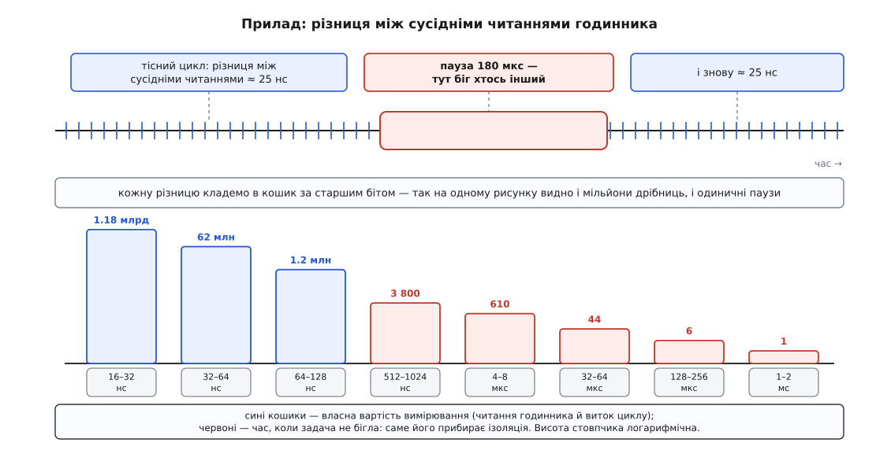

# ⚙️ Вирізати тихе ядро й довести, що воно тихе

Це прохід живою машиною від першої команди до числа: ми відберемо в системи одне фізичне ядро, віддамо його одній задачі — а потім виміряємо, скільки часу на цьому ядрі досі крадуть. Друга половина важливіша за першу: ізоляція, якої не перевірили числом, майже завжди виявляється зробленою наполовину, і виявляється це вже на робочому навантаженні.

Усе нижче робиться від імені `root` на машині, якою ви розпоряджаєтеся цілком. На спільній машині цих кроків не роблять узагалі: ви заберете ядро в сусідів, і ніхто вам про це не скаже.

### Задача

Є потік, який мусить відповісти за 200 мікросекунд. Не «в середньому за 200»: домовленість зривається найгіршим випадком, і один промах на мільйон відповідей коштує стільки ж, скільки рівномірна повільність. Тому дивитися доведеться не на середнє, а на хвіст розподілу ([перцентилі й хвости](root:math-probability/percentiles-quantiles) — спосіб описати розподіл фразами на кшталт «99.9 % значень нижчі за X», який показує саме рідкісні найгірші випадки, а не типові).

Отже, мета подвійна: **звільнити** фізичне ядро й **довести**, що воно звільнене. Друге не робиться читанням конфігурації. Конфігураційний файл показує, чого ви попросили; ядро операційної системи мовчки приймає половину прохань і виконує ще меншу частину. Доказ — це число, зняте з самого ядра.

### Задум: розділ звільняє, маска розкладає

Два механізми ділять роботу так. **Розділ** (`cpuset.cpus.partition`) вилучає ядра зі спільного набору — після цього жодна стороння задача не має їх у своїй масці, бо їх немає в наборі її групи. **Маска** (`sched_setaffinity`) кладе на звільнене ядро вашу задачу. Порядок не переставляється: маска без розділу дає прив'язку без тиші, розділ без маски дає порожнє ядро, на яке ніхто не приходить, — зокрема й ви.

Але задачі — не єдине, що падає на ядро. Тому план виглядає так: знайти, що саме вирізати; **зробити прилад**; зняти показання «до»; відібрати ядра розділом; прогнати з них переривання; за потреби вимкнути тік; зняти показання «після».

Прилад іде другим кроком, а не останнім, і це принципово. Число «після» без числа «до» не означає нічого: ви не знатимете, чи ваша конфігурація щось прибрала, чи на цій машині й так було тихо.

### Крок 1. Що саме вирізати

Ізолюють не «ядро номер шість», а **фізичне ядро цілком**. На процесорі з одночасною багатонитковістю ([SMT](root:hw-arch/simultaneous-multithreading) — два набори регістрів на один блок виконання) логічне ядро 6 ділить арифметику з якимось іншим логічним ядром, і поки той сусід виконує чужу роботу, ваша задача отримує непередбачувану частку блоку. Хто кому сусід — каже сама система:

```sh
# загальна картина: логічне ядро → фізичне → гніздо → вузол пам'яті
lscpu -e=CPU,CORE,SOCKET,NODE,ONLINE

# сусідня нитка конкретного логічного ядра
cat /sys/devices/system/cpu/cpu6/topology/thread_siblings_list
6,38

# до якого вузла пам'яті це ядро належить
ls -d /sys/devices/system/cpu/cpu6/node*
/sys/devices/system/cpu/cpu6/node0
```

Пара `6,38` — не помилка: на багатьох машинах мікропрограма перелічує спершу всі перші нитки, а вже потім усі другі, тож «сусідні» логічні ядра розходяться рівно на половину їхньої кількості. Але порядку не гарантує ніхто — на іншій платформі парою цілком може бути `6,7`. Здогадуватися тут не можна, читати — обов'язково.

Вузол пам'яті знадобиться вже за два кроки: на машині з [нерівномірним доступом до пам'яті](root:hw-arch/numa) (де пам'ять поділена між гніздами й звертання до чужої половини коштує помітно дорожче) ядра й пам'ять призначають окремими файлами, і призначити одне без іншого — половина роботи.

І ще одне: **ядро 0 не чіпаємо ніколи**. Воно завантажувальне, на ньому висить облік часу й купа службової роботи, і жоден з описаних механізмів не дозволить забрати його цілком.

### Крок 2. Прилад: лічильник украденого часу

Прилад тримається на одній думці. Якщо задача крутить тісний цикл, у якому вона тільки читає монотонний годинник, то різниця між сусідніми читаннями — це вартість самого читання й витка циклу, і більше нічого. Двадцять–тридцять наносекунд. Але щойно різниця виявилася 180 мікросекунд — це означає рівно одне: **стільки часу ми не бігли**. Не «повільно бігли», а не бігли зовсім, бо ядро в цей час належало комусь іншому: перериванню, службовому потокові, чужій задачі.



*Кожну різницю кладемо в кошик за старшим бітом — так дрібниці не заступають рідкісних злочинців, а рідкісні не губляться серед дрібниць.*

Три рішення в цій програмі варті пояснення, бо кожне з них — про чесність вимірювання.

**Прилад не боронить себе пріоритетом.** Спокуса поставити потокові [реальночасовий клас](root:sys-unix/priority-nice-realtime) (де задача витісняє звичайні й біжить, доки сама не поступиться) велика — і вона зруйнувала б вимір. Робота приладу в тому, щоб упіймати кожного, хто прийшов на ядро; захистившись пріоритетом, він перестане бачити чужі задачі й покаже тишу там, де її немає.

**Сторінки закріплюємо в пам'яті наперед.** Інакше перший же [сторінковий збій](root:sf-os/page-fault) (звертання до сторінки, яку ядро ще не підклало, з відповідним походом у ядро) виглядатиме як украдений час — хоч украли його ми самі.

**Кошики — степені двійки.** Різниці розтягнуті на п'ять порядків: від десятків наносекунд до одиниць мілісекунд. Середнє тут безглузде (мільйони дрібниць утоплять єдиний зрив), а зберігати всі зразки — це десяток гігабайтів за півхвилини. Логарифмічна гістограма розв'язує обидві біди: кошик визначається позицією старшого біта, тобто одним циклом без ділення й без пам'яті.

Годинник беремо `CLOCK_MONOTONIC` — той, що не стрибає від переведення системного часу ([час у ядрі](root:sys-unix/kernel-timekeeping)); у Linux його читання обходиться без входу в ядро, тож коштує саме десятки наносекунд.

```c
/* stolen.c — лічильник украденого часу.
 * Тісний цикл читає монотонний годинник. Кожна різниця, більша за вартість
 * самого читання, означає, що ядро в цей час належало не нам.
 *
 *   gcc -O2 -Wall -o stolen stolen.c
 *   ./stolen <ядро> <секунд>
 */
#define _GNU_SOURCE
#include <sched.h>
#include <stdint.h>
#include <stdio.h>
#include <stdlib.h>
#include <string.h>
#include <errno.h>
#include <time.h>
#include <sys/mman.h>

#define BUCKETS 32                      /* лог₂-кошики: 1 нс … ≈2 с */

static inline uint64_t now_ns(void)
{
    struct timespec ts;
    clock_gettime(CLOCK_MONOTONIC, &ts);
    return (uint64_t)ts.tv_sec * 1000000000ull + (uint64_t)ts.tv_nsec;
}

/* статична: у циклі не має бути ні malloc, ні звертання до нової сторінки */
static unsigned long long hist[BUCKETS];

int main(int argc, char **argv)
{
    int cpu       = (argc > 1) ? atoi(argv[1]) : 0;
    unsigned secs = (argc > 2) ? (unsigned)atoi(argv[2]) : 10;

    cpu_set_t set;
    CPU_ZERO(&set);
    CPU_SET(cpu, &set);
    if (sched_setaffinity(0, sizeof(set), &set) != 0) {
        fprintf(stderr, "sched_setaffinity(%d): %s\n", cpu, strerror(errno));
        return 1;
    }

    if (mlockall(MCL_CURRENT | MCL_FUTURE) != 0)
        fprintf(stderr, "mlockall: %s — числа будуть брудніші\n", strerror(errno));

    /* розігрів: без нього найдовшою паузою щоразу виявляється власний старт */
    for (uint64_t warm = now_ns() + 50000000ull; now_ns() < warm; )
        ;

    uint64_t worst = 0;
    uint64_t deadline = now_ns() + (uint64_t)secs * 1000000000ull;
    uint64_t prev = now_ns();
    unsigned long long samples = 0;

    for (;;) {
        uint64_t t = now_ns();
        uint64_t d = t - prev;
        prev = t;

        int b = 0;                          /* кошик = позиція старшого біта */
        while (b < BUCKETS - 1 && (d >> b) != 0)
            b++;
        hist[b]++;
        samples++;

        if (d > worst)
            worst = d;
        if (t >= deadline)
            break;
    }

    /* медіанний кошик — типовий інтервал, тобто вартість самого приладу */
    unsigned long long acc = 0;
    int med = 0;
    for (int b = 0; b < BUCKETS; b++) {
        acc += hist[b];
        if (acc >= samples / 2) { med = b; break; }
    }

    printf("ядро %d (наприкінці %d), зразків %llu за %u с\n",
           cpu, sched_getcpu(), samples, secs);
    printf("типовий інтервал: %llu–%llu нс\n",
           med ? 1ull << (med - 1) : 0ull, 1ull << med);

    /* межі — теж степені двійки, інакше кошик не збігся б з порогом;
       вирівнювання — пробілами в самому рядку, бо %-8s рахує байти,
       а кирилична літера їх займає два */
    static const struct { const char *name; int from; } marks[] = {
        { "  1 мкс", 11 }, { "  8 мкс", 14 },
        { "128 мкс", 18 }, { "  1 мс ", 21 },
    };
    for (unsigned m = 0; m < sizeof(marks) / sizeof(marks[0]); m++) {
        unsigned long long over = 0;
        for (int b = marks[m].from; b < BUCKETS; b++)
            over += hist[b];
        printf("пауз від %s: %llu\n", marks[m].name, over);
    }
    printf("найдовша пауза: %.1f мкс\n", worst / 1000.0);

    puts("розподіл (нижня межа кошика):");
    for (int b = 0; b < BUCKETS; b++)
        if (hist[b])
            printf("  %12llu нс : %llu\n",
                   b ? 1ull << (b - 1) : 0ull, hist[b]);
    return 0;
}
```

Складаємо й знімаємо показання «до» — на тому самому ядрі, яке збираємося звільняти, і під тим самим навантаженням, під яким машина працюватиме:

```sh
gcc -O2 -Wall -o stolen stolen.c
./stolen 6 30
```

```
ядро 6 (наприкінці 6), зразків 1243204461 за 30 с
типовий інтервал: 16–32 нс
пауз від   1 мкс: 661
пауз від   8 мкс: 51
пауз від 128 мкс: 7
пауз від   1 мс : 1
найдовша пауза: 1180.4 мкс
розподіл (нижня межа кошика):
            16 нс : 1180000000
            32 нс : 62000000
            64 нс : 1200000
           512 нс : 3800
          4096 нс : 610
         32768 нс : 44
        131072 нс : 6
       1048576 нс : 1
```

Абсолютні числа тут ні про що не свідчать — вони різні на кожній машині. Свідчить порівняння «до/після» на **одній** машині під **однаковим** навантаженням; усе інше — самообман.

### Крок 3. Віддати ядра розділові

Тепер відбираємо пару `6,38` в решти системи. Контролер cpuset живе в дереві [контрольних груп](root:sys-unix/cgroups-resource-model) (дерево, у яке дитина потрапляє автоматично разом із батьком), і перше, що треба зробити, — попросити корінь роздати контролер униз: без цього файлів `cpuset.*` у новій групі просто не буде.

```sh
CG=/sys/fs/cgroup

echo "+cpuset" > $CG/cgroup.subtree_control     # 1. роздати контролер дітям
mkdir $CG/quiet                                 # 2. власна група
echo "6,38"  > $CG/quiet/cpuset.cpus            # 3. ЩО їй віддаємо — пара цілком
echo 0       > $CG/quiet/cpuset.mems            # 4. ЗВІДКИ їй брати пам'ять
echo isolated > $CG/quiet/cpuset.cpus.partition # 5. вилучити ці ядра зі спільного набору
```

П'ятий рядок — єдиний, що змінює конфігурацію **всієї** машини, і єдиний, який ядро може мовчки не прийняти. Тому шостий крок обов'язковий: прочитати назад.

```sh
cat $CG/quiet/cpuset.cpus.partition
isolated
cat $CG/quiet/cpuset.cpus.effective
6,38
cat $CG/cpuset.cpus.effective          # у решти системи ядер поменшало
0-5,7-37,39-63
```

Ось так виглядає прийнятий розділ. А ось так — неприйнятий:

```
root invalid (Cpu list in cpuset.cpus not exclusive)
isolated invalid (Parent is not a partition root)
isolated invalid (partition config conflicts with housekeeping setup)
```

Ядро друкує причину в дужках прямо у файл, і це найкорисніший діагностичний рядок у всій темі. Перша причина означає, що ті самі ядра вже роздано комусь іще — сусідній групі або самій системі. Друга — що ви робите розділ у групі, батько якої розділом не є (розділи вкладаються тільки в розділи; коренева група вважається розділом завжди). Третя — що конфігурація суперечить ізоляції, заданій ще на старті системи завантажувальними параметрами. А якщо у відповідь читається `member`, то запис узагалі не пройшов — і про це ви дізналися хіба що з помилки `echo`, яку в скрипті ніхто не перевіряє.

Останнє — покласти в групу свою задачу. Група успадковується при народженні, тож досить перевести туди оболонку, з якої запускатимуться потоки:

```sh
echo $$ > $CG/quiet/cgroup.procs
grep Cpus_allowed_list /proc/self/status
Cpus_allowed_list:      6,38
```

Зверніть увагу, що всередині ізольованого розділу балансування вимкнено: якщо ви покладете туди два потоки, обидва можуть опинитися на ядрі 6, а ядро 38 простоюватиме, і ніхто їх не розкладе. Розкладати доведеться масками — по одному потоку на нитку, `sched_setaffinity` з єдиним бітом. Це і є та половина роботи, яку розділ на себе не бере.

### Крок 4. Прогнати переривання

Розділ забрав із ядра задачі. Переривання про cpuset не знають нічого: контролер переривань будить те ядро, яке налаштоване на лінію, і робить це поверх будь-яких масок ([прив'язка переривань до ядер](root:hw-arch/interrupt-affinity) — окремий механізм із власними файлами й власними обмеженнями).

Спершу подивимося, що взагалі прилітає на наше ядро. У `/proc/interrupts` на кожне ядро свій стовпчик; витягнемо його й порівняємо два знімки з проміжком:

```sh
irqsnap() {                       # $1 — номер логічного ядра
  awk -v c="$1" '
    NR == 1 { n = NF; for (i = 1; i <= NF; i++) if ($i == ("CPU" c)) col = i + 1; next }
    col && NF > n { print $1, $col }
  ' /proc/interrupts
}

irqsnap 6 > /tmp/irq.a; sleep 10; irqsnap 6 > /tmp/irq.b
awk 'NR == FNR { a[$1] = $2; next } $2 > a[$1] { printf "%-8s +%d\n", $1, $2 - a[$1] }' \
    /tmp/irq.a /tmp/irq.b
```

Зсув на одиницю (`col = i + 1`) — не описка: у заголовку перше поле це `CPU0`, а в рядках даних перше поле — номер лінії, тож стовпчик ядра `c` стоїть на одну позицію правіше, ніж у заголовку.

Далі відводимо все, що піддається, на «господарські» ядра:

```sh
HOUSE=0-5,7-37,39-63

for d in /proc/irq/[0-9]*; do
    n=${d##*/}
    echo "$HOUSE" > "$d/smp_affinity_list" 2>/dev/null ||
        printf 'не піддалося: irq %-4s %s\n' "$n" \
               "$(cat /sys/kernel/irq/$n/actions 2>/dev/null)"
done
```

Частина ліній відмовиться, і це нормально. Черги пристроїв із багатьма чергами — мережевих карток, дисків NVMe — ядро розподіляє по процесорних ядрах саме́, прив'язуючи чергу до ядра назавжди; такі переривання називають керованими, і запис у їхній файл прив'язки ядро відхиляє — не через права доступу, а тому, що розміщення цих черг належить йому. Єдиний спосіб прибрати їх зі свого ядра — не мати на ньому черги: зменшити кількість черг пристрою (`ethtool -L`) так, щоб ізольовані ядра лишилися без своєї. Так само не мають файла прив'язки суто локальні переривання — таймер ядра й міжпроцесорні виклики: вони за побудовою приходять туди, куди адресовані.

Лінії, які активуються згодом, візьмуть маску з `/proc/irq/default_smp_affinity`, і от там списку немає — тільки шістнадцяткова маска. Надійніше задати те саме завантажувальним параметром `irqaffinity=0-5,7-37,39-63`, який виставляє цю маску ще до появи більшості пристроїв.

Після цього повторюємо знімок. Правильний результат виглядає так, що в різниці лишаються самі локальні лічильники (`LOC`, `RES`, `CAL`, `TLB`) з невеликими числами, а рядків із номерами ліній немає взагалі.

### Крок 5. Тік і зворотні виклики RCU

Далі — те, чого на живій машині не змінити: обидва важелі задаються при завантаженні. Тому цей крок робиться тоді, коли попередні вже дали все, що могли, а хвіст усе одно не влазить у межу.

```
nohz_full=6,38 rcu_nocbs=6,38 irqaffinity=0-5,7-37,39-63
```

`nohz_full=` вимикає періодичне переривання таймера на перелічених ядрах — але **лише поки на ядрі рівно одна готова задача в просторі користувача**: щойно з'явиться друга, ділити час знову стане потрібно, і тік повернеться. Тому цей параметр працює тільки в парі з попередніми кроками, а не замість них. Позначити так усі ядра не вийде: завантажувальне ядро система примусово виключає зі списку, бо на ньому тримається облік часу.

`rcu_nocbs=` виносить зворотні виклики механізму RCU (відкладене звільнення структур, до яких могли ще звертатися читачі) на службові потоки інших ядер. Для ядер, перелічених у `nohz_full=`, ядро вмикає це саме — писати обидва списки все одно варто, бо так конфігурація читається без здогадів.

Перевіряємо, що збірка ядра це вміє і що параметри прийнято:

```sh
grep -E 'CONFIG_NO_HZ_FULL|CONFIG_RCU_NOCB_CPU' /boot/config-$(uname -r)
cat /sys/devices/system/cpu/nohz_full
6,38
```

Порожній файл або `(null)` означає, що параметр не спрацював — найчастіше тому, що збірка не має `CONFIG_NO_HZ_FULL=y` ([параметри командного рядка ядра](root:sys-unix/bootloader-and-cmdline)).

### Крок 6. Число

Повертаємо потік на звільнене ядро й знімаємо показання ще раз — тим самим приладом, тією ж тривалістю, під тим самим навантаженням:

```sh
# оболонка вже в групі quiet, тож програма народжується просто там,
# а маску на одну нитку вона ставить собі сама
./stolen 6 30
```

```
ядро 6 (наприкінці 6), зразків 1243679240 за 30 с
типовий інтервал: 16–32 нс
пауз від   1 мкс: 47
пауз від   8 мкс: 4
пауз від 128 мкс: 0
пауз від   1 мс : 0
найдовша пауза: 23.7 мкс
```

Дивитися треба на два останні рядки, а не на перший. Кількість зразків зросла на чотири сотих відсотка. Порядок сходиться: середній виток тут — 30 с / 1.24·10⁹ ≈ 24 нс, а зайві 475 тисяч витків при такому кроці — це приблизно 11 мс. Стільки ж дають, за серединами кошиків, усі паузи від 512 нс і вище в першому виводі. Але приписати весь приріст самому лише поверненому часові не можна: на чистому ядрі чужа робота ще й не збиває кеш та конвеєр, а розділити ці дві частки самими лічильниками зразків неможливо. Сам собою цей приріст мало кого цікавить. А от найгірша пауза впала з 1.18 мс до 23.7 мкс, і саме це визначає, вкладається потік у свої 200 мкс чи ні.

Два незалежні свідки того самого:

```sh
# чи задача взагалі кудись переїжджала і чи її витісняли
perf stat -e cpu-migrations,context-switches,page-faults ./stolen 6 30

# що відбувається на самому ядрі, незалежно від того, чия це робота
perf stat -a -C 6 -e context-switches,cpu-migrations -- sleep 30
```

Перша команда рахує події **задачі** ([підсистема perf](root:sys-unix/perf-events) — лічильники ядра, доступні через один системний виклик), і `cpu-migrations` там має бути нуль або одиниця: єдиний дозволений переїзд — той, яким `sched_setaffinity` сам переносить задачу на її ядро на самому початку, далі маска не лишає куди їхати. Друга рахує події **ядра процесора** — і от вона чесна до кінця: якщо на ізольованому ядрі за тридцять секунд трапилося три перемикання контексту, то на ньому крім вашого потоку хтось таки був, і треба шукати хто.

Числа, які лишаються навіть на добре вичищеному ядрі, теж мають імена. Локальні лічильники `TLB` — це прохання скинути кеш адресного перекладу, які надсилає інше ядро, коли міняє спільні таблиці сторінок; вимикача в них немає, зменшити їх можна лише тим, щоб сусіди менше правили відображення пам'яті. А поодинокі паузи в десятки мікросекунд, які не видно ні в `/proc/interrupts`, ні в `perf`, — зазвичай робота мікропрограми платформи (керування живленням, корекція пам'яті), яку операційна система не бачить узагалі: для неї це просто час, що зник.

### Пастки

**Розділ не прийнявся, а ви цього не помітили.** Запис у `cpuset.cpus.partition` успішний майже завжди — недійсність видно лише при читанні. Група в стані `root invalid` поводиться як звичайна: ядра їй виділено, але зі спільного набору вони не зникли, і на них як приходили чужі задачі, так і приходять. Зовні все виглядає налаштованим, а хвіст затримки не зрушив. Читати файл після запису — не перестраховка, а частина запису.

**Узяли одну нитку SMT замість пари.** `cpuset.cpus = 6` без `38` виглядає як «віддали ядро», а насправді віддає половину блоку виконання, причому половину змінну: коли на нитці 38 працює важка чужа задача, ваша отримує помітно менше, ніж коли та нитка простоює. Найпідступніше тут те, що вимір «до/після» покаже поліпшення — просто вдвічі менше за очікуване, і ви припишете залишок чомусь іншому. Пари беруться з `thread_siblings_list`, і тільки звідти.

**Забули `cpuset.mems`.** Ядра призначено, пам'ять — ні, тож розподільник дає сторінки там, де зручно йому. На машині з одним вузлом це нічого не міняє, на двогніздовій — задача бігає на одному кристалі, а її дані лежать біля іншого, і кожен промах кеша йде через міжпроцесорний зв'язок. Гістограма при цьому лишається пласкою (пауз немає), а середня затримка виростає: прилад цієї біди не ловить, бо це не вкрадений час, а повільна пам'ять. Перевіряти окремо: `cat $CG/quiet/cpuset.mems.effective` має збігатися з вузлом, до якого належать ваші ядра.

**Стеля процесора суперечить розміщенню.** Група з `cpu.max` у «пів'ядра», якій віддано два логічні ядра, буде регулярно простоювати до кінця періоду квоти — і в гістограмі це видно як паузи в десятки мілісекунд, дуже схожі на витіснення. Для приладу це найпідступніша плутанина: украденого часу немає, ядро тихе, а пауза є, і шукати її в `/proc/interrupts` марно — вона в `cpu.stat`, у полі `throttled_usec`. Загальне правило про дві одиниці — «де» проти «скільки» — розібрано в самій статті.

**Числа ядер зашили в скрипт.** `6,38` вірне рівно для однієї моделі процесора. На сусідній машині пара може бути `6,7`, а ядро 38 узагалі не існувати — і скрипт мовчки віддасть групі одну нитку замість двох. Пару читають щоразу, а не пам'ятають.

### Прибрати за собою

Розділ живе, доки живе група, і розпускається так само файлами — але тільки після того, як група спорожніє:

```sh
echo $$ > $CG/cgroup.procs                    # вигнати всіх назад у корінь
echo member > $CG/quiet/cpuset.cpus.partition # повернути ядра у спільний набір
rmdir $CG/quiet
cat $CG/cpuset.cpus.effective
0-63
```

`rmdir` над непорожньою групою поверне `EBUSY` — це нормальний спосіб дізнатися, що всередині ще хтось лишився. А прив'язки переривань і завантажувальні параметри вертаються окремо: перші — повторним проходом циклу з повною маскою, другі — правкою рядка завантажувача. Ізоляція складається з кількох незалежних механізмів, і розбирається вона теж по одному.
