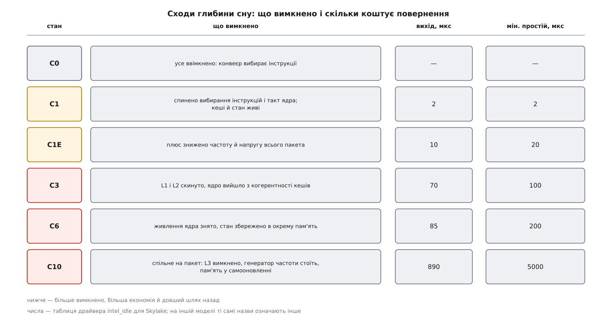
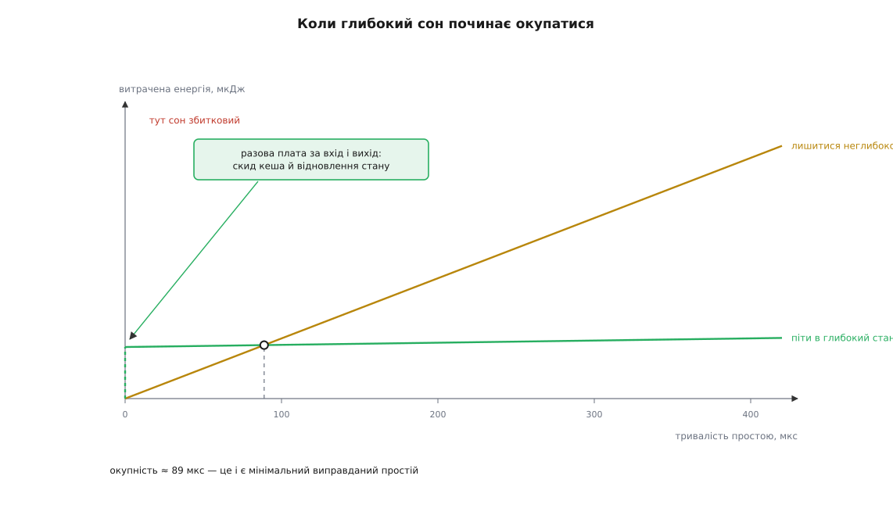
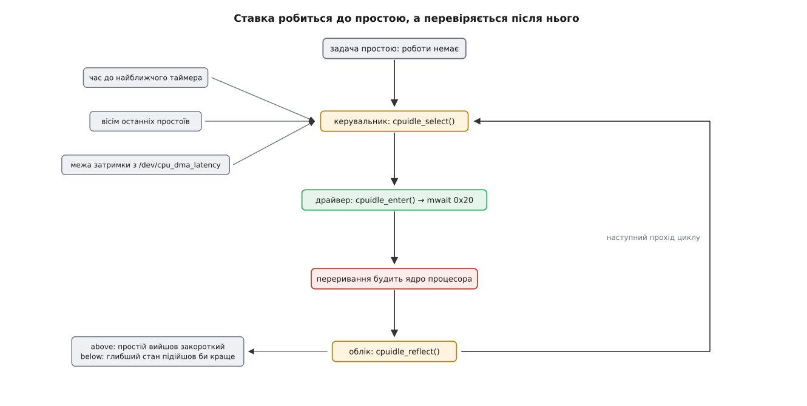

# Простій ядра процесора: cpuidle і глибина сну

<preknowlist>
- [Планувальник](topic:sys-unix/scheduler-model) — ядро вибирає, кого поставити на процесор, і мусить вибрати когось завжди.
- [Переривання](topic:hw-arch/interrupts) — апаратний сигнал забирає процесор у того, хто зараз біжить, і передає керування наперед заданій функції.
- [Час у ядрі](topic:sys-unix/kernel-timekeeping) — періодичний тик, найближча зведена подія таймера і безтикове ядро.
- [CMOS-вентиль](topic:hw-digital/cmos-gate) — струм у вентилі тече переважно в мить перемикання, а решту часу лишається струм витоку.
- [Стіна потужності](topic:hw-arch/power-wall) — потужність, а не кількість транзисторів, стала головним обмеженням процесорів.
- [DVFS](topic:hw-arch/dvfs) — другий важіль економії: знизити напругу й частоту, не спиняючись.
- [Модель пристроїв у sysfs](topic:sys-unix/sysfs-device-model) — ядро показує свій стан і приймає налаштування через файли-атрибути.
</preknowlist>

## Роботи немає — а що процесор при цьому виконує?

Ноутбук відкритий, ви на нього не дивитеся. Жодна програма нічого не рахує, черга готових задач на кожному з восьми ядер порожня. Процесор при цьому нікуди не подівся: тактовий генератор цокає, конвеєр щотакту хоче наступну інструкцію. І звідси питання, з якого починається вся тема, — прикро просте: **яку саме інструкцію виконує ядро процесора в цю мить?**

«Ніяку» — не відповідь. Процесор не вміє не виконувати інструкцій. Він уміє виконати інструкцію, яка каже йому спинитися, — але хтось мусить її виконати, і цей хтось є код, який теж треба звідкись узяти.

Ядро бере його звідти ж, звідки й усе інше: із задачі. На кожне ядро процесора Linux заводить окрему **задачу простою** — ту, що видно як `swapper/0`, `swapper/1` і так далі, з номером процесу нуль. Вона завжди готова до виконання й має найнижчий можливий пріоритет, тому планувальник ставить її на процесор рівно тоді, коли ставити більше нікого. Це не милиця: планувальник влаштований так, що мусить вибрати когось, і задача простою є гарантією, що вибір завжди існує.

Усе тіло цієї задачі — короткий цикл `do_idle()`: перевір прапорець «є кого запустити», і якщо його немає — нічого не роби. Питання лише в тому, як саме «нічого не робити».

Найпростіша відповідь — крутитися в порожньому циклі — коштує рівно стільки ж, скільки будь-яка корисна робота. Кожен прохід циклу перемикає транзистори в дешифраторі, в АЛП, у передбачувачі переходів, а в CMOS-схемі струм тече саме в мить перемикання. Ядро, що крутить порожній цикл, споживає одиниці ват — тобто вісім таких ядер з'їдять батарею ноутбука за годину, не порахувавши нічого.

Отже, простій мусить бути справжньою зупинкою, а не імітацією зайнятості. І тут-таки постає питання, яке і є змістом усієї підсистеми: **зупинитися можна по-різному, і глибші зупинки дорожче скасовувати.**

## Глибина сну — це список того, що вимкнено

Найдешевша зупинка — спинити вибирання інструкцій до найближчого переривання. На x86 це інструкція `hlt`, на ARM — `wfi` (*wait for interrupt*, «чекай переривання»). Конвеєр стає, динамічна потужність зникає майже вся, а повернення коштує наносекунди: усе на місці, треба лише знову почати вибирати інструкції.

Але динамічна потужність — не весь рахунок. Транзистор із поданим живленням тече навіть тоді, коли не перемикається, і з кожним технологічним кроком ця частка росла, доки не стала співмірною з динамічною. Спинений конвеєр не прибирає ані витоку в кешах, ані живлення генератора частоти, ані самої напруги на ядрі.

Прибрати їх можна лише одним способом — вимкнути. І тут з'являється те, що робить тему нетривіальною: **усе, що ти вимкнув, доведеться потім увімкнути назад, а все, що втратило живлення, доведеться відновити з нуля.** Список економії й список плати за повернення — це той самий список, прочитаний у різні боки.

Тому зупинки шикуються в сходинки, і кожна наступна знімає живлення з чогось більшого:



*Кожен рядок читається двічі: зліва направо — що ми вимикаємо, справа наліво — що доведеться відновити перед першою корисною інструкцією.*

Ці сходинки заведено називати **C-станами** (від *CPU state* у стандарті ACPI): `C0` — ядро виконує код, `C1` і глибші — різні ступені зупинки. Назви варто читати як ярлики на конкретній таблиці конкретного процесора, а не як шкалу: `C6` в одному поколінні й `C6` в іншому — різні набори вимкненого, а на ARM цих назв узагалі немає, там стани описує таблиця у дереві пристроїв. Порівнювати глибину за номером не можна; порівнювати можна лише за двома числами, які до кожного стану додано.

## Два числа, якими описано будь-який стан

Перше число — **час виходу** (*exit latency*): скільки мікросекунд мине від переривання до першої виконаної інструкції. Це прямі витрати на відновлення: розігнати генератор частоти, підняти напругу, повернути стан ядра, а далі ще й наповнити спорожнілі кеші — останнє в цифру не входить, але біль від нього цілком реальний.

Друге число — **мінімальний виправданий простій** (*target residency*): скільки треба проспати, щоб сон себе окупив. Воно потрібне тому, що вхід і вихід самі коштують енергії: скинути кеш у пам'ять, зберегти стан, потім усе це підняти. Якщо ядро прокинеться раніше, ніж накопичена економія перекриє цю разову плату, глибокий сон вийде дорожчим за неглибокий.

**Скільки треба проспати, щоб сон окупився (числа порядку величини, справжні виробник вимірює й кладе в таблицю драйвера):**

```
потужність ядра в неглибокому стані   P₁  = 1.4 Вт
потужність ядра зі знятим живленням   P₆  = 0.05 Вт
разова плата за вхід і вихід          E   = 120 мкДж

виграш за одиницю часу   = P₁ − P₆ = 1.35 Вт = 1.35 мкДж/мкс
окупність                = E / (P₁ − P₆)
                         = 120 / 1.35 ≈ 89 мкс
```

Тобто простій, коротший за сотню мікросекунд, у глибокому стані не окупається взагалі: ми заплатили за дорогу туди й назад і не встигли нічого зекономити. Саме звідси беруться числа в таблицях драйвера — у станах ядра мінімальний виправданий простій виходить того самого порядку, що й час виходу: від рівного йому до двох з половиною разів більшого.



*Ліворуч від перетину глибокий сон коштує дорожче, ніж дає, — і жодна економія в майбутньому цього не виправить, бо майбутнього вже не буде.*

Повне виведення — з урахуванням того, що ціна помилки в один бік і в другий різна, і чому обережний вибір вигідніший за оптимальний, — розгорнуто окремо: [чому глибокий сон окупається не завжди](topic:sys-unix/cpuidle-and-cstates/math-break-even.md).

І тут ховається головна незручність усієї підсистеми. Обидва числа стосуються **тривалості простою**, а вибирати стан треба **до** того, як простій почався. Рішення ухвалюють на невідомій величині, а правильність його стає відома аж тоді, коли міняти щось пізно.

## Чого ядро не знає — і що воно знає натомість

Ядро не знає, коли прийде наступне переривання. Мережевий пакет, натиск клавіші, завершення операції на диску — усе це приходить ззовні й не питає.

Зате ядро точно знає одну річ: **коли спрацює найближчий заведений таймер**. Таймери — не зовнішній світ, вони самі є списком у ядрі, і час найближчого з них відомий із наносекундною точністю. Це і є та єдина тверда підказка, на якій стоїть усе передбачення.

Але щоб підказка чогось варта була, треба спершу прибрати таймер, який заводить саме ядро. Класичне ядро смикає себе періодичним тиком двісті п'ятдесят чи тисячу разів на секунду, і за такого порядку найближча подія таймера **ніколи** не далі як за чотири мілісекунди, а частіше — за одну. Гірше того: тик прокидатиме ядро процесора сам, без жодної потреби, і кожне таке пробудження скасовуватиме щойно ввімкнений глибокий стан.

Тому перед вибором стану ядро спиняє власний тик — `tick_nohz_idle_enter()` знімає періодичне переривання з ядра, що йде в простій, і найближчою подією стає справжня найближча подія, хай і за секунду. Без безтикового простою вся ця підсистема була б декорацією: глибші за `C1` стани просто ніколи не окупалися б.

Друге джерело пробуджень — інші ядра процесора. Коли на сплячому ядрі з'являється робота, сусід мусить його розштовхати; докладніше про цей механізм — у темі про [міжпроцесорні переривання](topic:sys-unix/inter-processor-interrupts). Тут важлива одна деталь: на x86 сплячому ядру не завжди треба слати переривання. Інструкції `monitor`/`mwait` дозволяють заснути, пильнуючи конкретний рядок кеша — той, у якому лежить прапорець «є кого запустити». Сусід просто записує туди значення, [когерентність кешів](topic:hw-arch/cache-coherence) доносить запис до сплячого ядра, і воно прокидається саме від цього запису — без жодного переривання.

## Хто вирішує і хто виконує

Розділення тут таке саме, як усюди в ядрі, де політика й механізм не мають права зростатися. **Драйвер** знає, якою інструкцією й з якою підказкою ввести залізо в потрібний стан, і звідки взяти таблицю станів. **Керувальник** (*governor*) не знає про залізо нічого, крім двох чисел на стан, і вирішує лише одне: який номер стану обрати. Обидві частини зустрічаються в задачі простою:

```c
/* kernel/sched/idle.c, спрощено до суті */
while (!need_resched()) {
        index = cpuidle_select(drv, dev, &stop_tick);  /* політика: який стан */
        cpuidle_enter(drv, dev, index);                /* механізм: команда залізу */
        cpuidle_reflect(dev, index);                   /* облік: чи вгадали */
}
```

Драйверів на практиці кілька. На процесорах Intel працює `intel_idle`: він має вшиту таблицю станів на кожну модель ядра й уводить процесор у стан інструкцією `mwait` із числовою підказкою (`0x20` — це `C6` на Skylake). Прошивку він при цьому свідомо не питає, бо таблиці ACPI від виробників плат бувають неповними чи прямо хибними. Загальний `acpi_idle` — навпаки, бере стани з переліку `_CST`, який дає [прошивка через таблиці ACPI](topic:sf-os/acpi-tables). На ARM глибокі стани ядро вимикає не само: воно робить виклик у прошивку нижчого рівня (PSCI) й просить її приспати ядро процесора.

Окремо стоїть нульовий стан, який у списку зветься `POLL`: це не сон, а порожній цикл із нульовим часом виходу. Він потрібен рівно для випадку «робота прилетить за пару мікросекунд» — коли навіть `hlt` не окупається.

## Керувальники: чотири способи вгадувати

Керувальник дістає межу згори (більше за неї глибоко не пірнати) і мусить назвати число. Способів це зробити в ядрі чотири, і різняться вони тим, чому саме вони вірять.

**`menu`** — усталений для безтикових систем. Він бере час до найближчого таймера, а тоді псує цю оцінку в бік зменшення, бо знає, що переривання приходять і не від таймерів: підправляє її множником, вирахуваним із восьми останніх простоїв. З отриманого числа він вибирає найглибший стан, чий мінімальний виправданий простій ще вкладається в оцінку.

**`teo`** (*timer events oriented*, «зорієнтований на події таймера») з'явився в ядрі 5.1 і виходить з іншого спостереження Рафаеля Висоцького: подій таймера на типовій машині на два порядки більше, ніж усіх інших переривань разом, тож саме таймер і є головним джерелом пробуджень. Замість одного виправленого числа `teo` тримає кошики, межі яких збігаються з мінімальними виправданими простоями станів, і в кожному рахує дві величини: скільки разів ядро прокинулося приблизно тоді, коли обіцяв таймер, і скільки разів його **перехопили** — розбудили раніше чимось стороннім. Якщо перехоплень багато, таймер тут поганий пророк, і `teo` свідомо бере мілкіший стан.

**`ladder`** («драбина») не передбачає нічого. Після кожного достатньо довгого простою він спускається на сходинку нижче, після кожного закороткого — стрибає вгору. Це керувальник для систем із періодичним тиком, де простій усе одно обмежений тиком і вгадувати нічого.

**`haltpoll`** (з'явився в 5.4) розв'язує задачу гостьової машини. У віртуалці зупинка ядра — це вихід у гіпервізор, а він коштує помітно дорожче за саму зупинку. Тому гість спершу трохи крутиться в порожньому циклі, сподіваючись, що робота прилетить швидше, ніж окупиться вихід, і лише потім спиняється по-справжньому.

Спільне в усіх чотирьох — **несиметрична ціна помилки**. Узяти замілкий стан означає просто переплатити енергією. Узяти заглибокий означає переплатити енергією **і** додати мікросекунди затримки тій події, заради якої пробудження й сталося. Тому всі керувальники зміщені в бік обережності, і ця несиметрія — не боязкість, а прямий висновок із того, що виграш вимірюється у ватах, а програш — у затримці, яку хтось помітить.

Свою помилку ядро чесно рахує. Після пробудження воно дивиться, скільки простій тривав насправді, і збільшує один із двох лічильників стану: `above` — «просили цей стан, а простій вийшов явно закороткий для нього», `below` — «а тут глибший стан підійшов би краще». Обидва лежать поряд із самим станом у sysfs.



*Ставка робиться на трьох відомих величинах, а перевіряється однією невідомою — справжньою тривалістю простою, яку видно лише після пробудження.*

## Коли затримка дорожча за вати

Іноді вати не важать зовсім. Драйвер, що мусить забрати дані з буфера за десяток мікросекунд, або обробка звуку з жорстким часовим вікном не переживуть вісімдесяти п'яти мікросекунд на розігрів ядра.

На цей випадок є пряма вимога до ядра, і подати її може навіть звичайна програма. Файл `/dev/cpu_dma_latency` приймає число — гранично допустимий час виходу в мікросекундах. Поки дескриптор відкритий, вимога чинна; керувальники зобов'язані не розглядати станів, час виходу яких більший.

```c
#include <fcntl.h>
#include <stdint.h>
#include <unistd.h>

/* Поки цей дескриптор відкрито, жоден керувальник на машині
   не вибере стану, вихід із якого довший за 50 мкс. */
int fd = open("/dev/cpu_dma_latency", O_WRONLY);
int32_t limit_us = 50;

write(fd, &limit_us, sizeof(limit_us));

/* ... робота, критична за затримкою ... */

close(fd);   /* вимогу знято, глибокі стани знову дозволені */
```

Нуль тут означає «якнайшвидше»: лишається хіба порожній цикл, і машина споживає в простої стільки ж, скільки під навантаженням. Це слід розуміти буквально — вимога стосується всіх ядер, і ціною їй буде вимкнений розгін частоти й гарячий корпус.

> 🔧 **Навіщо це.** Класична загадка: сервер відповідає на першу порцію запитів помітно повільніше, ніж на решту, а профіль програми чистий. Дивитися треба не в програму, а в `/sys/devices/system/cpu/cpu0/cpuidle/state*/`: якщо в глибокого стану великий `usage` і чималий `above`, ядра справді пірнають глибоко й платять за це часом виходу на кожному новому сплеску. Правильний хід — не вимикати стани назавжди, а поставити вимогу на час критичної роботи через `/dev/cpu_dma_latency` і зміряти, чи зникла затримка. Що саме коїлося на кожному ядрі процесора, показує трасувальна точка `power:cpu_idle` — [ftrace і трасувальні точки ядра](topic:sys-unix/ftrace-kernel-tracing).

## Спить не ядро, а весь пакет

Досі йшлося про окреме ядро процесора, і це напівправда. Знеструмити можна ядро, але генератор частоти, кеш третього рівня, контролер пам'яті й перетворювач живлення — спільні на весь кристал. Їх не вимкнути, доки хоч одне ядро працює.

Тому глибокі стани діляться надвоє: стан ядра й **стан пакета**. Пакет опускається на сходинку нижче тільки тоді, коли **всі** його ядра вже там. Наслідок із цього виходить неочевидний і дуже практичний: один потік, що крутить порожній цикл опитування, тримає неглибоким увесь кристал. Він коштує не одну восьму споживання пакета, а майже все, бо не дає вимкнути спільне.

Той самий механізм працює і в інший бік. Потужність кристала обмежена згори, і ядра, що сплять глибоко, звільняють бюджет для тих, що працюють, — саме за цей рахунок піднімається частота на активних ядрах, коли решта спить. Простій і [масштабування частоти](topic:hw-arch/dvfs) — не два незалежні важелі, а два виходи з одного бюджету потужності.

І найглибша зупинка — це та сама машинерія, доведена до дна: у режимі призупинення без вимикання живлення ядро заганяє всі ядра процесора в найглибший доступний стан і не будить їх нічим, крім джерел пробудження, які лишили ввімкненими; про це — [призупинення й пробудження](topic:sf-os/suspend-and-resume).

## Простій як послідовність ставок

Повний перелік атрибутів станів у sysfs, як перемкнути керувальник на ходу, що роблять параметри завантаження `idle=poll`, `intel_idle.max_cstate=` і `nohz=off`, і як усе це виглядає в `powertop` і `turbostat`, зібрано в [довідці з інтерфейсу cpuidle](topic:sys-unix/cpuidle-and-cstates/api-cpuidle-sysfs.md). Історію того, як з однієї інструкції `hlt` виросла ця підсистема — від часів, коли простоєм керувала прошивка, до сучасного розділення на драйвери й керувальники, — розгорнуто окремо: [від `hlt` до cpuidle](topic:sys-unix/cpuidle-and-cstates/hist-from-hlt-to-cpuidle.md).

Найважливіше в цій темі — не таблиця станів, а масштаб події. На машині без навантаження цикл простою проходить тисячі разів на секунду на кожному ядрі процесора, і кожен прохід — це окрема ставка на майбутнє, зроблена наосліп і оплачена або ватами, або мікросекундами. Ядро не намагається виграти кожну; воно намагається програвати дешево. Тому єдиний чесний спосіб щось тут покращити — прочитати рахунок виграшів і програшів у `above` та `below`, а не змусити машину спати найглибше, як тільки вміє.
