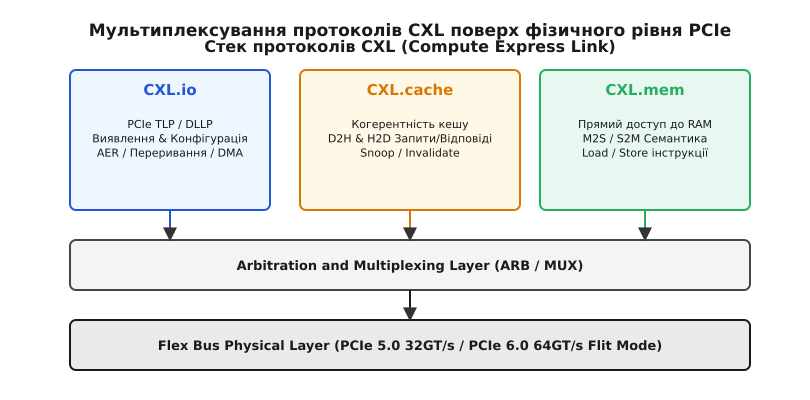
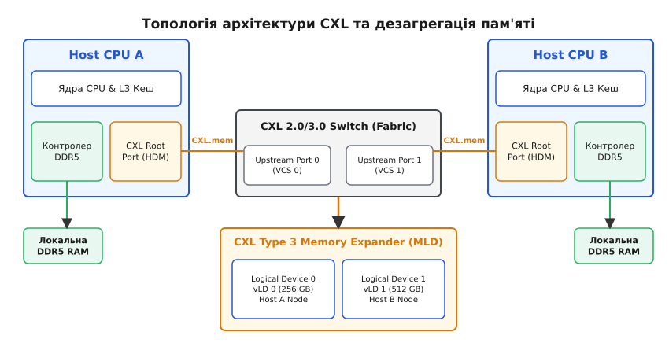

# Шина CXL (Compute Express Link) та пулінг пам’яті

<preknowlist>
- [Підсистема PCIe в Linux](root:sys-unix/pcie-fabric-msix-and-aer) — базові поняття шини PCI Express, TLP-пакетів, лінків та конфігураційного простору пристроїв.
- [Таблиці ACPI та простір імен](root:sys-unix/acpi-tables-and-namespace) — принципи передачі топології апаратури від BIOS/firmware до ядра ОС (зокрема CEDT — CXL Early Discovery Table).
- [Прямий доступ до пам'яті DAX](root:sys-unix/dax-direct-access) — механізм прямого мапування енергонезалежної та пристроєвої пам'яті в користувацький простір без кешу сторінок.
</preknowlist>

Стрімке зростання кількості обчислювальних ядер у сучасних серверних процесорах призвело до виникнення фундаментального апаратного бар'єра, відомого як «стіна пам'яті» (Memory Wall). Фізичні розміри материнських плат та схемотехнічні обмеження розведення швидкісних ліній DDR5 не дозволяють розмістити понад 8–12 каналів пам'яті на один процесорний сокет. Традиційні периферійні інтерфейси на кшталт PCI Express (PCIe) забезпечують високу пропускну здатність для передачі блоків даних через DMA, але позбавлені **когерентності кешу** (лат. *cohaerentia* — зв'язок, зчеплення) і вимагають значних накладних витрат операційної системи на копіювання буферів, що робить неможливим безпосереднє виконання інструкцій `mov`, `load` та `store` над адресами зовнішніх пристроїв.

Compute Express Link (CXL) — це відкритий індустріальний стандарт високошвидкісного міжз’єднання, розроблений для подолання цього обмеження. Побудований поверх фізичного рівня PCIe 5.0 та PCIe 6.0, CXL інтегрує протоколи когерентності кешу та низькозатримного доступу до пам’яті, перетворюючи розрізнені накопичувачі, прискорювачі та плати розширення RAM на єдину компоновану та дезагреговану обчислювальну систему.

---

## 1. Еволюція інтерконектів: Від PCIe до CXL

Протягом кількох десятиліть шина PCI Express залишалася де-факто стандартом підключення дискретних периферійних пристроїв. Проте в епоху гетерогенних обчислень, де процесор ділить математичні навантаження з графічними прискорювачами (GPU), тензорними процесорами (TPU) та програмованими логічними матрицями (FPGA), класична модель PCIe виявила суттєві вади.

Головна проблема полягає в архітектурній роз'єднаності адресних просторів. У класичній схемі PCIe прискорювач має власну локальну пам'ять (наприклад, HBM або GDDR6), а процесор — системну оперативну пам'ять DDR5. Для обміну даними між ними ядро операційної системи мусить виконати цілу послідовність дій:
1. Заблокувати сторінки оперативної пам'яті в системному RAM (page pinning).
2. Сформувати список адрес фізичних сторінок (Scatter-Gather List).
3. Програмувати контролер DMA пристрою на копіювання через PCIe TLP-пакети.
4. Дочекатися переривання про завершення передачі та інвалідувати кеш-лінії CPU.

Цей ланцюжок дій створює затримки на рівні кількох мікросекунд і блокує потоки виконання. CXL вирішує цю проблему, додаючи апаратну когерентність. [📜 Історія стандартизації міжз'єднань та народження CXL](root:sys-unix/cxl-bus-protocols-and-generations/hist-cxl-origin.md) детально висвітлює, як конкуруючі протоколи Gen-Z, CCIX та OpenCAPI об'єдналися навколо єдиної специфікації CXL.

```
Класичний доступ PCIe:
[CPU Core] -> [Flush Cache] -> [Setup DMA] -> [PCIe Bus TLP] -> [Device RAM] (Затримка: > 2-5 мкс)

Доступ через CXL.mem / CXL.cache:
[CPU Core] -> [Hardware Snoop / Load Instruction] ----------> [CXL RAM]       (Затримка: ~150-250 нс)
```

На фізичному рівні CXL використовує роз'єми та фізичний рівень PCIe (Flex Bus PHY). У PCIe 5.0 застосовується модуляція NRZ (Non-Return-to-Zero) зі швидкістю 32 GT/s на лінію, а у CXL 3.0 / PCIe 6.0 — модуляція PAM4 (Pulse Amplitude Modulation 4-level) зі швидкістю 64 GT/s.

Під час початкового узгодження зв'язку (Link Training & Status State Machine, LTSSM) пристрої опитують розширені регістри DVSEC (Designated Vendor-Specific Extended Capability). Якщо обидва боки підтримують CXL, шина перемикається з традиційного режиму PCIe TLP на розширений режим CXL Flit (Flow Control Unit), де дані передаються фіксованими блоками по 68 байтів (у CXL 1.1/2.0, де цілісність стереже CRC) або 256 байтів (у CXL 3.0 поверх PCIe 6.0, де до CRC додається пряма корекція помилок FEC — Forward Error Correction).

---

## 2. Три стовпи CXL: Протоколи CXL.io, CXL.cache та CXL.mem

Специфікація CXL визначає три незалежні протоколи, які мультиплексуються на один фізичний лінк за допомогою шару арбітражу та мультиплексування (Arbitration and Multiplexing Layer, ARB/MUX).


*Стек протоколів CXL: поділ фізичного PHY на транзактні шари CXL.io, CXL.cache та CXL.mem.*

### 2.1 CXL.io
Протокол `CXL.io` є функціональним аналогом традиційного PCI Express 5.0/6.0. Він використовує стандартне кодування TLP/DLLP і відповідає за:
- Початковий пошук та ініціалізацію пристроїв (Enumeration & Discovery).
- Читання й запис конфігураційного простору PCIe (BAR registers).
- Обробку системних переривань (MSI-X) та розширену реєстрацію помилок (AER — Advanced Error Reporting).
- Прямий доступ до пам'яті (DMA) для сумісності зі старими драйверами.

Підтримка `CXL.io` є **обов’язковою** для всіх пристроїв CXL, оскільки саме через нього операційна система конфігурує пристрій під час завантаження.

### 2.2 CXL.cache
Протокол `CXL.cache` призначений для пристроїв-прискорювачів, які хочуть кешувати дані із системної пам’яті хоста (CPU RAM) у свій локальний надшвидкий кеш.

Він працює за транзактною моделлю запит-відповідь у трьох напрямках:
- **D2H (Device to Host):** Пристрій запитує читання або запис кеш-лінії у хоста (`D2H Req`).
- **H2D (Host to Device):** Хост надсилає підтвердження або запит на інвалідацію (`SnoopData`, `SnoopInv`, `SnoopNtoI`) кеш-лінії на пристрої, якщо процесор вирішив змінити ці дані у своєму кеші L3.
- **Response (Rsp):** Фінальні підтвердження зміни стану кеш-ліній згідно з модифікованим протоколом когерентності MESI/MOESI (Modified, Exclusive, Shared, Invalid).

Завдяки цьому GPU чи FPGA може працювати з центральною оперативною пам'яттю так само прозоро, як із власною локальною пам'яттю, не побоюючись зчитування застарілих даних.

### 2.3 CXL.mem
Протокол `CXL.mem` забезпечує зворотний напрямок: він дозволяє процесору сприймати оперативну пам’ять, розміщену на зовнішньому пристрої CXL, як звичайну системну пам'ять (System RAM).

У цьому протоколі центральний процесор виконує роль когерентного майстра (Master), а пристрій CXL.mem виступає веденим виконавцем (Slave):
- **M2S (Master to Slave):** Процесор надсилає командні пакети `M2SReq` (запит читання) або `M2SRwD` (запит запису з даними) із системними фізичними адресами.
- **S2M (Slave to Master):** Пристрій повертає запитані дані або підтвердження запису через пакети `S2MDR` (Data Response) та `S2MNDR` (Non-Data Response) разом із прапорцями стану (Poison, ECC Error).

На відміну від PCIe, операції `CXL.mem` вимагають мінімального апаратного заголовка пакетів, що знижує затримки доступу майже до рівня локальних модулів DIMM.

---

## 3. Класифікація пристроїв CXL (Type 1, Type 2, Type 3)

Залежно від комбінації активних протоколів, стандарт CXL поділяє всі пристрої на три класи.

```
                      ┌─────────────────────────────────────────┐
                      │             CXL Device Types            │
                      └────────────────────┬────────────────────┘
                                           │
          ┌────────────────────────────────┼────────────────────────────────┐
          │                                │                                │
          ▼                                ▼                                ▼
┌──────────────────┐             ┌──────────────────┐             ┌──────────────────┐
│      Type 1      │             │      Type 2      │             │      Type 3      │
│ CXL.io + CXL.cache│            │CXL.io+cache+mem  │             │ CXL.io + CXL.mem │
├──────────────────┤             ├──────────────────┤             ├──────────────────┤
│ SmartNIC / DPU   │             │ GPU / FPGA / TPU │             │ Memory Expander  │
│ Немає власної RAM│             │ Має HBM/GDDR RAM │             │ Dynamic Pooling  │
└──────────────────┘             └──────────────────┘             └──────────────────┘
```

### 3.1 Type 1: SmartNIC та мережеві прискорювачі
- **Протоколи:** `CXL.io` + `CXL.cache`.
- **Особливості:** Пристрої цього типу не надають власних обсягів оперативної пам'яті для CPU, але містять локальні кеші.
- **Застосування:** Розумні мережеві карти (SmartNIC, DPU). Під час обробки мережевих пакетів SmartNIC когерентно кешує у ВЛАСНОМУ кеші дескриптори мережевих кілець і буфери, що лежать у памʼяті хоста: апаратура сама тримає ці лінії узгодженими з кешем CPU, тож копіювати буфери не треба (Zero-Copy Networking).

### 3.2 Type 2: Високопродуктивні прискорювачі (GPU, FPGA)
- **Протоколи:** `CXL.io` + `CXL.cache` + `CXL.mem`.
- **Особливості:** Пристрої мають як власну надшвидкісну локальну пам'ять (наприклад, 96 GB HBM3), так і потребують доступу до системної пам'яті хоста.
- **Режими когерентності (Bias Control):**
  - **Host Bias:** Пам'ять пристрою контролюється кеш-контролером CPU. Забезпечує низьку затримку, коли CPU активно обробляє дані на пристрої.
  - **Device Bias:** Контроль передається кеш-контролеру прискорювача. Звільняє міжз'єднання від зайвих snoop-запитів, коли GPU виконує локальне обчислення ядра (Kernel execution).

### 3.3 Type 3: Розширювачі та пули пам'яті (Memory Expanders)
- **Протоколи:** `CXL.io` + `CXL.mem`.
- **Особливості:** Пристрої не мають власного обчислювального кешу (тому їм не потрібен `CXL.cache`), але містять високопродуктивні контролери пам'яті DDR4/DDR5 або LPDDR.
- **Застосування:** Масштабування ємності оперативної пам'яті серверів та дезагрегація пулів у хмарних ЦОД. Форм-фактори включають плати розширення PCIe AIC (Add-in Card) та серверні модулі EDSFF (E1.S, E3.S).

---

## 4. Еволюція поколінь стандарту: CXL 1.1, 2.0 та 3.0/3.1

Стандарт CXL розвивається паралельно з еволюцією фізичного рівня PCI Express.

| Характеристика | CXL 1.1 | CXL 2.0 | CXL 3.0 / 3.1 |
| :--- | :--- | :--- | :--- |
| **Фізичний рівень** | PCIe 5.0 (32 GT/s) | PCIe 5.0 (32 GT/s) | PCIe 6.x (64 GT/s PAM4) |
| **Топологія** | Point-to-Point | Single-level Switch | Multi-level Switch / Fabric Mesh |
| **Розподіл пам'яті** | Пряме приєднання | Memory Pooling (MLD) | Hardware Memory Sharing |
| **Безпека** | Базова (PCIe) | IDE (AES-GCM 256) | SPDM 1.2 / IDE + TSP |
| **Peer-to-Peer** | Відсутній | Через CPU | Прямий P2P між пристроями |

### CXL 2.0 та революція комутації
Головним проривом CXL 2.0 стала підтримка **CXL-комутаторів (Switches)** та концепції **MLD (Multi-Logical Device)**. Фізичний розширювач пам'яті Type 3 отримав можливість ділитися на кілька незалежних логічних пристроїв (vLD), кожен з яких призначається окремому фізичному серверу.

Управління конфігурацією комутатора виконує програмний **Fabric Manager (FM)** через стандартизований протокол MCTP (Management Controller Transport Protocol) поверх шин SMBus або PCIe VDM (Vendor Defined Messages).

### CXL 3.0: Повнозв'язні тканини (Fabrics) та спільна пам'ять
CXL 3.0 подвоює швидкість передачі за рахунок модуляції PAM4 (64 GT/s у Flit-режимі) та впроваджує когерентне спільне використання пам’яті (Hardware Coherent Memory Sharing). Кілька серверів можуть одночасно мапити один і той самий фізичний діапазон CXL-пам'яті з апаратно узгодженими кешами.

Крім того, у CXL 3.0 з'явилася підтримка **Peer-to-Peer (P2P)** транзакцій: графічний прискорювач (Type 2) може читати дані з розширювача пам’яті Type 3 напряму через CXL Switch, взагалі не залучаючи процесорний сокет і системну шину хоста.

---

## 5. Пулінг пам'яті (Memory Pooling) та дезагрегація

У традиційних ЦОД виникає проблема «застряглої пам'яті» (Stranded Memory): один сервер вичерпує 100% своєї оперативної пам'яті й зупиняє додатки через OOM (Out Of Memory), тоді як сусідні сервери у стійці використовують лише 20% встановленої DDR-пам'яті.

Пулінг пам'яті усуває жорстку прив'язку модулів RAM до конкретного процесорного сокета.


*Топологія зв'язку CPU, CXL-комутатора та розширювачів пам'яті (Type 3 MLD) між кількома хостами.*

Завдяки механізму MLD та програмному контролеру тканини (Fabric Manager, FM):
1. Пам’ять Type 3 зосереджується в окремому шасі (Memory Appliance).
2. Комутатор CXL динамічно нарізає фізичну пам'ять на логічні блоки необхідного обсягу.
3. Драйвери операційної системи отримують нові блоки через гаряче підключення (Hot-Plug).

Апаратний розподіл фізичних адрес між пристроями вимагає складного розрахунку **інтерлівінгу** (англ. *interleaving* — чергування). [🧮 Математична модель інтерлівінгу та обчислення затримок](root:sys-unix/cxl-bus-protocols-and-generations/math-cxl-interleave-mapping.md) демонструє алгебраїчні формули перетворення системних адрес SPA у фізичні адреси пристрою DPA та математичну модель черг M/D/1.

---

## 6. Підсистема CXL у ядрі Linux: `/sys/bus/cxl` та декодери HDM

Операційна система Linux підтримує CXL через підсистему ядра, розташовану в `/sys/bus/cxl/`.

Під час завантаження системи BIOS/firmware передає ядру структуру ACPI CEDT (CXL Early Discovery Table). На основі CEDT драйвер `cxl_acpi` будує базову топологію Host Bridges (CHBS), фіксовані вікна пам'яті (CFMWS — CXL Fixed Memory Window Structures) та матриці математичних перетворень інтерлівінгу (CXIMS).

### Драйвери та об'єкти sysfs
Підсистема складається з кількох модулів у `drivers/cxl/`:
- `cxl_pci`: Обслуговує фізичні пристрої PCIe CXL, зчитує DVSEC та ініціалізує поштовий ящик MBOX.
- `cxl_port`: Керує портами комутаторів і декодерами HDM (Host-managed Device Memory).
- `cxl_mem`: Драйвер Type 3 пристроїв, що експортує атрибути розміру й стану.
- `cxl_core`: Спільне ядро підсистеми, у якому живе абстракція регіону (`regionX`) — збирання та активація чергованих ділянок пам'яті.

[📋 Структура sysfs /sys/bus/cxl та специфікація регістрів HDM](root:sys-unix/cxl-bus-protocols-and-generations/api-sysfs-cxl.md) надає вичерпний довідник за параметрами sysfs, регістровою структурою BAR0 та C-інтерфейсом бібліотеки `libcxl`.

### Трасування та трасувальні точки (Tracepoints) у ядрі
Для діагностики стану лінків та апаратних подій ядро Linux надає вбудовані трасувальні точки у файловій системі tracefs: `/sys/kernel/tracing/events/cxl/`.

Ключові трасувальні події:
- `cxl_poison`: Фіксує спроби зчитування пошкоджених осередків пам'яті з позначкою Poison.
- `cxl_overflow`: Повідомляє про переповнення внутрішніх черг подій поштового ящика.
- `cxl_generic_media`: Записує інформацію про події зношення DRAM чи Flash-компонентів.

Системні демони (наприклад, `rasdaemon`) підписуються на ці трасувальні події через tracefs і perf, забезпечуючи автоматичне виведення дефектних модулів з експлуатації до виникнення Kernel Panic.

### Режими використання пам'яті в Linux
1. **Режим DAX (Direct Access):** Пам'ять CXL реєструється як пристрій `/dev/daxX.Y`. Додатки відкривають його через `mmap()` і звертаються до пам’яті напряму, минаючи Page Cache ядра.
2. **Режим System RAM (`dax_kmem`):** За допомогою драйвера `dax_kmem` пристрій DAX конвертується у звичайну оперативну пам’ять. Вона додається до загального пулу системи як новий безпроцесорний вузол NUMA (CPU-less NUMA Node).

```bash
# Конвертація CXL DAX пристрою у вузол System RAM
daxctl reconfigure-device --mode=system-ram dax0.0
```

Коли пристрій конвертується у системну оперативну пам'ять, підсистема підключення пам'яті ядра створює відповідні блоки пам'яті у `/sys/devices/system/memory/memoryX` і викликом `online_pages()` переводить їх у стан `online_movable` або `online_kernel`.

---

## 7. Модель NUMA, Tiered Memory та numactl

Доступ до пам'яті CXL через шину PCIe вимагає проходження додаткових мостів і перетворень протоколу, що додає приблизно від 90 до 180 наносекунд порівняно з локальною DDR5 (локальна DDR5 ~80 нс проти ~170–260 нс у CXL — залежно від того, чи пристрій увімкнено напряму, чи через комутатор).

З погляду архітектури ядра, це лягає на концепцію **Tiered Memory** (Багаторівнева пам'ять):
- **Tier 1 (Fast Memory):** Локальні модулі DDR5, безпосередньо підключені до сокета.
- **Tier 2 (Slow/Far Memory):** Розширювачі пам'яті CXL Type 3.

```
       +-------------------------------------------------------+
       |               Tiered Memory System RAM                |
       +---------------------------┬---------------------------+
                                   │
              ┌────────────────────┴────────────────────┐
              ▼                                         ▼
   +---------------------+                   +---------------------+
   |   Tier 1 (DDR5)     |                   |    Tier 2 (CXL)     |
   | Node 0 (Local CPU)  |                   | Node 1 (CPU-less)   |
   | Latency: ~80 ns     |                   | Latency: ~230 ns    |
   +----------┬----------+                   +----------┬----------+
              │                                         ▲
              │            AutoNUMA Demotion            │
              └─────────────────────────────────────────┘
```

Для визначення відстаней між вузлами ядро зчитує матрицю ACPI SLIT, яка експортується через `/sys/devices/system/node/nodeX/distance`. Типове значення відстані до локального вузла становить `10`, до сусіднього сокета — `20`, а до вузла CXL — від `30` до `40`.

Автоматичний механізм **AutoNUMA Tiering** постійно моніторить частоту звернень до сторінок:
- **Demotion:** Рідко використовувані («холодні») сторінки фоново витісняються демоном `kswapd` з Tier 1 у пам’ять CXL (Tier 2).
- **Promotion:** Якщо додаток починає активно зчитувати сторінку з CXL, ядро через механізм AutoNUMA page fault прозоро мігрує її назад у локальну DDR5.

Для додатків із критичними вимогами до затримок розробники можуть керувати розміщенням пам’яті вручну. [⚙️ Практична реалізація алокатора пам'яті CXL](root:sys-unix/cxl-bus-protocols-and-generations/proj-cxl-numa-alloc.md) демонструє повноцінний вихідний код бенчмарка й алокатора мовами C та C++23.

```bash
# Запуск бази даних із виділенням пам'яті віддавати перевагу локальному Node 0,
# але з автоматичним переходом на CXL Node 1 замість виходу в OOM
numactl --preferred=0 ./in_memory_db   # --preferred і --membind разом numactl не приймає: політика одна
```

Таблиця затримок доступу у системі з CXL:

| Рівень пам'яті | Фізичний носій | Затримка доступу | Пропускна здатність |
| :--- | :--- | :--- | :--- |
| **L1/L2/L3 Кеш** | On-chip SRAM | 1 – 15 нс | > 2000 ГБ/с |
| **Tier 1 (Local RAM)** | DDR5 DIMM (Direct Channel) | 75 – 85 нс | 200 – 400 ГБ/с |
| **Tier 1.5 (Remote NUMA)** | DDR5 DIMM (Cross-Socket UPI) | 120 – 140 нс | 100 – 150 ГБ/с |
| **Tier 2 (CXL Direct)** | CXL Type 3 AIC (PCIe 5.0 x16) | 170 – 200 нс | 64 ГБ/с |
| **Tier 2.5 (CXL Switched)** | CXL Type 3 MLD (CXL Switch) | 220 – 260 нс | 32 – 64 ГБ/с |
| **Tier 3 (NVMe SSD)** | NVMe Flash (PCIe DMA) | 10 000 – 50 000 нс | 7 – 14 ГБ/с |

> 🔧 **Навіщо це.**
> У хмарних інфраструктурах CXL бʼє по найдорожчій статті серверного кошторису — оперативній памʼяті. За опублікованими оцінками операторів хмар, спільний пул дозволяє прибрати з кожної машини відчутну частку локальної DRAM (порядок величини — чверть встановленого обсягу) без утрати продуктивності: замість набивати кожен сервер DDR5 «про запас», адміністратори лишають локально стільки, скільки треба гарячим даним, а решту динамічно підключають із загального пулу CXL Type 3 за потребою.

---

## 8. Безпека, надійність та RAS у CXL

Робота з оперативною пам'яттю через зовнішні комутатори та кабельні лінії висуває підвищені вимоги до захисту даних та обробки апаратних збоїв.

### 8.1 Шифрування IDE (Integrity and Data Encryption)
Специфікація CXL 2.0+ впроваджує шифрування на рівні лінку — **IDE**. Воно забезпечує:
- Апаратне AES-GCM шифрування з 256-бітними ключами для Flit-пакетів.
- Захист від фізичного підключення аналізаторів шини (Snooping) та підміни даних (Man-in-the-Middle).
- Обмін ключами шифрування через стандартизовані протоколи CMA (Component Measurement and Authentication) та SPDM (Security Protocol and Data Model).

Усі сесії шифрування IDE узгоджуються на етапі ініціалізації шини до того, як транзакції `CXL.mem` отримають дозвіл на проходження крізь мости.

### 8.2 Обробка помилок (RAS: Reliability, Availability, Serviceability)
Для виявлення та ізоляції дефектів пам'яті CXL координує дії ядра та апаратури:
- **Poison Tracking:** Якщо пристрій Type 3 виявляє невідновлювану помилку коду корекції (Uncorrectable ECC Error), він позначає Flit-пакет прапорцем Poison. Процесор при зчитуванні цієї лінії генерує виключення `#MC` (Machine Check Exception), а ядро Linux ізолює пошкоджену сторінку через механізм `HWPOISON` без аварійної зупинки всієї системи (Kernel Panic).
- **CXL MBOX Telemetry:** Ядро зчитує журнали подій помилок через інтерфейс Mailbox пристрою, попереджаючи системного адміністратора про необхідність заміни модуля до його повного виходу з ладу.

---

## 9. Майбутнє та висновки

Compute Express Link (CXL) — це не просто ще один інтерфейс. Це фундамент для нового покоління архітектур ЦОД (Composable та Disaggregated Infrastructures). Відв'язуючи обсяг оперативної пам'яті від кількості роз'ємів на процесорі, CXL подолав фундаментальне фізичне обмеження в дизайні серверів (Memory Wall).

З виходом CXL 3.0 та реалізацією апаратного розділення пам'яті (Memory Sharing), межа між окремими серверами у стійці починає стиратися. Кластери зможуть миттєво обмінюватися даними через спільні області CXL-пам'яті, що виведе продуктивність розподілених систем, машинного навчання та баз даних на абсолютно новий рівень.

Операційні системи (зокрема, Linux) відіграють ключову роль у цій революції. Прозора міграція сторінок між локальною пам'яттю та пулами CXL (Tiered Memory), надійна підтримка hot-plug, забезпечення шифрування лінків та інтеграція з NUMA-архітектурою — це сфери інтенсивної розробки, які вже зараз роблять технологію CXL готовою до використання у виробничих середовищах.

Для системних адміністраторів і DevOps розуміння того, як працює `/sys/bus/cxl`, інструменти `cxl-cli` / `ndctl`, та правильне використання `numactl` стають обов'язковими навичками в епоху гетерогенних і дезагрегованих обчислень.
