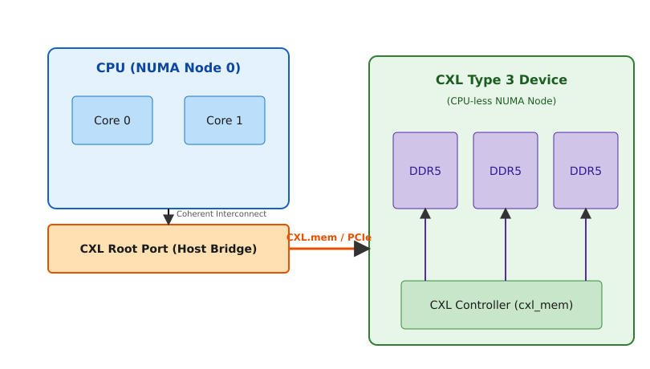

# Пам'ять на CXL: пристрої третього типу й області

<preknowlist>
- [PCI у Linux](topic:sys-unix/pci-config-space-and-enumeration) — як пристрій на шині перелічується, отримує конфігураційний простір і вікна фізичних адрес.
- [Нерівномірний доступ до пам'яті (NUMA)](topic:hw-arch/numa) — пам'ять поділена на вузли, і звертання до чужого вузла коштує дорожче за звертання до свого.
- [Фізичні сторінки в ядрі: зони й блоки](topic:sys-unix/physical-page-allocator) — як Linux роздає фізичну пам'ять сторінками й на які зони її ділить.
- [Гаряче додавання й вилучення пам'яті](topic:sys-unix/memory-hotplug) — новий діапазон фізичних адрес можна ввести в роботу вже на працюючій системі.
</preknowlist>

Коли ми будуємо сервери для обробки величезних масивів даних (наприклад, для баз даних in-memory, систем машинного навчання або великих віртуалізованих середовищ), ми неминуче стикаємося з фізичним обмеженням: процесор має фіксовану кількість каналів пам'яті DDR. Ви не можете просто взяти і вставити ще сто модулів пам'яті в існуючу материнську плату. Простір довкола сокета процесора жорстко лімітований, а прокладання сигнальних ліній для високочастотної пам'яті DDR вимагає ювелірної точності і суворих обмежень на довжину. Отже, виникає серйозна проблема: обчислювальних ядер стає дедалі більше (десятки й сотні), а пропускна здатність та обсяг пам'яті на одне ядро зменшуються. Як підключити додаткові терабайти системної оперативної пам'яті, не порушуючи когерентність кешів і не створюючи вузьких місць? Відповіддю на цей виклик став стандарт CXL (Compute Express Link), який дозволив приєднувати оперативну пам'ять прямо через шину PCIe, роблячи її повноцінною частиною адресного простору процесора.

## Еволюція та протоколи CXL: як шина PCIe навчилася когерентності

Шина PCIe чудово підходить для підключення периферії: відеокарт, мережевих адаптерів, NVMe-накопичувачів. Проте вона має один фундаментальний недолік, коли йдеться про оперативну пам'ять: PCIe не є когерентною. Якщо процесор звертається до пам'яті на PCIe-пристрої, йому доводиться робити це через спеціальні регістри (MMIO) і механізми прямого доступу до пам'яті (DMA), постійно синхронізуючи кеші вручну. Це повільно, складно і зовсім не підходить для прозорого використання такої пам'яті операційною системою як звичайної RAM.

CXL вирішує цю проблему, накладаючи поверх фізичного рівня PCIe (PHY) три спеціалізовані логічні протоколи:

1. **CXL.io**: Використовується для ініціалізації пристрою, конфігурації, виявлення (discovery) та переривань. По суті, це звичайний PCIe, який забезпечує базову взаємодію з периферією.
2. **CXL.cache**: Дозволяє периферійному пристрою когерентно кешувати дані з основної пам'яті хоста (процесора). Це корисно для прискорювачів (SmartNICs, GPU), яким потрібен швидкий доступ до системної пам'яті без необхідності постійно пересилати блоки даних.
3. **CXL.mem**: Найважливіший протокол для розширення пам'яті. Він дозволяє процесору хоста отримувати доступ до пам'яті, розташованої на CXL-пристрої, так, ніби це звичайна системна DDR-пам'ять. Протокол забезпечує когерентність кешів, що означає, що дані завжди залишаються узгодженими між процесором та пристроєм.

Три протоколи не змагаються за лінію по черзі — вони мультиплексуються динамічно поверх однієї фізики, і кожен тип пристрою бере лише потрібну комбінацію; коротка довідка, хто що вживає й навіщо, зібрана окремо: [протоколи CXL](topic:sys-unix/cxl-type3-regions-and-numa-node/api-cxl-spec.md).

Пристрої CXL діляться на три типи (Types).
- **Type 1 (CXL.io + CXL.cache)**: Розумні мережеві карти (SmartNICs), які кешують системну пам'ять, але не мають своєї власної пам'яті, доступної хосту.
- **Type 2 (CXL.io + CXL.cache + CXL.mem)**: Прискорювачі з власною пам'яттю (наприклад, GPU з HBM). Процесор може звертатися до пам'яті GPU, а GPU — до пам'яті процесора, причому обидві сторони підтримують когерентність.
- **Type 3 (CXL.io + CXL.mem)**: Модулі розширення пам'яті (Memory Expanders). Це просто контролер пам'яті та чіпи пам'яті (DDR або іншого типу), упаковані у форм-фактор PCIe-карти (або E3.S, E1.S). У них немає власного потужного обчислювального блоку. Їхня єдина мета — надати хосту більше оперативної пам'яті.

Саме пристрої Type 3 здійснили революцію у проєктуванні серверів, дозволивши розв'язати проблему "стіни пам'яті".

## Пристрої Type 3: розширювачі пам'яті (Memory Expanders)

Уявіть собі плату, яку ви вставляєте у звичайний слот PCIe 5.0 x16. На цій платі розташовані контролер CXL та кілька слотів для звичайних модулів DIMM (або запаяні чіпи LPDDR5). Коли сервер завантажується, процесор спілкується з цією платою через CXL.mem і бачить, що до нього підключено, скажімо, додаткових 512 ГБ оперативної пам'яті.

Що відбувається на рівні апаратного забезпечення? 
1. Прошивка й ядро відводять під пам'ять пристрою діапазон системних фізичних адрес — це HDM (Host-managed Device Memory). Це не MMIO: звертання туди — звичайні інструкції доступу до пам'яті, які процесор кешує й тримає когерентними, а не доступ до регістрів пристрою.
2. Затримка (latency) при доступі до цієї пам'яті зазвичай вища, ніж до локальної DDR (приблизно 170-250 наносекунд для CXL проти 80-100 нс для локальної DDR5). Тому операційна система бачить цю пам'ять не просто як загальну купу байтів, а як окремий NUMA-вузол.

Це дуже важливий момент: **Linux презентує CXL-пам'ять як NUMA-вузол без процесорних ядер (CPU-less NUMA node)**. Такий підхід ідеально вписується в існуючу архітектуру ядра. Ядро Linux вже вміє працювати з неоднорідною пам'яттю, розподіляючи "гарячі" дані у швидку локальну пам'ять, а "холодні" — у більш повільну пам'ять іншого NUMA-вузла. Сторінки рухає саме ядро, двома зустрічними механізмами ярусування (memory tiering). Угору, з повільного ярусу у швидкий, часто вживані сторінки підтягує NUMA balancing у режимі ярусування — `sysctl kernel.numa_balancing=2`, прапорець `NUMA_BALANCING_MEMORY_TIERING` з `include/linux/sched/sysctl.h`, з ядра 5.18. Униз, з локальної DDR у CXL, холодні сторінки витісняє (demotion) сам механізм звільнення пам'яті, ще перед свопом, — вмикається перемикачем `/sys/kernel/mm/numa/demotion_enabled` (з ядра 5.15, `Documentation/ABI/testing/sysfs-kernel-mm-numa`); з ядра 6.1 самі яруси веде окрема підсистема `mm/memory-tiers.c` з деревом `/sys/devices/virtual/memory_tiering/`. Демон `numad` до цього непричетний: за своїм man-описом він розміщує по вузлах цілі процеси разом з їхньою пам'яттю заради локальності, а не переносить окремі сторінки між швидкою й повільною пам'яттю.


*Шлях запиту до пам'яті CXL: від ядра процесора через когерентний інтерконнект до кореневого порту (Root Port), а далі шиною PCIe із протоколом CXL.mem — до контролера Type 3, який зчитує дані з прикріпленої до нього DDR-пам'яті. Модулі DDR належать пристрою, а не хостові: процесор дістає їх лише через цей контролер, і саме зайва ланка дає різницю в затримці.*

## Підсистема CXL у ядрі Linux

Оскільки CXL — це не просто PCIe, для керування такими пристроями потрібна спеціальна логіка. Ядро Linux (починаючи з версії 5.12, але зі значним розвитком у 6.x) отримало окрему підсистему CXL, яка складається з кількох ключових компонентів (модулів драйверів та абстракцій).

### Ієрархія пристроїв у ядрі

Коли CXL-пристрій ініціалізується, ядро будує топологію, яка відображає фізичне підключення.
1. **cxl_acpi**: Ядро спочатку дізнається про наявність CXL-сумісних мостів (Host Bridges) від системної прошивки (BIOS/UEFI) через таблиці ACPI, зокрема через таблицю CEDT (CXL Early Discovery Table).
2. **cxl_port**: Це логічне представлення CXL-комутаторів та кореневих портів. Оскільки CXL-пристрої можуть підключатися через кілька каскадів комутаторів (Switches), ядро створює дерево об'єктів `portN`.
3. **cxl_pci і cxl_mem**: кінцеву точку Type 3 на шині PCIe піднімає `cxl_pci` (`drivers/cxl/pci.c`) — він знаходить регістри пристрою, піднімає поштову скриньку (mailbox), інтерфейс для команд керування (стан пам'яті, шифрування, оновлення прошивки), і створює об'єкт memdev. Драйвер `cxl_mem` (`drivers/cxl/mem.c`) прив'язується вже до цього memdev і вбудовує пристрій у дерево портів — від кореневого порту до власних декодерів кінцевої точки.
4. **cxl_region**: Це найважливіша абстракція для організації пам'яті. Регіон (Region) об'єднує один або декілька CXL-декодерів (decoders) у єдиний неперервний діапазон системних фізичних адрес (System Physical Address, SPA).

### Декодери і Регіони (Regions)

Щоб процесор міг звернутися до пам'яті на CXL-пристрої, апаратне забезпечення (Host Bridge та Root Ports) повинне знати, куди перенаправляти запит, якщо адреса потрапляє у певний діапазон. Цим займаються HDM-декодери (Host-managed Device Memory decoders). 

**Регіон** — це логічна область пам'яті, налаштована поверх одного або кількох CXL-пристроїв. Навіщо об'єднувати кілька пристроїв? Для **чергування (interleaving)**.
Якщо ви підключите чотири CXL Type 3 пристрої по 256 ГБ кожен, ви можете налаштувати їх як чотири окремі регіони. Але для підвищення пропускної здатності ви можете зібрати один регіон на всі чотири пристрої — з чергуванням по чотирьох каналах (4-way). У такому разі послідовні блоки — за типової гранулярності 256 байт, її задають при створенні регіону, — лягають по черзі на кожен із чотирьох пристроїв, тож теоретична пропускна здатність складається з чотирьох посилань замість одного. Ядро Linux через підсистему `cxl_region` дозволяє динамічно створювати, конфігурувати і видаляти такі регіони.

Коли регіон успішно налаштований і прив'язаний до системних адрес (SPA), підсистема CXL повідомляє ядро про появу нової пам'яті (гаряче підключення пам'яті — memory hotplug). Ядро створює новий NUMA-вузол, і ця пам'ять стає доступною для користувацьких програм.

## Пул пам'яті та спільне використання (Memory Pooling & Sharing)

Стандарти CXL 2.0 і CXL 3.0 принесли ще революційніші можливості: пули пам'яті (Memory Pooling) та спільну пам'ять (Memory Sharing).

**Memory Pooling**: Уявіть собі шасі (стійку), де є окремий комутатор CXL і масивний пристрій Type 3 на кілька терабайт (Memory Appliance). До цього комутатора підключені кілька серверів (хостів). Механізм MLD (Multi-Logical Device) із CXL 2.0 дозволяє поділити один пристрій на кілька логічних і роздати їх різним хостам; переставляти ці межі на живій системі, без перезавантаження хоста, вміє вже DCD (Dynamic Capacity Device) із CXL 3.0. Якщо Серверу А вночі потрібен додатковий терабайт пам'яті для обробки бази даних, оркестратор виділяє йому цей обсяг з пулу. Вдень цей обсяг можна забрати і віддати Серверу Б. Це справжня композитна інфраструктура (Composable Infrastructure), яка радикально знижує загальну вартість володіння (TCO), оскільки ресурси пам'яті не простоюють у вимкнених або ненавантажених серверах.

**Memory Sharing**: У CXL 3.0 з'явилася можливість прив'язати один і той самий фізичний шматок CXL-пам'яті до адресних просторів двох різних серверів *одночасно*, з апаратною підтримкою когерентності (на рівні комутатора та пам'яті). Це дозволяє двом фізично різним серверам взаємодіяти через спільну пам'ять так само, як це роблять два процесори на одній материнській платі, що відкриває неймовірні перспективи для розподілених баз даних та кластерних систем.

## Утиліта `cxl` (CXL CLI)

Для взаємодії з підсистемою CXL у Linux використовується утиліта `cxl` (частина пакету `ndctl`, який раніше керував NVDIMM). Вона дозволяє інспектувати топологію, читати логи з поштових скриньок, створювати та видаляти регіони.

```bash
# Перегляд усієї топології CXL (шини, порти, кінцеві точки, декодери та їхні цілі)
cxl list -B -P -E -D -T

# Перегляд CXL-пам'яті (memdevs)
cxl list -M

# Створення регіону з явним переліком пристроїв: 4-way інтерлівінг.
# Ключ -m каже, що аргументи далі — імена memdev, і їх має бути рівно стільки,
# скільки задано в -w (cxl-create-region.txt у ndctl)
cxl create-region -m -d decoder0.0 -w 4 mem0 mem1 mem2 mem3

# Той самий регіон, але цілі підбирає сама утиліта: без -m і без переліку вона
# бере результат `cxl list -M -d decoder0.0`, а кількість каналів чергування — з довжини цього списку
cxl create-region -d decoder0.0 -t ram
```

Звідки взяти саму утиліту, які підкоманди потрібні найчастіше і що ядро пише в `dmesg`, коли регіон стає новим NUMA-вузлом, — зібрано в короткій практиці: [утиліта CXL CLI](topic:sys-unix/cxl-type3-regions-and-numa-node/proj-cxl-cli.md).

Утиліта спілкується з ядром через sysfs (каталог `/sys/bus/cxl/`) і надсилає команди ioctl через файли пристроїв. Це робить адміністрування CXL-пам'яті таким же простим і скриптованим, як керування логічними томами (LVM) для дисків.

Підсумовуючи: CXL, зокрема пристрої Type 3, повністю змінює архітектуру серверів, відриваючи оперативну пам'ять від диктату материнської плати. Завдяки підтримці у ядрі Linux через підсистеми `cxl`, ця пам'ять прозоро інтегрується у вигляді CPU-less NUMA-вузлів, дозволяючи будувати гнучкі пули пам'яті та економити ресурси у дата-центрах.
