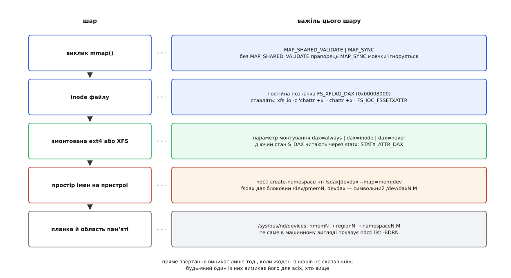

# 📋 Важелі DAX: чим його вмикають і чим перевіряють

Щоб звертання до файлу стало звертанням до пам'яті, мусять збігтися чотири «так» на чотирьох різних поверхах: пристрій розмічено як пристрій прямого звертання, файлова система це вміє й погодилася, конкретний inode не виключено, а виклик `mmap` попросив саме ту гарантію, яка потрібна. Нижче — усі важелі поверх за поверхом: значення параметрів, константи, сигнатури, таблиця помилок і команди, якими розмічають сам носій.



*Важелі не дублюють один одного: кожен живе на своєму поверсі, і «ні» на будь-якому з них вимикає пряме звертання для всіх, хто вище.*

## Параметр монтування

ext4 і XFS приймають той самий тристанний параметр. Тристанним він став у ядрі 5.8 (серії Ira Weiny окремо для ext4 і для XFS); доти був лише двійковий `-o dax`.

| значення | що робить |
| --- | --- |
| `dax=inode` | дивитися на позначку самого файлу — **типове** |
| `dax=always` | вмикати завжди, позначку файлу ігнорувати |
| `dax=never` | не вмикати ніколи, позначку файлу ігнорувати |
| `dax` | застарілий синонім `dax=always`; документація ядра попереджає, що параметр колись приберуть |

```sh
mount -o dax=inode /dev/pmem0 /mnt/pmem
```

Параметр діє на все монтування одразу й міняється тільки перемонтуванням. Поза ext4 і XFS цієї тристанності немає: ext2 знає лише двійковий вимикач, а virtiofs та erofs вмикають пряме звертання власними засобами, бо й причина в них інша.

## Постійна позначка на inode

Позначка зберігається у файловій системі й переживає перемонтування. Живе вона в полі `fsx_xflags` тієї самої структури, через яку ходять інші розширені атрибути ([Прапорці inode](root:sys-unix/inode-flags-chattr) — набір бітів на inode, які міняють поведінку файлу назавжди, а не на час відкриття, і читаються окремою парою ioctl).

```c
/* include/uapi/linux/fs.h */
struct fsxattr {
	__u32  fsx_xflags;      /* сюди й ставиться позначка */
	__u32  fsx_extsize;
	__u32  fsx_nextents;
	__u32  fsx_projid;
	__u32  fsx_cowextsize;
	unsigned char fsx_pad[8];
};

#define FS_XFLAG_DAX        0x00008000
#define FS_IOC_FSGETXATTR   _IOR('X', 31, struct fsxattr)
#define FS_IOC_FSSETXATTR   _IOW('X', 32, struct fsxattr)
```

| дія | команда |
| --- | --- |
| поставити | `xfs_io -c 'chattr +x' ФАЙЛ` або `chattr +x ФАЙЛ` |
| зняти | `xfs_io -c 'chattr -x' ФАЙЛ` або `chattr -x ФАЙЛ` |
| подивитися | `xfs_io -c 'lsattr' ФАЙЛ` або `lsattr ФАЙЛ` |

Успадкування має три правила, і саме вони найчастіше дивують:

- новий файл або підкаталог **успадковує** позначку від каталогу в мить створення;
- перемикання позначки на каталозі **не зачіпає** ані вже наявних у ньому файлів, ані вже наявних підкаталогів — тільки майбутні;
- зміна діючого стану файлу не набирає чинності, доки файл не закриють **усі** процеси.

Позначку ставлять і на каталог, але виключно заради успадкування: сам каталог прямого звертання ніколи не має.

## Що виходить у підсумку

Параметр монтування й постійна позначка разом дають діючий стан inode — той, що зветься в ядрі `S_DAX`.

| `dax=` | `FS_XFLAG_DAX` | діючий `S_DAX` |
| --- | --- | --- |
| `always` | байдуже | увімкнено |
| `never` | байдуже | вимкнено |
| `inode` | стоїть | увімкнено |
| `inode` | немає | вимкнено |

Дві дрібниці, через які тут регулярно помиляються. Перша: параметр монтування **не переписує** позначку на диску — `lsattr` під `dax=never` покаже той самий `x`, що й раніше, просто діяти він не буде; поверніть `dax=inode` — і позначка знову важить. Друга: `S_DAX` буває тільки в звичайних файлів, тож питати про нього в каталогу безглуздо — відповідь завжди «ні».

## Як спитати ядро, а не здогадатися

Діючий стан віддає `statx` — окремим бітом у полі атрибутів ([statx](root:sys-unix/statx-mask-and-unknown-values) — розширений запит метаданих файлу, у якому програма сама називає, що їй потрібно, а ядро окремою маскою відповідає, на що з питань воно взагалі вміє відповідати).

```c
#define _GNU_SOURCE
#include <sys/stat.h>
#include <fcntl.h>
#include <stdio.h>

/* int statx(int dirfd, const char *path, int flags,
             unsigned int mask, struct statx *buf);      */

/* include/uapi/linux/stat.h */
#define STATX_ATTR_DAX  0x00200000      /* з ядра 5.8 */

int main(int argc, char **argv) {
	struct statx st;
	if (statx(AT_FDCWD, argv[1], AT_STATX_SYNC_AS_STAT,
	          STATX_BASIC_STATS, &st) < 0)
		return perror("statx"), 1;

	if (!(st.stx_attributes_mask & STATX_ATTR_DAX)) {
		puts("ядро або ця ФС про DAX нічого не кажуть");
		return 0;
	}
	puts(st.stx_attributes & STATX_ATTR_DAX ? "S_DAX: так" : "S_DAX: ні");
	return 0;
}
```

Перевірка `stx_attributes_mask` тут не формальність. Нуль у `stx_attributes` означає рівно дві різні речі — «вимкнено» і «мене про це не питали»; розрізняє їх лише маска. Програма, яка дивиться самі атрибути, на старому ядрі впевнено доповість, що DAX вимкнено, хоча він працює.

## mmap: два прапорці й одна відповідь

`MAP_SYNC` (0x080000) просить ядро довести метадані до носія ще в обробнику помилки сторінки. Працює він тільки в парі з `MAP_SHARED_VALIDATE` (0x03) — типом відображення, який зобов'язує ядро перевірити кожен переданий прапорець, замість того щоб мовчки відкинути незнайомі. Обидва з'явилися в ядрі 4.15.

Що саме перевіряє ядро, видно з трьох рядків, які вирішують долю такого відображення:

```c
/* include/linux/dax.h */
static inline bool daxdev_mapping_supported(const struct vm_area_desc *desc,
                                            const struct inode *inode,
                                            struct dax_device *dax_dev)
{
	if (!vma_desc_test(desc, VMA_SYNC_BIT))   /* MAP_SYNC не просили */
		return true;
	if (!IS_DAX(inode))                       /* файл не в стані S_DAX */
		return false;
	return dax_synchronous(dax_dev);          /* пристрій синхронний? */
}
```

| ситуація | що повернеться |
| --- | --- |
| `MAP_SHARED` + `MAP_SYNC` | відображення вдасться, гарантії не буде: прапорець відкинуто мовчки |
| `MAP_SHARED_VALIDATE` + невідомий ядру прапорець | `EOPNOTSUPP` |
| `MAP_SHARED_VALIDATE` + `MAP_SYNC` на ФС без підтримки `MAP_SYNC` | `EOPNOTSUPP` |
| те саме на файлі без `S_DAX` | `EOPNOTSUPP` |
| те саме на `S_DAX`-файлі, але пристрій асинхронний (virtio-pmem) | `EOPNOTSUPP` |
| те саме, `S_DAX` і синхронний пристрій | вдається, гарантія діє |

```c
#include <sys/mman.h>
#include <linux/mman.h>     /* MAP_SYNC, MAP_SHARED_VALIDATE */

void *p = mmap(NULL, len, PROT_READ | PROT_WRITE,
               MAP_SHARED_VALIDATE | MAP_SYNC, fd, 0);
if (p == MAP_FAILED && errno == EOPNOTSUPP)
	/* прямого звертання під цим файлом немає — або воно є,
	   але пристрій не входить у захищений домен          */;
```

Останній рядок таблиці — не екзотика, а найпоширеніша причина відмови на віртуальній машині: паравіртуальний носій вимагає команди до хоста, щоб дані дійшли до справжніх комірок, тому `dax_synchronous()` для нього хибний, і `MAP_SYNC` чесно відмовляє.

## Де це взагалі можливо

Підтримка DAX є в чотирьох живих файлових системах: **ext4, XFS, virtiofs, erofs**. П'ятою була ext2, але її DAX оголосили застарілим у ядрі 6.16 (2025) і збираються прибрати — той самий носій відкривають драйвером ext4. Решта не має жодного з описаних тут важелів — ані параметра монтування, ані позначки на inode.

| вимога | подробиця |
| --- | --- |
| розмір блоку ФС = `PAGE_SIZE` ядра | `mkfs.ext4 -b 4096`, `mkfs.xfs -b size=4096` — інакше запис у таблиці сторінок не накриває цілої кількості блоків |
| архітектура без віртуально індексованого кешу | ядро вимикає DAX на 32-бітному ARM, MIPS і SPARC; arm64 під це не підпадає |
| XFS: обережно з `reflink` | спільні блоки й запис на місці роками виключали одне одного; співіснування додали лише 2022 року ([Копії з поділом блоків](root:sys-unix/reflink-copies) — два файли посилаються на ті самі блоки й розділяються тільки тоді, коли хтось у них пише) |
| вирівнювання під великі сторінки | простір імен розмічають із `-a 2M`, щоб одна помилка сторінки накривала одразу 2 МіБ ([Великі сторінки](root:sys-unix/huge-pages-tlb-reach) — один запис у таблиці сторінок замість п'ятисот дванадцяти) |

## Рівень пристрою: ndctl і daxctl

Файлова система нічого не ввімкне, доки носій не показано системі як пристрій прямого звертання. Розмічають його `ndctl`, а вже створеними dax-пристроями керує `daxctl` ([Постійна пам'ять як пристрій](root:sys-unix/persistent-memory-devices) — як планка NVDIMM показується ядру, що таке область і простір імен і звідки беруться `/dev/pmem0` та `/dev/dax0.0`).

| режим (`-m`) | що виходить | пряме звертання |
| --- | --- | --- |
| `raw` | `/dev/pmemN` без службових структур | часткове, без `MAP_SYNC` |
| `sector` | `/dev/pmemN` поверх BTT: сектор або старий, або новий | немає взагалі |
| `fsdax` | `/dev/pmemN` зі `struct page` на кожну сторінку — **типовий** | так, під файловою системою |
| `devdax` | символьний `/dev/daxN.M`, файлової системи немає | так, лише через `mmap` |

Окремий важіль — `-M, --map`: де взяти пам'ять під `struct page`, без яких не працюють ні `sendfile`, ні RDMA, ні прямий увід-вивід.

```
struct page:   64 байти на кожні 4096 байтів носія
частка         = 64 / 4096 = 1/64 = 1.5625 %
на 1 ТіБ       = 2⁴⁰ · 0.015625 = 16 ГіБ
```

`--map=dev` (типове) віддає ці 16 ГіБ на терабайт із самої планки: місткість помітно менша за паспортну, зате оперативна пам'ять не витрачена. `--map=mem` кладе структури в DRAM: носій доступний увесь, але 16 ГіБ оперативної пам'яті на кожен терабайт носія зникають назавжди.

```sh
ndctl list -BDRN -u                    # шини, планки, області, простори імен
ndctl create-namespace -r region0 -m fsdax -M dev -a 2M
ndctl create-namespace -e namespace0.0 -m devdax -f   # переробити наявний
daxctl list -u
daxctl reconfigure-device --mode=system-ram dax0.0    # віддати ядру як звичайну RAM
```

Перерозмічення завжди руйнівне, і `ndctl` цього не приховує. Зміна режиму міняє розкладку даних на носії, тому команда видає простору імен новий UUID — усе, що там лежало, стає недосяжним. Активний простір імен вона спершу вимкне, але тільки якщо його ніхто не змонтував: під змонтованою файловою системою `-f` не рятує, і команда відмовляється працювати. Розмір теж не довільний: якщо область розкладено по кількох планках, він мусить бути кратним ширині цієї розкладки, інакше простір імен просто не створиться.

Те саме, тільки без посередника, видно у файлах підсистеми ([Модель пристроїв у sysfs](root:sys-unix/sysfs-device-model) — кожен пристрій ядра має каталог, а його властивості — окремі файли в ньому, які читають і пишуть звичайними засобами).

```
/sys/bus/nd/devices/
    ndbus0            шина
    nmem0, nmem1 …    планки
    region0 …         області: суцільні діапазони, розкладені по планках
    namespace0.0 …    простори імен, з яких і виходять /dev/pmemN і /dev/daxN.M
```

Режим `devdax` варто розглянути окремо, бо в ньому не працює нічого з попередніх розділів. Файлової системи над ним немає, отже, немає ні параметра монтування, ні inode, ні позначки, ні `statx`: єдиний інтерфейс — `open` символьного пристрою й `mmap` над ним. Вирівнювання, задане під час створення простору імен, тут не побажання, а вимога: зсув і довжина відображення мусять йому відповідати, інакше `mmap` відмовить. Плата за строгість — жодного шару між програмою й носієм.

Ще один режим виглядає як сусід попередніх, але ним не є: `daxctl reconfigure-device --mode=system-ram` не вмикає прямого звертання, а робить протилежне — віддає діапазон ядру як звичайну оперативну пам'ять. Файлів там більше немає, тож і питати про них нема чого.

## Порядок перевірки, коли не працює

Кожна сходинка перевіряє рівно одну умову, і всі вони незалежні — тому йти ними варто згори вниз, не перескакуючи.

1. Чи та взагалі файлова система: `findmnt -no FSTYPE /mnt/pmem`. Поза цим переліком далі йти нема куди.
2. Чи не забороняє монтування: `findmnt -no OPTIONS /mnt/pmem`. `dax=never` перекриває будь-які позначки на файлах.
3. Чи стоїть позначка — має сенс лише за `dax=inode`: `lsattr ФАЙЛ` або `xfs_io -c 'lsattr' ФАЙЛ`.
4. Що каже саме ядро: `statx` і біт `STATX_ATTR_DAX` разом із маскою. Це єдина відповідь, якій варто вірити, бо всі попередні сходинки — лише припущення про неї.
5. Чи є гарантія метаданих: пробне відображення з `MAP_SHARED_VALIDATE | MAP_SYNC`. Відмова тут за ввімкненого `S_DAX` означає асинхронний пристрій, а не помилку в програмі.
6. Чи розмічено носій: `ndctl list -N` — режим має бути `fsdax`, а не `sector` чи `raw`.
7. Чи збігається розмір блоку зі сторінкою: `xfs_info /mnt/pmem` або `dumpe2fs -h /dev/pmem0`. Розбіжність тут не дає жодного повідомлення про помилку — пряме звертання просто мовчки не вмикається.
