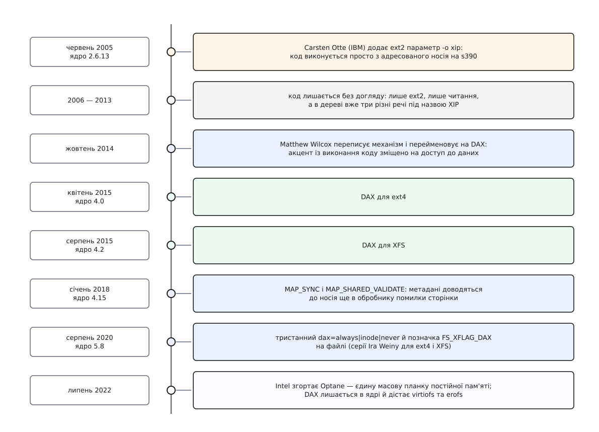

# 📜 Від XIP до DAX: механізм, що пережив своє залізо

Пряме звертання до файлів народилося не задля постійної пам'яті — його написали 2005 року для мейнфрейма IBM: за десять років до того, як Intel і Micron оголосили 3D XPoint, за чотирнадцять — до перших планок Optane у гніздах DIMM, і за сімнадцять до того, як воно спокійно пережило їхнє зникнення. Ця історія варта переказу насамперед тому, що вирішальною подією в ній була не нова технологія, а зміна назви.

*Вісімнадцять років в одному стовпці: справжня межа проходить 2014-го, коли механізм перестав бути про виконання коду.*

## Сотні гостей і одна копія бібліотеки

Початкова задача не мала нічого спільного з накопичувачами. На мейнфреймі z/VM на одній машині живуть сотні гостьових Linux-систем, і кожна з них тримає у своїй пам'яті власну копію того самого: `ld.so`, `libc`, звичайних утиліт. Сотня гостей — сотня копій байт-у-байт однакового коду.

Гіпервізор z/VM уміє віддати кільком гостям **спільний сегмент пам'яті** (DCSS, англ. *discontiguous saved segment*) — область, фізично одну на всіх. Якщо покласти в таку область файлову систему, вона стає носієм, який уже перебуває в адресному просторі: читати з нього нічого не треба, бо він і є пам'ять. Драйвер `dcssblk` показував цей сегмент як блоковий пристрій, і далі бракувало останнього кроку — щоб ядро не копіювало сторінки з нього нікуди.

Саме цей крок і зробив Carsten Otte з IBM. Червень 2005 року, комміт із назвою «xip: ext2: execute in place», у складі ядра 2.6.13, що вийшло 29 серпня 2005-го *(усталений факт: авторство й дата випуску звірені за деревом Torvalds і за нотатками до випуску)*. Ext2 отримала параметр монтування `-o xip`, і код гостьових бібліотек почав виконуватися просто з комірок спільного сегмента. Сто гостей — одна копія `libc`.

Ідея сама собою давня. Прошивки виконують із флеш-пам'яті, не копіюючи в RAM, рівно з тієї ж причини: мікросхема вже стоїть на шині пам'яті ([XIP: виконання коду з флеші на місці](topic:hw-arch/xip-memory-mapped-flash) — прошивка виконується з тієї самої мікросхеми, де лежить, бо процесор бачить її як звичайну адресну область). Внесок 2005 року був не в ідеї, а в тому, що це вміння вперше отримала повноцінна файлова система з іменами, правами й каталогами.

## Дев'ять років у кутку

Далі не сталося нічого. Отте того ж літа полагодив кілька гострих кутів («execute-in-place fixes» у липні, обробка розріджених файлів у ext2 наприкінці липня), 2008-го Nick Piggin навчив механізм працювати з пам'яттю без описувачів `struct page` — і на цьому потік уваги вичерпався.

Код застряг у становищі, знайомому кожному ядерникові: він працює, він комусь потрібен, він не має власника. Підтримувала його одна-єдина файлова система, і то найпростіша в дереві. Ext4 і XFS, тобто ті, якими справді користуються, про `xip` не знали нічого. Ба більше: слово «XIP» у дереві до того часу означало три різні речі, які між собою не сходилися.

Механізм у такому стані зазвичай тихо викидають. Його врятувало те, що близько 2014-го з'явилося залізо, для якого він раптом став центральним: планки постійної пам'яті в гніздах DIMM, які теж «уже перебувають в адресному просторі». Умова, під яку писався трюк для z/VM, справдилася вдруге — на зовсім іншому обладнанні.

## Жовтень 2014: перейменування як проєктне рішення

Matthew Wilcox узявся переписати цей код і подав його вже під іншою назвою. У супровідному листі до дванадцятої редакції набору латок, датованої 24 жовтня 2014 року, він пояснює обидві причини заміни імені *(усталений факт: набір і його опис розібрані в LWN за жовтень 2014)*.

Перша — суто прибиральна: тримати в дереві три різні речі під одним словом далі не можна.

Друга важливіша. XIP означає *execute in place*, «виконувати на місці» — і назва чесно описувала задачу 2005 року, де файли лише читали, а писати в них ніхто не збирався. Постійна пам'ять поставила питання ширше: у ці файли пишуть, у них ростуть блоки, до них одночасно звертаються кілька процесів. Wilcox прямо називає наслідок: новий наголос на доступі до **даних** змусив уважніше поставитися до перегонів, які в старому XIP-коді просто були. Так з'явилося ім'я DAX — *direct access*, пряме звертання; сам автор пояснив останню літеру жартом, що «X — це від eXciting».

Тут і проходить справжня межа цієї історії. Перейменування виглядало косметикою, а насправді було рішенням про призначення: механізм перестав бути про виконання коду й став про шлях даних узагалі. Усе, що сталося далі, випливає саме з цього — бо «виконувати на місці» можна тільки з носія, який пам'ятає без живлення, а «звертатися напряму» можна до чого завгодно, що вже видно процесорові.

## П'ять років добудови

Далі йдуть віхи, кожна з яких закриває дірку, якої в задачі 2005 року просто не існувало. Номери версій тут говорять більше за дати: ядро виходить кожні дев'ять-десять тижнів, тож сусідні числа означають сусідні місяці ([Модель випусків ядра](topic:sys-unix/kernel-release-model) — як влаштовані вікно злиття, кандидати й нумерація версій).

**Ядро 4.0, 12 квітня 2015 — DAX для ext4. Ядро 4.2, 30 серпня 2015 — DAX для XFS** *(усталений факт: дати випусків і склад змін — за нотатками kernelnewbies)*. Механізм уперше вийшов за межі ext2 й потрапив у файлові системи, які тримають робочі дані.

**Ядро 4.15, 28 січня 2018 — `MAP_SYNC` разом із `MAP_SHARED_VALIDATE`.** Це відповідь на проблему, що народилася разом із записом: програма могла старанно виштовхати свої байти в комірки й утратити їх усі, бо файлова система не встигла записати, що ці блоки взагалі комусь належать. Новий прапорець зобов'язує ядро довести метадані до носія ще до повернення з помилки сторінки, а другий прапорець потрібен лише тому, що звичайний `mmap` мовчки ковтає невідомі йому біти й на старому ядрі віддав би відображення без жодних гарантій.

**Ядро 5.8, 2 серпня 2020 — тристанний параметр `dax=always|inode|never` і позначка `FS_XFLAG_DAX` на самому файлі**, серіями Ira Weiny для ext4 і XFS *(усталений факт: авторство серії й склад випуску звірені за деревом і нотатками до 5.8)*. Доти вибір був «уся файлова система напряму або вся через кеш» — а це неправда для реального сервера, де база даних хоче прямого звертання, а тисячі дрібних файлів поруч виграють від кешування. Позначка успадковується від каталогу, тож режим став властивістю файлу, а не носія.

Це і є та точка, де DAX перестав бути експериментом у сенсі проєктному: не «спробуймо, чи вийде», а «ось важіль, яким адміністратор керує щоденно». Формальне зняття попереджень про експериментальність тяглося ще довго й розділами; наприклад, латка Shiyang Ruan, що прибирає таке попередження в XFS, обговорювалася восени 2022-го *(перевірено як факт обговорення; конкретну версію ядра, у якій вона осіла, стверджувати не беруся)*.

## Залізо пішло

У липні 2022 року Intel оголосив про згортання бізнесу Optane, списавши 559 мільйонів доларів товарних запасів *(усталений факт: заява у звітності за другий квартал 2022 року, широко переказана в галузевій пресі)*. Планок постійної пам'яті у форматі DIMM на масовому ринку не стало; ставку індустрія перенесла на CXL, де пам'ять під'єднують не в гніздо DIMM, а через шину PCI Express.

Механізм, написаний під ці планки, з ядра не зник і не законсервувався. Причина точно та сама, що врятувала його 2014-го: справжня умова DAX — не «носій пам'ятає без живлення», а «носій уже видно процесорові, копіювати нікуди не треба». Ця умова здійснюється щоразу, коли файлова система гостя бачить сторінки, які хост і так тримає у своєму кеші, або коли образ лише для читання вже відображений у пам'ять. Тому в переліку файлових систем із підтримкою DAX сьогодні стоять `virtiofs` і `erofs` поруч із ext4 і XFS, а найстарішу учасницю, ext2, з нього прибирають як застарілу — і половина цього списку про постійну пам'ять не думає взагалі.

Виходить симетрія, помітна лише здалеку. Механізм народився на мейнфреймі, де «носій» був спільним сегментом пам'яті гіпервізора, а не залізякою. Потім вісім років він служив справжньому залізу. Коли те залізо зникло, він повернувся туди, звідки прийшов, — у віртуалізацію. Пережила все це не реалізація, від якої з 2005 року не лишилося майже нічого, а формулювання задачі, і формулювання це було виправлене рівно один раз — у жовтні 2014-го, разом із назвою.
