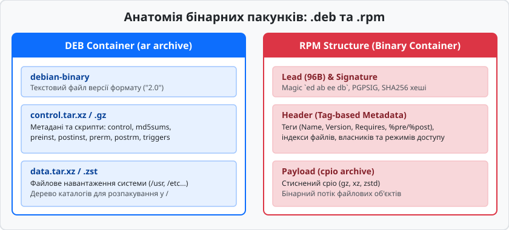

# deb і rpm: два світи пакування

<preknowlist>
- [Загальна модель пакетного менеджера](root:sys-unix/package-manager-model) — концепція пакетного менеджера, репозиторіїв та локальної бази даних.
- [Стандарт ієрархії файлової системи FHS](root:sys-unix/fhs-layout) — призначення каталожної структури `/usr`, `/etc`, `/var`, `/opt` в Unix-подібних системах.
</preknowlist>

Коли системний адміністратор намагається розгорнути програмний комплекс на десятки серверів шляхом прямого копіювання бінарних файлів, файлова система Linux швидко перетворюється на некероване середовище. Без централізованого обліку кожен новий файл мовчки перезаписує спільні бібліотеки (`.so`), конфігурації виходять із ладу при оновленнях, а чисте видалення програми стає неможливим без ризику зруйнувати операційну систему. Для перетворення хаотичного копіювання файлів на транзакційну, верифіковану та відтворювану операцію у світі Linux сформувалися дві фундаментальні системи пакування: **DEB** (Debian) та **RPM** (Red Hat Package Manager).

Формати `.deb` та `.rpm` вирішують однакову інженерну задачу — пакують бінарний вміст, метадані та скрипти автоматизації — але роблять це на основі протилежних архітектурних філософій.


*Анатомія бінарних контейнерів .deb (прозорий ar-архів) та .rpm (бінарна заголовочна структура з cpio-навантаженням).*

Детальний аналіз того, як виникла ця архітектурна розбіжність, розкрито в [історії створення та коеволюції форматів](root:sys-unix/deb-and-rpm/hist-formats.md).

---

## 1. Анатомія та низькорівнева будова формату .deb

Філософія розробки Debian спирається на використання випробуваних текстових форматів і стандартних системних утиліт Unix. Замість створення пропрієтарного або нового складного бінарного контейнера, формат `.deb` виступає звичайним архівом `ar` (Unix Archive).

Будь-який файл `.deb` містить рівно три елементи, розташовані у строго визначеному порядку:

1. `debian-binary` — текстовий файл маркера версії формату (`2.0\n`).
2. `control.tar.xz` (або `.gz` / `.zst`) — стиснений архів метаданих, опису залежностей та керуючих скриптів.
3. `data.tar.xz` (або `.gz` / `.zst`) — стиснений архів корисного навантаження файлової системи.

Дослідити внутрішній вміст пакунка `.deb` можна базовими інструментами POSIX без залучення `dpkg`:

```bash
$ ar t nano_5.4-2_amd64.deb
debian-binary
control.tar.xz
data.tar.xz
```

### 1.1. Архів метаданих control.tar.*

Архів метаданих містить службову інформацію, за допомогою якої `dpkg` та `APT` будують системне дерево залежностей і керують життєвим циклом програми.

Головним файлом всередині цього архіву є файл `control`, виконаний у форматі RFC 822 (пари "Ключ: Значення"):

```text
Package: nano
Version: 5.4-2
Architecture: amd64
Maintainer: Debian Developers <debian-devel@lists.debian.org>
Depends: libc6 (>= 2.31), libncursesw6 (>= 6), libtinfo6 (>= 6)
Section: editors
Priority: important
Description: small, friendly text editor inspired by Pico
 GNU nano is an easy-to-use text editor originally designed as a replacement
 for Pico...
```

Крім файлу `control`, архів метаданих містить:
- `md5sums`: Список MD5-хешів усіх файлів з `data.tar.*` для перевірки цілісності після копіювання на диск.
- `conffiles`: Перелік файлів (переважно в `/etc/`), які визначено як конфігураційні. Під час оновлення пакунка `dpkg` порівнює хеші файлів і, якщо адміністратор змінював налаштування вручну, зберігає старий файл, розміщуючи новий з розширенням `.dpkg-dist`.
- `shlibs` та `symbols`: Таблиці прив'язки експортованих shared-бібліотек до мінімально необхідних версій пакунків.

### 1.2. Скрипти обслуговування (Maintainer Scripts)

Керування встановленням та видаленням виконується чотирма оболонковими скриптами: `preinst`, `postinst`, `prerm`, `postrm`.

- `preinst`: Виконується перед розпакуванням нових файлів.
- `postinst`: Виконується після копіювання файлів на диск. Відповідає за виконання `ldconfig`, запуск демонів `systemd` та оновлення системних кешів.
- `prerm`: Виконується перед видаленням файлів під час деінсталяції або оновлення.
- `postrm`: Виконується після видалення файлів з диска. Під час виконання виклику `dpkg --purge` цей скрипт видаляє конфігурації та тимчасові каталоги.

Повна бінарна специфікація полів `control`, типів заголовків `ar` та передачі аргументів скриптлетам наведена в [детальній специфікації бінарних структур і полів метаданих](root:sys-unix/deb-and-rpm/api-deb-rpm.md).

### 1.3. Архів корисного навантаження data.tar.*

Архів `data.tar.*` дзеркально відтворює корінь файлової системи (`/`). Під час інсталяції `dpkg` розгортає цей архів відносно `/`, розміщуючи бінарні файли у `/usr/bin/`, конфігурації у `/etc/`, мануали у `/usr/share/man/`. Інформація про кожен розпакований файл додається у локальну базу даних `/var/lib/dpkg/status` та `/var/lib/dpkg/info/<package>.list`.

---

## 2. Анатомія та низькорівнева будова формату .rpm

Формат RPM (RPM Package Manager) розроблено на основі специфічного бінарного контейнера. На відміну от `.deb`, файл `.rpm` не розпаковується утилітою `ar`. Він має жорстку чотиричастинну бінарну структуру:

```
+-------------------------------------------------------------------+
| RPM Lead (96 bytes legacy header)                                 |
+-------------------------------------------------------------------+
| Signature Structure (Tag-based GPG/SHA256 digests)                |
+-------------------------------------------------------------------+
| Header Structure (Tag-based Metadata Index & Store)               |
+-------------------------------------------------------------------+
| Payload Stream (Compressed cpio archive: gz/xz/zstd)               |
+-------------------------------------------------------------------+
```

### 2.1. RPM Lead (Заголовок сумісності)

Перші 96 байтів кожного `.rpm` файлу займає застаріле поле `RPM Lead`. Воно містить сигнатуру magic-байтів (`0xED 0xAB 0xEE 0xDB`), версію формату (наразі 3.0 або 4.0), тип пакунка (0 = binary, 1 = source) та ім'я пакунка, доповнене нульовими байтами до 66 символів. Всі сучасні менеджери `rpm` ігнорують текстову інформацію з Lead, зчитуючи дані безпосередньо з секції Header.

### 2.2. Секція підпису Signature

Безпека в екосистемі RPM реалізована безпосередньо всередині бінарного пакунка. Секція `Signature` організована у вигляді тегованої структури, що містить:
- Розмір секції Header та Payload.
- MD5 / SHA-256 хеш-суми заголовка та стисненого архіву.
- Криптографічний цифровий підпис PGP/GPG, створений за допомогою приватного ключа розробника під час збірки.

Перевірка підпису здійснюється командою `rpm -K package.rpm`. Якщо відповідний публічний ключ попередньо імпортовано в системну базу даних RPM (`rpm --import`), менеджер підтверджує цілісність і автентичність пакунка до його розпакування.

### 2.3. Заголовок метаданих Header

Заголовок метаданих є ключовою частиною RPM. Він побудований за принципом масиву індексних тегів (Tag-Based Structure). Замість текстового файлу meta-даних, Header складається з масиву записів фіксованої довжини, де кожен запис містить:
- `tag` (32-бітовий числовий ідентифікатор).
- `type` (тип даних: рядок, ціле число, масив рядків).
- `offset` (зсув у байтах від початку блоку даних).
- `count` (кількість елементів).

Наприклад, числовий тег `1000` відповідає іменю пакунка (`RPMTAG_NAME`), тег `1001` — версії (`RPMTAG_VERSION`), тег `1049` — масиву необхідних залежностей (`RPMTAG_REQUIRENAME`). Завдяки такій бінарній структурі команда `rpm -q` виконується практично миттєво: менеджер зчитує лише бінарний заголовок і копіює його в системну базу даних без зчитування всього архіву.

### 2.4. Секція корисного навантаження Payload

Секція `Payload` містить стиснений потік файлового архіву `cpio`. На відміну від `tar`, формат `cpio` записує заголовки файлів безпосередньо у потік і краще підходить для обробки спеціальних файлів VFS (блокових пристроїв, сокетів, hard-лінків).

Сучасні RPM-пакунки (у Fedora, RHEL, openSUSE) використовують алгоритм стиснення `zstd` (Zstandard), який забезпечує у 3–5 разів вищу швидкість декомпресії у порівнянні з `xz` при аналогічному рівні стиснення, що суттєво прискорює масові транзакційні оновлення серверів.

Розпакувати корисне навантаження RPM без встановлення можна поєднанням утиліт `rpm2cpio` та `cpio`:

```bash
$ rpm2cpio htop-3.2.1-1.el9.x86_64.rpm | cpio -idmv
```

---

## 3. Транзакційні механізми та атомарність зміни файлової системи

Головне завдання будь-якого пакетного менеджера полягає у забезпеченні атомарності операцій. Якщо процес встановлення програми буде перервано раптовим відключенням електроживлення або збоєм мережі, операційна система не повинна залишитися у зламаному проміжному стані, де частина файлів записана, а частина відсутня.

### 3.1. Атомарне розпакування файлів у DPKG

Під час встановлення `.deb` пакунка утиліта `dpkg` виконує процедуру розпакування через тимчасові файли. Кожен новий файл розпаковується у цільовий каталог із тимчасовим розширенням `.dpkg-new` (наприклад, `/usr/bin/sysmon.dpkg-new`).

Лише після успішної декомпресії та перевірки MD5-хешів усіх файлів з `control.tar.*` менеджер здійснює системний виклик POSIX `rename()`, який атомарно замінює старий файл новим на рівні таблиць інодів VFS:

```
[Початковий стан]             [Етап розпакування]           [Атомарна заміна rename()]
/usr/bin/sysmon (v1.0)  --->  /usr/bin/sysmon (v1.0)    --->  /usr/bin/sysmon (v2.0)
                              /usr/bin/sysmon.dpkg-new (v2.0)
```

Якщо під час розпакування виникає помилка, `dpkg` просто видаляє всі створені файли `.dpkg-new`, залишаючи працюючу старанну версію додатка недоторканою.

### 3.2. Автомат станів пакунків DPKG (Package State Machine)

Під час маніпуляцій з пакунком `dpkg` фіксує проміжні стани у файлі `/var/lib/dpkg/status`:

- `half-installed`: Розпакування корисного навантаження було перервано. Система містить частково вивантажені файли.
- `unpacked`: Всі файли розпаковані, але конфігураційні скрипти `postinst` ще не виконувалися.
- `half-configured`: Скрипт `postinst` розпочав виконання, але завершився з помилкою (ненульовий код виходу).
- `triggers-awaited` / `triggers-pending`: Пакунок чекає обробки системних тригерів іншими компонентами.
- `installed`: Пакунок повністю розпакований, налаштований і готовий до використання.

Якщо оновлення системи перервалося, команда `dpkg --configure -a` аналізує записи стану у файлі `status` і повторно викликає `postinst` лише для тих пакунків, що опинилися у стані `unpacked` або `half-configured`.

### 3.3. Транзакційне управління у менеджері RPM

Утиліта `rpm` перед виконанням запису на диск будує внутрішню структуру транзакції (Transaction Element Array). На першому етапі перевіряється наявність вільного місця на відповідних точках монтування VFS за допомогою системного виклику `statvfs()`, а також відсутність конфліктів файлів між пакунками.

Під час оновлення RPM-пакунка нові файли записуються на диск поруч зі старими, а вилучення старих файлів відбувається лише після успішного виконання скриптлету `%post` нового пакунка. Скриптлет `%postun` старого пакунка виконується в самому кінці транзакції.

### 3.4. Блокування баз даних та ресурсомісткість

Для запобігання паралельним модифікаціям баз даних обидва пакетні менеджери застосовують міжпроцесні файлові блокування через системний виклик `fcntl()` із прапорцем `F_SETLK`:

- `dpkg` використовує lock-файли `/var/lib/dpkg/lock-frontend` та `/var/lib/dpkg/lock`.
- `rpm` використовує lock-файли `/var/lib/rpm/.rpm.lock`.

Спроба одночасно запустити дві сесії `apt` або `dnf` призведе до негайного відхилення другої операції з повідомленням `Could not get lock`.

---

## 4. Простеження транзакцій через sysfs, procfs та strace

Для розуміння того, що саме відбувається в ядрі Linux під час виконання операцій пакування, системний інженер може скористатися інструментом `strace` та дослідити віртуальні файлові системи `/proc` і `/sys`.

### 4.1. Відстеження системних викликів `dpkg -i`

Запуск `dpkg` під контролем `strace` демонструє точну послідовність системних викликів VFS:

```bash
$ strace -f -e trace=openat,rename,unlink,fsync,fcntl dpkg -i sysmon_1.0.0-1_amd64.deb
```

У лозі простеження чітко видно наступні кроки ядра:
1. `fcntl(3, F_SETLK, ...)` — захоплення блокування над `/var/lib/dpkg/lock`.
2. `openat(AT_FDCWD, "/usr/bin/sysmon.dpkg-new", O_WRONLY|O_CREAT|O_EXCL, 0755)` — створення тимчасового файлу.
3. `fsync(4)` — примусове скидання брудних буферів кешу сторінок ядра (Page Cache) на фізичний диск для гарантування збереження даних.
4. `rename("/usr/bin/sysmon.dpkg-new", "/usr/bin/sysmon")` — атомарна зміна іноду у VFS.
5. `unlink("/var/lib/dpkg/lock")` — звільнення міжпроцесного блокування.

### 4.2. Інспектування блокувань у procfs

Перевірити, який саме процес тримає блокування бази даних, можна зчитуванням віртуального файлу `/proc/locks`:

```bash
$ cat /proc/locks | grep POSIX
1: POSIX ADVISORY WRITE 4120 08:01:131075 0 EOF
```

Значення `4120` у четвертому стовпчику є ідентифікатором процесу (PID), який заблокував базу даних. За допомогою `ls -l /proc/4120/fd/` можна дізнатися точний відкритий файловий дескриптор.

---

## 5. Порівняльний аналіз системного збереження стану та баз даних

Менеджер пакунків повинен підтримувати абсолютно точну базу даних локально встановлених файлів та їхніх версій, щоб запобігти конфліктам під час інсталяції нових програм.

```
       +----------------------------------------------------+
       |          МЕНЕДЖЕР ПАКЕТІВ (dpkg / rpm)             |
       +-------------------------+--------------------------+
                                 |
        +------------------------+------------------------+
        |                                                 |
        ▼                                                 ▼
+-------------------------------+ +-------------------------------+
| База DPKG (/var/lib/dpkg/)    | | База RPM (/var/lib/rpm/)      |
| • Текстовий status (RFC 822)  | | • Бінарні таблиці SQLite/ndb  |
| • Списки файлів info/*.list   | | • Теговані індекси файлів     |
| • Легке відновлення текстом   | | • Швидкі індексні запити     |
+-------------------------------+ +-------------------------------+
```

### 5.1. Текстова база даних DPKG

Всі дані про стан встановлених пакунків Debian зберігаються у каталозі `/var/lib/dpkg/`. Головним файлом бази є текстовий файл `/var/lib/dpkg/status`. Він являє собою послідовне об'єднання вмісту файлів `control` усіх пакунків, присутніх у системі, доповнене полем статусу (наприклад, `Status: install ok installed`).

Списки файлів для кожного пакунка зберігаються у текстових файлах `/var/lib/dpkg/info/<package>.list`.

- **Переваги:** Висока стійкість до пошкоджень. Якщо файл `status` зазнає пошкодження через збій живлення диска, системний адміністратор може відновити його за допомогою звичайного текстового редактора або з резервної копії `/var/lib/dpkg/status-old`.
- **Недоліки:** Зростання часу парсингу. Зі збільшенням кількості встановлених пакунків до десятків тисяч, зчитування та парсинг єдиного великого текстового файлу при кожному виклику `dpkg` вимагає суттєвих ресурсів CPU та пам'яті.

### 5.2. Бінарна база даних RPM

Менеджер RPM зберігає інформацію у каталозі `/var/lib/rpm/`. Історично для цього використовувалася бінарна база даних Berkeley DB (`__db.001`, `Packages`), а у сучасних дистрибутивах (Fedora, RHEL 9) відбувся перехід на `SQLite` або власну неблокуючу базу `ndb`.

База даних RPM зберігає бінарні заголовки (Header) встановлених пакунків у незмінному вигляді.

- **Переваги:** Висока швидкість виконання індексних запитів. Запит на кшталт "якому пакунку належить файл `/usr/bin/htop`" (`rpm -qf /usr/bin/htop`) виконується за лічені мілісекунди завдяки B-tree індексам файлової системи.
- **Недоліки:** Ризик раптової рассинхронізації чи пошкодження бінарних індексів при аварійному вимкненні живлення. Відновлення пошкодженої бази вимагає спеціальної процедури реконструкції індексів `rpm --rebuilddb`.

---

## 6. Детальний порівняльний розбір механізмів тригерів

Під час масових оновлень системи, коли встановлюються сотні пакунків, багато з них вимагають виконання ідентичних пост-інсталяційних дій: оновлення кешу динамічних бібліотек `ldconfig`, генерація мануалів `mandb`, оновлення схем GSettings або баз даних MIME-типів.

Якщо кожен пакунок виконуватиме ці дії у власному скриптлеті `postinst` або `%post`, процедура оновлення сповільниться у десятки разів через багаторазовий перепрогін одного й того ж інструменту.

### 6.1. Механізм тригерів DPKG

У світі Debian проблему вирішено за допомогою декларативних тригерів DPKG:

- Пакунки, що надають системні сервіси (наприклад, `man-db` або `libc-bin`), декларують у своєму файлі `triggers` зацікавленість: `interest-noawait /usr/share/man`.
- Пакунки, що додають нові мануали, не викликають `mandb` у своєму `postinst`. Під час розпакування файлів у каталог `/usr/share/man` утиліта `dpkg` автоматично активує тригер.
- У самому кінці всієї транзакції APT інструмент `dpkg` викликає обробник тригера `mandb` **рівно один раз**, обробляючи всі зміни оптом.

### 6.2. Файлові тригери RPM (File Triggers)

Сучасний RPM підтримує механізм файлових тригерів (File Triggers), які описуються безпосередньо у spec-файлах за допомогою макросу `%triggerin`:

```spec
%triggerin -- /usr/share/icons/hicolor
/usr/bin/gtk-update-icon-cache --quiet /usr/share/icons/hicolor || :
```

Коли утиліта `rpm` виявляє, що поточна транзакція додала або змінила файли у каталозі `/usr/share/icons/hicolor`, вона відкладає виконання скриптлету `%triggerin` до моменту завершення копіювання усіх пакунків транзакції, після чого виконує оновлення кешу іконок один раз.

---

## 7. Багатоархітектурна підтримка: Multiarch проти Multilib

Сучасні 64-бітові операційні системи Linux повинні зберігати можливість виконання 32-бітових бінарних файлів або підтримки кількох архітектур процесорів одночасно (наприклад, `amd64` та `i386` або `aarch64` та `armhf`).

### 7.1. Підхід Debian: Multiarch

Debian впровадив концепцію **Multiarch**, яка дозволяє встановлювати бібліотеки різних архітектур у спільне дерево каталогів завдяки унікальним шляхам системних бібліотек:
- `/usr/lib/x86_64-linux-gnu/` для 64-бітової архітектури x86.
- `/usr/lib/i386-linux-gnu/` для 32-бітової архітектури x86.
- `/usr/lib/aarch64-linux-gnu/` для 64-бітової архітектури ARM.

У файлі `control` пакунки оголошують свій статус через поле `Multi-Arch`:
- `Multi-Arch: same`: Пакунки різних архітектур можуть співіснувати одночасно, оскільки їхні бібліотеки знаходяться у різних каталогах, а архітектурно-незалежні файли збігаються по байтах.
- `Multi-Arch: foreign`: Пакунок однієї архітектури може задовольняти залежності пакунка іншої архітектури (наприклад, крос-компілятор чи генератор документації).
- `Multi-Arch: allowed`: Залежність може бути задоволена як рідною архітектурою, так і сторонньою, якщо явно вказано кваліфікатор `:any`.

### 7.2. Підхід Red Hat: Multilib

Red Hat та Fedora спираються на класичну схему **Multilib**:
- `/usr/lib64/` для 64-бітових бібліотек та виконуваних файлів.
- `/usr/lib/` для 32-бітових бібліотек.

У RPM-базі даних 32-бітовий та 64-бітовий пакунки мають однакову назву, але різні значення тегу `RPMTAG_ARCH` (наприклад, `libX11.x86_64` та `libX11.i686`). Залежності shared-бібліотек явно описуються суфіксом розрядності `libc.so.6()(64bit)`.

---

## 8. Високорівневі менеджери та математичне вирішення залежностей

Ні утиліта `dpkg`, ні утиліта `rpm` **не вміють автоматично завантажувати залежності з мережі**. Якщо ви спробуєте встановити самостійний `.deb` або `.rpm` файл, який вимагає відсутню бібліотеку, базовий інструмент просто перерве роботу з помилкою відсутнього компонента.

Автоматичний пошук, завантаження та розв'язання конфліктів покладено на високорівневі надбудови: **APT** у світі DEB та **DNF / YUM / Zypper** у світі RPM.

```
+------------------------------------+ +------------------------------------+
|                APT                 | |             DNF / YUM              |
+------------------------------------+ +------------------------------------+
|  • Працює з репозиторіями Debian   | |  • Працює з репозиторіями RPM    |
|  • Алгоритм ітеративного сортування| |  • SAT-SOLVER (libsolv)            |
|  • Використовує dpkg для установки | |  • Використовує rpm для установки |
+------------------+-----------------+ +------------------+-----------------+
                   |                                      |
                   ▼                                      ▼
+------------------------------------+ +------------------------------------+
|                dpkg                | |                rpm                 |
|   (Розпакування ar / control / data)| |  (Розпакування cpio / Lead / Hdr) |
+------------------------------------+ +------------------------------------+
```

### 8.1. APT (Advanced Package Tool)

APT завантажує стиснені текстові індекси `Packages.xz` з мережевих дзеркал, будує в оперативній пам'яті орієнтований граф залежностей і застосовує евристичний алгоритм топологічного сортування для обчислення черговості інсталяції.

Для зменшення кількості проміжних операцій розпакування APT групує транзакції і передає `dpkg` упорядкований масив файлів. Крім того, APT активно взаємодіє з механізмом тригерів DPKG, що дозволяє уникнути повторного оновлення системних кешів після кожного встановленого файлу.

### 8.2. DNF та алгоритми SAT-Solvers (libsolv)

Сучасний менеджер RPM-пакунків `DNF` (Dandified YUM) та менеджер `Zypper` (у SUSE) використовують C-бібліотеку `libsolv`.

Замість ітеративних евристичних здогадок, `libsolv` переводить весь стан репозиторію та встановлених пакунків у булеву формулу у кон'юнктивній нормальній формі (CNF). Кожен пакунок представляється булевою змінною, а залежності та конфлікти — диз'юнктами (наприклад, `A → (B ∨ C)` перетворюється на `(¬A ∨ B ∨ C)`). Після цього SAT-солвер розв'язує задачу здійсненності булевих формул. Це гарантує математично точне обчислення єдиного оптимального набору пакунків або дає строгий доказ того, що запитана комбінація залежностей є нездійсненною.

---

## 9. Моделі довіри та криптографічної верифікації

Безпека розгортання програмного забезпечення гарантується цифровими підписами на основі криптографії з відкритим ключем (GPG/PGP).

### 9.1. Модель довіри Debian: Підпис репозиторію

В екосистемі Debian основним об'єктом підпису є **індексний файл репозиторію**, а не окремий файл `.deb`.

1. Під час створення репозиторію інструмент `apt-ftparchive` розраховує SHA-256 хеші всіх бінарних `.deb` пакунків і записує їх у файл `Packages`.
2. Далі створюється файл `Release`, який містить SHA-256 хеші самого файлу `Packages`.
3. Мейнтейнер репозиторію підписує файл `Release` своїм приватним ключем GPG, створюючи файл `InRelease` (або `Release.gpg`).

Під час виконання `apt update` система перевіряє підпис файлу `InRelease` за допомогою публічних ключів із `/etc/apt/trusted.gpg.d/`. При завантаженні конкретного `.deb` файлу APT перевіряє його SHA-256 хеш проти значення з підписаного файлу `Packages`. Сам `.deb` файл не потребує власного вбудованого підпису.

### 9.2. Модель довіри RPM: Підпис кожного пакунка

В екосистемі RPM підпис вбудовується **безпосередньо всередину кожного `.rpm` файлу** у секцію `Signature`.

Під час збірки команда `rpm --addsign package.rpm` розраховує хеш заголовків та корисного навантаження і підписує його приватним GPG-ключем.

Перед встановленням менеджер `rpm` (або `dnf`) імпортує публічні ключі у системну базу даних (`rpm --import /etc/pki/rpm-gpg/RPM-GPG-KEY-...`) і перевіряє підпис конкретного `.rpm` файлу незалежно від того, яким каналом він був доставлений на сервер (з офіційного репозиторію, через флеш-накопичувач чи через скачування утилітою `curl`).

---

## 10. Порівняння створення пакунків: Spec-файл проти каталогу debian/

Процес створення бінарного пакунка з вихідного коду програми відображає принципову різницю в організації проектів.

Практичну реалізацію збірки реального C/C++ сервісу для обох систем детально показано в [практичному проекті зі збірки C/C++ сервісу](root:sys-unix/deb-and-rpm/proj-building.md).

### 10.1. Підхід RPM: Єдиний .spec файл

У світі RPM весь процес збірки описується в одном текстовому файлі-рецепті з розширенням `.spec`. Файл розділено на декларативний заголовок та послідовні секції:

- `%prep`: Розпакування вихідного архіву (`%autosetup`) та накладання патчів.
- `%build`: Викликає команди компіляції (`%configure`, `%make_build`).
- `%install`: Виконує копіювання файлів у тимчасовий корінь збірки (`%make_install DESTDIR=%{buildroot}`).
- `%files`: Перелічує всі файли, які повинні увійти до підсумкового бінарного пакунка, із зазначенням макросів атрибутів доступу (`%attr`, `%config`, `%doc`).

Такий підхід дозволяє пейкеджеру бачити весь життєвий цикл збірки в одному файлі. Завдяки системним макросам RPM (наприклад, `%{_bindir}`, `%{_libdir}`) спек-файл легко адаптується до 32-бітових та 64-бітових архітектур без зміни вихідного коду.

### 10.2. Підхід Debian: Каталог debian/

У світі Debian інструкції пакування рознесені по окремих файлах всередині каталогу `debian/`:

- `debian/control`: Декларативні метадані та залежності збірки (`Build-Depends`).
- `debian/rules`: Виконуваний `Makefile`, який керує компіляцією. Завдяки системі `debhelper` цей файл зазвичай містить лише запуск універсального сценарію `dh $@`.
- `debian/changelog`: Строго стандартизований журнал змін, з якого інструменти збірки витягують поточну версію пакунка.
- `debian/<package>.install`: Перелік файлів, які потрібно перемістити у конкретний бінарний пакунок (якщо з одного вихідного коду збирається кілька `.deb` файлів).

Модульність каталогу `debian/` дозволяє легко підключати спеціалізовані розширення `debhelper` (наприклад, `dh_python`, `dh_systemd`), які автоматично ґенерують необхідні скриптлети інсталяції.

---

## 11. Конвертація між форматами: Утиліта Alien та її обмеження

Коли необхідна програма розповсюджується лише у форматі `.rpm`, а цільова система працює під управлінням Ubuntu/Debian (або навпаки), системні адміністратори часто використовують утиліту **Alien**.

Команда `alien --to-deb package.rpm` розпаковує RPM-пакунок, конвертує заголовок у файл `control` і збирає новий `.deb` файл.

Однак Alien **не гарантує** працездатності отриманого пакунка через три системні бар'єри:

1. **Неспівпадіння імен залежностей:** Одна й та сама бібліотека у Debian називається `libncursesw6`, а у Red Hat — `ncurses-libs`. Alien не може автоматично перекласти назви всіх пакунків у системі залежностей.
2. **Несумісність скриптів:** Скрипти `postinst` та `%post` часто використовують команди, специфічні для конкретного дистрибутиву (наприклад, різні утиліти для оновлення системних конфігурацій мережі чи сервісів).
3. **Розбіжності у шляхах FHS:** Різні дистрибутиви можуть розміщувати однакові бінарні файли у `/lib` чи `/usr/lib64`, що призводить до конфліктів при розпакуванні.

Тому Alien підходить переважно для простих автономних утиліт без складних залежностей і скриптів обслуговування.

---

## Підсумкове порівняння технологій

| Архітектурна характеристика | Екосистема DEB (Debian / Ubuntu) | Екосистема RPM (RHEL / Fedora / SUSE) |
| :--- | :--- | :--- |
| **Базовий контейнер** | `ar` (стандартний Unix-архів) | Власний бінарний контейнер |
| **Формат метаданих** | Текстовий (RFC 822 `control`) | Бінарний (тегані заголовки Header) |
| **Формат корисного навантаження** | `data.tar.xz` / `data.tar.zst` | `cpio` (стиснений `xz` / `zstd`) |
| **Локальна база даних** | Текстовий файл `/var/lib/dpkg/status` | Бінарна база `/var/lib/rpm/` (SQLite/ndb) |
| **Модель цифрового підпису** | Підпис репозиторію (`InRelease`) | Вбудований підпис кожного `.rpm` пакунка |
| **Високорівневий менеджер** | `APT` (Advanced Package Tool) | `DNF` / `YUM` / `Zypper` |
| **Алгоритм залежностей** | Графовий сортувальник APT | Математичний SAT-Solver (`libsolv`) |
| **Конфігурація збірки** | Каталог `debian/` із множиною файлів | Єдиний специфікаційний файл `.spec` |

Обидва формати довели свою найвищу надійність протягом трьох десятиліть еволюції Linux. DEB надає системному інженеру прозорість та легкість відновлення завдяки текстовим метаданим та стандартним Unix-інструментам. RPM пропонує високу швидкість запитів, сувору перевірку цифрових підписів окремих файлів та математично точне розв'язання конфліктів за допомогою SAT-солверів. Розуміння цих низькорівневих механізмів дозволяє системному адміністраторові впевнено діагностувати збої оновлень, створювати власні пакунки та ефективно управляти інфраструктурою будь-якого масштабу.
