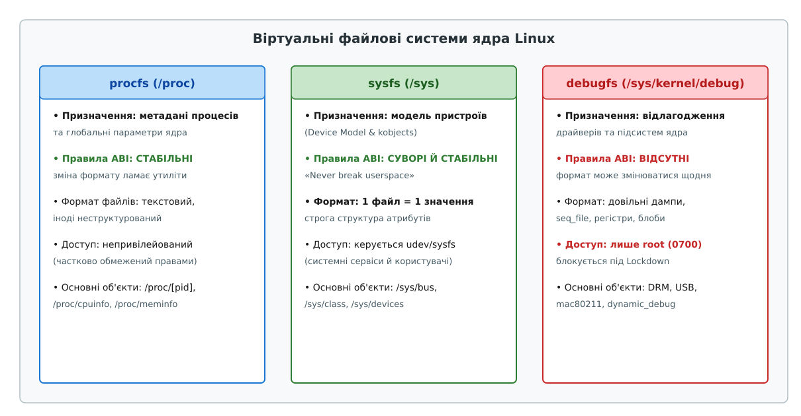
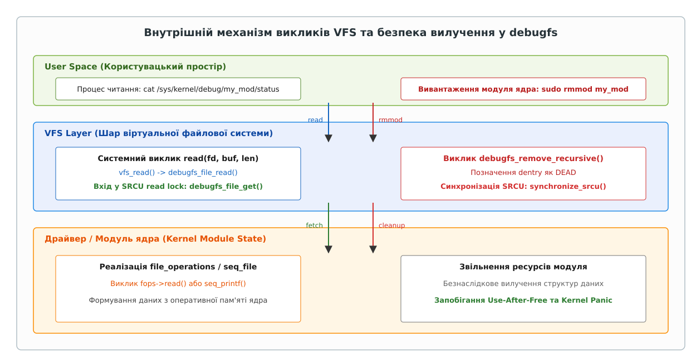

# debugfs: службове вікно в нутрощі ядра

<preknowlist>
- [Ядро й простір користувача](root:sys-unix/kernel-and-userspace) — фундаментальна межа між привілейованим режимом виконання та процесами користувача.
- [«Усе є файлом»: один інтерфейс на все](root:sys-unix/everything-is-a-file) — принципи мапування системних ресурсів на уніфіковане дерево VFS.
- [Файлова система sysfs, kobject та sysfs_dirent](root:sys-unix/sysfs-kobject-sysfs-dirent) — впорядкована модель пристроїв з жорсткими вимогами до ABI.
</preknowlist>

Коли системному програмісту або розробнику драйверів ядра Linux потрібно експортувати діагностичну інформацію з нутрощів ядра в простір користувача, він негайно зіштовхується з жорсткими обмеженнями традиційних віртуальних файлових систем. Файлова система `procfs` (`/proc`), історично створена на початку 1990-х років для відображення стану процесів, за десятиліття розвитку виявилася захаращеною неструктурованими файлами та різношерстими текстовими дампами. Файлова система `sysfs` (`/sys`), уведена в серії ядра 2.6 для впорядкування моделі пристроїв (`Device Model`), підпорядкована суворому нормативному правилу «один атрибут — один файл» та зафіксована непорушним гарантом стабільності користувацького інтерфейсу (ABI). Будь-яка спроба розробника додати в sysfs тимчасовий дамп з 50 внутрішніх регістрів контролера або змінити формат текстової таблиці при виході нової версії ядра розбивається об фундаментальне правило Лінуса Торвальдса: «Never break userspace».

Для вирішення цього архітектурного тертя у ядрі Linux існує **debugfs** — RAM-базована віртуальна файлова система, створена як спеціально відведене пісочне вікно для відлагодження, діагностики та спостереження за ядром без жодних гарантій стабільності ABI.

---

## 1. Архітектурне призначення: чому sysfs та procfs виявилися затісними

Щоб зрозуміти першопричину появи debugfs, необхідно розглянути технічний конфлікт між вимогами стабільності продакшн-системи та потребами розробника під час налагодження складних підсистем (наприклад, графічних прискорювачів DRM, бездротових стеків `mac80211` чи регуляторів пам'яті).

У звичайній файловій системі sysfs кожен файл представляє конкретний об'єкт `kobject` або його атрибут. Для створення файла розробник зобов'язаний розписати структуру `struct attribute`, оголосити методи читання й запису (`show` / `store`), прикріпити об'єкт до відповідної шини чи пристрою і гарантувати, що вивід файлу завжди міститиме лише одне значення в ASCII-форматі. Якщо системний демон (наприклад, `udev` чи `systemd`) розраховує зчитати з файла `/sys/class/net/eth0/operational_state` єдине слово `up`, розробник не має права вивести туди додатковий дамп помилок шини PCI або таблицю стану дескрипторів пакета.

```
+-----------------------------------------------------------------------+
|                 СПЕКТР ВІРТУАЛЬНИХ ФАЙЛОВИХ СИСТЕМ                     |
+-----------------------------------------------------------------------+
|  procfs (/proc)         sysfs (/sys)             debugfs (/sys/kernel)|
|  ------------------     -------------------      ---------------------|
|  Метадані процесів     Модель пристроїв         Відлагодження ядра    |
|  Стабільне ABI          Жорстке ABI (1 файл = 1) Без гарантій ABI     |
|  Загальносистемні дані  Ієрархія kobject         Свобода форматів     |
+-----------------------------------------------------------------------+
```

Якщо розробник драйвера спробує обійти обмеження sysfs і виведе сотні рядків неструктурованого тексту в один файл, його патч буде беззастережно відхилено при перевірці мейнтейнерами. Якщо ж він розмістить діагностичні файли у `/proc`, він порушить архітектурний контроль за чистотою procfs.

`debugfs` зняла це системне напруження. Створена Грегом Кроа-Гарртманом у листопаді 2004 року (увійти в ядро Linux 2.6.10-rc3), вона втілила радикальний маніфест: **у debugfs немає жодних правил**. Детальний розбір того, як розробники ядра прийшли до відмови від ABI та які дискусії точилися навколо ризику перетворення debugfs на «сміттєзвалище», розкрито в [історії створення debugfs](root:sys-unix/debugfs-kernel-debug-vfs/hist-debugfs.md).



*Рис. 1. Порівняльний аналіз призначення та гарантій ABI у procfs, sysfs та debugfs.*

Головні відмінності debugfs від суміжних ВФС:
- **Повна відсутність гарантій ABI:** розробник має право додавати, перейменовувати, повністю змінювати формат або видаляти файли у debugfs між будь-якими версіями ядра. Програми простору користувача не повинні покладатися на наявність цих файлів під час штатної роботи.
- **Простота експорту даних:** створення файлу для відлагодження змінної цілого типу вимагає одного виклику C API (`debugfs_create_u32`), у той час як у sysfs це вимагає оголошення складного об'єкта та його атрибутів.
- **Відсутність нав'язаної структури:** всередині debugfs драйвер може створювати довільну ієрархію каталогів, виводити бінарні блоби, текстові дампи таблиць або масиви регістрів будь-якого обсягу.

---

## 2. Архітектура debugfs у контексті VFS: пам’яттєва модель та легковажні dentry

З точки зору віртуальної файлової системи (VFS), `debugfs` є недисковою віртуальною файловою системою, розташованою повністю в оперативній пам'яті (RAM-based pseudo-filesystem). Вона реалізована на основі універсального інфраструктурного шару `libfs` (як і `ramfs` або `tmpfs`).

Точка монтування за замовчуванням у сучасних дистрибутивах Linux — каталог `/sys/kernel/debug`. Ініціалізація монтування зазвичай виконується автоматично системним менеджером `systemd` через монт-юніт `sys-kernel-debug.mount` або командою:

```bash
mount -t debugfs none /sys/kernel/debug
```

### Структури даних та легковажність об'єктів

На відміну від sysfs, де кожен файл і каталог нерозривно зв'язаний із важким об'єктом `kobject` (який несе в собі лічильники посилань `kref`, зв'язки з `kset`, механізми подій `kobject_uevent` для udev та прив'язку до `sysfs_dirent`/`kernfs_node`), debugfs працює безпосередньо з базовими об'єктами VFS: **`struct dentry`** та **`struct inode`**.

```
+-----------------------------------------------------------------------+
|                 ПОРІВНЯННЯ НАКЛАДНИХ ВИТРАТ ОБ'ЄКТІВ                  |
+-----------------------------------------------------------------------+
|  sysfs node:                                                          |
|  [kobject] ---> [kernfs_node] ---> [dentry] ---> [inode]             |
|  (важка структура: uevents, sysfs_dirent, kref, sysfs attributes)     |
|                                                                       |
|  debugfs node:                                                        |
|  [dentry] ---> [inode]                                                |
|  (прямий запис VFS: мінімальна пам'ять, без kobject та uevents)       |
+-----------------------------------------------------------------------+
```

Коли модуль ядра викликає функцію `debugfs_create_file()`, debugfs виконує такі кроки:
1. Захоплює м'ютекс батьківського каталогу (`inode->i_rwsem`).
2. Виділяє новий об'єкт `dentry` у RAM за допомогою внутрішнього VFS-хелпера `lookup_one_len()`.
3. Викликає `debugfs_get_inode()`, створюючи імпровізований `struct inode` у пам'яті.
4. Призначає для inode спеціальну таблицю операцій `debugfs_file_operations`, яка обгортає користувацьку структуру `file_operations`.
5. Зберігає вказівник на приватні дані драйвера (`data`) у полі `inode->i_private`.

Завдяки такій мінімалістичній схемі накладні витрати на утримання тисяч відлагоджувальних файлів у debugfs є мінімальними, а самі файли не генерують шумних подій у користувацькому просторі через сокети `netlink` (uevent), як це робить sysfs при появі кожного нового `kobject`.

---

## 3. Безпека, права доступу та режим Kernel Lockdown

Гнучкість та відсутність обмежень у debugfs створюють серйозні виклики для безпеки операційної системи. Оскільки відлагоджувальні файли драйверів часто виводять прямі фізичні або віртуальні адреси ядерних структур пам'яті, вміст регістрів прямого доступу до пам'яті (DMA), або дозволяють модифікувати параметри роботи ядра на льоту, debugfs є привабливим вектором для атак локального підвищення привілеїв (Local Privilege Escalation).

Зчитування адрес пам'яті з debugfs дозволяє зловмиснику миттєво обійти механізм рандомізації адресного простору ядра (KASLR Bypass). Зміна ж деяких прапорців у debugfs може призвести до виконання довільного коду в контексті ядра.

### Модель доступу та обмеження привілеїв

За замовчуванням права доступу до точки монтування `/sys/kernel/debug` встановлюються як `0700` (`drwx------`), а власником є `root:root`. Це означає, що непривілейовані користувачі системи позбавлені навіть можливості переглянути список файлів усередині debugfs.

Для посилення безпеки на продакшн-серверах ядро Linux надає декілька рівнів контролю:

1. **Параметри завантаження ядра (`debugfs=`):**
   У ядрі Linux 5.7 з'явився boot-параметр `debugfs=`, який приймає три значення:
   - `debugfs=on` — повністю вмикає debugfs (поведінка за замовчуванням).
   - `debugfs=off` — повністю вимикає реєстрацію та монтування debugfs. Будь-які спроби створити каталоги чи файли повертають помилку, а монт-юніт зазнає невдачі.
   - `debugfs=no-mount` — забороняє монтування debugfs простором користувача, але зберігає її внутрішньоядерне функціонування (потрібно для того, щоб підсистема трасування `tracefs` могла працювати незалежно).

2. **Інтеграція з підсистемою Kernel Lockdown (Linux 5.4+):**
   Модуль безпеки Lockdown (`CONFIG_SECURITY_LOCKDOWN_LSM`) призначений для захисту цілісності ядра навіть від користувача `root`, якщо увімкнено Secure Boot. Lockdown працює у двох режимах:
   - **`integrity` (цілісність):** блокує будь-які файли debugfs, які дозволяють записувати дані в пам'ять ядра або змінювати стан апаратури (наприклад, файли з правами на запис у прапорці чи регістри).
   - **`confidentiality` (конфіденційність):** повністю блокує доступ до будь-яких файлів у debugfs (навіть на читання), оскільки вони можуть містити витік критичних даних пам'яті чи ключів шифрування.

---

## 4. Життєвий цикл файлів: Safe Removal та захист від Race Conditions

Одним із найскладніших технічних завдань при розробці debugfs було забезпечення безпечного видалення файлів під час вивантаження модулів ядра (`rmmod`).

### Історична проблема Use-After-Free

У ранніх версіях debugfs (до ядра Linux 4.7) існувала небезпечна гонка станів (Race Condition). Уявимо ситуацію:
1. Модуль ядра `my_driver.ko` створив файл `/sys/kernel/debug/my_driver/status` і передав туди вказівник на власну структуру даних у виклику `debugfs_create_file()`.
2. Користувач у просторі користувача відкриває цей файл (`open()`) і починає повільно зчитувати з нього дані (`read()`). У цей момент потік виконання знаходиться усередині функції `fops->read()`, оголошеної в коді модуля.
3. Адміністратор системи викликає `rmmod my_driver`. Модуль у своїй функції `module_exit` викликає `debugfs_remove_recursive()` і звільняє пам'ять модуля (`kfree()` або `vfree()`).
4. Потік користувацького читання прокидається й намагається зчитати наступний байт за вказівником на вже вивантажену пам'ять модуля.

Результат — негайне падіння ядра (Kernel Panic, NULL pointer dereference або Use-After-Free).



*Рис. 2. Архітектурний механізм VFS та синхронізація SRCU при безпечному вилученні файлів debugfs.*

### Сучасне розв'язання: обгортка `debugfs_file_get` та SRCU

Для викорінення цієї проблеми у ядрі Linux 4.7 під керівництвом Ала Варо (Al Viro) реалізували прозорий механізм синхронізації на основі **SRCU (Sleepable Read-Copy-Update)**.

Тепер кожна структура `file_operations`, передана у debugfs, не викликається VFS напряму. Замість цього debugfs підставляє проміжну таблицю операцій `debugfs_full_path_ops`.

Коли користувач виконує системний виклик `read()`, відбувається наступне:

```c
/* Спрощена концептуальна схема захисту у debugfs */
ssize_t debugfs_file_read(struct file *file, char __user *buf, 
                          size_t val, loff_t *ppos)
{
    struct dentry *dentry = file->f_path.dentry;
    int idx;
    ssize_t ret;

    /* 1. Захоплюємо SRCU read lock для перевірки життєздатності dentry */
    if (debugfs_file_get(dentry, &idx))
        return -EIO; /* Файл вже видаляється модулем! */

    /* 2. Безпечно викликаємо реальний fops драйвера */
    ret = real_fops->read(file, buf, val, ppos);

    /* 3. Звільняємо SRCU read lock */
    debugfs_file_put(dentry, idx);

    return ret;
}
```

Коли модуль викликає `debugfs_remove()` або `debugfs_remove_recursive()`:
1. debugfs атомарно встановлює прапорець `DEAD` на відповідному об'єкті `dentry`. Усі нові виклики `debugfs_file_get()` починають негайно повертати помилку `-EIO`.
2. debugfs викликає `synchronize_srcu()`. Цей виклик блокує потік вивантаження модуля доти, доки **усі вже запущені** операції `read()` або `write()` у коді модуля не завершаться і не вийдуть із зони `debugfs_file_put()`.
3. Лише після цього пам'ять модуля безпечно вивантажується.

Це архітектурне рішення повністю усунуло Use-After-Free у debugfs, зробивши гаряче видалення відлагоджувальних файлів 100% безпечним.

---

## 5. Огляд C API ядра: від базових типів до seq_file та дампів регістрів

API debugfs надає розробникам ядра набір готових інструментів для експорту даних будь-якого рівня складності. Повний опис сигнатур, параметрів та типів даних зібраний у [довіднику C API ядра для debugfs](root:sys-unix/debugfs-kernel-debug-vfs/api-debugfs.md).

Розглянемо ключові категорії функцій API.

### Створення каталогів та вилучення

Будь-який модуль ядра, що експортує метрики або стан через debugfs, організовує свої файли у власну ієрархію каталогів, аби уникнути колізій імен у спільному просторі `/sys/kernel/debug`. Батьківський каталог створюється під час ініціалізації модуля, а при його вивантаженні весь створений деревний граф має бути повністю вилучений із пам'яті VFS.

```c
struct dentry *debugfs_create_dir(const char *name, struct dentry *parent);
void debugfs_remove(struct dentry *dentry);
void debugfs_remove_recursive(struct dentry *dentry);
```

Якщо параметр `parent` дорівнює `NULL`, каталог створюється у корені `/sys/kernel/debug`. Головна перевага `debugfs_remove_recursive()` полягає у тому, що модулю ядра достатньо зберегти лише один вказівник на свій кореневий каталог у debugfs, і при вивантаженні видалити його разом з усіма вкладеними файлами в один рядок.

### Експорт примітивних типів даних

Ядро надає готові хелпери для експорту числових змінних та прапорців без написання власного `struct file_operations`:

```c
void debugfs_create_u8(const char *name, umode_t mode, struct dentry *parent, u8 *value);
void debugfs_create_u16(const char *name, umode_t mode, struct dentry *parent, u16 *value);
void debugfs_create_u32(const char *name, umode_t mode, struct dentry *parent, u32 *value);
void debugfs_create_u64(const char *name, umode_t mode, struct dentry *parent, u64 *value);

void debugfs_create_x32(const char *name, umode_t mode, struct dentry *parent, u32 *value);
void debugfs_create_bool(const char *name, umode_t mode, struct dentry *parent, bool *value);
void debugfs_create_atomic_t(const char *name, umode_t mode, struct dentry *parent, atomic_t *value);
```

- Функції з префіксом `u` експортують число у десятковому вигляді (ASCII decimal).
- Функції з префіксом `x` експортують число у шістнадцятковому вигляді (`0x...`).
- Якщо у `mode` вказано права на запис (наприклад, `0644`), користувач `root` може змінити значення змінної в оперативній пам'яті ядра через команду `echo "100" > file`.

### Генерація складного форматованого тексту: `seq_file`

Коли необхідно вивести велику таблицю або динамічний лог подій, обсяг якого перевищує розмір одного сторінкового буфера пам'яті (`PAGE_SIZE` = 4096 байтів), стандартний `file_operations.read` стає незручним, оскільки розробник мусить вручну стежити за зміщенням каретки (`loff_t *ppos`) та переповненням буфера.

Для цього використовується інтерфейс **`seq_file`**. Зв'язка `seq_file` з debugfs є стандартом де-факто для виведення текстових дампів:

```c
static int my_dump_show(struct seq_file *s, void *data)
{
    /* seq_printf автоматично розширює буфер за потреби */
    seq_printf(s, "Driver status: %s\n", "ACTIVE");
    seq_printf(s, "Internal counter: %lu\n", jiffies);
    return 0;
}

static int my_dump_open(struct inode *inode, struct file *file)
{
    return single_open(file, my_dump_show, inode->i_private);
}

static const struct file_operations my_dump_fops = {
    .owner   = THIS_MODULE,
    .open    = my_dump_open,
    .read    = seq_read,
    .llseek  = seq_lseek,
    .release = single_release,
};
```

### Автоматизовані дампи регістрів: `debugfs_regset32`

Для розробників апаратних драйверів debugfs пропонує спеціальний механізм для автоматичного дампу масивів 32-бітних регістрів вводжувально-вивідних пристроїв (MMIO):

```c
struct debugfs_reg32 my_registers[] = {
    { .name = "CTRL_REG",  .offset = 0x00 },
    { .name = "STATUS_REG",.offset = 0x04 },
    { .name = "DATA_REG",  .offset = 0x08 },
};

struct debugfs_regset32 my_regset = {
    .regs  = my_registers,
    .nregs = ARRAY_SIZE(my_registers),
    .base  = io_memory_base_address,
};

/* Створення файлу regset у debugfs */
debugfs_create_regset32("regdump", 0444, dir_dentry, &my_regset);
```

При зчитуванні файла `regdump` ядро самостійно виконає безпечні зчитування `ioread32()` для кожного offset і виведе сформований списочний дамп назв та їхніх шістнадцяткових значень.

---

## 6. Суміжні підсистеми: tracefs, dynamic_debug та інструменти спостереження

debugfs є не лише самостійним інструментом для розробників драйверів, але й фундаментом для багатьох ключових підсистем аналізу продуктивності ядра Linux.

### Відокремлення `tracefs`

Історично уся конфігурація підсистеми трасування ядра **ftrace** знаходилася всередині debugfs у каталозі `/sys/kernel/debug/tracing`. Через цей каталог користувач налаштовував точкові проби (`kprobes`, `uprobes`), фільтри подій (`tracepoints`) та зчитував кільцевий буфер трасування (`trace_pipe`).

Однак, оскільки debugfs є небезпечною для використання на продакшн-серверах і часто повністю вимикається адміністраторами (`debugfs=off`), у ядрі Linux 3.19 підсистему ftrace перенесли у власну файлову систему **tracefs**.

Зараз tracefs монтується у каталог `/sys/kernel/tracing`. Для забезпечення зворотної сумісності ядро автоматично монтує tracefs усередину `/sys/kernel/debug/tracing`, якщо debugfs увімкнена.

```
+-----------------------------------------------------------------------+
|                 СТРУКТУРА НАЛАГОДОГО ДЕРЕВА ВФС                        |
+-----------------------------------------------------------------------+
|  /sys/kernel/                                                         |
|    |-- debug/                       (debugfs, mode 0700, root only)   |
|    |     |-- dri/                   (DRM/GPU діагностика)             |
|    |     |-- ieee80211/             (WiFi стеки mac80211)             |
|    |     |-- dynamic_debug/control  (Динамічне керування pr_debug)    |
|    |     `-- tracing/               (Tracefs mount point)             |
|    `-- tracing/                     (Tracefs standalone mount point)  |
+-----------------------------------------------------------------------+
```

### Керування журналюванням через `dynamic_debug/control`

Підсистема **Dynamic Debug** дозволяє розробникам ядра вмикати чи вимикати виклик викликів `pr_debug()` та `dev_dbg()` безпосередньо під час роботи системи, без перезбирання ядра та без перезавантаження.

Головний інтерфейс керування цим механізмом розміщений у файлі `/sys/kernel/debug/dynamic_debug/control`.

Користувач з правами `root` може надсилати у цей файл спеціальні команди фільтрації. Наприклад, щоб увімкнути вивід усіх відлагоджувальних повідомлень у конкретному файлі сирцевого коду драйвера:

```bash
echo "file drivers/net/wireless/realtek/rtw88/main.c +p" > /sys/kernel/debug/dynamic_debug/control
```

Після виконання цієї команди усі виклики `pr_debug()` у цьому файлі почнуть миттєво друкувати повідомлення у системний журнал `dmesg`.

### Інструменти аналізу пам'яті: KMEMLEAK та KASAN

Інструмент виявлення витоків пам'яті в ядрі **KMEMLEAK** експортує свої результати аналізу саме через debugfs. Коли ядро зібране з параметром `CONFIG_DEBUG_KMEMLEAK`, у debugfs з'являється файл `/sys/kernel/debug/kmemleak`. 

Зчитування цього файла повертає список орфанних блоків пам'яті (пам'ять, виділена через `kmalloc`, на яку більше немає жодного вказівника у структурах ядра), разом із стеком викликів (`backtrace`), який її виділив:

```bash
cat /sys/kernel/debug/kmemleak
```

---

## 7. Практичний інструментарій: інспекція та взаємодія з простором користувача

Для ознайомлення з реальними можливостями debugfs корисно проінспектувати точки експорту у працюючій Linux-системі.

> 🔧 **Навіщо це.** Знання того, як влаштована debugfs і де шукати її файли, дозволяє інженеру діагностувати складні проблеми обладнання (наприклад, збої графічних прискорювачів GPU, падіння WiFi-з'єднань чи голодування плановика I/O) без встановлення важких зовнішніх інструментів розробки.

### Дослідження наявних вузлів у системі

Для перегляду вмісту debugfs необхідно виконати командну оболонку від імені суперкористувача:

```bash
sudo su
cd /sys/kernel/debug
ls -la
```

Утиліта `tree` або `ls` покаже структуру каталогів, створених різними підсистемами:
- **`dri/`** — містить внутрішній стан графічних драйверів (Intel i915, AMDGPU, Nouveau). Там можна переглянути стан ліній DisplayPort, частоти GPU, вміст VRAM та списки командних контекстів.
- **`usb/`** — містить дампи топології шини USB, стан хост-контролерів (xHCI/eHCI) та дескриптори підключених пристроїв.
- **`sched/`** — виводить параметри плановика задач ядра (CFS/EEVDF), періоди балансування навантаження між ядрами процесора та статистику контекстних перемикань.
- **`memblock/`** — виводить стан розподілу фізичної пам'яті на ранніх етапах завантаження ядра.

### Практичний приклад розробки модуля

Для глибокого розуміння механізмів створення та безпечного очищення файлів debugfs у реальному коді C та C++ створено [практичний проект модуля ядра з власним інтерфейсом debugfs](root:sys-unix/debugfs-kernel-debug-vfs/proj-debugfs-custom-file.md). У ньому розбирається побудова модуля з кільцевим буфером подій, атомарними лічильниками та ідіоматичними клієнтами моніторингу простору користувача.

---

## Підсумок

`debugfs` посідає унікальне місце у трикутнику віртуальних файлових систем ядра Linux. Вона дала розробникам ядра абсолютну свободу виводу внутрішнього стану системи, вивільнивши `sysfs` від сміття відлагоджувальних файлів та зберігши недоторканність її гарантій ABI. Розуміння механізмів debugfs — від моделей доступу та Kernel Lockdown до синхронізації SRCU — є необхідним фундаментом для будь-якого фахівця з системного програмування та розробки драйверів ядра Linux.
