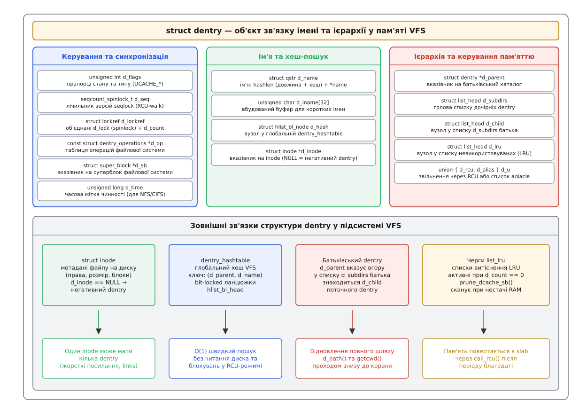
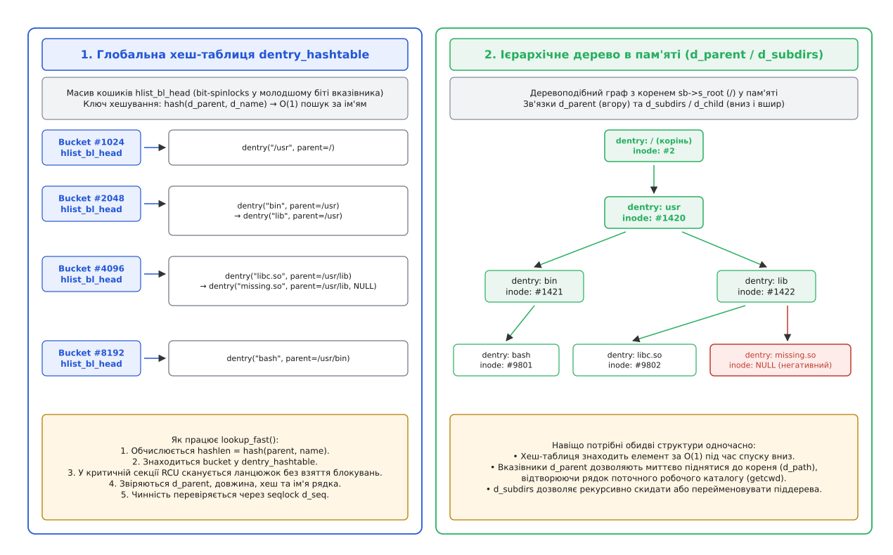
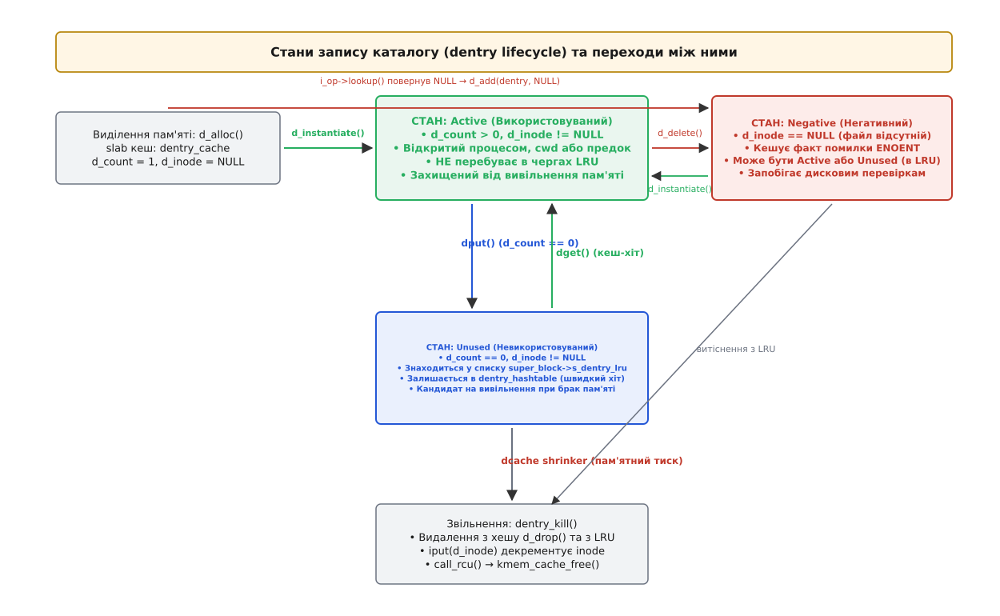
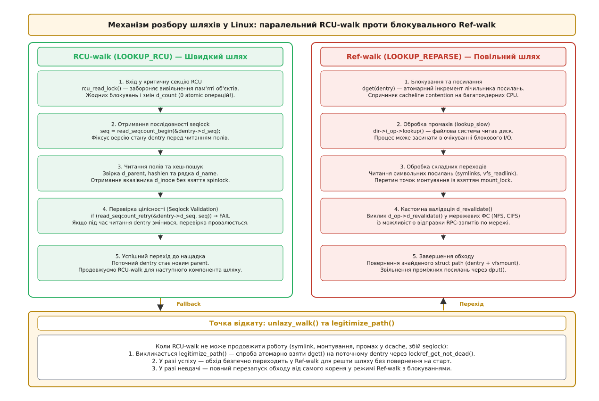
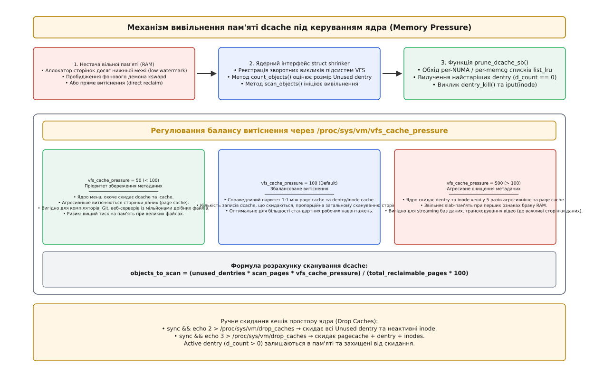

# Кеш каталогових записів (dcache): dentry, негативні записи, RCU-walk

<preknowlist>
- [VFS: спільний шар над файловими системами](topic:sys-unix/vfs-layer) — суперблок, inode, dentry та опис відкритого файлу: чому шар VFS розділений на чотири базові абстракції.
- [Inode: файл без імені](topic:sys-unix/inode-model) — метадані файлу на носії та в пам'яті: права, розмір, часові мітки та зв'язок номера inode із фізичними блоками.
- [Каталог як відображення імен](topic:sys-unix/directory-as-mapping) — внутрішня організація каталогу як таблиці «ім'я → номер inode» всередині блоків файлової системи.
- [Розбір шляху](topic:sys-unix/path-resolution) — покроковий обхід компонентів шляху від точки відліку (кореня або поточного каталогу) до шуканого файлу.
- [RCU: читання без замків і відкладене звільнення](topic:sys-unix/rcu-read-copy-update) — синхронізація Read-Copy Update: як читати структури даних без блокувань і безпечно вивільняти пам'ять через період благодаті.
- [Послідовні замки: як читати без блокування письменників](topic:sys-unix/seqlocks) — лічильник послідовності (seqlock) для виявлення паралельних модифікацій даних читачами.
</preknowlist>

Веб-сервер Nginx під навантаженням у 60 000 HTTP-запитів на секунду безперервно відкриває статичні файли, перевіряє наявність конфігурацій та звертається до сокетів. Компілятор Clang під час збирання великого проекту обробляє десятки тисяч директив `#include <vector>`, кожна з яких змушує ядро перевіряти довгі шляхи на зразок `/usr/include/c++/13/vector` або `/usr/include/x86_64-linux-gnu/c++/13/bits/c++config.h`.

Кожен такий шлях складається з чотирьох-шести окремих складових частин. Якби для кожного звернення ядро зверталося безпосередньо до носія інформації (навіть найшвидшого NVMe-накопичувача з часом затримки 15 мікросекунд), зчитувало блоки каталогів ext4 чи XFS, парсило дискові структури записів і шукало відповідні номери inode, система витрачала б 95% процесорного часу на очікування блокового введення-виведення. Ба більше: якби навіть усі блоки каталогів уже лежали в оперативній пам'яті в дисковому буферному кеші (page cache), необхідність захоплювати спільні м'ютекси каталогів та оновлювати лічильники посилань на 128-ядерному сервері призвела б до миттєвого колапсу пропускної здатності шини пам'яті через постійне переміщення кеш-ліній між процесорними сокетами (явище *cacheline bouncing*).

Для того щоб розбір шляхів виконувався за десятки наносекунд і масштабувався лінійно на будь-якій кількості ядер процесора, ядро Linux тримає в оперативній пам'яті спеціалізовану підсистему — **кеш записів каталогів**, або **dcache** (англ. *directory cache*). Розберімо до дна, як побудований цей кеш, чому ім'я файлу живе окремо від його вмісту, як працюють негативні записи і завдяки чому обхід шляху в режимі RCU-walk не бере жодного блокування.

---

## Від імені до об'єкта: чому dentry відокремлено від inode

У традиційній архітектурі Unix файл і його ім'я — це принципово різні речі. Файл як об'єкт зберігання інформації — це [inode](topic:sys-unix/inode-model) (англ. *index node* — індексний вузол): безіменна сукупність атрибутів (тип, права доступу, ідентифікатор власника, розмір, часові мітки) та покажчиків на блоки даних. Inode нічого не знає про те, як його називають користувачі, і навіть не знає, в якому каталозі він розташований.

Ім'я ж існує виключно як текстовий запис у таблиці каталогу, що пов'язує рядок символів із числовим номером inode. Один і той самий inode може мати два, три або десять різних імен у різних каталогах файлової системи завдяки механізму жорстких посилань (англ. *hard links*).

Якби шар VFS намагався кешувати шлях безпосередньо в об'єкті `struct inode`, виникли б три нерозв'язні суперечності:

1. **Неоднозначність зв'язку 1-до-N**: неможливо записати в один inode ім'я його батьківського каталогу, якщо цей файл одночасно прив'язаний як `/etc/hosts` і `/var/lib/docker/hosts`.
2. **Відсутність об'єкта для неіснуючих файлів**: якщо файлу з іменем `config.json` не існує на диску, для нього немає і не може бути структури `struct inode`. Проте кешувати сам факт відсутності життєво необхідно, інакше кожна невдала спроба відкриття файлу змушуватиме ядро щоразу сканувати диск.
3. **Неможливість навігації вгору**: маючи на руках лише inode відкритого файлу, неможливо відтворити його абсолютний канонічний шлях у дереві каталогів (наприклад, для системного виклику `getcwd` або аудиту безпеки), оскільки inode не містить покажчика на каталог, у якому його відкрили.

Тому VFS вводить самостійний проміжний об'єкт — **dentry** (структура `struct dentry`, від англ. *directory entry* — запис каталогу). Dentry є суто оперативною структурою: на дисковому носії вона не зберігається ніколи. Її призначення — закешувати в пам'яті конкретну ланку ієрархічного дерева: зв'язок між батьківським каталогом, конкретним рядком імені та знайденим inode.

> 📜 Ідея винесення записів каталогів в окремий кеш VFS з'явилася в Linux 1997 року, коли Лінус Торвальдс повністю переписав розбір шляхів для версії Linux 2.1.43, замінивши процедурний алгоритм `namei`. Про те, як dcache еволюціонував від глобального спінлока `dcache_lock` до сучасного lockless-дизайну, розповідає [Еволюція dcache: від namei та дискових блоків до lockless RCU-walk](topic:sys-unix/dentry-cache/hist-dcache-evolution.md).

---

## Анатомія `struct dentry`: поля, пам'ять та розкладка

Структура `struct dentry` визначена в ядерному заголовку `<linux/dcache.h>`. Її розмір на 64-бітних архітектурах становить рівно 192 байти, що дозволяє slab-алокатору ядра упаковувати рівно 21 об'єкт dentry у кожну 4-кілобайтну сторінку пам'яті.

Погляньмо на ключові поля цієї структури, розділені за їхнім функціональним призначенням:

```c
struct dentry {
    unsigned int d_flags;               /* Прапорці стану (DCACHE_*) */
    seqcount_spinlock_t d_seq;          /* Лічильник версій seqlock для RCU-walk */
    struct hlist_bl_node d_hash;        /* Вузол у глобальній dentry_hashtable */
    struct dentry *d_parent;            /* Покажчик на батьківський dentry */
    struct qstr d_name;                 /* Ім'я: hashlen (довжина + хеш) + *name */
    struct inode *d_inode;              /* Покажчик на inode (NULL = негативний dentry) */
    unsigned char d_iname[32];          /* Вбудований буфер коротких імен */

    struct lockref d_lockref;           /* Об'єднані d_lock (spinlock) + d_count */
    const struct dentry_operations *d_op;/* Спеціалізовані операції ФС */
    struct super_block *d_sb;           /* Суперблок файлової системи */
    unsigned long d_time;               /* Часова мітка чинності (для NFS/CIFS) */
    void *d_fsdata;                     /* Приватні дані драйвера ФС */

    union {
        struct list_head d_lru;         /* Вузол у черзі витіснення LRU */
        struct callback_head d_rcu;     /* Захист вивільнення через RCU */
    };
    struct list_head d_subdirs;         /* Голова списку дочірніх dentry */
    struct list_head d_child;           /* Вузол у списку d_subdirs батька */
    struct hlist_node d_alias;          /* Список аліасів одного inode */
} __randomize_layout;
```


*Анатомія структури dentry: внутрішні поля керування, ієрархічні зв'язки та інтеграція з хеш-таблицею, списками LRU та inode.*

Розгляньмо, як ці поля забезпечують одночасно екстремальну швидкість та безпеку паралельного доступу:

**Швидкий рядок `struct qstr` та вбудований масив `d_iname`**. Структура `struct qstr` містить покажчик на байти імені `name` та 64-бітне об'єднане поле `hashlen`. Поле `hashlen` складається з 32-бітного хешу імені та 32-бітної довжини рядка. Завдяки цьому під час пошуку в кеші ядро порівнює хеш і довжину однією процесорною інструкцією `cmp`: якщо числа не збігаються, побайтове порівняння символів рядка навіть не починається. Якщо довжина імені не перевищує 32 байти (константа `DNAME_INLINE_LEN`), символи зберігаються прямо всередині тіла `struct dentry` у масиві `d_iname`. Це повністю усуває необхідність виділяти окремий динамічний буфер пам'яті через `kmalloc` для 95% файлів у системі.

**Лічильник версій `d_seq`**. Це примітив послідовного блокування ([seqlock](topic:sys-unix/seqlocks)), призначений для читачів у режимі RCU-walk. Коли процес читає поля dentry без взяття блокувань, він фіксує число `d_seq`. Якщо в цей самий момент інше процесорне ядро змінює запис (наприклад, перейменовує файл через `rename()`), воно збільшує `d_seq` на одиницю, роблячи його непарним на час запису, і знову збільшує після завершення. Читач наприкінці звіряє `d_seq`: непарне значення або зміна числа свідчить про конфлікт даних, що змушує читача повторити спробу або вийти з безблокувального режиму.

**Атомарний замок `d_lockref`**. У ранніх версіях ядра збільшення лічильника посилань `d_count` вимагало обов'язкового захоплення спінлока `d_lock`. Лінус Торвальдс об'єднав 32-бітний `d_lock` та 32-бітний `d_count` в єдине 64-бітне слово `lockref`. Тепер операція взяття посилання (`dget`) виконується оптимістично за допомогою однієї апаратної інструкції `CMPXCHG8B` (на x86-64) без зміни стану блокування, якщо запис перебуває у стабільному стані. Спінлок `d_lock` захоплюється лише тоді, коли лічильник посилань дорівнює нулю (необхідно вилучити dentry з черги LRU), або коли кілька процесорних ядер одночасно намагаються модифікувати поля об'єкта.

### Заборона аліасів для каталогів та функція `d_splice_alias()`

Для звичайних файлів один і той самий `struct inode` може бути пов'язаний із довільною кількістю різних `struct dentry` у пам'яті (кожен hard link має власний повноцінний dentry зі своїм батьком та власним рядком імені).

Для каталогів у VFS діє суворе архітектурне обмеження: **один індексний вузол каталогу може мати рівно один `struct dentry` у пам'яті**.

Якби каталог мав два різні dentry, виникла б загроза утворення циклів у дереві імен, що призвело б до нескінченних циклів при обході файлової системи та зламало б алгоритм відновлення шляху `d_path()`. Проте в мережевих файлових системах (NFS) або при паралельних операціях перейменування каталогів (`rename()`) ядро може знайти каталог за новим шляхом раніше, ніж відкрито старий.

У таких ситуаціях VFS використовує спеціалізовану функцію `d_splice_alias()`:

1. Вона перевіряє, чи існує вже в пам'яті dentry для цього каталогу (у списку `inode->i_dentry`).
2. Якщо dentry існує (але був від'єднаний або мав іншого предка), функція атомарно перепідключає існуючий dentry до нового батьківського каталогу, оновлюючи покажчик `d_parent`.
3. Новий тимчасовий dentry знищується, а процесу повертається посилання на вже існуючий канонічний dentry.

Завдяки цьому всі процеси в системі завжди бачать єдиний спільний вузол каталогу, а деревоподібна ієрархія гарантовано залишається деревом без циклів.

### Файлові системи без урахування регістру та `d_add_ci()`

Класичні файлові системи Unix розрізняють регістр символів: `Document.txt` та `document.txt` — це два різні файли з різними номерами inode. Проте системи FAT, NTFS, а також сучасні каталоги ext4 і F2FS із увімкненим прапорцем case-insensitivity (`chattr +F`) вимагають, щоб запит до `DOCUMENT.TXT` відкривав файл `Document.txt`.

Якби VFS кешувала кожен варіант написання як окремий dentry, це призвело б до створення множинних аліасів одного файлу та розсинхронізації кешу. Для вирішення цієї проблеми використовуються спеціалізовані операції:

- Метод `d_op->d_hash`: перед обчисленням хешу імені для пошуку в `dentry_hashtable` драйвер файлової системи переводить усі літери в нижній регістр (або нормалізує рядок за таблицями Unicode Casefolding). Тому запити до `doc.txt`, `DOC.TXT` та `Doc.txt` завжди потрапляють в один і той самий кошик хеш-таблиці.
- Метод `d_op->d_compare`: виконує побайтове порівняння імен без урахування регістру.
- Функція `d_add_ci()`: якщо файл знайдено на диску під іменем `Document.txt`, а користувач запитував `document.txt`, ядро створює dentry з канонічним дисковим іменем `Document.txt` і повертає його користувачеві, запобігаючи накопиченню фальшивих дублікатів.

> 📋 Повний огляд ядерних функцій маніпуляції dcache, сигнатур методів `dentry_operations` та прапорців обходу наведено у довіднику [Інтерфейс підсистеми dcache: структури, операції та функції маніпуляції](topic:sys-unix/dentry-cache/api-dentry-kernel-api.md).

---

## Дворівнева топологія: глобальний хеш та ієрархічне дерево

Dcache організований у пам'яті ядра одночасно у вигляді двох взаємодоповнюючих структур: глобальної хеш-таблиці швидкого доступу та деревоподібного графа батьківсько-дочірніх зв'язків.

```
                    dentry_hashtable
            ┌──────────────────────────────┐
  Bucket 0  │ hlist_bl_head                │
            ├──────────────────────────────┤
  Bucket 1  │ dentry("usr") ──► dentry(...)│
            ├──────────────────────────────┤
  Bucket 2  │ hlist_bl_head                │
            ├──────────────────────────────┤
  Bucket K  │ dentry("lib") ──► dentry(...)│
            └──────────────────────────────┘
                           ▲
     Хеш-пошук:            │     Деревоподібні зв'язки:
     hash(parent, name)    │     d_parent (вгору), d_subdirs (вниз)
                           │
                 ┌──────────────────┐
                 │  dentry: / (root)│ ◄── sb->s_root
                 └─────────┬────────┘
                           │ d_subdirs
                 ┌─────────▼────────┐
                 │    dentry: usr   │
                 └─────────┬────────┘
                           │ d_subdirs
                 ┌─────────▼────────┐
                 │    dentry: lib   │
                 └──────────────────┘
```


*Дворівнева організація dcache: глобальна хеш-таблиця з бітовими замками забезпечує пошук за O(1), а вказівники d_parent та d_subdirs підтримують цілісність ієрархічного дерева.*

### 1. Глобальна хеш-таблиця `dentry_hashtable`

Коли процес звертається до файлу `/usr/lib/libc.so`, ядро розбирає шлях покроково. На кожному кроці потрібно миттєво знайти дочірній запис за відомим батьківським каталогом та рядком імені.

Для цього ядро виділяє під час завантаження глобальну хеш-таблицю `dentry_hashtable`. Її розмір обирається автоматично залежно від обсягу оперативної пам'яті (зазвичай від 2¹⁸ до 2²³ кошиків, що займає кілька мегабайтів RAM).

- **Ключ хешування**: функція хешування комбінує адресу пам'яті батьківського dentry (`d_parent`) та 32-бітне значення хешу рядка імені. Завдяки включенню покажчика `d_parent` два файли з однаковим іменем `README.txt`, розташовані в різних каталогах, потрапляють у зовсім різні кошики хеш-таблиці.
- **Кошики з бітовими блокуваннями (`hlist_bl_head`)**: замість повнорозмірного спінлока `spinlock_t` (який займає 4 або 8 байтів на кожен кошик) у таблиці застосовано механізм *bit spinlock*. Наймолодший біт самого покажчика на перший елемент списку (`hlist_bl_node`) використовується як замок блокування. Якщо біт дорівнює 1 — кошик заблокований письменником; якщо 0 — вільний. Це економить десятки мегабайтів системної пам'яті на великих серверах.

Хеш-таблиця забезпечує алгоритмічну складність пошуку `O(1)` для будь-якої складової частини шляху.

### 2. Деревоподібний граф `d_parent` / `d_subdirs`

Паралельно з хеш-таблицею кожен dentry вбудований у глобальне дерево каталожної ієрархії:

- Поле `d_parent` містить прямий покажчик на dentry каталогу верхнього рівня. Для кореневого каталогу файлової системи (`sb->s_root`) покажчик `d_parent` вказує на сам цей dentry (`root->d_parent == root`).
- Поле `d_subdirs` є головою двозв'язного циклічного списку всіх закешованих дочірніх записів поточного каталогу.
- Поле `d_child` є вузлом, за допомогою якого цей dentry включений у список `d_subdirs` свого батька.

**Чому не можна обійтися лише хеш-таблицею?** Хеш-таблиця дозволяє рухатися лише в один бік — зверху вниз за наявності рядка імені. Але ядру регулярно потрібні операції зворотної та групової навігації:

1. **Відновлення канонічного шляху (`d_path` / `getcwd`)**: ядро піднімається за покажчиками `d_parent` від листка до кореня, записуючи компоненти шляху в буфер у зворотному порядку, що займає мікросекунди без жодного звернення до диска.
2. **Каскадне вилучення піддерев (invalidating mounts & subtrees)**: при відмонтуванні файлової системи або видаленні каталогу ядро проходить по списку `d_subdirs` і рекурсивно вичищає всі дочірні записи.
3. **Перейменування каталогів (`rename`)**: переміщення цілого піддерева полягає лише в зміні покажчика `d_parent` та перенесенні вузла `d_child` з одного списку `d_subdirs` до іншого.

---

## Стани dentry: Active, Unused та черги LRU

Об'єкт dentry протягом свого перебування в пам'яті ядра проходить кілька взаємопов'язаних станів.


*Життєвий цикл dentry: виділення в пам'яті, переходи між станами Active та Unused, кешування негативних записів та остаточне вивільнення.*

Розгляньмо ці стани та умови переходів між ними:

### 1. Active (використовуваний)

Dentry перебуває в активному стані, якщо його лічильник посилань більший за нуль (`d_count > 0`). Це означає, що запис прямо зараз утримується якимось системним ресурсом:

- Він відповідає відкритому файлу (на нього вказує `struct file->f_path.dentry`);
- Він є поточним робочим каталогом якогось процесу (`current->fs->pwd`) або його коренем (`chroot`);
- На ньому змонтовано іншу файлову систему (точка монтування `mount point`);
- Він є батьківським каталогом (`d_parent`) для іншого активного dentry.

Активні dentry **не перебувають** у чергах витіснення LRU. Ядро за жодних обставин не має права звільнити пам'ять активного dentry, оскільки на нього існують прямі покажчики в процесах простору користувача або ядра.

### 2. Unused (невикористовуваний, кешований)

Коли процес закриває останній дескриптор файлу (`close()`) або виходить із каталогу, VFS викликає функцію `dput()`. Лічильник посилань декрементується. Коли `d_count` досягає `0`, пам'ять **не звільняється**.

Замість знищення dentry переводиться у стан **Unused**:

1. Запис залишається у глобальній хеш-таблиці `dentry_hashtable`.
2. Запис залишається у дереві `d_parent` / `d_subdirs`.
3. Вузол `d_lru` вставляється в кінець черги найменш нещодавно використаних елементів — `super_block->s_dentry_lru` (реалізована як шардована per-NUMA структура `list_lru`).

Якщо будь-який процес у системі знову звернеться до цього самого файлу, функція `d_lookup()` знайде dentry в хеш-таблиці, виконає `dget()`, вилучить запис зі списку LRU і миттєво поверне його в стан **Active** без жодної дискової операції.

### 3. Negative dentry (негативний запис)

Особливий стан dentry, у якому покажчик на inode дорівнює нулю (`d_inode == NULL`). Він фіксує перевірений факт того, що в батьківському каталозі файлу з таким іменем **не існує**. Негативний dentry може бути як Active (під час виконання системного виклику створення файлу), так і Unused (перебуваючи в черзі LRU).

---

## Негативні dentry: ціна та сила кешування неіснування

З усіх оптимізацій VFS кешування негативних записів дає найбільш драматичний ефект на продуктивність сучасного програмного забезпечення.

Погляньмо на те, як запускається звичайна динамічно скомпільована програма на C++ або Python. Динамічний лінкер `ld.so` шукає бібліотеку `libssl.so.3` за ланцюжком каталогів:

```sh
1. /usr/local/lib/x86_64-linux-gnu/libssl.so.3  --> ENOENT (немає)
2. /usr/local/lib64/libssl.so.3                 --> ENOENT (немає)
3. /usr/lib/x86_64-linux-gnu/libssl.so.3        --> OK (знайдено!)
```

У цьому типовому ланцюжку дві перші перевірки з трьох закінчуються невдачею. Аналогічно компілятор GCC/Clang, зустрічаючи директиву `#include <stdio.h>`, перевіряє до 15 різних каталогів заголовків (`-I/custom/include`, `-I/opt/sdk/include`, `-I/usr/include`), перш ніж знайти потрібний файл.

```
Без Negative Dcache:
  open("/usr/local/lib/libssl.so")
    └──► Промах у кеші
          └──► Зчитування блоків ext4 з SSD
                └──► Лінійне сканування екстента каталогу
                      └──► Результат: файлу немає (3.5 мкс)

З Negative Dcache:
  open("/usr/local/lib/libssl.so")
    └──► Хіт у dentry_hashtable (d_inode == NULL)
          └──► Миттєве повернення ENOENT з RAM (30 нс)  [у 100 разів швидше!]
```

Коли файлова система під час виклику `i_op->lookup` з'ясовує, що файлу на носії немає, вона викликає функцію `d_add(dentry, NULL)`. VFS розміщує створений негативний dentry в глобальній хеш-таблиці та списках LRU.

Наступний виклик `stat()` чи `open()` за тим самим шляхом знаходить dentry в хеш-таблиці за `O(1)`, бачить `d_inode == NULL` і миттєво повертає системному виклику код помилки `-ENOENT` прямо з пам'яті L1/L2 кешу процесора, не торкаючись накопичувача.

> ⚙️ Практичне вимірювання затримки звернення до наявних та відсутніх файлів за допомогою бенчмарку на C та C++, а також трасування частки RCU-walk через bpftrace розібрано у вставці [Дослідження поведінки dcache: ftrace, eBPF та вимірювання ефекту негативних dentry](topic:sys-unix/dentry-cache/proj-dcache-tracing-and-bench.md).

---

## Швидкісний обхід шляху: RCU-walk проти Ref-walk

Розбір шляху в ядрі Linux (функція `link_path_walk()` у файлі `fs/namei.c`) може виконуватися в одному з двох фундаментальних режимів: ультрашвидкому безблокувальному **RCU-walk** або традиційному блокувальному **Ref-walk**.


*Схема обходу шляхів у ядрі Linux: швидкий паралельний RCU-walk, точки відкату unlazy_walk та перехід у безпечний Ref-walk при промахах.*

### 1. Швидкий шлях: RCU-walk (`LOOKUP_RCU`)

Майже кожен системний виклик (`openat`, `statx`, `access`, `execve`) починає розбір шляху в режимі RCU-walk:

1. **Вхід у критичну секцію**: ядро викликає `rcu_read_lock()`. Це гарантує, що жоден об'єкт `dentry`, `inode` чи `vfsmount` не буде фізично вивільнений з пам'яті алокатором, навіть якщо інший процес видалить його з файлової системи під час обходу.
2. **Нуль операцій запису в пам'ять**: лічильник посилань `d_count` **не змінюється** (жодних `dget()` чи `dput()`). Спінлоки не захоплюються. Усі ядра процесора одночасно читають спільні структури dcache зі своїх локальних L1/L2/L3 кешів.
3. **Seqlock-валідація кожного кроку**:
   - Перед читанням дочірнього dentry процес зчитує лічильник версій батька: `seq = read_seqcount_begin(&dentry->d_seq)`.
   - Процес знаходить у хеш-таблиці нащадка за `(dentry, name)`.
   - Процес перевіряє чинність: `read_seqcount_retry(&dentry->d_seq, seq)`. Якщо значення змінилося (паралельний `rename` або `unlink`), RCU-обхід фіксує неконсистентність і ініціює відкат.
4. **Перехід до наступної ланки**: якщо перевірка успішна, знайдений dentry стає новим батьківським каталогом, і цикл повторюється для наступного імені в рядку шляху.

Завдяки RCU-walk мільйони паралельних операцій читання метаданих на різних ядрах не створюють жодного взаємного блокування.

### 2. Точки відкату: `unlazy_walk()` та `legitimize_path()`

RCU-walk не може вирішити всі ситуації самостійно. Існують випадки, коли безблокувальний обхід зобов'язаний зупинитися:

- **Промах у кеші (dcache miss)**: запис відсутній у dcache, необхідно викликати блокувальний метод драйвера файлової системи `dir->i_op->lookup()`, що засинає в очікуванні блокового I/O.
- **Символьне посилання (symlink)**: вміст посилання треба зчитати з диска або виділити під нього буфер в пам'яті (`kmalloc`), що заборонено всередині критичної секції RCU.
- **Складні точки монтування**: перетин межі файлової системи, що вимагає блокування простору імен `mount_lock`.
- **Кастомний `d_revalidate`**: мережева файлова система (NFS/CIFS) повертає спеціальний код `-ECHILD`, повідомляючи, що актуальність файлу неможливо перевірити без відправки RPC-пакета по мережі.
- **Конфлікт seqlock**: під час читання dentry інший процес змінив запис.

Коли виникає будь-яка з цих подій, ядро викликає процедуру `unlazy_walk()`:

```c
/* Спроба перевести шлях з RCU-walk у звичайне володіння посиланнями */
static int unlazy_walk(struct nameidata *nd, struct dentry *dentry, unsigned seq)
{
    struct mount *mnt = nd->path.mnt;

    /* 1. Атомарно збільшуємо лічильники посилань mnt та dentry */
    if (!legitimize_path(nd, &nd->path, seq))
        goto out_drop;

    /* 2. Виходимо з критичної секції RCU */
    rcu_read_unlock();
    return 0;

out_drop:
    rcu_read_unlock();
    return -ECHILD; /* Збій: перезапустити весь обхід у Ref-walk від самого початку */
}
```

Функція `legitimize_path()` використовує атомарну інструкцію `lockref_get_not_dead()` для інкременту `d_count`. Якщо запис не встигли знищити, RCU-walk плавно перетворюється на Ref-walk для залишку шляху. Якщо ж `legitimize_path()` зазнала невдачі, ядро повністю перезапускає обхід рядка шляху від початкової точки в режимі Ref-walk.

### 3. Повільний шлях: Ref-walk

У режимі Ref-walk ядро діє консервативно:

- Кожен крок інкрементує лічильник посилань `dget()`;
- Дозволено захоплення блокувань (`inode_lock`, `d_lock`);
- Дозволено засинання процесу в очікуванні читання з накопичувача;
- Після завершення обходу всі проміжні посилання звільняються через `dput()`.

---

## Вивільнення пам'яті: Shrinker, NUMA per-node LRU та `vfs_cache_pressure`

Оскільки dcache постійно наповнюється новими dentry під час відкриття файлів, він здатен безконтрольно зростати, займаючи всю вільну оперативну пам'ять сервера. На відміну від сторінкового кешу даних (page cache), пам'ять dentry виділяється не сторінками, а дрібними структурами через slab-алокатор (`kmem_cache`).


*Механізм вивільнення пам'яті dcache під керуванням ядра: взаємодія kswapd, інтерфейсу shrinker та вплив sysctl vfs_cache_pressure.*

### Робота dcache shrinker

Коли рівень вільної пам'яті падає нижче мінімального порогу (low watermark), підсистема керування пам'яттю ядра пробуджує фонового демона `kswapd` або ініціює пряме витіснення (direct reclaim).

Для вивільнення структур VFS використовується механізм **shrinker** (структура `struct shrinker`):

1. **Оцінка резерву**: ядро опитує метод `super_block->s_shrink.count_objects()`, який підраховує загальну кількість записів у стані Unused у списках `s_dentry_lru`.
2. **Сканування LRU**: метод `scan_objects()` викликає функцію `prune_dcache_sb()`. Вона бере найстаріші записи з початку черги `list_lru` відповідного суперблоку та NUMA-вузла.
3. **Знищення запису (`dentry_kill`)**:
   - Dentry вилучається з глобальної хеш-таблиці (`d_drop`);
   - Від'єднується від списку дочірніх елементів батька `d_subdirs`;
   - Викликається `iput(d_inode)`, що зменшує лічильник посилань inode і, якщо це було останнє посилання, ініціює вивільнення самого inode;
   - Пам'ять dentry повертається в slab-кеш `dentry_cache` через виклик `call_rcu()`, гарантуючи, що жоден паралельний RCU-читач не постраждає.

### Регулювання через `/proc/sys/vm/vfs_cache_pressure`

Параметр ядра `vfs_cache_pressure` визначає, наскільки агресивно ядро повинно витісняти кеші метаданих (dcache та icache) порівняно зі сторінками пам'яті даних файлів (page cache) та анонімною пам'яттю процесів (swap).

Кількість об'єктів dcache, що підлягають вилученню за один прохід, обчислюється за формулою:

```
scan_dentry = (unused_dentries · scan_pages · vfs_cache_pressure) ÷ (total_reclaimable_pages · 100)
```

- **Значення за замовчуванням (`100`)**: справедливий паритет 1:1. Кеш записів каталогів витісняється з тією самою інтенсивністю, що й сторінки файлових даних.
- **Знижене значення (`< 100`, наприклад `50`)**: ядро віддає перевагу збереженню метаданих dentry та inode в оперативній пам'яті, агресивніше скидаючи сторінки даних і витісняючи програми у swap. Це вигідно для систем збирання проектів, Git-серверів та високонавантажених веб-серверів із мільйонами дрібних файлів.
- **Підвищене значення (`> 100`, наприклад `500`)**: ядро агресивно скидає dcache при перших ознаках браку пам'яті, звільняючи slab-структури. Це корисно на серверах потокового відео або базах даних із великим пулом буферів (PostgreSQL/MySQL), де оперативна пам'ять повинна належати сторінкам даних.
- **Значення `0`**: повна заборона скидання dcache/icache через брак пам'яті (може легко спровокувати аварійну зупинку системи Out-Of-Memory).

### Ручне примусове скидання кешу

Для тестування продуктивності з холодним кешем адміністратор може скинути невикористовувані dentry вручну:

```sh
# 1. Скидаємо брудні дані з пам'яті на диск
$ sync

# 2. Звільняємо всі Unused dentry та inode кеші
$ echo 2 | sudo tee /proc/sys/vm/drop_caches

# 3. Або звільняємо одночасно page cache, dentry та inode
$ echo 3 | sudo tee /proc/sys/vm/drop_caches
```

> [!NOTE]
> Запис у `drop_caches` звільняє **лише** ті dentry, які мають `d_count == 0` (перебувають у списках Unused LRU). Жоден активний файл чи каталог, відкритий будь-яким процесом, не постраждає і не буде скинутий з пам'яті.

---

> 🔧 **Навіщо це на практиці.**
> 
> 1. **Діагностика витоків slab-пам'яті в контейнерах (Docker/K8s)**. Якщо на сервері з сотнями контейнерів споживання пам'яті не падає навіть після закриття додатків, перевірте `/proc/sys/fs/dentry-state` та `slabtop`. Сотні тисяч невикористовуваних точок монтування та видалених тимчасових файлів утримують записи dentry у per-memcg списках LRU.
> 2. **Прискорення компіляції та CI/CD пайплайнів**. Зменшення `sysctl vm.vfs_cache_pressure=50` на складальних серверах утримує сотні тисяч позитивних і негативних dentry заголовних файлів у пам'яті RAM між запусками компілятора, скорочуючи загальний час збирання великих C++/Rust проектів на 15–30%.
> 3. **Захист від атак вичерпання ресурсів (Negative Dentry DoS)**. Якщо веб-додаток приймає від клієнтів шляхи та перевіряє їх через `stat()`, обмежуйте пам'ять процесу через cgroups v2 (`memory.max`). Це ізолює розростання dcache у межах контрольної групи зловмисника і захищає загальносистемний dcache від переповнення.

---

## Синтез

Кеш записів каталогів (dcache) перетворює дискретні дискові операції пошуку імен на надшвидкий граф у пам'яті ядра. Розділення понять dentry та inode забезпечує природну підтримку жорстких посилань, дозволяє миттєво генерувати шляхи вгору до кореня і уможливлює кешування відсутності файлів через негативні dentry. Поєднання глобальної хеш-таблиці з бітовими замками та механізму RCU-walk перетворює розбір шляхів у Linux на lockless-алгоритм, що виконується за десятки наносекунд і масштабується без конфліктів шини пам'яті на сучасних багатоядерних процесорах.
