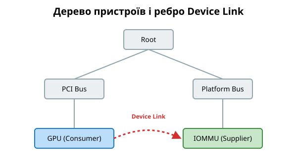

# Device Links: явне ребро «постачальник — споживач» поверх дерева

<preknowlist>
- [Модель пристроїв у sysfs](topic:sys-unix/sysfs-device-model) — ядро тримає пристрої деревом «батько — дитина», і це дерево видно в sysfs.
- [Прив'язка драйвера до пристрою](topic:sys-unix/driver-probe-and-binding) — драйвер прив'язується до пристрою через `probe` і відв'язується (unbind) при вивантаженні.
- [Присипляння пристрою на ходу: runtime PM](topic:sys-unix/runtime-power-management) — ядро само знімає живлення з пристрою, поки той не потрібен, за лічильником звертань.
- [Призупинення й пробудження](topic:sf-os/suspend-and-resume) — при засинанні всієї системи ядро проходить пристрої в певному порядку, а при пробудженні — у зворотному.
</preknowlist>

Класична ієрархія пристроїв Linux — це строго дерево (parent-child). Шина (наприклад, PCI чи I2C) виступає батьком для підключених до неї пристроїв. Це дерево визначає базовий порядок ініціалізації (`probe`), зупинки (`suspend`), відновлення (`resume`) та вивантаження. Батьківський пристрій повинен бути ініціалізований до дочірнього і не може бути приспаний, поки працює дочірній. 

Що робити, якщо графічному процесору потрібен IOMMU для DMA або регулятор напруги (regulator), який фізично лежить у зовсім іншій гілці дерева? У такому разі батьківсько-дочірній зв'язок не відображає реальної апаратної залежності. Споживачу (consumer) потрібен постачальник (supplier), але ядро про це не знає. Якщо постачальник вимкне живлення або вивантажить свій драйвер, споживач зазнає краху. 

Щоб вирішити цю проблему, в ядрі Linux з'явився механізм **Device Links** (зв'язки між пристроями). Він дозволяє явно вказати залежності між довільними пристроями, формуючи орієнтований граф поверх існуючого дерева. 

Зв'язок завжди має два кінці:
*   **Supplier (постачальник):** Пристрій, що надає ресурс (наприклад, IOMMU, регулятор напруги, clock).
*   **Consumer (споживач):** Пристрій, що використовує цей ресурс.

Коли створюється зв'язок, ядро починає враховувати його при керуванні живленням та життєвим циклом драйверів.

## Прапорці станів

Поведінка зв'язку керується набором прапорців:
*   `DL_FLAG_STATELESS`: Зв'язок не управляє порядком `probe`/`remove`. Він використовується лише для керування живленням — і прибирає його той, хто створив, а не ядро.
*   `DL_FLAG_AUTOREMOVE_CONSUMER`: Сам зв'язок автоматично видаляється, коли споживач не пройшов `probe` або згодом відв'язався (unbind), — прибирати його вручну не треба.
*   `DL_FLAG_PM_RUNTIME`: Зв'язок враховується під час Runtime PM. Постачальник не може перейти в стан низького енергоспоживання, поки споживач активний.

## Як Device Links впливають на систему

### Порядок знімання/подачі живлення (Runtime PM / System Suspend)
Ядро гарантує, що при переході системи в сплячий режим (suspend), споживач буде приспаний **перед** постачальником. При виході зі сну (resume), постачальник буде пробуджений **перед** споживачем. 
У випадку Runtime PM, якщо пристрій-споживач активний, ядро не дозволить постачальнику перейти в режим зниженого енергоспоживання (suspend). Пробудження споживача автоматично ініціює пробудження постачальника.

### Вивантаження драйверів та ініціалізація (Probe)
Якщо зв'язок не є stateless, ядро взагалі не викличе `probe` споживача, поки постачальник не пройшов свій `probe`: driver core звіряє постачальників перед прив'язкою і одразу повертає `-EPROBE_DEFER`. Крім того, при спробі вивантажити драйвер постачальника, споживач буде зупинений (unbind) першим, що запобігає паніці ядра від доступу до звільнених ресурсів.

## Графічна схема



На цій схемі `GPU` є дочірнім пристроєм для `PCI Bus`, а `IOMMU` — для `Platform Bus`. Вони лежать у різних гілках дерева. Однак `GPU` залежить від `IOMMU`. Ребро "Device Link" гарантує, що `IOMMU` буде активним, поки активний `GPU`.

## Функції API

Створюють зв'язок завжди через `device_link_add()`. А от видаляють руками лише **stateless**-зв'язки: для них є `device_link_del()` (за вказівником на зв'язок) і `device_link_remove()` (за парою «споживач — постачальник»). Керований зв'язок — тобто будь-який, створений без `DL_FLAG_STATELESS`, — прибирає сам driver core за прапорцями `DL_FLAG_AUTOREMOVE_*`; спроба видалити його вручну дає `WARN` у `device_link_put_kref()` (`drivers/base/core.c`).

```c
struct device_link *device_link_add(struct device *consumer,
                                    struct device *supplier,
                                    u32 flags);

/* лише для stateless-зв'язків */
void device_link_del(struct device_link *link);
void device_link_remove(void *consumer, struct device *supplier);
```

Повний перелік прапорців — у вставці [Прапорці Device Links](topic:sys-unix/device-links/api-device-link-flags.md); робочий приклад драйвера — [Приклад створення зв'язку](topic:sys-unix/device-links/proj-device-link-example.md).
