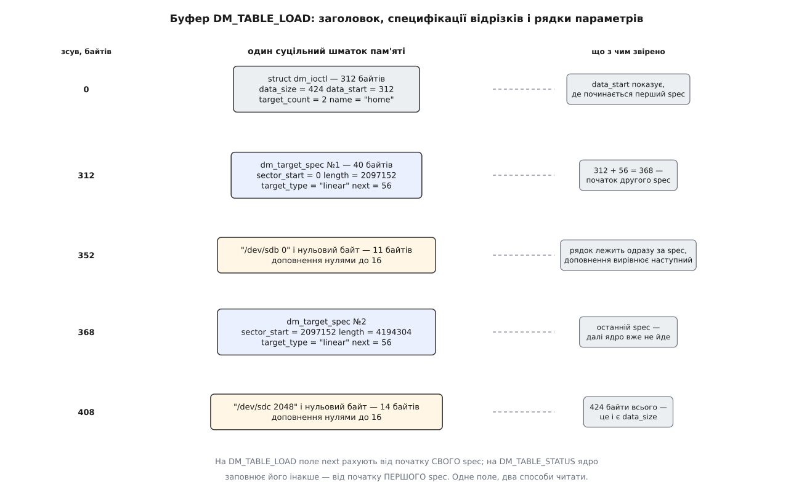

# 📋 Таблиця, команди й керуючий канал device mapper

Точна граматика рядка таблиці, аргументи найуживаніших цілей, набір команд `dmsetup` і коди ioctl на `/dev/mapper/control` — те, що потрібно, щоб скласти пристрій руками, прочитати чужий вивід `dmsetup table` або написати програму, яка обходиться без `libdevmapper`. Звірено з `include/uapi/linux/dm-ioctl.h`, драйверами в `drivers/md/` і документацією ядра `admin-guide/device-mapper/`.

## Граматика рядка

```
<перший сектор> <довжина> <тип цілі> [<аргументи цілі> …]
```

Поля розділені пропусками, один рядок описує один відрізок. Обидва числа — у **секторах по 512 байтів**, і ця одиниця стала: [блоковий шар](root:sys-unix/block-device-model) нумерує саме в ній незалежно від того, якими блоками оперує залізо. Носій із фізичним сектором 4096 байтів усе одно описується таблицею в 512-байтових одиницях, і `2048` в ній завжди означає рівно 1 МіБ.

Три вимоги до набору рядків перевіряє ядро під час завантаження, і кожна дає `EINVAL`:

```
перший рядок починається з сектора 0
кожен наступний  <перший сектор>  =  <перший сектор> + <довжина> попереднього
звідси: рядки впорядковані, суміжні, без проміжків і без перекриття
```

Розмір пристрою — просто сума довжин; іншої геометрії в нього немає. Пристрій із порожньою таблицею (нуль рядків) законний і має розмір 0 — саме таким він існує між створенням і першим завантаженням таблиці.

`dmsetup` бере таблицю з `--table '…'` (кілька рядків — через переводи всередині лапок), з файлу, поданого аргументом, або зі стандартного входу.

## Аргументи цілей

| ціль | аргументи | одиниці й застереження |
| --- | --- | --- |
| `linear` | `<пристрій> <зсув>` | зсув — сектор на пристрої-призначенні |
| `striped` | `<к-сть смуг> <розмір шматка> <пристрій> <зсув> [<пристрій> <зсув>]…` | шматок у секторах, степінь двійки, не менший за сторінку пам'яті; довжина відрізка мусить бути кратна добуткові «шматок × к-сть смуг» |
| `crypt` | `<шифр> <ключ> <зсув IV> <пристрій> <зсув> [<к-сть опцій> <опції>…]` | шифр записують як `<алгоритм>-<режим зчеплення>-<режим IV>[:<опції IV>]`, напр. `aes-xts-plain64`; ключ — шістнадцятковий рядок або `:<довжина>:<тип>:<опис>`, коли ключ береться зі [зв'язки ключів ядра](root:sys-unix/dm-crypt) |
| `snapshot-origin` | `<оригінал>` | більше нічого: уся робота — у парному пристрої `snapshot` |
| `snapshot` | `<оригінал> <пристрій COW> <P / N / PO> <розмір шматка> [<к-сть опцій> <опції>…]` | третій аргумент — одна літера з трьох: `P` — сховище змін переживає перезавантаження, `N` — ні, `PO` — те саме, що `P`, але з підтримкою переповнення; шматок у секторах |
| `snapshot-merge` | те саме, що `snapshot` | вливає відкладені зміни назад в оригінал |
| `thin-pool` | `<пристрій метаданих> <пристрій даних> <розмір блока даних> <нижня позначка> [<к-сть опцій> <опції>…]` | блок у секторах; позначка — у блоках, після неї ядро шле подію «місце кінчається» |
| `thin` | `<пул> <номер тому в пулі> [<зовнішній оригінал>]` | сам том у таблиці пулу не описаний — його заводять повідомленням |
| `verity` | `<версія> <дані> <хеші> <блок даних> <блок хешу> <к-сть блоків даних> <перший блок хешу> <алгоритм> <кореневий хеш> <сіль>` `[<к-сть опцій> <опції>…]` | тут розміри блоків **у байтах**, не в секторах; хеш і сіль — шістнадцятково; докладніше — [dm-verity](root:sys-unix/dm-verity) |
| `error` | немає | будь-який запит завершується помилкою |
| `zero` | немає | читання дає нулі, запис мовчки зникає |
| `delay` | `<пристрій> <зсув> <затримка>` — або 6 аргументів (окремі пристрій, зсув і затримка для запису), або 9 (ще й окремо для скидання кешу) | затримки в **мілісекундах**, зсуви в секторах |
| `flakey` | `<пристрій> <зсув> <інтервал справності> <інтервал збою> [<к-сть опцій> <опції>…]` | інтервали в **секундах**; опції задають характер збою: `error_reads`, `drop_writes`, `error_writes`, `corrupt_bio_byte`, `random_read_corrupt` |

Чотири закономірності, спільні для всього набору.

**Пристрій пишуть шляхом або парою чисел.** `/dev/sdb` і `8:16` — те саме; ядро в обох випадках зводить аргумент до [старшого й молодшого номерів](root:sys-unix/major-minor-numbers). Числову форму вживають LVM та initramfs, бо в момент складання стека потрібного імені в `/dev` може ще не бути.

**Хвіст `[<к-сть опцій> <опції>…]` — спосіб розширювати ціль, не ламаючи старі таблиці.** Спершу число, потім рівно стільки слів. Ядро, яке не знає опції, відмовляє з `EINVAL`, а не мовчки її ковтає, — тож несумісність видно одразу, а не через тиждень.

**Одиниці не однакові.** Сектори майже скрізь, байти у `verity`, мілісекунди в `delay`, секунди в `flakey`. Це не недогляд: ці параметри міряють різні речі.

**Ключі й хеші в таблиці лежать відкритим текстом.** Саме тому вивід `dmsetup table` для `crypt` за замовчуванням підмінює ключ нулями, а ядро вміє затирати буфер ioctl після операції (прапорець `DM_SECURE_DATA_FLAG`).

## Команди dmsetup

| команда | що робить | ключі |
| --- | --- | --- |
| `dmsetup create <ім'я>` | створює пристрій, завантажує таблицю й одразу поновлює його — три ioctl за раз | `--table '<рядки>'` або файл-аргумент · `-u <uuid>` · `--notable` (створити порожнім) |
| `dmsetup load <ім'я>` (те саме — `reload`) | завантажує таблицю як **неактивну**; живою вона не стає | `--table` або файл |
| `dmsetup suspend <ім'я>` | нові запити стають у чергу, ті, що в польоті, каркас дочікує | `--nolockfs` (не просити ФС завмерти) · `--noflush` (не дочікувати запитів у польоті) |
| `dmsetup resume <ім'я>` | неактивна таблиця стає живою, черга відпускається | `--noudevsync` |
| `dmsetup table [<ім'я>]` | віддає таблицю, з якої пристрій можна зібрати наново | `--target <тип>` · `--showkeys` (не ховати ключі шифру) · `--concise` |
| `dmsetup status [<ім'я>]` | віддає рядок стану, який формує сама ціль | `--target <тип>` · `--noflush` |
| `dmsetup info [<ім'я>]` | стан пристрою: `ACTIVE`/`SUSPENDED`, наявність живої й неактивної таблиць, лічильник відкриттів, номер події, пара номерів, UUID | `-c -o <поля>` для машинного виводу |
| `dmsetup ls` | перелік пристроїв | `--tree` (стек із залежностями) · `--target <тип>` |
| `dmsetup deps <ім'я>` | на яких пристроях цей стоїть, парами номерів | |
| `dmsetup remove <ім'я>` | прибирає пристрій | `-f` · `--retry` · `--deferred` (прибрати, щойно його закриє останній) |
| `dmsetup message <ім'я> <сектор> <текст>` | передає команду живій цілі, не чіпаючи таблиці | сектор — 0, якщо ціль одна |
| `dmsetup wipe_table <ім'я>` | підміняє таблицю на `error` того самого розміру | `-f` · `--noflush` |
| `dmsetup targets` | які цілі є в цьому ядрі та їхні версії | |

`message` — окремий канал до цілі, і саме ним живуть тонкі томи: `create_thin <номер>` заводить том у пулі, `create_snap <номер> <номер оригіналу>` робить із нього знімок, `delete <номер>` прибирає. Пристрій `thin` після цього лише вказує на вже наявний том за номером — тому таблиця тонкого тому така коротка.

> 🔧 **Навіщо це.** `--nolockfs` виглядає як спосіб пришвидшити призупинення, і формально так і є: без нього інструмент просить файлову систему [завмерти](root:sys-unix/filesystem-freeze) — скинути брудне й припинити нові зміни. Але саме це замерзання й робить знімок придатним. Знімок, зроблений із `--nolockfs`, ловить файлову систему посеред операції; вона змонтується, але спершу програватиме журнал. Ключ доречний рівно там, де узгодженість забезпечено інакше, — наприклад, коли ФС на цьому пристрої зараз ніхто не змонтував.

## Форми рядків status

`table` і `status` — різні речі під схожими назвами. Перше повертає той самий опис, з якого пристрій зібрано; друге — те, що ціль знає про себе **зараз**, і формат цього рядка визначає сама ціль. У багатьох цілей він порожній: нічого змінного в них немає.

| ціль | рядок status | як читати |
| --- | --- | --- |
| `linear`, `crypt`, `snapshot-origin` | порожній | стану немає — усе видно з таблиці |
| `striped` | `<к-сть смуг> <пристрій>… 1 <AADA…>` | одиниця тут — літерал «далі рівно одне слово»; у тому слові по літері на смугу: `A` — жива, `D` — на ній уже були помилки |
| `snapshot` | `<виділено секторів>/<усього> <секторів метаданих>` | заповненість сховища змін; замість чисел може стояти `Invalid`, `Merge failed` або `Overflow` |
| `thin-pool` | `<номер транзакції> <ужито>/<усього метаданих> <ужито>/<усього даних> <корінь знімка метаданих>`, далі чотири слова стану: `ro` / `rw` / `out_of_data_space` · `discard_passdown` / `no_discard_passdown` · `error_if_no_space` / `queue_if_no_space` · `needs_check` або `-`, і насамкінець `<нижня позначка>` | найінформативніший рядок у всьому наборі; `needs_check` означає, що пул треба перевірити `thin_check` |
| `thin` | `<відображено секторів> <найвищий відображений сектор>` | або одне слово `Fail`, якщо пул під ним відмовив |
| `verity` | одна літера — `V` або `C` | `V` — жодного розходження з деревом на всьому, що досі читали; `C` — пошкодження вже траплялося |

Числа для `thin-pool` подані **в блоках пулу**, а не в секторах: щоб дістати з них сектори, множать на `<розмір блока даних>` із таблиці того самого пулу. У `snapshot`, навпаки, все відразу в секторах.

## Керуючий канал

Жодної операції з пристроями не виражено ані читанням, ані записом файлу. Усе йде [окремим викликом](root:sys-unix/ioctl-interface) на символьному файлі `/dev/mapper/control` — це misc-пристрій із номерами `10:236`, той самий на будь-якій машині.

Усі команди беруть аргумент одного типу й оголошені за одним зразком:

```c
#define DM_IOCTL 0xfd
#define DM_DEV_CREATE   _IOWR(DM_IOCTL, DM_DEV_CREATE_CMD,   struct dm_ioctl)
#define DM_TABLE_LOAD   _IOWR(DM_IOCTL, DM_TABLE_LOAD_CMD,   struct dm_ioctl)
#define DM_DEV_SUSPEND  _IOWR(DM_IOCTL, DM_DEV_SUSPEND_CMD,  struct dm_ioctl)
#define DM_TABLE_STATUS _IOWR(DM_IOCTL, DM_TABLE_STATUS_CMD, struct dm_ioctl)
#define DM_TARGET_MSG   _IOWR(DM_IOCTL, DM_TARGET_MSG_CMD,   struct dm_ioctl)

struct dm_ioctl {
        __u32 version[3];      /* заповнює програма; ядро вписує свою й повертає */
        __u32 data_size;       /* увесь буфер разом із цією структурою */
        __u32 data_start;      /* де починається корисне навантаження */
        __u32 target_count;    /* скільки рядків таблиці далі */
        __s32 open_count;      /* ← ядро: скільки разів пристрій відкрито */
        __u32 flags;
        __u32 event_nr;        /* номер події або cookie для udev */
        __u32 padding;
        __u64 dev;             /* пара номерів, спакована в 64 біти */
        char  name[DM_NAME_LEN];   /* 128 */
        char  uuid[DM_UUID_LEN];   /* 129 */
        char  data[7];             /* вирівнювання; sizeof — 312 */
};
```

| код | номер | що робить |
| --- | --- | --- |
| `DM_VERSION` | 0 | звірити версію протоколу |
| `DM_LIST_DEVICES` | 2 | перелік усіх пристроїв |
| `DM_DEV_CREATE` | 3 | створити порожній пристрій |
| `DM_DEV_REMOVE` | 4 | прибрати |
| `DM_DEV_RENAME` | 5 | перейменувати (UUID при цьому не змінюється) |
| `DM_DEV_SUSPEND` | 6 | призупинити **або** поновити — вирішує прапорець |
| `DM_DEV_STATUS` | 7 | стан пристрою без таблиці |
| `DM_DEV_WAIT` | 8 | заснути до наступної події від цілі |
| `DM_TABLE_LOAD` | 9 | завантажити неактивну таблицю |
| `DM_TABLE_CLEAR` | 10 | викинути неактивну таблицю |
| `DM_TABLE_DEPS` | 11 | на яких пристроях стоїть цей |
| `DM_TABLE_STATUS` | 12 | віддати рядки status **або** таблицю — вирішує прапорець |
| `DM_LIST_VERSIONS` | 13 | які цілі є та їхні версії |
| `DM_TARGET_MSG` | 14 | повідомлення живій цілі |

Два коди в цьому переліку роблять по дві протилежні речі, і вибір — за прапорцем. `DM_DEV_SUSPEND` із виставленим `DM_SUSPEND_FLAG` призупиняє, з опущеним — поновлює; `DM_TABLE_STATUS` із `DM_STATUS_TABLE_FLAG` віддає таблицю, без нього — рядки стану. Тому в `strace` призупинення не відрізнити від поновлення, а запит таблиці — від запиту стану: номер команди однаковий, різниця сидить усередині `flags`.

| прапорець | значення | напрям |
| --- | --- | --- |
| `DM_READONLY_FLAG` | 1 << 0 | пристрій лише для читання |
| `DM_SUSPEND_FLAG` | 1 << 1 | призупинити (на вході), призупинений (на виході) |
| `DM_PERSISTENT_DEV_FLAG` | 1 << 3 | узяти молодший номер саме з поля `dev` |
| `DM_STATUS_TABLE_FLAG` | 1 << 4 | віддати таблицю замість стану |
| `DM_ACTIVE_PRESENT_FLAG` | 1 << 5 | ← жива таблиця є |
| `DM_INACTIVE_PRESENT_FLAG` | 1 << 6 | ← неактивна таблиця є |
| `DM_BUFFER_FULL_FLAG` | 1 << 8 | ← відповідь не вмістилася: повторити з більшим буфером |
| `DM_SKIP_LOCKFS_FLAG` | 1 << 10 | не просити файлову систему завмерти (`--nolockfs`) |
| `DM_NOFLUSH_FLAG` | 1 << 11 | не дочікувати запити в польоті (`--noflush`) |
| `DM_QUERY_INACTIVE_TABLE_FLAG` | 1 << 12 | питати про неактивну таблицю, а не про живу |
| `DM_UUID_FLAG` | 1 << 14 | шукати пристрій за UUID |
| `DM_SECURE_DATA_FLAG` | 1 << 15 | затерти буфер після операції (для таблиць із ключами) |
| `DM_DEFERRED_REMOVE` | 1 << 17 | прибрати, щойно закриється останній користувач |

Пристрій має **три** посвідчення, і ядро шукає його за першим, яке подали: `dev`, потім `uuid`, потім `name`. UUID тут не має нічого спільного з UUID файлової системи — це довільний рядок до 128 символів, який простір користувача призначає під час створення й більше не міняє. LVM пише туди `LVM-<uuid групи><uuid тому>`, cryptsetup — `CRYPT-LUKS2-<uuid тому>-<ім'я>`. Сенс у тому, що пристрій можна перейменувати, а UUID перейменування переживає, — тож правила [udev](root:sys-unix/udev-rules) і сам LVM упізнають свої пристрої саме за ним, а не за іменем у `/dev/mapper/…`.

## Розкладка буфера

Аргумент ioctl — **один суцільний шматок пам'яті**: заголовок на початку, корисне навантаження одразу за ним. Для `DM_TABLE_LOAD` навантаження — це ланцюжок із `target_count` пар «специфікація відрізка плюс рядок параметрів»:

```c
struct dm_target_spec {
        __u64 sector_start;
        __u64 length;
        __s32 status;                     /* лише на читанні з ядра */
        __u32 next;                       /* де наступний spec */
        char  target_type[16];            /* "linear", "crypt", … */
        /* далі одразу — рядок параметрів із нульовим байтом і доповненням */
};
```



*Доповнення нулями після рядка потрібне не для краси: наступна структура починається з 64-бітових полів і мусить лягти на кратну восьми адресу.*

Поле `next` має асиметрію, на якій легко спіткнутися. На `DM_TABLE_LOAD` воно рахується **від початку свого ж** `dm_target_spec`; на `DM_TABLE_STATUS` ядро заповнює його **від початку першого** `spec`. Одне поле, два способи читати — і програма, що розбирає відповідь тією самою функцією, якою складала запит, працюватиме рівно доти, доки відрізок у таблиці один. Другий відрізок зсуне їй усе.

## Мінімальний робочий виклик

```c
#include <fcntl.h>
#include <stdio.h>
#include <string.h>
#include <sys/ioctl.h>
#include <unistd.h>
#include <linux/dm-ioctl.h>

static char buf[16 * 1024];

static struct dm_ioctl *hdr(const char *name)
{
        struct dm_ioctl *p = (struct dm_ioctl *) buf;

        memset(buf, 0, sizeof buf);
        p->version[0] = DM_VERSION_MAJOR;   /* ядро впише свою й поверне */
        p->version[1] = DM_VERSION_MINOR;
        p->version[2] = DM_VERSION_PATCHLEVEL;
        p->data_size  = sizeof buf;
        p->data_start = sizeof *p;          /* 312 — уже кратне восьми */
        strncpy(p->name, name, DM_NAME_LEN - 1);
        return p;
}

int main(void)
{
        int fd = open("/dev/mapper/control", O_RDWR);
        if (fd < 0) { perror("open"); return 1; }

        /* 1. порожній пристрій: з'являється /dev/dm-N зі своєю парою номерів */
        if (ioctl(fd, DM_DEV_CREATE, hdr("demo")) < 0) { perror("CREATE"); return 1; }

        /* 2. таблиця з одного відрізка — лягає НЕАКТИВНОЮ */
        struct dm_ioctl *p = hdr("demo");
        p->target_count = 1;

        struct dm_target_spec *ts = (struct dm_target_spec *) (buf + p->data_start);
        ts->sector_start = 0;
        ts->length       = 2048;                       /* 1 МіБ у секторах по 512 */
        strcpy(ts->target_type, "linear");

        char *args = (char *) (ts + 1);
        strcpy(args, "/dev/loop0 0");
        unsigned n = strlen(args) + 1;      /* разом із нульовим байтом */
        n = (n + 7) & ~7u;                  /* доповнення до кратності восьми */
        ts->next     = sizeof *ts + n;
        p->data_size = p->data_start + ts->next;

        if (ioctl(fd, DM_TABLE_LOAD, p) < 0) { perror("LOAD"); return 1; }

        /* 3. поновлення: DM_SUSPEND_FLAG ЗНЯТО — неактивна таблиця стає живою */
        if (ioctl(fd, DM_DEV_SUSPEND, hdr("demo")) < 0) { perror("RESUME"); return 1; }

        close(fd);
        return 0;
}
```

Ці три виклики — рівно те, що робить `dmsetup create demo --table '0 2048 linear /dev/loop0 0'`, за одним винятком: `dmsetup` ще й узгоджується з udev через `event_nr`, тож на момент повернення керування символьне посилання `/dev/mapper/demo` уже існує. Програма вище повертається раніше, ніж udev відпрацює подію, — тому одразу після неї надійно є лише `/dev/dm-N`, а не ім'я в `/dev/mapper`.
