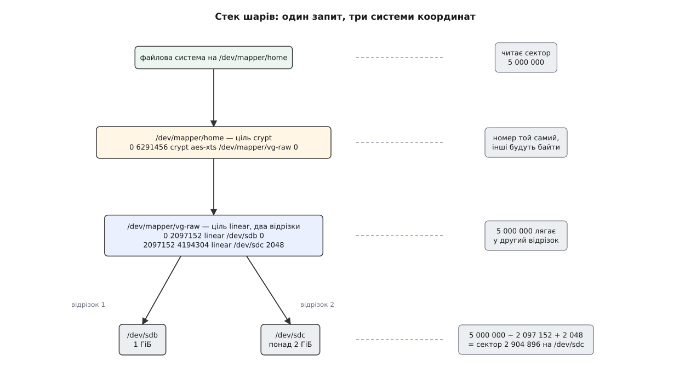
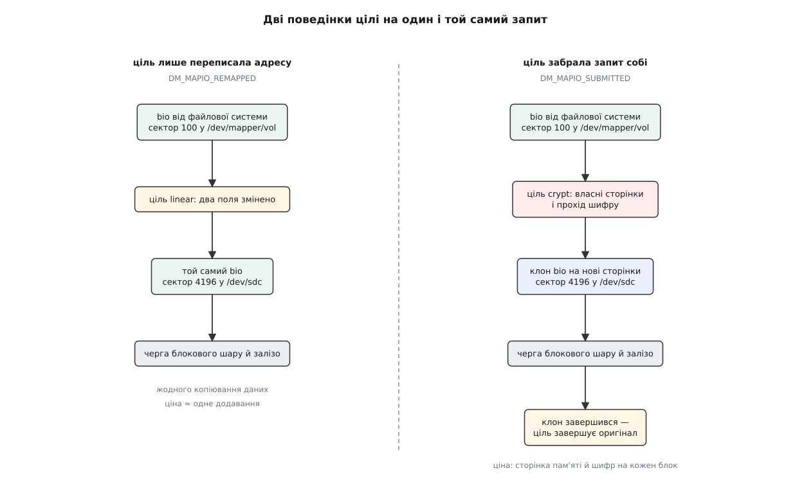
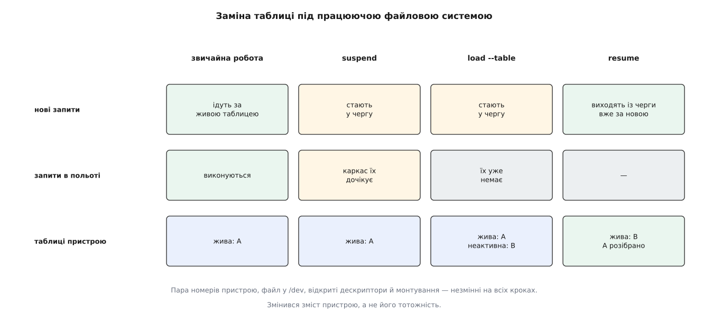

# Device mapper: блоковий пристрій, зібраний із шарів

<preknowlist>
- [Блоковий пристрій: сектори, блоки й черга запитів](root:sys-unix/block-device-model) — носій виглядає для ядра як масив пронумерованих секторів, а запит до нього оформлений окремою структурою з номером сектора, довжиною й сторінками пам'яті.
- [Файл пристрою: символьний і блоковий](root:sys-unix/device-file-model) — доступ до пристрою йде через файл у `/dev`, і саме блокові файли віддають дані діапазонами секторів.
- [Старший і молодший номери пристрою](root:sys-unix/major-minor-numbers) — пара чисел, за якою ядро впізнає конкретний пристрій; саме вона, а не ім'я, є його посвідченням.
- [Керуючий канал до драйвера: ioctl](root:sys-unix/ioctl-interface) — команди драйверові, які не вкладаються в читання й запис, передають окремим викликом із власним кодом операції.
- [Модулі ядра](root:sys-unix/kernel-modules) — частина ядра може довантажуватися на льоту, тож набір доступних можливостей не зафіксований під час збирання.
- [Монтування й дерево монтувань](root:sys-unix/mount-model) — файлова система прив'язується до блокового пристрою в момент монтування й потім тримається за нього весь час роботи.
- [Сторінковий кеш і довговічність запису](root:sys-unix/page-cache-durability) — записане програмою не одразу лежить на носії, тож «узгоджений стан на диску» треба спеціально забезпечувати.
- [Модель пристроїв у sysfs](root:sys-unix/sysfs-device-model) — ядро показує пристрої та зв'язки між ними каталогами й символьними посиланнями в `/sys`.
</preknowlist>

## Три різні біди, у яких одна спільна умова

Диск заповнився, і поруч став другий. Хотілося б, щоб `/home` просто побільшав — розтягнувся на обидва. Але файлову систему створено на розділі, а розділ — це намертво зафіксований діапазон секторів одного носія; ширшим він не стане від того, що в машині з'явилося ще залізо.

Друга біда з іншого боку життя: ноутбук можна загубити, тож усе, що лягає на носій, має лягати зашифрованим. Переробляти під це кожну програму безглуздо. Переробляти файлову систему теж: шифрування не має нічого спільного з тим, як вона розкладає каталоги та веде облік вільного місця.

Третя: базу даних треба скопіювати в резервне сховище, не спиняючи її. Копіювання триває пів години, і за ці пів години база встигне змінити тисячі сторінок. Вийде копія стану, якого ніколи не існувало.

Три різні задачі. Спільне в них те, що кожну було б розв'язано, якби диск під файловою системою був не диском. Якби між нею й залізом хтось стояв і на кожен запит про сектор підставляв іншу відповідь: у першому випадку — сектор із другого носія, у другому — розшифрований, у третьому — той, що був на початку копіювання.

Питання одне: чи є куди туди встати.

## Наскільки тонка обіцянка блокового пристрою

Файлова система не знає про носій майже нічого. Вона знає, що є пронумеровані сектори однакового розміру — у ядрі Linux одиниця нумерації завжди 512 байтів, незалежно від того, якими блоками оперує саме залізо, — і що є два дієслова: прочитати діапазон секторів у сторінки пам'яті, записати сторінки в діапазон секторів. Запит оформлений структурою `bio`: напрямок, номер першого сектора, довжина, перелік сторінок і функція, яку слід гукнути після завершення.

У цій обіцянці немає ані слова про те, що сектор десь фізично існує. Немає навіть слова про те, що його номер має стосунок до положення на пластині. Драйвер зобов'язаний віддати правильні байти на правильний номер — і на цьому все.

Отже, встати є куди. Достатньо драйвера блокового пристрою, який не має власного заліза, а на кожен `bio` звертається до іншого пристрою — так само, як звертався б до нього шар вище.

Справжнє питання починається далі: як зробити це, не перетворивши ядро на зоопарк.

## Чому не окремий драйвер на кожну потребу

Потреб не три, а десятки, і вони перемножуються. Зчепити два носії. Розкидати запис смугами по чотирьох. Зашифрувати. Тримати дзеркало. Показувати замерзлий стан. Підставити швидкий носій попереду повільного. І все це — у довільних поєднаннях: дзеркало під шифром, шифр під знімком.

Якби кожне поєднання було драйвером, кожен драйвер приніс би ще й власний спосіб сказати ядру, з чого складати пристрій, і власну логіку розподілу простору. Головне ж — саме ця логіка й змінюється найчастіше: «яким шматкам яких дисків належати цьому тому» — питання адміністратора, а не ядра. Перший том-менеджер Linux, LVM1, тримав таке знання всередині ядра, і кожна нова політика означала нову порцію коду в найдорожчому місці системи.

Розв'язок, з якого й починається тема: розрізати навпіл. У ядрі лишити тільки механізм — «на цей діапазон секторів відповідає ось цей шматок коду», — а рішення про те, які саме діапазони й куди ведуть, віддати простору користувача. Ядро тоді не знає ні про томи, ні про групи томів, ні про те, що адміністратор надумав завтра; воно вміє рівно одне — розкладати номер сектора по відрізках і кликати за кожен відрізок відповідальний код.

Механізм, побудований за цим принципом, зветься **device mapper** (англ. *map* — класти у відповідність, відображати): відображувач пристроїв. Його склав Joe Thornber із компанії Sistina Software; у дереві розробки серії 2.5 він був уже наприкінці 2002 року, а штатною частиною стабільної серії став із випуском 2.6.0 наприкінці 2003-го — там же, де й переписаний під нього LVM2. Чому попередній підхід зайшов у глухий кут і як виглядало змагання за місце в ядрі, розібрано окремо: [історія рішення винести політику з ядра](root:sys-unix/device-mapper/hist-policy-out-of-kernel.md) — коротка розповідь про LVM1, конкурента на ім'я EVMS і про те, чому переміг задум, у якому ядро знає найменше.

## Таблиця

Відповідальність за діапазон записується рядком. Пристрій device mapper описаний **таблицею відображення** — упорядкованим списком рядків такої форми:

```
<перший сектор> <довжина> <тип цілі> <аргументи цілі>
```

Перші два числа задають діапазон у секторах самого віртуального пристрою. Далі — **ціль** (англ. *target* — мішень; те, у що влучає цей відрізок): назва коду, який обслуговуватиме діапазон, і його власні аргументи, зміст яких ціль тлумачить сама.

Найпростіша ціль зветься `linear`: вона просто пересилає запити на інший пристрій зі зсувом. Її аргументи — куди й з якого сектора там. Зчеплення двох носіїв у один пристрій на три гігабайти виглядає так:

```sh
dmsetup create home --table '0        2097152  linear /dev/sdb 0
2097152  4194304  linear /dev/sdc 2048'
```

Перший гігабайт нового пристрою (2 097 152 сектори по 512 байтів) бере з `/dev/sdb` від нульового сектора, наступні два — з `/dev/sdc`, починаючи з сектора 2048. Після цієї команди в системі з'являється `/dev/dm-0` зі своєю парою номерів і символьне посилання `/dev/mapper/home` на нього; посилання створює [udev за правилами](root:sys-unix/udev-rules), а ім'я — це вже зручність простору користувача, ядро оперує номерами.

На таблицю накладено три вимоги, і всі три випливають з обіцянки блокового пристрою, а не з примхи. Рядки мусять іти за зростанням початкового сектора. Вони мусять іти впритул, без проміжків. І вони не мусять перекриватися. Причина одна: пристрій пообіцяв відповідь на **кожен** сектор у своєму діапазоні. Дірка означала б сектор без господаря, а сказати «такого сектора немає» блоковий інтерфейс не вміє — у нього є лише «дані» й «помилка». Перекриття означало б дві відповіді на одне питання. Тому розмір пристрою — це просто сума довжин рядків, і жодної іншої геометрії в нього немає.

Пошук потрібного рядка на кожен запит мусить бути дешевим: таблиці, які будує LVM на великому сховищі, налічують тисячі відрізків. Тому ядро тримає таблицю не списком, а деревом пошуку з вузлами під розмір рядка кеша процесора — знайти ціль коштує кількох порівнянь незалежно від довжини таблиці.



*Номер сектора переписується на кожному рівні: шар шифрування лишає його на місці й міняє байти, лінійний шар знаходить свій відрізок і переводить номер у координати справжнього носія.*

> 🔧 **Навіщо це.** Коли `lvextend` збільшує логічний том, у ядрі не відбувається нічого схожого на «перерозмічування». До таблиці дописується ще один рядок — і пристрій стає довшим. Саме тому додати місця до тому в LVM коштує мілісекунд і не залежить від того, скільки в ньому даних: рухається опис, а не байти.

## Що ціль робить із запитом

Ядро, розібравши номер сектора по таблиці, кличе в цілі функцію відображення й передає їй `bio`. Далі можливі рівно дві поведінки, і саме їхнє співіснування робить механізм таким широким.

Ціль може **лише переписати адресу** й повернути `DM_MAPIO_REMAPPED` — «я нічого не робила з даними, надішли цей запит далі сама». Так працює `linear`. Ось її серце, майже дослівно з ядра (опущено обробку зонованих носіїв):

```c
static int linear_map(struct dm_target *ti, struct bio *bio)
{
        struct linear_c *lc = ti->private;

        bio_set_dev(bio, lc->dev->bdev);
        bio->bi_iter.bi_sector =
                lc->start + dm_target_offset(ti, bio->bi_iter.bi_sector);

        return DM_MAPIO_REMAPPED;
}
```

`dm_target_offset` віднімає початок відрізка, тобто переводить номер із координат віртуального пристрою у власні координати відрізка; `lc->start` додає зсув на носії. Ані байта не скопійовано, ані сторінки не виділено: до заліза доходить **той самий** `bio`, у якого змінилися два поля. Ціна такого шару — одне додавання й один пошук у дереві.

Ціль може, навпаки, **забрати запит собі** й повернути `DM_MAPIO_SUBMITTED` — «я його взяла, більше про нього не турбуйся, завершу сама». Так мусить робити кожен, хто чіпає дані. Шифрувальна ціль не може відправити оригінальний `bio` на носій: у його сторінках лежить відкритий текст, і ці сторінки належать не їй, а сторінковому кешу. Тому вона виділяє власні сторінки, зашифровує в них вміст, будує **клон** запиту, що вказує на ці сторінки й на справжній носій, надсилає клон — а коли клон завершиться, завершує оригінал. Ціна такого шару — сторінка пам'яті й прохід шифру на кожен блок. Як цей механізм улаштований усередині й що з нього випливає для швидкодії, розібрано в темі про [прозоре шифрування блокового пристрою](root:sys-unix/dm-crypt).



*Перший шлях не коштує майже нічого й тому може повторюватися багато разів у стеку; другий коштує пам'яті та процесора, і його кладуть у стек рівно там, де потрібне перетворення даних.*

Є ще дві відповіді, обидві про негаразди: `DM_MAPIO_REQUEUE` просить каркас спробувати цей запит пізніше (так поводиться шлях, який щойно відвалився), `DM_MAPIO_KILL` завершує його помилкою.

Одну турботу ціль не несе взагалі. Запит може накрити межу між двома рядками таблиці — наприклад, лягти на стик двох дисків. Ядро розрізає такий `bio` **до** виклику відображення, тож ціль ніколи не бачить запиту, що виходить за її діапазон. Ба більше, ціль може оголосити власну найбільшу довжину запиту, і каркас різатиме на цій межі теж: так працюють цілі, що оперують шматками сталого розміру — смугова, знімкова, кешувальна.

## Таблиця — це дані, і їх можна підмінити наживо

Тепер те, заради чого вся конструкція має саме такий вигляд.

Відображення описане таблицею, а не вкомпільованою логікою. Отже, таблицю можна замінити. А оскільки пристрій уміє **призупинятися**, замінити її можна під працюючою файловою системою, і та нічого не помітить.

Заміна складається з трьох кроків.

**Призупинення.** Нові запити не йдуть у таблицю, а стають у чергу; ті, що вже в польоті, каркас дочікує. Крім того, інструмент за замовчуванням просить файлову систему зверху завмерти: скинути на носій усе брудне й припинити починати нові зміни, — щоб стан на носії був узгоджений, а не спійманий посеред операції. Що саме означає «завмерти» для файлової системи й чому без цього знімок виходить пошкодженим, розібрано в темі про [заморожування файлової системи](root:sys-unix/filesystem-freeze).

**Завантаження.** Нову таблицю перевіряють на ті самі три вимоги й будують для неї цілі: відкривають пристрої-призначення, приймають ключі, виділяють структури. Готова таблиця лягає поруч зі старою як **неактивна**. Жива поки що стара — просто нікого не обслуговує.

**Поновлення.** Неактивна таблиця стає живою, стара розбирається, черга відпускається — і накопичені запити йдуть уже за новим відображенням.

Найважливіше тут — те, чого не сталося. Пара номерів пристрою та сама. Файл `/dev/dm-0` той самий. Усі відкриті дескриптори лишилися відкритими, монтування — змонтованим, програми не отримали жодної помилки. Пристрій зберіг **тотожність**, змінивши **зміст**. Саме на цьому стоять усі операції над сховищем, які роблять «на ходу»: збільшення тому, переселення даних з одного диска на інший без розмонтування, злиття знімка з оригіналом, перемикання на живий шлях у багатошляховому доступі.



*Черга під час призупинення — це і є те, що дозволяє підміні бути непомітною: запити не втрачаються й не помиляються, вони чекають.*

Пастка теж випливає просто. Призупинений пристрій не обслуговує нікого — зокрема й того, хто його поновлюватиме. Якщо на призупиненому томі лежить те, що потрібне самій операції (виконуваний файл інструмента, бібліотека, ділянка підкачки), система стає намертво: поновити нікому. Тому інструменти тримають потрібне в пам'яті заздалегідь, а вікно призупинення роблять якомога коротшим.

Побачити всю цю кухню руками — небагато роботи: пара файлів, [підкладених як блокові пристрої](root:sys-unix/loop-device), і кілька команд. Розписаний дослід із живою підміною таблиці, разом із пастками, у які на ньому легко впасти, зібрано окремо: [зібрати пристрій із файлів і підмінити йому таблицю](root:sys-unix/device-mapper/proj-live-table-swap.md).

## Чому шари складаються

Призначення цілі — будь-який блоковий пристрій. Зокрема інший пристрій device mapper. Звідси й береться слово «шари»: шифрувальний пристрій може стояти над лінійним, лінійний — над дзеркальним, дзеркальний — над справжніми дисками. Кожен рівень бачить під собою звичайний блоковий пристрій і не має підстав цікавитися, чи справжній він.

Ядро тримає граф цих залежностей і показує його в [sysfs](root:sys-unix/sysfs-device-model): у каталозі кожного пристрою є `slaves` (на кому він стоїть) і `holders` (хто стоїть на ньому); те саме в зручному вигляді дає `dmsetup ls --tree`. Граф потрібен не для краси. По-перше, за ним визначають порядок дій: пристрій не можна прибрати, поки на ньому хтось стоїть, а призупиняти стек треба згори вниз. По-друге, ним відсікають кільце: пристрій, що зрештою послався б сам на себе, породив би нескінченне пересилання запиту й зупинку системи.

Плата за глибину невелика, поки шари лише переадресовують: кожен коштує пошуку в дереві та додавання. Дорогими є рівно ті шари, що чіпають дані, і саме тому в реальних стеках їх один-два, а не п'ять.

## Що буває цілями

Набір цілей — це і є набір можливостей сховища в Linux, і кожна з них — окремий модуль ядра, який довантажується за потреби:

- `linear` і `striped` — геометрія: зчепити або розкидати смугами;
- `crypt` — [прозоре шифрування](root:sys-unix/dm-crypt);
- `snapshot` і `snapshot-origin` — [миттєвий знімок](root:sys-unix/lvm-and-snapshots) на основі [копіювання при записі](root:sf-os/copy-on-write): перед зміною блока оригіналу старий вміст відкладається вбік;
- `thin` і `thin-pool` — [тонке виділення простору](root:sys-unix/dm-thin-provisioning): блоки видаються з пулу за першим записом, тож сума розмірів томів може перевищувати наявне місце;
- `verity` — [перевірка цілісності за деревом Меркла](root:sys-unix/dm-verity) на кожному читанні;
- `raid` і `mirror` — надлишковість;
- `cache` і `writecache` — [швидкий носій попереду повільного](root:sys-unix/dm-writecache-and-dm-cache);
- `multipath` — [кілька шляхів до одного сховища](root:sys-unix/dm-multipath) з перемиканням на живий;
- `error`, `zero`, `delay`, `flakey` — службові: перша відповідає помилкою на все, друга — нулями на читання й тишею на запис, останні дві навмисно псують або гальмують доступ, щоб перевірити, як поводиться система вище.

Службова ціль `error` — гарний приклад того, як механізм рятує в біді. Коли з групи томів зникає фізичний носій, LVM не прибирає томи, що на ньому стояли: він підміняє їм відповідні відрізки таблиці на `error`. Пристрій лишається на місці зі своїм розміром і своїми номерами, читання з утраченої частини чесно повертає помилку, а решта тому працює.

Більшість цілей працює на рівні окремих `bio`. Багатошляхова — виняток: щоб розумно обирати шлях і рахувати навантаження, потрібно бачити запит уже зібраним так, як його побачить контролер, тому вона живе на рівні запитів блокового шару.

## Керування ззовні

Ядро не має жодної команди про device mapper у вигляді читання чи запису файлу — усе керування йде окремим каналом. У системі є символьний файл `/dev/mapper/control`, і всі дії з пристроями (створити, завантажити таблицю, призупинити, поновити, прочитати таблицю чи стан, прибрати) виражені кодами [ioctl](root:sys-unix/ioctl-interface) на ньому. Поверх цього лежить бібліотека `libdevmapper`, а поверх неї — `dmsetup` для рук і LVM, cryptsetup чи менеджер контейнерів для програм.

Дві операції в цьому наборі варто виділити окремо. `dmsetup table` віддає таблицю назад — тобто пристрій завжди може розповісти, з чого він зібраний (ключі шифру при цьому приховані, якщо не попросити протилежного). `dmsetup status` віддає рядок стану, який кожна ціль формує сама: заповненість знімка, відсоток синхронізації дзеркала, лічильники помилок. Так ціль звітує про себе, не вигадуючи нових інтерфейсів. Точні форми рядків таблиці й стану, перелік команд і кодів керування зібрано в довідці: [таблиця, команди й керуючий канал device mapper](root:sys-unix/device-mapper/api-dm-table.md).

> 🔧 **Навіщо це.** `dmsetup table` і `dmsetup ls --tree` — перше, що варто зробити, коли незрозуміло, звідки взявся `/dev/dm-3` і чому він гальмує. Стек видно повністю: скільки шарів, які з них перетворюють дані, на яких справжніх носіях усе врешті лежить. Без цього діагностика перетворюється на здогади.

## Що з цього виходить

Блоковий інтерфейс виявився достатньо тонким, щоб його можна було виконати кодом замість заліза. Device mapper перетворює цю можливість на дисципліну: у ядрі лишається саме́ відображення «діапазон секторів → відповідальний код», зміст пристрою стає таблицею, яку можна прочитати й підмінити, а тотожність пристрою відривається від його втілення.

Наслідок видно там, де його не одразу шукають. Шифрування, зростання тому, знімок, дзеркало, перевірка цілісності — не властивості файлової системи й не властивості драйвера диска. Це рядки таблиці, які змінюють, поки система працює.
