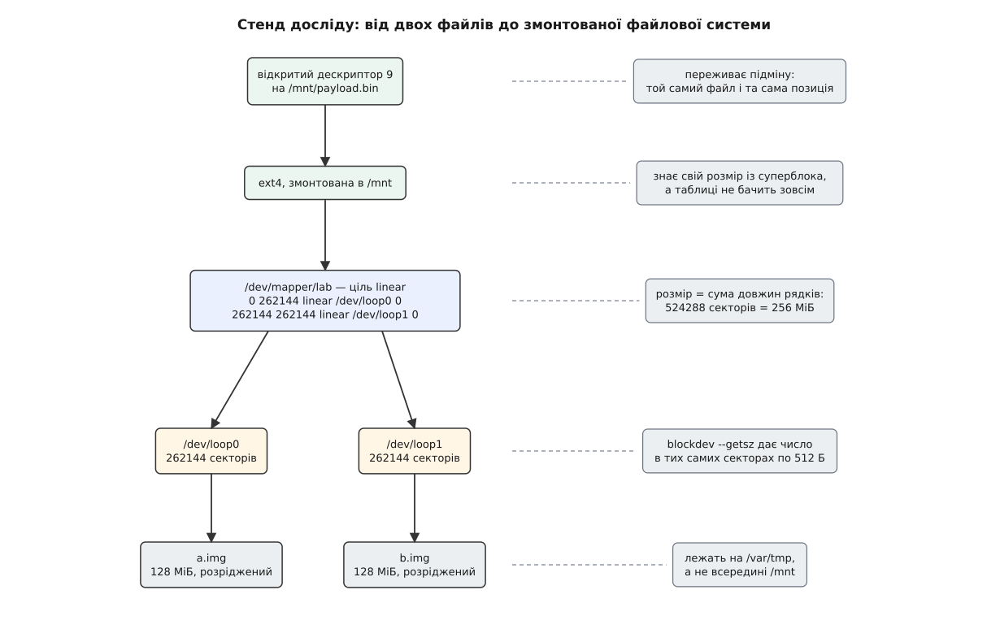
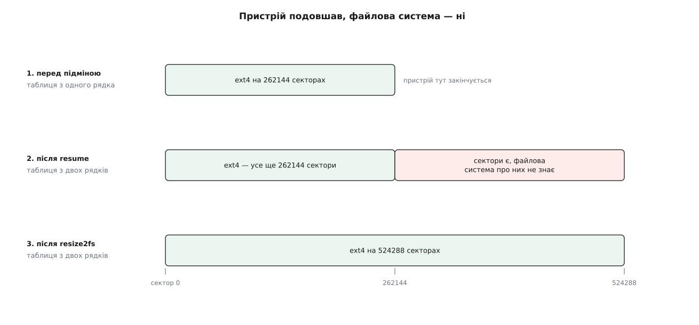

# ⚙️ Пристрій із двох файлів: подовжити його наживо, не розмонтовуючи

Нижче — дослід на пів години, у якому з двох звичайних файлів збирається блоковий пристрій, на ньому заводиться ext4 з даними, а потім пристрій подовжується вдвічі **під працюючою файловою системою**: монтування лишається, відкритий дескриптор доносить свій файл до кінця, жоден байт не переїжджає з місця на місце. Потрібні лише `losetup` і `dmsetup`; цінність тут не в командах, а в чотирьох пастках, які на цьому стенді коштують хвилини, а на робочому сховищі — ночі.

## Стенд

Другий диск не потрібен. [Loop-пристрій](topic:sys-unix/loop-device) — це драйвер, що вдає блоковий пристрій, а читання й запис пересилає у звичайний файл; два таких файли дають «два носії», які для всього, що вище, не відрізняються від справжніх нічим, крім швидкості.

Файли беремо [розріджені](topic:sys-unix/sparse-files): `truncate` створює файл заявленої довжини, під яким спочатку немає жодного блока, і місце на диску витрачається лише під те, що справді запишуть.

```sh
#!/bin/sh
set -eu

WORK=/var/tmp/dmlab          # тут живуть файли-«носії»
MNT=$WORK/mnt                # сюди монтуємо
NAME=lab                     # → /dev/mapper/lab
BYTES=$((128 * 1024 * 1024)) # по 128 МіБ на файл

mkdir -p "$WORK" "$MNT"
truncate -s "$BYTES" "$WORK/a.img"
truncate -s "$BYTES" "$WORK/b.img"

LOOP_A=$(losetup -f --show "$WORK/a.img")
LOOP_B=$(losetup -f --show "$WORK/b.img")
SZ_A=$(blockdev --getsz "$LOOP_A")     # довжина В СЕКТОРАХ
SZ_B=$(blockdev --getsz "$LOOP_B")
echo "$LOOP_A: $SZ_A   $LOOP_B: $SZ_B"   # /dev/loop0: 262144   /dev/loop1: 262144
```

`blockdev --getsz` віддає розмір саме в тих одиницях, якими оперує таблиця device mapper, — [секторах](topic:sys-unix/block-device-model) по 512 байтів, незалежно від того, якими блоками оперує саме залізо. Тому це число можна класти в таблицю без жодного перерахунку, і саме цим користуються всі сценарії, що будують таблиці програмно.

Розташування файлів — не дрібниця. Вони лежать у `/var/tmp`, тобто на **чужій** файловій системі, не на тій, яку ми зараз створимо. Чому це принципово, стане видно в першій пастці.



*Розмір знають на кожному рівні по-своєму: loop бере його з довжини файлу, dm — як суму довжин рядків таблиці, ext4 — зі свого суперблока. Три числа, які ніхто автоматично не узгоджує.*

## Пристрій з одного рядка

```sh
dmsetup create "$NAME" --table "0 $SZ_A linear $LOOP_A 0"

dmsetup table "$NAME"        # 0 262144 linear 7:0 0
dmsetup status "$NAME"       # 0 262144 linear
dmsetup info "$NAME" | grep -E 'State|Tables|Open count|Number of targets'
#   State:             ACTIVE
#   Tables present:    LIVE
#   Open count:        0
#   Number of targets: 1
```

Дві дрібниці у виводі варті уваги одразу. `dmsetup table` показує носій не тим шляхом, який ми вписали, а парою чисел `7:0`: ядро запам'ятало пристрій за старшим і молодшим номерами, а шлях був лише способом його назвати. І `dmsetup status` для `linear` не додає до заголовка рядка нічого — це не помилка, а чесна відповідь: стан звітує **сама ціль**, а лінійному відображенню нема про що звітувати, на відміну від дзеркала з відсотком синхронізації чи знімка з заповненістю. Дивитися, чи живий пристрій, треба в `dmsetup info`.

## Файлова система й дані

```sh
mkfs.ext4 -q -L dmlab /dev/mapper/"$NAME"
mount /dev/mapper/"$NAME" "$MNT"
dd if=/dev/urandom of="$MNT/payload.bin" bs=1M count=16 status=none
sync
SUM=$(sha256sum "$MNT/payload.bin" | cut -d' ' -f1)
```

`sync` тут не забобон. Записане програмою спершу лягає в [сторінковий кеш](topic:sys-unix/page-cache-durability), і на носії його може ще не бути; поки ми лише читатимемо той самий файл через ядро, різниці не видно, але контрольна сума має стосуватися того, що справді лежить у пристрої.

Тепер — свідок, який має пережити підміну. Відкриваємо файл на дескриптор 9, зчитуємо з нього перші 4 КіБ і **лишаємо дескриптор відкритим із зсувом посеред файлу**:

```sh
exec 9< "$MNT/payload.bin"
dd bs=4096 count=1 <&9 of="$WORK/head.part" status=none
```

## Підміна

Три команди, і між ними немає нічого:

```sh
dmsetup suspend "$NAME"
dmsetup load "$NAME" <<EOF
0 $SZ_A linear $LOOP_A 0
$SZ_A $SZ_B linear $LOOP_B 0
EOF
dmsetup resume "$NAME"
```

`suspend` ставить нові запити в чергу й дочікує тих, що вже в польоті. `load` кладе нову таблицю поруч зі старою як неактивну — жива поки що стара. `resume` міняє їх місцями й відпускає чергу. Проміжок між першою й третьою командою — єдиний час, коли до пристрою ніхто не достукається, і триває він тим довше, чим повільніше виконується те, що між ними.

Перевіряємо, що вціліло:

```sh
dmsetup table "$NAME"
#   0 262144 linear 7:0 0
#   262144 262144 linear 7:1 0
blockdev --getsz /dev/mapper/"$NAME"      # 524288 — удвічі більше
findmnt -n -o SOURCE,TARGET "$MNT"        # /dev/mapper/lab /var/tmp/dmlab/mnt

cat <&9 > "$WORK/tail.part"               # дочитуємо ТИМ САМИМ дескриптором
exec 9<&-
if [ "$SUM" = "$(cat "$WORK/head.part" "$WORK/tail.part" |
                 sha256sum | cut -d' ' -f1)" ]; then
    echo "дескриптор доніс той самий файл"
else
    echo "СУМИ РОЗІЙШЛИСЯ" >&2
    exit 1
fi
```

Склеєні шматки дають ту саму суму — отже, дескриптор пережив підміну разом зі своїм зсувом, а не був мовчки скинутий на початок. Монтування на місці, пара номерів пристрою не змінилася, помилок не отримав ніхто.

Тільки не переоцінюймо доказ. Цей `resume` не перемістив жодного байта: перші 262144 сектори як вели на `loop0`, так і ведуть, змінилася сама лише **довжина** пристрою. Живучість дескриптора доводить тут одне — що заміна таблиці не рве зв'язків, — і саме ця властивість дає змогу тією ж трійцею команд робити речі, у яких дані вже переїжджають.

## Файлова система не помітила, що подорослішала

```sh
fs_sectors() {
    dumpe2fs -h "$1" 2>/dev/null |
        awk '/^Block count:/{n=$3} /^Block size:/{b=$3} END{print n*b/512}'
}
echo "пристрій:        $(blockdev --getsz /dev/mapper/"$NAME")"   # 524288
echo "файлова система: $(fs_sectors /dev/mapper/"$NAME")"         # 262144
```

Розбіжність не є збоєм. Свій розмір ext4 тримає у власному суперблоці й змінює його лише тоді, коли її про це попросять; запитувати пристрій «а ти часом не виріс?» вона не має ані звички, ані приводу.



*Довжина таблиці й розмір файлової системи — два незалежні числа, і узгоджує їх людина. Проміжний стан цілком робочий: зайві сектори просто нікому не належать.*

```sh
resize2fs /dev/mapper/"$NAME"       # без розміру = «на весь пристрій»
echo "файлова система: $(fs_sectors /dev/mapper/"$NAME")"        # 524288
```

Рости ext4 вміє змонтованою: `resize2fs` бачить, що пристрій зайнятий, і просить ядро розширити систему на місці. Зі зменшенням усе інакше — про це в третій пастці.

## Прибирання

Порядок тут той самий, у якому знімають шари: згори вниз.

```sh
umount "$MNT"
dmsetup remove "$NAME"
losetup -d "$LOOP_A" "$LOOP_B"
losetup -l | grep -q dmlab && echo "УВАГА: loop ще живий"
rm -rf "$WORK"
```

## Пастки

**Призупинений пристрій і той, хто мав його поновити.** За замовчуванням `dmsetup suspend` не просто ставить запити в чергу — він ще й [заморожує файлову систему](topic:sys-unix/filesystem-freeze) на пристрої: скидає брудні сторінки й не дає починати нові зміни, щоб на носії лишився узгоджений стан. Наслідок легко побачити руками:

```sh
dmsetup suspend "$NAME"
( : > "$MNT/blocked" ) &                 # спроба створити файл
sleep 1
ps -o pid=,stat=,comm= -p $!             #  4711 D    sh
dmsetup resume "$NAME"
wait $!                                  # тепер завершився
```

Процес стоїть у [стані D](topic:sys-unix/process-states) — сні всередині ядра, з якого його не витягне жоден сигнал. Поки пристрій призупинено, так стане **кожен**, хто до нього торкнеться. І якщо серед них опиниться той, хто мав виконати `resume` — програма, що лежить на цьому томі й ще не в кеші, її бібліотека, її файл журналу, — поновлювати буде нікому, і система стане намертво. Саме тому lvm2 перед призупиненням замикає власну пам'ять від витіснення, а в `lvm.conf` є параметри `reserved_memory` і `reserved_stack`, чий опис попереджає прямо: замалий резерв загрожує взаємним блокуванням вводу-виводу, поки пристрій призупинено.

Та сама пастка має рекурсивну форму, і ось чому наші файли лежать у `/var/tmp`: якби `a.img` лежав на `$MNT`, запис у loop-пристрій пішов би у файл на замороженій системі — і пристрій чекав би сам на себе.

**`--nolockfs`: коли заморожування зайве.** Ключ `--nolockfs` каже `suspend` не чіпати файлову систему. Питання не у швидкості — вона й справді вища, — а в тому, що саме ми міняємо. Заморожування потрібне, коли після підміни хтось читатиме носій **як файлову систему** з іншого боку — так знімають знімки: без замороження в знімок потрапить стан, спійманий посеред транзакції. Нашій операції воно не дає нічого: ми додали хвіст, старі сектори не зрушили, і що там на них лежало — байдуже. На нашому стенді мороз коштує часток секунди, на завантаженому сервері з великою базою — помітної паузи для всіх, хто пише. Правило просте: міняєш зміст секторів — мороз обов'язковий; міняєш саму лише геометрію хвоста — можна без нього, свідомо. Є ще `--noflush`, який дозволяє не дочікувати запитів у польоті, але його підтримують не всі цілі, і для `linear` він сенсу не має.

**Неузгодженість у зворотний бік нищівна.** Подовжити пристрій і забути `resize2fs` — нічого не станеться: місце просто не використовується. Скоротити таблицю під живою файловою системою — втратити все, що лежало у відрізаному хвості, а разом із ним і придатність системи до [відновлення після збою](topic:sys-unix/journaling-consistency): метадані посилатимуться на сектори, яких більше не існує. Тому зменшення йде строго в оберненому порядку: спершу `resize2fs` до потрібного розміру — і **тільки на розмонтованій системі**, бо зменшувати ext4 наживо ядро не вміє, — а вже потім коротша таблиця.

Device mapper тут не рятівник і не мусить ним бути. Він перевіряє рівно те, що стосується самої таблиці: рядки йдуть за зростанням, без проміжків і без перекриттів, і кожен відрізок уміщається в носій під ним — спроба показати за межу `loop1` завалиться ще на `load` із повідомленням «too small for target». Про те, що на пристрої живе файлова система й чого вона про себе думає, ядро не знає нічого.

**Зайняті пристрої розбираються не в тому порядку, у якому здається.** `dmsetup remove` на змонтованому пристрої чесно скаже `Device or resource busy`; є `--deferred` (прибрати, коли закриється останній користувач) і `--force` (підмінити таблицю на `error`, тобто перетворити пристрій на суцільну помилку) — обидва рятують у біді, але не заміняють `umount`.

А от `losetup -d` на loop-пристрої, який досі тримає dm, поводиться підступно: на сучасних ядрах від'єднання **ліниве** — помилки не буде, пристрій лише позначать прапорцем autoclear і справді від'єднають, коли його відпустить останній користувач. Команда вдала, а `losetup -l` усе ще показує рядок; звідси й перевірка в кінці нашого прибирання. Хто на кому стоїть, показують `dmsetup ls --tree`, `lsblk` і каталог `slaves` у sysfs.

> 🔧 **Навіщо це.** Цей стенд коштує двох файлів, а відтворює рівно ту послідовність, якою `lvextend` розтягує том, `pvmove` переселяє дані з диска на диск, а `cryptsetup` перемикає ключ. Різниця лише в тому, хто пише таблицю. Той, хто раз побачив на своєму пристрої і застиглий у стані D процес, і розбіжність між `blockdev --getsz` та розміром у суперблоці, читає повідомлення `lvresize` зовсім інакше — і ніколи не переплутає, у якому порядку зменшують том.
