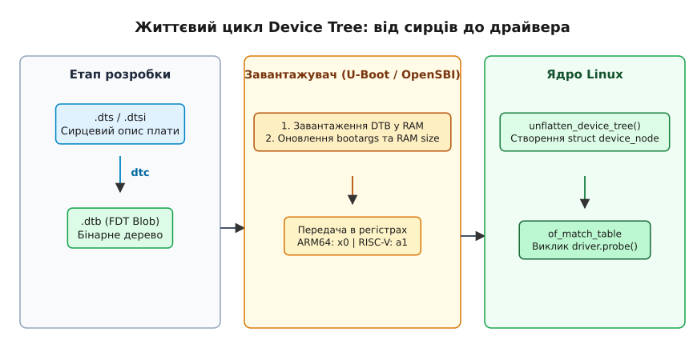
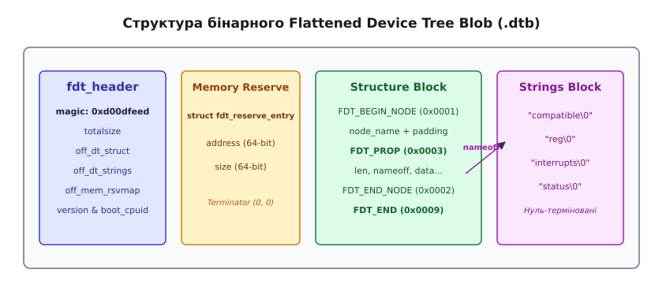
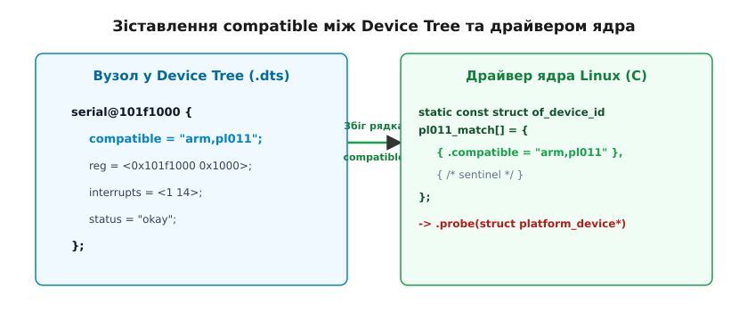

# Дерево пристроїв (Device Tree, DTB)

<preknowlist>
- [Процес завантаження ядра](topic:sys-unix/kernel-boot-process-from-reset-vector-to-start-kernel) — послідовність передачі управління від завантажувача до ядра Linux.
- [Таблиці ACPI та простір імен](topic:sys-unix/acpi-tables-and-namespace) — механізм конфігурації апаратури в архітектурі x86 для порівняння з DTB.
- [Завантажувач та командний рядок](topic:sys-unix/bootloader-and-cmdline) — роль U-Boot та UEFI у підготовці параметрів завантаження.
</preknowlist>

У березні 2011 року підсистема ARM у ядрі Linux 2.6.38 опинилася у стані катастрофічного захаращення: каталоги `arch/arm/mach-*` містили понад 80 000 рядків C-коду так званих board-файлів, де для кожної конкретної ревізії печатних плат вручну створювалися статичні структури `struct platform_device`. Зміна лише одного виводу шини SPI або адреси I2C-термометра вимагала повної перекомпіляції бінарного образу ядра `zImage`, через що мейнтейнери ядра більше не могли перевіряти й підтримувати тисячі унікальних збірок для плати кожної компанії-виробника.

Механізм **Device Tree (дерево пристроїв)** розв'язав цю проблему шляхом повного відокремлення опису апаратури від вихідного коду ядра. Замість компиляції C-файлів топологія плати описується в окремому текстовому синтаксисі, компілюється в компактний бінарний блок (DTB) і передається ядру під час завантаження системи завантажувачем.


*Повний шлях Device Tree від сирцевих текстових файлів .dts через компілятор dtc до передачі завантажувачем і розгортання в ядрі Linux.*

## 1. Першопричина: Чому шини SoC не вміють самовизначатися

Щоб зрозуміти необхідність Device Tree, порівняємо два класи комп'ютерних архітектур: стандартний ПК на базі x86 та вбудовану систему (Embedded System) на базі систем на кристалі (SoC) ARM або RISC-V.

У класичному комп'ютері x86 більшість периферійних пристроїв підключено до шини PCI Express або розпізнано через прошивку ACPI. Шина PCI забезпечує самовиявлення (self-enumeration): кожен пристрій має реєстровий простір конфігурації, де зберігаються фіксовані ідентифікатори виробника та моделі (Vendor ID і Device ID). Ядро операційної системи під час старту сканує номери шин, зчитує ці ID і автоматично викликом шукає драйвер, зареєстрований для цього виміру. Більше того, PCI-пристрій сам повідомляє ядру розмір виділеної йому пам'яті через баз-адресні регістри (BAR). Також для системної плати x86 прошивка UEFI подає таблиці ACPI (DSDT/SSDT), які містять інтерпретований байт-код AML для ініціалізації пристроїв (детальніше у [Таблиці ACPI та простір імен](topic:sys-unix/acpi-tables-and-namespace)).

У вбудованих SoC (наприклад, Allwinner H6, Rockchip RK3399, NXP i.MX8 або Raspberry Pi Broadcom BCM2711) більшість периферійних контролерів підключено не через самоописові шини PCI, а безпосередньо до внутрішньої системної шини кристала (AXI, AHB або APB). Їхні керуючі регістри відображені в плоский фізичний адресний простір CPU (Memory-Mapped I/O, MMIO).

З точки зору процесора, адреса контролера UART `0x01c28000` нічим не відрізняється від адреси звичайної оперативної пам'яті. Сам контролер UART не має жодного виділеного регістру "Vendor ID", який можна було б безпечно прочитати без ризику зависання шини. Якщо ядро спробує прочитати дані за адресою відсутнього контролера, система отримає шинну помилку (Bus Error або Data Abort).

Отже, операційна система не здатна шляхом зондування пам'яті "вгадати":
- За якими фізичними адресами розташовано регістри контролера MMIO.
- Які номери переривань (IRQ) прив'язано до даного блока в контролері переривань (GIC або PLIC).
- Які саме виводи (GPIO) виконують роль ліній TX/RX або відповідають за подачу живлення.
- На якій частоті працює вхідний тактовий сигнал (Clock Domain).
- Які лінії скидання (Reset Lines) та регулятори живлення (Power Regulators) треба активувати перед першим зверненням до регістрів пристрою.

До впровадження стандарту Device Tree всі ці характеристики описувалися у вигляді статичних C-структур всередині коду ядра Linux. Історичний процес катастрофічного розростання цього коду та ультиматум Лінуса Торвальдса 2011 року детально розібрано в історичній вставці [📜 Історія від хаосу board-файлів ARM до стандарту Device Tree](topic:sys-unix/device-tree-flattened-dtb/hist-arm-churn-to-device-tree.md).

## 2. Мова та синтаксис Device Tree Source (.dts, .dtsi)

Опис апаратури створюється інженерами у вигляді древовидної структури даних. Джерельні файли мають розширення `.dts` (Device Tree Source) та `.dtsi` (Device Tree Source Include).

### 2.1. Вузли та властивості

Дерево складається з ієрархії **вузлів (nodes)** та **властивостей (properties)**. Кожен вузол описує компонент системи (SoC, шину, пристрій чи регулятор живлення), а властивості описують його характеристики (адреси, типи, режими роботи).

Синтаксично вузол визначається ім'ям та опціональною базовою адресою:

`node-name@unit-address { ... };`

Базова адреса `unit-address` повинна відповідати першій адресі у властивості `reg`.

```dts
/dts-v1/;

/ {
    #address-cells = <1>;
    #size-cells = <1>;
    model = "Custom Single Board Computer";
    compatible = "myvendor,myboard", "myvendor,mysoc";

    cpus {
        #address-cells = <1>;
        #size-cells = <0>;

        cpu0: cpu@0 {
            device_type = "cpu";
            compatible = "arm,cortex-a53";
            reg = <0>;
        };
    };

    soc {
        #address-cells = <1>;
        #size-cells = <1>;
        compatible = "simple-bus";
        ranges;

        uart0: serial@101f1000 {
            compatible = "arm,pl011", "arm,primecell";
            reg = <0x101f1000 0x1000>;
            interrupts = <1 14>;
            status = "okay";
        };
    };
};
```

### 2.2. Головні системні властивості

1. **`compatible` (сумісність):** Найважливіша властивість у Device Tree. Містить впорядкований список рядків від найспецифічнішого до найбільш загального (наприклад, `"rockchip,rk3399-uart", "snps,dw-apb-uart"`). Ядро Linux використовує цей рядок для зв'язування вузла з конкретним драйвером.
2. **`reg` (регістри):** Описує фізичний адресний простір пристрою у формі кортежів `(адреса, розмір)`. Кількість елементів для адреси та розміру визначається батьківськими властивостями `#address-cells` та `#size-cells`.
3. **`#address-cells` та `#size-cells`:** Визначають, скільки 32-бітних слів (cells) у дочірніх вузлах відведено під фізичну адресу та розмір регіону відповідно. Наприклад, для 64-бітної адреси у 64-бітній ARM64 системі `#address-cells = <2>`, що означає використання двох 32-бітних слів (`<0x0 0x80000000>`).
4. **`status` (стан пристрою):** Задає стан роботи вузла. Значення `"okay"` означає, що пристрій присутній і ядро повинно ініціалізувати для нього драйвер. Значення `"disabled"` наказує ядру повністю ігнорувати цей вузол (наприклад, якщо інтерфейс SPI розведено на SoC, але не виведено на роз'єми конкретної плати).
5. **`phandle` (покажчик на вузол):** Унікальне 32-бітне числове значення, яке дозволяє іншим вузлам посилатися на цей вузол. У вихідному синтаксисі `.dts` замість явного написання чисел використовуються мітки (labels), такі як `&uart0` або `&gpio1`. Компілятор `dtc` автоматично замінює мітки на числові значення `phandle`.

### 2.3. Моделювання переривань, тактових сигналів, живлення та GPIO

Окрім базових адрес пам'яті MMIO, Device Tree повністю визначає зв'язки між різними периферійними підсистемами ядра Linux:

- **Підсистема переривань (Interrupts):** Вузол контролера переривань (наприклад, ARM GIC або RISC-V PLIC) оголошує властивість `interrupt-controller;` та `#interrupt-cells = <3>;`. Кінцевий пристрій посилається на нього через `interrupt-parent = <&gic>;` та вказує специфікатор переривання `interrupts = <GIC_SPI 45 IRQ_TYPE_LEVEL_HIGH>;`. Підсистема `irq_domain` ядра автоматично транслює ці дані у віртуальний системний номер IRQ.
- **Підсистема тактування (Clocks):** Контролер тактування оголошує `#clock-cells = <1>;`. Периферійний пристрій посилається на нього через `clocks = <&cru SCLK_UART0>;` та `clock-names = "baudclk";`. Усередині виклику `.probe()` драйвер отримує тактовий сигнал функцією `devm_clk_get(&pdev->dev, "baudclk")` та перевіряє його частоту для обчислення швидкості бод.
- **Підсистема ліній GPIO:** Контролер виводів оголошує `gpio-controller;` та `#gpio-cells = <2>;`. Кінцевий вузол (наприклад, світлодіод або кнопка) описує лінію як `gpios = <&gpio1 15 GPIO_ACTIVE_LOW>;`. Підсистема `gpiod` ядра автоматично враховує інверсію сигналу `GPIO_ACTIVE_LOW`.
- **Підсистема живильних доменів (Power Domains & Regulators):** Високопродуктивні периферійні блоки (наприклад, графічний процесор GPU або відеодекодер VPU) вимагають активації окремих доменів живлення перед подчею тактового сигналу. Вузол описує це через `power-domains = <&power RK3399_PD_GPU>;` та `vdd-supply = <&vdd_gpu>;`. Ядро під час ініціалізації драйвера автоматично підключає інфраструктуру Runtime Power Management (RPM) для підтримання живильних режимів.

### 2.4. Механізм успадкування через .dtsi та препроцесор C

Щоб уникнути дублювання опису складних SoC (які містять десятки шин та сотні контролерів), опис розбігається на шари:

- **`.dtsi` (Include-файли):** Містять базовий описовий каркас процесора чи SoC (наприклад, `rk3399.dtsi`). Усі периферійні вузли за замовчуванням оголошуються зі станом `status = "disabled"`.
- **`.dts` (Top-level файли):** Описують кінцеву друковану плату (наприклад, `rk3399-rock-pi-4b.dts`). Вони включають `.dtsi` файл SoC і перевизначають лише ті вузли, які реально розведено на платі, переводячи їх у `status = "okay"`.

Оскільки інструмент компіляції Device Tree інтегровано з C-препроцесором (`cpp`), у файлах `.dts` можна використовувати директиви `#include`, макроси `#define` та умовну компіляцію `#ifdef`. Це дозволяє замість магічних чисел використовувати зрозумілі константи з системних заголовочних файлів ядра (наприклад, `#include <dt-bindings/gpio/gpio.h>`).

### 2.5. Динамічні розширення: Device Tree Overlays (.dtbo)

У багатьох сучасних одноплатних комп'ютерах (зокрема Raspberry Pi чи BeagleBone) виникає потреба підключати додаткові плати розширення (HAT або Shield) під час роботи чи завантаження. Оскільки апаратура базової плати є незмінною, конфігурація плати розширення описується у вигляді **оверлея (Device Tree Overlay, `.dtbo`)**.

Синтаксис оверлея містить фрагменти (`fragment@0`), які модифікують існуючі вузли базового дерева за допомогою цільових міток (`target-path` або `target = <&phandle>`):

```dts
/dts-v1/;
/plugin/;

/ {
    compatible = "raspberrypi,model-b-plus";

    fragment@0 {
        target = <&i2c1>;
        __overlay__ {
            status = "okay";

            sensor@48 {
                compatible = "ti,tmp102";
                reg = <0x48>;
            };
        };
    };
};
```

Оверлей компілюється командою `dtc -@` (з підтримкою символьних міток) і може застосовуватися як завантажувачем, так і ядром під час виконання через ConfigFS шляхом створення нових каталогів у каталозі `/sys/kernel/config/device-tree/overlays/`.

## 3. Компіляція та бінарне представлення DTB (FDT)

Текстовий синтаксис `.dts` зручний для читання людиною, але занадто повільний для парсингу ядром на етапі раннього завантаження, коли оперативна пам'ять або MMU ще не налаштовані повністю. Тому текстовий файл компілюється у компактний бінарний формат **Flattened Device Tree (FDT)** з розширенням `.dtb` (Device Tree Blob).

Компіляція виконується за допомогою утиліти **dtc (Device Tree Compiler)**:

```bash
# Компіляція сирця DTS у бінарний файл DTB
dtc -I dts -O dtb -o board.dtb board.dts

# Зворотна декомпіляція бінарного DTB у текстовий DTS
dtc -I dtb -O dts -o decompiled.dts board.dtb
```


*Анатомія бінарного блобу DTB: заголовок fdt_header, таблиця зарезервованої пам'яті, блок токенів структур та блок рядків.*

Бінарний блок DTB складається з чотирьох послідовних секцій пам'яті:

1. **Заголовок (`fdt_header`):** Починається з магічного числа `0xd00dfeed`. Містить загальний розмір бінарного блобу (`totalsize`), версію специфікації, а також байтові зсуви до інших трьох блоків.
2. **Таблиця зарезервованої пам'яті (`mem_rsvmap`):** Список фізичних адрес і розмірів RAM, які заборонено використовувати ядром (наприклад, регіони пам'яті прошивок чи самого DTB).
3. **Блок структур (`dt_struct`):** Послідовність 32-бітних токенів (`FDT_BEGIN_NODE` `0x00000001`, `FDT_END_NODE` `0x00000002`, `FDT_PROP` `0x00000003`, `FDT_NOP` `0x00000004`, `FDT_END` `0x00000009`), які лінійно описують вкладеність вузлів та їхні властивості.
4. **Блок рядків (`dt_strings`):** Сховище null-термінованих ASCII-рядків із назвами властивостей (`"compatible"`, `"reg"`, `"interrupts"`). Властивості у блоці структур містять лише 32-бітний зсув (`nameoff`) у цей блок, що значно економить обсяг пам'яті за рахунок дедуплікації імен.

Повна специфікація типів даних `struct fdt_header` та керуючих токенів наведена в довідниковій вставці [📋 Бінарна структура FDT та довідник API ядра Linux (Open Firmware)](topic:sys-unix/device-tree-flattened-dtb/api-fdt-binary-layout-and-kernel-of-api.md).

## 4. Передача DTB від завантажувача до ядра

Під час старту вбудованої системи першим виконується первинний завантажувач (ROM code / SPL), який ініціалізує контролер оперативної пам'яті DRAM. Після цього вторинний завантажувач (наприклад, U-Boot, EDK2 UEFI або OpenSBI) зчитує файл ядра (`zImage`, `Image` або `vmlinux`) та бінарний файл `board.dtb` з флеш-пам'яті (NOR/NAND), SD-карти або мережі у відповідні регіони RAM.

Детальний порядок передачі управління на початковому етапі розглядається у матеріалі [Процес завантаження ядра](topic:sys-unix/kernel-boot-process-from-reset-vector-to-start-kernel).

### 4.1. Динамічна модифікація (Fixup) DTB завантажувачем

Периферійні характеристики плати не завжди відомі під час компіляції `.dts`. Завантажувач U-Boot перед переходом до ядра виконує так звану процедуру **DTB Fixup** — динамічну модифікацію бінарного дерева прямо в оперативній пам'яті:

- **Вузол `/chosen`:** Завантажувач записує у властивість `/chosen/bootargs` підсумковий командний рядок ядра (наприклад, `console=ttyS0,115200 root=/dev/mmcblk0p2 rw`). Також сюди додаються адреси початку та кінця завантаженого образу `initramfs` (`linux,initrd-start` та `linux,initrd-end`). Детальніше про формат командного рядка дивіться у [Завантажувач та командний рядок](topic:sys-unix/bootloader-and-cmdline).
- **Вузол `memory@...`:** Завантажувач апаратно зондує обсяг встановлених чипів DRAM і динамічно створює або виправляє властивість `reg` у вузлі пам'яті (наприклад, `reg = <0x80000000 0x40000000>` для 1 ГБ RAM).
- **MAC-адреси:** Завантажувач зчитує унікальну MAC-адресу мережевого адаптера з eFUSE або EEPROM плати і записує її у властивість `local-mac-address` відповідного Ethernet-вузла.

### 4.2. Апаратний ABI-контракт передачі в регістрах CPU

Після підготовки DTB завантажувач здійснює прямий перехід на початкову інструкцію ядра Linux. Залежно від архітектури CPU, адреса бінарного блоку DTB передається у чітко визначеному регістрах процесора:

- **ARM 32-bit (ARMv7):**
  - Регістр `r0` = `0`
  - Регістр `r1` = `0xFFFFFFFF` (значення, що сигналізує ядру про використання DTB замість застарілого Machine ID)
  - Регістр `r2` = **Фізична адреса початку блоку DTB у RAM**
- **ARM 64-bit (AArch64):**
  - Регістр `x0` = **Фізична адреса початку блоку DTB у RAM** (вирівняна за межею 64 байти)
  - Регістри `x1`, `x2`, `x3` = `0` (зарезервовано)
- **RISC-V (RV64/RV32):**
  - Регістр `a0` = `hartid` (апаратний ідентифікатор поточного ядра CPU)
  - Регістр `a1` = **Фізична адреса початку блоку DTB у RAM**

Коли ядро отримує управління, перші інструкції мовою асемблера перевіряють сигнатурне число `0xd00dfeed` за адресою з регістру. Якщо магічне число коректне, ядро зберігає цю адресу і починає його обробку.

## 5. Життєвий цикл у ядрі: Unflattening та розгортання драйверів

Обробка Device Tree в ядрі Linux ділиться на два чіткі етапи: раній (early boot) та основний (platform device population).

### 5.1. Ранній етап: `early_init_dt_scan()`

На цьому етапі таблиці сторінок пам'яті MMU ще не сформовані повністю, а динамічний розподілювач пам'яті `kmalloc()` ще не працює. Ядро сканує бінарний FDT безпосередньо в RAM у його "сплющеному" (flattened) вигляді за допомогою функції `early_init_dt_scan()`:

1. Зчитується вузол `/chosen` для отримання аргументів командного рядка `bootargs`.
2. Зчитується вузол `memory` для визначення меж доступної фізичної оперативної пам'яті та передачі цих адрес у первинний розподілювач пам'яті `memblock`.
3. Зчитується блок `mem_rsvmap` для захисту адрес ядра та initramfs від перезапису.

### 5.2. Розгортання дерева: `unflatten_device_tree()`

Після ініціалізації підсистеми віртуальної пам'яті та `kmalloc()` ядро більше не працює з сирим бінарним блоком FDT. Викликом `unflatten_device_tree()` ядро парсить блок структур і будує в оперативній пам'яті повноцінне динамічне граф-дерево, яке складається з екземплярів C-структур `struct device_node`.

```c
struct device_node {
    const char *name;          /* Базове ім'я вузла */
    const char *full_name;     /* Повний шлях у дереві (наприклад, "/soc/serial@101f1000") */
    struct property *properties;/* Зв'язаний список властивостей вузла */
    struct device_node *parent;/* Вказівник на батьківський вузол */
    struct device_node *child; /* Вказівник на перший дочірній вузол */
    struct device_node *sibling;/* Вказівник на сусідній вузол того ж рівня */
    struct kref kref;          /* Лічильник посилань для керування пам'яттю */
};
```

### 5.3. Реєстрація пристроїв та зв'язування з драйверами (`of_match_table`)

Після побудови дерева функція `of_platform_default_populate()` обходить вузли з властивістю `compatible = "simple-bus"` або вузли верхнього рівня і створює для кожного з них об'єкт платформного пристрою `struct platform_device`.

Далі системний шинний драйвер `platform_bus` порівнює кожен створений `platform_device` із зареєстрованими в ядрі драйверами `struct platform_driver`. Зіставлення відбувається через таблицю **`of_match_table`**:


*Механізм зв'язування ряду compatible з вузла Device Tree та масиву of_match_table у драйвері ядра Linux.*

Код драйвера оголошує масив підтримуваних пристроїв:

```c
static const struct of_device_id pl011_dt_ids[] = {
    { .compatible = "arm,pl011", },
    { .compatible = "arm,primecell", },
    { /* sentinel */ }
};
MODULE_DEVICE_TABLE(of, pl011_dt_ids);

static struct platform_driver pl011_driver = {
    .probe  = pl011_probe,
    .remove = pl011_remove,
    .driver = {
        .name = "uart-pl011",
        .of_match_table = pl011_dt_ids,
    },
};
```

> ⚠️ **Виняток C++ підсистеми ядра (§5 Канону):** Код драйверів Linux працює виключно у просторі ядра (kernel space). Тут відсутні стандартна бібліотека C++, підсистема винятків та unwind-таблиці. Тому приклади підсистеми ядра (`of_match_table` та `.probe()`) наводяться мовою C як єдиний можливий технічний стандарт.

Коли підсистема ядра знаходить збіг рядка `compatible` у `pl011_dt_ids`, вона викликає функцію `.probe()` драйвера. Усередині `.probe()` розробник використовує API `of_*` для вилучення ресурсів:

```c
static int pl011_probe(struct platform_device *pdev)
{
    struct device_node *np = pdev->dev.of_node;
    struct resource res;
    u32 bus_width;
    int irq;

    /* Вилучення фізичних адрес MMIO з властивості reg */
    if (of_address_to_resource(np, 0, &res)) {
        dev_err(&pdev->dev, "Failed to get MMIO resource\n");
        return -EINVAL;
    }

    /* Вилучення системного номера переривання з interrupts */
    irq = irq_of_parse_and_map(np, 0);

    /* Зчитування опціональної числової властивості */
    if (of_property_read_u32(np, "reg-io-width", &bus_width))
        bus_width = 1; /* значення за замовчуванням */

    /* Відображення MMIO регістрів у віртуальний простір ядра */
    void __iomap *base = devm_ioremap_resource(&pdev->dev, &res);

    return 0;
}
```

Для аналізу бінарного DTB у користувацькому просторі без допомоги ядра дивіться проєктну вставку [⚙️ Парсер бінарного DTB у користувацькому просторі](topic:sys-unix/device-tree-flattened-dtb/proj-fdt-userspace-parser.md).

## 6. Інспектування у користувацькому просторі: /proc/device-tree та sysfs

Після завершення завантаження ядро Linux експортує розгорнуте дерево пристроїв у віртуальну файлову систему `sysfs`.

Основою для інспектування є каталог:

`/sys/firmware/devicetree/base/`

Для сумісності зі старими утилітами створено символічне посилання:

`/proc/device-tree -> /sys/firmware/devicetree/base`

### 6.1. Структура файлової системи

Усередині `/proc/device-tree` кожному вузлу Device Tree відповідає окремий каталог, а кожній властивості — окремий бінарний файл.

```bash
$ ls -la /proc/device-tree/
drwxr-xr-x  6 root root  0 Aug 14 10:00 .
drwxr-xr-x  3 root root  0 Aug 14 10:00 ..
-r--r--r--  1 root root  4 Aug 14 10:00 #address-cells
-r--r--r--  1 root root  4 Aug 14 10:00 #size-cells
-r--r--r--  1 root root 28 Aug 14 10:00 compatible
-r--r--r--  1 root root 22 Aug 14 10:00 model
drwxr-xr-x  2 root root  0 Aug 14 10:00 cpus
drwxr-xr-x  4 root root  0 Aug 14 10:00 soc
```

Зчитування рядкових властивостей можна виконувати звичайною командою `cat`:

```bash
$ cat /proc/device-tree/model
Raspberry Pi 4 Model B Rev 1.4

$ cat /proc/device-tree/soc/serial@7e201000/compatible
brcm,bcm2835-aux-uartbrcm,bcm2835-uart
```

Оскільки числові значення у DTB зберігаються у форматі 32-бітних Big-Endian чисел, зчитування числових файлів через `cat` виведе сирі байти. Для аналізу використовують `hexdump` або `xxd`:

```bash
# Зчитування #address-cells (повертає 0x00 0x00 0x00 0x02 -> 2 cells)
$ hexdump -C /proc/device-tree/#address-cells
00000000  00 00 00 02                                       |....|
```

### 6.2. Зворотний витяг DTB із запущеної системи

Якщо оригінальний `.dtb` файл втрачено, розробник може повністю відновити вихідне дерево з працюючої системи Linux за допомогою компілятора `dtc`, вказавши джерелом виділений каталог файлової системи (`-I fs`):

```bash
# Декомпіляція поточного дерева пристроїв системи у текстовий DTS
dtc -I fs -O dts -o running_system.dts /sys/firmware/devicetree/base

# Дамп поточного дерева у новий бінарний DTB файл
dtc -I fs -O dtb -o running_system.dtb /sys/firmware/devicetree/base
```

Це надзвичайно потужний інструмент діагностики, який дозволяє побачити точний підсумковий стан дерева з урахуванням усіх DTB Fixup дій завантажувача U-Boot та підключених оверлеїв.

> 🔧 **Навіщо це.**
> Інспектування `/proc/device-tree` — це перший крок розробника при налагодженні нових драйверів вбудованих плат. Якщо драйвер не викликає функцію `.probe()`, перевірте через `cat /proc/device-tree/.../status`, чи не перебуває вузол у стані `disabled`, та звірте рядок `compatible` із масивом `of_match_table` вашого драйвера на наявність друкарських помилок.

## 7. Практичні пастки, крайові випадки та ціна механізму

Незважаючи на високу гнучкість, використання Device Tree має низку підводних каменів, які можуть викликати важковловлювані збої системи.

### 7.1. Пастка Big-Endian та байт-свап

Усі числові значення у DTB (числа у кутових дужках `< ... >`) записуються в бінарний файл у форматі Big-Endian. Якщо розробник пише власну утиліти користувацького простору або завантажувач для Little-Endian процесорів (ARM, RISC-V чи x86) і зчитує 32-бітне значення прямо з пам'яті через вказівник `*(uint32_t*)ptr`, він отримає неправильне значення.

Для конвертації обов'язково використовувати макроси `be32_to_cpu()` у ядрі або `be32toh()` / `std::byteswap` у користувацькому просторі:

```c
/* Помилково: прочитає 0x01000000 замість 1 на Little-Endian CPU */
uint32_t cells = *(uint32_t *)buf;

/* Правильно: виконання байт-свапу */
uint32_t cells = be32_to_cpu(*(uint32_t *)buf);
```

### 7.2. Успадкування адресних комірок та трансляція `ranges`

Властивості `#address-cells` та `#size-cells` **не успадковуються** крізь кілька рівнів вкладеності. Кожен шинний вузол повинен явно оголошувати ці властивості для своїх дочірніх вузлів. Якщо вузол шини їх не містить, ядро приймає значення за замовчуванням (`#address-cells = 2`, `#size-cells = 1`), що може призвести до неправильного розшифрування властивості `reg`.

Окрім того, фізичні адреси дочірніх шин (наприклад, локальні адреси всередині шини PCI або контролера локальної шини) транслюються у фізичні адреси CPU лише за наявності властивості **`ranges`**:

```dts
soc {
    #address-cells = <1>;
    #size-cells = <1>;
    compatible = "simple-bus";
    /* ranges порожній: адреси дочірніх вузлів відображаються 1:1 на адреси CPU */
    ranges;

    isa-bus {
        #address-cells = <2>;
        #size-cells = <1>;
        /* Трансляція локальної адреси ISA 0x0 у фізичну адресу CPU 0x20000000 */
        ranges = <0x0 0x0 0x20000000 0x10000>;
    };
};
```

Якщо властивість `ranges` відсутня у вузлі шини, дочірні пристрої вважаються недоступними безпосередньо процесору (non-mappable), і виклики `of_address_to_resource()` чи `of_iomap()` повертатимуть помилку `-EINVAL`.

### 7.3. Неіснуючі phandle та циклічні залежності

У складних деревних описах вузол пристрою може посилатися на інші вузли (наприклад, контролер DMA `dmas = <&dma0 1>`, генератор тактового сигналу `clocks = <&cru 2>` або лінію скидання `resets = <&rst 5>`).

Якщо батьківський контролер (наприклад, `dma0`) перебуває у стані `status = "disabled"` або його драйвер ще не скомпільовано, ядро при спробі отримати ресурс поверне помилку **`-EPROBE_DEFER`**. Це наказує підсистемі пристроїв ядра відкласти ініціалізацію поточного драйвера і повторити спробу пізніше, коли контролер DMA буде повністю зареєстровано.

 Однак, якщо у файлі `.dts` утворено циклічну залежність між двома вузлами через phandle, ядро увійде в нескінченну петлю відкладених ініціалізацій (`EPROBE_DEFER`), і обидва пристрої залишаться неактивними.

### 7.4. Обчислювальна та оперативна ціна Device Tree

Хоча бінарний blob `.dtb` займає відносно небагато місця у флеш-пам'яті (зазвичай від 15 до 150 кілобайт), його розгортання в ядрі Linux має відчутну ціну:

1. **Витрати оперативної пам'яті:** Під час розгортання `unflatten_device_tree()` ядро виділяє динамічну пам'ять під сотні об'єктів `struct device_node` та `struct property`. На бідних вбудованих системах із 8–16 МБ RAM розгорнуте дерево може споживати до 1–2 МБ оперативної пам'яті.
2. **Час завантаження (Boot Time Impact):** Лінійне сканування FDT, парсування рядків, витяг phandle та резолвінг залежностей `EPROBE_DEFER` додають від 20 до 150 мілісекунд до загального часу старту ядра. Для систем реального часу (Instant Boot Systems), які повинні показувати зображення з камери заднього ходу автомобіля менш ніж за 500 мс після ввімкнення живлення, цей час є критичним і вимагає оптимізації через вилучення невикористовуваних вузлів.

## Висновок

Впровадження Device Tree уможливило поділ операційної системи Linux та специфікацій апаратури. Завдяки стандартизації бінарного формату FDT, компілятору `dtc` та інфраструктурі `of_match_table` один збірка ядра `vmlinuz` може працювати на різноманітних платах ARM та RISC-V, отримуючи точний опис топології від завантажувача U-Boot чи UEFI під час старту.
