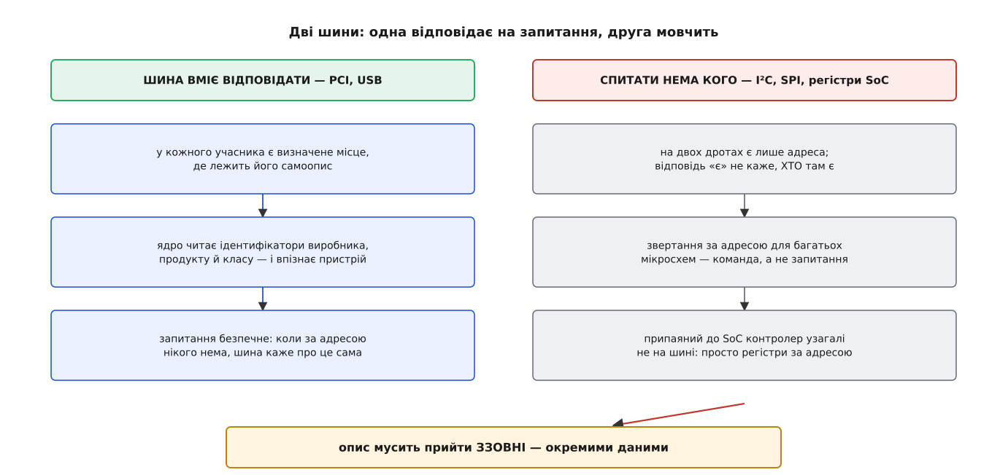
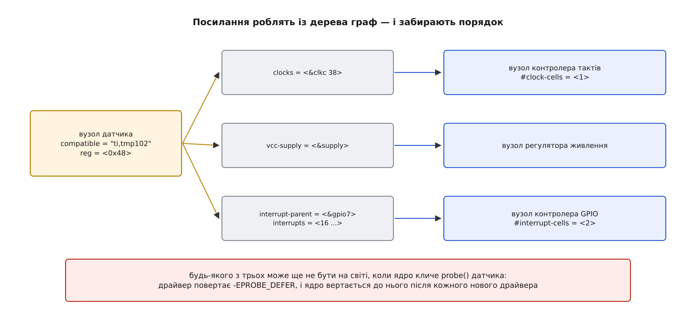
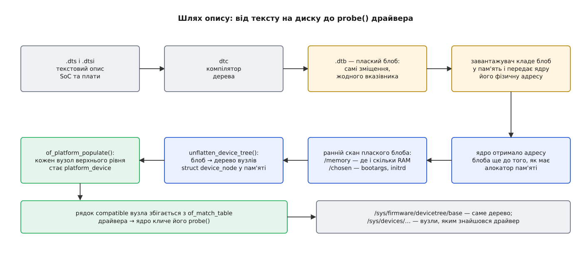

# Дерево пристроїв: як прошивка описує залізо, яке не можна опитати

<preknowlist>
- [Модель пристроїв у sysfs](root:sys-unix/sysfs-device-model) — ядро тримає єдине дерево під'єднаного заліза, а шина зводить пристрій із драйвером і кличе `probe()`.
- [Модулі ядра: завантаження, параметри, залежності](root:sys-unix/kernel-modules) — драйвер як окремий об'єкт, що вантажиться вже після старту системи.
- [Завантажувач і командний рядок ядра](root:sys-unix/bootloader-and-cmdline) — хто кладе ядро в пам'ять, передає йому керування й параметри.
- [Файл пристрою: символьний і блоковий](root:sys-unix/device-file-model) — як драйвер стає видимим програмам через файл у `/dev`.
- [Ядро й простір користувача](root:sys-unix/kernel-and-userspace) — межа між кодом ядра й програмами.
- [Переривання, softirq і робочі черги](root:sys-unix/interrupts-bottom-halves) — що таке лінія переривання й контролер, який їх роздає.
</preknowlist>

## Машина, яка не вміє себе назвати

Той самий образ ядра ви ставите на ноутбук — і він знаходить усе: диск, мережеву карту, звук, камеру. Ви ставите той самий образ на одноплатну машину, до якої припаяно датчик температури, — і в системі нема ні датчика, ні половини того, що на платі є. Живлення подано, драйвер у ядро зібраний, дроти цілі. Не вистачає одного: ядру ніхто не сказав, що це залізо існує.

Різниця не в ядрі. Різниця в тому, чи вміє машина відповідати на запитання.

## Дві шини: одна відповідає, друга мовчить

На PCI у кожного учасника є конфігураційний простір — невелика ділянка, до якої йдуть окремі транзакції й у якій за визначеним зміщенням лежать ідентифікатори виробника та пристрою, клас і перелік потрібних ресурсів. Ядро обходить усі можливі позиції на шині й читає ці числа. Найважливіше тут не те, що самоопис існує, а те, що **запитання безпечне**: коли за позицією нікого нема, шина відповідає визначеним «нікого нема» (усі одиниці), і ядро спокійно йде далі. USB робить те саме інакше: щойно на порту з'являється пристрій, хаб повідомляє про це ядру, ядро скидає порт і читає дескриптори — і пристрій відповідає, ким він є.

Тепер шина I²C. Це два дроти й семібітна адреса. «Спитати, чи є хтось за адресою 0x48» тут означає виставити цю адресу на шину й дивитися, чи притисне хтось лінію в біті підтвердження. Три обставини роблять таке опитування непридатним для з'ясування складу машини.

Перша: підтвердження каже лише «за цією адресою хтось є», а не «хто». Датчик температури й мікросхема годинника з однаковою адресою на шині не розрізняються нічим.

Друга, важливіша: звертання за адресою для більшості мікросхем — не запитання, а команда. Байт після адреси зазвичай є номером внутрішнього регістра, а запис у регістр щось робить. Обхід усіх адрес поспіль може зсунути внутрішній вказівник чужої мікросхеми, перевести пам'ять у режим запису або збити налаштування перетворювача. На PCI простір, що читається, спеціально відділений від того, який керує; на I²C такого поділу нема взагалі.

Третя: багато пристроїв не відповідають, поки їх не ввімкне окремий регулятор живлення чи не подасть такт окремий контролер. Мовчання за адресою нічого не доводить.

SPI ще категоричніший: там нема біта підтвердження в принципі — є виділена лінія вибору, і мовчазний зсувний регістр видасть якесь сміття, не відрізниме від даних. А контролер послідовного порту всередині самої мікросхеми процесора не сидить на жодній шині: це просто набір регістрів за фіксованою фізичною адресою. Прочитати адресу, за якою нічого нема, на такій машині означає в кращому разі дістати нулі, у гіршому — зависання внутрішньої шини й фатальний виняток.



*Там, де пристрій має самоопис і шина вміє сказати «тут нікого нема», склад машини дізнаються з самої машини; там, де є лише адреса й припаяні дроти, знання мусить прийти ззовні окремими даними.*

Отже, нездатність такого заліза назвати себе — не недогляд розробників плати, а властивість дешевих шин і припаяного монтажу. Знання про такий склад машини мусить прийти **ззовні**. Питання лише в тому, у якому вигляді.

## Чому опис не можна тримати в коді

Перша відповідь Linux на ARM була найпростішою з можливих: вписати опис у саме ядро. Для кожної плати існував окремий файл мовою C, у якому оголошували масиви структур — фізичні адреси регістрів, номери переривань, які мікросхеми на якій шині сидять, як налаштувати виводи. Завантажувач передавав ядру число — номер типу машини, — і ядро вибирало відповідний опис.

Це працює, поки плат мало. Далі починається арифметика. Опис однієї плати не можна додати, не правлячи ядро. Ядро, яке підтримує сто плат, везе сто описів, з яких для конкретної машини потрібен один. Збірка під одну плату не запускається на іншій — тобто дистрибутив мусить тримати майже окремий образ ядра на кожну підтримувану машину. І, найгірше для спільної роботи, сотні майже однакових файлів чіпають ті самі спільні місця, тож кожне злиття перетворюється на конфлікт.

У березні 2011 року, під час вікна злиття версії 2.6.39, Лінус Торвальдс відмовився приймати чергову порцію таких файлів у різких висловах, і протягом того ж року ARM у ядрі перейшов на інший спосіб. [Як народилося дерево пристроїв](root:sys-unix/device-tree/hist-from-board-files.md) — окрема історія: спосіб не вигадали тоді, його взяли з Open Firmware, де він прожив до того два десятки років на робочих станціях SPARC і машинах PowerPC.

Причина глибша за незручність злиття. Опис заліза — це **дані**, а їх тримали в **коді**. Дані, вкомпільовані в код, змінюються тільки перекомпіляцією коду; доля ядра й доля плати виявляються зв'язаними назавжди. Розв'язати їх можна одним способом: винести опис в окремий об'єкт, який ядро читає на старті, як читає будь-який інший вхід.

## Форма опису

Опис має форму дерева, і це не довільний вибір. Залізо ієрархічне: мікросхема висить на шині, шина — на контролері, контролер — на внутрішній шині процесора. Ця ієрархія потрібна не для краси. Адреса `0x48` не має жодного сенсу сама по собі: вона щось означає лише в системі координат тієї шини, на якій пристрій сидить. Дерево дає цю систему координат безкоштовно — координати задає батько.

Вузол дерева — іменований пристрій або група. Властивість — це пара «ім'я → масив байтів». Ядро не знає наперед, що ці байти означають: тлумачить їх драйвер, за наперед домовленим правилом читання. Ось фрагмент опису контролера I²C всередині процесора Zynq-7000 і датчика температури, припаяного до цієї шини:

```dts
i2c0: i2c@e0004000 {
        compatible = "cdns,i2c-r1p10";
        reg = <0xe0004000 0x1000>;
        interrupt-parent = <&intc>;
        interrupts = <0 25 4>;
        clocks = <&clkc 38>;
        clock-frequency = <400000>;
        #address-cells = <1>;
        #size-cells = <0>;

        sensor@48 {
                compatible = "ti,tmp102";
                reg = <0x48>;
                interrupt-parent = <&gpio7>;
                interrupts = <16 IRQ_TYPE_LEVEL_LOW>;
                vcc-supply = <&supply>;
                #thermal-sensor-cells = <1>;
        };
};
```

Розберімо це по частинах — кожна з них розв'язує окрему задачу.

## compatible: як драйвер упізнає своє

`compatible` — рядок, за яким ядро шукає код. Формат «виробник,модель» не прикраса: він розводить імена різних виробників, щоб чужий `uart` не збігся з вашим. Драйвер зі свого боку несе таблицю таких самих рядків (`of_match_table`), і збіг рядка з таблицею — це той самий механізм добору, яким шина зводить пристрій із драйвером у будь-якому іншому випадку.

Рядків може бути кілька, від найконкретнішого до найзагальнішого:

```dts
compatible = "nxp,pca9548", "nxp,pca954x";
```

Читається це як «це саме така мікросхема, а якщо ти її не знаєш — поводься з нею як з представником цієї родини». Саме звідси береться властивість, заради якої все й робилося: ядро, старіше за плату, може підняти на ній залізо, бо чіпляється за загальніший рядок.

> 🔧 **Навіщо це.** Коли нова плата не піднімає своє залізо на ванільному ядрі, перше, що перевіряють, — чи є рядок `compatible` із її `.dtb` бодай в одній `of_match_table` зібраного ядра. Немає збігу — драйвер ніколи не покличеться, і в журналі не буде **жодної** помилки: з погляду ядра просто є вузол, до якого нема чого чіпляти. Це найчастіша причина «залізо є, а системи не бачить».

## reg і комірки: чому розмір адреси задає батько

`reg` — просто масив 32-бітних комірок. Скільки комірок припадає на адресу й скільки на розмір, каже не сам вузол, а його **батько**, властивостями `#address-cells` і `#size-cells`. У прикладі вище контролер I²C оголошує `<1>` і `<0>` — і тому в дитини `reg = <0x48>` без будь-якого розміру.

Чому не зафіксувати це раз і назавжди? Бо адреса на різних шинах — різна річ. На I²C це одне маленьке число, і поняття «розмір» там не існує взагалі. На внутрішній шині 64-бітного процесора адреса не влазить у 32 біти й займає дві комірки. Тому кількість комірок — властивість системи координат, тобто батька. Сусідня властивість `ranges` довершує картину: вона перекладає дитячі адреси в батьківські (порожня `ranges` означає «збігаються один в один»), і саме нею ядро рахує справжню фізичну адресу, до якої зрештою звертатиметься драйвер.

Повний перелік того, що можна написати у вузлі, — [властивості й розділи дерева пристроїв](root:sys-unix/device-tree/api-dt-bindings.md).

## Посилання: дерево за формою, граф за змістом

Датчику мало власної адреси. Йому потрібен такт від контролера тактових сигналів, живлення від регулятора й лінія переривання від контролера GPIO. Описати це числом неможливо: «переривання номер 16» безглузде без відповіді на питання «шістнадцяте в кого».

Тому в описі є посилання. У тексті ставлять мітку (`gpio7:`) і посилаються на неї як `<&gpio7>`; компілятор підставляє замість мітки унікальне 32-бітне число — **phandle** (термін прийшов з Open Firmware, де це *package handle* — держак «пакета», тобто вузла-пристрою). За формою опис лишається деревом, за змістом стає графом.

Скільки чисел іде за посиланням і що вони означають, знову вирішує не той, хто посилається, а **ціль**: `#interrupt-cells`, `#clock-cells`, `#gpio-cells`. Контролер GPIO з `#interrupt-cells = <2>` каже: «після посилання на мене чекай двох чисел — номер лінії й тип фронту». Ціль описує власний формат звертання, а не кожен охочий вигадує свій.



*Датчик посилається на контролер тактів, регулятор і контролер GPIO; будь-якого з них може ще не бути на світі, коли ядро кличе probe() датчика.*

У графа є неприємний наслідок. З дерева порядок ініціалізації ще виводився б: спершу батько, потім діти. З графа посилань — ні: датчик на I²C залежить від контролера GPIO, який стоїть в іншій гілці й може піднятися пізніше. Ядро не намагається розв'язати цю задачу наперед. Драйвер, який бачить, що потрібного йому ресурсу ще нема, повертає `-EPROBE_DEFER`, і ядро вертається до цього пристрою щоразу, коли реєструється новий драйвер або успішно прив'язується інший пристрій — механізм відкладеної прив'язки описаний у [моделі пристроїв](root:sys-unix/sysfs-device-model).

## Шлях від тексту до probe()

Текст описів пишуть не одним файлом: спільну частину — усе, що є в самій мікросхемі процесора, — виносять у `.dtsi`, який підключають файли конкретних плат. Компілятор `dtc` збирає це в `.dtb` — плаский блоб (англ. *flattened device tree*): заголовок, блок зарезервованих ділянок пам'яті, блок структури й блок рядків, усі посилання всередині — зміщення, порядок байтів старшим уперед.

Форма продиктована умовами вживання. Блоб передають між двома програмами, які не поділяють адресний простір, а читає його ядро в момент, коли ще нема ні розподільника пам'яті, ні відображень — тому в структурі не може бути жодного вказівника, і читати її треба вміти на місці, не розпаковуючи.

Далі йде послідовність, у якій кожен крок відкриває наступний. Завантажувач кладе блоб у пам'ять і передає ядру його фізичну адресу в регістрі. Ядро сканує **плаский** блоб, ще не маючи чим його розкласти, і дістає з нього рівно те, без чого не зробить наступного кроку: розділ `/memory` — де і скільки оперативної пам'яті (без цього нема що віддати розподільникові) і розділ `/chosen` — командний рядок і межі початкового образу кореня. Отримавши пам'ять, ядро розкладає блоб у справжнє дерево вузлів у пам'яті. Аж тоді обходить його й на кожен вузол верхнього рівня створює пристрій на [шині platform](root:sys-unix/platform-bus) — тій, що існує саме для заліза, яке не можна перелічити. Дітей справжніх шин створює драйвер шини: драйвер контролера I²C, піднявшись, перелічує власні дочірні вузли й реєструє для них пристрої.

З цього моменту нічого особливого не відбувається: вузол шукає драйвер за `compatible`, знайшовши — ядро кличе `probe()`, а той читає властивості вузла й бере ресурси.



*Опис компілюють у плаский блоб, завантажувач передає його ядру, ядро спершу читає з нього пам'ять і командний рядок, потім розкладає в дерево вузлів — і далі працює звичайний добір драйвера за compatible.*

Саме дерево лишається видимим: `/sys/firmware/devicetree/base` показує його каталогами, де кожна властивість — файл із сирими байтами (сумісне ім'я `/proc/device-tree` веде туди ж). Це найпряміший спосіб перевірити, що ядро отримало саме той опис, який ви скомпілювали.

## Опис заліза — це договір

Той самий `.dtb` мусить працювати зі старішим ядром і з новішим, а часто й не тільки з Linux: ті самі файли читають завантажувач U-Boot, системи BSD і Zephyr. Отже, значення властивостей — не внутрішня справа ядра, а зовнішній інтерфейс, який не можна тихо змінити. Звідси два правила, які на позір здаються бюрократією.

Перше: у дереві описують **залізо, а не бажання**. Вибір драйвера, політика живлення, налаштування «зробити тут дебаг» туди не пишуть — це не властивості машини. Межа інколи тонка: `status = "disabled"` виглядає як конфігурація, а насправді каже «на цій платі виводи цього контролера нікуди не розведені», тобто теж факт про залізо.

Друге: кожен рядок `compatible` і кожна властивість мають документоване правило читання — прив'язку (англ. *binding*). Колись це був вільний текст, тепер — схеми у форматі YAML, за якими скомпільований блоб можна перевірити автоматично й дістати список помилок ще до того, як плата не піднялася.

Ту саму задачу на машинах з архітектурою x86 розв'язали інакше: [таблиці ACPI](root:sf-os/acpi-tables) везуть не лише дані, а й байткод із методами, який виконує інтерпретатор усередині ядра. Це дає прошивці можливість самій робити нетривіальні дії з живленням — і водночас вантажить у ядро чужу програму, яку неможливо ні прочитати, ні виправити. Дерево пристроїв свідомо лишається чистими даними: уся логіка живе в драйвері, який відкритий і виправний.

## Коли плату розширюють після компіляції

Базовий опис описує плату такою, якою її скомпілювали. А розширювальні плати — ті, що встромляють у ряд контактів зверху, — з'являються пізніше, і базовий опис нічого про них не знає.

Для цього існують накладки (англ. *overlay*): фрагмент дерева, який каже «до вузла з такою міткою додай оці дочірні вузли й такі властивості». Компілює його той самий `dtc`; а от базове дерево мусить бути зібране з ключем, що лишає в блобі таблицю міток, — без неї накладці нема до чого прив'язати посилання. Накласти фрагмент може або завантажувач перед стартом ядра, або вже запущена система на ходу; ядро сповіщає підсистеми про появу нових вузлів, і далі все йде звичайним шляхом — створюються пристрої, шукаються драйвери. Як зібрати таку накладку для датчика на I²C і побачити результат у системі — [покроково](root:sys-unix/device-tree/proj-i2c-sensor-overlay.md).

Пастка тут та сама, що й з `compatible`: накладка посилається на **мітки** базового дерева. Отже, набір міток теж стає частиною договору, і перейменування мітки в описі плати ламає всі чужі накладки, які на неї розраховували.

## Дві половини однієї машини

Дерево пристроїв не скасувало здатність заліза відповідати за себе — воно поділило машину на дві частини. Усе припаяне й незмінне описане наперед і відоме ядру ще до того, як воно торкнулося заліза. Усе, що встромляють на ходу, як і раніше називає себе саме — і [USB](root:sys-unix/usb-in-linux) працює на одноплатній машині рівно так само, як на ноутбуці.

Сходяться ці половини в одному місці. Вузол, створений із рядка в блобі, і вузол, створений із дескриптора USB-пристрою, у `/sys` виглядають однаково й проходять той самий шлях до `probe()`. Опис із прошивки — не окрема підсистема з власними правилами, а лише ще одне джерело для того самого дерева пристроїв, яким ядро описує весь світ довкола себе.
