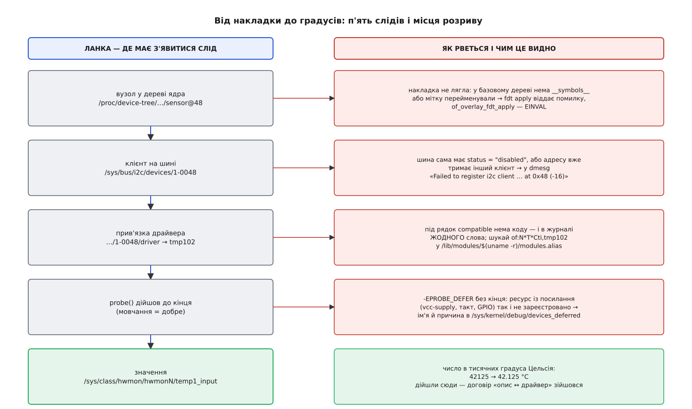

# ⚙️ Датчик на I²C без перезбирання ядра: накладка від тексту до градусів

На платі вже крутиться система, яку ви не збирали: образ ядра підписаний, опис плати зашитий у прошивку, а перезбірка — це пів дня роботи й чуже погодження. До вільних контактів шини I²C припаяно TMP102 — датчик температури за тридцять центів. Драйвер до нього в ядрі давно є. Лишається сказати системі, що датчик існує. Нижче — увесь шлях від пошуку потрібної шини до числа в `/sys`, і разом з ним п'ять місць, де цей шлях зазвичай обривається.

## Крок 0: до якої шини ви припаялися

Накладка адресується не «шині I²C», а конкретному вузлу базового дерева. Знайти його можна не вгадуванням, а за слідом, який ядро вже лишило:

```
$ i2cdetect -l
i2c-1   i2c   Cadence I2C at e0004000   I2C adapter

$ readlink -f /sys/bus/i2c/devices/i2c-1/of_node
/sys/firmware/devicetree/base/axi/i2c@e0004000
```

Другий рядок — головний: він каже, з якого саме вузла дерева виріс адаптер `i2c-1`. Тепер потрібна **мітка** цього вузла — ім'я, за яке чіплятиметься накладка. Мітки лежать в окремому розділі `__symbols__`, де кожен файл названий міткою, а всередині зберігає шлях:

```
$ for f in /sys/firmware/devicetree/base/__symbols__/*; do
      printf '%-10s → %s\n' "${f##*/}" "$(tr -d '\0' < "$f")"
  done | grep i2c
i2c0       → /axi/i2c@e0004000
```

Якщо каталогу `__symbols__` нема взагалі — базове дерево скомпілювали без ключа `-@`, міток у ньому не лишилося, і посилання `<&i2c0>` з накладки не матиме до чого прив'язатися. Це не тупик: замість мітки можна назвати шлях, і саме тому нижче показані обидві форми.

Датчик узагалі відповідає? `i2cdetect -y -r 1` покаже, чи притискає хтось лінію підтвердження за адресою 0x48. Це перевірка пайки, не спосіб дізнатися склад машини: підтвердження каже «хтось є», а не «хто», і на багатьох мікросхемах саме звертання за адресою вже є командою — [шина I²C](topic:com-devices/i2c) не має окремого простору лише для читання, тож обхід адрес поспіль може щось у чужій мікросхемі й перемкнути.

## Накладка — це патч за міткою

```dts
/dts-v1/;
/plugin/;

&i2c0 {
        #address-cells = <1>;
        #size-cells = <0>;
        status = "okay";

        sensor@48 {
                compatible = "ti,tmp102";
                reg = <0x48>;
                vcc-supply = <&vcc3v3>;
                #thermal-sensor-cells = <1>;
        };
};
```

Три рядки тут не декоративні.

`#address-cells` і `#size-cells` доводиться повторювати, хоч на контролері в базовому дереві вони вже стоять. `dtc` компілює накладку **саму по собі**, базового дерева він при цьому не бачить — тож без цих двох рядків йому нічим перевірити ні `reg = <0x48>`, ні одиничну адресу `@48` в імені вузла, і він скаржиться, що покладається на значення за замовчуванням.

`status = "okay"` потрібен, коли на вашій платі контролер вимкнено: виводи нікуди не розведені, і в описі мікросхеми процесора стоїть `status = "disabled"`. Без цього рядка вузол датчика в дерево додасться, а шини не буде — і клієнт не з'явиться ніде.

`vcc-supply` необов'язкова: драйвер бере живлення через `devm_regulator_get_enable_optional(dev, "vcc")`. Нема властивості — драйвер отримує `-ENODEV` і спокійно працює далі. Є властивість — датчик не підніметься, доки не підніметься регулятор, і це найпідступніший зі збоїв нижче.

Форма без міток, коли `__symbols__` у базі відсутній:

```dts
/dts-v1/;
/plugin/;

/ {
        fragment@0 {
                target-path = "/axi/i2c@e0004000";
                __overlay__ {
                        #address-cells = <1>;
                        #size-cells = <0>;
                        status = "okay";

                        sensor@48 {
                                compatible = "ti,tmp102";
                                reg = <0x48>;
                        };
                };
        };
};
```

Запис `&i2c0 { … }` — просто цукор: `dtc` розгортає його рівно в такий `fragment` із `target = <&i2c0>`.

## Компіляція і що насправді робить `-@`

```
$ dtc -@ -I dts -O dtb -o tmp102-sensor.dtbo tmp102-sensor.dts
$ fdtdump tmp102-sensor.dtbo | head -40
```

`<&vcc3v3>` на момент компіляції — число, яке щось означає лише всередині цього одного файлу. Дірку під нього лишає сама директива `/plugin/;`: побачивши її, `dtc` складає розділ `__fixups__` — записи «у властивості за таким зміщенням дірка, яку треба заповнити phandle-ом вузла з міткою `vcc3v3`» — і `__local_fixups__` для посилань усередині самої накладки. Ключ `-@` додає до цього ще й `__symbols__` — мітки самої накладки, потрібні лише тоді, коли поверх неї кластимуть наступну. Розв'язувач у ядрі бере `__fixups__`, шукає ці імена в `__symbols__` **живого** дерева й заповнює дірки справжніми числами.

Тобто ключ, від якого справді залежить, чи ляже накладка, стоїть не тут, а на компіляції **базового** дерева: без його `__symbols__` розв'язувачеві нема де шукати мітку. Це й варто перевіряти першим.

## Накласти: у завантажувачі або на ходу

**У завантажувачі** — шлях без сюрпризів. [U-Boot](topic:sys-unix/bootloader-and-cmdline) зшиває блоби ще до старту ядра, тож ядро отримує вже готове дерево й нічого не знає про накладку:

```
=> load mmc 0:1 ${fdt_addr_r} zynq-zc702.dtb
=> fdt addr ${fdt_addr_r}
=> fdt resize 8192
=> load mmc 0:1 ${fdtoverlay_addr_r} tmp102-sensor.dtbo
=> fdt apply ${fdtoverlay_addr_r}
=> bootm ${kernel_addr_r} - ${fdt_addr_r}
```

`fdt resize` тут не забаганка: накладка дерево збільшує, а завантажений блоб займає в пам'яті рівно свій розмір — без запасу `fdt apply` віддасть помилку браку місця. Те саме можна зробити заздалегідь на робочій машині, взагалі без завантажувача: `fdtoverlay -i zynq-zc702.dtb -o merged.dtb tmp102-sensor.dtbo`.

**На ходу.** Тут пастка, на якій горять посібники. Рецепт

```
# mkdir /sys/kernel/config/device-tree/overlays/tmp102
# cat tmp102-sensor.dtbo > /sys/kernel/config/device-tree/overlays/tmp102/dtbo
```

у ванільному ядрі **не працює, бо такого інтерфейсу там нема**. `drivers/of/Makefile` збирає `overlay.o` під `CONFIG_OF_OVERLAY`, і жодного `configfs.o` поруч не значиться: свого часу патч запропонували, але в основну гілку він так і не потрапив. Він живе у ядрах виробників плат і в модулях поза деревом — тому в одного читача рецепт спрацює, а в другого ні. Перевірка одна: `ls /sys/kernel/config/device-tree` — каталог є чи нема.

Що ваніль справді дає — виклик `of_overlay_fdt_apply()` із коду ядра. Це десяток рядків [модуля](topic:sys-unix/kernel-modules), і саме він робить рецепт відтворюваним будь-де:

```c
// dtbo-load.c — накласти .dtbo з /lib/firmware на живе дерево пристроїв
#include <linux/module.h>
#include <linux/firmware.h>
#include <linux/of.h>
#include <linux/platform_device.h>

static char *dtbo = "tmp102-sensor.dtbo";
module_param(dtbo, charp, 0444);
MODULE_PARM_DESC(dtbo, "ім'я файлу накладки в /lib/firmware");

static struct platform_device *anchor;
static int ovcs_id;

static int __init dtbo_load_init(void)
{
	const struct firmware *fw;
	int ret;

	/* request_firmware потребує справжнього пристрою як власника запиту */
	anchor = platform_device_register_simple("dtbo-load", -1, NULL, 0);
	if (IS_ERR(anchor))
		return PTR_ERR(anchor);

	ret = request_firmware(&fw, dtbo, &anchor->dev);
	if (ret) {
		dev_err(&anchor->dev, "нема %s у /lib/firmware: %d\n", dtbo, ret);
		goto err;
	}

	/* NULL як ціль — накладати на все дерево, а не на піддерево */
	ret = of_overlay_fdt_apply(fw->data, fw->size, &ovcs_id, NULL);
	release_firmware(fw);
	if (ret) {
		dev_err(&anchor->dev, "накладка не лягла: %d\n", ret);
		goto err;
	}
	return 0;

err:
	platform_device_unregister(anchor);
	return ret;
}

static void __exit dtbo_load_exit(void)
{
	of_overlay_remove(&ovcs_id);
	platform_device_unregister(anchor);
}

module_init(dtbo_load_init);
module_exit(dtbo_load_exit);
MODULE_LICENSE("GPL");
```

Четвертий аргумент `of_overlay_fdt_apply()` — цільове піддерево — з'явився не одразу: у старіших ядрах виклик приймає три аргументи, і `NULL` там зайвий. Далі все робиться само: ядро сповіщає підсистеми про нові вузли, підсистема I²C ловить це сповіщення, знаходить адаптер-батька й реєструє клієнта. `insmod dtbo-load.ko` — і датчик має з'явитися.

## П'ять слідів: як перевірити й де воно рветься

Перевіряти треба не «чи працює», а **де саме обірвалося**. Ланцюг короткий, і кожна ланка лишає власний слід:

```
$ ls /proc/device-tree/axi/i2c@e0004000/ | grep sensor
sensor@48
$ ls /sys/bus/i2c/devices/
1-0048  i2c-1
$ basename "$(readlink /sys/bus/i2c/devices/1-0048/driver)"
tmp102
$ cat /sys/class/hwmon/hwmon2/temp1_input
42125
```

Останнє число — тисячні градуса Цельсія, тобто 42.125 °C: одиниці задає не драйвер, а [клас hwmon](topic:sys-unix/hwmon), спільний для всіх датчиків у ядрі, — тому будь-який термометр читається однаково. Номер у `hwmon2` при цьому не сталий: це просто порядок реєстрації, і після перезавантаження він може бути іншим. Дійшли сюди — договір між описом і драйвером зійшовся.



*Кожна ланка лишає слід у своєму місці файлової системи; порожньо на якомусь кроці — і причина шукається саме там, а не в наступних.*

**Вузол є, клієнта нема.** Найчастіше шина вимкнена: `tr -d '\0' < /proc/device-tree/axi/i2c@e0004000/status` покаже `disabled`. Другий варіант — адресу вже тримає інший клієнт; тоді в [журналі ядра](topic:sys-unix/kernel-log-printk) буде `Failed to register i2c client sensor at 0x48 (-16)`, а `-16` — це `-EBUSY`.

**Клієнт є, драйвера нема — і в журналі тиша.** Цей випадок збиває з пантелику саме мовчанням: із погляду ядра все гаразд, просто до пристрою нема чого чіпляти, і скаржитися нема на що. Перевіряється поза журналом: `grep 'ti,tmp102' /lib/modules/$(uname -r)/modules.alias`. Порожньо — драйвера в цій збірці ядра нема взагалі, і ніяка правка накладки не допоможе. Є рядок, а модуль не вантажиться — питання до `depmod` і до `modules.dep`.

**Драйвер є, але прив'язки нема.** Тут працює механізм відкладеної прив'язки: `probe()` побачив, що потрібного ресурсу ще нема, повернув `-EPROBE_DEFER`, і ядро відкладає пристрій до появи наступного драйвера ([модель пристроїв](topic:sys-unix/sysfs-device-model) робить це для всіх однаково). Якщо ресурс не з'явиться ніколи, пристрій так і висітиме — тихо. Побачити це можна лише в одному місці:

```
$ cat /sys/kernel/debug/devices_deferred
1-0048	Failed to enable regulator
```

Формат — ім'я пристрою, табуляція, причина: той самий текст, який драйвер передав у `dev_err_probe()`. Наш рядок означає, що `vcc-supply` посилається на регулятор, драйвера якого в системі нема. Лікується або тим, що регулятор описують і піднімають, або тим, що властивість прибирають зовсім — тоді драйвер дістане `-ENODEV` і піде далі.

У накладки, застосованої на ходу, тут є власна пастка, якої нема в завантажувальному шляху. Ядро перебирає відкладені пристрої не за таймером, а **щоразу, коли реєструється новий драйвер або успішно прив'язується черговий пристрій**: поки система стартує, і те, і те відбувається потоком, і черга крутиться сама собою. Ви ж накладаєте свою накладку тоді, коли все вже піднялося й потік скінчився. Датчик відкладається — і більше ніщо його не штовхне, навіть якщо потрібний драйвер спокійно лежить на диску. Тому порядок важливий: спершу `modprobe` постачальника, потім накладка; а якщо порядок уже зіпсовано, черга зрушить від завантаження будь-якого нового модуля.

**Накладка взагалі не лягла.** `fdt apply` віддає помилку, `insmod` — `-EINVAL`, а в журналі стоїть точна причина: `node label 'vcc3v3' not found in live devicetree symbols table` (мітку перейменували або її ніколи не було) чи `no symbols in root of device tree` (базове дерево зібране без `-@`). Набір міток базового опису — така сама частина договору, як `compatible`.

## Скільки це коштує і коли не треба зовсім

Накладку, застосовану з коду, можна зняти — `rmmod` покличе `of_overlay_remove()`, — але лише поки ніхто не тримає створених нею вузлів; зайнятий пристрій зняттю не піддасться. Тому на робочих платах накладки частіше зшивають у завантажувачі: там ядро отримує вже цілісне дерево й жодної динаміки не бачить.

І остання ощадність. Якщо все, що вам треба, — один клієнт на I²C без переривань і без регулятора, дерево можна не чіпати:

```
# echo tmp102 0x48 > /sys/bus/i2c/devices/i2c-1/new_device
```

Клієнт створиться просто зараз, драйвер прив'яжеться, температура з'явиться. Ціна очевидна з самої форми запису: тут нема куди подіти ні `interrupts`, ні `vcc-supply`, і після перезавантаження від цього рядка не лишиться нічого. Накладка потрібна рівно тоді, коли опис має пережити вимкнення живлення й нести більше, ніж саму адресу.
