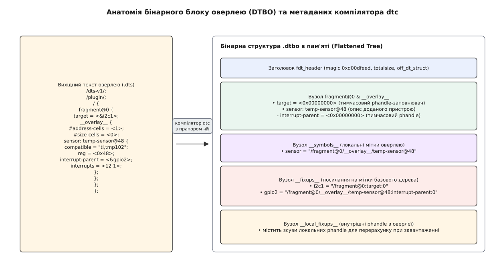
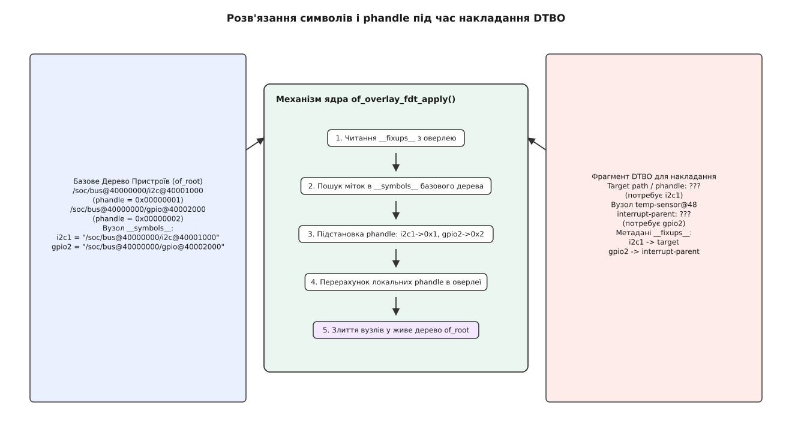
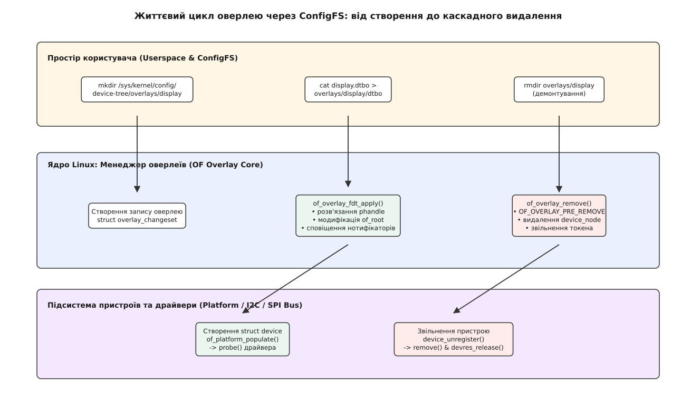

<preknowlist>
- [Базові концепції Дерева Пристроїв](root:sys-unix/device-tree)
- [Модель пристроїв та файлова система sysfs](root:sys-unix/sysfs-device-model)
- [Архітектура та життєвий цикл модулів ядра](root:sys-unix/kernel-modules)
- [Управління ресурсами драйверів (devres)](root:sys-unix/devm-resource-lifetime-in-probe)
</preknowlist>

Статична модель Дерева Пристроїв (Device Tree, DT), за якої конфігурація апаратних компонентів зчитується одноразово під час завантаження системи з блобу `.dtb`, виявляється непридатною для систем із динамічною топологією. У вбудованих обчислювачах із модулями розширення, програмованими логічними матрицями (FPGA) та шинами гарячого підключення (hot-plug) складові частини апаратури з'являються, змінюють свій стан або вилучаються безпосередньо під час виконання. Спроба оновити конфігурацію шляхом перезавантаження всього статичного дерева вимагає рестарту ядра, що є неприпустимим у системах реального часу та критичній інфраструктурі.

Динамічні оверлеї Дерева Пристроїв (Device Tree Overlays, DTBO) вирішують цю проблему, надаючи ядрові Linux механізм модифікації існуючого графа `of_root` в оперативній пам'яті просто під час роботи системи. Оверлей є компільованим фрагментом Дерева Пристроїв, який містить описи нових вузлів, зміни властивостей існуючих компонентів і спеціальні таблиці релокації посилань (phandle). Ядро інтегрує ці зміни за допомогою транзакційного механізму, що забезпечує атомарне розгортання дерева, реєстрацію нових шин та ініціалізацію відповідних драйверів пристроїв.

## 1. Конфлікт статичного опису та динамічної апаратури

У класичній архітектурі Linux для вбудованих платформ (ARM32, ARM64, RISC-V, PowerPC) завантажувач (U-Boot, Barebox або edk2/UEFI) передає ядрові за адресою у фізичній пам'яті один суцільний двійковий блок Flattened Device Tree (FDT). Під час ранньої фази ініціалізації (`setup_arch()`) ядро викликає функцію `unflatten_device_tree()`, яка розгортає цей бінарний блоб у динамічну структуру зв'язаних вузлів `struct device_node`, утворюючи глобальне дерево `of_root`. Після завершення цієї фази дерево вважається незмінним: підсистема `of_platform_default_populate()` сканує вузли, створює відповідні пристрої `struct platform_device` та зв'язує їх із драйверами.

Історично склалося так, що будь-яка зміна периферійного оснащення — наприклад, підключення датчика до шини I2C, зміна розпіновки GPIO або зміна режиму роботи контролера PWM — вимагала від розробника редагування початкового коду `.dts`, його перекомпіляції у `.dtb` та перезавантаження операційної системи. Детальний шлях становлення підсистеми від перших хаків ARM-платформ до впровадження уніфікованого стандарту описано у вставці [Історія та еволюція DTBO](root:sys-unix/devicetree-overlays-and-dtbo/hist-dtbo-evolution.md).

Поява сучасних гетерогенних обчислювачів та модульних комп'ютерів виявила фундаментальні обмеження статичного підходу:

1. **Комбінаторний вибух файлів DTB:** Для плати з `N` можливими слотами розширення та `M` видами модулів кількість необхідних статичних конфігурацій `.dtb` зростає за експоненційним законом як `M^N`. Зберігати всі варіації у прошивці завантажувача або у файловій системі `BOOT` стає технічно неможливим.
2. **Апаратура з динамічним завантаженням (FPGA/SoC):** Сучасні програмовані логічні матриці (Xilinx Zynq UltraScale+, Intel Stratix 10, Microchip PolarFire) завантажують бітстрім прошивки під час виконання. Вузли периферійних контролерів, що з'являються всередині логіки FPGA, фізично відсутні у момент старту ядра операційної системи.
3. **Модулі гарячого підключення (Hot-Plug):** Периферійні плати розширення стандарту Raspberry Pi HAT або BeagleBone Cape містять на борту енергонезалежну пам'ять (EEPROM) із сирими даними DTBO. Системний сервіс під час підключення плати повинен зчитати вміст EEPROM та накласти відповідну конфігурацію на працююче ядро без переривання роботи основних служб.
4. **Передавання конфігурації на етапі завантаження (Bootloader Hand-off):** У багатьох сценаріях сам завантажувач U-Boot виявляє ревізію материнської плати та застосовує серію оверлеїв через команду `fdt apply` ще до передачі управління ядру. Це дозволяє використовувати один універсальний `uImage/Image` та єдиний базовий DTB для цілого сімейства апаратних ревізій.
5. **Автоматизація в системах збірки (Yocto / Buildroot):** Сучасні генератори дистрибутивів Embedded Linux активно застосовують оверлеї для розділення бази платформи та специфічної конфігурації клієнта. Базовий рецепт Yocto збирає канонічний `base.dtb`, а додаткові шари (meta-layers) додають відповідні `.dtbo` для конкретних модифікацій обладнання.

Динамічні оверлеї переводять опис апаратури зі статики у динаміку: базове Дерево Пристроїв експортує глобальні таблиці символів, а оверлеї підключаються до цих символів у довільний момент часу.

## 2. Анатомія та джерельний синтаксис DTBO

Джерельний код оверлею описується мовою Device Tree Source (DTS), але містить спеціальні директиви та структуру фрагментів, які відрізняють його від стандартного файлу `.dts`.

### 2.1. Структура файлу DTS оверлею
Для позначення того, що компілятор `dtc` має згенерувати саме оверлей, у початку файлу вказується директива `/plugin/`. Корисне навантаження розділяється на незалежні фрагменти (`fragment@0`, `fragment@1`), кожен з яких вказує на цільову точку прив'язки (target) у базовому дереві та містить новий підграф `__overlay__`.

```dts
/dts-v1/;
/plugin/;

/ {
    compatible = "brcm,bcm2835";

    fragment@0 {
        target = <&i2c1>;
        __overlay__ {
            #address-cells = <1>;
            #size-cells = <0>;
            status = "okay";

            sensor@48 {
                compatible = "ti,tmp102";
                reg = <0x48>;
                interrupt-parent = <&gpio>;
                interrupts = <23 8>;
            };
        };
    };
};
```

Цільова точка накладання вказується одним із двох способів:
* `target = <&label>` — посилання на мітку (label) вузла базового дерева. Компілятор створює записи релокації для розв'язання під час завантаження.
* `target-path = "/soc/i2c@7e205000"` — абсолютний шлях до вузла у граф `of_root`. Використовується, якщо цільовий вузол не має експортованої мітки у базовому дереві.

Зверніть увагу на важливість конфігурації адресних осередків (`#address-cells` та `#size-cells`). Якщо оверлей додає підпорядкований пристрій до шини I2C або SPI, ці властивості у вузлі `__overlay__` мають точно відповідати специфікації цільової шини батьківського вузла. Незбіг кількості адресних осередків призведе до помилки інтерпретації діапазонів пам'яті та регістрів пристрою функцією `of_translate_address()`.

### 2.2. Мета-вузли та релокаційні таблиці у бінарному DTBO
Під час компіляції оверлею командою `dtc -@ -I dts -O dtb -o overlay.dtbo overlay.dts` компілятор створює не лише бінарні теги вузлів і властивостей, а й додаткові системні мета-вузли: `__symbols__`, `__fixups__` та `__local_fixups__`.


*Рис. 1: Анатомія джерельного синтаксису DTS та метаданих бінарного файлу DTBO*

Кожен мета-вузол виконує чітко визначену роль при зв'язуванні блобу з ядром:

1. **`__symbols__`:** Містить список міток, визначених *усередині* самого оверлею, та їхні локальні цілі (наприклад, `sensor_label = "/fragment@0/__overlay__/sensor@48"`). Вони дозволяють наступним оверлеям посилатися на пристрої, створені цим оверлеєм.
2. **`__fixups__`:** Таблиця зовнішніх залежностей. Запис `i2c1 = "/fragment@0:target:0"` означає, що за зміщенням 0 у властивості `target` фрагмента 0 знаходиться локальний тимчасовий phandle, який ядро має замінити на реальне значення phandle вузла `i2c1` із базового дерева `of_root`.
3. **`__local_fixups__`:** Таблиця внутрішніх посилань оверлею. Вказує на поля усередині `__overlay__`, які посилаються на сусідні вузли цього ж оверлею (наприклад, `interrupt-parent = <&gpio_node>`). Оскільки локальні phandle перераховуються під час накладання для уникнення колізій із базовим деревом, ці внутрішні посилання також потребують відповідного зсуву по значеннях.

З фізичного боку бінарний блоб `.dtbo` повністю дотримується стандарту Flattened Device Tree. Перші 40 байт займає заголовок `struct fdt_header`, за яким слідують блоки резервованої пам'яті (`off_mem_rsvmap`), блок структури тегів (`off_dt_struct`) та таблиця рядків (`off_dt_strings`). Усередині блоку структури керуючі теги `FDT_BEGIN_NODE` (0x00000001), `FDT_END_NODE` (0x00000002), `FDT_PROP` (0x00000003) та `FDT_NOP` (0x00000004) кодують вищевказані мета-вузли поруч із корисним навантаженням.

Без прапора компілятора `-@` (або `CONFIG_DTC_FLAGS="-@"`) компілятор `dtc` не створює вузли `__fixups__` та `__symbols__`, що робить бінарний блог непридатним для динамічного накладання у ядрі.

## 3. Внутрішній механізм ядра: `of_overlay_fdt_apply()` та розв'язання phandle

Накладання DTBO на глобальне дерево `of_root` здійснюється за допомогою внутрішніх системних функцій ядра, зосереджених у файлі `drivers/of/overlay.c`. Головною точкою входу є функція `of_overlay_fdt_apply()`.

### 3.1. Етапи розгортання та зв'язування
Процес зв'язування оверлею складається з кількох послідовних кроків, кожен з яких може перервати транзакцію у разі виявлення помилок.


*Рис. 2: Послідовність розв'язання посилань та застосування транзакцій у ядрі*

Повний алгоритм обробки бінарного блобу ядром охоплює такі дії:

```
[Сирий DTBO блоб]
       │
       ▼
 1. of_fdt_unflatten_tree()   ──► Створення тимчасового графа device_node
       │
       ▼
 2. of_resolve_phandles()     ──► Пошук міток у global __symbols__ та заміна u32 phandle
       │
       ▼
 3. of_overlay_apply()        ──► Формування транзакції of_changeset (додавання/зміна вузлів)
       │
       ▼
 4. __of_changeset_apply()    ──► Модифікація графа of_root під of_mutex
       │
       ▼
 5. Bus Notifiers & Probe     ──► Створення platform_device та виклик probe() драйверів
```

Під час розгортання блобу функція `of_fdt_unflatten_tree()` виділяє оперативну пам'ять із ядерного пулу `kmalloc()` для кожної структури `struct device_node` та `struct property`. Кожен створений вузол має лічильник посилань, який беруть і повертають через `of_node_get()`/`of_node_put()`, — саме він не дає вузлові зникнути з-під того, хто його читає, зокрема через `/proc/device-tree`.

Уніфікований парсер FDT зчитує поля заголовка `fdt_header` та обходить блок структури. Для кожного тегу `FDT_BEGIN_NODE` ядро створює екземпляр `struct device_node` і заповнює такі поля:
* `name` — ім'я вузла (наприклад, `sensor@48`).
* `full_name` — повний абсолютний шлях у тимчасовому дереві.
* `properties` — однозв'язний список об'єктів `struct property`.
* `phandle` — унікальний 32-бітний ідентифікатор вузла.

### 3.2. Розв'язання phandle (Phandle Resolution)
Для кожного запису у мета-вузлі `__fixups__` ядро шукає відповідний рядок символу у глобальному дереві `of_root` за шляхом `/__symbols__`. 

Якщо символ знайдено, ядро отримує значення властивості `phandle` цільового вузла. Далі ядро перезаписує 32-бітне число за вказаним зміщенням у властивості `target` або у тілі `__overlay__`. Якщо символ відсутній у базовому дереві, `of_resolve_phandles()` повертає помилку `-ENODEV`, а накладання скасовується.

Процес розв'язання посилань виконує такі дії над 32-бітними цілими:
1. Зчитування значення `target_phandle = of_node_to_phandle(target_node)`.
2. Конвертація з мережевого порядку байтів (Big-Endian) у формат процесора через `be32_to_cpu()`.
3. Перезапис відповідного слова у масиві властивості `prop->value`.
4. Зсув усіх внутрішніх phandle оверлею на величину `phandle_delta = max_phandle(of_root) + 1`, що виключає дублювання ідентифікаторів унікальних вузлів у глобальній системі.

Функція `of_resolve_phandles()` обробляє також локальні релокації з вузла `__local_fixups__`. Вона покроково обходить дерево властивостей і додає значення `phandle_delta` до кожного 32-бітного слова, позначеного у таблиці локальних зсувів. Це забезпечує збереження внутрішніх зв'язків між вузлами оверлею (наприклад, посилання пристрою на створений у тому ж оверлеї контролер GPIO або генератор тактового сигналу clock-controller).

### 3.3. Транзакційний механізм: `struct of_changeset`
Динамічна зміна графа Дерева Пристроїв під час роботи ядра є потенційно небезпечною операцією. Якщо під час злиття дерев станеться збій пам'яті або скасування операції, ядро опиниться у невизначеному стані. Щоб запобігти цьому, підсистема Open Firmware використовує паттерн «Транзакція» (Changeset).

Детальний аналіз структур `struct of_changeset`, `struct of_changeset_entry` та процедур трасування наведено у вставці [API та внутрішній інтерфейс ядра для DTBO](root:sys-unix/devicetree-overlays-and-dtbo/api-dtbo-kernel-interfaces.md).

Транзакція накопичує список атомарних дій у двозв'язному списку:
* `OF_RECONFIG_ATTACH_NODE` — приєднання нового вузла `device_node`.
* `OF_RECONFIG_DETACH_NODE` — видалення вузла з графа.
* `OF_RECONFIG_ADD_PROPERTY` — додавання нової властивості.
* `OF_RECONFIG_UPDATE_PROPERTY` — заміна значення існуючої властивості.
* `OF_RECONFIG_REMOVE_PROPERTY` — вилучення властивості з вузла.

Операції застосовуються атомарно під захистом глобального м'ютекса `of_mutex`. Якщо всі кроки проходять успішно, змінний стан графа фіксується, а в sysfs викликом `sysfs_create_dir()` оновлюються відповідні дзеркальні каталоги у `/sys/firmware/devicetree/base`. Якщо на будь-якому етапі виникає помилка, функція `of_changeset_revert()` відкочує всі вже виконані кроки у зворотному порядку, повертаючи дерево у вихідний стан.

## 4. Інтерфейси простору користувача: ConfigFS та життєвий цикл

Керувати оверлеями з простору користувача дає змогу інтерфейс поверх ConfigFS (`/sys/kernel/config/device-tree/overlays`). Межа тут важлива: до основного дерева ядра цей інтерфейс так і не потрапив — mainline експортує лише внутрішній C-API `of_overlay_fdt_apply()`, а каталог `overlays` з'являється у вендорських гілках (Xilinx linux-xlnx, збірки BeagleBone) або через позадеревний модуль на кшталт `dtbocfg`.

### 4.1. Взаємодія з ConfigFS
Життєвий цикл оверлею регулюється стандартними файловими операціями POSIX над віртуальними каталогами та атрибутами.


*Рис. 3: Життєвий цикл оверлею через ConfigFS та сповіщення драйверів*

Процес керування оверлеєм описується такими кроками:

1. **Створення каталогу:** Команда `mkdir /sys/kernel/config/device-tree/overlays/my_overlay` створює новий підкаталог. Ядро виділяє внутрішню структуру `struct cfs_overlay_item`.
2. **Передача бінарного блобу:** Операція `cat overlay.dtbo > /sys/kernel/config/device-tree/overlays/my_overlay/dtbo` передає вміст `.dtbo` у ядро. Передача має бути виконана за один системний виклик `write()`.
3. **Автоматичне накладання:** Запис у файл `dtbo` ініціює виклик `of_overlay_fdt_apply()`. Ядро перевіряє заголовок FDT, розв'язує phandle, застосовує транзакцію та створює нові пристрої на шинах.
4. **Контроль статусу:** Зчитування файла `cat .../my_overlay/status` повертає рядок `"applied\n"` або коди помилок у разі невдачі.
5. **Демонтування:** Команда `rmdir /sys/kernel/config/device-tree/overlays/my_overlay` ініціює зворотний процес: зупинку драйверів, вилучення вузлів та відкіт транзакції `of_changeset`.

Після успішного накладання оверлею результати модифікації миттєво відображаються у віртуальній файловій системі `/proc/device-tree` (яка є символьним посиланням на `/sys/firmware/devicetree/base`). Утиліти простору користувача (наприклад, `dtc -I fs /proc/device-tree`) можуть зчитати поточний стан розгорнутого дерева разом зі створеними вузлами.

Повний приклад утиліти завантаження оверлеїв мовами C та C++ з використанням RAII та системних викликів розібрано у вставці [Розробка утиліти керування DTBO через ConfigFS](root:sys-unix/devicetree-overlays-and-dtbo/proj-dtbo-configfs-loader.md).

### 4.2. Сповіщення шин та ініціалізація драйверів
Після модифікації графа `of_root` ядро має перетворити нові вузли `device_node` на системні пристрої. Робить це не код оверлеїв, а сама транзакція: кожен її крок ядро розсилає ланцюжком сповіщень реконфігурації (`of_reconfig_notifier_chain`).

На подію `OF_RECONFIG_ATTACH_NODE` підписані ядра шин (обробники `of_platform_notify`, `of_i2c_notify`, `of_spi_notify`), і саме вони створюють пристрої:
* Для шини Platform — `of_platform_device_create()`.
* Для шини I2C — `of_i2c_register_device()`.
* Для шини SPI — `of_register_spi_device()`.

Підсистема драйверів шукає відповідний `struct device_driver` за властивістю `compatible` у таблиці `of_device_id` і викликає функцію `probe()`.

Під час ініціалізації драйвер зчитує параметри пристрою з Дерева Пристроїв через функції API `of_property_read_u32()`, `of_property_read_string()`, `gpiod_get()` та `platform_get_irq()`. Якщо всі необхідні ресурси доступні, драйвер повертає 0 з функції `probe()`, а пристрій переходить у стан готовності до експлуатації.

Під час вилучення оверлею (`rmdir`) процес іде у зворотному порядку:
1. Ядро розсилає сповіщення `OF_RECONFIG_DETACH_NODE`, і ті самі обробники шин знімають свої пристрої з реєстрації.
2. Ядро викликає метод `remove()` відповідного драйвера. Драйвер вивільняє ресурси, оброблені через `devm_*` (Devres).
3. Пристрій видаляється з системної шини.
4. Вузол `device_node` відключається від Дерева Пристроїв і вивільняє пам'ять.

### 4.3. Одночасний доступ та синхронізація у просторі користувача
У багатопотокових або багатозадачних системах кілька процесів простору користувача можуть одночасно намагатися створити або видалити оверлеї у файловій системі ConfigFS. Підсистема ConfigFS забезпечує внутрішнє блокування на рівні каталогів VFS завдяки мутексу `configfs_subsystem.su_mutex`. 

Однак на рівні підсистеми Open Firmware діє додаткова синхронізація: глобальний `of_mutex` гарантує, що дві одночасні операції `write()` в атрибут `dtbo` різних оверлеїв будуть вишикувані в послідовну чергу. Це виключає ситуацію race condition, коли два оверлеї намагаються одночасно розв'язати phandle або внести суперечливі зміни в один і той самий цільовий вузол `target`.

## 5. Безпека, ціна продуктивності та крайові випадки

Застосування динамічних оверлеїв додає системі гнучкості, але створює низку ризиків для безпеки та стабільності ядра.

### 5.1. Ризики безпеки (Security Considerations)
Прийняття бінарного блоку DTBO з простору користувача є потенційним вектором атак на ядро Linux:

* **Виконання неавторизованого коду:** Шляхом підробки оверлею зловмисник може змінити властивості `reg` контролера DMA або конфігурацію захисту пам'яті (MMU/IOMMU), отримавши доступ до чужих областей фізичної пам'яті.
* **Перехоплення переривань:** Оверлей може підмінити `interrupt-parent` критичного системного пристрою, спрямувавши лінії IRQ на власний драйвер-перехоплювач або викликавши шторм переривань (Interrupt Storm).
* **Підробка символів:** Запис у файл `dtbo` без перевірки цифрового підпису дозволяє непривілейованим процесам (якщо ConfigFS доступний для запису) модифікувати будь-які вузли ядра.
* **Виснаження пам'яті (DoS):** Безперервне створення оверлеїв із великою кількістю дрібних вузлів виснажує slab-кеші ядра, що може призвести до активації OOM Killer.

Через ці ризики шлях із простору користувача у системах з акцентом на безпеку (Secure Boot, Lockdown mode) або відсутній узагалі — як у mainline, — або лишається вимкненим у вендорській збірці, і єдиним дозволеним джерелом оверлеїв стає блоб, який перевірив завантажувач.

### 5.2. Продуктивність та накладні витрати пам'яті
Ввімкнення генерації символів (`dtc -@`) збільшує розмір базового блобу DTB на 15–30%. Ядро змушене зберігати додаткові текстові рядки назв міток та таблиці `__symbols__` в оперативній пам'яті протягом усього часу роботи системи.

Пошук символів під час `of_resolve_phandles()` має лінійну складність `O(N)` від кількості експортованих міток. Якщо система завантажує десятки складних оверлеїв, час розв'язання посилань зростає, що слід враховувати у сценаріях реального часу.

### 5.3. Крайові випадки та конфлікти видалення
Найбільш критичні збої підсистеми DTBO виникають при намаганні видалити оверлей:

1. **Завислі вказівники (Dangling Pointers):** Якщо драйвер пристрою зберіг прямий вказівник на `struct device_node` у власних внутрішніх структурах і не обнулив його під час `remove()`, звернення до цієї пам'яті після `rmdir` призведе до паніки ядра (Kernel Use-After-Free).
2. **Використання ресурсів (`EBUSY`):** Якщо пристрій з оверлею утримує відкритим файловий дескриптор у просторі користувача (наприклад, відкритий файл `/dev/spidev0.0`), системна шина відхилить видалення пристрою, а `rmdir` поверне помилку `EBUSY`.
3. **Порушення порядку залежностей:** Якщо Оверлей B посилається на символ, створений Оверлеєм A, то спроба видалити Оверлей A раніше за Оверлей B призведе до виникнення розірваних phandle у графі `of_root`. Ядро відстежує ці залежності та блокує вилучення батьківських оверлеїв.
4. **Конфлікти доменів переривань (IRQ Domains):** Якщо оверлей створює контролер переривань (підсистема `irq_domain`), видалення оверлею вимагає попереднього скасування реєстрації всіх відображених ліній переривань через `irq_dispose_mapping()`. Якщо підключені периферійні драйвери не вивільнили свої handler, видалення оверлею буде заблоковане ядром.
5. **Конфігурація мультиплексування пінів (Pinctrl):** Під час демонтування оверлею підсистема pinctrl повинна повернути лінії GPIO у безпечний стан (Float або High-Z). Якщо оверлей не визначав стан `pinctrl-0` для сбросу, лінії I/O можуть залишитися підтягнутими до живлення, що викликає витоки струму у сплячому режимі.
6. **Витоки динамічних годинників (Clocks & Power Domains):** При вилученні вузла з графа підсистеми Common Clock Framework (CCF) та Generic Power Domains (genpd) повинні скасувати підписку на тактові частоти та регулятори напруги. Якщо периферійний драйвер не відключив джерело тактування у методі `remove()`, лінія тактування залишається активною, збільшуючи енергоспоживання платформи.

## 6. Синтез: Майбутнє динамічного опису апаратури у Linux

Динамічні оверлеї Дерева Пристроїв перетворили Linux з операційної системи з жорстко зафіксованою конфігурацією на систему, не прив'язану до однієї конфігурації й здатну підлаштуватися під зміни апаратури. Механізми `of_overlay_fdt_apply()` та `of_changeset` усунули потребу у перекомпіляції ядерних блобів та перезавантаженні обладнання, забезпечивши підтримку сучасних гетерогенних SoC, систем FPGA та промислових шин гарячої заміни.

Еволюція підсистеми продовжується в напрямку підвищення безпеки та інтеграції з новітніми стандартами:

* **Зв'язок із таблицями ACPI (SSDT Overlays):** На архітектурах x86_64 та серверних ARM64 платформах динамічний оверлеїнг реалізується через накладання додаткових системних таблиць SSDT (Secondary System Description Table) у середовищі ACPI, що використовує аналогічні транзакційні підходи до моніторингу пристроїв.
* **Rust у ядрі Linux:** З появою мови Rust у ядрі розробляються безпечні abstractions для підсистеми Open Firmware (модуль `kernel::of`), які усувають ризики витоків пам'яті та Use-After-Free при маніпуляціях із вузлами на рівні компілятора.
* **Криптографічний підпис оверлеїв (Signed DTBO):** Розробка криптографічної верифікації бінарних блоків DTBO через підсистему IMA/EVM дає змогу безпечно застосовувати динамічний оверлеїнг у захищених промислових та автомобільних операційних системах (Automotive Grade Linux).

Підсистема DTBO залишається фундаментальним інструментом системного програміста для проектування гнучких, надійних та високоефективних вбудованих Linux-комп'ютерів.
