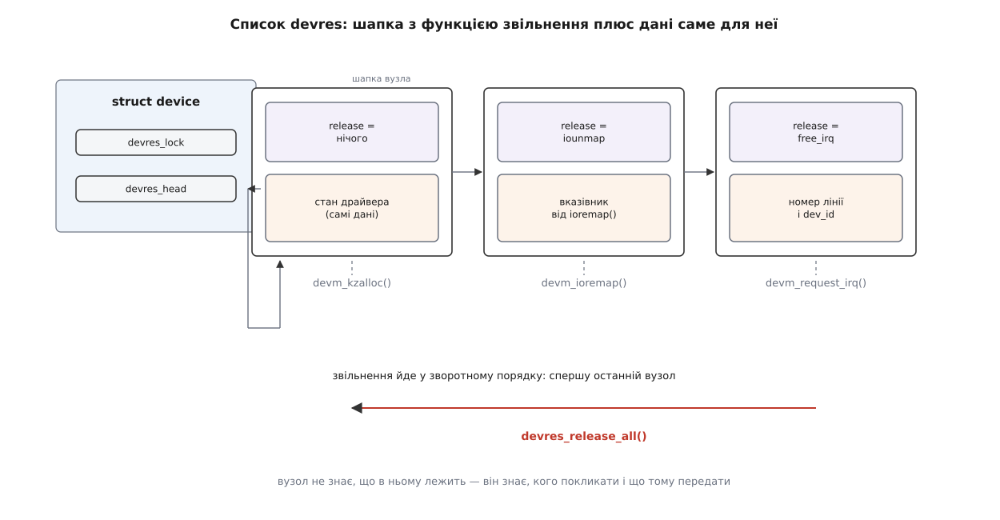
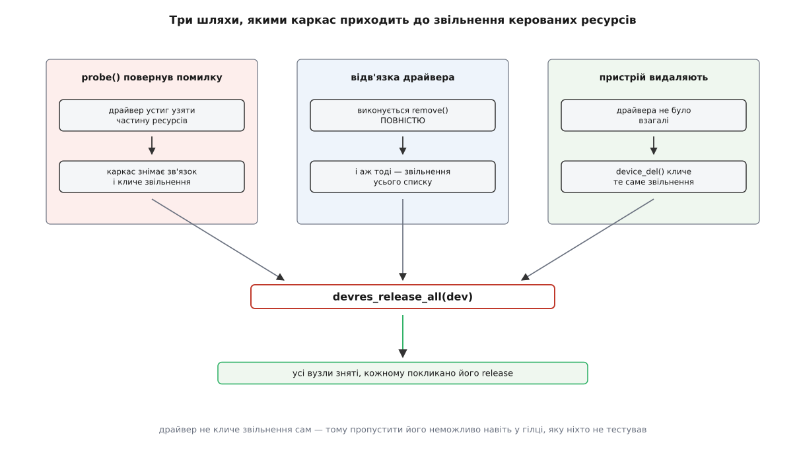
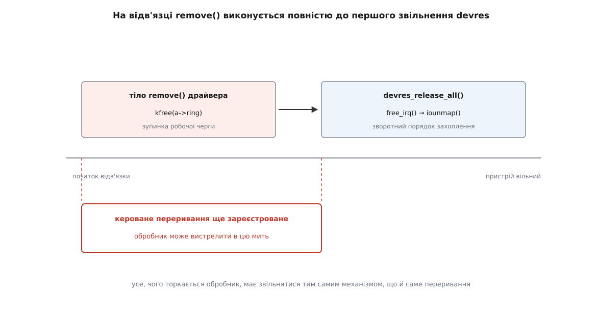

# Керовані ресурси драйвера: сімейство devm_ і автоматичне звільнення

<preknowlist>
- [Прив'язка драйвера до пристрою](root:sys-unix/driver-probe-and-binding) — коли ядро кличе `probe()` і `remove()`, що таке відв'язка й відкладена спроба.
- [Модель пристроїв у sysfs](root:sys-unix/sysfs-device-model) — `struct device` як окремий довгоживучий об'єкт ядра, а не просто запис у драйвері.
- [Пам'ять ядра: slab](root:sys-unix/kernel-memory-slab) — `kmalloc`/`kfree`, прапорці `GFP_`, і те, що в ядрі ніхто не прибирає за тобою.
- [Переривання, softirq і робочі черги](root:sys-unix/interrupts-bottom-halves) — обробник виконується асинхронно, доки лінія лишається зареєстрованою.
- [Регістри пристрою в пам'яті](root:sys-unix/mmio-and-ioremap) — `ioremap`, захоплений діапазон і чому його треба віддавати.
- [Шина platform](root:sys-unix/platform-bus) — звідки драйвер бере діапазон регістрів, переривання й такт для пристрою, який не можна опитати.
- [Модулі ядра](root:sys-unix/kernel-modules) — код драйвера з'являється й зникає за життя працюючої системи.
</preknowlist>

Драйвер невеличкого датчика на платі захоплює півдюжини речей, перш ніж почне працювати: пам'ять під свій стан, діапазон регістрів, тактовий сигнал, регулятор живлення, лінію переривання, місце в підсистемі. Кожне з цих захоплень може не вдатися. І кожне вдале захоплення до того моменту треба скасувати — рівно ті, що вже відбулися, і рівно у зворотному порядку.

Ось як це виглядає, коли писати чесно й руками:

```c
static int acme_probe(struct platform_device *pdev)
{
	struct resource *res;
	struct acme *a;
	int ret;

	a = kzalloc(sizeof(*a), GFP_KERNEL);
	if (!a)
		return -ENOMEM;

	res = platform_get_resource(pdev, IORESOURCE_MEM, 0);
	if (!res) {
		ret = -EINVAL;
		goto err_free;
	}

	a->regs = ioremap(res->start, resource_size(res));
	if (!a->regs) {
		ret = -ENOMEM;
		goto err_free;
	}

	a->clk = clk_get(&pdev->dev, NULL);
	if (IS_ERR(a->clk)) {
		ret = PTR_ERR(a->clk);
		goto err_unmap;
	}

	ret = clk_prepare_enable(a->clk);
	if (ret)
		goto err_put_clk;

	a->irq = platform_get_irq(pdev, 0);
	if (a->irq < 0) {
		ret = a->irq;
		goto err_disable_clk;
	}

	ret = request_irq(a->irq, acme_isr, 0, "acme", a);
	if (ret)
		goto err_disable_clk;

	a->hwmon = hwmon_device_register_with_info(&pdev->dev, "acme", a,
						   &acme_chip_info, NULL);
	if (IS_ERR(a->hwmon)) {
		ret = PTR_ERR(a->hwmon);
		goto err_free_irq;
	}

	platform_set_drvdata(pdev, a);
	return 0;

err_free_irq:
	free_irq(a->irq, a);
err_disable_clk:
	clk_disable_unprepare(a->clk);
err_put_clk:
	clk_put(a->clk);
err_unmap:
	iounmap(a->regs);
err_free:
	kfree(a);
	return ret;
}
```

Половина функції — не робота з пристроєм, а сходинки для відступу. Причому цю саму драбину доводиться написати ще раз, у зворотному вигляді, у `remove()`: коли драйвер відв'язують від справного пристрою, скасувати треба все те саме, тільки без розгалужень. Дві копії одного порядку в різних місцях файла — і кожна правка мусить бути внесена в обидві. Варто додати в середину `probe()` ще одне захоплення й забути вставити мітку — і з'явиться витік, який ніяк себе не виявить: пристрій просто перестане з'являтися після кількох перепідключень, бо діапазон регістрів так і лишився зайнятим.

Ще прикріше те, що шлях помилки в `probe()` проходять **часто**. Драйвер, якому ще не готовий постачальник такту, повертає `-EPROBE_DEFER`, і ядро кличе `probe()` заново — раз за разом, доки залежність не з'явиться. Кожна така спроба встигає щось захопити й мусить усе повернути. Код, який виконують десятки разів на кожному завантаженні, помиляється рідше, ніж код, який не виконують ніколи, — але тут йдеться про найменш перевірену частину найменш перевіреного коду в ядрі.

## Що про ці ресурси знає ядро, а не драйвер

Придивімося до драбини уважніше — не до того, що в ній написано, а до того, звідки взялася її форма.

Перше: у кожного захоплення в цій функції **один і той самий власник у часі**. Ані регістри, ані переривання, ані пам'ять під стан не потрібні до того, як драйвер прив'язали до пристрою, і не потрібні після того, як його відв'язали. Час життя всіх шести речей збігається з часом життя однієї події — зв'язку «цей драйвер із цим пристроєм».

Друге: порядок скасування ніколи не буває довільним. Він завжди зворотний до порядку захоплення, бо пізніше захоплене спирається на раніше захоплене — переривання зареєстроване з вказівником на стан, отже стан не можна звільнити раніше за переривання.

Тепер ключове. Обидва ці факти знає не лише автор драйвера. Ядро **саме** розпоряджається моментами прив'язки й відв'язки — це воно кличе `probe()` і `remove()`. І порядок викликів воно теж бачить, бо кожне захоплення проходить через функцію ядра. Отже, вся інформація, потрібна для розкручування, вже є всередині — просто ніхто її не записував.

Записувати її почали 2007 року, у ядрі 2.6.21: Теджун Хо (Tejun Heo) додав механізм, який назвали **devres** (від *device resources* — ресурси пристрою). Він виріс із спроби перевести підсистему libata на нові функції відображення пам'яті й з простого спостереження: складність шляхів помилки варто перенести з тисяч слабо перевірених низькорівневих драйверів у одне добре доглянуте місце. [Як саме народилася ця ідея й чому її спершу зустріли з осторогою](root:sys-unix/devm-resource-lifetime-in-probe/hist-devres-birth.md) — окрема історія: механізм, який сьогодні здається очевидним, довелося обстоювати, і поширювався він підсистема за підсистемою протягом років.

## Список, що росте разом із probe

Механізм виявився майже смішно простим. До `struct device` додали два поля: голову двозв'язного списку й спінлок, що його захищає.

Кожне «кероване» захоплення додає в цей список **вузол**. Вузол — це шматок пам'яті, у якого спереду службова шапка, а за нею корисні дані:

```c
typedef void (*dr_release_t)(struct device *dev, void *res);

struct devres_node {
	struct list_head	entry;      /* місце в списку пристрою */
	dr_release_t		release;    /* чим це звільняти */
	/* під CONFIG_DEBUG_DEVRES тут ще ім'я й розмір */
};

struct devres {
	struct devres_node	node;
	u8			data[];     /* корисне навантаження */
};
```

Уся конструкція тримається на полі `release`. Вузол не знає, що саме в ньому лежить, — він знає лише, кого покликати, щоб це віддати. Дані ж — рівно те, що потрібне функції звільнення: для відображених регістрів це вказівник, який треба подати в `iounmap()`; для переривання — номер лінії й `dev_id`, потрібні для `free_irq()`; для такту — вказівник на `struct clk`.



*Кожне кероване захоплення дописує в список пристрою один вузол; ядро не розбирається, що там усередині, — воно знає лише, кого покликати і що йому передати.*

Три функції складають усе ядро механізму. `devres_alloc(release, size, gfp)` виділяє вузол потрібного розміру й записує в шапку функцію звільнення. `devres_add(dev, res)` чіпляє готовий вузол до списку пристрою. `devres_free(res)` викидає ще не причеплений вузол — це потрібно, коли захоплення провалилося вже після виділення вузла. Усе інше — надбудова.

Ту надбудову й видно в драйверах. Функція з префіксом `devm_` (від *device-managed* — керована пристроєм) робить дві речі поспіль: звичайне захоплення й запис вузла. `devm_ioremap()` — це `ioremap()` плюс вузол із `iounmap` у шапці. `devm_request_irq()` — це `request_irq()` плюс вузол із `free_irq`. Таких обгорток у ядрі сотні: для тактів, регуляторів, ліній GPIO, скидань, робочих черг, реєстрацій у підсистемах — від `devm_clk_get()` до `devm_hwmon_device_register_with_info()`.

> 🔧 **Навіщо це.** Найдешевший спосіб зрозуміти чужий драйвер — глянути, чи є в ньому шлях виходу зі звільненням. Якщо всі захоплення в `probe()` мають префікс `devm_`, а `remove()` порожній або відсутній — драбини немає й шукати витік у ній марно. Якщо ж захоплення змішані, то саме на межі між керованими й ручними й ховаються майже всі помилки часу життя в цьому файлі.

## Найпростіший вузол: пам'ять, яка є сама собою

Окремої уваги вартує `devm_kzalloc()` — бо там немає що звільняти.

Коли драйвер просить пам'ять під свій стан, ядро виділяє вузол, більший на розмір цієї пам'яті, і віддає драйверові вказівник на поле `data`. Корисне навантаження вузла **і є** та сама пам'ять; функція звільнення в шапці нічого не робить, бо зникнення вузла вже й означає звільнення. Тому виділення пам'яті через `devm_kzalloc()` не коштує зайвого виклику `kmalloc()` — коштує лише кілька слів шапки й вставляння в список.

Звідси й дрібна, але корисна деталь: якщо кероване виділення все-таки треба скасувати достроково, це робить `devm_kfree()`, і вона не просто звільняє пам'ять, а знаходить вузол за вказівником на дані та виймає його зі списку. Просто `kfree()` тут була б катастрофою: список пристрою лишився б із вказівником усередину звільненої області.

## Три двері до звільнення

Тепер найважливіше питання: хто й коли проходить цим списком.

Прохід виконує одна функція — `devres_release_all(dev)`. Вона знімає вузли зі списку й кличе для кожного його `release`. Драйвер її не кличе ніколи. Її кличе каркас пристроїв, і рівно в трьох ситуаціях.

**Перша: `probe()` повернув помилку.** Каркас прив'язки, побачивши ненульовий код, відкочує все зроблене — знімає зв'язок, прибирає посилання в sysfs і кличе звільнення всього, що встиг набрати драйвер. Саме через ці двері щоразу проходить відкладена спроба: `-EPROBE_DEFER` для каркаса — така сама помилка, як і будь-яка інша, і кожна невдала спроба лишає пристрій рівно таким, яким його застала.

**Друга: відв'язка.** Модуль вивантажують, пристрій зникає з шини, адміністратор пише в `unbind` у sysfs — у всіх випадках каркас спершу кличе `remove()` драйвера, а вже потім звільняє список.

**Третя: пристрій видаляють, так і не прив'язавши.** Вузли devres можна чіпляти до будь-якого `struct device`, не лише до прив'язаного, — і навіть тоді вони не загубляться: `device_del()` кличе те саме звільнення. Це рятує код шин, який готує ресурси пристрою ще до того, як для нього знайшовся драйвер.



*Драйвер не кличе звільнення сам: усі три двері відчиняє каркас, і саме тому пропустити звільнення неможливо навіть у гілці, яку ніхто ніколи не тестував.*

## Зворотний порядок — і те, що він не покриває

Проходить список ядро **у зворотному порядку захоплення**: останній захоплений ресурс віддають першим. Це не оздоба, а те саме правило, що диктувало форму драбини: пізніше захоплене спирається на раніше захоплене.

Наслідок для чистого драйвера втішний. Якщо стан виділили через `devm_kzalloc()`, а потім зареєстрували переривання через `devm_request_irq()` з вказівником на цей стан, то звільнення піде в порядку «спершу зняти переривання, потім віддати пам'ять» — тобто правильно, без жодного зусилля з боку автора. Порядок захоплення в тексті `probe()` **сам** задає порядок скасування.

А тепер про те, чого ця гарантія не покриває.

Зверніть увагу на другі двері: при відв'язці спершу виконується `remove()` драйвера, і **аж потім** — увесь список devres. Не частина списку, не «те, що було взято до реєстрації», а весь. Тобто на час усього тіла `remove()` кожен керований ресурс лишається живим.



*Керовані захоплення скасовують у зворотному порядку між собою — але всі вони відбуваються після `remove()`, а не впереміш із ним.*

Для драйвера, де все кероване, це нічого не міняє: `remove()` порожній. Проблема виникає там, де захоплення **змішані**:

```c
static void acme_remove(struct platform_device *pdev)
{
	struct acme *a = platform_get_drvdata(pdev);

	kfree(a->ring);   /* у цей буфер пише обробник переривання */
}
```

Переривання взяли через `devm_request_irq()` — отже, воно ще зареєстроване, а лінія ще активна. Пристрій цього не знає й може смикнути її будь-якої миті, і обробник запише в звільнену пам'ять. Помилка виявляється рідко, під навантаженням, і виглядає як псування чужих структур.

Правило, що з цього випливає, коротке: **усе, чого торкається обробник переривання (чи відкладена робота, чи таймер), має звільнятися тим самим механізмом, що й саме переривання.** Або все кероване — і тоді зворотний порядок розставить усе сам, — або все руками, з явним `free_irq()` першим рядком `remove()`. Змішувати можна лише те, що між собою не пов'язане.

## Той самий probe без драбини

З усім цим на руках початкова функція стискається до послідовності захоплень, у якій кожна помилка — просто вихід:

```c
static int acme_probe(struct platform_device *pdev)
{
	struct device *dev = &pdev->dev;
	struct device *hwmon;
	struct acme *a;
	int ret;

	a = devm_kzalloc(dev, sizeof(*a), GFP_KERNEL);
	if (!a)
		return -ENOMEM;

	a->regs = devm_platform_ioremap_resource(pdev, 0);
	if (IS_ERR(a->regs))
		return PTR_ERR(a->regs);

	a->clk = devm_clk_get_enabled(dev, NULL);
	if (IS_ERR(a->clk))
		return PTR_ERR(a->clk);

	a->irq = platform_get_irq(pdev, 0);
	if (a->irq < 0)
		return a->irq;

	ret = devm_request_irq(dev, a->irq, acme_isr, 0, "acme", a);
	if (ret)
		return ret;

	hwmon = devm_hwmon_device_register_with_info(dev, "acme", a,
						     &acme_chip_info, NULL);
	return PTR_ERR_OR_ZERO(hwmon);
}
```

Функції `acme_remove()` тут немає взагалі — нічого скасовувати. Зникли обидві копії порядку скасування, зникли мітки, зникла можливість забути мітку.

Одне непорозуміння варто зняти одразу, бо воно трапляється постійно. Префікс `devm_` бере на себе **звільнення, і тільки звільнення**. Він не перевіряє за вас код помилки, не робить захоплення надійнішим і не заміняє перевірку `IS_ERR()`. Драйвер, який покликав `devm_clk_get()` і не глянув на результат, зламається так само, як і з `clk_get()`, — просто зламається пізніше й незрозуміліше.

## Коли готової обгортки немає

Керовані обгортки покривають те, що ядро роздає само. Але драйвер часто робить і власні необоротні дії: записує в регістр біт запуску, вмикає підсвітку, переводить мікросхему в робочий режим. Готового `devm_` для «зупинити цей конкретний двигун» не буде ніколи.

Для цього є універсальний гачок — `devm_add_action()`. Він створює вузол, у якому корисними даними є ваш вказівник, а функцією звільнення — ваш зворотний виклик:

```c
static void acme_engine_stop(void *data)
{
	struct acme *a = data;

	writel(0, a->regs + ACME_CTRL);
}

	/* ... у probe(), після відображення регістрів ... */
	writel(ACME_CTRL_RUN, a->regs + ACME_CTRL);

	ret = devm_add_action_or_reset(dev, acme_engine_stop, a);
	if (ret)
		return ret;
```

Тут важливий саме варіант із хвостиком `_or_reset`, і причина в дрібній асиметрії. Реєстрація дії сама може провалитися — це виділення пам'яті під вузол. Якщо це станеться після того, як двигун уже запущено, звичайний `devm_add_action()` поверне помилку, а двигун лишиться крутитися: скасовувати його нікому, бо вузла немає. Варіант `_or_reset` у такому разі кличе вашу функцію негайно, сам, і аж тоді повертає помилку. Тому запис вигляду «зробити необоротну дію → одразу зареєструвати її скасування через `_or_reset`» безпечний у будь-якому місці `probe()`.

Через `devm_add_action()` побудована й значна частина власне керованих обгорток у підсистемах, і його ж використовують, коли треба вклинити своє скасування в потрібне місце зворотного порядку. Симетричні до нього `devm_release_action()` (виконати дію достроково й зняти вузол) і `devm_remove_action()` (зняти вузол, не виконуючи) закривають рідкісні випадки, коли драйвер сам вирішує момент.

## Групи: відкат частини захоплень

Іноді всередині однієї прив'язки треба відкотити не все, а шматок — наприклад, драйвер контролера налаштовує кілька підпорядкованих каналів, і невдача на третьому має скасувати захоплення саме третього, лишивши перші два.

Для цього список уміє позначати межі. `devres_open_group(dev, id, gfp)` ставить у список маркер початку, `devres_close_group(dev, id)` — маркер кінця, а `devres_release_group(dev, id)` звільняє все, що лягло між ними, не чіпаючи решти. Групи можна вкладати одна в одну, а замість власного ідентифікатора можна передати `NULL` і працювати з найсвіжішою відкритою.

Це рідкісний інструмент — у переважній більшості драйверів усе життя ресурсів збігається з життям прив'язки, і групи не потрібні. Але там, де одна прив'язка керує змінним набором підпристроїв, вони перетворюють вкладену драбину на два виклики.

## Пастка, через яку devres лають даремно

Найсерйозніша хиба в застосуванні `devm_` не має стосунку до порядку. Вона в тому, **до чого саме прив'язаний час життя**.

Devres прив'язує ресурс до **зв'язку драйвера з пристроєм**. Але не все, що створює драйвер, живе рівно стільки. Класичний випадок — [символьний пристрій](root:sys-unix/device-file-model): драйвер створює вузол у `/dev`, програма його відкриває й тримає дескриптор. Тепер адміністратор відв'язує драйвер. Пристрій відв'язано, `devres_release_all()` пройшов і звільнив пам'ять зі стану драйвера — а відкритий дескриптор нікуди не подівся, і наступний виклик до нього приведе обробник у звільнену пам'ять.

Відтворюється це елементарно: відкрити файл пристрою й відв'язати драйвер, не закриваючи. На таких сценаріях свого часу знайшли й полагодили цілу серію однотипних хиб у різних підсистемах.

Причина тут не в devres. Час життя об'єкта, видимого з простору користувача, визначають **посилання на нього**, а не прив'язка драйвера, — і механізм, побудований навколо прив'язки, за визначенням не може цим керувати. Правильні розв'язки лежать в іншій площині: вбудувати `struct device` в структуру драйвера замість вказівника й зареєструвати символьний пристрій разом із ним, щоб звільнення чекало на останнє посилання, або явно призначити батька, який переживе дитину. Про це є дві доповіді, і друга сперечається з першою: «Why is devm_kzalloc() harmful and what can we do about it» (Лоран Піншар, Linux Plumbers 2022) і «Don't blame devres — devm_kzalloc() is not harmful» (Хав'єр Мартінес Каніяс, FOSDEM 2023). Висновок другої сформульовано прямо: винен не `devm_kzalloc()`, а хибне уявлення про те, що час життя пристрою й час життя прив'язки — те саме.

Практичний критерій із цього виходить чіткий. Кероване захоплення пасує всьому, чим користується **сам драйвер**: регістрам, тактам, перериванням, приватному стану. Воно **не** пасує тому, на що можуть лишитися посилання ззовні, — і межа проходить не за типом ресурсу, а за питанням «чи може хтось торкнутися цього після відв'язки».

Із того самого кореня росте й дрібніша пастка: `devm_` поза `probe()`. Виклик `devm_kzalloc()` з обробника `ioctl` формально законний і не впаде — але звільниться ця пам'ять лише при відв'язці. Пристрій, який працює місяцями, отримає список, що росте вічно.

## Ціна й спостереження

Кероване захоплення не безкоштовне: кожне з них — це шапка вузла, вставляння в список під спінлоком пристрою, а при звільненні — прохід по всьому списку. Для десятка захоплень у `probe()` це не видно взагалі. Для гарячого шляху, де щось беруть і віддають тисячі разів на секунду, devres не призначений — і не тому, що заборонено, а тому, що там ресурс не належить прив'язці.

Коли ж список поводиться незрозуміло, у ядра є для цього вбудований лічильник подій: збірка з `CONFIG_DEBUG_DEVRES` додає в шапку кожного вузла ім'я функції-джерела й розмір, а параметр `devres.log` (його можна перемикати й на ходу) виводить у журнал ядра кожне додавання та звільнення. Разом із цим стає видно й порядок — а порядок тут майже завжди і є відповіддю.

Повний перелік того, що можна взяти в керованому вигляді, разом із сигнатурами основного механізму, зібрано окремо: [поверхня devres і сімейства devm_](root:sys-unix/devm-resource-lifetime-in-probe/api-devm-surface.md) — від службових `devres_alloc`/`devres_find`/`devres_destroy` до обгорток по підсистемах. А зібрати власний керований ресурс від початку — з вузлом, функцією звільнення й перевіркою порядку — можна за [розбором на робочому модулі](root:sys-unix/devm-resource-lifetime-in-probe/proj-managed-resource.md).

Варто побачити, чим devres зрештою виявився. Це не спрощення синтаксису й не «збирач сміття для драйверів»: у ядрі не з'явилося нічого, що вгадувало б, коли пам'ять більше не потрібна. З'явилося інше — визнання того, що момент, коли ресурс стає непотрібним, уже був відомий каркасу з самого початку. Драйвери роками переписували цей момент у себе руками, кожен по-своєму, і кожен зі своїми помилками. Devres просто перестав вимагати, щоб вони це робили.
