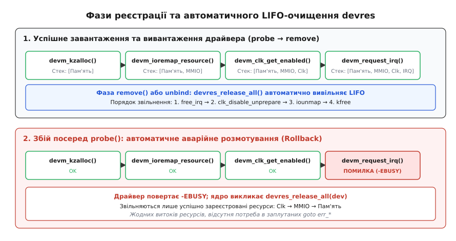
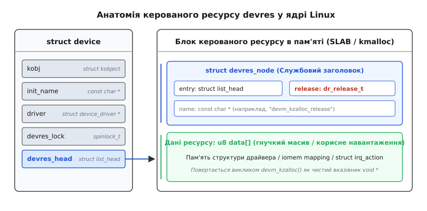
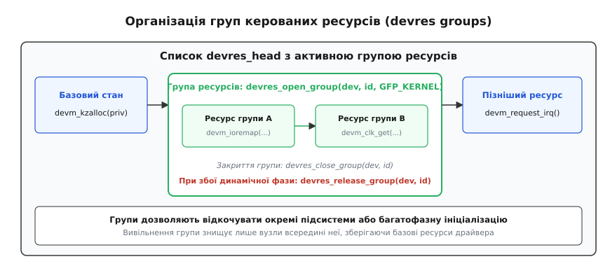
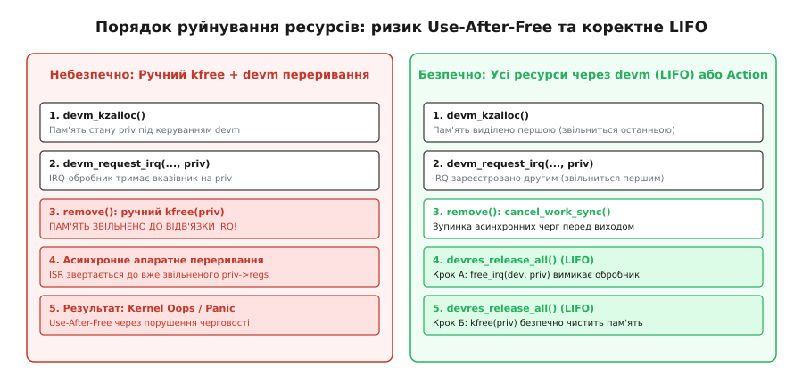

# Managed-ресурси драйвера: devres і сімейство devm_*

<preknowlist>
- [Прив'язка драйвера до пристрою](root:sys-unix/driver-probe-and-binding) — коли ядро кличе `probe()` і `remove()`, що таке відв'язка й відкладена спроба.
- [Модель пристроїв у sysfs](root:sys-unix/sysfs-device-model) — `struct device` як окремий довгоживучий об'єкт ядра, а не просто запис у драйвері.
- [Пам'ять ядра: slab](root:sys-unix/kernel-memory-slab) — `kmalloc`/`kfree`, прапорці `GFP_`, і те, що в ядрі ніхто не прибирає за тобою.
- [Переривання, softirq і робочі черги](root:sys-unix/interrupts-bottom-halves) — обробник виконується асинхронно, доки лінія лишається зареєстрованою.
- [Регістри пристрою в пам'яті](root:sys-unix/mmio-and-ioremap) — `ioremap`, захоплений діапазон і чому його треба віддавати.
- [Шина platform](root:sys-unix/platform-bus) — звідки драйвер бере діапазон регістрів, переривання й такт для пристрою, який не можна опитати.
- [Модулі ядра](root:sys-unix/kernel-modules) — код драйвера з'являється й зникає за життя працюючої системи.
</preknowlist>

Коли драйвер пристрою ініціалізує обладнання у функції `probe()`, він виконує ланцюжок із багатьох послідовних запитів до підсистем ядра. Йому потрібна динамічна пам'ять під власну структуру стану, ексклюзивний діапазон фізичних адрес регістрів, відображення цих адрес у віртуальний простір ядра, тактовий генератор потрібної частоти, стабілізовані лінії живлення від регуляторів напруги, дескриптори керуючих ліній GPIO, реєстрація вектора переривань і, зрештою, експорт інтерфейсу в простір користувача через підсистему конкретного класу пристроїв.

Будь-який із цих кроків може завершитися відмовою. Якщо тактовий сигнал ще не готовий або лінія переривання вже зайнята, драйвер зобов'язаний негайно припинити ініціалізацію та повернути системі всі ресурси, захоплені на попередніх успішних кроках.

## Анатомія проблеми: чому ручне очищення ламається

У традиційній моделі програмування ядра на мові C розробник змушений вручну вибудовувати зворотний ланцюжок міток `goto` в кінці кожної функції ініціалізації:

```c
static int acme_probe_legacy(struct platform_device *pdev)
{
	struct acme_chip *chip;
	struct resource *res;
	int ret;

	chip = kzalloc(sizeof(*chip), GFP_KERNEL);
	if (!chip)
		return -ENOMEM;

	res = platform_get_resource(pdev, IORESOURCE_MEM, 0);
	if (!res) {
		ret = -EINVAL;
		goto err_free_mem;
	}

	chip->regs = ioremap(res->start, resource_size(res));
	if (!chip->regs) {
		ret = -ENOMEM;
		goto err_free_mem;
	}

	chip->clk = clk_get(&pdev->dev, "core");
	if (IS_ERR(chip->clk)) {
		ret = PTR_ERR(chip->clk);
		goto err_unmap;
	}

	ret = clk_prepare_enable(chip->clk);
	if (ret)
		goto err_put_clk;

	chip->irq = platform_get_irq(pdev, 0);
	if (chip->irq < 0) {
		ret = chip->irq;
		goto err_disable_clk;
	}

	ret = request_threaded_irq(chip->irq, NULL, acme_irq_thread,
	                           IRQF_ONESHOT, "acme", chip);
	if (ret)
		goto err_disable_clk;

	return 0;

err_disable_clk:
	clk_disable_unprepare(chip->clk);
err_put_clk:
	clk_put(chip->clk);
err_unmap:
	iounmap(chip->regs);
err_free_mem:
	kfree(chip);
	return ret;
}
```

Такий шаблон коду приховує в собі систематичну вразливість. Кожна нова точка відмови збільшує довжину «хвоста» очищення. Якщо під час подальшої модернізації драйвера інженер додає між налаштуванням тактування та запитом переривання отримання регулятора живлення `regulator_get()`, він повинен:
1. Додати нову мітку аварійного переходу.
2. Перевірити та відкоригувати всі наступні мітки `goto` в тілі функції.
3. Додати відповідний виклик `regulator_put()` у симетричну функцію деініціалізації `remove()`.

Оскільки помилки ініціалізації виникають рідко (зазвичай під час розробки все необхідне обладнання присутнє на стенді), код розмотування після аварійних міток залишається найменш протестованою частиною модуля. Статичний аналіз коду ядра роками демонстрував сотні дефектів у цих гілках: пропущені виклики `iounmap()`, невимкнені тактові сигнали або вивільнення пам'яті перед зупинкою обробника переривань. Детальніше про те, як ця криза надійності спонукала до перегляду парадигми в ядрі 2.6.21, викладено в [історичному нарисі](root:sys-unix/devres-internals-and-subsystem-coverage/hist-devres-evolution.md).

З появою механізму відкладеного виявлення (`-EPROBE_DEFER`), коли підсистема повертає драйверу спеціальний код помилки через те, що залежний контролер (наприклад, розширювач шини I²C чи джерело живлення) ще не завантажився, функція `probe()` може багаторазово викликатися і зазнавати невдачі до моменту готовності всієї апаратної платформи. Будь-який дрібний витік ресурсів під час відкладеного опитування призводить до вичерпання дескрипторів пам'яті SLAB та зависання завантаження операційної системи.

## Парадигма керованих ресурсів: RAII на рівні мови C

У мовах програмування з підтримкою об'єктно-орієнтованих деструкторів (як-от C++ чи Rust) ця проблема вирішується концепцією RAII (Resource Acquisition Is Initialization), де зв'язування життєвого циклу ресурсу з областю видимості стекового об'єкта гарантує виклик деструктора при виході з блоку або виникненні винятку.

Мова C ядра Linux не має автоматичних деструкторів на рівні синтаксису компілятора. Проте операційна система має чітко окреслену сутність, яка володіє всіма цими ресурсами — екземпляр структури `struct device`.

Керовані ресурси (**devres**, скорочення від *device resource management*) — це підсистема ядра Linux, яка прив'язує кожен виділений драйвером ресурс до об'єкта `struct device`. Замість прямого звернення до функцій виділення драйвер викликає відповідники із префіксом `devm_*` (*device managed*).


*Фази реєстрації та розмотування ресурсів: нормальне завантаження/вивантаження та автоматичний відкат при збої*

Життєвий цикл керованого ресурсу будується за трьома залізними правилами:
1. **Автоматичний аварійний відкат (Rollback):** якщо функція `probe()` повертає будь-яке ненульове від'ємне значення (код помилки), ядро драйверів автоматично викликає очищення всіх ресурсів, що їх встиг зареєструвати цей пристрій, у строго зворотній послідовності (LIFO).
2. **Автоматичне очищення при відв'язуванні (Teardown):** коли пристрій відключається від системи, вивантажується модуль ядра або відбувається відв'язування через інтерфейс sysfs (`unbind`), після завершення роботи власної функції драйвера `remove()` ядро викликає деструктори всіх керованих об'єктів.
3. **Екземплярна прив'язка:** ресурси належать саме пристрою (`struct device`), а не коду драйвера (`struct device_driver`). Якщо в системі працює чотири однакові мережеві контролери під керуванням одного драйвера, кожен контролер має свій незалежний ізольований список ресурсів.

## Внутрішня архітектура та структури даних devres

Підсистема `devres` реалізована в ядрі всередині файлу `drivers/base/devres.c`, а її структури інтегровані безпосередньо в базове визначення `struct device` (`include/linux/device.h`).

Усередині кожного пристрою присутні два обов'язкові поля:

```c
struct device {
	/* ... */
	spinlock_t		devres_lock;
	struct list_head	devres_head;
	/* ... */
};
```

- `devres_head`: двобічно зв'язаний список голови черги, де зберігаються всі зареєстровані вузли ресурсів.
- `devres_lock`: спін-блокування (spinlock), що захищає цілісність списку під час одночасних операцій додавання, пошуку та вилучення вузлів.

### Анатомія вузла devres у пам'яті

Коли викликається функція створення керованого ресурсу, ядро не просто виділяє пам'ять під корисні дані, а створює комбінований блок пам'яті за допомогою алокатора SLAB (`kmalloc`).

Цей блок складається зі службового заголовка `struct devres_node` та розташованого безпосередньо за ним у пам'яті буфера корисного навантаження:

```c
struct devres_node {
	struct list_head		entry;
	dr_release_t			release;
	const char			*name;
	size_t				size;
};

struct devres {
	struct devres_node		node;
	/* гнучкий масив або вирівняне корисне навантаження */
	u8				data[];
};
```

Поле `release` — це вказівник на специфічну функцію зворотного виклику типу `typedef void (*dr_release_t)(struct device *dev, void *res)`. Для виділення пам'яті через `devm_kzalloc` цією функцією є `devm_kzalloc_release`, для відображення MMIO — `devm_ioremap_release`, для переривань — `devm_irq_release`.


*Розташування структури devres у пам'яті ядра та зв'язок зі struct device*

Коли функція підсистеми повертає вказівник розробнику (наприклад, `void *` зі структурою стану або `void __iomem *` на регістри), вона повертає адресу початку масиву `data[]`.

Ядро виконує швидке зміщення адрес за допомогою адресних перетворень:
- Отримання даних із вузла: `node_to_devres(node) = (struct devres *)node->data`
- Отримання службового заголовка за вказівником на дані: `devres_to_node(ptr) = (struct devres_node *)((struct devres *)ptr - 1)`

Завдяки цьому механізму службова інформація `devres` є повністю прозорою для драйвера: драйвер працює зі звичайним типізованим C-вказівником, а ядро за потреби може за константний час `O(1)` отримати метадані вузла та його деструктор.

### Врахування NUMA-топології та виділення сторінок

У багатопроцесорних серверах із неоднорідним доступом до пам'яті (NUMA) розміщення пам'яті драйвера на тому ж вузлі, до якого фізично підключено шинний контролер (PCIe root complex), має вирішальне значення для продуктивності.

Підсистема `devres` підтримує функцію `devres_alloc_node(release, size, gfp, nid)`. Коли драйвер викликає `devm_kzalloc(&pdev->dev, size, GFP_KERNEL)`, ядро автоматично визначає номер вузла `dev_to_node(&pdev->dev)` і виділяє пам'ять через `kmalloc_node()`. Це гарантує мінімальні затримки звернення процесора до керуючих структур драйвера.

Крім того, для драйверів, які потребують виділення великих неперервних блоків сторінкової пам'яті безпосередньо через Buddy Allocator, ядро надає функцію `devm_get_free_pages(dev, gfp, order)`. Вона зберігає метадані виділеного порядку сторінок (`order`) у вузлі `devres` і автоматично викликає `free_pages()` під час вивантаження пристрою.

### Механіка списку: LIFO-стек та ізоляція блокувань

Усі операції модифікації списку ресурсів `devres_head` виконуються під захистом внутрішнього спін-блокування `devres_lock` з маскуванням локальних переривань (`spin_lock_irqsave`).

Вузол кожного нового керованого ресурсу додається функцією `devres_add()` на самий початок зв'язаного списку `dev->devres_head` за допомогою макросу `list_add()`. Це перетворює список на строгий стек (LIFO — Last In, First Out).

Коли приходить час вивільнення ресурсів, функція `devres_release_all()` діє за витонченим двоетапним алгоритмом:
1. Під захистом `spin_lock_irqsave` вона атомарно переносить увесь вміст `dev->devres_head` у локальний стек за допомогою `list_splice_init()`.
2. Відпустивши блокування (`spin_unlock_irqrestore`), ядро починає послідовний обхід локального списку. Для кожного вузла викликається його функція `node->release(dev, node->data)`, після чого звільняється пам'ять самого заголовка `struct devres`.

Виконання деструкторів **поза** спін-блокуванням є критично важливим архітектурним рішенням. Функції звільнення ресурсів (як-от `iounmap()`, `clk_disable_unprepare()`, `free_irq()` або `kfree()`) часто потребують взяття м'ютексів, надсилання команд по повільних шинах (I²C, SPI) або очікування завершення фонових потоків. Якби деструктори викликалися під атомарним блокуванням, будь-яка спроба заснути призвела б до паніки ядра (Kernel Bug: scheduling while atomic). Повний опис функцій та предикатів пошуку наведено у [довіднику API](root:sys-unix/devres-internals-and-subsystem-coverage/api-devm-core.md).

### Механізм пошуку та звільнення за предикатом (dr_match_t)

Якщо драйверу потрібно знайти або достроково знищити певний ресурс, ядро використовує функції пошуку `devres_find`, `devres_destroy` та `devres_release`.

Пошук здійснюється за допомогою призначеного для користувача предиката `typedef int (*dr_match_t)(struct device *dev, void *res, void *match_data)`. Наприклад, для пошуку керованого блоку пам'ять функція `devm_kzalloc_match` порівнює вказівник `res` із переданою адресою:

```c
static int devm_kmalloc_match(struct device *dev, void *res, void *data)
{
	return res == data;
}
```

Коли викликається `devm_kfree(dev, p)`, ядро викликає `devres_destroy(dev, devm_kmalloc_release, devm_kmalloc_match, p)`. Функція під блокуванням обходить список, знаходить вузол, де функція деструктора збігається з `devm_kmalloc_release`, а предикат повертає істину, вилучає його зі списку та звільняє пам'ять без виклику деструктора (оскільки пам'ять звільняється безпосередньо).

## Сімейство функцій devm_* у підсистемах ядра

Підсистема `devres` сама по собі є низькорівневим механізмом обліку. Для зручності розробників майже всі підсистеми ядра Linux надають власні обгортки з префіксом `devm_`.

### 1. Керування пам'яттю ядра

Функції `devm_kmalloc()`, `devm_kzalloc()`, `devm_kcalloc()`, `devm_kstrdup()` та `devm_kmemdup()` повністю замінюють стандартні виклики `kmalloc`/`kfree`.

```c
struct acme_chip *chip;

chip = devm_kzalloc(&pdev->dev, sizeof(*chip), GFP_KERNEL);
if (!chip)
	return -ENOMEM;
```

Виділена пам'ять автоматично повертається в SLAB-алокатор, коли пристрій відв'язується. Якщо драйверу з якихось причин потрібно достроково вивільнити блок пам'яті під час нормальної роботи, доступна функція `devm_kfree(dev, ptr)`, яка знаходить відповідний вузол у списку `devres_head`, вилучає його та знищує.

### 2. Регістри введення-виведення та MMIO

Робота з регістрами пристрою вимагає не лише виклику `ioremap()`, але й обов'язкової попередньої перевірки, що фізичний діапазон не перетинається з регістрами інших пристроїв.

Для цього існує стандартизована функція `devm_ioremap_resource()`:

```c
struct resource *res;
void __iomem *regs;

res = platform_get_resource(pdev, IORESOURCE_MEM, 0);
regs = devm_ioremap_resource(&pdev->dev, res);
if (IS_ERR(regs))
	return PTR_ERR(regs);
```

Ця функція виконує одразу чотири операції:
1. Перевіряє валідність структури `res` та типу ресурсу `IORESOURCE_MEM`.
2. Викликає `devm_request_mem_region()`, резервуючи фізичні адреси в кореневому дереві ресурсів ядра (`/proc/iomem`).
3. Викликає `devm_ioremap()`, створюючи таблиці сторінок віртуальної пам'яті.
4. У разі будь-якої помилки повертає закодований вказівник помилки через макрос `ERR_PTR` (наприклад, `ERR_PTR(-EBUSY)` при конфлікті адрес або `ERR_PTR(-ENOMEM)`), а також виводить інформативне повідомлення про помилку в системний журнал пристрою через `dev_err()`.

Для платформених пристроїв існує ще компактніший помічник `devm_platform_ioremap_resource(pdev, 0)`, який самостійно витягує ресурс за індексом і відображає його в один рядок.

### 3. Тактові сигнали, живлення та лінії GPIO

Сучасні SoC-платформи (ARM, RISC-V) вимагають обов'язкового керування тактовими генераторами та стабілізаторами напруги:

```c
/* Отримання та автоматична активація тактового сигналу */
chip->clk = devm_clk_get_enabled(&pdev->dev, "bus_clk");
if (IS_ERR(chip->clk))
	return dev_err_probe(&pdev->dev, PTR_ERR(chip->clk),
	                      "Не вдалося активувати тактування\n");

/* Отримання та ввімкнення лінії живлення */
ret = devm_regulator_get_enable(&pdev->dev, "vdd");
if (ret)
	return dev_err_probe(&pdev->dev, ret, "Помилка живлення VDD\n");

/* Отримання дескриптора скидання GPIO */
chip->reset_gpio = devm_gpiod_get_optional(&pdev->dev, "reset", GPIOD_OUT_LOW);
if (IS_ERR(chip->reset_gpio))
	return PTR_ERR(chip->reset_gpio);
```

Функція `devm_clk_get_enabled()` не лише отримує дескриптор `struct clk`, але й викликає `clk_prepare_enable()`. При вивантаженні пристрою деструктор автоматично викличе `clk_disable_unprepare()` та `clk_put()`.

Спеціальна допоміжна функція `dev_err_probe()` ідеально доповнює сімейство `devm_*`: якщо підсистема повертає код `-EPROBE_DEFER`, вона не засмічує системний журнал зайвими повідомленнями, а коректно реєструє причину відкладення у діагностичному інтерфейсі ядра `/sys/kernel/debug/devices_deferred`.

### 4. Лінії переривань та потокові обробники

Реєстрація переривання через `devm_request_threaded_irq()` автоматично гарантує коректне завершення:

```c
ret = devm_request_threaded_irq(&pdev->dev, chip->irq,
                                acme_hardirq_handler,
                                acme_thread_handler,
                                IRQF_ONESHOT, "acme_sensor", chip);
if (ret)
	return ret;
```

Коли спрацьовує деструктор `devres`, він викликає функцію ядра `free_irq()`. Ця функція блокує виконання доти, доки поточний виклик обробника переривання (або його потокової частини в контексті потоку ядра `irq/XX-acme`) не завершиться повністю. Це унеможливлює ситуацію, коли обробник переривання виконується на одному процесорному ядрі паралельно зі знищенням структур пристрою на іншому.

### 5. Підсистема прямого доступу до пам'яті (DMA)

Для високошвидкісних пристроїв, що обмінюються даними з оперативною пам'яттю без участі процесора, підсистема DMA надає власні керовані функції виділення когерентних буферів:

```c
dma_addr_t dma_handle;
void *cpu_addr;

cpu_addr = dmam_alloc_coherent(&pdev->dev, BUFFER_SIZE,
                               &dma_handle, GFP_KERNEL);
if (!cpu_addr)
	return -ENOMEM;
```

Функція `dmam_alloc_coherent()` виділяє фізично неперервний буфер пам'яті, налаштовує відображення в IOMMU (якщо такий присутній на шині) і створює вузол `devres`. Під час вивантаження деструктор автоматично викликає `dma_free_coherent()`, повертаючи виділені сторінки системі.

### 6. Керовані ресурси шини PCI (pcim_*)

Для пристроїв на шині PCI ядро надає спеціалізовану групу функцій із префіксом `pcim_`:
- `pcim_enable_device(pdev)`: вмикає живлення та декодування адрес PCI-пристрою, гарантуючи виклик `pci_disable_device()` під час відв'язування.
- `pcim_iomap_regions(pdev, mask, name)`: блокує шинні регіони BAR та відображає MMIO/IO-простори згідно з бітовою маскою `mask`.
- `pcim_iomap_table(pdev)`: повертає масив відображених базових адрес для швидкого доступу до окремих регістрів BAR.

## Фази життєвого циклу: що відбувається всередині ядра

Щоб зрозуміти, як ядро координує автоматичне вивільнення, простежимо шлях прив'язки та відв'язки драйвера в підсистемі керування драйверами ядра (`drivers/base/dd.c`).

### 1. Фаза Probe та автоматичний відкат

Коли шина виявляє збіг між назвою пристрою чи таблицею Device Tree (`of_match_table`) та драйвером, вона викликає внутрішню функцію ядра `really_probe()`:

1. Ядро ініціалізує список `INIT_LIST_HEAD(&dev->devres_head)` та блокування `spin_lock_init(&dev->devres_lock)`.
2. Ядро викликає функцію драйвера `drv->probe(dev)`.
3. У процесі виконання `drv->probe()` кожен виклик `devm_*` додає нові службові вузли до списку пристрою.
4. **Успішний результат:** якщо `probe()` повертає `0`, пристрій переходить у стан зв'язаного (`dev->driver = drv`). Усі вузли `devres` залишаються у списку пристрою.
5. **Аварійний результат:** якщо `probe()` повертає будь-яке ненульове значення (наприклад, `-ENOMEM` або `-EPROBE_DEFER`), функція `really_probe()` перехоплює код помилки і негайно викликає `devres_release_all(dev)`.
6. Підсистема `devres` обходить список від найновішого до найстарішого елемента, викликає деструктори для кожного успішно отриманого ресурсу і звільняє пам'ять заголовків. Драйвер повертається у вихідний стан без жодного рядка коду очищення в тілі самого драйвера.

### 2. Фаза Remove та вивантаження модуля

Коли користувач ініціює вивантаження драйвера (`modprobe -r` або запис у sysfs `unbind`), ядро викликає функцію `device_release_driver_internal()`:

1. Викликаються сповіщувачі шини про відключення пристрою.
2. Якщо драйвер оголосив власну функцію `drv->remove(dev)`, вона викликається **першою**. Тут драйвер може виконати специфічні дії: надіслати фінальну команду пристрою або зупинити фонові потоки.
3. Одразу після завершення `remove()` ядро викликає функцію `devres_release_all(dev)`.
4. Усі ресурси, виділені функціями `devm_*`, послідовно звільняються у зворотному порядку LIFO.
5. Пристрій очищує посилання на драйвер і переходить у неактивний стан.

## Користувацькі дії: devm_add_action_or_reset

Часто драйверу потрібно автоматизувати нестандартну дію, для якої в ядрі немає готової функції `devm_*`. Наприклад:
- Скидання апаратного блоку через запис спеціального біта в регістр MMIO.
- Зупинка таймера або фонової робочої черги (`cancel_delayed_work_sync`).
- Звільнення власного м'ютекса (`mutex_destroy`) чи буфера DMA.

Для цього використовується універсальний механізм користувацьких дій:

```c
typedef void (*devm_action_t)(void *data);

int devm_add_action(struct device *dev, devm_action_t action, void *data);
int devm_add_action_or_reset(struct device *dev, devm_action_t action, void *data);
void devm_remove_action(struct device *dev, devm_action_t action, void *data);
void devm_release_action(struct device *dev, devm_action_t action, void *data);
```

Розглянемо типовий шаблон:

```c
static void acme_disable_hardware_action(void *data)
{
	struct acme_chip *chip = data;

	/* Апаратне вимкнення вимірювань */
	writel(0, chip->regs + ACME_REG_ENABLE);
}

static int acme_probe(struct platform_device *pdev)
{
	/* ... ініціалізація пам'яті, MMIO та тактів ... */

	/* Вмикаємо залізо */
	writel(ACME_ENABLE_BIT, chip->regs + ACME_REG_ENABLE);

	/* Реєструємо автоматичне вимкнення заліза під час демонтажу */
	ret = devm_add_action_or_reset(&pdev->dev, acme_disable_hardware_action, chip);
	if (ret)
		return ret;

	return 0;
}
```

### Чому слід завжди обирати devm_add_action_or_reset

Функція `devm_add_action()` намагається виділити пам'ять під службовий вузол `struct devres`. Якщо в цей момент пам'ять ядра вичерпана (`kmalloc` повернув `NULL`), функція повертає `-ENOMEM`.

Проте апаратна дія вже відбулася: залізо вже ввімкнено! Якщо використати звичайний `devm_add_action()`, при збої виділення пам'яті ядро почне аварійний відкат, але зареєстрованої дії в списку ще немає. Апаратний чіп залишиться ввімкненим і генеруватиме споживання енергії або конфлікти на шині.

Функція `devm_add_action_or_reset()` вирішує цю проблему: якщо реєстрація дії зазнає невдачі, вона **негайно викликає саму функцію дії** `action(data)`, після чого повертає помилку. Це гарантує стовідсотковий захист від витоку стану навіть у разі критичної нестачі пам'яті ядра.

Крім того, функції `devm_remove_action()` та `devm_release_action()` дозволяють динамічно скасувати або достроково виконати зареєстровану дію під час роботи пристрою (наприклад, якщо драйвер динамічно перезавантажує мікропрограму).

Повноцінний приклад побудови промислового драйвера на базі дій та робочих черг наведено у [практичному проекті](root:sys-unix/devres-internals-and-subsystem-coverage/proj-custom-devres-action.md).

## Групи ресурсів: devres_open_group та селективне відкочування

У складних драйверах ініціалізація пристрою може складатися з кількох окремих фаз. Наприклад, драйвер може завантажувати бінарну мікропрограму (firmware), виділяти тимчасові буфери калібрування або динамічно додавати дочірні функціональні блоки залежно від ревізії кремнію.

Якщо помилка сталася на етапі калібрування, недоцільно аварійно зупиняти весь драйвер і скидати базові налаштування живлення. Достатньо відкотити лише ті ресурси, які були виділені для фази калібрування. Для цього застосовуються **групи ресурсів (devres groups)**.


*Організація груп devres: створення ізольованого сегмента списку та селективне вивільнення*

Група ресурсів — це спеціальний вузол-маркер `struct devres_group`, що вставляється у загальний список `devres_head`:

```c
void *group_id;

/* Відкриваємо ізольовану групу ресурсів */
group_id = devres_open_group(&pdev->dev, NULL, GFP_KERNEL);
if (!group_id)
	return -ENOMEM;

/* Усі виклики devm_* нижче додаються всередину цієї групи */
temp_buf = devm_kmalloc(&pdev->dev, 4096, GFP_KERNEL);
if (!temp_buf) {
	/* Відкочуємо виключно ресурси цієї групи */
	devres_release_group(&pdev->dev, group_id);
	return -ENOMEM;
}

ret = acme_run_calibration(&pdev->dev, temp_buf);
if (ret) {
	/* Помилка калібрування: звільняємо лише тимчасовий буфер */
	devres_release_group(&pdev->dev, group_id);
	return ret;
}

/* Калібрування успішне: закриваємо групу (ресурси лишаються активними) */
devres_close_group(&pdev->dev, group_id);
```

Функція `devres_release_group()` знаходить маркер групи і послідовно виконує деструктори всіх об'єктів, створених після відкриття групи, залишаючи всі раніше зареєстровані базові ресурси драйвера недоторканими.

## Взаємодія devres зі зв'язками пристроїв (Device Links)

У сучасних системах пристрої рідко існують ізольовано: споживач (consumer, наприклад, GPU або аудіокодек) залежить від постачальника (supplier, наприклад, IOMMU або регулятора живлення). Підсистема `device_link_add()` дозволяє явно декларувати ці залежності в ядрі.

Коли пристрій-постачальник вимикається або відв'язується від свого драйвера, ядро повинно спочатку коректно деініціалізувати всі залежні пристрої-споживачі. Завдяки тому, що кожен пристрій має незалежний список `devres_head`, підсистема зв'язків пристроїв гарантує чітку ієрархію:
1. Викликається `remove()` споживача та розмотується його `devres_release_all()`.
2. Споживач повністю припиняє звернення до ресурсів постачальника (переривання зняті, відображення MMIO скинуті, тактування вимкнене).
3. Лише після цього ядро починає виконання `remove()` та деструкторів `devres` для пристрою-постачальника.

Це усуває цілий клас міждрайверних станів гонитви при гарячому відключенні апаратних модулів.

## Підводні камені та типові помилки архітектури

Попри простоту та зручність `devm_*`, неправильне розуміння черговості деструкторів та взаємодії з асинхронними подіями може призвести до критичних збоїв ядра (Kernel Panic / Oops).

### 1. Асинхронні черги (Workqueues), таймери та Use-After-Free

Найпоширеніша помилка виникає під час поєднання `devm_kzalloc()` із системними робочими чергами (`workqueue`) або таймерами `timer_list`.

Уявімо наступний сценарій:
1. Драйвер у `probe()` виділяє пам'ять структури `priv` через `devm_kzalloc()`.
2. Драйвер ініціалізує таймер або `delayed_work` для періодичного опитування сенсора.
3. Модуль вивантажується. Функція `remove()` завершує роботу.
4. Ядро викликає `devres_release_all()`, яка звільняє пам'ять структури `priv`.
5. **Аварія:** за частку мілісекунди спрацьовує запланований таймер ядра, викликаючи функцію зворотного виклику. Обробник отримує вказівник на `priv`, який уже повернуто в SLAB і заповнено сміттям або перерозподілено іншим потоком. Результат — збій розіменування пам'яті (Use-After-Free).


*Порушення черговості деініціалізації: ризик Use-After-Free при ручному вивільненні та безпечне LIFO-очищення*

> 🔧 **Правило безпеки:** усі асинхронні структури ядра (робочі черги `delayed_work`, таймери `timer_list`, пули потоків kthread, тасклети та DMA-канали) повинні бути синхронно зупинені (`cancel_delayed_work_sync`, `del_timer_sync`) **до того**, як почнеться вивільнення пам'яті. Найкращий спосіб — зареєструвати функцію їх зупинки через `devm_add_action_or_reset()` одразу після ініціалізації відповідного об'єкта.

### 2. Змішування ручного kfree() та керованого devm

Категорично заборонено вручну викликати `kfree()` або `free_irq()` для об'єктів, створених через функції `devm_*`.

Якщо розробник викличе `kfree(chip)` у функції `remove()`, пам'ять буде звільнена негайно. Проте вузол `struct devres` залишиться у списку `devres_head`. Коли після виходу з `remove()` ядро викличе `devres_release_all()`, воно вдруге спробує звільнити той самий покажчик пам'яті через деструктор `devm_kzalloc_release`. Це спричинить критичну помилку подвійного звільнення пам'яті (Double Free Bug) та пошкодження внутрішніх структур SLAB-алокатора.

Якщо ресурс дійсно потрібно звільнити достроково під час роботи пристрою, слід використовувати спеціалізовані парні функції: `devm_kfree(dev, p)`, `devm_free_irq(dev, irq, dev_id)` або `devm_iounmap(dev, regs)`.

### 3. Порядок реєстрації підсистем інтерфейсу користувача

Коли драйвер реєструє символьний пристрій (`cdev_add`), вузол у sysfs або мережевий інтерфейс (`register_netdev`), цей інтерфейс стає миттєво видимим для процесів простору користувача.

Якщо реєстрація інтерфейсу відбувається через `devm_*`, виникає ризик зворотного порядку руйнування:
- Користувацький процес відкриває дескриптор файлу пристрою `/dev/acme0` і виконує системний виклик `read()`.
- У цей момент пристрій вилучається з шини.
- Підсистема `devres` починає розмотувати стек. Якщо відображення регістрів MMIO буде знищено раніше, ніж символьний пристрій буде видалено з таблиці VFS ядра, системний виклик `read()` спробує прочитати дані з неіснуючої адреси MMIO, викликавши апаратний виняток шини (Data Abort / Bus Fault).

> 🔧 **Архітектурне правило:** публічні точки входу користувацького простору (символьні пристрої, мережеві сокети, графічні DRM-вузли) повинні реєструватися найостаннішими в `probe()` (щоб вивільнятися найпершими) або явно скасовуватися на самому початку функції `remove()`.

### 4. Взаємодія з об'єктами лічильника посилань (kref / struct device)

У ядрі Linux структури високорівневих пристроїв (як-от `struct net_device`, `struct drm_device` або `struct iio_dev`) мають власний механізм відстеження життєвого циклу на базі лічильника посилань `struct kref`. Пам'ять такої структури не може бути звільнена доти, доки останній користувач не закриє свій файловий дескриптор.

Якщо помилково виділити `struct net_device` за допомогою `devm_kzalloc()`, виникне критична колізія двох моделей пам'яті:
- Підсистема `devres` звільнить пам'ять у момент відв'язування драйвера (`unbind`).
- Проте сокет у просторі користувача все ще триматиме посилання `kref` на структуру мережевого інтерфейсу.
- Коли сокет закриється, мережевий стек викличе `free_netdev()`, що спробує звільнити вже вивільнену пам'ять.

Для таких об'єктів підсистеми надають спеціалізовані деструктори (наприклад, `devm_iio_device_alloc()` або `devm_drm_dev_alloc()`), які коректно інтегрують деструктор `devres` із лічильником посилань базового `struct device`.

### 5. Накладні витрати пам'яті та обмеження контексту переривань

Підсистема `devres` не є безкоштовною:
- **Накладні витрати пам'яті:** кожен керований об'єкт вимагає додаткового виділення пам'яті під `struct devres_node` (зазвичай 32–48 байтів залежно від розрядності 32/64 біт), плюс накладні витрати заголовка SLAB. Якщо виділити через `devm_kmalloc` 1000 дрібних об'єктів по 8 байтів, сумарні витрати пам'яті зростуть у 5–6 разів.
- **Обмеження контексту виконання:** операції додавання до списку `devres_add()` беруть спін-блокування `devres_lock` із маскуванням переривань. Виділення пам'яті під вузол `devres_alloc()` за замовчуванням виконується з прапорцем `GFP_KERNEL` і може переводити процес у стан сну. Тому функції `devm_*` **заборонено** викликати з контексту обробників переривань (hardirq) або коду, що тримає атомарні спін-блокування.

Керовані ресурси призначені виключно для шляху ініціалізації та конфігурації обладнання (control path), а не для високочастотного виділення пам'яті на кожен мережевий пакет чи кадр відеопотоку (data path).

## Інструменти аудиту: KASAN, kmemleak та ftrace

Для верифікації правильності роботи керованих ресурсів ядра застосовуються спеціалізовані інструменти аудиту:

1. **KASAN (Kernel Address Sanitizer):** автоматично виявляє звернення до пам'яті після її повернення в SLAB через `devm_kfree` або `devres_release_all`. KASAN перехоплює будь-які асинхронні переривання чи потоки, що намагаються прочитати приватний стан після демонтажу пристрою.
2. **kmemleak:** сканує пам'ять ядра на наявність об'єктів без активних вказівників. Оскільки підсистема `devres` зберігає прямі вказівники на виділені ресурси у списку `devres_head`, kmemleak коректно розпізнає ці блоки як активні і не генерує хибних попереджень про витоки.
3. **ftrace devres filters:** дозволяє аналізувати точний час виконання деструкторів під час вивантаження складних пристроїв, виявляючи блокуючі операції в деструкторах.

## Інженерний підсумок: правила сучасного драйвера

Використання підсистеми `devres` кардинально підвищує надійність кодової бази ядра Linux за дотримання простих правил:

1. **Єдиний вибір парадигми:** драйвер повинен послідовно використовувати керовані функції `devm_*` для всіх ресурсів або повністю керувати ними вручну. Часткове ручне звільнення частини ресурсів порушує LIFO-детермінізм.
2. **Пріоритет devm_add_action_or_reset:** будь-яка апаратна дія, що вимагає симетричного вимкнення, повинна реєструватися через `devm_add_action_or_reset()`.
3. **Синхронізація перед знищенням:** робочі черги, таймери та переривання повинні гарантовано завершити виконання до того, як ядро почне звільняти пам'ять приватного стану.
4. **Порожній remove як ідеал:** у правильно спроектованому драйвері функція `remove()` або відсутня взагалі, або зведена до зупинки активних потоків даних, тоді як усю роботу зі звільнення шин, пам'яті, регістрів та переривань автоматично виконує ядро `devres`.
