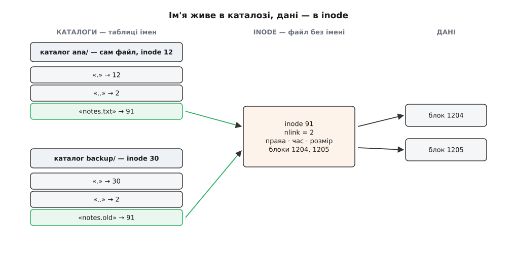
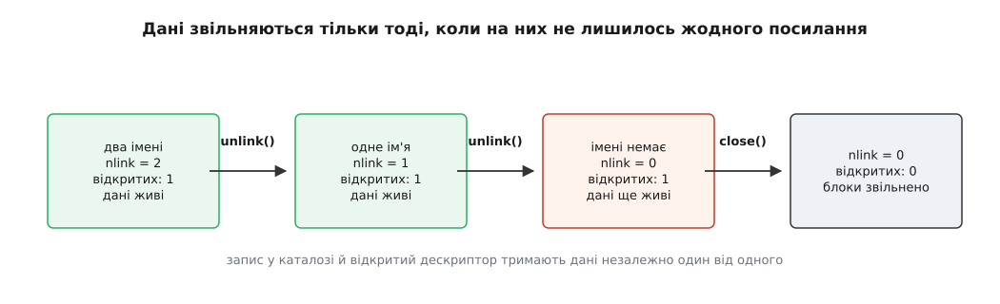
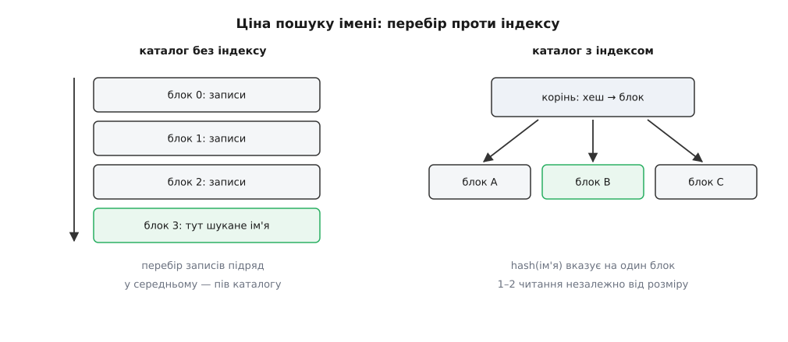
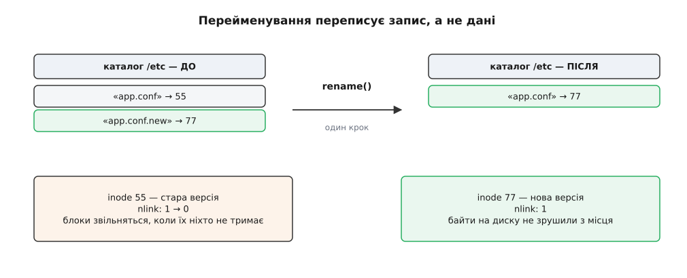

# Каталог як відображення імен

<preknowlist>
- [Inode: файл без імені](topic:sys-unix/inode-model) — структура, у якій файлова система тримає права, часи, розмір і перелік блоків файлу; імені в ній немає, а сама вона має номер у межах файлової системи.
- [«Усе є файлом»](topic:sys-unix/everything-is-a-file) — один набір викликів на всі види вмісту; каталог теж підпадає під це правило.
- [Системний виклик](topic:sys-unix/syscall-mechanics) — як програма просить ядро зробити дію й отримує назад результат або код помилки.
- [Файловий дескриптор](topic:sys-unix/file-descriptor) — мале ціле число, яким процес називає вже відкритий об'єкт, коли ім'я більше не потрібне.
- [Біти прав і як їх перевіряють](topic:sys-unix/permission-bits) — право належить об'єктові; для каталогу право запису означає право змінювати його вміст.
- [Атомарність і гонки](topic:sf-tasks/atomicity-races) — операція або сталася вся, або не сталася зовсім; між двома окремими кроками інший учасник встигає втрутитися.
</preknowlist>

Три звичні дії, які при уважному погляді не мають узгоджуватися між собою:

```sh
mv film.mkv кіно.mkv          # 8 ГБ — повертається миттєво
ln notes.txt notes.backup     # з'явився другий файл, вільне місце не змінилось
rm /tmp/чужий.log             # видалили файл, у який не мали права писати
```

Перше: перейменування восьмигігабайтного файлу коштує стільки ж, скільки перейменування порожнього. Друге: з'явився другий повноцінний файл — той самий вміст, ті самі права — а `df` показує ту саму цифру вільного місця. Третє: право писати у файл і право його видалити чомусь не збігаються.

Усі три випливають з одного факту, і поки він не сказаний уголос, кожен виглядає окремою химерією. Факт такий: **ім'я не зберігається у файлі**. Файл про своє ім'я нічого не знає — навіть про те, чи має він ім'я взагалі.

## Файл, у якому немає імені

Усе, що ми звикли вважати властивостями файлу, файлова система тримає в одній структурі: права, власника, часи, розмір, лічильник посилань і перелік блоків із даними. Ця структура називається inode, і всередині файлової системи вона позначена номером — цілим числом. Подивитися на номер можна прямо:

```sh
$ ls -li notes.txt
     91 -rw-r--r-- 2 ana ana 4096 Aug  1 10:12 notes.txt
```

Перше число — номер inode: 91. Число після прав — 2 — це лічильник імен, до нього ще повернемось.

Тепер перелічимо, чого в inode **немає**. Немає рядка з іменем. Немає вказівки на каталог, у якому файл лежить. Немає взагалі нічого про те, як цей файл знаходять. Ядро, тримаючи в руках номер 91, може прочитати весь файл, перевірити права, змінити часи — і не має жодного способу дізнатися, як він називається.

Це не недогляд, а вихідне рішення. Питання «як воно називається» ядро віддає окремому механізму, і саме там усе цікаве.

> 🔧 **Навіщо це.** Коли програма впала, а в логах є тільки номер inode із `lsof` чи `/proc/*/fd`, шукати винуватця треба не в метаданих файлу, а зворотним ходом: `find /шлях -inum 91`. Файлова система не має індексу «номер → ім'я», тому такий пошук — це справжній обхід дерева, і на великому томі він тривалий. Розуміння, що зв'язок односторонній, економить години марних спроб «спитати у файлу, як його звати».

## Каталог — це файл, у якому лежить таблиця

Якщо ім'я не в файлі, воно має бути десь іще. Воно в каталозі — і каталог для цього не «папка, що вміщує файли», а звичайний файл із власним inode, вміст якого файлова система тлумачить особливим чином: як послідовність записів, кожен з яких — пара «рядок імені + номер inode».

Тобто каталог — це **відображення** (лат. *directorium* — довідник, покажчик) імен у номери. Він не містить файлів. Він містить назви й числа.



*Ім'я живе в записі каталогу, дані — в inode; між ними тільки число, і одне число може згадуватись у кількох записах.*

Одразу видно, що з цієї картинки випливає. Два записи в різних каталогах несуть те саме число 91 — отже, той самий файл має два імені, і жодне з них не «справжніше» за інше. Ця можливість називається жорстким посиланням; про те, чим вона відрізняється від символьного посилання і де кожне доречне, є [окрема тема](topic:sys-unix/hard-and-symbolic-links) — тут важливо лише те, що вона є прямим наслідком будови каталогу, а не додатковою функцією поверх неї.

Видно й друге. Оскільки каталог сам є файлом із номером, у його таблиці можуть бути записи, що вказують на інші каталоги — і виходить дерево. Але дерево тут не структура даних, а те, що *утворюється*, коли записи посилаються один на одного. Сама файлова система — це купа пронумерованих inode; ієрархію їй надають таблиці імен. Як ядро проходить цим деревом, розкладаючи `/home/ana/notes.txt` на послідовність пошуків у таблицях, — предмет [розбору шляху](topic:sys-unix/path-resolution).

### Чому каталог не можна просто прочитати

Раз каталог — файл, здавалося б, його можна відкрити й прочитати `read()`. У ранньому Unix саме так і робили: формат запису був фіксований — 16 байтів, з них 2 байти номера inode і 14 байтів імені, — тож програма читала блок і розбирала його сама. Сьогодні спроба закінчиться відмовою:

```sh
$ cat /etc
cat: /etc: Is a directory
```

Ядро повертає `EISDIR`. Причина не в забороні заради заборони, а в тому, що байтового формату «взагалі» більше не існує: ext4 має один формат записів, XFS — інший, Btrfs — третій, і кожен ще й змінюється між версіями. Якби програми розбирали сирі байти, будь-яка зміна на диску ламала б `ls`.

Тому читання каталогу проходить через окремий системний виклик `getdents64()`, який повертає записи вже у вигляді, спільному для всіх файлових систем: номер inode, зміщення наступного запису, тип об'єкта й ім'я. Перекладом внутрішнього формату в цей спільний займається [шар VFS](topic:sys-unix/vfs-layer). Прикладні програми зазвичай не звертаються до `getdents64()` прямо, а користуються обгорткою `opendir()`/`readdir()` зі стандартної бібліотеки.

Повний перелік викликів, якими змінюють і читають таблицю імен — з підписами, прапорцями й кодами помилок, — винесено в [окрему довідку](topic:sys-unix/directory-as-mapping/api-directory-syscalls.md): вона потрібна за клавіатурою, а не в тексті. Практичний бік обходу каталогів — чому наївна рекурсія по шляхах ненадійна й як її рятує [сімейство викликів, що відлічують шлях від дескриптора каталогу](topic:sys-unix/at-family-syscalls), — розібрано в [робочому прикладі обходу](topic:sys-unix/directory-as-mapping/proj-walk-directory.md).

Ще одна річ, яку варто взяти до уваги одразу: `readdir()` не обіцяє жодного порядку. Записи виходять у тому порядку, у якому лежать у структурі каталогу, а він визначений внутрішнім устроєм файлової системи. Алфавітний порядок у виводі `ls` — заслуга самої `ls`, яка зібрала всі імена й відсортувала їх; причому відсортувала за правилами поточної [локалі](topic:sys-unix/locale-and-collation), тож той самий каталог у різних оточеннях виглядає по-різному.

## Що насправді роблять операції над іменами

Тепер кожна операція над файлами читається як операція над таблицею.

**`link(старе, нове)`** — додати в таблицю ще один запис із тим самим номером. Даних не торкається взагалі. Тому `ln` миттєвий і не займає місця: приріст — один запис у каталозі.

**`unlink(ім'я)`** — прибрати запис із таблиці. Назва відверта: викликається не «delete», а саме «від'єднати». Дані при цьому теж не чіпаються.

**`rename(старе, нове)`** — прибрати один запис і додати інший, але так, щоб між цими двома діями система не існувала в проміжному стані.

**`mkdir`/`rmdir`** — те саме, але з двома додатковими записами всередині нового каталогу, про які нижче.

Звідси перша з трьох химерій. `mv film.mkv кіно.mkv` у межах однієї файлової системи — це `rename()`, тобто правка одного запису; вісім гігабайтів даних не рухаються, бо їх нічого не змушує рухатись. А от `mv` між різними файловими системами — це вже інше: номери inode унікальні лише в межах своєї файлової системи, тому запис у чужій таблиці не може посилатися на inode сусідньої. Ядро відмовляє з `EXDEV`, і утиліта `mv`, отримавши цю відмову, чесно копіює вміст і видаляє джерело — довго й з ризиком обірватися посередині. Що саме вважається межею файлової системи, визначає [дерево монтувань](topic:sys-unix/mount-model).

## Лічильник імен і момент смерті даних

Якщо ім'я можна прибрати, не чіпаючи даних, постає питання: а коли ж дані звільняються?

Відповідь мала б бути «коли зникло останнє ім'я» — і тоді хтось має ці імена рахувати. Рахувати їх обходом усіх каталогів неможливо: щоб дізнатися, чи є в системі ще один запис із номером 91, довелося б прочитати весь том. Тому лічильник тримають там, де його дешево прочитати й змінити, — в самому inode. Це поле `st_nlink`, ті самі «2» у виводі `ls -li` вище. `link()` збільшує його на одиницю, `unlink()` зменшує.

Але й нуль ще не означає смерті. Файл можна відкрити, а потім прибрати його ім'я — процес далі тримає дескриптор і спокійно читає та пише. Виходить, на дані є два незалежні види посилань: імена в каталогах і відкриті дескриптори в процесах. Блоки повертаються у вільний пул тоді, коли не лишилось ані тих, ані тих.



*Запис у каталозі й відкритий дескриптор — два незалежні посилання на дані; звільнення настає лише тоді, коли зникли обидва.*

Ось як це виглядає в роботі. Програма створює файл, одразу прибирає його ім'я й далі користується дескриптором:

:::tabs
```c
#include <fcntl.h>
#include <stdio.h>
#include <string.h>
#include <unistd.h>

int main(void)
{
    int fd = open("/tmp/scratch", O_RDWR | O_CREAT | O_EXCL, 0600);
    if (fd < 0) { perror("open"); return 1; }

    /* Імені більше немає: у /tmp його не побачить ніхто, зокрема й ми самі. */
    if (unlink("/tmp/scratch") < 0) { perror("unlink"); return 1; }

    const char *msg = "дані живуть, доки живе дескриптор\n";
    write(fd, msg, strlen(msg));

    char buf[64] = {0};
    lseek(fd, 0, SEEK_SET);
    ssize_t n = read(fd, buf, sizeof buf - 1);
    printf("прочитано %zd байтів: %s", n, buf);

    close(fd);   /* аж тепер блоки звільняються */
    return 0;
}
```
```cpp
#include <fcntl.h>
#include <unistd.h>
#include <array>
#include <cstdio>
#include <iostream>
#include <string_view>

int main()
{
    int fd = open("/tmp/scratch", O_RDWR | O_CREAT | O_EXCL, 0600);
    if (fd < 0) {
        std::perror("open");
        return 1;
    }

    /* Імені більше немає: у /tmp його не побачить ніхто, зокрема й ми самі. */
    if (unlink("/tmp/scratch") < 0) {
        std::perror("unlink");
        close(fd);
        return 1;
    }

    constexpr std::string_view msg = "дані живуть, доки живе дескриптор\n";
    write(fd, msg.data(), msg.size());

    std::array<char, 64> buf{};
    lseek(fd, 0, SEEK_SET);
    ssize_t n = read(fd, buf.data(), buf.size() - 1);
    if (n > 0) {
        std::cout << "прочитано " << n << " байтів: "
                  << std::string_view(buf.data(), static_cast<size_t>(n));
    }

    close(fd);   /* аж тепер блоки звільняються */
    return 0;
}
```
:::

Це не хитрість, а стандартний спосіб зробити тимчасовий файл, який гарантовано зникне: навіть якщо процес уб'ють сигналом, ядро закриє його дескриптори, лічильники впадуть до нуля, і місце повернеться. Файлу, якого немає в жодному каталозі, ніхто не може ані прочитати, ані підмінити.

Той самий механізм має неприємний бік, з яким стикається кожен адміністратор. Величезний журнал видалили — а вільного місця не побільшало:

```sh
$ rm /var/log/app.log
$ df -h /var          # цифра не змінилась
$ lsof +L1 /var       # ось чому
COMMAND   PID  USER   FD   TYPE  NLINK   NODE NAME
app      1487   app    5w   REG      0 262401 /var/log/app.log (deleted)
```

Колонка `NLINK` показує нуль: імені вже немає. Але демон тримає дескриптор відкритим і продовжує в цей неіснуючий файл писати, тож блоки не звільняться, доки процес не перезапустять або не змусять переоткрити журнал.

## Право на ім'я — це право на каталог

Третя химерія з початку. Видалення файлу — це зміна таблиці; таблиця лежить у каталозі; отже, перевіряти треба право запису **в каталог**, а не у файл. Права самого файлу до видалення не мають стосунку взагалі.

Звідси два наслідки, які варто тримати в голові разом. Перший: файл із правами `r--r--r--`, що належить іншому користувачеві, ви видалите без питань, якщо каталог доступний вам на запис. Другий, дзеркальний: свій власний файл із правами `rw-------` ви не видалите з чужого каталогу, куди вам не дозволено писати.

Це поєднання робило спільні каталоги на кшталт `/tmp` небезпечними: будь-хто міг прибрати чужий запис і поставити на це місце свій. Латка — окремий біт прав каталогу, історично званий sticky (англ. *sticky* — липкий), який звужує правило: у каталозі з цим бітом прибрати запис може лише власник цього запису, власник каталогу або процес із відповідним привілеєм. Побачити його можна в останній позиції прав:

```sh
$ ls -ld /tmp
drwxrwxrwt 12 root root 4096 Aug  1 09:30 /tmp
```

Літера `t` на місці, де зазвичай стоїть `x` для інших, — це він.

> 🔧 **Навіщо це.** Коли служба працює під власним користувачем і пише в спільний каталог, безпеку дає не режим її файлів, а режим каталогу. Права `600` на файлі не завадять сторонньому процесу підмінити його: досить прибрати запис і створити новий із тим самим іменем. Захищати треба каталог — правами, sticky-бітом, або взагалі окремим каталогом, що належить службі.

## Дві крапки, яких начебто немає

У кожному каталозі є два записи, які ми зазвичай не помічаємо: `.` вказує на сам каталог, `..` — на батьківський. Вони не магічні: це такі самі пари «ім'я → номер», і саме тому `cd ..` працює без жодної підтримки з боку оболонки — вона просто просить ядро розв'язати шлях, у якому є запис `..`.

З цього рахується лічильник імен каталогу. На щойно створений каталог посилаються двоє: запис у батькові й власний `.`. Тому в порожнього каталогу `nlink` дорівнює двом, а кожен підкаталог додає ще один — через свій `..`:

```sh
$ mkdir -p проєкт/src проєкт/docs
$ ls -ld проєкт
drwxr-xr-x 4 ana ana 4096 Aug  1 11:02 проєкт
```

Четвірка — це `.` плюс запис у батьківському каталозі плюс два `..` з підкаталогів. Практична вигода: `nlink − 2` дає кількість підкаталогів без жодного читання вмісту, і цим користуються швидкі варіанти обходу дерева. Правило, щоправда, вже не універсальне: у ext4 лічильник обмежений, і коли підкаталогів стає більше за 65000, файлова система ставить каталогу `nlink = 1` — умовний знак «більше не рахую». Тому програма, яка на цьому оптимізує обхід, мусить перевіряти на одиницю й у такому разі просто читати каталог.

Зберігаються ці два записи не всюди однаково. У ext4 вони лежать фізично, першими в першому блоці каталогу. XFS у компактній формі каталогу не зберігає їх зовсім: «сам на себе» відомий з номера inode, а батьківський номер лежить окремим полем у заголовку — і обидва записи створюються на льоту під час читання. Для програми різниці немає: `readdir()` в обох випадках видасть `.` і `..`.

### Чому жорсткого посилання на каталог не буває

Спроба дати каталогу друге ім'я тим самим способом, що й файлові, закінчиться відмовою навіть у суперкористувача. Причина не в обережності, а в тому, що структура зламалася б у трьох місцях одразу.

Перше: дерево перестало б бути деревом. Додавши в глибокий каталог запис, що вказує на його ж предка, ми отримаємо цикл — і будь-який обхід, від `find` до архіватора, крутитиметься в ньому вічно, бо жодна ознака «тут я вже був» у самій структурі не закладена.

Друге: `..` став би неоднозначним. Запис `..` один, а батьків у каталогу з двома іменами було б двоє — і на питання «куди веде `..`» немає правильної відповіді.

Третє, найгірше: такий цикл неможливо прибрати. Звільненням даних керує лічильник посилань, а лічильник не бачить різниці між «на мене посилаються ззовні» і «ми з сусідом посилаємось одне на одного». Замкнена група каталогів, від'єднана від кореня, тримала б собі лічильники ненульовими й лишалася б займати місце назавжди. Полагодити це міг би збирач сміття, що вміє знаходити недосяжні цикли, — але це означало б регулярний повний обхід усього тому, тобто ціну, несумісну з тим, заради чого лічильник узагалі заводили.

Єдиний виняток — `.` і `..`, які теж технічно є жорсткими посиланнями на каталоги. Вони безпечні саме тому, що їх створює й прибирає лише сама файлова система, у строго передбачуваних місцях, і кожна утиліта обходу знає їх в обличчя.

## Ім'я — це байти, а не текст

Ще одна річ, яка регулярно застає зненацька: ядро не знає, якою мовою написані імена, і взагалі не вважає їх текстом. Запис каталогу містить послідовність байтів, і заборонено в ній рівно два значення: нульовий байт (він позначає кінець рядка в C) і скісна риска (вона розділяє складники шляху). Усе інше дозволено.

Отже, ім'я може містити пробіли, символ переходу рядка, керівні коди, недійсну послідовність UTF-8 або починатися з дефіса. Довжина одного складника обмежена звичайно 255 **байтами** — не символами, тож ім'я з кирилиці вміщає близько 127 літер, бо кожна займає два байти.

Наслідки практичні. Конвеєр на кшталт `ls | while read name` ламається на першому ж імені з пробілом чи переходом рядка; надійні обходи передають імена, розділені нульовим байтом (`find -print0` і `xargs -0`), бо це єдиний роздільник, який в імені не трапиться. А ім'я, що починається з дефіса, утиліта прийме за свій прапорець — тому в скриптах пишуть `rm -- "$name"`.

І ще: якщо кодування в іменах на диску не збігається з кодуванням поточного оточення, зіпсовані назви — це не пошкодження файлової системи. Байти на диску цілі, просто термінал тлумачить їх за іншими правилами.

## Скільки коштує знайти ім'я

Розв'язання будь-якого шляху зводиться до багаторазового питання «який номер відповідає цьому імені в цьому каталозі». Отже, швидкість цієї операції визначає швидкість усього — від запуску програми до складання проєкту.

Найпростіша реалізація — послідовний перебір записів. Для каталогу з десятком файлів цього досить; для каталогу з мільйоном — ні: кожен пошук у середньому читає половину каталогу, а створення нового файлу ще й мусить перебрати його весь, щоб переконатися, що такого імені ще немає. Складність квадратична за кількістю файлів, і саме через неї «розпакувати архів у каталог, де вже сто тисяч файлів» колись перетворювалося на години.



*Індекс перетворює пошук імені з перебору половини каталогу на одне-два звернення.*

Тому сучасні файлові системи каталог індексують. У ext3 та ext4 це htree — дерево, у якому спуск іде не за самим іменем, а за його хешем: у корені лежить відображення діапазонів хешу на блоки, у листках — звичайні лінійні блоки записів. Механізм придумав і реалізував Деніел Філліпс: структуру розроблено 2000 року, реалізацію для ext2 опубліковано в лютому 2001, у ядро вона потрапила в серії 2.5, а в ext4 увімкнена типово. Практичний ефект був різкий: межа зручної роботи піднялася з кількох тисяч файлів у каталозі до десятків мільйонів. XFS вирішує ту саму задачу деревом іншого роду — B+-деревом над записами каталогу.

Хешування дає сталу вартість пошуку ціною порядку: записи розкладені за хешем, тому послідовне читання каталогу видає імена в порядку, що виглядає випадковим, — це та сама причина, з якої `readdir()` не обіцяє алфавіту. Дерево ключів, навпаки, зберігає порядок ключів, але платить логарифмічним спуском. Обидва підходи — окремі теми: [хеш-таблиця](topic:sf-algorithms/hash-table) і [B-дерево](topic:sf-data/b-tree).

Поверх усього цього ядро тримає ще один шар — кеш записів каталогу в пам'яті. Він запам'ятовує вже розв'язані пари «каталог + ім'я → inode», і завдяки йому повторне звернення до знайомого шляху взагалі не доходить до диска. Він же вміє запам'ятовувати негативний результат — «такого імені тут немає», — що помітно економить на пошуку бібліотек і заголовків, де програми стукають у десятки неіснуючих шляхів поспіль. Живе цей кеш у [шарі VFS](topic:sys-unix/vfs-layer), спільному для всіх файлових систем.

## На чому тримається узгодженість

Ми маємо дві структури, які мусять узгоджуватися: записи в каталогах і лічильники в inode. Правило просте — кількість записів, що вказують на inode, має дорівнювати його `nlink`. Але кожна операція над іменем змінює обидві структури, а це вже два різні місця на диску. Що буде, якщо живлення зникне між ними?

Порушення бувають двох видів, і вони нерівноцінні. Якщо запис уже додано, а лічильник ще не збільшено, файл виявиться недорахованим: після наступного `unlink` лічильник впаде до нуля, блоки звільняться — а другий запис лишиться вказувати на inode, який уже віддали іншому файлові. Це справжня втрата даних. Якщо ж навпаки, лічильник збільшено, а запис ще не додано, вийде inode із завищеним лічильником: він просто займає місце, не будучи нікому доступним. Прикро, але не смертельно, і `fsck` це виправляє, зменшуючи лічильник до дійсної кількості знайдених записів.

Звідси порядок дій, якого файлові системи тримаються: **спершу те, що безпечно втратити**. При створенні спершу пишуть inode з ненульовим лічильником, потім запис у каталозі. При видаленні — спершу прибирають запис, потім зменшують лічильник. Обірветься посередині — залишиться зайвий inode без імені, а не запис без даних.

Але сам по собі порядок не рятує: після збою треба ще знати, де шукати недороблене, і без додаткової інформації це означає перевірку всього тому — на терабайтах години. Тому файлові системи ведуть журнал: обидві зміни спершу записують в окрему область як одну транзакцію, і лише коли транзакція повністю на диску, її дозволено переносити на місце. Після збою досить переграти журнал. Як це влаштовано зсередини — тема [журналювання](topic:sys-unix/journaling-consistency).

### Перейменування як єдина атомарна дія

На цьому фундаменті стоїть найцінніша властивість каталогу. `rename()` за стандартом POSIX зобов'язаний бути неподільним із погляду інших учасників: якщо цільове ім'я вже існує, воно **весь час** лишається видимим і вказує або на старий вміст, або на новий — стану «імені немає» не буває ніколи. Реалізації дотримуються цього, роблячи заміну одного запису однією журнальною транзакцією.



*Перейменування переписує один запис таблиці; байти файлу лишаються на місці, а старий inode втрачає своє єдине ім'я.*

Через це `rename()` став основою всіх безпечних оновлень у Unix. Записати новий вміст поверх старого не можна: між обрізанням і кінцем запису файл існує в напівоновленому вигляді, і будь-хто, хто відкриє його в цю мить, прочитає покруч. Замість цього пишуть у сусідній тимчасовий файл, доводять його до готовності й одним рухом ставлять на місце старого. Читач у будь-який момент бачить або цілу стару версію, або цілу нову.

Один крок у цьому рецепті пропускають найчастіше. `fsync()` на файлі проштовхує на носій його дані — але не обіцяє, що на носій потрапив **запис у каталозі**, який робить файл видимим під потрібним іменем. Для цього потрібен окремий `fsync()` на дескрипторі самого каталогу; так прямо й сказано в описі виклику. Без нього після раптового вимкнення можна отримати файл із цілим вмістом, якого не видно за жодним іменем. Порядок, отже, такий:

:::tabs
```c
int fd = open(tmp, O_WRONLY | O_CREAT | O_EXCL, 0644);
write(fd, data, len);
fsync(fd);              /* дані нової версії — на носії */
close(fd);

rename(tmp, target);    /* заміна: неподільна для читачів */

int dir = open(dirname_of_target, O_RDONLY | O_DIRECTORY);
fsync(dir);             /* сам запис у каталозі — на носії */
close(dir);
```
```cpp
int fd = open(tmp, O_WRONLY | O_CREAT | O_EXCL, 0644);
write(fd, data, len);
fsync(fd);              /* дані нової версії — на носії */
close(fd);

std::filesystem::rename(tmp, target);    /* заміна: неподільна для читачів */

int dir = open(dirname_of_target, O_RDONLY | O_DIRECTORY);
fsync(dir);             /* сам запис у каталозі — на носії */
close(dir);
```
:::

Тонкощі того, коли запис справді досягає носія і що при цьому робить кеш сторінок, — предмет [окремої теми](topic:sys-unix/page-cache-durability); сам прийом як загальний принцип надійного оновлення описано в темі [атомарної заміни файлу](topic:sf-data/atomic-file-replace).

Той самий механізм закриває й потребу в блокуванні. Створення запису з `O_EXCL` неподільне: або запис з'явився, і його створили ми, або він уже був, і ми дістали `EEXIST`. Двоє учасників не можуть обидва «створити перші» — це готовий взаємовиключний замок, побудований на самій таблиці імен.

Пізніше базову операцію розширили. Виклик `renameat2()`, доданий у Linux 3.15, приймає прапорці: `RENAME_NOREPLACE` відмовляє, якщо цільове ім'я вже зайняте (без нього заміна тиха), а `RENAME_EXCHANGE` міняє два записи місцями за один неподільний крок — тим самим дозволяючи не лише поставити нову версію, а й одночасно відкласти стару. Підтримка залежить від файлової системи: ext4 отримав її одразу, tmpfs і Btrfs — у 3.17, XFS — у 4.0.

Історія самої таблиці — від запису на 16 байтів із чотирнадцятисимвольним іменем до індексованих дерев, і чому кожен наступний формат виникав саме тоді, коли виникав, — зібрана в [окремому нарисі](topic:sys-unix/directory-as-mapping/hist-directory-formats.md).

Варто побачити, що всі ці властивості — не набір зручностей, а одна конструкція, яку розглядають з різних боків. Ім'я винесли з файлу назовні; відображення імен вийшло маленьким, і саме тому його зміна дешева; дешева зміна вміщається в одну транзакцію, і саме тому вона неподільна; неподільна зміна дає атомарну заміну й атомарне створення — а на них тримається кожен рецепт надійного оновлення в цій системі. Каталог виявився не сховищем, а єдиною точкою, де стан системи імен можна перевести з одного цілісного вигляду в інший, не проходячи через зіпсований проміжний.
