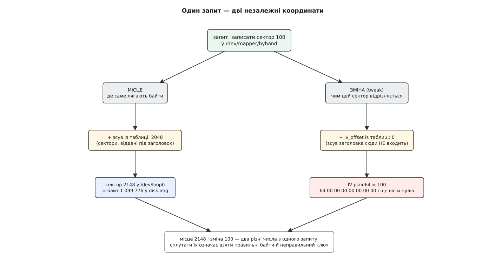

# ⚙️ Шифрований пристрій з одного рядка таблиці

Зберемо працездатний шифрований блоковий пристрій без `cryptsetup`, без LUKS і взагалі без жодного заголовка на носії: файл-образ, `losetup`, шістдесят чотири байти з `/dev/urandom` — і один рядок таблиці. А потім зробимо те, заради чого все й затівається: прочитаємо сирий образ **ззовні**, тридцятьма рядками розшифруємо з нього один сектор і звіримо з тим, що записували. Байти зійдуться тільки за однієї умови — якщо в цілі `crypt` справді немає нічого, крім ключа й номера сектора.

## Стенд

Другий диск не потрібен. [Loop-пристрій](root:sys-unix/loop-device) вдає блоковий носій, а читання й запис пересилає у звичайний файл; для всього, що вище, він не відрізняється від справжнього диска нічим, крім швидкості.

Одну штучність додамо навмисно: віддамо перші 2048 секторів образу «під заголовок», а шифровані дані почнемо відразу за ними. Самого заголовка там не буде, лишаться нулі, — але цей зсув відтворює головну пастку всієї роботи.

```sh
#!/bin/sh
set -eu

WORK=/var/tmp/cryptlab
IMG=$WORK/disk.img
NAME=byhand                  # → /dev/mapper/byhand
HDR=2048                     # секторів образу, відданих «під заголовок»
SECTORS=8192                 # довжина шифрованого пристрою, у секторах

mkdir -p "$WORK"
truncate -s $(( (HDR + SECTORS) * 512 )) "$IMG"
LOOP=$(losetup -f --show "$IMG")

( umask 077; dd if=/dev/urandom of="$WORK/key.bin" bs=64 count=1 status=none )
KEY=$(od -An -tx1 -v "$WORK/key.bin" | tr -d ' \n')
[ ${#KEY} -eq 128 ] || { echo "ключ мусить дати 128 шістнадцяткових цифр" >&2; exit 1; }
```

Шістдесят чотири байти — не забаганка. [XTS](root:sf-security/aes-xts) бере **два** ключі: одним шифрує дані, другим — номер сектора, тож на AES-256 треба 2 × 32 байти. З 32-байтовим ключем той самий рядок теж запрацює, мовчки й без попереджень, тільки це буде вже AES-128-XTS. Байти беремо з `/dev/urandom` — [джерела, яке ядро наповнює придатною для криптографії випадковістю](root:sys-unix/random-devices) і віддає без очікування.

## Один рядок

```sh
dmsetup create "$NAME" --table "0 $SECTORS crypt aes-xts-plain64 $KEY 0 $LOOP $HDR"

dmsetup table --showkeys "$NAME"
#   0 8192 crypt aes-xts-plain64 <128 шістнадцяткових цифр> 0 7:0 2048
blockdev --getsz /dev/mapper/"$NAME"       # 8192
```

Пристрій є. Рядок читається без жодного зайвого поняття: відрізок `0 8192` віддано цілі `crypt`, а далі йдуть п'ять її параметрів — шифр, ключ, зсув нумерації, носій і зсув даних на носії. Ані пароля, ані солі, ані натяку на місце, де щось із цього могло б зберігатися: `key.bin` — єдина копія ключа у всесвіті, і якщо його стерти, чотири мегабайти образу стануть шумом назавжди. Саме цю прогалину закриває LUKS — і, власне, тільки її.

## Дві координати з одного запиту

Нуль і 2048 у нашому рядку — це **різні** зсуви, і саме на них спотикаються найчастіше.

Останній параметр (`$HDR` = 2048) каже, **де на носії** лежать дані: логічний сектор 0 нашого пристрою фізично сидить у секторі 2048 образу. Третій параметр, `iv_offset` (у нас нульовий), каже зовсім інше — **яке число підставити в шифр**. Це число рахується від початку самої цілі, і зсув даних до нього не додається взагалі. У ядрі це два різні вирази у двох різних функціях:

```c
/* dm-crypt.c: МІСЦЕ — номер сектора всередині цілі, далі до нього
   додасться cc->start, тобто наші 2048 */
crypt_io_init(io, cc, bio, dm_target_offset(ti, bio->bi_iter.bi_sector));

/* dm-crypt.c: ЗМІНА — те саме число плюс iv_offset, і більш нічого */
ctx->cc_sector = sector + cc->iv_offset;
```



*Зсув даних зрушує місце й не зрушує зміну; `iv_offset` зрушує зміну й не зрушує місце. Тому обидва параметри існують окремо.*

Отже, сектор 100 нашого пристрою лежить у байтах від 1 099 776 образу, а шифрується числом 100. Хто підставить у шифр 2148, знайде правильні байти й не дістане з них нічого.

Навіщо ж тоді `iv_offset` узагалі існує, якщо у звичайному томі він нульовий? Заради сумісності. Трапляється чужий контейнер, у якому нумерація для шифру велася не від початку зашифрованої ділянки, а від початку всього файлу; щоб прочитати такий том, потрібен важіль, що зрушує **саму лише** нумерацію, не чіпаючи розташування. У `cryptsetup` цьому параметру відповідає ключ `--skip` для режиму без заголовка — сусід `--offset`, який зрушує вже місце.

## Відомий текст у відомий сектор

```sh
SECT=100
printf 'DM-CRYPT LAB MARKER' > "$WORK/plain.bin"
truncate -s 512 "$WORK/plain.bin"        # добиваємо нулями до цілого сектора

dd if="$WORK/plain.bin" of=/dev/mapper/"$NAME" \
   bs=512 seek=$SECT count=1 oflag=direct status=none
sync
```

`oflag=direct` тут не оптимізація, а умова досліду. Звичайний запис у блоковий файл лягає у [сторінковий кеш](root:sys-unix/page-cache-durability) і доходить до цілі `crypt` тоді, коли ядро вирішить його виштовхнути, — а нам треба, щоб на момент наступної команди байти вже пройшли крізь шифр. [Прямий ввід-вивід](root:sys-unix/buffered-and-direct-io) віддає запит у стос одразу.

Найгрубіша перевірка — чи не видно в образі того, що ми туди писали:

```sh
LC_ALL=C grep -aqs 'DM-CRYPT LAB' "$IMG" \
  && echo 'УВАГА: відкритий текст в образі' \
  || echo 'відкритого тексту в образі немає'

dd if="$IMG" bs=512 skip=$(( HDR + SECT )) count=1 status=none | xxd | head -2
#   00000000: 9f2c 41e8 7b03 d5aa 16c9 ...
```

## Розшифрувати ззовні

Готової утиліти для цього немає, і це трохи несподівано: `openssl enc` шифрів у режимі XTS не пропонує взагалі — вони відсіяні з переліку прямо в коді утиліти (`EVP_CIPHER_get_mode(cipher) == EVP_CIPH_XTS_MODE`). Отже, розшифрувальника пишемо самі, і він виходить коротким, бо все, чого бракує бібліотеці, ми вже знаємо: шістнадцять байтів зміни й ключ як є.

:::tabs

```python
#!/usr/bin/env python3
"""Розшифрувати один сектор образу тим самим способом, що й ядро."""
import sys
from cryptography.hazmat.primitives.ciphers import Cipher, algorithms, modes

SECTOR = 512


def xts_sector(key: bytes, sector: int, data: bytes) -> bytes:
    if len(key) not in (32, 64):
        raise SystemExit('XTS бере два ключі: разом 32 байти або 64')
    # plain64: номер сектора — 64-бітове число молодшим байтом уперед,
    # решта IV — нулі. Для 16-байтового IV це те саме, що 16 байтів
    # того самого числа в тому самому порядку.
    tweak = sector.to_bytes(16, 'little')
    dec = Cipher(algorithms.AES(key), modes.XTS(tweak)).decryptor()
    return dec.update(data) + dec.finalize()


def main(image, keyfile, hdr, sector):
    with open(keyfile, 'rb') as f:
        key = f.read()
    with open(image, 'rb') as f:
        f.seek((hdr + sector) * SECTOR)      # МІСЦЕ: зсув заголовка враховано
        ct = f.read(SECTOR)
    sys.stdout.buffer.write(xts_sector(key, sector, ct))   # ЗМІНА: без зсуву


if __name__ == '__main__':
    main(sys.argv[1], sys.argv[2], int(sys.argv[3]), int(sys.argv[4]))
```

```c
/* gcc -O2 -o xtsdec xtsdec.c -lcrypto
   ужиток: ./xtsdec disk.img key.bin 2048 100 > back.bin                     */
#define _FILE_OFFSET_BITS 64
#include <openssl/evp.h>
#include <stdio.h>
#include <stdlib.h>

#define SECTOR 512

int main(int argc, char **argv)
{
    unsigned char key[64], iv[16] = {0}, ct[SECTOR], pt[SECTOR];
    unsigned long long hdr, sect;
    EVP_CIPHER_CTX *ctx;
    FILE *f;
    int n, i;

    if (argc != 5)
        return fprintf(stderr, "ужиток: %s образ ключ hdr сектор\n", argv[0]), 2;
    hdr  = strtoull(argv[3], NULL, 10);
    sect = strtoull(argv[4], NULL, 10);

    if (!(f = fopen(argv[2], "rb")) || fread(key, 1, sizeof key, f) != sizeof key)
        return perror("ключ"), 1;
    fclose(f);

    f = fopen(argv[1], "rb");                              /* МІСЦЕ */
    if (!f || fseeko(f, (off_t)((hdr + sect) * SECTOR), SEEK_SET) != 0
           || fread(ct, 1, SECTOR, f) != SECTOR)
        return perror("образ"), 1;
    fclose(f);

    for (i = 0; i < 8; i++)                                /* ЗМІНА: plain64 */
        iv[i] = (unsigned char)(sect >> (8 * i));

    ctx = EVP_CIPHER_CTX_new();
    if (EVP_DecryptInit_ex(ctx, EVP_aes_256_xts(), NULL, key, iv) != 1
        || EVP_DecryptUpdate(ctx, pt, &n, ct, SECTOR) != 1)  /* увесь сектор за раз */
        return fprintf(stderr, "EVP відмовив\n"), 1;
    EVP_CIPHER_CTX_free(ctx);

    fwrite(pt, 1, (size_t)n, stdout);
    return 0;
}
```

:::

Обидві бібліотеки беруть шістнадцятибайтову зміну там, де в інших режимах стояв би вектор ініціалізації, — і це не збіг назв, а той самий IEEE 1619, який реалізує ядро. Ключ теж іде як є, без жодного перетасовування половин: і в ядрі, і в OpenSSL перша половина шифрує дані, друга — зміну. У коді ядра це записано просто коментарями: «tweak cipher, uses Key2 i.e. the second half of \*key» і «data cipher, uses Key1 i.e. the first half of \*key».

```sh
python3 decrypt-sector.py "$IMG" "$WORK/key.bin" "$HDR" "$SECT" > "$WORK/back.bin"
cmp "$WORK/plain.bin" "$WORK/back.bin" && echo 'збіглося байт у байт'
```

Тепер зробімо ту саму помилку, з якої починають усі, — навмисно. Скажемо скриптові, що заголовка немає, а сектор має номер 2148: місце вийде те саме, бо `0 + 2148` дорівнює `2048 + 100`, а от у шифр піде вже інше число.

```sh
python3 decrypt-sector.py "$IMG" "$WORK/key.bin" 0 $(( HDR + SECT )) | xxd | head -1
#   00000000: 3a91 f4c0 62d7 1b08 ...   — байти правильні, а ключ до них — ні
```

Жодної помилки, жодного попередження: виявити, що зміну взяли не ту, XTS не має чим — він просто чесно виконує інше перетворення. Це й робить пастку такою живучою.

## Що видно з боку носія

Лишилося два записи, і кожен показує одну з двох протилежних властивостей шару.

```sh
ct_of() {
    dd if="$IMG" bs=512 skip=$(( HDR + $1 )) count=1 status=none |
        sha256sum | cut -c1-16
}

# той самий текст — в ІНШИЙ сектор
dd if="$WORK/plain.bin" of=/dev/mapper/"$NAME" bs=512 seek=200 count=1 \
   oflag=direct status=none && sync
echo "сектор 100: $(ct_of 100)"     # 4e0b9a13c7f6d2a8
echo "сектор 200: $(ct_of 200)"     # b71c05ee4a930f62   ← інші байти

# той самий текст — У ТОЙ САМИЙ сектор, удруге
dd if="$WORK/plain.bin" of=/dev/mapper/"$NAME" bs=512 seek=100 count=1 \
   oflag=direct status=none && sync
echo "сектор 100: $(ct_of 100)"     # 4e0b9a13c7f6d2a8   ← ті самі байти
```

Перший рядок — це та причина, через яку номер сектора взагалі затягли в шифр: однаковий вміст у різних місцях виглядає по-різному, і підготовлений візерунок повторів у шифротексті не проступає. Другий рядок — ціна цієї економії: свіжого випадкового значення нікуди покласти, тож перезапис того самого вмісту в те саме місце дає побайтово те саме. Хто має дві копії диска, зроблені в різний час, точно бачить, які сектори змінилися. Це не вада нашого саморобного стенда — `cryptsetup` дає рівно те саме.

```sh
dmsetup remove "$NAME"
losetup -d "$LOOP"
rm -rf "$WORK"
```

## Пастки

**Ключ у аргументах команди.** `dmsetup create --table "…$KEY…"` кладе сто двадцять вісім шістнадцяткових цифр в `argv`, а `argv` будь-якого процесу читається з `/proc` — поки команда виконується, ключ видно стороннім, і він же осідає в історії оболонки. Таблицю можна подати на стандартний ввід (`dmsetup create "$NAME"` без `--table` читає її звідти), хоча й тут оболонка може створити під документ тимчасовий файл. Чесна відповідь одна: замість шістнадцяткового рядка ставити посилання на [кільце ключів ядра](root:sys-unix/kernel-keyrings) — тоді відкритого ключа не існує ніде, крім пам'яті ядра.

**Порядок байтів зміни.** `plain64` кладе номер сектора молодшим байтом уперед на **початок** вектора; є ще `plain64be`, який кладе його старшим байтом уперед у **кінець**, і `plain`, який бере лише 32 біти й через це повторюється кожні 2 ТіБ. Різниця в рядку таблиці — одне слово, різниця у висліді — сектор, що розшифровується в сміття. Перевірити здогад дешево: замінити в скрипті `'little'` на `'big'` і подивитися, що вийде.

**Кеші між вами й образом.** Їх тут три: блоковий файл `/dev/mapper/byhand`, блоковий файл `/dev/loop0` і сам `disk.img`. Правило, яке рятує від годин непорозумінь: писати в пристрій прямим вводом-виводом (або хоча б `sync` плюс `blockdev --flushbufs`), а читати — **файл-образ**, а не `/dev/loop0`, бо драйвер loop пише саме у файл і його сторінки завжди свіжі. Чого робити не можна взагалі — правити образ збоку, поки loop-пристрій живий: про такі зміни його власний кеш не дізнається, а `losetup -c` перечитує лише розмір.

**Довжина ключа.** 128 шістнадцяткових цифр — це AES-256-XTS, 64 — AES-128-XTS, і обидва варіанти приймаються без слова. Хибна довжина завалює `dmsetup create` коротким повідомленням про помилку ioctl, а справжня причина лежить у `dmesg`. Головне ж — узгодженість: скорочуючи ключ удвічі, доведеться синхронно міняти й зовнішній розшифрувальник, у C-варіанті аж до `EVP_aes_128_xts()`.

> 🔧 **Навіщо це.** Після цих півгодини `cryptsetup luksDump` читається як схема, а не як заклинання: усе, що є в заголовку, існує рівно для того, щоб видати ті самі 128 цифр, які ми щойно набрали руками, а все, що нижче заголовка, — наш один рядок. Практичний вислід приходить у день аварії. Заголовок побитий, але майстер-ключ колись зберегли (`cryptsetup luksDump --dump-master-key`), а зсув даних відомий — і диск читається взагалі без `cryptsetup`: місце дає зсув плюс номер, зміну дає сам номер, і тридцяти рядків досить, щоб дістати з мертвого тому будь-який сектор.
