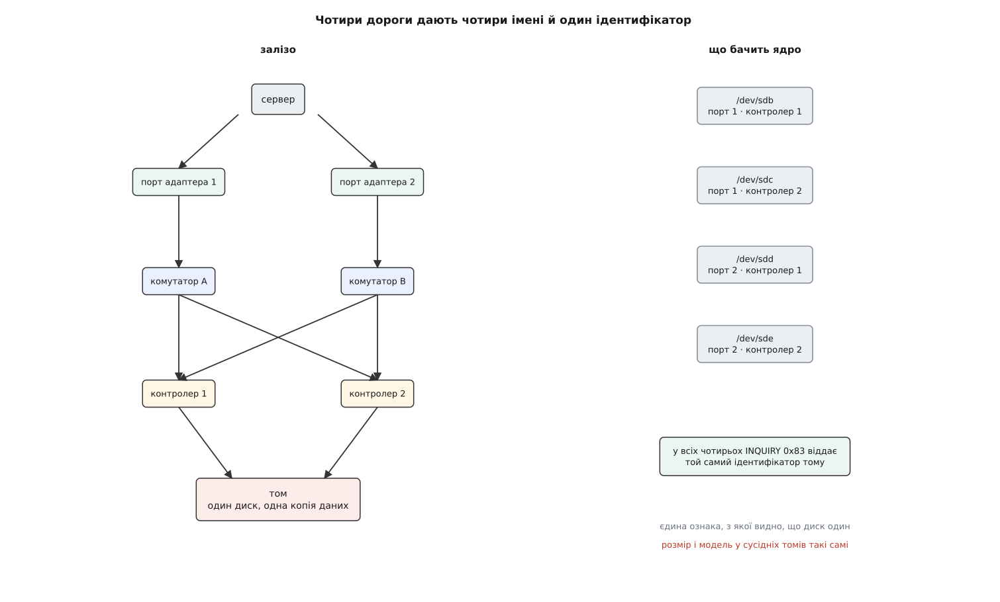
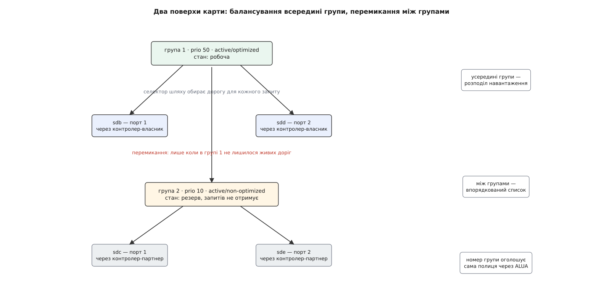
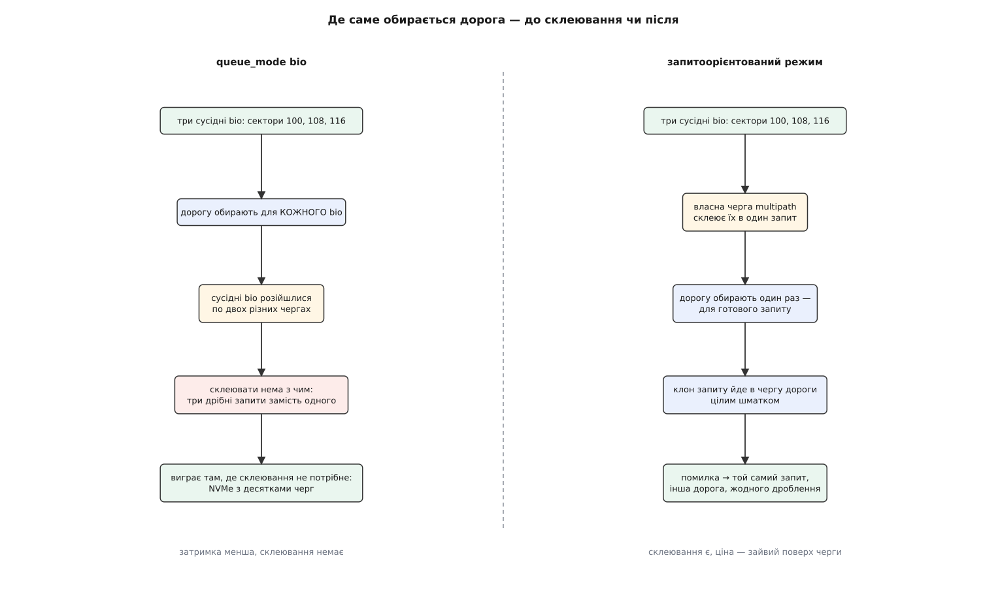
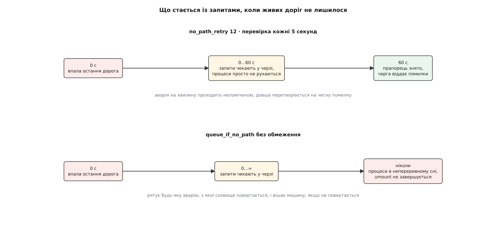

# Multipath: кілька шляхів до одного сховища

<preknowlist>
- [Блоковий пристрій: сектори, блоки й черга запитів](topic:sys-unix/block-device-model) — носій виглядає для ядра як масив пронумерованих секторів, окремий запит оформлений структурою `bio`, а перед відправкою вниз запити накопичуються в черзі й склеюються.
- [Device mapper: блоковий пристрій, зібраний із шарів](topic:sys-unix/device-mapper) — між файловою системою і залізом можна поставити код, який відповідає на кожен запит по-своєму; що саме він робить, задає рядок таблиці, і таблицю можна підмінити на живому пристрої.
- [Файл пристрою: символьний і блоковий](topic:sys-unix/device-file-model) — доступ до пристрою йде через файл у `/dev`, і всі блокові файли виглядають однаково незалежно від того, що за ними.
- [Старший і молодший номери пристрою](topic:sys-unix/major-minor-numbers) — пристрій усередині ядра адресують парою чисел `8:16`, а не іменем файла.
- [udev: іменування пристроїв і правила](topic:sys-unix/udev-rules) — поява й зникнення пристрою породжує подію в простір користувача, і саме там вирішують, як пристрій назвати.
- [Підсистема SCSI: команди, сенс-коди й обробка помилок](topic:sys-unix/scsi-subsystem) — до накопичувача звертаються командами, а на невдачу він відповідає кодом причини; звідси ядро й дізнається, чи це збій носія, чи збій зв'язку.
- [Планувальники блокового введення-виведення](topic:sys-unix/io-schedulers) — черга не просто зберігає запити, а впорядковує й склеює сусідні, і від цього залежить швидкість послідовного доступу.
</preknowlist>

## Два кабелі, чотири диски

Сервер і дискова полиця стоять у сусідніх шафах. Між ними два кабелі, і йдуть вони навмисно по-різному: різні комутатори, різні порти на полиці, за змоги й різні джерела живлення. Задум очевидний — заміна комутатора чи перебитий кабель не мають зупиняти роботу.

Перевірити задум просто: витягнути один кабель. Витягають — і файлова система на томі перемонтовується лише для читання, база даних падає, у журналі ядра сиплються помилки вводу-виводу. Залізо при цьому цілком справне: другий кабель на місці, полиця відповідає, жоден байт не втрачено. Не працює саме те, заради чого все й будувалося.

Причину видно з одного погляду на список пристроїв:

```
$ lsblk -o NAME,SIZE,VENDOR,MODEL
sdb   2T  NETAPP  LUN C-Mode
sdc   2T  NETAPP  LUN C-Mode
sdd   2T  NETAPP  LUN C-Mode
sde   2T  NETAPP  LUN C-Mode
```

Чотири блокові пристрої по два терабайти. Дисків при цьому не чотири — диск один. Просто до нього ведуть чотири дороги: два порти адаптера в сервері, помножені на два контролери в полиці. Кожну дорогу ядро виявило окремо, кожній видало власне ім'я — і про те, що всі чотири закінчуються в одному й тому самому місці, воно не знає нічого.

Далі все випливає з цього незнання. Файлову систему змонтували на `/dev/sdb`. Коли дорога через `sdb` обірвалася, запити почали повертатися з помилкою — а файловій системі нема чим цю помилку опрацювати: у неї є рівно один пристрій, з якого вона читає й на який пише. Вона не може «спробувати `sdc`», бо для неї `sdc` — інший диск із невідомим вмістом. Ситуація, у якій дані цілі й доступні, для неї нічим не відрізняється від ситуації, у якій диск згорів.

Не допоможе й програма вище. «Перевідкрити файл» нема куди: файл лежить у файловій системі, а та стоїть на мертвому пристрої.



*Кількість імен — добуток портів на контролери; кількість дисків — один. Знання про цю різницю ніде в системі не існує, поки його не додати.*

## Шар, який не чіпає даних

Знання «ці чотири — одне» має жити нижче за файлову систему, бо саме файлова система не вміє з ним нічого зробити, і вище за чотири пристрої, бо кожен із них поодинці нічого про сусідів не знає. І виглядати цей шар мусить як звичайний блоковий пристрій — інакше довелося б переробляти все, що над ним.

Опис збігається з тим, що дає device mapper: пристрій, зібраний із рядка таблиці, під яким лежать інші пристрої. Ціль називається `multipath`, і серед усіх цілей вона виняткова однією рисою — **вона не змінює в даних жодного байта**. Шифрування перетворює сектор, знімок підміняє його іншим, перевірка цілісності рахує над ним суму. Multipath не робить нічого з вмістом: він лише вирішує, **куди** поїде запит.

Цю рису варто проговорити одразу, бо на ній ґрунтується найпоширеніше хибне очікування. Multipath — не резервування даних. [RAID](topic:sf-data/raid-levels) у режимі дзеркала тримає дві копії й може відновити зіпсований сектор із другої. Тут копія одна: усі чотири дороги ведуть до тих самих комірок пам'яті. Зіпсований сектор прочитається зіпсованим будь-якою дорогою. Multipath резервує **доступ**, а не **вміст** — і саме тому в нього немає ані ресинхронізації, ані питання «а яка копія правильна», ані способу полікувати дані.

## Як довести, що чотири імені — це один диск

Сам шар здогадатися не може, а помилка тут коштує дорого: якщо зібрати в один пристрій дороги до **різних** дисків, файлова система писатиме частину даних на один том, частину на інший.

Порівнювати вміст — не варіант. Два щойно розмічені томи однакового розміру мають однакові перші сектори, а читати два терабайти заради звірки безглуздо. Порівнювати розмір і модель — ще гірше: у полиці таких томів десяток.

Правильна відповідь інша: спитати сам пристрій. У SCSI для цього є команда INQUIRY зі сторінкою життєво важливих даних `0x83` — ідентифікація пристрою. У відповідь пристрій повертає ідентифікатори, які належать **логічному тому**, а не порту, крізь який його питають. Серед них — ідентифікатор формату NAA (*Network Address Authority*), глобально унікальний і виданий виробником один раз. Той самий том назве той самий рядок через будь-який зі своїх портів.

У просторі користувача це витягає невелика програма, яку запускає udev при появі кожного диска:

```sh
$ /usr/lib/udev/scsi_id --whitelisted --device=/dev/sdb
3600a098038303853752b4a59696d3364
$ /usr/lib/udev/scsi_id --whitelisted --device=/dev/sde
3600a098038303853752b4a59696d3364
```

Цей рядок і називають WWID (*World Wide Identifier*). Він однаковий — отже, `sdb` і `sde` ведуть до одного тому. Він же за замовчуванням стає іменем пристрою в `/dev/mapper`, бо це єдине ім'я, яке не залежить ані від порядку виявлення дисків, ані від того, які кабелі були під'єднані на момент завантаження. У NVMe роль WWID грають ідентифікатори простору імен — NGUID або UUID, — які теж належать самому простору, а не з'єднанню.

> 🔧 **Навіщо це.** З цього випливає, чому в налаштуваннях multipath є чорні списки й чому їх не можна лишати порожніми. Локальні диски й дешеві носії часто або не мають унікального ідентифікатора взагалі, або віддають однаковий на цілу партію. Якщо два різні пристрої назвуться однаково, демон складе з них одну карту — і файлова система почне писати половину даних не туди. Тому за замовчуванням у карту беруть лише те, що явно дозволено або що має щонайменше дві дороги з однаковим WWID.

## Дороги нерівні

Здавалося б, далі все просто: тримати список живих доріг і роздавати їм запити по черзі. Це працювало б, якби дороги були рівноцінні. Вони не рівноцінні.

У полиці два контролери, і том у певний момент належить одному з них. Другий контролер запит теж прийме — але обслужить його не сам, а перекине партнерові через внутрішній зв'язок. Виходить довше, і чим більше такого трафіку, тим гірше. Розподіливши навантаження порівну між усіма чотирма дорогами, можна отримати результат гірший, ніж якби працювали самі лише дві «правильні».

Звідси двоповерхова будова карти. Дороги збирають у **групи пріоритету**. Усередині групи вони рівноправні, і навантаження між ними розподіляють. Між групами рівности немає — це впорядкований список: працює одна група, решта чекають. Перехід на наступну групу і є те, що називають перемиканням при відмові; розподіл усередині групи — балансуванням. Дві різні речі, які часто плутають, живуть на двох різних поверхах однієї карти.

Хто вирішує, яка група краща? Знову ж таки — сама полиця, бо тільки вона знає, який контролер зараз володіє томом. Стандарт SCSI (SPC-3) описує для цього механізм ALUA (*Asymmetric Logical Unit Access* — асиметричний доступ до логічного пристрою). Порти полиці розбито на групи, і команда REPORT TARGET PORT GROUPS повертає стан кожної:

- **active/optimized** — порт веде до контролера-власника, найкоротша дорога;
- **active/non-optimized** — порт працює, але запит піде в обхід, через партнера;
- **standby** — порт готовий, але зараз запитів не приймає;
- **unavailable** — контролер за цим портом лежить.

Простір користувача перетворює стан на число: 50 за оптимальний, 10 за неоптимальний, менше за решту. Дороги з однаковим числом і потрапляють в одну групу. Ось як усе це виглядає разом:

```
$ multipath -ll
mpatha (3600a098038303853752b4a59696d3364) dm-3 NETAPP,LUN C-Mode
size=2.0T features='1 queue_if_no_path' hwhandler='1 alua' wp=rw
|-+- policy='service-time 0' prio=50 status=active
| |- 1:0:0:1 sdb 8:16 active ready running
| `- 2:0:0:1 sdd 8:48 active ready running
`-+- policy='service-time 0' prio=10 status=enabled
  |- 1:0:1:1 sdc 8:32 active ready running
  `- 2:0:1:1 sde 8:64 active ready running
```

Дві групи. Верхня зі станом `active` — саме в неї йдуть запити, і в ній дві дороги, `sdb` і `sdd`, обидві через контролер-власник. Нижня зі станом `enabled` — це резерв, він не використовується, поки в верхній лишається хоч одна жива дорога.

Усередині групи конкретну дорогу для кожного запиту обирає **селектор шляху** — маленький модуль ядра. Найпростіший, `round-robin`, роздає по черзі й дає добрий результат лише тоді, коли дороги справді однакові за швидкістю. `queue-length` дивиться, скільки запитів уже в польоті на кожній дорозі, і додає до найменш завантаженої. `service-time` іде далі: ділить обсяг даних у польоті на задану дорозі відносну пропускну здатність і обирає ту, що звільниться раніше. Різниця стає видною, коли одна з доріг раптом починає повільнішати: перший селектор і далі рівномірно заливатиме її запитами, два інші самі відступляться від неї.

Перемикання на іншу групу — не завжди просто «почати слати запити туди». Часто полиці треба явно сказати передати том: командою SET TARGET PORT GROUPS. Це робить **обробник заліза** — `scsi_dh_alua` у рядку карти позначений як `hwhandler='1 alua'`. Історично, до того як ALUA став загальним, кожен виробник мав власний обробник зі своєю послідовністю команд.



*Балансування і перемикання — операції з різних поверхів: перше відбувається на кожному запиті, друге лише коли група лишилася без живих доріг.*

Той самий стан у вигляді рядка таблиці device mapper виглядає так:

```sh
$ dmsetup table mpatha
0 4294967296 multipath 1 queue_if_no_path 1 alua 2 1 service-time 0 2 2 8:16 1 1 8:48 1 1 service-time 0 2 2 8:32 1 1 8:64 1 1
```

Читається зліва направо як послідовність лічильників: одна властивість (`queue_if_no_path`), один аргумент обробника заліза (`alua`), дві групи, робоча зараз перша; далі кожна група — селектор, його аргументи, кількість доріг, скільки чисел іде за кожною, і самі дороги в номерах пристроїв. Повна граматика цього рядка й відповідні ключі файла налаштувань зібрані окремо: [таблиця цілі multipath і ключі multipath.conf](topic:sys-unix/dm-multipath/api-multipath-table.md).

## Чому дорогу обирають для запиту, а не для bio

Ціль дістала помилку й має надіслати «те саме» іншою дорогою. Питання в тому, що вважати «тим самим».

Звичайна ціль device mapper працює з `bio`: отримала структуру, переписала в ній номер сектора й пристрій призначення, віддала вниз. Для multipath цього замало, і причин дві.

Перша — про швидкість. `bio` приходять зверху дрібними, і сенс черги внизу в тому, щоб склеїти сусідні у великі запити. Якщо ціль обирає дорогу для кожного `bio` окремо, два сусідні `bio` легко поїдуть різними дорогами — і склеювати їх уже нікому: у кожній нижній черзі вони опиняться поодинці. Послідовне читання перетворюється на потік дрібних запитів, а на обертовому диску це різниця в рази.

Друга — про помилку. Нижній пристрій повідомляє про невдачу не на `bio`, а на **запит**, зібраний із кількох `bio`. Розкласти цю помилку назад на окремі `bio` можна, але повторювати доведеться саме їх — знову дрібними, знову без склеювання, знову по одному вибору дороги на кожен.

Обидві причини вказують в один бік: дорогу треба обирати не для `bio`, а для вже зібраного запиту. Отже, у самого пристрою multipath має бути повноцінна черга з планувальником, який склеює `bio` в запити; вибір робиться над готовим запитом; униз іде його клон. Повтор після помилки тоді означає рівно одну дію — віддати той самий запит іншій дорозі.

Заради цього в device mapper з'явився другий режим роботи, запитоорієнтований. Його зробив Кійоші Уеда (Kiyoshi Ueda) з NEC: конструкцію описано в доповіді на Ottawa Linux Symposium 2007 і на LSF 2008, у ядро її взяли у версії 2.6.31 (2009). Це єдина ціль, заради якої довелося перебудувати сам механізм накладання шарів.

А потім маятник хитнувся назад. Прийшли твердотільні накопичувачі з інтерфейсом NVMe, у яких немає ані головки, ані обертання, а є десятки апаратних черг. Склеювання дрібних запитів на такому носії майже нічого не дає, зате зайвий поверх черги з'їдає помітну частку затримки. Тому у 2016 році, у ядрі 4.8, Майк Снітцер (Mike Snitzer) із Red Hat повернув цілі й режим на `bio` — тепер режим задають параметром `queue_mode` окремо для кожної карти.



*Вибір режиму вирішує не смак, а носій: там, де склеювання дає виграш, воно має відбутися до вибору дороги; там, де не дає, зайва черга лише додає затримки.*

## Хто помічає обрив і хто помічає повернення

Обрив помічається сам собою: запит повернувся з помилкою, ціль позначає дорогу як несправну й повторює на іншій. Це швидко й нікого не потребує.

Повернення дороги не помічає ніхто. На несправну дорогу запитів не шлють — отже, ніхто ніколи й не дізнається, що вона ожила. Пасивне спостереження тут не працює принципово: доводиться питати самим.

А «питати самим» — це вже не механізм, а політика: як часто питати, чим саме питати, скільки разів пробачити перш ніж повірити. Політику device mapper традиційно тримає в просторі користувача, і multipath не виняток. Питає демон `multipathd`.

Він робить три різні речі. **Перевіряє дороги**: періодично шле кожній, зокрема й несправній, дешеву перевірку — найчастіше це `tur` (команда TEST UNIT READY, яка не читає жодних даних), рідше `directio`, тобто читання одного сектора повз кеш. Дорога відповіла — демон каже ядру повернути її в карту. **Слухає події**: udev повідомляє про появу нового диска, ядро — про падіння дороги, і на кожну подію демон переглядає карту. **Тримає саму карту**: створює її при завантаженні, доповнює новими дорогами, змінює групи, коли полиця повідомила про новий стан ALUA.

Розподіл ролей тут чіткий: ядро вміє лише перекласти запит на живу дорогу й робить це за мікросекунди; усе, що вимагає рішення й терпіння, робить демон. Звідси й найпоширеніша помилка налаштування — лишити карту й вимкнути демон. Перемикання при відмові працюватиме бездоганно, а от повернення не станеться ніколи: за тиждень усі дороги по черзі побувають у стані «несправна» й там і лишаться, аж поки остання не забере том із собою.

## Коли доріг не лишилося

Остання дорога впала. Що робити із запитом, який уже в черзі?

Відповідей рівно дві, і жодна не є правильною завжди. Повернути помилку нагору — файлова система перемонтується лише для читання, база даних завершиться, робота стане. Притримати запити й чекати — процеси просто зупиняться, а коли дорога повернеться, продовжать з того самого місця, ніби нічого не було.

За другий варіант відповідає властивість `queue_if_no_path`, ту саму, що видно в рядку таблиці. Для перезавантаження комутатора це саме те, що треба: сорок секунд нічого не рухається, потім усе йде далі, і ніхто нічого не помітив.

І це ж пастка, якщо дороги не повернуться. Запити висять у черзі без обмеження часу, а процеси, що їх чекають, перебувають у [непереривному сні](topic:sys-unix/process-states) — їх не вбиває навіть SIGKILL, бо сигнал розглядається при поверненні з ядра, а повернення не настане. `umount` не завершується, вимкнення машини не завершується, і єдиний вихід — кнопка живлення.

Тому вибір роблять не «або-або», а з терміном. Ключ `no_path_retry N` віддає рахунок демонові: той рахує власні цикли перевірки й, коли їх минуло N без жодної живої дороги, знімає з карти прапорець `queue_if_no_path`. Черга миттєво спорожнюється помилками, і файлова система чесно дізнається, що диска немає.

**Скільки триває пільговий час** — множення інтервалу перевірки на кількість спроб:

```
базовий інтервал перевірки  polling_interval = 5 с
дозволено спроб             no_path_retry    = 12
пільга                                       ≈ 5 · 12 = 60 с
```

Оцінка приблизна: відлік веде сам демон власними тактами перевірки, а момент, коли впала остання дорога, з тактом не збігається — тож фактична пільга відрізняється від розрахованої на частку інтервалу.



*Обидва варіанти правильні для різних аварій, і вибрати доводиться наперед — у момент аварії відрізнити коротку від довгої нема як.*

> 🔧 **Навіщо це.** Число `no_path_retry` не має сенсу саме по собі — воно має сенс лише у порівнянні з сусідніми таймерами. Знизу стоїть транспорт: доки він не визнав порт мертвим, помилка навіть не дійде до multipath, і відлік не почнеться. Зверху стоїть застосунок зі своїм таймаутом на операцію. Пільга має вміщатися між цими двома: якщо вона довша за терпіння бази даних, база впаде раніше, ніж multipath устигне здатися, і всі шістдесят секунд очікування виявляться змарнованими.

Зібрати таку карту руками, поламати одну з доріг і подивитися на перемикання власними очима можна за пів години на файлах-образах, без жодної полиці: [multipath на двох петльових пристроях](topic:sys-unix/dm-multipath/proj-multipath-on-loop.md).

## Чого цей шар не бачить

**Напівживу дорогу.** Перевірка `tur` відповідає, дорога вважається справною — а дані нею повзуть, бо десь по маршруту сиплеться оптика й кожен другий кадр іде на повтор. Найгірший випадок — дорога, яка гикає: то падає, то повертається, і на кожному циклі забирає з собою частину запитів. Для цього в демоні є окремий рахунок помилок за вікно часу: дорога, яка за задане вікно впала більше ніж задану кількість разів, оголошується сумнівною й до карти не повертається, доки не відстоїть карантин.

**Корінь системи.** Якщо кореневий том лежить на multipath, карта має бути зібрана ще в initramfs — інакше корінь змонтується на голому `/dev/sdb`, машина завантажиться нормально, і все виглядатиме справним рівно до першої аварії кабелю. Симптом підступний саме тим, що до аварії його не видно.

**Чужу багатошляховість.** У NVMe та сама задача вирішується ще й іншим способом: драйвер сам збирає всі з'єднання до одного простору імен в один пристрій, а порядок доріг бере з ANA — це рідний для NVMe відповідник ALUA. Тоді жодного device mapper у стосі немає, і налаштування `multipath.conf` на такий пристрій не діють. Обидва підходи живуть паралельно, і який із них працює на конкретній машині, залежить від параметра ядра, а не від конфігурації multipath; докладніше — у темі про [NVMe в Linux](topic:sys-unix/nvme-in-linux).

Як із однієї задачі виросли спершу окремий режим у програмному RAID, потім комерційні драйвери від кожного виробника полиць, а вже потім спільна ціль device mapper із демоном у просторі користувача — окремо: [від md-multipath до dm-multipath](topic:sys-unix/dm-multipath/hist-from-md-multipath-to-dm.md).

## Наслідки одного речення

Ціль `multipath` не перетворює дані — вона перетворює адресата. Усе інше в ній є наслідком цієї єдиної обставини, прочитаним у різні боки.

Оскільки вміст не змінюється, тотожність доріг неможливо вивести з даних — її доводиться питати в самого пристрою, і вся конструкція тримається на тому, що пристрій чесно називає себе тим самим іменем крізь кожен свій порт.

Оскільки на мертву дорогу ніхто не шле запитів, її оживання не можна помітити пасивно — потрібен той, хто питає, а разом з ним і всі рішення про те, як часто й скільки разів.

Оскільки дороги нерівні, «будь-яка жива» — недостатній вибір, тож у карті з'явився другий поверх, а джерелом порядку стала сама полиця.

Оскільки запит повторюють цілим, вибір мусив піднятися над місцем, де `bio` склеюються в запити, — і опустився назад, щойно з'явилися носії, яким склеювання не потрібне.

І останнє, чого шар не подужає ніколи: не бачачи даних, він не може відрізнити «дорога зникла» від «диска більше немає». Це рішення завжди лишається за людиною — і записується наперед, одним числом.
