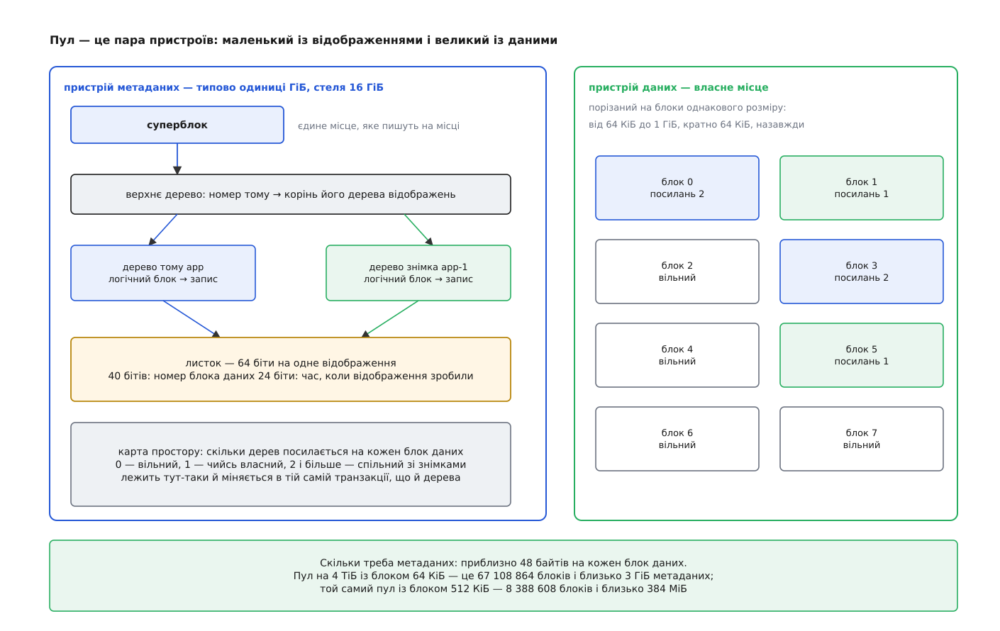
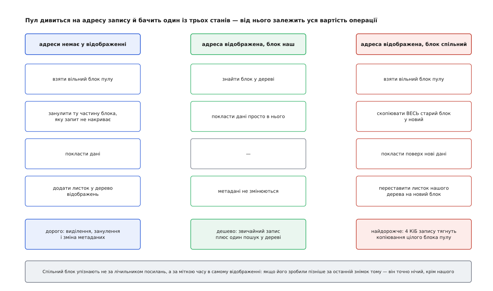
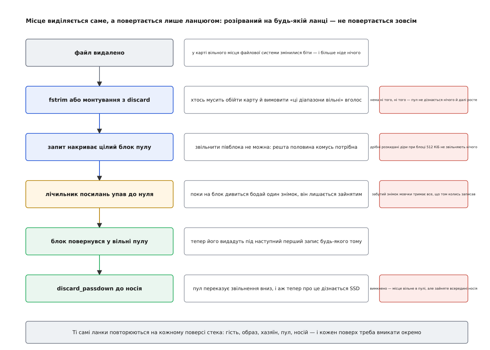

# Тонке виділення: dm-thin, спільний пул і повернення місця

<preknowlist>
- [Блоковий пристрій](topic:sys-unix/block-device-model) — носій, який ядро бачить як масив пронумерованих блоків однакового розміру; дій рівно дві — прочитати блок із номером N і записати блок із номером N.
- [Device mapper](topic:sys-unix/device-mapper) — шар ядра, що складає новий блоковий пристрій із наявних: кожному діапазону адрес призначено ціль, яка й вирішує, що робити із запитом.
- [Копіювання при записі](topic:sf-os/copy-on-write) — прийом «поки ніхто не пише, тримаємо одну копію на двох; на першому записі роздвоюємо».
- [Розміщення блоків файлу](topic:sys-unix/file-block-allocation) — хто обирає номери блоків під файл і де записано, які блоки файлова система вважає вільними.
- [Розріджені файли](topic:sys-unix/sparse-files) — файл може бути більшим за суму зайнятого ним місця, бо частина його діапазону просто не має блоків.
- [Discard і TRIM](topic:sf-data/discard-and-trim) — окрема операція блокового рівня, якою файлова система повідомляє, що діапазон блоків більше нікому не потрібен.
- [B-дерево](topic:sf-data/b-tree) — впорядкований пошуковий довідник із широкими вузлами, розрахований на зберігання на носії: пошук коштує логарифм, а вміщає лише те, що справді існує.
</preknowlist>

Три команди просять по два терабайти. Кожна пояснює чесно: точно менше, але хто його знає, а розширювати потім боляче. Диска в машині — чотири терабайти. Через півроку виявляється, що зайняли вони триста, чотириста й сто двадцять гігабайтів, а півтора терабайта диска так і простояли порожніми — не тому, що їх не було кому віддати, а тому, що вони вже комусь обіцяні.

Причина не в жадібності тих, хто просив. Місце **резервують у мить створення тому, а витрачають у мить запису**, і між цими двома митями лежать місяці. У першу мить про потребу не знає ніхто, у другу — вона вже точно відома. Рішення ухвалюють тоді, коли даних для нього найменше.

Отже, питання просте: чи можна перенести рішення з першої миті у другу — виділяти місце не тоді, коли том оголошують, а тоді, коли в нього справді щось пишуть.

Одним поверхом вище цей фокус давно живе: [розріджений файл](topic:sys-unix/sparse-files) вільно буває на терабайт при кількох мегабайтах зайнятого, бо в його діапазоні є діри, під які блоків ніхто не давав. Але файл лежить у файловій системі, а та стоїть на блоковому пристрої, зарезервованому цілком. Щоб той самий прийом працював для цілих томів, дірки треба зробити не у файлі, а в самому блоковому пристрої.

## Адреса, за якою ще нічого немає

Договір блокового пристрою вужчий, ніж здається. У ньому є «прочитати блок N» і «записати блок N» — і жодного слова про те, що для кожного N десь наперед приготовано місце. Приготованість була не вимогою, а звичкою: розділ — це зсув плюс довжина, тож місце під кожну адресу є за побудовою.

А коли між адресою й носієм уже стоїть [device mapper](topic:sys-unix/device-mapper) із його таблицею відповідностей, приготованість стає необов'язковою. У таблиці можна залишити дірки, і тоді на кожен запит буде два різні відгуки:

- **читання з невідображеної адреси** повертає нулі. Це не вигадка й не заглушка: туди ніхто ніколи не писав, а свіжий носій і так віддає нулі;
- **запис у невідображену адресу** змушує взяти вільний блок із запасу **просто зараз**, покласти дані туди й записати відповідність «логічний блок такий-то живе у блоці запасу такому-то».

Той запас називають **пулом** (англ. *pool* — спільна калюжа, складчина), а томи над ним — тонкими (звідси й **тонке виділення**, англ. *thin provisioning*): том оголошують великим, а місце він займає за фактом записаного. Оголошені розміри всіх томів тепер можуть спокійно перевищувати пул — так само, як [обіцяна процесам пам'ять](topic:sys-unix/overcommit-and-oom) перевищує фізичну, і з тієї самої причини: ставка на те, що всі одночасно свою обіцянку не заберуть.

Ця дрібна зміна ламає природу таблиці device mapper. Таблиця `linear` — це десяток рядків, які завантажили раз і тримають у пам'яті; вона не міняється, поки том не перезбирають. Тут відповідність міняється **на кожному першому записі** — тисячі разів на секунду — і мусить пережити вимкнення живлення, бо інакше після перезавантаження ніхто не знатиме, де лежать дані тонкого тому. Отже, це вже не таблиця, а структура даних на носії, зі своїми транзакціями. Саме тому тонкий пул складається не з одного пристрою, а з двох.

## Пул — це пара пристроїв

**Пристрій даних** — велике місце, порізане на блоки однакового розміру; з нього видають. **Пристрій метаданих** — маленький, і на ньому лежить усе, що пул знає: які логічні блоки яких томів у які блоки даних відображено і скільки посилань на кожен блок даних.

Розділили їх не з любові до симетрії. Метадані пишуть інакше, ніж дані: дрібними порціями, у розкидані місця й із примусовим скиданням на носій у кожній фіксації. На спільному шпинделі з даними кожне виділення блока коштувало б додаткового переміщення головки, а на спільному SSD — конкурувало б за ту саму чергу. Крім того, метадані мають власні жорсткі розміри, і їх треба вміти рахувати наперед.



*Усе, що пул знає про світ, лежить ліворуч; праворуч лежить саме місце, і про себе воно не знає нічого.*

Рахунок нескладний: на кожен блок даних треба десь близько 48 байтів метаданих. Звідси єдине число, яке доводиться обирати при створенні пулу й яке потім уже не змінити, — **розмір блока даних**. Ядро приймає від 64 КіБ до 1 ГіБ, кратно 64 КіБ; LVM за умовчанням бере 64 КіБ.

**Скільки метаданих потребує пул на 4 ТіБ.**

```
блок 64 КіБ:   блоків    = 4 ТіБ / 64 КіБ  = 67 108 864
               метадані  ≈ 67 108 864 · 48 Б = 3 ГіБ

блок 512 КіБ:  блоків    = 4 ТіБ / 512 КіБ = 8 388 608
               метадані  ≈ 8 388 608 · 48 Б = 384 МіБ
```

Пристрій метаданих має стелю в 16 ГіБ, і ця стеля разом із розміром блока задає найбільший осмислений пул: при блоці 64 КіБ вона впирається десь у 21 ТіБ даних, при 512 КіБ — у вісім разів більше.

## Чим платять за розмір блока

Обсяг метаданих — лише один із трьох рахунків, і всі три тягнуть у різні боки.

**Занулення нового блока.** Запис у невідображену адресу рідко накриває блок цілком: програма пише свої 4 КіБ, а блок пулу — 512 КіБ. Решту треба чимось заповнити, і єдине припустиме заповнення — нулі, бо в цьому блоці до того міг жити зовсім інший том. Тож перший запис у блок тягне за собою запис усього блока. Вимикач `skip_block_zeroing` цю роботу прибирає, але разом із нею прибирає й межу між томами: новий блок покаже те, що залишив попередній пожилець.

**Розрив спільності.** Коли блок спільний зі знімком, запис у нього не можна зробити на місці. Пул бере новий блок, **копіює туди весь старий**, кладе поверх нові дані й переставляє на новий блок листок того дерева, у якому писали. Знову ті самі 4 КіБ запису обертаються півмегабайтом роботи.



*Дешевий тут лише середній випадок; два крайні перетворюють дрібний запис на роботу з цілим блоком пулу.*

Отже, дрібний блок ласкавий до записів і до знімків, але роздуває метадані й дрібнить розкладку даних на носії; великий блок економить метадані й лишає файли суцільними, але робить дорогим і перше торкання, і кожен розрив спільності. Документація ядра радить близько 512 КіБ там, де знімків мало, і дрібніший блок там, де їх багато. Третій рахунок за цей вибір прийде наприкінці, коли йтиметься про повернення місця.

## Де живе відображення

Відображення могло б бути масивом: логічний блок — це індекс, у комірці лежить номер блока даних. Але тонкий том на те й тонкий, що оголошений набагато більшим за пул і майже весь складається з дірок. Масив довелося б тримати на всю оголошену довжину — тобто платити місцем рівно за те, чого нема, і в найгіршому разі витратити на облік більше, ніж на дані.

Тому dm-thin тримає відображення в [B-дереві](topic:sf-data/b-tree): у ньому лежать тільки ті ключі, що справді існують, а пошук коштує логарифм від їхньої кількості. Дерев два рівні. Верхнє відображає номер тому в корінь дерева цього тому; нижнє, своє в кожного тому, відображає логічний блок у запис про блок даних.

Запис у листку — це 64 біти, поділені навпіл несиметрично: **40 бітів під номер блока даних** (при блоці 64 КіБ це 64 ПіБ адресованого простору) і **24 біти під час**. Час тут — не годинник, а лічильник пулу, який зростає на одиницю щоразу, коли створюють знімок. Навіщо він, стане видно за розділ.

## Чому цю структуру не псує раптове вимкнення

Дерево, яке міняють тисячі разів на секунду, — очевидний кандидат на пошкодження при обриві живлення посеред зміни. Тому його не міняють.

Жоден вузол дерева не переписують на місці. Зміна одного листка — це записати новий листок у вільний блок метаданих, потім новий вузол над ним, і так до самого кореня: [копіювання при записі](topic:sf-os/copy-on-write), застосоване до власних службових структур. Старе дерево при цьому лишається цілим і досяжним, бо суперблок досі вказує на старий корінь. У мить фіксації пул дочікується, поки все записане ляже на носій, і аж тоді одним записом підміняє суперблок. Проміжного стану немає: на носії або старе дерево цілком, або нове цілком.

З цього тягнеться три наслідки.

Перший: обрив живлення відкочує пул до останньої фіксації. Свіжі записи можуть пропасти — так само, як вони пропали б на звичайному носії, — але відображення завжди залишиться узгодженим.

Другий, менш очевидний: у ту саму транзакцію входить і карта вільного місця. Блоки, які встигли видати після останньої фіксації, після відкоту знову числяться вільними самі собою. Місце не витікає, і збирати його нема кому.

Третій: пул уміє віддати назовні знімок власних метаданих, не спиняючись, — досить не пускати старий корінь у переробку. На цьому й тримаються засоби огляду тонкого пулу під навантаженням.

> 🔧 **Навіщо це.** Практична різниця видно на команді `thin_check`. Вона працює не з живим пулом, а з його носієм метаданих, і саме тому має право вимагати, щоб пул був неактивний: узгодженість тут — властивість того, що записано, а не того, що запущено. Коли операція над метаданими зазнає невдачі, пул виставляє в суперблоці позначку `needs_check`, переходить у режим лише для читання й далі не працює як слід, поки метадані не деактивують і не перевірять окремо. Це не примха, а прямий наслідок конструкції: полагодити дерево можна лише поза транзакцією, яка його змінює. Повний перелік того, що пул приймає ззовні й показує назовні, — [окремо](topic:sys-unix/dm-thin-provisioning/api-thin-pool-table.md).

## Знімок як скопійований корінь

Тепер знімок обходиться майже задарма. Створити його — це взяти корінь дерева тому, оголосити його ще й коренем нового тому й підняти лічильники посилань на спільні вузли. Дані не копіюються зовсім; час створення не залежить від розміру тому. Після цього немає «оригіналу» й «копії» — є два рівноправні дерева, які поки що дивляться на ті самі блоки.

Лишається питання, від якого залежить швидкість усього: як пул на кожному записі дізнається, спільний блок чи ні. Очевидна відповідь — глянути в лічильник посилань — коштує зайвого звернення до метаданих на кожен запис.

Замість цього працює лічильник часу з листка. Пул зберігає власний час і збільшує його на кожному створеному знімку; кожен том пам'ятає, яким був цей час, коли з нього востаннє робили знімок. Далі порівняння тривіальне: якщо відображення зробили **пізніше** за останній знімок тому, то в мить того знімка його ще не існувало, і жодне чуже дерево на нього дивитися не може — пиши на місці. Якщо раніше — блок може бути спільним, і треба розривати спільність. Одне порівняння двох чисел, які й так прочитали разом із відображенням, замінює звернення до карти посилань.

Наслідок для практики: **вартість запису не залежить від кількості знімків**. У класичній схемі `dm-snapshot` кожен знімок має власне сховище винятків, і запис у незайманий шматок доводиться копіювати в кожне з них окремо — при трьох знімках роботи втричі більше. Тут третій знімок не додає ані копіювання, ані пошуку. Саме тому на тонкому пулі спокійно тримають сотні знімків, а не один на час резервного копіювання, як заведено в [класичному LVM](topic:sys-unix/lvm-and-snapshots). Звідки взялася сама конструкція й чому вона з'явилася в Linux лише 2011 року, коли дискові масиви торгували тонким виділенням уже добрий десяток років, — [історія окремо](topic:sys-unix/dm-thin-provisioning/hist-from-arrays-to-dm-thin.md).

## Виділяється саме, повертається лише на прохання

Тут схована головна асиметрія тонкого пулу.

Виділення відбувається саме собою, бо в пула є сигнал: запис у невідображену адресу. Звільнення сигналу не має. Коли файл видаляють, [файлова система](topic:sys-unix/file-block-allocation) міняє кілька бітів у власній карті вільного місця — і більше нічого й ніде. Для блокового шару це подія без жодних ознак: жодного запиту вниз не пішло.

Отже, сам собою тонкий том **тільки росте**. Він піднімається до найвищої позначки, якої колись сягало все разом записане, і там залишається, навіть якщо файлова система на ньому порожня на дев'ять десятих. Класичне спостереження «том займає 900 ГіБ, а `df` показує 80» — не помилка обліку, а точний опис того, що сталося.

Єдиний канал через межу шарів — [discard](topic:sf-data/discard-and-trim). Команда `fstrim` обходить карту вільного місця й вимовляє вголос те, що доти було внутрішньою справою файлової системи: діапазони такі-то більше не потрібні. Тонкий том, отримавши такий запит, викидає відповідні відображення й зменшує лічильники посилань; блоки, чий лічильник упав до нуля, повертаються у вільні пулу.



*Кожна ланка — окремий вимикач, і всі мусять бути ввімкнені: працює лише наскрізний ланцюг.*

Умов, які мусять збігтися, чотири, і кожну з них хтось та й ловив.

**Хтось мусить сказати.** Або періодичний `fstrim` (у більшості дистрибутивів це щотижневий таймер), або монтування з `-o discard`, коли кожне звільнення йде вниз одразу. Немає ні того, ні того — пул не дізнається нічого.

**Запит мусить накрити цілий блок пулу.** Півблока звільнити не можна: друга половина комусь потрібна. Ось і третій рахунок за розмір блока: при 512 КіБ файлова система, у якій вільне місце розкидане дірками по 8–16 КіБ, поверне пулу рівно нічого, хоча `fstrim` відзвітує про гігабайти. При 64 КіБ шанси незрівнянно кращі.

**Лічильник посилань мусить упасти до нуля.** Поки на блок дивиться бодай один знімок, блок зайнятий. Знімок, зроблений «про всяк випадок» і забутий, мовчки тримає все, що том колись записував, — і скільки не тримай `fstrim`, пул не подешевшає ні на байт, поки цей знімок не приберуть.

**Носій — це ще один поверх.** Те, що блок повернувся у вільні пулу, для SSD не означає нічого: з його погляду туди писали, отже, там дані. Пул уміє переказувати звільнення вниз (`discard_passdown`), але лише для діапазонів, які цілком вільні. Вимкнена ця передача — і місце вільне в пулі, але зайняте всередині носія з усіма наслідками для його внутрішнього прибирання.

Той самий ланцюг повторюється на кожному поверсі стека, коли поверхів більше: у віртуальній машині — гостьова файлова система, гостьовий блоковий пристрій, образ, файлова система хазяїна, пул, носій. Розірваний десь посередині ланцюг виглядає точнісінько як справний, аж поки хтось не порівняє два числа.

## Коли пул усе-таки скінчився

У пулу два незалежні баки, і обидва можна осушити.

**Дані.** Коли вільних блоків не лишилося, пул переходить у режим `out_of_data_space`. Читання й записи в уже відображені власні блоки йдуть, як ішли; усе, що потребує нового блока, за умовчанням стає в чергу в надії, що пул ось-ось розширять, — а через `no_space_timeout` (типово 60 секунд) починає повертати помилки. Режим `error_if_no_space` відмовляє одразу, без очікування.

Біда не в самій відмові, а в тому, куди вона приходить. Файлова система рахувала вільне місце **в себе** й не передбачає, що звичайнісінький перезапис файлу або запис до журналу впреться в брак місця: за її моделлю світу ці операції нового місця не потребують. Отримавши помилку там, де її не буває, ext4 переводить себе в режим лише для читання, а за менш вдалого збігу — лишає [метадані в стані, який доведеться лагодити](topic:sys-unix/journaling-consistency).

Щоб до цього не доходило, у пула є сигналізація: коли вільних блоків лишається менше за задану позначку, ядро видає подію, яку ловить наглядач у просторі користувача. У LVM це `dmeventd` із порогом `thin_pool_autoextend_threshold` — сягнувши його, пул автоматично розширюють на заданий відсоток. Цінність цього механізму рівно така, скільки вільного місця лишилося в групі томів: сигналізація виграє час, а не створює місце.

**Метадані.** Другий бак підступніший. Він менший на три порядки, наповнюється не обсягом даних, а кількістю відображень — тобто розсипаним записом і знімками, — і його вичерпання не лікується на ходу. Пул переходить у режим лише для читання й виставляє `needs_check`; далі потрібно розібрати конструкцію, перевірити метадані `thin_check`, за потреби полагодити `thin_repair` і аж тоді розширювати. Тому пристрій метаданих беруть із запасом і стежать за ним окремо від даних: у виводі стану пулу це два різні дроби, і той, що зліва, менший і небезпечніший.

Побачити всі ці стани на власні очі неважко: тонкий пул збирається вручну з двох файлів через loop-пристрої й кількох команд `dmsetup`, і його можна цілком свідомо довести до вичерпання й повернути назад — [покроково](topic:sys-unix/dm-thin-provisioning/proj-thin-by-hand.md).

## Що насправді змінив цей перенос

Одне рішення — відкласти виділення до першого запису — купує три речі одразу: щільність, миттєві знімки й спільний запас, з якого беруть усі томи. Але заплачено за них не швидкістю, а зміщенням того, хто знає правду про вільне місце.

Доти розмір тому був обіцянкою, забезпеченою носієм: файлова система, питаючи в себе про вільне місце, отримувала відповідь, яку ніхто не міг скасувати. Тепер це обіцянка, забезпечена середнім по ансамблю, — а верхні шари й далі читають її як гарантію, бо іншого способу читати блоковий пристрій у них немає й не передбачено. Пул нічого їм не бреше; він просто не має каналу, яким сказав би правду.

Звідси й обов'язки, яких у товстого тому не було. Заповнення пулу — єдине число в стеку, яке за вас не перевірить ніхто вище. Знімок тут коштує так дешево, що його легко забути, — а забутий знімок утримує місце тихо й безстроково. І повернення місця не відбувається саме: воно потребує, щоб хтось на кожному поверсі вимовив уголос те, що доти було внутрішньою справою цього поверху.
