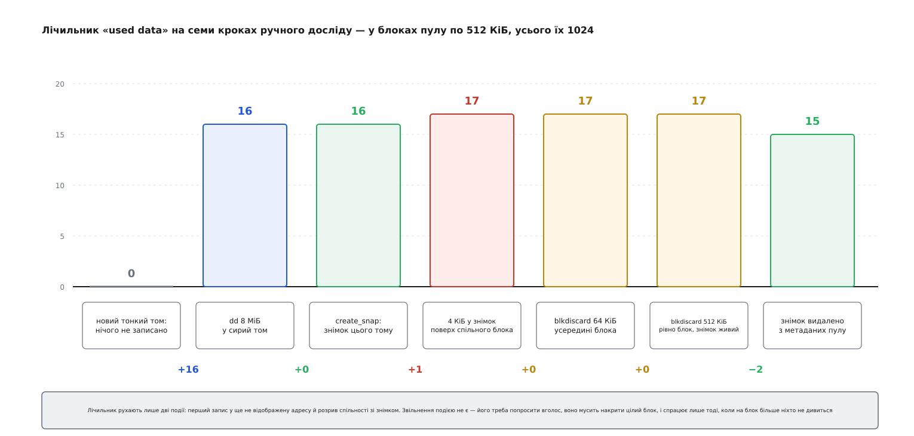

# ⚙️ Тонкий пул із двох файлів: зібрати руками й довести до вичерпання

Зберемо працездатний тонкий пул без LVM — два звичайні файли, `losetup` і три рядки таблиці `dmsetup` — і змусимо його показати все, що про нього розповідають, у вигляді чисел, які рухаються або вперто стоять на місці. Знімок не додасть ані блока. Чотирикілобайтовий запис поверх спільного блока додасть цілих півмегабайта. Дві однакові на вигляд команди `blkdiscard` дадуть протилежний вислід. А наприкінці ми свідомо заженемо пул у глухий кут і виведемо назад, не втративши даних.

Уся принада ручного стенда в тому, що кожне число тут виводиться на папері наперед. Помилився в арифметиці — побачив це того ж рядка.

## Стенд

Другого диска не треба. [Loop-пристрій](root:sys-unix/loop-device) вдає блоковий носій, а читання й запис пересилає у звичайний файл; для [device mapper](root:sys-unix/device-mapper) він не відрізняється від справжнього нічим, крім швидкості.

```sh
#!/bin/sh
set -eu

WORK=/var/tmp/thinlab
mkdir -p "$WORK"

BLK=1024                                 # розмір блока пулу, у секторах → 512 КіБ
truncate -s 8M   "$WORK/meta.img"
truncate -s 512M "$WORK/data.img"        # рівно 1024 блоки
META=$(losetup -f --show "$WORK/meta.img")
DATA=$(losetup -f --show "$WORK/data.img")

dd if=/dev/zero of="$META" bs=4096 count=1 conv=fsync status=none
```

Останній рядок — не гігієна, а перемикач. Складаючись, пул читає перші чотири кілобайти пристрою метаданих: побачив своє магічне число — відкриває наявний пул з усіма його томами; побачив нулі — заводить порожній. Тому «створити пул» і «підключити наявний» — це та сама команда, а різницю між ними робить оцей `dd`. Він же тут і найнебезпечніший: занулити метадані живого пулу означає викинути всі відображення, лишивши дані на місці — цілими, повними й недосяжними.

Розмір пристрою метаданих беруть за формулою з документації ядра: 48 байтів на кожен блок даних, і не менше 2 МіБ.

```
блоків даних = 512 МіБ / 512 КіБ = 1024
метадані     ≈ 1024 · 48 Б = 49 152 Б  →  округлюємо вгору до 2 МіБ
беремо 8 МіБ — щоб два баки наповнювалися помітно незалежно
```

## Пул і перший тонкий том

```sh
DATA_SECT=$(blockdev --getsz "$DATA")            # 1048576
dmsetup create pool --table "0 $DATA_SECT thin-pool $META $DATA $BLK 128"

st() { dmsetup status pool |
       awk '{printf "мета %-9s дані %-9s %s %s\n", $5, $6, $8, $10}'; }
st                       # мета 5/2048    дані 0/1024    rw queue_if_no_space
```

У таблиці після назви цілі стоять лише чотири значення: два пристрої, розмір блока й нижня позначка в блоках (128 × 512 КіБ — тобто коли вільного лишиться 64 МіБ, ядро подасть сигнал наглядачеві). Рядок стану так само скупий: два дроби — заповнення метаданих і даних, — далі режим і політика на випадок браку місця. Метадані міряються власними блоками по 4 КіБ, звідси 2048.

Том усередині пулу створюють не таблицею, а повідомленням:

```sh
dmsetup message pool 0 create_thin 0
dmsetup create raw --table "0 4194304 thin /dev/mapper/pool 0"     # 2 ГіБ
```

Це два різні вчинки, і плутати їх дорого. `create_thin 0` заводить том у метаданих пулу — з цієї миті він існує й переживе перезавантаження, хоча в `/dev` його немає. `dmsetup create` лише дає йому видиме ім'я й оголошену довжину. Оголосили два гігабайти на пулі в півгігабайта — і ніхто не заперечив.

## Сім чисел, які виводяться наперед

```sh
dd if=/dev/urandom of=/dev/mapper/raw bs=1M count=8 oflag=direct status=none
st                       # дані 16/1024        8 МіБ / 512 КіБ = 16
```

`oflag=direct` тут умова досліду, а не оптимізація: звичайний запис осів би у [сторінковому кеші](root:sys-unix/page-cache-durability) і дійшов би до пулу тоді, коли ядро надумає його виштовхнути, — а нам треба, щоб на момент наступної команди блоки вже було виділено. [Прямий ввід-вивід](root:sys-unix/buffered-and-direct-io) віддає запит у стос одразу.

Тепер знімок:

```sh
dmsetup suspend raw
dmsetup message pool 0 create_snap 1 0
dmsetup resume raw
dmsetup create snap --table "0 4194304 thin /dev/mapper/pool 1"
st                       # дані 16/1024 — ані блока
```

Призупинення тому — не формальність. `create_snap` увічнює те, що пул уже знає; запити, які висять у польоті, до цього ще не належать. `dmsetup suspend` виштовхує їх униз і не пускає нових, тож знімок дістається в спокійну мить. Без цього кроку знімок файлової системи вийде таким, яким том був би після раптового вимкнення живлення: [журнал](root:sys-unix/journaling-consistency) його, найпевніше, врятує, але навіщо влаштовувати аварію на рівному місці.

Розрив спільності:

```sh
dd if=/dev/urandom of=/dev/mapper/snap bs=4k count=1 seek=1000 \
   oflag=direct conv=notrunc status=none
st                       # дані 17/1024
```

Чотири кілобайти коштували цілого блока: пул узяв вільний блок, скопіював у нього всі 512 КіБ старого й аж тоді поклав поверх наші дані. Множник — сто двадцять вісім. Це і є та ціна, яку платять за великий блок, і причина, чому там, де знімків багато, беруть дрібніший.

Далі — дві команди, що відрізняються лише довжиною:

```sh
blkdiscard -o $((4*1024*1024)) -l $((64*1024))  /dev/mapper/raw
st                       # дані 17/1024 — нічого
blkdiscard -o $((4*1024*1024)) -l $((512*1024)) /dev/mapper/raw
st                       # дані 17/1024 — теж нічого, але вже з іншої причини
```

Обидві завершилися успіхом, жодна не повернула блока — і причини в них різні, у чому вся сіль. Перша просила звільнити 64 КіБ усередині блока. Ядро округляє початок діапазону вгору, кінець — униз, і від такого прохання не лишається нічого:

```c
/* dm-thin.c, get_bio_block_range(): початок УГОРУ, кінець УНИЗ */
b += pool->sectors_per_block - 1ull; /* so we round up */
...
if (e < b) {
	/* Can happen if the bio is within a single block. */
	e = b;
}
```

Порожній діапазон `process_discard_bio()` закриває успіхом і більш нічого не робить — ані помилки, ані сліду в журналі ядра. Друга команда накрила блок точно, і відображення в томі `raw` таки зникло, тільки на той самий блок і далі дивиться знімок: лічильник посилань упав з двох до одиниці, а вільним блок стає на нулі.

Нуля дочекаємося, прибравши знімок:

```sh
dmsetup remove snap                # прибрати ім'я з /dev
dmsetup message pool 0 delete 1    # прибрати том із метаданих пулу
st                                 # дані 15/1024
```

Мінус два, і кожен із двох блоків прийшов своєю дорогою. Один народився при розриві спільності й належав самому лише знімкові. Другий — той, що `raw` уже відпустив командою вище й який доти тримав знімок. Пул віддав рівно те, на що більше ніхто не дивиться, і ані блоком більше.



*Жодне з цих чисел не залежить ні від версії ядра, ні від файлової системи: усі сім виводяться з розміру блока й лічильників посилань.*

> 🔧 **Навіщо це.** Ці кілька команд відповідають на найчастіше запитання про тонкі пули — «`fstrim` звітує, що звільнив, а місця не побільшало». Причин рівно три, і всі щойно пройшли перед очима: прохання не накрило цілого блока; блок накрито, але на нього дивиться забутий знімок; або звільнення взагалі ніхто не попросив. Розрізняє їх не здогад, а два числа: `dmsetup status` до й після.

## Файлова система не каже нічого сама

```sh
dmsetup message pool 0 create_thin 2
dmsetup create fs --table "0 4194304 thin /dev/mapper/pool 2"
mkfs.ext4 -q -E nodiscard /dev/mapper/fs
mkdir -p /mnt/thin && mount /dev/mapper/fs /mnt/thin
st                       # дані 55/1024 — «порожній» том уже коштує сорок блоків
```

Сорок — число приблизне: скільки службових структур `mke2fs` розсипле по двогігабайтному тому, залежить від його версії й налаштувань. Важлива не сама позначка, а те, що вона не нульова.

```sh
dd if=/dev/urandom of=/mnt/thin/big bs=1M count=64 status=none && sync
st                       # дані 183/1024       +128, як і належить
rm /mnt/thin/big && sync
st                       # дані 183/1024       видалення — не подія
fstrim -v /mnt/thin
#   /mnt/thin: 1.9 GiB (2013265920 bytes) trimmed
st                       # дані 55/1024
```

Три показання лічильника — і вся асиметрія тонкого пулу на долоні. Запис змусив пул виділити, бо був сигнал. Видалення не змусило нічого, бо вниз не пішло жодного запиту. І лише [`fstrim`](root:sf-data/discard-and-trim) вимовив уголос те, що доти було внутрішньою справою ext4. Вартий уваги й розрив між числами: `fstrim` відзвітував про 1.9 ГіБ, а пул повернув 64 МіБ. Він не бреше — просто рахує вільне місце файлової системи, а не те, що з нього справді вдалося відпустити.

## Глухий кут

```sh
dd if=/dev/zero of=/dev/mapper/raw bs=1M oflag=direct status=none
#   dd: помилка запису '/dev/mapper/raw': На пристрої не лишилося вільного місця
```

Між останнім успішним мегабайтом і цим повідомленням — хвилина повної тиші. Що в ній діється, видно з іншого термінала:

```sh
dmsetup status pool | awk '{print $6, $8, $10}'
#   1024/1024 out_of_data_space queue_if_no_space     ← перші 60 секунд
#   1024/1024 out_of_data_space error_if_no_space     ← після таймауту
```

Режим не змінився — змінилася політика всередині нього, і робить це той самий таймер:

```c
/* dm-thin.c, do_no_space_timeout() */
if (get_pool_mode(pool) == PM_OUT_OF_DATA_SPACE && !pool->pf.error_if_no_space) {
	pool->pf.error_if_no_space = true;
	notify_of_pool_mode_change(pool);
	error_retry_list_with_code(pool, BLK_STS_NOSPC);
}
```

Хвилина мовчання — це ставка на те, що за неї встигне спрацювати наглядач і пул розширять; тоді верхні шари не помітять нічого, крім затримки. Розмір ставки видно й міняється на ходу:

```sh
cat /sys/module/dm_thin_pool/parameters/no_space_timeout    # 60
```

Хто вважає мовчазну хвилину гіршою за чесну відмову, ставить ознаку прямо в таблиці — і тоді той самий `dd` падає одразу, без паузи:

```sh
dmsetup suspend pool
dmsetup reload pool --table "0 $DATA_SECT thin-pool $META $DATA $BLK 128 1 error_if_no_space"
dmsetup resume pool
```

Вибір між цими двома — не про те, скільки даних загине: не запишеться однаково нічого. Він про те, кому й коли дістанеться помилка. Черга з таймаутом дає шанс наглядачеві. Негайна відмова дає файловій системі впертися в брак місця там, де вона його за своєю моделлю світу не передбачає, — і перейти в режим лише для читання за секунду, а не за хвилину.

## Назад до життя

```sh
truncate -s 1024M "$WORK/data.img"
losetup -c "$DATA"                        # перечитати новий розмір
DATA_SECT=$(blockdev --getsz "$DATA")     # 2097152

dmsetup suspend pool
dmsetup reload pool --table "0 $DATA_SECT thin-pool $META $DATA $BLK 128"
dmsetup resume pool
st                       # мета 21/2048   дані 1024/2048   rw queue_if_no_space
```

Пул повернувся в `rw` сам: на `resume` він побачив, що пристрій даних довший, ніж записано в його метаданих, і додав різницю до вільних. Нічого не втрачено — помилку діставали ті запити, під які місця вже не знайшлося, а не ті, що встигли пройти.

Розмір блока в новому рядку мусить бути той самий, що й був. Інший ядро не прийме, і це не примха: кожне число в метаданих виражене в блоках саме цього розміру. Прибрати за собою — у зворотному порядку складання:

```sh
umount /mnt/thin
dmsetup remove fs raw pool
losetup -d "$META" "$DATA"
rm -rf "$WORK"
```

## Пастки

**Ім'я в `/dev` і том у пулі — різні речі.** `dmsetup remove snap` прибирає лише ім'я; сам том далі живе в метаданих і далі тримає свої блоки. Це найчастіша причина здивування «знімки ж прибрані, чому місце не повернулося»: прибрані були імена. Звільняє `dmsetup message pool 0 delete <id>` — і він незворотний, підтвердження не питає.

**Порядок розбирання.** Поки живий бодай один тонкий том, `dmsetup remove pool` відповість «device or resource busy»; поки живий пул, `losetup -d` не забере його loop-пристроїв. Клубок розплутують згори вниз, і в скриптах це найчастіше забувають.

**Лічильник відстає.** Пул фіксує метадані не на кожну операцію, а періодично, тож `status` буває на секунду позаду. Число здається неправильним — дайте йому секунду або змусьте пул зафіксуватися парою `dmsetup suspend pool && dmsetup resume pool`.

**Другий бак.** Ліва половина рядка стану наповнюється не обсягом даних, а кількістю відображень: дрібний блок, розсипаний запис і сотня знімків здатні вичерпати метадані на майже порожньому пулі. Ця біда, на відміну від щойно пройденої, розширенням на ходу не лікується — доведеться спиняти пул і перевіряти метадані окремо.
