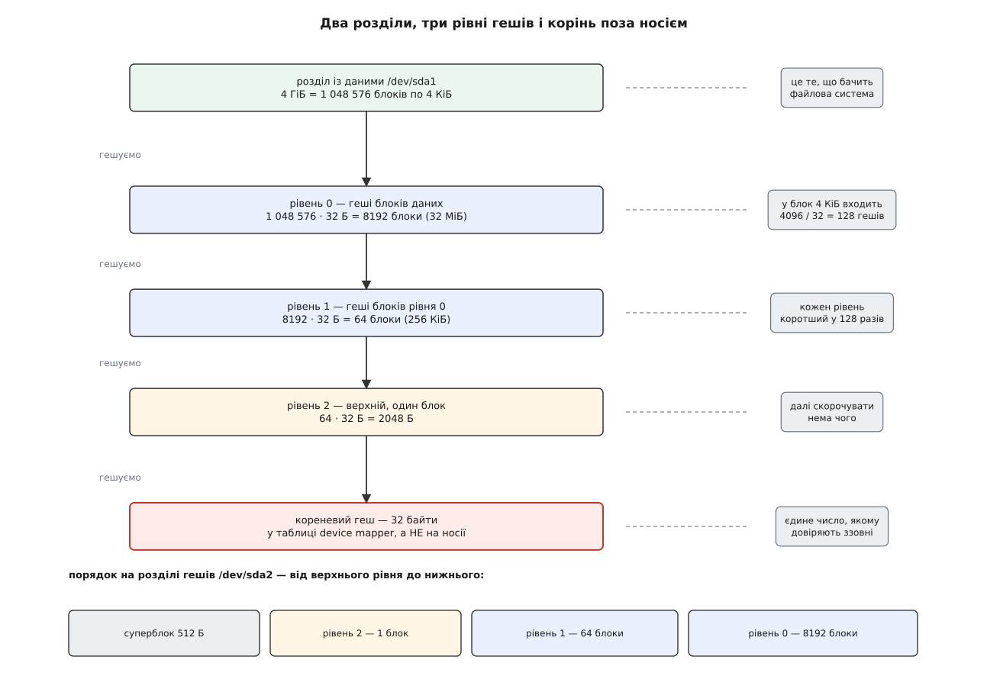
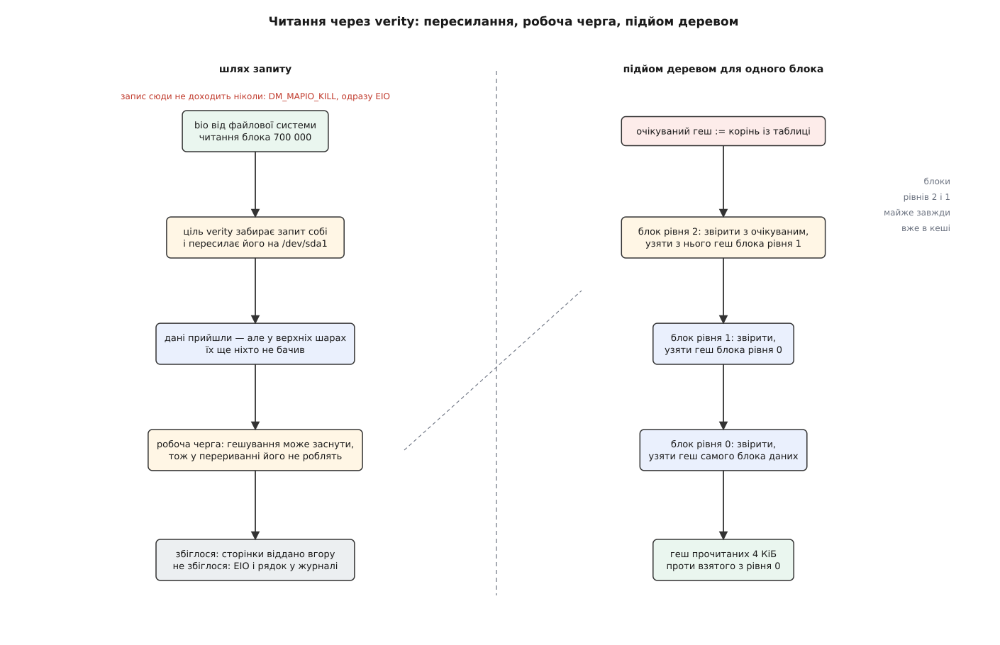
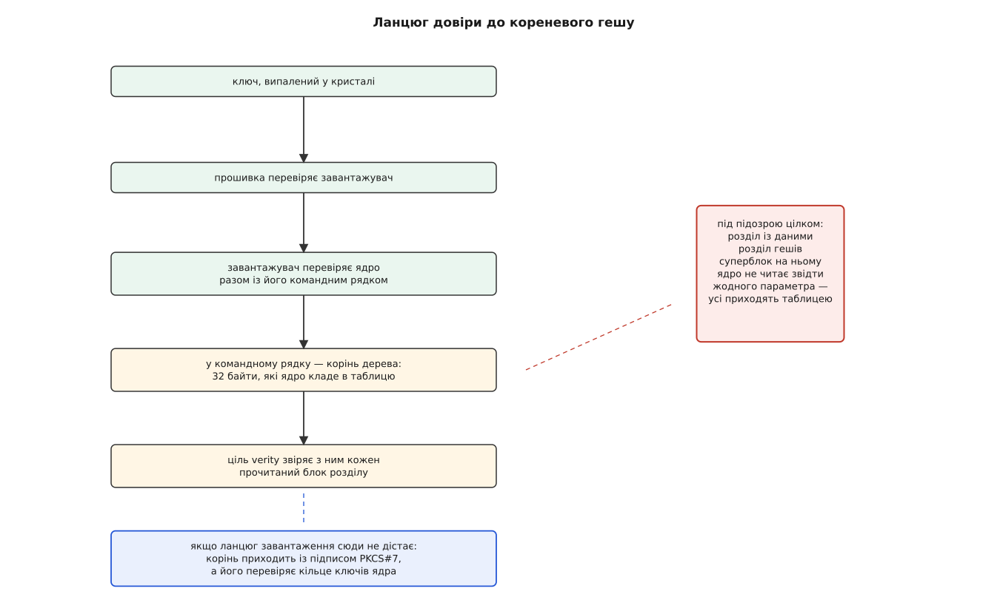

# dm-verity: блоковий пристрій під деревом Меркла

<preknowlist>
- [Блоковий пристрій: сектори, блоки й черга запитів](root:sys-unix/block-device-model) — носій виглядає для ядра масивом пронумерованих секторів, а кожне звернення до нього оформлене окремою структурою з номером, довжиною й сторінками пам'яті.
- [Device mapper: блоковий пристрій, зібраний із шарів](root:sys-unix/device-mapper) — між файловою системою й носієм можна поставити код, який дістає кожен запит; що саме він робить, задає рядок таблиці.
- [Кеш сторінок і довговічність запису](root:sys-unix/page-cache-durability) — прочитане з носія осідає в пам'яті, тож повторне читання того самого місця здебільшого до носія вже не доходить.
- [Криптографічні гешфункції](root:sf-security/cryptographic-hash) — коротка згортка даних, для якої підібрати інші дані з тим самим значенням практично неможливо.
- [Дерево Меркла](root:sf-algorithms/merkle-tree) — з гешів шматків будують геші наступного рівня, і так до одного кореневого значення.
- [Secure boot](root:sf-security/firmware-secure-boot) — кожна ланка завантаження засвідчує наступну, а перша тримається на ключі, вшитому в залізо.
</preknowlist>

Термінал самообслуговування стоїть у залі всю ніч сам. Уранці його вмикають, і він працює точнісінько так, як учора. За ніч у ньому змінилося чотири байти: хтось відкрутив кришку, причепив програматор до мікросхеми пам'яті й підправив одну гілку в програмі перевірки пінкоду. Ані швидкість, ані вигляд, ані журнали не змінилися. Мережа тут не допомогла б: ніхто нікуди не вламувався, зловмисник тримав носій у руках.

Отже, треба відповісти на питання: чи те, що зараз лежить на системному розділі, — те саме, що туди поклав виробник. Причому відповісти мусить сам пристрій, бо більше нікому.

## Чому підпису на весь розділ замало

Найпряміша відповідь — покласти поруч підпис усього розділу й перевіряти його при старті. Задум правильний за суттю й негодящий на практиці, і це видно з двох незалежних причин.

Перша — ціна. Розділ на чотири гігабайти доведеться прочитати цілком, з початку до кінця, перш ніж запуститься перша програма. На пристрої з пам'яттю, що віддає двісті мегабайтів на секунду, це двадцять секунд до кожного вмикання — і майже все прочитане ніколи не знадобиться: система за сеанс торкається кількасот мегабайтів.

Друга причина серйозніша. Перевірка на старті говорить про минуле. Вона стверджує «о восьмій нуль-нуль цей розділ був правильний» — і замовкає. А носій нікуди не подівся: він і далі лишається пристроєм, який відповідає на питання, і кожну наступну відповідь ніхто вже не звіряє. Між перевіркою і читанням лежить усе: збій комірки, контролер із власною підміненою прошивкою, той самий програматор на працюючій машині. Програма, що запускається о восьмій двадцять, читає свої сторінки з носія саме тоді — і бере їх на віру.

Обидві біди вказують в один бік. Перевіряти треба **той байт, який зараз віддають нагору, у ту мить, коли його віддають**. А щоб це не коштувало цілого розділу щоразу, перевірка одного блока має спиратися тільки на цей блок і на щось коротке та незмінне.

## Коротке й незмінне

Геш усього розділу і є коротким та незмінним — тридцять два байти на будь-який обсяг. Біда в тому, що порівняти з ним можна лише весь розділ.

Протилежна крайність — окремий геш на кожен блок у чотири кілобайти. Зернистість тепер саме та, але з'явився список на тридцять два мегабайти, і лежить він там само, де дані. Хто підмінив блок, підмінить і рядок списку. Щоб списку вірити, його треба перевірити — тобто прогешувати цілком, і задача повернулася на початок, тільки в сто двадцять вісім разів меншою.

Далі вже видно, що робити. Список гешів — теж просто байти: його ріжуть на такі самі блоки, кожен гешують, дістають список іще в сто двадцять вісім разів коротший, і так доти, доки не лишиться один блок. Множник береться з арифметики: у чотири кілобайти вміщується 4096 / 32 = 128 гешів SHA-256. Виходить [дерево Меркла](root:sf-algorithms/merkle-tree), у якого листя — блоки розділу, а вершина — одне число.

**Розділ на 4 ГіБ, блок 4 КіБ, SHA-256.**

```
блоків даних     = 4294967296 / 4096 = 1048576
рівень 0: гешів  = 1048576 · 32 = 33554432 Б = 8192 блоки
рівень 1         = 8192 · 32    = 262144 Б   = 64 блоки
рівень 2         = 64 · 32      = 2048 Б     = 1 блок  ← верхній
усього дерева    = 8192 + 64 + 1 = 8257 блоків ≈ 32.3 МіБ
частка від даних = 8257 / 1048576 ≈ 0.79 %
```

Щоб перевірити один блок даних, треба піднятися від нього до вершини — три блоки дерева, дванадцять кілобайтів. Замість чотирьох гігабайтів.



*Кожен наступний рівень у сто двадцять вісім разів коротший за попередній, тому шлях від блока до вершини завжди короткий; на самому носії рівні лежать від верхнього до нижнього, а вершина — не на носії взагалі.*

## Місце під файловою системою

Залишилося вирішити, на якому поверсі системи ця перевірка стоятиме.

Спокуса — у файлову систему: вона знає, які блоки кому належать. Але тоді захищеними виявляться дані файлів, а не її власні структури — таблиця inode, каталоги, карта вільного місця. Підміна каталогу не змінює жодного файлу, зате змінює, який саме файл запуститься на ім'я `/bin/login`. Крім того, розв'язок довелося б повторити в кожній файловій системі окремо.

Нижче за файлову систему лежить блоковий пристрій, і на цьому рівні різниці між «даними» та «метаданими» вже немає — є пронумеровані сектори. Шар, поставлений тут, накриває розділ цілком, разом із усім, що на ньому. І файлову систему для цього чіпати не треба взагалі: вона й далі бачить під собою звичайний пристрій, який на прочитаний сектор віддає байти.

Місце для такого шару в ядрі готове: [device mapper](root:sys-unix/device-mapper) дозволяє скласти віртуальний блоковий пристрій із рядків таблиці, де кожен рядок називає ціль — код, що обслуговує свій діапазон секторів. Ціль на ім'я `verity` (лат. *veritas* — істина) і робить описану роботу: пересилає читання на справжній носій, а перед тим, як віддати прочитане нагору, піднімається деревом.

Народилася ця ціль не в ядрі, а в Chromium OS — там від ноутбука вимагали, щоб після кожного вмикання він працював із завідомо незміненою системою, хоч би що з ним робили між сеансами; у головну гілку Linux вона ввійшла у випуску 3.4 навесні 2012 року. Як задум пройшов шлях від коду Google до переписаної версії в ядрі, чому в таблиці досі живе «версія 0» і як усе це опинилося в кожному телефоні на Android, розказано окремо: [від Chromium OS до Android](root:sys-unix/dm-verity/hist-chromeos-to-android.md).

Ціль дістає два пристрої — з даними й з гешами — і всі параметри дерева одним рядком:

```sh
veritysetup format /dev/sda1 /dev/sda2
#   Root hash:  4392712ba01368efdf14b05c76f9e4df0d53664630b5d48632ed17a137f39076

dmsetup create vroot --table \
  '0 8388608 verity 1 /dev/sda1 /dev/sda2 4096 4096 1048576 1 sha256 4392712b… 1a2b3c4d…'
```

Числа тут читаються так: пристрій завдовжки 8 388 608 секторів (тобто ті самі 4 ГіБ), формат версії 1, дані на `/dev/sda1`, дерево на `/dev/sda2`, блок даних і блок гешів по 4096 байтів, блоків даних 1 048 576, дерево починається з першого блока пристрою гешів, гешфункція SHA-256, далі корінь і сіль. **Сіль** — кілька випадкових байтів (типово тридцять два), які додають до кожного блока перед гешуванням; вона не робить геш стійкішим, а робить дерево непереносним: те саме дерево з іншою сіллю дає інший корінь, тож готове дерево від одного образу не підійде до іншого. Повний перелік полів таблиці, необов'язкових параметрів, формат суперблока на пристрої гешів і команди `veritysetup` зібрано в довідці: [таблиця й інтерфейс dm-verity](root:sys-unix/dm-verity/api-verity-table.md).

Один рядок цієї таблиці варто прочитати уважно: **кореневий геш стоїть у ній, а не на носії**. Це не дрібниця оформлення, а вимога, з якої випливає решта будови.

## Що відбувається на кожному читанні

Запит приходить у ціль так само, як у будь-яку іншу ціль device mapper — структурою `bio` з напрямком, номером сектора й переліком сторінок.

Запис відкидається одразу, без розмов: ціль повертає `DM_MAPIO_KILL`, і той, хто писав, дістає помилку. Причина не в обережності. Записаний блок змінив би свій геш, а отже, й блок рівня 0 над ним, і блок рівня 1, і вершину — тобто ті тридцять два байти, які лежать поза пристроєм і які ціль не може ані перерахувати, ані комусь нав'язати. Пристрій під деревом Меркла доступний лише для читання не за політикою, а за будовою.

Читання ціль забирає собі й пересилає на пристрій із даними, але залишає за собою завершення. Коли дані приходять, гешувати їх одразу не можна: завершення приходить у контексті переривання, а робота з криптографією в ядрі має право заснути. Тому ціль ставить перевірку в робочу чергу — і вже звідти піднімається деревом.

Підйом іде **згори вниз**, і саме такий порядок робить його чесним. Очікуваним гешем спершу оголошують корінь із таблиці. Далі беруть блок верхнього рівня, гешують його цілком і звіряють із очікуваним; лише після збігу з нього дозволено щось брати — а беруть звідти геш потрібного блока рівня нижче, і він стає новим очікуваним. Так до рівня 0, де в очікуваному опиняється геш самого блока даних. Кожен блок дерева перевірено перед тим, як йому повірили, тож ланцюг ніде не спирається на неперевірене.



*Ліворуч — доля запиту: запис гине одразу, читання пересилають на носій, а перевірку відкладають у робочу чергу; праворуч — сам підйом, у якому очікуваний геш передається згори вниз від блока до блока.*

Виглядає це дорого — чотири читання замість одного, — але дорого лише на папері. Блоки дерева ядро бере через власний кеш блоків, і верхні рівні спільні для всього пристрою: вершина одна на мільйон блоків даних, рівень 1 — це шістдесят чотири блоки на весь розділ. Після перших звернень вони просто лежать у пам'яті, причому вже позначені як перевірені, тож удруге їх не гешують. Реальним читанням лишається один блок рівня 0, та й той здебільшого вже поруч. У сталому режимі ціна перевірки — один SHA-256 над чотирма кілобайтами.

Тут же ховається причина, чому dm-verity, на відміну від [fs-verity](root:sys-unix/fs-verity), не веде обліку вже перевірених блоків даних. Над ним стоїть [кеш сторінок](root:sys-unix/page-cache-durability): повторне читання того самого місця файлу до блокового пристрою просто не доходить. Ціль бачить лише ті звернення, які справді йдуть на носій, — а такі перевіряти треба щоразу, бо саме між ними носій і може збрехати. Параметр, що вмикає бітову мапу «цей блок уже колись збігся, більше не перевіряти», у цілі є, але типово вимкнений: він перетворює постійну гарантію на разову, і вмикають його лише там, де процесорний час важить більше за неї.

> 🔧 **Навіщо це.** Коли на пристрої з verity після ручного «підправлю один файл у системному розділі» починають сипатися `EIO` на випадкових програмах, а `dmesg` показує рядки з номерами блоків, шукати збійний носій не треба. Дерево після зміни розділу не перебудовується самé, і кожен зачеплений блок тепер не збігається. Полагодити можна тільки одним способом: покласти розділ назад цілим і перерахувати дерево — тобто прошитися заново. Саме тому «на живу» системний розділ такого пристрою не правлять.

Побачити всю механіку руками — небагато роботи: два файли, [підкладені як блокові пристрої](root:sys-unix/loop-device), `veritysetup` і один зіпсований байт. Дослід, у якому пристрій збирають, ламають і дивляться, що саме скаже ядро, розписано окремо: [зібрати verity й зіпсувати його байтом](root:sys-unix/dm-verity/proj-verity-by-hand.md).

## Корінь довіри мусить прийти ззовні

Логіка, яка ставить корінь у таблицю, а не на носій, жорстка. Усе, що лежить на розділі, під підозрою — саме тому над ним і будували дерево. Отже, корінь дерева не може лежати там само: інакше зловмисник, який підмінив блок, підмінив би й корінь, і перевірка сумлінно підтвердила б підміну. Виходить не захист, а кільце.

Звідси й формат: ядро бере **всі** параметри з рядка таблиці — розмір блока, кількість блоків, гешфункцію, сіль, корінь. На пристрої гешів є суперблок із тими самими полями, але ядро його не читає взагалі; він потрібен лише інструментам простору користувача, щоб згадати, з чим мали справу. Ядро не приймає від підозрюваного пристрою жодного числа про нього самого.

Лишається питання, звідки числа беруться. Звичайний шлях — [командний рядок ядра](root:sys-unix/bootloader-and-cmdline): корінь стоїть там, а сам командний рядок завантажувач передає разом із ядром і засвідчує підписом як одне ціле. Далі ланцюг тягнеться вниз: завантажувач засвідчила прошивка, прошивку — ключ, випалений у кристалі. Так тридцять два байти виявляються останньою ланкою [ланцюга довіри](root:sf-security/firmware-secure-boot), перша ланка якого — фізична. Розгортає пристрій уже [initramfs](root:sys-unix/initramfs) або init, і зробити це вони мусять до того, як хтось спробує змонтувати корінь.



*Корінь дерева входить у систему разом із підписаним командним рядком; сам розділ — разом із суперблоком на ньому — у ланцюг не входить ніде.*

Другий шлях потрібен там, куди ланцюг завантаження не дістає: образ підключають уже в працюючій системі — як підписане розширення системи чи шар контейнера. Тоді корінь подають разом із підписом у форматі PKCS#7, а ядро перевіряє цей підпис своїм [кільцем ключів](root:sys-unix/kernel-keyrings) — тим, куди ключі потрапляють при збиранні ядра, а не з диска. Параметр ядра `dm_verity.require_signatures=1` робить підпис обов'язковим для всіх verity-пристроїв, і тоді ніхто в системі, навіть з правами адміністратора, не збере такий пристрій із власним коренем.

Останнє варто промовити прямо, бо це і є практичний сенс усієї конструкції. Право адміністратора на працюючій машині не дає права переписати системний розділ так, щоб зміна пережила перезавантаження: новий вміст вимагатиме нового кореня, а новий корінь — підпису ключем, якого на пристрої немає.

## Коли не збіглося

Типова поведінка при розбіжності скромна: запит завершується помилкою вводу-виводу, у журнал лягає рядок із номером блока. Файлова система бачить те саме, що побачила б на битому секторі, і поводиться так само — програма отримує `EIO`, а якщо читала через відображення в пам'ять, то `SIGBUS`.

Для системи, яка щойно виявила, що її код підмінили, цього мало. Тому в таблиці є параметри, що змінюють розв'язку: мовчки продовжити з поміткою в журналі, перезавантажитися або звалитися в паніку ядра. Перезавантаження тут не жест відчаю, а спосіб передати рішення тому, хто має чим його забезпечити: [завантажувач з двома слотами](root:sf-devices/ota-slots) рахує невдалі спроби й після кількох перемикається на попередній образ, який ще працював. Окремо від цього стоїть [відкат прошивки](root:sf-devices/ota-rollback) — підміну на **старий, але справжній і підписаний** образ дерево не ловить у принципі, бо той образ чесно відповідає своєму кореню; це задача лічильників версій у ланцюгу завантаження, не dm-verity.

Є й зворотна біда, суто інженерна. Флеш-пам'ять псується сама: комірка втратила заряд, і один блок перестав збігатися. Без перевірки система жила б далі й, найімовірніше, ніколи не звернулася б до цього блока; з перевіркою вона отримує помилку — а якщо не пощастило з місцем, то й не завантажується взагалі. Виходить, що засіб від зловмисника перетворює дрібну природну ваду на цеглину.

Розв'язок — надлишковість поруч із деревом: до розділу додають ще один, з кодами [Ріда–Соломона](root:com-modulation/reed-solomon), розкладеними впереміш по всьому носієві. Коли блок не збігся, ціль намагається відновити його з цих кодів — і, що важливо, відновлене не приймають на віру, а звіряють із деревом як завжди. Тому гарантія не слабшає ані на крок: виправлений блок мусить дати той самий геш. Ціна — близько відсотка місця, а працює це лише тоді, коли щось справді зламалося. У ядрі така можливість з'явилася у випуску 4.5, а в Android — з версії 7.0, де саме масовість зробила рідкісний природний збій щоденною проблемою.

## Ціна й межі

Місце: близько 0.79 % на дерево, і ще стільки ж, якщо додають коди виправлення. Для чотиригігабайтного розділу це тридцять два мегабайти й ще тридцять два.

Час: одне гешування чотирьох кілобайтів на кожен блок, що справді прийшов із носія. На процесорах з апаратними командами SHA це порядку одиниць гігабайтів на секунду на ядро — тобто найчастіше дешевше за саме читання.

Затримка: перевірка живе в робочій черзі, тож між приходом даних і їхньою видачею нагору вклинюється перемикання контексту. На повільному носії це не помітно; на швидкому NVMe стало помітно добре, і в цілі з'явився режим, у якому короткі перевірки роблять одразу, не будячи чергу.

І плата, яку у відсотках не виміряти: пристрій не можна змінити. Оновлення системи на такому апараті — це не правка файлів, а запис цілого нового образу в інший слот і перезавантаження з новим коренем у командному рядку. Звідси й межа застосування: dm-verity кладуть під системний розділ, який і мусить бути незмінним, і ніколи — під розділ із даними користувача.

Сусідні розв'язки відрізняються саме тим, що доводиться заморозити. [fs-verity](root:sys-unix/fs-verity) опускає ту саму ідею на рівень окремого файлу: незмінним стає файл, сусіди по каталогу живуть звичайним життям, зате корінь довіри доводиться шукати окремо для кожного файлу. [Стиснений образ лише для читання](root:sys-unix/read-only-image-filesystems) накриває цілу файлову систему, запаковану в один файл, — зручно, коли незмінний набір приходить і йде цілим шматком. А коли пристрій має лишатися записуваним, дерево не годиться взагалі, і на зміну йому приходить [dm-integrity](root:sys-unix/dm-integrity) з контрольними сумами, що оновлюються разом із даними, — але без зовнішнього кореня, тобто вже не проти зловмисника, а проти псування носія.

І чого dm-verity не робить: він не ховає вміст. Розділ читається ким завгодно, дерево лише не дає його непомітно змінити. Таємниця — це інша задача й інша ціль device mapper, [dm-crypt](root:sys-unix/dm-crypt); ці дві часто складають стосом, і кожна робить своє.

## Що з цього виходить

Уся конструкція тримається на одному незручному факті: пристрій, який бреше, неможливо викрити нічим, що зберігається на ньому самому. Отже, точка опори мусить бути поза ним — і вона мусить бути малою, бо винести назовні можна тільки те, що вміститься в підписаний командний рядок.

Дерево гешів і є перетворювачем між цими двома вимогами: воно робить тридцять два зовнішні байти достатніми, щоб судити про кожен із мільйона блоків, і робить це за час, що не залежить від розміру розділу. Незмінність пристрою — не обмеження, яке довелося докласти згори, а ціна, яку платять за право тримати опору назовні.
