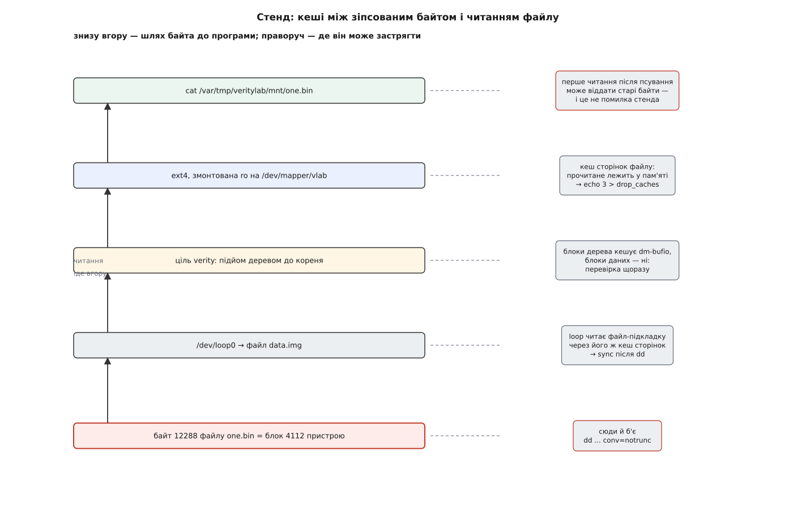

# ⚙️ Зібрати verity з двох файлів і зламати його одним байтом

Дослід на пів години, у якому на звичайному ноутбуці — без прошивок, ключів і підписаних завантажувачів — збирають блоковий пристрій під деревом гешів, псують у ньому рівно один байт і дивляться, що саме скаже ядро: який файл після цього перестане читатися, який читатиметься далі, чому спроба запису вмирає двома різними смертями і чому без скидання кешу дослід узагалі «не працює». Потрібні `losetup`, `veritysetup` і права адміністратора; усі команди нижче виконують від імені `root`.

## Стенд: два файли замість двох розділів

Цілі verity треба два блокові пристрої — з даними й з деревом. Другого диска для цього не потрібно: [loop-пристрій](root:sys-unix/loop-device) — драйвер, що вдає носія, а читання й запис пересилає у звичайний файл. Для всього, що вище, така пара не відрізняється від двох розділів нічим, крім швидкості.

Розмір файлу під дерево не беруть зі стелі, його рахують:

```
блоків даних     = 64 МіБ / 4 КіБ  = 16384
рівень 0: гешів  = 16384 · 32 Б    = 524288 Б = 128 блоків
рівень 1         = 128 · 32 Б      = 4096 Б   = 1 блок  ← верхній
дерево           = 128 + 1         = 129 блоків
суперблок        = 1 блок
усього           = 130 · 4096      = 532480 Б ≈ 520 КіБ
```

Мегабайта досить із запасом, а замалий файл `veritysetup format` просто відкине.

```sh
#!/bin/sh
set -eu

WORK=/var/tmp/veritylab
MNT=$WORK/mnt
mkdir -p "$WORK" "$MNT"

truncate -s 64M "$WORK/data.img"
truncate -s  1M "$WORK/hash.img"

LOOP_D=$(losetup -f --show "$WORK/data.img")
LOOP_H=$(losetup -f --show "$WORK/hash.img")
echo "$LOOP_D $LOOP_H"            # /dev/loop0 /dev/loop1
```

Файли [розріджені](root:sys-unix/sparse-files): `truncate` оголошує довжину, а блоки під нею з'являться лише там, де справді щось запишуть, — тож 65 МіБ на диску стенд не займе.

Далі — файлова система з трьома файлами:

```sh
mkfs.ext4 -q -b 4096 -L vlab "$LOOP_D"
mount "$LOOP_D" "$MNT"

head -c 40960 /dev/urandom > "$MNT/one.bin"
head -c 40960 /dev/urandom > "$MNT/two.bin"
head -c 40960 /dev/urandom > "$MNT/three.bin"
printf 'MARKER-ONE' | dd of="$MNT/one.bin" bs=1 seek=12288 conv=notrunc status=none

umount "$MNT"
sync
```

`-b 4096` — не примха. Для тому на 64 МіБ `mkfs.ext4` за замовчуванням узяв би блок на кілобайт, і тоді один блок verity накривав би чотири блоки файлової системи. З однаковим розміром нумерація в обох збігається, і в журналі ядра ми впізнаємо саме те число, яке порахуємо самі.

`MARKER-ONE` — мітка, за якою ми потім знайдемо фізичне місце файлу в образі, не питаючи про це файлову систему. А `umount` до перерахунку дерева обов'язковий: дерево має накрити остаточний стан носія, тимчасом як змонтована ext4 дописує на нього ще довго після останнього `cp` — хоча б час монтування в суперблоці.

## Дерево і тридцять два байти

```sh
ROOT=$(veritysetup format "$LOOP_D" "$LOOP_H" | awk '/^Root hash:/ {print $NF}')
echo "$ROOT"      # 64 шістнадцяткові цифри = 32 байти SHA-256
```

Повний вивід команди варто раз прочитати очима: там перелічені всі параметри, з якими дерево порахували, — тип, розмір і кількість блоків даних, розмір блока гешів, гешфункція, сіль і корінь. Ядру доведеться подати їх усі ще раз, бо з носія воно не візьме жодного. (У сценаріях зручніший `--root-hash-file`: корінь одразу лягає у файл, без розбирання виводу.)

З цієї миті `data.img` заморожено. Будь-яка зміна в ньому — зловмисна чи випадкова — робить дерево несправжнім, і `format` доведеться запускати заново.

## Відкрити і змонтувати

```sh
veritysetup open "$LOOP_D" vlab "$LOOP_H" "$ROOT"

blockdev --getro /dev/mapper/vlab     # 1
dmsetup status vlab                   # 0 131072 verity V
mount -o ro /dev/mapper/vlab "$MNT"
sha256sum "$MNT"/*.bin                # читаються всі три
```

`dmsetup status` для verity віддає рівно один символ: `V` — жодної розбіжності не траплялося, `C` — траплялася. Це не стан пристрою, а його пам'ять; за хвилину стане видно, наскільки вона довга.

`-o ro` — не ввічливість. Пристрій уже позначено як придатний лише для читання, тож `mount` і сам перейшов би в цей режим, попередивши про це; прапорець пишуть явно, щоб не переплутати, хто кому цю умову нав'язав. А от коли файлову систему розмонтували неохайно й у журналі лишилися незакінчені транзакції, `ro` не врятує: ext4 захоче [відтворити журнал](root:sys-unix/journaling-consistency), тобто **писати**, і монтування завалиться. Саме тому в нашому стенді `umount` стоїть до `format`.

## Один байт

Знаходимо мітку в образі й міняємо перший її символ:

```sh
OFF=$(grep -abo -m1 MARKER-ONE "$WORK/data.img" | cut -d: -f1)
BLK=$((OFF / 4096))
echo "зміщення $OFF, блок $BLK"      # зміщення 16842752, блок 4112

printf 'X' | dd of="$WORK/data.img" bs=1 seek="$OFF" conv=notrunc status=none
sync
```

`conv=notrunc` тут життєво потрібен: без нього `dd` обріже файл на цьому місці, і посиплеться геть усе, а не один блок. `sync` теж не забобон — loop типово читає файл-підкладку через його ж кеш сторінок, але з `--direct-io` пішов би повз кеш, тож зміну треба довести до самого файлу.

А тепер спроба прочитати — і нічого не стається:

```sh
cat "$MNT/one.bin" > /dev/null       # тиша: файл віддано з пам'яті
```

Це не хиба стенда, а головний урок про кеші. Байти, які ми щойно проганяли через `sha256sum`, лежать у [кеші сторінок](root:sys-unix/page-cache-durability), і повторне читання того самого місця до блокового пристрою просто не доходить — отже, не доходить і до цілі verity. Щоб дослід відбувся, пам'ять треба спорожнити:

```sh
sync
echo 3 > /proc/sys/vm/drop_caches
```



*Між зіпсованим байтом і програмою стоять два незалежні кеші сторінок і кеш блоків дерева. Верхній ховає підміну повністю, тому порядок завжди один: спершу `sync`, потім `drop_caches`, потім читання.*

```sh
cat "$MNT/one.bin"   > /dev/null   # cat: '.../one.bin': Input/output error
cat "$MNT/two.bin"   > /dev/null   # тиша — читається
cat "$MNT/three.bin" > /dev/null   # тиша — читається
dmsetup status vlab                # 0 131072 verity C
```

І рядок у журналі ядра:

```
device-mapper: verity: 7:0: data block 4112 is corrupted
```

Три речі в ньому варті уваги. `7:0` — не шлях, а старший і молодший номери пристрою з даними: ядро запам'ятало `/dev/loop0` парою чисел, а шлях був лише способом його назвати. Слово `data` каже, що не збігся блок пристрою даних, а не дерева. І `4112` — рівно те число, яке ми порахували з `grep` самі, тобто номер блока в одиницях `data_block_size`, а не сектор і не інод.

Найважливіше тут — те, чого **не** сталося. Сусідні файли читаються далі, і читатимуться скільки завгодно: дерево судить кожен блок окремо, тож зіпсована ділянка виводить із ладу рівно ті файли, чиї байти на ній лежать. Натомість `dmsetup status` показує тепер `C` — і показуватиме до кінця життя пристрою. Поверніть знищений байт на місце, скиньте кеш ще раз: `one.bin` знову прочитається без помилки, а літера залишиться `C`. Це не стан, а факт біографії — цей пристрій одного разу збрехав, і ціль цього не забуде, доки її не зберуть заново.

## Дві різні смерті одного запису

```sh
dd if=/dev/zero of=/dev/mapper/vlab bs=4096 count=1 oflag=direct
#   dd: failed to open '/dev/mapper/vlab': Operation not permitted
```

Це відмова блокового рівня, а не цілі: `blockdev --getro` показав одиницю, тож ядро не дає навіть відкрити такий пристрій на запис — до verity не доходить ані байта. Щоб дістати відмову самої цілі, зберімо той самий пристрій руками — `dmsetup create` без `--readonly` лишає його записуваним:

```sh
SALT=$(veritysetup dump "$LOOP_H" | awk '/^Salt:/ {print $NF}')
dmsetup create vrw --table \
  "0 131072 verity 1 $LOOP_D $LOOP_H 4096 4096 16384 1 sha256 $ROOT $SALT"

blockdev --getro /dev/mapper/vrw     # 0
dd if=/dev/zero of=/dev/mapper/vrw bs=4096 count=1 oflag=direct
#   dd: error writing '/dev/mapper/vrw': Input/output error
dmsetup remove vrw
```

Одиниця перед `sha256` — це `hash_start`: дерево починається з першого блока пристрою гешів, бо нульовий зайняв суперблок. Той суперблок ядро не читає взагалі, тому всі числа рядка нам і довелося виписати самотужки, а сіль — вивудити з пристрою окремою командою.

Тепер `EIO` прилетів від verity: запит дійшов до цілі, і та вбила його, навіть не глянувши, що саме пишуть. Причина не в обережності — записаний блок змінив би свій геш, а з ним і кожен блок дерева над ним аж до кореня, якого ціль не має ані права, ані способу переписати. Дві відмови виглядають однаково безнадійно, але живуть на різних поверхах, і `blockdev --getro` — найкоротший спосіб дізнатися, на якому саме ви застрягли.

`oflag=direct` теж не для краси: [буферований запис](root:sys-unix/buffered-and-direct-io) осів би в кеші, `write()` повернув би успіх, а помилку ми побачили б хіба згодом у журналі. Прямий ввід-вивід відносить сторінку на пристрій одразу, тож відповідь дістається тій самій команді.

## Чужий корінь

```sh
BAD="0${ROOT#?}"; [ "$BAD" = "$ROOT" ] && BAD="1${ROOT#?}"
veritysetup open "$LOOP_D" vbad "$LOOP_H" "$BAD"     # відпрацює мовчки
mount -o ro /dev/mapper/vbad /mnt2
#   mount: /mnt2: can't read superblock on /dev/mapper/vbad
veritysetup close vbad
```

```
device-mapper: verity: 7:0: metadata block 1 is corrupted
```

Створення не поскаржилося — і не могло: ядро не має способу дізнатися, «правильний» корінь чи ні, доки не прочитає перший блок дерева й не порівняє. Розбіжність вилізла на першому ж читанні, і слово в журналі інше: `metadata`, тобто не збігся блок пристрою гешів. Номер — одиниця, той самий верхній блок дерева одразу за суперблоком. Далі перевірка не пішла взагалі: ланцюг рветься на найпершій ланці, тож жодного блока даних ядро навіть не запитало.

Це і є практичний бік того, що корінь приходить ззовні. Підкласти власне дерево під чужий корінь не вийде, а власний корінь можна подати тільки туди, звідки ядро корінь бере, — у нашому стенді в аргумент `veritysetup`, а на справжньому апараті в підписаний командний рядок ядра.

Ту саму перевірку, до речі, можна зробити й без ядра:

```sh
veritysetup verify "$LOOP_D" "$LOOP_H" "$ROOT"
```

Ця команда перераховує дерево в просторі користувача й нічого не збирає — саме те, що треба, коли питання стоїть «чи цілий образ», а не «чи працює пристрій».

## Прибирання й пастки

Шари знімають у порядку, зворотному до складання:

```sh
umount "$MNT"
veritysetup close vlab
losetup -d "$LOOP_D" "$LOOP_H"
losetup -l | grep -q veritylab && echo "УВАГА: loop ще тримають"
rm -rf "$WORK"
```

Порядок не косметичний. `veritysetup close` на змонтованому пристрої чесно скаже `Device or resource busy`, і це видно одразу. А `losetup -d` на loop-пристрої, який досі тримає dm, поводиться підступніше: помилки не буде, від'єднання лише позначать прапорцем і виконають тоді, коли пристрій відпустить останній користувач. Команда «вдала», а `losetup -l` усе ще показує рядок — звідси й перевірка наприкінці.

І найтихіша пастка з усіх: `drop_caches` не чіпає брудних сторінок. Якщо після `dd` не зробити `sync`, зіпсований байт може так і сидіти в пам'яті, не дійшовши до файлу, — а дослід покаже, ніби дерево нічого не помічає. Двічі перевірте порядок: `sync`, потім `drop_caches`, потім читання.

> 🔧 **Навіщо це.** Три збої на пристрої з verity ззовні схожі один на одного — «щось не читається», — а лікуються по-різному. `data block N is corrupted` означає, що розділ зачепили після підрахунку дерева: перезбирати образ. `metadata block 1` на порожньому місці означає, що корінь у командному рядку не від цього образу: розійшлися версії, а розділ, найімовірніше, цілий. `Operation not permitted` на записі взагалі не збій, а будова, і шукати в ній причину марно. Півгодини з двома файлами дають упевненість, з якою ці три рядки читаються з першого погляду — і на своєму стенді, і на чужому апараті, що приїхав із поля.
