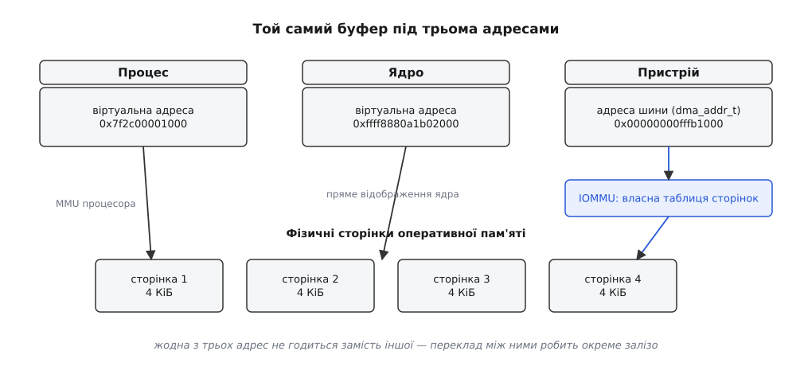
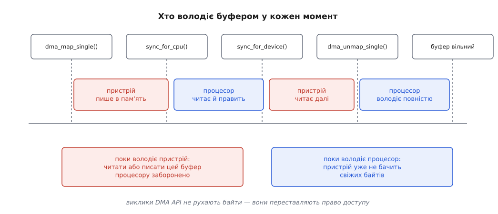
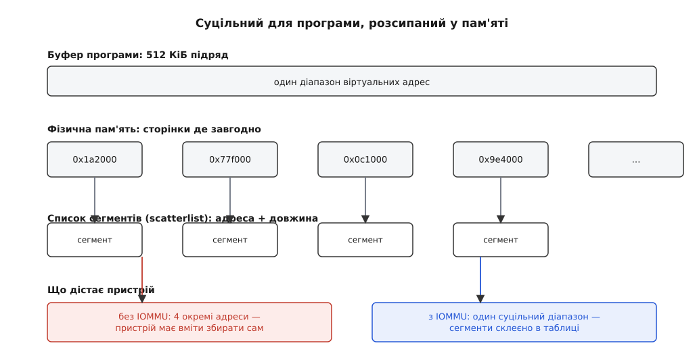

# DMA і відображення буферів у ядрі

<preknowlist>
- [Сторінкова пам'ять і MMU](topic:sf-os/paging-and-mmu) — процесор працює з віртуальними адресами, а окремий блок заліза перекладає їх у фізичні за таблицею сторінок.
- [Ядро й простір користувача](topic:sys-unix/kernel-and-userspace) — два адресні простори й межа між ними; драйвер живе по той бік межі.
- [Файл пристрою](topic:sys-unix/device-file-model) — залізо показане назовні як файл, за яким стоїть драйвер у ядрі.
- [Кеш процесора](topic:hw-arch/cache) — маленька швидка пам'ять біля ядра, куди автоматично потрапляє все, чого процесор торкнувся.
- [DMA-контролер](topic:hw-arch/dma-controller) — вузол заліза, який переносить дані між пам'яттю й пристроєм без участі процесора.
- [Переривання, softirq і робочі черги](topic:sys-unix/interrupts-bottom-halves) — як пристрій повідомляє ядру, що робота скінчилася.
- [mmap](topic:sys-unix/mmap-model) — відображення ділянки пам'яті в адресний простір процесу.
</preknowlist>

Мережева карта на 10 Гбіт/с приносить близько мільйона пакетів за секунду. Драйвер міг би забирати кожен пакет так, як програма читає число з регістра приладу: назвати адресу, отримати слово, назвати наступну. Порахуймо, у що це стане.

**Приклад: приймання пакетів читанням регістрів.**

```
довжина пакета            = 1500 байтів
читань по 4 байти         = 375
одне читання через PCIe   ≈ 100 нс   (запит іде до пристрою й вертається)
час на пакет              = 375 · 100 нс = 37.5 мкс
пакетів за секунду        = 1 000 000
потрібно процесорного часу = 37.5 с на кожну секунду реального часу
```

Тридцять сім секунд роботи на кожну секунду часу — це близько сорока ядер, зайнятих виключно переписуванням байтів, яких ніхто не читає. Жодне пришвидшення процесора цього не рятує, бо вузьке місце — не обчислення, а затримка звернення через шину.

Вихід один: хай пристрій сам покладе байти в оперативну пам'ять, а процесора торкнеться один раз — перериванням «готово». Для цього пристроєві треба сказати, **куди** класти. І саме тут починається все складне, бо адреса, якою користується драйвер, пристроєві нічого не означає.

## Вказівник, якого пристрій не зрозуміє

У драйвера є `void *buf` — звичайний вказівник, число в регістрі процесора. Коли процесор ним користується, це число проходить через MMU: блок перекладу дивиться в таблицю сторінок і перетворює віртуальну адресу на фізичну. Вказівник має сенс лише разом із цією таблицею.

Пристрій стоїть по інший бік шини. У нього немає ні таблиці сторінок ядра, ні доступу до MMU процесора. Він виставляє число на адресні лінії — і те число мусить бути правильним **із погляду шини**, а не з погляду процесора.

Напрошується: дати фізичну адресу. Часто це справді збігається, але покладатися на збіг не можна з трьох різних причин.

По-перше, шина може бачити ту саму пам'ять за іншими числами. На багатьох системах-на-кристалі оперативна пам'ять починається з фізичної адреси `0x80000000`, а периферійна шина адресує її з нуля — між двома поглядами стала різниця у два гігабайти.

По-друге, між пристроєм і пам'яттю може стояти власний перекладач адрес — [IOMMU](topic:hw-arch/iommu), таблиця сторінок для пристроїв. Тоді пристрій узагалі не називає фізичних адрес: він називає адреси, які IOMMU перекладе, і кожна така адреса мусить бути спершу в цю таблицю внесена.

По-третє, пристрій може фізично не дотягуватися до потрібного місця — про це трохи згодом.

Тому в ядрі є окремий тип для того числа, яке кладуть у регістр пристрою: `dma_addr_t`. Він навмисно несумісний із вказівником — компілятор не дасть переплутати. І здобувають його не арифметикою, а викликом.



*Байти лежать в одному місці, але кожен учасник називає їх своїм числом; переклад між числами робить окреме залізо.*

## Відображення — це не переклад адреси, а передача володіння

Виклик, який дає драйверові адресу для пристрою, виглядає так:

```c
dma_addr_t da = dma_map_single(dev, buf, len, DMA_FROM_DEVICE);
```

Слово «відображення» (mapping) тут не про арифметику. За цим викликом ядро може створити запис у таблиці IOMMU, може підмінити буфер іншим, може виконати операцію над кешем — що саме, вирішує платформа, і драйвер про це знати не повинен. Але одну річ драйвер знати мусить, і вона не про адреси.

Від моменту `dma_map_single` і до `dma_unmap_single` цей буфер **належить пристроєві**. Процесор не має права ні читати його, ні писати. Не «краще не треба» — просто не має права: прочитане може виявитися застарілим, записане може зникнути.

Симетрично: поки буфер не відображено, пристроєві він не належить, і те, що процесор туди пише, пристрій може не побачити.



*Виклики DMA API не рухають байти — вони переставляють право доступу між двома господарями пам'яті.*

Правило володіння виглядає надмірно суворим, доки не подивитися, звідки воно береться.

## Кеш, якого пристрій не бачить

Процесор майже ніколи не пише прямо в оперативну пам'ять. Він пише в кеш, а в пам'ять записане потрапляє потім — коли рядок кеша витіснять або коли хтось накаже його скинути.

Тепер складімо це з DMA. Драйвер заповнив буфер командою для пристрою — байти в кеші. Пристрій читає оперативну пам'ять і бачить там те, що було до запису: стару команду або сміття. Ніхто не помилився, просто дані ще не доїхали.

Зворотний бік гірший. Пристрій записав у пам'ять свіжий пакет. Процесор читає буфер — і потрапляє в кеш, де ще лежить вміст із минулого разу. Пристрій зробив усе правильно, драйвер прочитав правильну адресу, а дані неправильні.

На звичайному персональному комп'ютері цього не видно: контролер пам'яті стежить за зверненнями пристроїв і сам узгоджує їх із кешами процесора — детальніше про цей механізм є в статті [когерентність кеша і DMA](topic:hw-arch/cache-coherency-dma). Але апаратне стеження коштує транзисторів і енергії, тож на багатьох системах-на-кристалі його для частини шин просто немає. Там узгоджувати мусить програма.

Саме тому у `dma_map_single` є четвертий аргумент — напрямок:

- `DMA_TO_DEVICE` — писатиме процесор, читатиме пристрій. Перед передачею ядро **скидає** кеш у пам'ять, щоб пристрій побачив свіже.
- `DMA_FROM_DEVICE` — писатиме пристрій. Ядро **знецінює** рядки кеша, щоб процесор потім не прочитав старе.
- `DMA_BIDIRECTIONAL` — і те, й те, отже обидві операції; дорожче, тому не ставлять «про всяк випадок».

Напрямок — не підказка й не документація. Це вказівка, яку саме операцію над кешем виконати, і помилка в ньому дає збій, що на x86 не відтворюється взагалі, а на ARM вилазить зрідка й без сталої періодичності — тоді, коли кеш саме вирішив звільнити рядок.

Якщо процесорові конче треба зазирнути в буфер посеред довгої роботи — наприклад, драйвер повторно вживає той самий буфер у кільці, — володіння повертають і віддають явно: `dma_sync_single_for_cpu` перед читанням, `dma_sync_single_for_device` після правки. Це ті самі операції над кешем, тільки без розбирання відображення.

Звідси випливає незвична вимога до пам'яті під DMA. Кеш працює рядками (типово 64 байти), і знецінення знецінює цілий рядок. Якщо буфер починається посеред рядка, а в тому ж рядку лежить чужа змінна, то знецінення втратить і її свіже значення. Тому буфери під DMA беруть окремим виділенням із `kmalloc` і ніколи не роблять їх полями всередині більшої структури, яку паралельно править процесор: невирівняну ділянку ядро ще здатне прикрити власною підміною, а от чужого сусіда в спільному рядку йому не виправити.

> 🔧 **Навіщо це.** Драйвер, написаний і перевірений на x86, майже завжди працює й далі, коли напрямки та синхронізації розставлено недбало: залізо мовчки прикриває помилки. Той самий код на ARM-платі дає пошкодження даних раз на годину під навантаженням, і шукати його доведеться тижнями. Тому напрямок і межі володіння перевіряють на етапі написання, а не тоді, коли «щось дивне з мережею».

## Два роди буферів — і два роди відображення

Розгляньмо, як улаштований типовий драйвер. У нього є **кільце дескрипторів** — невелика таблиця, де кожен запис описує одну передачу: адреса, довжина, прапорці, ознака «оброблено». Процесор пише туди нові завдання, пристрій позначає виконані, і так безперервно, в обидва боки, дрібними порціями.

Синхронізувати кеш на кожен такий доторк — божевілля: операція над кешем коштує дорожче за сам запис у дескриптор. Тому для такої пам'яті ядро дає інший інструмент:

```c
void *ring = dma_alloc_coherent(dev, size, &ring_dma, GFP_KERNEL);
```

Тут пам'ять виділяють **одразу узгодженою**: на когерентній платформі це звичайна пам'ять, на некогерентній — відображена без кешування або з об'єднанням записів. Синхронізувати не треба ніколи, бо кешу, який треба узгоджувати, просто немає. Ціна відома: доступ процесора до такої пам'яті у рази повільніший, бо кожне читання йде до мікросхеми пам'яті. Тому так виділяють лише малі довговічні структури керування.

Дані — інша справа. Пакет, блок, кадр — великі, живуть коротко, ходять в один бік, і між `map` та `unmap` процесор їх не чіпає. Для них узгоджена пам'ять була б чистою втратою швидкості, тож їх відображають на час передачі — це і є `dma_map_single` з парним `dma_unmap_single`.

Отже, поділ такий: **керування — узгоджено й назавжди, дані — потоково й на час передачі.** Він проходить крізь кожен драйвер і визначає його будову.

```c
/* виділення кільця — один раз, при під'єднанні пристрою */
struct desc *ring = dma_alloc_coherent(dev, RING_BYTES, &ring_dma, GFP_KERNEL);
if (!ring)
        return -ENOMEM;

/* передача одного блоку — щоразу */
dma_addr_t da = dma_map_single(dev, buf, len, DMA_TO_DEVICE);
if (dma_mapping_error(dev, da))          /* нуль тут — законна адреса, тому окрема перевірка */
        return -EIO;

ring[i].addr = cpu_to_le64(da);          /* пристрій читає числа у своєму порядку байтів */
ring[i].len  = cpu_to_le32(len);
wmb();                                   /* дескриптор має лягти в пам'ять ДО дзвінка пристрою */
writel(i + 1, regs + REG_TAIL);          /* «є робота» */

/* у перериванні про завершення */
dma_unmap_single(dev, da, len, DMA_TO_DEVICE);
```

Два місця тут неочевидні. `dma_mapping_error` потрібен тому, що невдале відображення повертає особливе значення, а не `NULL`: нуль на багатьох шинах — цілком законна адреса. А бар'єр `wmb()` стоїть тому, що процесор має право переставити записи місцями, а дескриптор мусить лягти в пам'ять раніше, ніж пристрій візьметься до роботи. Повний `writel()` і сам дочекається попередніх записів у пам'ять, тож тут бар'єр — підстраховка; несучою деталлю він стає там, де заради швидкості беруть `writel_relaxed()`, і там, де контролер забирає дескриптор сам, не чекаючи дзвінка — про механізм таких перестановок і засоби проти них є стаття [бар'єри пам'яті](topic:hw-arch/memory-barrier-instructions).

Повний контракт цих викликів — які аргументи, які помилки, які прапорці й коли яка синхронізація обов'язкова — зібрано окремо: [довідка з відображень DMA](topic:sys-unix/dma-and-buffers/api-dma-mapping.md). Там же таблиця напрямків і перелік атрибутів на кшталт об'єднання записів.

## Сторінка — чотири кілобайти, а передача — мегабайт

Програма попросила прочитати з пристрою півмегабайта одним шматком. Її буфер суцільний — але суцільний **у віртуальних адресах**. Фізично він складений зі ста двадцяти восьми окремих сторінок, розкиданих по всій пам'яті так, як їх видав розподільник.

Пристрій же дістає не таблицю сторінок, а число. Одне число описує одну неперервну ділянку.

Відповідей на це дві, і вибір між ними диктує залізо.

Якщо контролер уміє **збирати передачу зі списку** — а це вміє майже вся сучасна периферія, — драйвер віддає йому не адресу, а масив пар «адреса, довжина». Ядро будує такий список викликом `dma_map_sg`, і кожен елемент дістає власну адресу шини.

Тут ховається класична помилка. `dma_map_sg` повертає **кількість** сегментів після відображення, і вона може бути **меншою** за кількість до нього: якщо в системі є IOMMU, сусідні фізичні сторінки можна вписати в його таблицю поспіль, і чотири сегменти стануть одним. Драйвер, який після виклику далі ходить по старій кількості, дістане із зайвих записів не адреси для пристрою, а те, що там лишилося. Обходити треба саме повернене число.



*Один і той самий список сегментів обертається різною картиною для пристрою — залежно від того, чи стоїть на шляху перекладач адрес.*

Якщо ж контролер збирати не вміє — а таке трапляється в простих камерах, дисплеях, аудіоканалах, — йому потрібен **фізично суцільний** шматок. Здобути кілька мегабайтів поспіль легко відразу після завантаження й майже неможливо через тиждень роботи: пам'ять на той час покришена. Тому такі ділянки резервують заздалегідь, на старті системи, а не просять у [розподільника фізичних сторінок](topic:sys-unix/physical-page-allocator) тоді, коли вони знадобилися — цим і займається [резерв суцільної пам'яті для пристроїв](topic:sys-unix/cma-contiguous-allocator).

## Пристрій, який дістає не всюди

Залишилася третя причина, чому фізична адреса не годиться пристроєві напряму. Контролер може мати регістр адреси на 32 біти — і тоді все, що лежить вище чотирьох гігабайтів, для нього не існує. А буфер міг опинитися саме там.

Драйвер оголошує межу заздалегідь:

```c
dma_set_mask_and_coherent(dev, DMA_BIT_MASK(32));
```

Далі ядро розбирається саме. Якщо буфер поза досяжністю, `dma_map_single` поверне адресу **іншої** ділянки — заздалегідь відкладеної в нижній пам'яті, — а вміст перепише туди й назад у потрібні моменти. Це підмінний буфер, і механізм зветься програмним буфером вводу-виводу (swiotlb). З'явився він разом із портуванням Linux на Itanium, де великий обсяг пам'яті вперше зіткнувся з 32-бітними контролерами; типово ядро відкладає під нього 64 МіБ на старті.

Механізм рятівний, але підступний: він працює **мовчки**. Драйвер бачить успішне відображення й нормальну роботу — а насправді кожен байт тепер копіюється процесором двічі, і швидкість падає в рази без жодного повідомлення. Тому коли пристрій показує дивно низьку пропускність, першим ділом дивляться, чи не з'їхав він на підмінні буфери: ядро рахує їхнє вживання, і різниця між «маска 64 біти» та «маска 32 біти» на тому самому залізі буває кратною.

## Той самий буфер із боку програми

Досі буфер жив у ядрі. Але користь від DMA часто в тому, щоб дані дійшли до програми, і бажано без зайвого копіювання. Тут два різні напрямки, і плутати їх не можна.

**Буфер завела програма, писатиме пристрій.** Пам'ять процесу — річ ненадійна з погляду заліза: сторінку можуть вивантажити у своп, перенести задля дефрагментації, звільнити разом із процесом. Пристрій же про це не дізнається й писатиме за старою фізичною адресою — тепер уже в чужі дані. Тому перед відображенням сторінки **закріплюють**: ядро бере на них посилання й забороняє переміщувати. Довгий час це робили функцією `get_user_pages`, але вона не розрізняла «мені потрібна структура сторінки» й «пристрій писатиме в її вміст», через що файлова система могла записати на диск сторінку, яку саме зараз змінює контролер. У 2020 році, у ядрі 5.6, з'явилася окрема сім'я `pin_user_pages` саме для другого випадку — детальніше про це в статті [закріплення сторінок для пристрою](topic:sys-unix/page-pinning-gup).

**Буфер завело ядро, дивитиметься програма.** Тоді драйвер віддає його назовні через `mmap` на своєму файлі пристрою, а всередині кличе `dma_mmap_coherent` (для узгодженої пам'яті) або `remap_pfn_range` (для звичайних фізичних сторінок). Ділянку при цьому позначають як таку, що не підлягає вивантаженню й не має за собою звичайних сторінок пам'яті, — інакше механізми ядра спробують нею керувати, як керують пам'яттю процесу.

Так само влаштований і третій, найцікавіший випадок — коли той самий буфер треба показати не програмі, а **іншому драйверові**: камері та відеокодеру, графічному процесору та дисплею. Про це є окрема стаття [спільний буфер між драйверами](topic:sys-unix/dma-buf); ключова відмінність у тому, що там володіння передають між двома пристроями, і жоден із них не є процесором.

Усе разом складається в одну відповідь на просте питання. Слово «вказівник» у драйвері означає щонайменше чотири різні речі — адресу в процесі, адресу в ядрі, фізичну адресу й адресу шини, — і DMA API існує рівно для того, щоб перехід між ними не був арифметикою. Кожна відома помилка цього шару — забутий напрямок, чужий сусід у кеш-рядку, стара кількість сегментів, незакріплена сторінка — це порушена обіцянка в одній з передач володіння. Тому драйвер налагоджують не з боку «куди поділися байти», а з боку «хто володів буфером у ту мить».

Як цей шар складався історично — від арифметичних `virt_to_bus` через сімейство викликів для PCI до нинішнього загального інтерфейсу — розказано окремо: [звідки взявся DMA API](topic:sys-unix/dma-and-buffers/hist-virt-to-bus.md). А повний робочий приклад драйвера з кільцем, збиранням зі списку та розставленими синхронізаціями зібрано тут: [передача блоку від початку до кінця](topic:sys-unix/dma-and-buffers/proj-ring-and-transfer.md).
