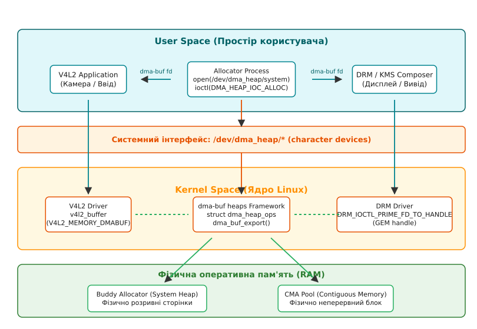

# Фреймворк dma-buf heaps: заміна ION для виділення неперервної памʼяті

<preknowlist>
- [Механізми Zero-Copy у Linux](root:sys-unix/zero-copy) — принцип обміну буферами між пристроями та простором користувача без дублювання пам'яті.
- [Буферизований та прямий ввід-вивід](root:sys-unix/buffered-and-direct-io) — організація сторінкового кешу та прямого доступу DMA до фізичної оперативної пам'яті.
</preknowlist>

Сучасна обробка мультимедійних даних на вбудованих системах (System-on-Chip, SoC) вимагає передачі гігабайтних потоків відео між апаратними блоками — сенсорами камер, графічними прискорювачами (GPU), відеодекодерами та контролерами дисплеїв. При роздільній здатності 4K (3840×2160) один кадр у нестисненому форматі ARGB займає 3840 × 2160 × 4 = 33 177 600 байтів — близько 33 МБ. Потік із 60 таких кадрів на секунду — це майже 2 ГБ/с через шину пам'яті, і кожне зайве копіювання процесором додає стільки ж на читання і стільки ж на запис. Якщо центральний процесор (CPU) здійснюватиме копіювання цих даних через стандартні системні виклики `read()` та `write()`, шина оперативної пам'яті виявиться повністю перевантаженою, затримки обробки зростуть до неприйнятних значень, а енергоспоживання мобільного або автотранспортного пристрою зросте у рази.

Для усунення зайвого копіювання застосовується техніка нульового копіювання (zero-copy), за якої всі апаратні прискорювачі працюють з єдиним спільним буфером у фізичній оперативній пам'яті. Однак тривалий час головним бар'єром для реалізації zero-copy в Linux була відсутність уніфікованого механізму ядра для виділення неперервних блоків пам'яті та їх безпечного спільного використання драйверами різних підсистем. Google розробила тимчасове рішення у вигляді підсистеми ION для платформи Android. Проте ION залишався у staging-гілці ядра понад вісім років через архітектурні недоліки та фрагментацію vendor-коду. У версії ядра Linux 5.6 йому на зміну прийшов офіційний, стандартизований фреймворк **dma-buf heaps**, який повністю замінив ION та надав чистий, модульний і стабільний API для виділення та обміну DMA-пам'яттю.

## Передумови та історія: чому ми відмовляємося від ION

### Проблема неперервної пам'яті у системних процесорах

Класична підсистема керування пам'яттю Linux розроблялася з розрахунком на процесори загального призначення, обладнані блоком керування пам'яттю (Memory Management Unit, MMU). Для CPU не має значення, де саме у фізичній оперативній пам'яті розташовані сторінки: MMU транслює віртуальні адреси процесу у фізичні адреси сторінок розміром 4 КБ. Навіть якщо віртуальний буфер розміром 100 МБ виглядає суцільним для програми, у фізичній RAM він може складатися з тисяч розсіяних сторінок.

Однак у багатьох вбудованих SoC апаратні прискорювачі (наприклад, застарілі контролери Direct Memory Access (DMA), прості кодеки або процесори обробки зображень ISP) позбавлені власного пристрою IOMMU (Input-Output Memory Management Unit). Такі периферійні блоки вимагають, щоб буфер даних був строго неперервним саме на рівні фізичних адрес оперативної пам'яті. Якщо контролеру передати буфер, розбитий на фрагментовані сторінки, він не зможе прочитати або записати дані за межами першої сторінки 4 КБ.

### Архітектура Android ION та причини її відхилення спільнотою Mainline

У 2011 році для розв'язання цієї проблеми Google створила підсистему **ION** (Android ION memory allocator). ION дозволяв простору користувача запитувати буфери пам'яті з різних категорій "куп" (heaps):
- `ION_HEAP_TYPE_SYSTEM` — пам'ять, виділена з загального пулу сторінок ядра (buddy allocator);
- `ION_HEAP_TYPE_SYSTEM_CONTIG` — фізично неперервна пам'ять, виділена через `kmalloc`;
- `ION_HEAP_TYPE_CARVEOUT` — статично зарезервована під час завантаження системи фізична область RAM;
- `ION_HEAP_TYPE_DMA` — неперервна пам'ять, виділена через підсистему CMA (Contiguous Memory Allocator).

Незважаючи на високу популярність ION у мобільному світі, спроби інтегрувати його до основного ядра Linux (mainline) завершилися невдачею. Спільнота розробників ядра виявила серйозні недоліки в архітектурі ION:

1. **Централізований та перевантажений ioctl API:** Усі операції здійснювалися через єдиний символьний пристрій `/dev/ion`. Для вибору потрібної купи простір користувача передавав бітову маску `heap_mask`. Оскільки ідентифікатори куп визначалися розробниками SoC (Qualcomm, MediaTek, Samsung) довільно, бітова маска `0x4` на платформі одного вендора означала неперервну CMA-пам'ять, а на платформі іншого — ізольовану пам'ять TrustZone. Це унеможливлювало створення універсального простору користувача.
2. **Фрагментація коду та відсутність модульності:** Виробники напівпровідників масово додавали власні специфічні купи ION безпосередньо у вихідний код фреймворку. У результаті ядро містило десятки розрізнених реалізацій ION, які не мали спільного ABI.
3. **Змішування функцій виділення та синхронізації:** ION намагався самостійно керувати операціями синхронізації кешу CPU, що дублювало функції загальносистемного механізму `dma-buf`.

У результаті ION роками залишався у теці `drivers/staging/android/ion/` і врешті-решт був остаточно вилучений з ядра Linux у версії 5.11, поступаючись місцем фреймворку dma-buf heaps.

## Архітектура dma-buf heaps

Фреймворк **dma-buf heaps** (введений у ядрі Linux 5.6 зусиллями Джона Стульца, John Stultz, з Linaro — як пряме продовження досвіду ION) кардинально спрощує концепцію виділення DMA-пам'яті. Замість єдиного пристрою зі складним набором ioctl-кодів кожен тип купи експортується як окремий файловий вузол пристрою у системному каталозі `/dev/dma_heap/`.


*Схема взаємодії простору користувача, вузлів пристроїв /dev/dma_heap/, фреймворку dma-buf heaps та апаратних драйверів (V4L2, DRM, GPU).*

### Ключові концептуальні засади dma-buf heaps

1. **Принцип "Один файл — одна купа":** Кожна купа пам'яті експортується під власною зрозумілою назвою (наприклад, `/dev/dma_heap/system` або `/dev/dma_heap/linux,cma`). Права доступу на читання та запис контролюються стандартними механізмами POSIX та правилами udev/SELinux.
2. **Мінімалістичний інтерфейс користувача:** Фреймворк надає всього одну ioctl-команду — `DMA_HEAP_IOC_ALLOC`. Програма простору користувача відкриває потрібний файл у `/dev/dma_heap/`, передає бажаний розмір у байтах і миттєво отримує файловий дескриптор `dma-buf`.
3. **Стандартизований вихідний об'єкт:** Результатом виділення є анонімний файловий дескриптор `dma-buf`. Цей дескриптор можна передавати іншим драйверам ядра (V4L2, DRM, GPU, ALSA) або іншим процесам простору користувача через сокети UNIX domain (механізм `SCM_RIGHTS`).
4. **Повний вихід за межі vendor-специфічного ABI:** Усі купи реалізують єдиний контракт. Якщо програмі потрібна неперервна пам'ять, вона відкриває `/dev/dma_heap/linux,cma`, незалежно від того, на якому процесорі (ARM64, x86_64 чи RISC-V) виконується ядро.

Детальний довідник структур даних, системних викликів та кодів помилок простору користувача винесено у статтю [📋 Інтерфейс користувача dma-buf heaps](root:sys-unix/dma-buf-heaps-framework/api-uapi-dma-heap.md).

## Типи доступних куп (Heaps) та їхнє призначення

У ядрі Linux реалізовано кілька стандартних розподільників dma-buf heaps, які покривають більшість задач сучасних обчислювальних систем.

### 1. System Heap (`/dev/dma_heap/system`)

Системна купа використовує стандартний розподільник сторінок ядра (buddy allocator) за допомогою функції `alloc_pages()`.
- **Фізична структура:** Виділені сторінки є фізично розривними у просторі оперативної пам'яті (scatter-gather list).
- **Кешування:** Пам'ять за замовчуванням є кешованою процесором (CPU cached). Звернення до неї з боку CPU відбувається з максимальною швидкістю через L1/L2/L3 кеші.
- **Сфера застосування:** Пристрої, обладнані IOMMU (наприклад, сучасні GPU, мережеві адаптери 100GbE або дисплейні контролери останніх поколінь). Оскільки IOMMU здатний транслювати розсіяні фізичні сторінки у суцільний віртуальний адресний простір пристрою, виділення фізично неперервної пам'яті для таких пристроїв є непотрібним марнотратством.

### 2. System-Uncached Heap (`/dev/dma_heap/system-uncached`)

Варіація системної купи, при якій сторінки пам'яті відображаються у віртуальний простір без використання кешу процесора (атрибути `uncached` або `write-combine`).
- **Фізична структура:** Розривні сторінки 4 КБ.
- **Кешування:** Некешована пам'ять. Будь-яка зміна даних процесором миттєво потрапляє у фізичну оперативну пам'ять, минаючи кеш CPU.
- **Сфера застосування:** Використовується у випадках, коли CPU здійснює незначні обсяги запису у буфер (наприклад, оновлення індексних командних структур), після чого буфер одразу читається DMA-пристроєм без процедури скидання кешу.

### 3. CMA Heap (`/dev/dma_heap/linux,cma` або `/dev/dma_heap/cma`)

Купа Contiguous Memory Allocator (CMA) є головним інструментом для забезпечення пристроїв без IOMMU фізично неперервною пам'яттю.
- **Фізична структура:** Абсолютно неперервний блок фізичних адрес RAM від першого до останнього байта.
- **Механізм роботи:** Під час завантаження ядра система резервує певний діапазон фізичної пам'яті (наприклад, `cma=256M`). Поки апаратним пристроям не потрібна неперервна пам'ять, підсистема ядра використовує цей регіон для збереження рухомих сторінок (movable pages), таких як сторінковий кеш файлових систем (page cache) або анонімні сторінки процесів. Коли dma-buf heap запитує 16 МБ неперервної пам'яті, підсистема CMA прозоро мігрує наявні сторінки в інші області RAM, вивільняючи суцільний блок.
- **Сфера застосування:** Апаратні декодери відео, камери без IOMMU, DSP, прості контролери LCD-панелей.

### 4. Спеціалізовані та Vendor Heaps

Виробники обладнання можуть реєструвати власні купи в каталог `/dev/dma_heap/`:
- **Carveout Heap:** Пам'ять із фізично ізольованих апаратних модулів SRAM або зарезервованого банку RAM, яка не підпорядковується розподільнику сторінок ядра.
- **Secure Heap / TEE Heap:** Пам'ять, доступ до якої контролює довірене середовище виконання (TEE) — на ARM це анклави TrustZone. Така пам'ять використовується для передачі захищеного відеопотоку (DRM/HDCP) від декодера до дисплея без можливості її зчитування навіть процесором з правами root.

## Глибока інтеграція з підсистемою CMA (Contiguous Memory Allocator)

Розподільник CMA Heap працює у тісному контакті з підсистемою ядра CMA. Розуміння механіки цього зв'язку необхідне для запобігання збоям виділення пам'яті у високонавантажених вбудованих системах.

Під час ініціалізації ядра область CMA реєструється функціями резервування пам'яті (наприклад, `cma_declare_contiguous()`). Регіону призначається діапазон номерів фізичних сторінок (Page Frame Numbers, PFN). Для оптимізації використання RAM ядро позначає ці сторінки спеціальним типом міграції `MIGRATE_CMA`.

Коли dma-buf heap виконує запит на виділення `len` байтів у CMA-купі, підсистема виконує наступні фази:

1. **Пошук вільного діапазону PFN:** Функція `cma_alloc()` сканує бітову карту регіону CMA для пошуку суцільного блоку PFN необхідного розміру з урахуванням апаратного вирівнювання (наприклад, вирівнювання по межі 64 КБ або 1 МБ).
2. **Ізоляція сторінок:** Викликається ядровий механізм `alloc_contig_range()`, який переводить обраний діапазон сторінок у стан ізоляції, запобігаючи виділенню нових сторінок із цього блоку іншими процесами.
3. **Міграція наявних сторінок:** Блоки регіону мають тип міграції `MIGRATE_CMA`, тож ядро вільно селить у них рухомі сторінки. Якщо знайдений діапазон уже зайнятий такими сторінками (анонімні сторінки процесів або кешовані блоки файлів), викликається функція `migrate_pages()`. Сторінки копіюються у вільні блоки загальної оперативної пам'яті, а таблиці сторінок віртуальної пам'яті відповідних процесів прозоро оновлюються.
4. **Скидання кешів та підготовка DMA:** Після очищення діапазону сторінки вилучаються з підсистеми кешування ядра і передаються драйверу dma-buf heap.

### Фатальні випадки вичерпання та закріплення пам'яті (Memory Pinning)

Виділення CMA-пам'яті може завершитися помилкою `-ENOMEM` навіть у разі наявності великої кількості вільної оперативної пам'яті у системі. Це відбувається за двох основних умов:
- **Закріплені сторінки (Pinned pages):** Коли драйвер бере довготривале закріплення сторінки (`pin_user_pages()` із прапорцем `FOLL_LONGTERM`), ядро спершу намагається виселити її геть із регіону CMA — саме тому закріплення й міграція йдуть у парі. Там, де виселити не вдалося, сторінка застрягає всередині регіону, неперервність блоку порушується, і `cma_alloc()` повертає помилку. `mlock()` тут ні до чого: він боронить сторінку від свопу, але не від переміщення.
- **Фрагментація ядра та недостатній обсяг резерву:** Якщо зарезервований обсяг CMA занадто малий для одночасного зберігання кількох відеокадрів високої роздільної здатності (наприклад, трьох буферів 4K для потрійної буферизації), виділення завершиться невдачею.

## Внутрішня реалізація ядра: як працює dma-buf heap

Для розуміння того, що відбувається при виділенні пам'яті, розглянемо внутрішню архітектуру фреймворку на рівні сирцевого коду ядра Linux.

### Ключові структури ядра

Фреймворк dma-buf heaps оперує двома основними структурами, визначеними у `<linux/dma-heap.h>`:

```c
struct dma_heap;

struct dma_heap_ops {
    struct dma_buf *(*allocate)(struct dma_heap *heap,
                                unsigned long len,
                                unsigned long fd_flags,
                                unsigned long heap_flags);
};
```

Коли драйвер купи (наприклад, `system_heap.c` або `cma_heap.c`) реєструє новий вузол у системі, він викликає функцію `dma_heap_add()`:

```c
struct dma_heap_export_info exp_info;
exp_info.name = "system";
exp_info.ops = &system_heap_ops;
exp_info.priv = NULL;

struct dma_heap *heap = dma_heap_add(&exp_info);
```

Ядро виділяє новий молодший номер пристрою (minor number) та створює вузол у символьному просторі пристроїв `/dev/dma_heap/system`.

### Трасування виклику allocation ioctl

Коли програма простору користувача виконує системний виклик `ioctl(heap_fd, DMA_HEAP_IOC_ALLOC, &alloc_data)`, ядро проходить наступний ланцюжок дій:

```
Простір користувача: ioctl(heap_fd, DMA_HEAP_IOC_ALLOC)
       │
       ▼
Ядро (VFS): dma_heap_fops.unlocked_ioctl()
       │
       ▼
Фреймворк: dma_heap_ioctl_allocate()
       │
       ├─► Перевірка параметрів: len > 0, heap_flags
       │
       ▼
Драйвер купи: heap->ops->allocate(heap, len, fd_flags, heap_flags)
       │
       ├─► Виділення фізичних сторінок (alloc_pages або cma_alloc)
       ├─► Створення структури struct dma_buf_export_info
       │
       ▼
Підсистема dma-buf: dma_buf_export()
       │
       ├─► Створення анонімного файлу dma_buf (ops = &heap_dmabuf_ops)
       │
       ▼
Фреймворк: dma_buf_fd(dmabuf, fd_flags)
       │
       ├─► Реєстрація fd у таблиці файлів поточного процесу
       │
       ▼
Повернення fd у простір користувача в структурі alloc_data.fd
```

Результатом цієї послідовності є файловий дескриптор `fd`, який вказує на `struct file` у власній псевдофайловій системі dma-buf: кожен буфер має там свій інод (це й дає посторінковий облік), а в `/proc/<pid>/fd/` такий дескриптор видно як посилання на `/dmabuf:`, а не як звичайний `anon_inode`.

## Взаємодія з IOMMU та генерація Scatter-Gather таблиць

Коли файловий дескриптор `dma-buf` передається іншому драйверу пристрою у ядрі (наприклад, драйверу графічного процесора DRM або кодеку V4L2), драйвер-імпортер повинен зв'язати цей буфер зі своїм апаратним контролером. Цей процес відбувається через триетапний контракт підсистеми `dma-buf`:

1. **Приєднання пристрою (`dma_buf_attach`):** Драйвер-імпортер передає свій `struct device` та отриманий `struct dma_buf`. Драйвер купи створює структуру прив'язки `struct dma_buf_attachment`.
2. **Отримання таблиці розсіювання (`dma_buf_map_attachment`):** Драйвер-імпортер запитує таблицю фізичних сторінок у вигляді `struct sg_table` (Scatter-Gather table).
3. **Трансляція адреси IOMMU (`dma_map_sgtable`):** саме відображення робить не імпортер, а драйвер-експортер усередині зворотного виклику `map_dma_buf` — він передає `sg_table` у підсистему DMA ядра для того пристрою, який приєднався на кроці 1. Якщо пристрій підключений до IOMMU, ядро програмує таблиці сторінок IOMMU і виділяє суцільний діапазон адрес вводу-виводу (IOVA). Імпортер отримує з `dma_buf_map_attachment()` уже готову таблицю, де в кожному сегменті лежить адреса, придатна для запису в регістри DMA.

Цей механізм дозволяє підсистемі `dma-buf heaps` залишатися повністю абстрагованою від того, як саме споживач пам'яті використовує виділений буфер.

## Кешування та синхронізація (DMA Coherency)

Однією з найпоширеніших помилок при використанні zero-copy буферів є порушення узгодженості кешу (cache coherence).

### Коли апаратура не тримає узгодженість сама

Процесори архітектур ARM64 та x86_64 використовують ієрархію кеш-пам'яті (L1/L2/L3). Коли CPU записує дані у відображений буфер `dma-buf` (отриманий через `mmap()`), нові значення деякий час зберігаються виключно у кеш-рядках (dirty cache lines) і не потрапляють у фізичну оперативну пам'ять. Якщо в цей момент апаратний кодек або дисплейний контролер почне зчитувати буфер через DMA, він прочитає застарілі дані з оперативної пам'яті, що призведе до спотворення зображення (візуальних артефактів або "сміття" на екрані).

Зворотна ситуація: камера записала новий кадр через DMA безпосередньо у RAM. Якщо CPU спробує прочитати ці дані без попередньої інвалідації свого кешу, він прочитає застаріле значення зі своїх кеш-рядків L1/L2.

### Синхронізація простору користувача через `DMA_BUF_IOCTL_SYNC`

Для усунення цієї проблеми простір користувача повинен явно позначати межі процесорного доступу до буфера за допомогою виклику `ioctl(dmabuf_fd, DMA_BUF_IOCTL_SYNC)`:

:::tabs
```c
#include <linux/dma-buf.h>
#include <sys/ioctl.h>

void process_buffer_cpu(int dmabuf_fd, void *ptr, size_t size) {
    struct dma_buf_sync sync = {0};

    /* 1. Початок доступу CPU на читання та запис */
    sync.flags = DMA_BUF_SYNC_START | DMA_BUF_SYNC_RW;
    ioctl(dmabuf_fd, DMA_BUF_IOCTL_SYNC, &sync);

    /* Модифікація даних процесором */
    memset(ptr, 0xAB, size);

    /* 2. Завершення доступу CPU (примусове скидання кешу у RAM) */
    sync.flags = DMA_BUF_SYNC_END | DMA_BUF_SYNC_RW;
    ioctl(dmabuf_fd, DMA_BUF_IOCTL_SYNC, &sync);
}
```
```cpp
#include <linux/dma-buf.h>
#include <sys/ioctl.h>
#include <system_error>
#include <cstring>

void process_buffer_cpu(int dmabuf_fd, void* ptr, std::size_t size) {
    dma_buf_sync sync{};

    // 1. Початок доступу CPU на читання та запис
    sync.flags = DMA_BUF_SYNC_START | DMA_BUF_SYNC_RW;
    if (::ioctl(dmabuf_fd, DMA_BUF_IOCTL_SYNC, &sync) < 0) {
        throw std::system_error(errno, std::generic_category(), "DMA_BUF_SYNC_START failed");
    }

    // Модифікація даних процесором
    std::memset(ptr, 0xAB, size);

    // 2. Завершення доступу CPU (примусове скидання кешу у RAM)
    sync.flags = DMA_BUF_SYNC_END | DMA_BUF_SYNC_RW;
    if (::ioctl(dmabuf_fd, DMA_BUF_IOCTL_SYNC, &sync) < 0) {
        throw std::system_error(errno, std::generic_category(), "DMA_BUF_SYNC_END failed");
    }
}
```
:::

Під час виклику `DMA_BUF_SYNC_END` ядро виконує примусове скидання брудних кеш-рядків процесора (flushing/clean) у RAM для діапазону адрес буфера.

### Асинхронна синхронізація пристроїв через `dma_fence`

У високопродуктивних графічних конвеєрах чекати завершення виконання операцій апарату через виклики синхронізації CPU недопустимо. Замість цього підсистема `dma-buf` використовує механізм примітивів синхронізації **`dma_fence`**.

Кожен буфер `dma-buf` містить об'єкт резервування `struct dma_resv`. Коли GPU починає малювати кадр у буфер dma-buf, драйвер GPU створює об'єкт `dma_fence` і додає його до `dma_resv`. Драйвер DRM, отримавши такий буфер на atomic-коміт, не блокує процес користувача: він бере огорожу з `dma_resv` і відкладає програмування перемикання кадру доти, доки графічний процесор не просигналить. Саме чекання лежить у ядрі — у робочому потоці драйвера або, де апаратура це вміє, в її власному планувальнику, який дочекається сигналу без участі CPU. Застосунок тим часом готує наступний кадр, а не сидить у виклику синхронізації.

Практичний приклад побудови повноцінного zero-copy пайплайну між підсистемами захоплення відео V4L2 та виведення на графічний дисплей DRM/KMS детально розібрано у статті [⚙️ Реалізація zero-copy пайплайну](root:sys-unix/dma-buf-heaps-framework/proj-zerocopy-pipeline.md).

## Безпека, розмежування прав та SELinux політики

На відміну від застарілого ION, де єдиний файл пристрою `/dev/ion` вимагав надання широких прав усім мультимедійним процесам, dma-buf heaps забезпечує гнучке ізолювання ресурсів на рівні файлової системи POSIX та розширених атрибутів безпеки.

1. **Дискреційне розмежування прав (DAC):** Оскільки кожна купа представлена окремим вузлом пристрою (наприклад, `/dev/dma_heap/system` та `/dev/dma_heap/linux,cma`), адміністратор системи або підсистема `udev` може призначати різні групи власників. Наприклад, доступ до системної купи можна надати групі `video`, тоді як доступ до неперервної CMA-пам'яті обмежити лише системними демонами обробки відео.
2. **Мандатний контроль доступу (SELinux / AppArmor):** У сучасних дистрибутивах Linux та Android кожному вузлу підсистеми `/dev/dma_heap/` призначається власний SELinux-контекст (наприклад, `system_dma_heap_device` або `cma_dma_heap_device`). Це дозволяє заблокувати ненадійним програмам простору користувача можливість виділення великих блоків неперервної пам'яті, запобігаючи атакам типу "відмова в обслуговуванні" (DoS) через вичерпання пулу CMA.

## Діагностика, простеження та аналіз через sysfs/debugfs

Для моніторингу виділеної DMA-пам'яті та виявлення витоків файлових дескрипторів ядро Linux надає зручні інструменти інспекції.

### 1. Перевірка наявних куп пристроїв

Список доступних у системі розподільників dma-buf heaps можна переглянути через стандартні утиліти VFS:

```bash
$ ls -l /dev/dma_heap/
crw-rw---- 1 root video 251, 0 Aug 12 10:00 cma
crw-rw---- 1 root video 251, 1 Aug 12 10:00 system
```

### 2. Інспекція виділених буферів через debugfs

Файлова система `debugfs` містить детальний зріз усіх відкритих буферів `dma-buf` у системі:

```bash
$ cat /sys/kernel/debug/dma_buf/bufinfo
```

Приклад виводу стану підсистеми:

```
Dma-buf Objects:
size        flags       mode        count       exp_name    name
4194304     00000002    00000003    2           system      dma-heap-alloc
8388608     00000002    00000003    3           linux,cma   dma-heap-alloc

Total 2 objects, 12582912 bytes
```

Тут можна простежити:
- `size`: розмір буфера у байтах;
- `count`: кількість посилань на файловий дескриптор (reference count);
- `exp_name`: назва купи, яка експортувала буфер (`system` або `linux,cma`).

### 3. Простеження через tracepoints ftrace

Для динамічного моніторингу виділень під час роботи додатка можна підключитися до підсистеми ftrace:

```bash
$ echo 1 > /sys/kernel/tracing/events/dma_fence/enable
$ cat /sys/kernel/tracing/trace_pipe
```

Точки трасування ядро дає не на саме виділення, а на огорожі `dma_fence`, і саме за ними видно передачу буфера між пристроями: коли огорожу створено, хто на неї чекає й коли вона спрацювала.

## Зведена порівняльна характеристика: ION проти dma-buf heaps

Для підсумування еволюції механізмів виділення неперервної пам'яті у Linux наведено порівняльну таблицю архітектурних параметрів ION та dma-buf heaps:

| Архітектурний параметр | Застарілий фреймворк ION | Сучасний фреймворк dma-buf heaps |
| :--- | :--- | :--- |
| **Точка входу VFS** | Єдиний файл пристрою `/dev/ion` | Каталог пристроїв `/dev/dma_heap/<name>` |
| **Спосіб вибору купи** | Бітова маска `heap_mask` у ioctl | Відкриття конкретного файлу пристрою |
| **Модульність та розширюваність** | Складне втручання у монолітний код ION | Динамічне додавання нових куп модулями ядра |
| **Стабільність ABI** | Відсутня (маски куп різнилися між SoC) | Повна стабільність уніфікованого uAPI |
| **Розмежування прав (POSIX)** | Загальне право на `/dev/ion` | Окремі права доступу на кожен пристрій у `/dev/dma_heap/` |
| **Статус у ядрі Linux** | Вилучено з ядра (Linux 5.11) | Стандартний Mainline фреймворк (з Linux 5.6) |

Фреймворк dma-buf heaps став завершальним етапом стандартизації механізмів виділення та обміну DMA-пам'яттю у Linux. Завдяки відмові від монолітного ioctl-інтерфейсу ION та переходу до окремих пристроїв підсистема забезпечує прозору, безпечну та високоефективну роботу мультимедійних zero-copy пайплайнів на будь-якій сучасній апаратній архітектурі.
