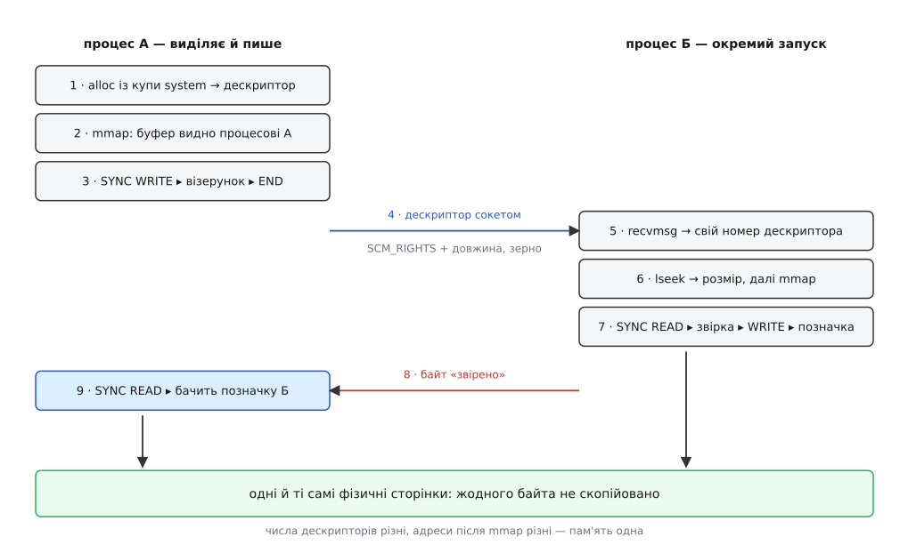

# ⚙️ Спільний буфер між двома процесами: від купи до SCM_RIGHTS

Ось програма на C, яка бере мегабайт із купи `/dev/dma_heap/system`, заповнює його візерунком і віддає геть неспорідненому процесові — так, що той дістає не копію, а ту саму пам'ять. Її варто зібрати й запустити: після цього спільний буфер перестає бути описом і стає результатом, який видно на екрані.

## Дослід, який має два різні закінчення

Демонстрація чогось варта лише тоді, коли може провалитися. Тому програма влаштована так.

Процес **А** виділяє буфер, відображає його собі й заповнює словами, порахованими з зерна — номера власного процесу. Далі він віддає дескриптор процесові **Б** і разом із ним крихітний заголовок: скільки байтів справді наші й з якого зерна зроблено візерунок. Б відображає той самий буфер у себе, звіряє кожне слово й друкує кількість розбіжностей.

Половина, заради якої дослід узагалі має сенс, починається тут. Б записує в останнє слово буфера свою позначку — і мовчки, нічого більше не пересилаючи, повідомляє одним байтом: готово. А читає це саме слово в себе. Якщо десь по дорозі пам'ять роздвоїлася, А побачить те, що клав сам. Якщо пам'ять справді одна — побачить чуже.

Обидві сторони — той самий виконуваний файл, запущений двічі з різними аргументами. Це важливо: процеси не родичі, ніхто нічого не успадкував через `fork`, у них не збігається жодна адреса й навіть номери дескрипторів різні. Спільним є рівно одне — те, що переїхало сокетом.



*Позначка, що повернулася до А, не могла подорожувати сокетом: сокетом їхав лише дескриптор.*

## Виділити те, чого нема кому виділяти

Жодного пристрою в досліді немає, тож немає й драйвера, якому пам'ять природно належала б. Експортером стає купа: `/dev/dma_heap/system` — звичайний символьний пристрій, який на прохання видає dma-buf зі звичайних сторінок.

Прохання надсилають через [ioctl](topic:sys-unix/ioctl-interface). Структура запиту має чотири поля, і одне з них — вихідне: ядро кладе в `fd` номер нового [дескриптора](topic:sys-unix/file-descriptor).

```c
/* dmabuf-demo.c — один буфер із купи dma-heap на два незалежні процеси. */
#define _GNU_SOURCE
#include <errno.h>
#include <fcntl.h>
#include <linux/dma-buf.h>
#include <linux/dma-heap.h>
#include <stddef.h>
#include <stdint.h>
#include <stdio.h>
#include <stdlib.h>
#include <string.h>
#include <sys/ioctl.h>
#include <sys/mman.h>
#include <sys/socket.h>
#include <sys/un.h>
#include <unistd.h>

#define HEAP     "/dev/dma_heap/system"
#define SOCKNAME "dmabuf-demo"        /* абстрактна адреса: без сліду у файловій системі */
#define BYTES    (1u << 20)           /* мегабайт корисних даних */

static void die(const char *what) { perror(what); exit(1); }

/* Заголовок, що їде поруч із дескриптором. */
struct handoff {
    uint64_t bytes;                   /* скільки байтів у буфері справді наші */
    uint32_t seed;                    /* із чого пораховано візерунок */
};

static uint32_t word_at(uint32_t seed, size_t i)
{
    return seed + (uint32_t)i * 2654435761u;
}

static int heap_alloc(uint64_t bytes)
{
    int heap = open(HEAP, O_RDONLY | O_CLOEXEC);
    if (heap < 0) die("open " HEAP);

    struct dma_heap_allocation_data req = {
        .len        = bytes,
        .fd_flags   = O_RDWR | O_CLOEXEC,  /* без O_RDWR mmap на запис не дадуть */
        .heap_flags = 0,
    };
    if (ioctl(heap, DMA_HEAP_IOCTL_ALLOC, &req) < 0) die("DMA_HEAP_IOCTL_ALLOC");

    close(heap);       /* буфер тримається сам; купа більше ні для чого не потрібна */
    return req.fd;
}
```

Закриття купи одразу після виділення — не заощадження одного номера, а перевірка розуміння. Буфер живий, доки живе бодай одне посилання на нього, і посиланням є сам дескриптор, а не пристрій, з якого його дістали.

## Обрамлення, яке на вашій машині нічого не робить

Перш ніж читати чи писати відображену пам'ять, доступ треба обрамити з обох боків: `DMA_BUF_IOCTL_SYNC` зі `START` перед роботою і з `END` після неї, щоразу з чесно вказаним напрямком.

```c
static void sync_buf(int fd, __u64 flags)
{
    struct dma_buf_sync s = { .flags = flags };
    int r;
    do { r = ioctl(fd, DMA_BUF_IOCTL_SYNC, &s); } while (r < 0 && (errno == EINTR || errno == EAGAIN));
    if (r < 0) die("DMA_BUF_IOCTL_SYNC");
}

static void sync_start(int fd, __u64 rw) { sync_buf(fd, rw | DMA_BUF_SYNC_START); }
static void sync_end(int fd, __u64 rw)   { sync_buf(fd, rw | DMA_BUF_SYNC_END); }
```

У цих трьох рядках заховано найкоротшу пастку всієї теми. `DMA_BUF_SYNC_START` визначено як `(0 << 2)` — це нуль. Прапорець початку не додає нічого; насправді ядро розрізняє початок і кінець за відсутністю чи наявністю `DMA_BUF_SYNC_END`. Отже, `sync_start(fd, 0)` дало б `flags = 0`, а виклик із порожнім напрямком ядро відкидає з `EINVAL` — і це єдина помилка обрамлення, яку воно ловить. Напрямок, вказаний невірно, воно приймає мовчки.

## Дескриптор нічого не розповідає про вміст

Переїзд дескриптора між процесами робить `sendmsg` із керівною смугою `SCM_RIGHTS`; сама механіка складання цієї смуги — вирівнювання буфера, різниця між `CMSG_LEN` і `CMSG_SPACE`, обов'язковий хоча б один байт звичайних даних — розібрана окремо: [передати дескриптор своїми руками](topic:sys-unix/unix-domain-sockets/proj-pass-a-descriptor.md).

Тут же цікаве інше: чим бути тому обов'язковому байтові. Дескриптор dma-buf уміє відповісти рівно на одне запитання про себе — свій розмір, і то через `lseek` до кінця. Ані довжини корисної частини, ані формату, ані зерна візерунка в ньому немає й не буде. Тому місце «звичайних даних» займає заголовок: усе, про що сторони мусять домовитися самі.

```c
static void addr_init(struct sockaddr_un *a, socklen_t *len)
{
    memset(a, 0, sizeof *a);
    a->sun_family = AF_UNIX;
    a->sun_path[0] = '\0';                     /* абстрактний простір імен Linux */
    memcpy(a->sun_path + 1, SOCKNAME, strlen(SOCKNAME));
    *len = offsetof(struct sockaddr_un, sun_path) + 1 + strlen(SOCKNAME);
}

static void send_fd(int sock, int fd, const struct handoff *h)
{
    struct iovec iov = { .iov_base = (void *)h, .iov_len = sizeof *h };
    union { char buf[CMSG_SPACE(sizeof(int))]; struct cmsghdr align; } u;
    memset(&u, 0, sizeof u);

    struct msghdr msg = { .msg_iov = &iov, .msg_iovlen = 1,
                          .msg_control = u.buf, .msg_controllen = sizeof u.buf };
    struct cmsghdr *c = CMSG_FIRSTHDR(&msg);
    c->cmsg_level = SOL_SOCKET;
    c->cmsg_type  = SCM_RIGHTS;
    c->cmsg_len   = CMSG_LEN(sizeof(int));
    memcpy(CMSG_DATA(c), &fd, sizeof fd);

    if (sendmsg(sock, &msg, 0) != (ssize_t)sizeof *h) die("sendmsg");
}

static int recv_fd(int sock, struct handoff *h)
{
    struct iovec iov = { .iov_base = h, .iov_len = sizeof *h };
    union { char buf[CMSG_SPACE(sizeof(int))]; struct cmsghdr align; } u;
    struct msghdr msg = { .msg_iov = &iov, .msg_iovlen = 1,
                          .msg_control = u.buf, .msg_controllen = sizeof u.buf };

    ssize_t n = recvmsg(sock, &msg, MSG_CMSG_CLOEXEC);
    if (n < 0) die("recvmsg");
    if (n != (ssize_t)sizeof *h) { fputs("куций заголовок\n", stderr); exit(1); }
    if (msg.msg_flags & MSG_CTRUNC) { fputs("смугу зрізано — fd закрито\n", stderr); exit(1); }

    struct cmsghdr *c = CMSG_FIRSTHDR(&msg);
    if (!c || c->cmsg_level != SOL_SOCKET || c->cmsg_type != SCM_RIGHTS
           || c->cmsg_len != CMSG_LEN(sizeof(int))) {
        fputs("у повідомленні немає дескриптора\n", stderr);
        exit(1);
    }
    int fd;
    memcpy(&fd, CMSG_DATA(c), sizeof fd);
    return fd;
}
```

## Дві половини досліду

```c
static int do_send(void)
{
    int buf = heap_alloc(BYTES);

    off_t size = lseek(buf, 0, SEEK_END);   /* єдине, що дескриптор розповідає про себе */
    if (size < 0) die("lseek");

    void *p = mmap(NULL, size, PROT_READ | PROT_WRITE, MAP_SHARED, buf, 0);
    if (p == MAP_FAILED) die("mmap");

    struct handoff h = { .bytes = BYTES, .seed = (uint32_t)getpid() };
    uint32_t *w = p;
    size_t words = BYTES / 4;

    sync_start(buf, DMA_BUF_SYNC_WRITE);
    for (size_t i = 0; i < words; i++) w[i] = word_at(h.seed, i);
    sync_end(buf, DMA_BUF_SYNC_WRITE);

    int sock = socket(AF_UNIX, SOCK_STREAM | SOCK_CLOEXEC, 0);
    if (sock < 0) die("socket");
    struct sockaddr_un a; socklen_t alen; addr_init(&a, &alen);
    for (int t = 0; connect(sock, (struct sockaddr *)&a, alen) < 0; t++) {
        if (t == 50 || errno != ECONNREFUSED) die("connect");
        usleep(20000);                      /* приймач ще не став на адресу */
    }
    send_fd(sock, buf, &h);

    char ok;
    if (read(sock, &ok, 1) != 1) { fputs("приймач мовчить\n", stderr); exit(1); }

    sync_start(buf, DMA_BUF_SYNC_READ);
    uint32_t mark = w[words - 1];
    sync_end(buf, DMA_BUF_SYNC_READ);

    printf("А: останнє слово тепер 0x%08x, а клав 0x%08x\n",
           mark, word_at(h.seed, words - 1));

    munmap(p, size);
    close(buf);                             /* наше посилання пішло */
    close(sock);
    return 0;
}

static int do_recv(void)
{
    int srv = socket(AF_UNIX, SOCK_STREAM | SOCK_CLOEXEC, 0);
    if (srv < 0) die("socket");
    struct sockaddr_un a; socklen_t alen; addr_init(&a, &alen);
    if (bind(srv, (struct sockaddr *)&a, alen) < 0) die("bind");
    if (listen(srv, 1) < 0) die("listen");

    int sock = accept(srv, NULL, NULL);
    if (sock < 0) die("accept");

    struct handoff h;
    int buf = recv_fd(sock, &h);

    off_t size = lseek(buf, 0, SEEK_END);
    if (size < 0) die("lseek");
    if (h.bytes > (uint64_t)size) { fputs("заголовок бреше про довжину\n", stderr); exit(1); }

    void *p = mmap(NULL, size, PROT_READ | PROT_WRITE, MAP_SHARED, buf, 0);
    if (p == MAP_FAILED) die("mmap");

    uint32_t *w = p;
    size_t words = h.bytes / 4, bad = 0;

    sync_start(buf, DMA_BUF_SYNC_READ);
    for (size_t i = 0; i < words; i++) if (w[i] != word_at(h.seed, i)) bad++;
    sync_end(buf, DMA_BUF_SYNC_READ);

    printf("Б: буфер %lld Б, звірено %zu слів, розбіжностей %zu\n",
           (long long)size, words, bad);

    sync_start(buf, DMA_BUF_SYNC_WRITE);
    w[words - 1] = 0xb0b0b0b0u;             /* позначка, яку має побачити А */
    sync_end(buf, DMA_BUF_SYNC_WRITE);

    if (write(sock, "1", 1) != 1) die("write");

    munmap(p, size);
    close(buf);
    close(sock);
    close(srv);
    return 0;
}

int main(int argc, char **argv)
{
    if (argc == 2 && !strcmp(argv[1], "send")) return do_send();
    if (argc == 2 && !strcmp(argv[1], "recv")) return do_recv();
    fprintf(stderr, "вжиток: %s send|recv\n", argv[0]);
    return 2;
}
```

## Збірка й запуск

```
$ cc -O2 -Wall -o dmabuf-demo dmabuf-demo.c
$ ./dmabuf-demo recv &
$ ./dmabuf-demo send
Б: буфер 1048576 Б, звірено 262144 слів, розбіжностей 0
А: останнє слово тепер 0xb0b0b0b0, а клав 0x8fd41c73
```

Другий рядок — весь результат досліду. Число `0x8fd41c73` щоразу інше, бо зерном був номер процесу; незмінне те, що А більше його не бачить. Байт, який приїхав сокетом, ніс лише слово «готово» завдовжки один символ — а зміна на мегабайт далі виявилася на місці.

> 🔧 **Навіщо це.** Ця іграшка — скелет справжнього обміну кадрами. Клієнт Wayland робить рівно те саме: бере буфер, малює в нього й віддає композиторові дескриптор разом із описом формату; композитор відображає той самий буфер або передає його прямо в графічний драйвер. Різниця лише в тому, що замість візерунка там пікселі, замість `getpid` — узгоджений формат, а замість байта «готово» — огорожа, яку чекає не програма, а залізо.

## Другий дослід, вартий одного рядка

Поки код перед очима, варто перевірити ще одне твердження — те, що буфер живе, доки живе бодай одне посилання, і що жодного «власника» серед двох процесів немає.

Перенесіть у `do_send` виклик `close(buf)` угору, одразу за `send_fd`, — тобто А позбувається свого дескриптора, ще навіть не дочекавшись відповіді. Мегабайт при цьому нікуди не дівається: Б звіряє його як завжди й друкує ті самі нуль розбіжностей. Пам'ять переживає того, хто її просив, бо після `sendmsg` посилань на неї стало два, і закриття одного з них нічого не звільняє.

Саме відображення теж нікуди не дівається: `mmap` тримає власне посилання на буфер, тож адреси в А лишаються дійсними й без дескриптора. Зникає інша можливість — обрамити доступ. `DMA_BUF_IOCTL_SYNC` подають саме на дескриптор, а його вже нема, і останній крок досліду в такому варіанті доводиться викинути. Звідси практичне правило: буфер закривають, коли процесор до нього більше не піде, а не коли з нього востаннє прочитали.

## Де це ламається

**Обрамлення, пропущене безкарно.** Викиньте всі виклики `sync_start`/`sync_end` — на настільній машині програма й далі друкуватиме нуль розбіжностей. Кеші там когерентні, ядро в обрамленні нічого не робить, і код без нього виглядає правильним рівно доти, доки той самий буфер не почне заповнювати пристрій на платі без такої когерентності. Тоді помилка виявиться не крахом, а «іноді трохи не тим кадром» — і шукатимуть її в драйвері камери. Це найдорожчий різновид помилки, тому обрамлення пишуть завжди, а не тоді, коли без нього видно різницю. Чому саме воно потрібне — [когерентність кеша і DMA](topic:hw-arch/cache-coherency-dma).

**`fd_flags` без `O_RDWR`.** Купа перевіряє лише те, що прапорці належать до дозволеної пари `O_CLOEXEC | O_ACCMODE`, і нуль її влаштовує. Але дескриптор, відкритий на читання, далі впирається у звичайну перевірку [відображення](topic:sys-unix/mmap-model): `mmap` із `PROT_WRITE` і `MAP_SHARED` поверне `EACCES`. Помилка вилазить за десяток рядків від причини.

**Розмір, узятий не звідти.** Купа округлює прохання вгору до сторінки: попросили тисячу байтів — `lseek` покаже 4096. Відображати треба цю справжню довжину, бо `mmap` за межі буфера ядро відкине з `EINVAL`, а `munmap` з іншим числом лишить шматок відображення живим. І навпаки: довжину корисної частини знає лише заголовок, тому приймач звіряє її з розміром буфера, перш ніж бігти по масиву — переданому дескрипторові можна довіряти, переданому числу ні.

**`MAP_PRIVATE` замість `MAP_SHARED`.** Приватне відображення означає рівно те, що написано: зміни залишаються мої. Дослід із ним або не запуститься, або — що гірше — тихо перетвориться на роботу з власною копією сторінок, і Б не побачить нічого з написаного А. Спільний буфер відображають лише спільно.

**Купи немає взагалі.** `open` падає з `ENOENT`, якщо в ядрі вимкнено `CONFIG_DMABUF_HEAPS_SYSTEM`, і з `EACCES`, якщо вузол є, але належить `root` — на багатьох системах саме так, і тоді потрібні або `sudo`, або [правило udev](topic:sys-unix/udev-rules), що віддає пристрій потрібній [групі](topic:sys-unix/device-access-groups). Перевірити наявне можна одним поглядом: `ls /dev/dma_heap/`.

**Забутий `close`.** Іншого способу звільнити цю пам'ять немає: ані `free`, ані збирача сміття, ані власника, який колись схаменеться. Загублений дескриптор — це загублені мегабайти, причому в тій частині пам'яті, де їх найменше. Хто саме зараз тримає буфери, видно у `/sys/kernel/debug/dma_buf/bufinfo`: розмір, лічильник посилань та ім'я експортера на кожен живий dma-buf.

І окремо варто побачити те, чого в програмі немає. Немає копіювання — [жодного разу](topic:sys-unix/zero-copy), навіть під час передачі. Немає домовленості про формат — вона проїхала окремим заголовком, бо дескриптор про вміст мовчить. І немає жодного запобіжника від того, щоб А переписав буфер саме тоді, коли Б його читає: тут обидві сторони чемно чекають одна на одну байтом у сокеті, а коли замість програм працюють пристрої, цю роль беруть на себе [огорожі](topic:sys-unix/dma-fence-sync) — сигнали готовності, прив'язані до самого буфера.
