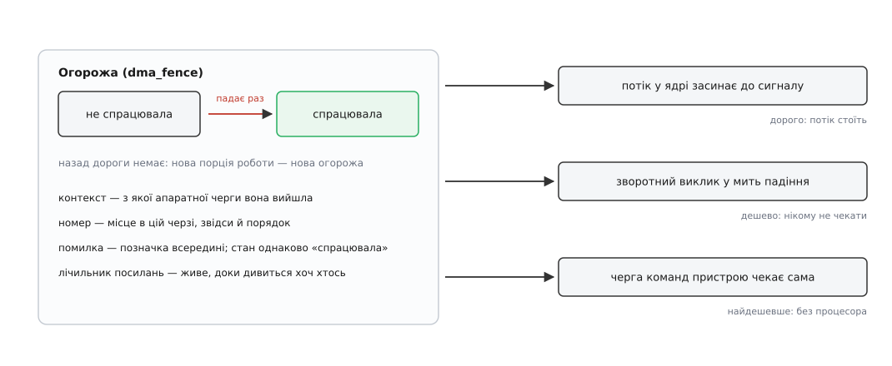
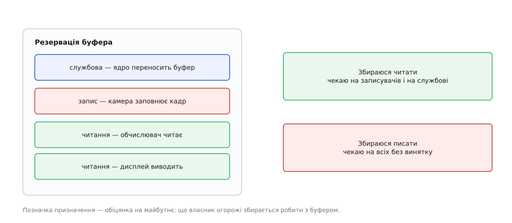
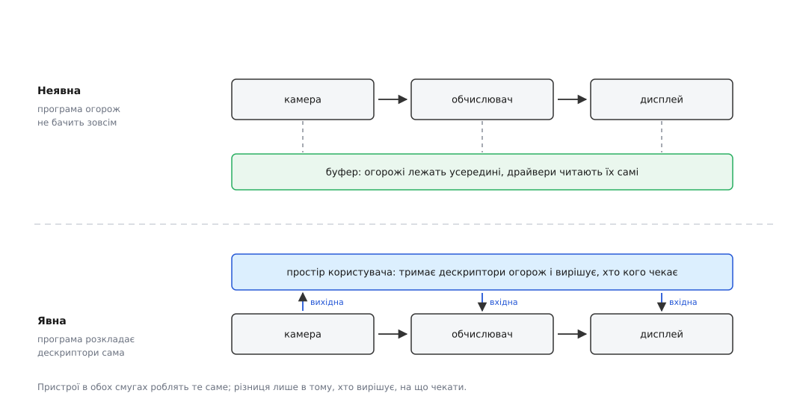

# dma-fence і sync_file: хто каже, що буфер готовий

<preknowlist>
- [Спільний буфер dma-buf](root:sys-unix/dma-buf) — одна пам'ять, якою користуються кілька драйверів; посилання на неї — файловий дескриптор.
- [Файловий дескриптор](root:sys-unix/file-descriptor) — мале число, за яким ядро тримає об'єкт із лічильником посилань.
- [select, poll, epoll](root:sys-unix/select-poll-epoll) — очікування готовності одразу на багатьох дескрипторах.
- [ioctl](root:sys-unix/ioctl-interface) — керуючий канал до драйвера: структура туди, структура назад.
- [Сокети домену Unix](root:sys-unix/unix-domain-sockets) — зокрема те, що ними передають іншому процесові вже відкритий дескриптор.
- [Переривання й відкладена робота](root:sys-unix/interrupts-bottom-halves) — як пристрій повідомляє про завершення і в якому контексті ядро це доопрацьовує.
- [Підрахунок посилань](root:sf-lang/reference-counting) — хто звільняє об'єкт, на який дивляться кілька незалежних власників.
- [Ядро й простір користувача](root:sys-unix/kernel-and-userspace) — межа, крізь яку ходять дескриптори й структури, а не вказівники.
</preknowlist>

Камера дописала останній рядок кадру о 12.417 мілісекунди від початку захоплення. GPU може починати читати цю пам'ять о 12.418 — і жодною мікросекундою раніше, бо інакше побачить наполовину старий кадр. Питання одне: звідки GPU візьме це число.

Годинником його не взяти. Тривалість запису залежить від навантаження шини, від того, чи не заважає в цю мить сусідній контролер, від розміру кадру. Запас «зачекаємо про всяк випадок п'ять мілісекунд» коштує рівно п'ять мілісекунд на кожному стику конвеєра — а стиків троє-четверо, і весь виграш від спільної пам'яті йде на вітер.

Знає точний момент лише той, хто пише: контролер камери виставляє переривання, коли остання транзакція DMA завершилася. Але його драйвер не знає, кому цей кадр піде далі: одному споживачеві, трьом чи жодному, у цьому процесі чи в чужому. І навпаки — драйвер GPU нічого не знає про камеру й не має жодного способу підписатися на її переривання.

Отже, потрібен посередник: маленький об'єкт, що означає рівно одне — «ця робота ще триває» або «ця робота скінчилася». Той, хто працює, створює його й тримає в руках єдиний спосіб перевести в друге положення. Усі інші лише дивляться. Такий об'єкт називають **огорожею** (англ. fence — огорожа): доки вона не впала, за неї заходити не можна.

## Що мусить уміти огорожа

Вимоги до неї диктує не смак, а перелік тих, хто на неї дивитиметься.

**Дивиться інший драйвер у ядрі.** Йому треба або приспати свій потік до сигналу, або залишити зворотний виклик і піти працювати далі. Отже, огорожа мусить уміти і те, і те.

**Дивиться саме залізо.** Сучасний GPU не потребує процесора, щоб зачекати: у його черзі команд є команда «зупинися, доки в такій-то комірці не з'явиться таке-то число». Якщо огорожу можна перекласти такою командою, весь синхронний обмін відбувається між пристроями, а процесор у цей час зайнятий чимось корисним. Значить, огорожа мусить мати числову природу, а не лише подієву.

**Дивиться програма** — конвеєр захоплення, композитор, застосунок Vulkan. Вона живе за межею ядра й уміє чекати лише на дескриптор. Значить, огорожу треба вміти загорнути в дескриптор.

**Дивиться хтось із чужого процесу.** Композитор і клієнт — різні програми з різними правами; посилання має перетинати межу процесу так само, як його перетинає сам буфер.

І над усім цим — вимога часу. Кожен, хто чекає, тим самим ставить своє життя в залежність від чужої роботи. Ланцюжків таких залежностей у графічному конвеєрі десятки, і зав'язані вони між драйверами, які одне про одного не знають нічого.

## Огорожа, що падає лише раз

Об'єкт, який усе це задовольняє, у ядрі Linux зветься `dma_fence`. Його влаштування виглядає бідно — і в цій бідності весь сенс.

Огорожа має **два стани й один перехід**: створена «не спрацювала», одного разу стає «спрацювала» й лишається такою назавжди. Повернути її ніхто не може. Спокуса зробити об'єкт багаторазовим — «скинув і чекаю наступного кадру» — розбивається об гонку: доки один учасник скидає, другий саме перевіряє стан, і різниця між «ще не спрацювала цього разу» й «уже спрацювала минулого» зникає. Одноразовість прибирає цілий клас помилок ціною одного виділення пам'яті на кожну порцію роботи.

Огорожа **живе на лічильнику посилань**. Той, хто її створив, давно забув про кадр, а десяток спостерігачів іще тримають на неї посилання — і об'єкт живий, доки живий останній із них.

Огорожа **має контекст і номер**. Контекст — це ідентифікатор черги, з якої вона вийшла: усі порції роботи, подані в одну апаратну чергу, виконуються по черзі, тож їхні огорожі впорядковані самим залізом. Номер — місце в цій черзі. З двох огорож одного контексту та, що з більшим номером, спрацює не раніше за меншу, і це знання дозволяє викидати зайві очікування: якщо споживач і так чекає на сьому порцію тієї самої черги, чекати ще й на п'яту немає сенсу. Огорожі різних контекстів між собою непорівнянні — там доводиться чекати на кожну.

Огорожа **може спрацювати з помилкою**. Якщо GPU завис і його довелося скинути, порція роботи не виконається ніколи — але огорожа все одно оголошується спрацьованою, з позначкою помилки всередині. Той, хто чекав, прокидається й бачить у буфері сміття замість картинки. Це негарно, але картинка — не найгірше, що буває; найгірше — коли не прокидається ніхто.



*Три способи дочекатися одного й того самого сигналу; дорогий із них лише перший, і саме тому його намагаються не вживати.*

Побачити всю механіку живцем можна без жодного GPU: у ядрі є навчальний драйвер `sw_sync`, який дає створювати огорожі руками й опускати їх командою з програми — [огорожі на столі: sw_sync, poll і злиття дескрипторів](root:sys-unix/dma-fence-sync/proj-sw-sync.md).

## Чому огорожа зобов'язана впасти

З того, що на огорожу може чекати будь-хто, випливає жорстке правило, і воно важливіше за всі подробиці інтерфейсу: **огорожа мусить спрацювати за скінченний час, за будь-яких обставин**.

Це не побажання. Ланцюжок очікувань тягнеться крізь незнайомі драйвери; десь у його кінці сидить потік композитора, від якого залежить, чи оновиться екран. Одна огорожа, що не впала, зупиняє не одну програму, а видиму частину системи.

З правила ростуть наслідки, які на перший погляд здаються дивними.

**У шляху сигналізації не можна виділяти пам'ять.** Виділення може не вдатися одразу й піти витискати щось із пам'яті; витиснення чіпає буфери; буфери чекають на огорожі. Коло замкнулося: щоб опустити огорожу, треба зачекати на огорожу. Тому все, що потрібно для сигналізації, готують заздалегідь, ще при поданні роботи.

**Не можна чекати на простір користувача.** Програму можна зупинити сигналом, посадити в налагоджувач, просто вимкнути — і якщо від неї залежить падіння огорожі, її смерть заморозить екран.

**Зависання заліза мусить мати межу.** Драйвер тримає сторожовий таймер: якщо порція роботи не завершилася за відведений час, пристрій скидають, а всі огорожі, що на ньому лишилися, опускають із помилкою. Зависання GPU перетворюється на зіпсований кадр — рівно те, чого правило й вимагає.

Це правило легко порушити ненавмисно, тому у 2020 році Даніель Феттер додав до ядра анотації критичної секції сигналізації: драйвер позначає ділянку коду, всередині якої огорожа мусить упасти, а перевірка блокувань `lockdep` під час тестування ловить будь-яке взяття замка, що здатне цю ділянку заблокувати. Помилка знаходиться на стенді, а не через півроку в чужого користувача.

У того самого правила є ціна, і вона стала помітна з появою обчислювальних задач, які виконуються на GPU хвилинами, та відеокарт із підкачкою сторінок на вимогу. Робота, тривалість якої залежить від того, чи встигне ядро підвантажити сторінку, скінченного часу не гарантує — і саме тому такі задачі до моделі `dma_fence` не втискаються, а виносяться в окремі механізми, де очікування дозволено переривати.

> 🔧 **Навіщо це.** Знання цього правила рятує при діагностиці. Коли екран замерз, а система жива й реагує на мережу, шукати треба не «повільний малюнок», а огорожу, яка не впала: `/sys/kernel/debug/dma_buf/bufinfo` показує буфери разом із прикріпленими до них огорожами, а стек завислого потоку майже завжди впирається в очікування на одну з них. Причина при цьому зазвичай не там, де замерзло: чекає композитор, а не спрацював клієнт.

## Огорожі, прикріплені до буфера

Найпростіший спосіб донести огорожу до споживача — покласти її туди, куди той і так дивиться: у сам буфер. Кожен `dma_buf` носить об'єкт-резервацію (`dma_resv`), а в ньому — список огорож, які цього буфера стосуються.

Список не однорідний: у кожної огорожі є позначка про призначення. Читання, запис, а понад ними — службова позначка для операцій самого ядра: коли ядро переносить буфер в іншу пам'ять, воно теж лишає огорожу, і на неї зобов'язані чекати всі без винятку, бо доки переїзд не скінчився, старі адреси нічого не значать.

З позначок випливає точне правило очікування, і воно єдине можливе. Хто збирається **читати**, чекає на записувачів: паралельні читачі одне одному не заважають. Хто збирається **писати**, чекає на всіх: інакше він затре кадр з-під тих, хто його зараз виводить на екран. Читачів може бути десяток одночасно, записувачі шикуються в чергу — і жодних домовленостей між незнайомими драйверами для цього не потрібно.



*Позначка призначення — це не опис минулого, а обіцянка на майбутнє: що саме її власник збирається робити з буфером.*

Довгий час у резервації жила рівно одна виняткова огорожа запису плюс список читачів, і це нав'язувало системі обмеження на рівному місці: два послідовні записи в один буфер доводилося вкладати в одну огорожу. У 2022 році Крістіан Кеніг переробив конструкцію на єдиний список із позначками — той вигляд, у якому вона живе тепер.

Такий спосіб зветься **неявною синхронізацією**: програма не бачить огорож і нічого про них не знає. Драйвер камери, заповнивши буфер, сам чіпляє до нього свою огорожу; драйвер GPU, отримавши той самий буфер, сам вичитує чужі огорожі й сам починає з очікування. Стара програма, написана до того, як огорожі взагалі з'явилися, працює правильно й нічого не помічає.

## Коли неявного стає мало

Неявна синхронізація має вбудовану ваду: рішення про очікування ухвалює той, хто найменше знає про наміри.

Драйвер бачить буфер і мусить діяти обережно — а обережність означає чекати. Композитор збирає кадр із десятка поверхонь; одна з них належить клієнтові, що малює складну сцену. Композитор ладен показати для неї попередній вміст і не затримувати решту — але неявний механізм такої тонкості не знає: у буфері є огорожа, отже, її треба дочекатися, отже, весь кадр стоїть через одного повільного клієнта.

Вада поглиблюється тим, як влаштовані сучасні графічні інтерфейси. Vulkan не приховує синхронізацію: програма сама будує граф залежностей і сама вирішує, що чого чекає. Коли така програма кладе результат у буфер, який далі йде до композитора з неявною синхронізацією, обидві моделі стикаються — і кожен обхідний шлях або додає зайвих очікувань, або тихо ламає порядок. Ця суперечність не теоретична: [подання роботи на GPU](root:sys-unix/gpu-command-submission) якраз і будується на явних сигналах, тому будь-яке приховування огорожі означає, що частину графа доводиться відтворювати навмання.

Отже, огорожу треба винести назовні — так, щоб її бачила й нею розпоряджалася програма.

## sync_file: огорожа стає дескриптором

Механізм, що це робить, зветься **sync_file**: ядро загортає огорожу в файловий об'єкт і віддає програмі дескриптор. Далі все звичне для дескриптора стає доступним і для огорожі.

`poll()` на такому дескрипторі повертає готовність, коли огорожа спрацювала, — отже, чекати на неї можна разом із сокетами й таймерами в одному циклі подій, не заводячи окремого потоку. Дескриптор передається сокетом домену Unix — отже, огорожа перетинає межу процесу. `close()` віддає посилання; поки живий бодай один, живий і об'єкт.

Два дескриптори можна **злити** в один: ядро складає з них масив огорож, який спрацює, коли впаде остання. Злиття не механічне — огорожі одного контексту згортаються в одну, найпізнішу, бо решта вже впорядкована залізом. Так граф очікувань довільної форми зводиться до одного числа, яке можна передати кому завгодно.

У роботі це виглядає як дві ролі одного й того самого дескриптора.

**Вихідна огорожа** (out-fence) — те, що драйвер повертає, приймаючи роботу. Програма подала команди на GPU й одразу, не чекаючи виконання, отримала дескриптор, який спрацює, коли робота скінчиться.

**Вхідна огорожа** (in-fence) — те, що програма передає драйверові разом із наступною роботою: «почни не раніше, ніж упаде ось це». Драйвер не блокує потік — він ставить умову в чергу, і залізо саме дочекається сигналу.



*Різниця не в тому, хто чекає, а в тому, хто вирішує, на що саме чекати.*

Найпомітніше явні огорожі вживає підсистема виводу на екран: у атомарній заявці на новий кадр кожна площина має властивість із номером вхідного дескриптора, а кожен контролер — місце, куди ядро покладе вихідний. Композитор віддає ядру кадр, який ще не намальовано, разом з обіцянкою, коли він буде готовий, і одразу повертається до своїх справ. Точні імена властивостей, структури й номери викликів зібрано окремо — [контракт огорож: dma_fence, sync_file і властивості атомарної заявки](root:sys-unix/dma-fence-sync/api-fence-interfaces.md).

```c
/* композитор: віддати кадр, який ще малюється */
int out_fence = -1;

drmModeAtomicAddProperty(req, plane_id, prop_in_fence_fd,  client_fence);
drmModeAtomicAddProperty(req, crtc_id,  prop_out_fence_ptr, (uint64_t)(uintptr_t)&out_fence);
drmModeAtomicCommit(fd, req, DRM_MODE_ATOMIC_NONBLOCK, NULL);

/* виклик уже повернувся; out_fence спрацює після реального перемикання кадру */
struct pollfd pfd = { .fd = out_fence, .events = POLLIN };
poll(&pfd, 1, 100);
close(out_fence);
```

`drmModeAtomicCommit` повертається одразу, не чекаючи на GPU клієнта: ядро прийняло заявку з умовою й виконає її саме. Чекає вже `poll()` нижче — і не на малювання, а на сам факт перемикання кадру.

## Міст між двома світами

Явна й неявна синхронізація мусять уживатися в одній системі: програма на Vulkan хоче керувати очікуваннями сама, а композитор, якому вона віддає кадр, збудований на неявних огорожах у буфері.

Місток збудували 2022 року у вигляді двох викликів на дескрипторі dma-buf. Один **вивантажує** поточний стан резервації в дескриптор огорожі: «зроби мені знімок того, чого зараз варто чекати на цьому буфері» — і Vulkan перетворює його на свій об'єкт синхронізації, не чекаючи процесором. Другий **завантажує** огорожу назад у буфер із заданою позначкою призначення: «вважай, що я в нього пишу, і не пускай нікого, доки це не впаде» — і неявні споживачі, які про Vulkan нічого не знають, поводяться правильно самі собою.

Від першої версії огорож до цього містка минуло сім років суперечок про те, чи можна взагалі впускати простір користувача всередину резервації, — [як народжувалися огорожі: від Android до спільного ядра](root:sys-unix/dma-fence-sync/hist-fencing-lineage.md).

## Коли одного падіння замало

Дескриптор `sync_file` незмінний: у ньому лежить одна огорожа, і після її падіння він назавжди залишається спрацьованим. Для передачі готового кадру цього досить, але графічні інтерфейси потребують більшого — об'єкта, на який можна послатися **до того**, як робота подана.

Тому в підсистемі виводу є окремий різновид об'єкта синхронізації, який поводиться як комірка з посиланням на огорожу: посилання можна замінити на нове, а сам об'єкт — передати дескриптором один раз і далі вживати багато разів. Такі об'єкти з'явилися 2017 року саме для того, щоб під ними можна було реалізувати семафори Vulkan.

Двома роками пізніше до них додали **шкалу** (timeline): замість одного посилання об'єкт тримає зростаючу послідовність позначок, і чекати можна на позначку, роботу для якої ще ніхто не подавав. Очікувач засинає, поданий пізніше сигнал сам його розбудить. Для інтерфейсів, де кілька потоків незалежно подають роботу в спільну шкалу, це прибирає потребу в зовнішньому порядку між ними.

## Чого огорожа не каже

Корисно знати межі, бо саме на них будуються хибні сподівання.

Огорожа каже «робота скінчилася» — і **не каже, що вона вдалася**. Спрацьована з помилкою від правильної зовні не відрізняється; хто не перевіряє стан, отримує сміття й вважає його кадром.

Огорожа **не описує вмісту**. Ані формату пікселя, ані розкладки, ані того, чи це взагалі зображення: про це сторони домовляються окремо, своїми засобами.

Огорожа **не дає виняткового права**. Вона повідомляє про завершення, але нічим не заважає третій програмі, що має дескриптор буфера, переписати ту саму пам'ять посеред виводу на екран. Право на буфер дає дескриптор, а огорожа лише впорядковує в часі тих, хто погодився за нею стежити.

Огорожа **не керує пріоритетом**. Вона нічого не вимагає від того, хто її опустить: із 2023 року їй можна повідомити бажаний строк — підказку, за якою драйвер здатен підняти частоту GPU, аби встигнути до наступного оновлення екрана. Але це підказка, а не зобов'язання; за строком нічого не станеться, крім того, що кадр запізниться.

Спільна пам'ять зняла копіювання. Огорожі зняли очікування наосліп. Разом вони й дають те, заради чого все будувалося: кадр проходить камеру, обчислювач і екран, жодного разу не скопійований і жодного разу не затриманий довше, ніж того вимагає реальна залежність за даними.
