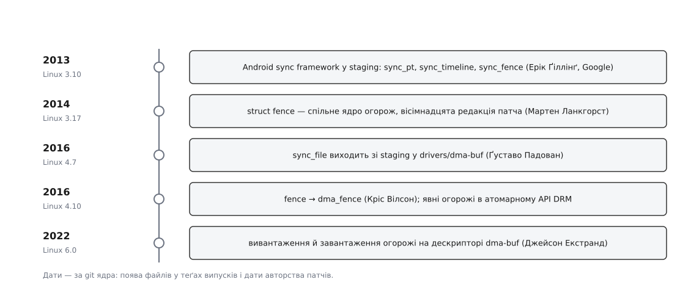

# 📜 Як народжувалися огорожі: від Android до спільного ядра

Огорожа в теперішньому ядрі виглядає дивно бідно — два стани, один перехід, контекст і номер, — і ця бідність не задум однієї людини, а осад від дев'яти років суперечок. Тут — хто що приніс, чого не пустили і чому розв'язка мала саме таку форму.



*Кожен рядок — окрема відповідь на окрему задачу; спільного плану не було в жодного з них.*

## Телефон, якому бракувало кадру

Першими на стіну наштовхнулися не робочі станції, а телефони. В Android екран малює композитор, кадр проходить крізь GPU, апаратний блок накладання шарів і контролер дисплея — три різні пристрої з трьома різними драйверами, а на все про все — один кадровий інтервал, менш ніж сімнадцять мілісекунд при 60 Гц. Ядро тих часів синхронізувало їх неявно: кожен драйвер сам чекав усередині себе, а програма дізнавалася про готовність постфактум. Композитор через це не міг спланувати роботу наперед — він лише подавав команду й сподівався, що встигне.

Ерік Ґіллінґ (Erik Gilling) з Google зробив те, чого бракувало: виніс момент готовності назовні, у простір користувача, окремим об'єктом. Механізм складався з трьох частин. `sync_timeline` — лінійка з лічильником, що росте: черга роботи одного пристрою. `sync_pt` — позначка на цій лінійці, «коли лічильник дійде до сімнадцяти». `sync_fence` — те, що отримувала програма: дескриптор, у який можна злити кілька позначок з різних лінійок і чекати на них однією операцією.

Код увійшов у ядро як `drivers/staging/android/sync.c`; патчі датовані 1 березня 2013 року, копірайт у шапці файла — 2012, Google. Перший випуск ядра, де цей файл є, — 3.10; у 3.9 його ще немає (перевірено по теґах репозиторію ядра). Поруч із Ґіллінґом у списку авторів того ж набору — Ребекка Шульц Завін (Rebecca Schultz Zavin) і Джеймі Ґенніс (Jamie Gennis) з тієї ж команди.

Ключове слово тут — `staging`. Це карантин: тека, куди беруть код, що вже працює, але чиї інтерфейси ядро не готове заморозити.

> 🔧 **Навіщо це.** Усе, що ядро показує назовні як `ioctl`, воно потім зобов'язане підтримувати вічно — [сталість ABI](root:sys-unix/kernel-abi-stability) не має терміну придатності. Прийняти Android-механізм по-справжньому означало б назавжди пообіцяти світові модель із лінійкою й лічильником, вигадану під один композитор. Ніхто не був певен, що вона підійде решті.

Сумнів був не порожній. Лінійка з монотонним лічильником припускає, що робота в черзі строго впорядкована й нумерується наперед, — це правда для Android-конвеєра й неправда для GPU, який пересортовує пакети або скидається після зависання.

## Огорожа, з якої прибрали Android

Тим часом усередині ядра постала суміжна, але інша задача: драйверам треба чекати одне на одного незалежно від того, чим користується простір користувача. Тут не потрібні ні дескриптор, ні лінійка — потрібен маленький спільний об'єкт, який один драйвер створює, а інший розуміє.

Такий об'єкт довів до злиття Мартен Ланкгорст (Maarten Lankhorst). Патч зветься «fence: dma-buf cross-device synchronization (v18)» — і число у дужках промовисте: вісімнадцять редакцій. Сперечалися не про два стани, а про контракт довкола них: хто тримає замок у мить сигналу, коли саме об'єкт можна звільняти, як зворотний виклик знімається без гонки з падінням огорожі, чи має ядро вмикати програмну сигналізацію лише на вимогу. Тобто рівно про ті місця, де об'єкт, спільний для чужих одне одному драйверів, і ламається.

Підписи під патчем показують, хто це приймав: Acked-by — Суміт Семвал (Sumit Semwal), супровідник dma-buf, і Даніель Феттер (Daniel Vetter); Reviewed-by — Роб Кларк (Rob Clark); у дерево код пішов через Ґреґа Кроа-Гартмана. Файл `include/linux/fence.h` уперше з'являється у 3.17 (у 3.16 його немає).

Форма вийшла інша, ніж в Android. Обов'язкової лінійки немає — замість неї в огорожі два числа: контекст (яка апаратна черга) і номер (місце в ній). Порядок гарантується лише всередині одного контексту, і саме стільки, скільки безкоштовно дає залізо. Це не спрощення заради краси: така огорожа не змушує виробника вкладатися в чужу модель черги.

## Дескриптор виходить із карантину

Три роки Android-механізм і ядерна огорожа жили паралельно: у staging — робочий дескриптор без майбутнього, у ядрі — правильний об'єкт без виходу назовні. Зшив їх Ґуставо Падован (Gustavo Padovan) з Collabora: двома патчами від 28 квітня 2016 року він виніс зі staging заголовки й сам механізм, перебудувавши його на `dma_fence`. Файл `drivers/dma-buf/sync_file.c` є у 4.7 і відсутній у 4.6.

Що при переїзді викинули — цікавіше за те, що лишили. Лінійка перестала бути публічним інтерфейсом: назовні пішов лише дескриптор із огорожею всередині. Навчальний драйвер `sw_sync`, що дозволяє створювати огорожі й опускати їх руками, винесли окремо, у серпні 2016-го, і прямо позначили як засіб для випробувань, а не для справжніх конвеєрів.

Далі бракувало останнього — способу віддати такий дескриптор графічному стекові. Восени 2016-го той самий Падован додав явні огорожі в атомарний інтерфейс DRM: властивість із дескриптором на вході кадру й дескриптором на виході. У документації ядра версії 4.10 розділ про ці властивості вже є (див. [DRM і KMS](root:sys-unix/drm-kms-object-model)).

## Перейменування, що коштувало всім однієї перебудови

У тому ж випуску 4.10 сталася зміна, у якій немає жодної нової думки, зате видно, як ядро торгується за імена. Кріс Вілсон (Chris Wilson) 25 жовтня 2016 року подав механічний патч `struct fence` → `struct dma_fence`, і причину назвав прямо: коротке ім'я `fence` йому знадобилося для іншої, загальноядерної структури, тож спеціалізовану треба посунути. Згоду на це збирали ще в липні на списку dri-devel; сам патч — скрипт для coccinelle, що перейменовує півсотні символів по всьому дереву. Під ним підписалися Падован, Семвал, Крістіан Кеніг (Christian König) і Феттер — чотири підписи під чисто лексичною зміною, бо перейменування такого розмаху коштує перебудови кожному, хто в цю мить тримає свою гілку.

## Чому чужу огорожу так довго не пускали в буфер

Тепер про суперечку, що тривала все десятиліття. Неявна синхронізація живе в резервації всередині буфера, і питання стояло так: чи можна дати програмі класти туди огорожі власноруч. Vulkan цього прагнув — він синхронізує явно й на неявному списку лише втрачає, пересинхронізовуючись там, де не треба.

Заперечення було не про смак, а про взаємне блокування. На огорожу чекає не лише сусідній драйвер: у ланцюжку очікувань стоїть і шлях звільнення пам'яті. Якщо ядро погодиться вважати огорожею щось, чиє падіння залежить від рішення програми, ланцюжок замикається:

```
хтось чекає на огорожу ← огорожа чекає на програму ← програма чекає на пам'ять
    ← пам'ять звільняється лише тоді, коли впаде та сама огорожа
```

Тому в документації ядра є окремий розділ «Indefinite DMA Fences» із категоричним висновком: заборонені «future fences, proxy fences or userspace fences imported as DMA fences» (Documentation/driver-api/dma-buf.rst). Публічні сліди цієї позиції — саме документація й підписи під патчами (Феттер, Кеніг); окремого одного листа-присуду, на який можна показати пальцем, немає, тож статус тут — задокументована домовленість, а не датована подія.

## Розв'язка: знімок і позначка

Вихід знайшовся тоді, коли задачу переформулювали: програмі не треба вигадувати огорожі, їй треба переставляти ті, які ядро вже зробило.

Джейсон Екстранд (Jason Ekstrand) подав два виклики на дескрипторі dma-buf — «Add an API for exporting sync files (v14)» і «Add an API for importing sync files (v10)», обидва датовані 8 червня 2022 року, у дерево їх узяв Сімон Сер (Simon Ser). Виклики `DMA_BUF_IOCTL_EXPORT_SYNC_FILE` і `DMA_BUF_IOCTL_IMPORT_SYNC_FILE` уперше є в 6.0 і відсутні в 5.19.

Чому це нарешті дозволили, видно з форми. Вивантаження робить знімок: віддає дескриптор із тими огорожами, що зараз висять на буфері. Завантаження кладе назад огорожу з позначкою призначення. В обох напрямках рухається лише `dma_fence`, зроблена самим ядром і зв'язана тим самим контрактом падіння за скінченний час. Нової породи обіцянок — такої, яку програма могла б тримати неопущеною скільки заманеться, — цей місток не створює. Саме цього боялися вісім років, і саме цього тут немає.
