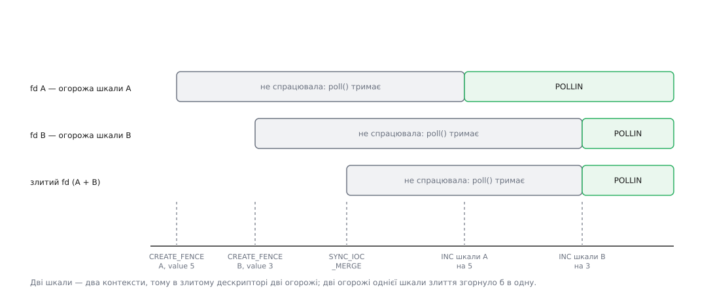

# ⚙️ Огорожі на столі: sw_sync, poll і злиття дескрипторів

Огорожу, яку опускає переривання відеокарти, майже неможливо розглянути: вона або спрацьовує швидше, ніж ви встигаєте подивитися, або не спрацьовує зовсім — і тоді дивитися вже нема на що. Тому в ядрі є навчальний драйвер `sw_sync`, де замість заліза командуєте ви: огорожу створюють рукою, тримають непорушною скільки завгодно й опускають окремою командою. На будь-якій машині з таким ядром — хоч на сервері без відеокарти — стає видно три речі, які інакше доводиться брати на віру: що `poll()` не прокидається раніше часу, що злитий дескриптор чекає на останню огорожу і що дві огорожі однієї черги злиття згортає в одну.

## Що для цього потрібне від ядра

Драйвер збирається окремим параметром `CONFIG_SW_SYNC` (у меню — «Sync File Validation Framework») і вимагає ввімкнених `CONFIG_SYNC_FILE` та `CONFIG_DEBUG_FS`. Довідка в `Kconfig` попереджає прямим текстом: неправильне вживання дозволяє простору користувача заклинити драйвери ядра, тож призначення — випробування й налагодження. Саме тому в готових ядрах дистрибутивів параметр зазвичай вимкнено; перевіряють його `zgrep CONFIG_SW_SYNC /proc/config.gz` або пошуком у `/boot/config-$(uname -r)`, а вмикають перезбіркою ядра.

Назовні драйвер віддає один файл — `/sys/kernel/debug/sync/sw_sync` із правами `0644`, тобто працювати з ним доведеться від адміністратора. Лежить він у [псевдофайловій системі](root:sys-unix/pseudo-filesystems) `debugfs`, яку часом треба спершу змонтувати: `mount -t debugfs none /sys/kernel/debug`. Поруч лежить файл `info`: ядро друкує в ньому всі живі шкали з поточним значенням лічильника й усі живі дескриптори огорож — найкоротший спосіб переконатися, що після вашої програми в ядрі нічого не лишилося.

Далі — головне речення всього досліду: **кожен `open()` цього файлу створює нову шкалу**. Шкала — це 32-бітний лічильник, що починається з нуля й уміє тільки зростати, власний контекст огорож і назва, яку ядро бере з імені вашого процесу. Огорожа на шкалі — це просто число: вона спрацьовує тієї миті, коли лічильник дійде до нього або перескочить. Дві окремі шкали — два незалежні лічильники з різними контекстами, і саме на цій різниці тримається дослід зі злиттям.

## Хід досліду

На першій шкалі заводимо огорожу зі значенням 5, на другій — зі значенням 3. Обидві стоять, бо обидва лічильники на нулі. Зливаємо їхні дескриптори в третій, зсуваємо перший лічильник, потім другий — і після кожного кроку питаємо всі три дескриптори, чи вони готові.



*Готовність з'являється рівно тоді, коли лічильник дійшов до потрібного числа, — і жодною командою раніше.*

## Інструменти

Команди над готовим дескриптором огорожі — злиття й опитування — оголошені у звичайному заголовку `<linux/sync_file.h>`: це офіційний [керуючий канал](root:sys-unix/ioctl-interface), доступний будь-якій програмі. А от команди самого `sw_sync` в `uapi` не експортовано взагалі: вони живуть усередині `drivers/dma-buf/sw_sync.c`, тож у програму їх переписують руками. Це не недогляд, а позиція: інтерфейс навчальний і сталості не обіцяє.

```c
/* sw-sync-play.c — огорожі руками, без жодного GPU.
 * Потрібні: ядро з CONFIG_SW_SYNC=y, змонтований debugfs, права root.
 * Збірка:   cc -O2 -Wall -o sw-sync-play sw-sync-play.c
 */
#define _GNU_SOURCE
#include <errno.h>
#include <fcntl.h>
#include <poll.h>
#include <stdint.h>
#include <stdio.h>
#include <stdlib.h>
#include <string.h>
#include <sys/ioctl.h>
#include <sys/wait.h>
#include <time.h>
#include <unistd.h>
#include <linux/types.h>
#include <linux/sync_file.h>   /* SYNC_IOC_MERGE, SYNC_IOC_FILE_INFO — це uapi */

/* А це — переписане з drivers/dma-buf/sw_sync.c: у заголовках його немає. */
struct sw_sync_create_fence_data {
        __u32 value;
        char  name[32];
        __s32 fence;           /* сюди ядро покладе дескриптор огорожі */
};
#define SW_SYNC_IOC_MAGIC        'W'
#define SW_SYNC_IOC_CREATE_FENCE _IOWR(SW_SYNC_IOC_MAGIC, 0, \
                                       struct sw_sync_create_fence_data)
#define SW_SYNC_IOC_INC          _IOW(SW_SYNC_IOC_MAGIC, 1, __u32)

#define SW_SYNC_PATH "/sys/kernel/debug/sync/sw_sync"

static void die(const char *what)
{
        fprintf(stderr, "%s: %s\n", what, strerror(errno));
        exit(1);
}

/* нова шкала: власний лічильник із нуля, власний контекст огорож */
static int timeline_open(void)
{
        int fd = open(SW_SYNC_PATH, O_RDWR);
        if (fd < 0)
                die("open " SW_SYNC_PATH " (CONFIG_SW_SYNC? debugfs? root?)");
        return fd;
}

/* огорожа, що впаде, коли лічильник шкали дійде до value */
static int fence_create(int timeline, unsigned value)
{
        struct sw_sync_create_fence_data d;

        memset(&d, 0, sizeof d);
        d.value = value;
        if (ioctl(timeline, SW_SYNC_IOC_CREATE_FENCE, &d) < 0)
                die("CREATE_FENCE");
        return d.fence;
}

/* ЗСУВ лічильника, не нове його значення */
static void timeline_inc(int timeline, unsigned by)
{
        if (ioctl(timeline, SW_SYNC_IOC_INC, &by) < 0)
                die("INC");
}

/* стан огорожі без засинання: 1 — спрацювала, 0 — ще ні */
static int fence_ready(int fence_fd)
{
        struct pollfd p = { .fd = fence_fd, .events = POLLIN };
        int n = poll(&p, 1, 0);          /* нульове очікування — лише знімок */

        if (n < 0)
                die("poll");
        return n > 0 && (p.revents & POLLIN);
}

static int fence_merge(const char *name, int a, int b)
{
        struct sync_merge_data d;

        memset(&d, 0, sizeof d);
        strncpy(d.name, name, sizeof d.name - 1);
        d.fd2 = b;
        if (ioctl(a, SYNC_IOC_MERGE, &d) < 0)
                die("MERGE");
        return d.fence;                  /* новий дескриптор; a і b живі далі */
}

/* скільки огорож усередині дескриптора і в якому вони стані */
static void fence_info(const char *tag, int fence_fd)
{
        struct sync_fence_info *fences;
        struct sync_file_info info;
        unsigned i;

        memset(&info, 0, sizeof info);   /* num_fences = 0 — питаємо лише кількість */
        if (ioctl(fence_fd, SYNC_IOC_FILE_INFO, &info) < 0)
                die("FILE_INFO (лічба)");

        fences = calloc(info.num_fences, sizeof *fences);
        if (!fences)
                die("calloc");
        info.sync_fence_info = (__u64)(uintptr_t)fences;
        if (ioctl(fence_fd, SYNC_IOC_FILE_INFO, &info) < 0)
                die("FILE_INFO (дані)");

        printf("%-14s «%s», стан %d, огорож усередині: %u\n",
               tag, info.name, info.status, info.num_fences);
        for (i = 0; i < info.num_fences; i++)
                printf("               %s/%s стан %d\n", fences[i].driver_name,
                       fences[i].obj_name, fences[i].status);
        free(fences);
}
```

Двократний виклик `SYNC_IOC_FILE_INFO` — не незграбність, а домовлений спосіб: нульове `num_fences` означає «поки що назви мені лише кількість», і ядро заповнює саме її. У полі `status` те саме число, що й у кожної окремої огорожі: `0` — ще працює, `1` — спрацювала, від'ємне — спрацювала з помилкою.

## Самі досліди

```c
/* 1. poll() справді спить, доки огорожа стоїть */
static void demo_wakeup(void)
{
        struct timespec t0, t1;
        int tl = timeline_open();
        int f  = fence_create(tl, 1);
        struct pollfd p = { .fd = f, .events = POLLIN };
        pid_t kid;

        printf("щойно створена: готова=%d\n", fence_ready(f));

        clock_gettime(CLOCK_MONOTONIC, &t0);
        kid = fork();
        if (kid < 0)
                die("fork");
        if (kid == 0) {                  /* дитина успадкувала дескриптор шкали */
                usleep(300 * 1000);
                timeline_inc(tl, 1);
                _exit(0);
        }

        if (poll(&p, 1, 5000) != 1)      /* ось тут потік справді спить */
                die("poll не дочекався");
        clock_gettime(CLOCK_MONOTONIC, &t1);
        printf("прокинувся через %.0f мс, revents=0x%x\n",
               (t1.tv_sec - t0.tv_sec) * 1e3 + (t1.tv_nsec - t0.tv_nsec) / 1e6,
               p.revents);

        waitpid(kid, NULL, 0);
        close(f);
        close(tl);
}

/* 2. злита огорожа падає разом з ОСТАННЬОЮ */
static void demo_merge(void)
{
        int a = timeline_open(), b = timeline_open();   /* два різні контексти */
        int fa = fence_create(a, 5), fb = fence_create(b, 3);
        int fm = fence_merge("a+b", fa, fb);

        fence_info("злита:", fm);
        printf("спокій:      A=%d B=%d злита=%d\n",
               fence_ready(fa), fence_ready(fb), fence_ready(fm));
        timeline_inc(a, 5);
        printf("після INC A: A=%d B=%d злита=%d\n",
               fence_ready(fa), fence_ready(fb), fence_ready(fm));
        timeline_inc(b, 3);
        printf("після INC B: A=%d B=%d злита=%d\n",
               fence_ready(fa), fence_ready(fb), fence_ready(fm));
        fence_info("злита:", fm);

        close(fm); close(fb); close(fa); close(b); close(a);
}

/* 3. дві огорожі однієї шкали злиття згортає в одну */
static void demo_same_context(void)
{
        int tl = timeline_open();
        int f7 = fence_create(tl, 7), f9 = fence_create(tl, 9);
        int fm = fence_merge("c7+c9", f7, f9);

        fence_info("один контекст:", fm);
        close(fm); close(f9); close(f7); close(tl);
}

/* 4. шкала пішла — огорожа однаково падає, але з помилкою */
static void demo_release(void)
{
        int tl = timeline_open();
        int f  = fence_create(tl, 1);

        close(tl);                       /* «залізо» зникло, не дійшовши до 1 */
        printf("шкали більше немає: готова=%d\n", fence_ready(f));
        fence_info("сирота:", f);
        close(f);
}

int main(void)
{
        demo_wakeup();
        demo_merge();
        demo_same_context();
        demo_release();
        return 0;
}
```

```
щойно створена: готова=0
прокинувся через 300 мс, revents=0x1
злита:         «a+b», стан 0, огорож усередині: 2
               sw_sync/sw-sync-play стан 0
               sw_sync/sw-sync-play стан 0
спокій:      A=0 B=0 злита=0
після INC A: A=1 B=0 злита=0
після INC B: A=1 B=1 злита=1
злита:         «a+b», стан 1, огорож усередині: 2
один контекст: «c7+c9», стан 0, огорож усередині: 1
шкали більше немає: готова=1
сирота:        «sw_sync-sw-sync-play7-1», стан -2, огорож усередині: 1
               sw_sync/sw-sync-play стан -2
```

Кожен рядок тут щось доводить. Пробудження настало через 300 мс, а не через 5000 — отже, `poll()` не опитував нічого в циклі, а спав, доки ядро його не збудило — тієї ж миті, коли дитина зсунула лічильник; це той самий механізм, яким [очікують на десятках дескрипторів одночасно](root:sys-unix/select-poll-epoll). Дитина, до речі, зсунула **батьків** лічильник: `fork()` копіює таблицю дескрипторів, а не самі об'єкти ядра, тож шкала в обох одна.

Злита огорожа після `INC A` лишилася неготовою — і це найважливіший рядок виводу. Усередині неї справді дві огорожі, бо контексти різні й ядру нема чого спрощувати. А от у третьому досліді дві огорожі однієї шкали дали всередині одну — та, що зі значенням 7, зникла, бо огорожа зі значенням 9 однаково не впаде раніше за неї. Ця економія не здогадка: черга гарантує порядок, і чекати на обидві означало б чекати двічі на те саме.

Ім'я `sw_sync/sw-sync-play` — це «драйвер/шкала»: назвою шкали стало ім'я процесу, який відкрив файл. Поле `name` у структурі створення огорожі ядро при цьому просто ігнорує; ім'я, яке справді доходить назад, — те, що передають при злитті.

## Межі досліду — і що з нього виростає

Лічильник тут зсуває системний виклик у контексті процесу, тож шляху, яким справжня огорожа падає з переривання, ця іграшка не проходить узагалі. Немає ні сторожового таймера, ні коду сигналізації, якому заборонено виділяти пам'ять, ні команди в черзі пристрою, яка сама чекає на потрібне число без участі процесора. Дослід показує **договір** — стани, порядок, поведінку дескриптора, — а не те, як цей договір виконує залізо.

Але договір тим і цінний, що він для всіх однаковий. Дескриптор, зроблений руками, нічим не відрізняється від того, що повернув драйвер відеокарти: усередині той самий `dma_fence`, назовні той самий файловий об'єкт. Отже, будь-який інтерфейс, який приймає вхідну огорожу дескриптором, прийме й цю — і чекатиме рівно доти, доки ви не зсунете лічильник. Саме це робить `sw_sync` ручним гальмом для чужого конвеєра: заявку на новий кадр можна подати й тримати невиконаною скільки завгодно, щоб роздивитися, що робить у цей час композитор, — а потім відпустити одним `INC` і побачити, у якому порядку все розсипалося на місце.

## Пастки

**Два дескриптори — дві різні речі.** Той, що повернув `open()`, — шкала; той, що прийшов у полі `fence`, — огорожа. `INC` на огорожі й `MERGE` на шкалі дадуть `ENOTTY`, бо кожен обробник знає лише свої команди. Помилка гучна, і це щастя: тиха була б значно гірша.

**`INC` — це зсув, а не нове значення.** Два `INC` по 5 дають 10, а не 5. І передають його **вказівником**: команда оголошена через `_IOW`, тож ядро читає число з пам'яті програми. `ioctl(tl, SW_SYNC_IOC_INC, 5)` компілюється без жодного попередження й повертає `EFAULT`.

**Огорожа не скидається — ніколи.** Коли лічильник уже минув потрібне число, кожна наступна огорожа з тим самим значенням народжується вже спрацьованою (те саме, до речі, стається з огорожею зі значенням 0 на новій шкалі). Чекати вдруге можна лише на нову огорожу з більшим числом — і це не обмеження навчального драйвера, а сам принцип: одноразовість огорожі прибирає гонку між «скинув» і «перевірив».

**Закритий дескриптор шкали опускає всі її огорожі — з помилкою.** У четвертому досліді `close(tl)` пройшовся списком огорож, які ще не спрацювали, поставив кожній усередину `-ENOENT` і оголосив їх спрацьованими: звідси `стан -2`. Виглядає різко, але це буквальне виконання правила, за яким огорожа зобов'язана впасти за скінченний час: якщо той, хто мав її опустити, зник, чекати на нього більше нікому не можна. Драйвер справжнього заліза робить те саме після сторожового таймера.

**Забутий `close()` тримає все.** Огорожа тримає шкалу, злитий дескриптор тримає обидві вихідні, а `poll()` на дескрипторі, який ніхто вже не опустить, — це зависла програма. Перевірка коштує однієї команди: `cat /sys/kernel/debug/sync/info` після виходу програми має не показувати ваших шкал.

Ціна всієї цієї механіки — одне виділення пам'яті й один дескриптор на кожну порцію роботи; `INC` будить рівно ті огорожі, чиє число не перевищує нового значення лічильника, і жодної зайвої. Але переносити щось із цього досліду в робочу програму не варто: `sw_sync` навмисно дозволяє простору користувача не опустити огорожу ніколи — а в справжньому конвеєрі це означає заклинити чужий драйвер і заморозити екран.
