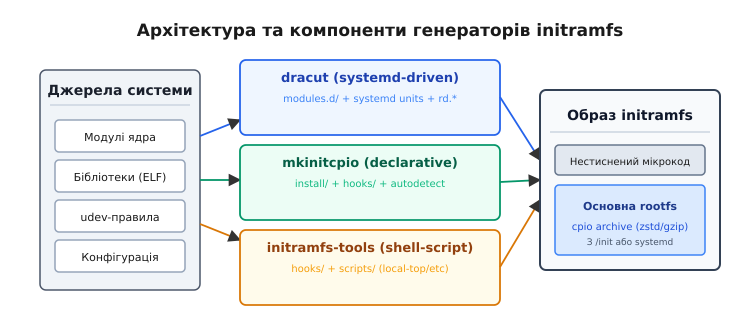
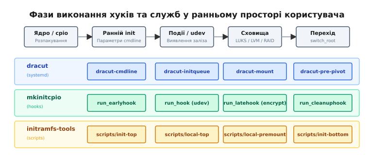

# Генератори initramfs: dracut, mkinitcpio та initramfs-tools

<preknowlist>
- [initramfs: тимчасовий корінь](root:sys-unix/initramfs) — структура cpio-архіву, процес розпакування ядра в rootfs та передача керування через `/init`.
- [Завантажувач і командний рядок ядра](root:sys-unix/bootloader-and-cmdline) — передача аргументів `root=`, `rd.*` та завантаження окремих образів initramfs завантажувачем.
- [Ланцюг завантаження](root:sys-unix/boot-chain) — послідовність передачі керування від прошивки через завантажувач і ядро до init.
- [systemd: юніти, залежності, цілі](root:sys-unix/systemd-model) — юніти, цілі (targets) та подійний запуск служб у ранньому просторі користувача.
</preknowlist>

Ручне збирання cpio-архіву initramfs із кількох статичних бінарників задовольняє лише найпростіші навчальні системи або вбудовані контролери з незмінною апаратурою. У реальних дистрибутивах Linux із тисячами різновидів NVMe-контролерів, мережевих карт, масивів RAID, шифрування LUKS та томів LVM шлях до кореневої файлової системи вимагає динамічного аналізу залежностей бінарних файлів, автоматичного пакування модулів ядра та побудови сценаріїв ініціалізації. Спроба сформувати initramfs вручну для корпоративного сервера з розділом `/usr` на SAN-сховищі iSCSI вимагає відстеження сотень ELF-бібліотек, udev-правил, конфігурацій шифрування та модулів ядра, де пропуск єдиного файлу `libzstd.so.1` або модуля `iscsi_tcp.ko` призводить до фатальної зупинки ядра (*kernel panic*).

Цю задачу автоматизації виконують **генератори initramfs** — спеціалізовані інструментальні комплекси, які аналізують поточний стан системи або її конфігурацію, збирають необхідні файли та пакують їх у стиснений cpio-архів newc.

---

## Дві стратегії формування образу та аналіз залежностей

Головна проблема при створенні початкового образу — це роздоріжжя між універсальністю та розміром. Генератор повинен відповісти на питання: які саме модулі ядра та виконувані файли повинні потрапити у cpio-архів?

Існують дві базові стратегії формування образів:

1. **Універсальна (*generic*)**: генератор пакує широкий спектр драйверів контролерів накопичувачів (SATA, NVMe, SCSI, USB), мережевих адаптерів, криптографічних алгоритмів та файлових систем. Отриманий образ має розмір від 30 до 80 мегабайтів і здатен завантажити дане ядро на будь-якому апаратному забезпеченні. Це стандартний режим для інсталяторів дистрибутивів та дистрибутивних ядер за замовчуванням.
2. **Локальна (*host-only* / *autodetect*)**: генератор інспектує поточне апаратне забезпечення машини через деревну структуру sysfs (`/sys/bus/`, `/sys/class/`), сканує активні PCI/USB пристрої та додає в образ лише ті драйвери та конфігурації, які реально потрібні даній конкретній системі. Розмір образу зменшується до 8–15 мегабайтів, а час розпакування прискорюється у кілька разів. Проте такий образ не зможе завантажитися після перенесення диска на інший комп'ютер із відмінним дисковим контролером.

```
                  +-----------------------------------+
                  |   Генератор (dracut/mkinitcpio)   |
                  +-----------------------------------+
                                    |
          +-------------------------+-------------------------+
          |                                                   |
          v                                                   v
   Режим Generic                                      Режим Host-only / Autodetect
  +-------------------------------+                  +-------------------------------+
  | Всі SATA/NVMe/RAID/USB        |                  | Лише контролери з /sys        |
  | Всі крипто-модулі             |                  | Лише активні томи LUKS/LVM    |
  | Універсальний boot (50-80 МБ) |                  | Оптимізований boot (8-15 МБ)  |
  +-------------------------------+                  +-------------------------------+
```

Щоб сформувати цілісний простір користувача у CPIO-архіві, генератор виконує три рівні автоматичного аналізу залежностей:

### 1. Трасування ELF-бібліотек через `DT_NEEDED`

Коли генератор додає у cpio-архів виконуваний бінарний файл (наприклад, `/usr/bin/cryptsetup`), він не може обмежитися цим єдиним файлом. Спроба виконати динамічно скомпільовану програму без її динамічного завантажувача (`/lib64/ld-linux-x86-64.so.2`) та залежних shared-бібліотек (`.so`) призведе до помилки ядра `ENOENT` (No such file or directory).

Генератори аналізують заголовки ELF-файлів за допомогою утиліт `readelf`, `ldd` або вбудованих функцій аналізу таблиці `.dynamic`. Програма читає всі теги `DT_NEEDED`, знаходить відповідні бібліотеки у системних шляхах (`/lib64`, `/usr/lib64`) і рекурсивно копіює їх у cpio-структуру майбутнього initramfs.

```
/usr/bin/cryptsetup
   ├── DT_NEEDED: libcryptsetup.so.12 ──> /usr/lib/libcryptsetup.so.12
   │     ├── DT_NEEDED: libjson-c.so.5 ──> /usr/lib/libjson-c.so.5
   │     └── DT_NEEDED: libargon2.so.1 ──> /usr/lib/libargon2.so.1
   ├── DT_NEEDED: libpopt.so.0        ──> /usr/lib/libpopt.so.0
   └── DT_NEEDED: libc.so.6           ──> /usr/lib/libc.so.6
```

### 2. Рекурсивне розв'язання залежностей модулів ядра

Драйвер контролера (наприклад, `nvme.ko`) часто залежить від загального модуля блокового шару `nvme-core.ko`, а той у свою чергу від `t10-pi.ko` та `crc64-rocksoft.ko`.

Генератори зчитують файл `modules.dep` або виконують утиліту `modinfo -F depends`. Знайдені залежності обробляються рекурсивно, гарантуючи, що в initramfs потраплять усі потрібні файли `.ko` або `.ko.zst`, а також файл конфігурації `modules.alias` для автоматичного завантаження за символьними ідентифікаторами пристроїв (alias/modalias).

### 3. Збирання udev-правил та системних helper-бінарників

Сучасні пристрої виявляються через події ядра. Для роботи udev у ранньому просторі користувача генератор повинен копіювати не лише демони `systemd-udevd` або `udevd`, а й правила з `/usr/lib/udev/rules.d/` (наприклад, `60-persistent-storage.rules`, `64-btrfs.rules`), а також допоміжні утиліти, які ці правила викликають (`/usr/lib/udev/ata_id`, `scsi_id`).

При підключенні нового блокового носія демон `systemd-udevd` усередині initramfs зчитує правила та створює символьні посилання у директоріях `/dev/disk/by-uuid/`, `/dev/disk/by-label/` та `/dev/disk/by-id/`. Це дозволяє скриптам ініціалізації знаходити потрібний розділ за його унікальним UUID, навіть якщо номери блокових пристроїв (`/dev/sda` чи `/dev/sdb`) змінилися після додавання нового контролера.

> 📜 Детальний огляд того, як екосистема Linux перейшла від ручних shell-скриптів `mkinitrd` до сучасних інструментаріїв генерації, наведено у вставці [📜 Еволюція генераторів initramfs: від mkinitrd до dracut та mkinitcpio](root:sys-unix/dracut-and-mkinitcpio-toolchains/hist-initramfs-generators-evolution.md).

---

## Архітектура dracut: подійний initramfs на базі systemd

Проєкт **dracut** розробляється спільнотою Red Hat, Fedora та SUSE як стандартизований генератор initramfs для корпоративних та дистрибутивних систем.

Головна архітектурна відмінність dracut полягає у відмові від монолітних shell-скриптів і переході до **подійно-орієнтованої моделі**. За замовчуванням dracut створює initramfs, усередині якого працює повноцінний екземпляр **systemd** та демона **udev**.

```
              +-------------------------------------------------+
              |         Конфігурація /etc/dracut.conf           |
              |       та файли /etc/dracut.conf.d/*.conf        |
              +-------------------------------------------------+
                                       |
                                       v
              +-------------------------------------------------+
              |                 Виклик dracut                   |
              +-------------------------------------------------+
                                       |
                   +-------------------+-------------------+
                   |                                       |
                   v                                       v
   Модулі ядра & ELF бінарники              Модульна структура dracut
   Аналіз ldd / modinfo / sysfs            /usr/lib/dracut/modules.d/
                   |                        ├── 00systemd/
                   |                        ├── 90crypt/
                   |                        ├── 90lvm/
                   |                        └── 95rootfs-block/
                   +-------------------+-------------------+
                                       |
                                       v
              +-------------------------------------------------+
              |     Упаковка cpio (newc) + Компресія (zstd)     |
              +-------------------------------------------------+
```

### Модульна структура `modules.d`

Всередині dracut уся логіка розбита на ізольовані модулі, які знаходяться в директорії `/usr/lib/dracut/modules.d/`. Кожна директорія має числовий префікс, що визначає порядок її завантаження та пріоритет (наприклад, `00systemd`, `90crypt`, `90lvm`, `95rootfs-block`).

Кожен модуль містить файл `module-setup.sh`, у якому оголошено Bash-функції керування збиранням:

- `check()`: перевіряє, чи потрібен цей модуль для даної системи. Наприклад, модуль `90crypt` перевірить, чи встановлено утиліту `cryptsetup` та чи є зашифровані томи у `/etc/fstab` або `/etc/crypttab`.
- `depends()`: повертає список інших модулів dracut, без яких цей модуль не може працювати (наприклад, `crypt` вимагає `udev-rules`).
- `install()`: визначає, які саме файли, udev-правила, конфігурації та скрипти виконання треба скопіювати у cpio-архів. Для копіювання використовують допоміжні функції `inst_multiple`, `inst_rules`, `inst_hook`.
- `installkernel()`: визначає список модулів ядра (`.ko`), які стосуються цього функціоналу.

### Подійна черга initqueue у dracut та дерево юнітів systemd

Коли systemd запускається всередині initramfs, створеного dracut, завантаження розбивається на послідовність спеціалізованих юнітів та target-цілей:

1. **`dracut-cmdline.service`**: зчитує та розбирає командний рядок ядра `/proc/cmdline`. Параметри з префіксом `rd.` (наприклад, `rd.luks.uuid=`, `rd.lvm.vg=`, `rd.break=`) зберігаються у тимчасові файли конфігурації в `/tmp`.
2. **`dracut-initqueue.service`**: головна подійна петля. Служба запускає скрипти з точок розширення `initqueue`, `initqueue/settled`, `initqueue/online`. Якщо системі потрібен зашифрований том LUKS, udev виявляє блоковий пристрій, надсилає подію, і `dracut-initqueue` викликає запит пароля на `/dev/console`.
3. **`dracut-pre-mount.service`**: виконується після того, як потрібний блоковий пристрій з'явився та був розшифрований.
4. **`dracut-mount.service`**: здійснює монтування справжнього кореня у директорію `/sysroot`.
5. **`dracut-pre-pivot.service`**: очищає тимчасовий корінь і передає керування справжньому systemd через `systemctl switch-root /sysroot`.

Всередині initramfs systemd оперує спеціальними цілями (target): `initrd.target`, `initrd-root-fs.target`, `initrd-parse-etc.service`. Це гарантує суворий контроль порядку стартів без потреби писати складені shell-скрипти з опитуванням пристроїв у циклі.

Завдяки такій структурі dracut підтримує складні сценарії завантаження, де порядок виявлення пристроїв невідомий заздалегідь.

---

## Архітектура mkinitcpio: декларативність та швидкість Arch Linux

Інструмент **mkinitcpio** розробляється в рамках дистрибутиву Arch Linux. На відміну від dracut, основою mkinitcpio є **декларативність, швидкість та абсолютна прозорість** для адміністратора.

Головним файлом налаштування є `/etc/mkinitcpio.conf`. У ньому записано масиви параметрів, що визначають вміст образу:

```bash
# Приклад конфігурації /etc/mkinitcpio.conf
MODULES=(nvme btrfs)
BINARIES=(/usr/bin/btrfs)
FILES=()
HOOKS=(base udev autodetect modconf block encrypt lvm2 filesystems fsck)
COMPRESSION="zstd"
```

### Розділення фази збирання та фази виконання

У mkinitcpio кожен хук розділено на два незалежних файли:

1. **Файл інсталяції (`/usr/lib/initcpio/install/name`)**: виконується на основній системі під час запуску `mkinitcpio`. Містить Bash-функцію `build()`, яка використовує API `add_module`, `add_binary`, `add_file`, `add_runscript` для додавання ресурсів у майбутній cpio-архів.
2. **Файл виконання (`/usr/lib/initcpio/hooks/name`)**: копіюється всередину cpio-архіву і виконується під час завантаження системи під час роботи початкового `/init`. Містить функції `run_earlyhook`, `run_hook`, `run_latehook`, `run_cleanuphook`.

```
          Фаза збирання (на хост-системі):
          mkinitcpio читає /etc/mkinitcpio.conf
                   │
                   ├──> Запуск /usr/lib/initcpio/install/autodetect (build)
                   ├──> Запуск /usr/lib/initcpio/install/encrypt (build)
                   └──> Створення cpio-архіву (zstd)
                                │
                                v
          Фаза виконання (під час завантаження):
          Ядро розпаковує cpio -> Запуск /init
                   │
                   ├──> Виконання run_earlyhook ()
                   ├──> Виконання run_hook () [udev, encrypt, lvm2]
                   └──> Виконання run_latehook () -> switch_root
```

### Порядок хуків у списку `HOOKS` має значення

Порядок переліку хуків у масиві `HOOKS=(...)` є суворо детермінованим, оскільки скрипти завантаження виконуються точнісінько у тій послідовності, у якій вони вказані у конфігурації:

- **`base`**: додає базову структуру директорій, інтерпретатор `busybox` та основний скрипт `/init`.
- **`udev`**: запускає демон `systemd-udevd` для виявлення пристроїв.
- **`autodetect`**: аналізує накопичувачі та пристрої через sysfs і видаляє зі списку збирання всі модулі ядра, не задіяні на даному ПК.
- **`block`**: додає підтримку всіх блокових пристроїв (SATA, NVMe, SCSI). Повинен іти *після* `autodetect`, щоб `autodetect` міг відфільтрувати список.
- **`encrypt`**: додає утиліту `cryptsetup` та відкриває зашифрований том LUKS. Повинен іти *перед* `lvm2`, якщо LVM знаходиться всередині зашифрованого контейнера.
- **`lvm2`**: сканує та відкриває групи логічних томів (LVM).
- **`filesystems`**: додає драйвери файлових систем (ext4, btrfs, xfs).

### Альтернативні рантайм-екосистеми mkinitcpio

mkinitcpio підтримує дві паралельні схеми ініціалізації:

- **Класична shell-схема (`base` + `udev`)**: всередині initramfs працює легкий shell-скрипт під керуванням `busybox/ash`, а пристрої обробляє `udevd`.
- **Сучасна systemd-схема (`systemd`)**: замість хуків `base` та `udev` вказують хук `systemd`. У цьому разі mkinitcpio збирає initramfs на основі бінарника `systemd` (подібно до dracut), а замість shell-хуків `encrypt` та `lvm2` використовуються хуки `sd-encrypt` та `sd-lvm2`, керовані юнітами systemd.

---

## Архітектура initramfs-tools: класичний підхід Debian та Ubuntu

Інструментарій **initramfs-tools** є стандартом для дистрибутивів сімейства Debian, Ubuntu, Linux Mint та Pop!_OS. Його розробку підпорядковано принципам максимальної сумісності зі специфікаціями POSIX shell та мінімального споживання ресурсів.

Основна конфігурація знаходиться у файлі `/etc/initramfs-tools/initramfs.conf`. Ключовим параметром у ньому є режим відбору модулів `MODULES`:

- `MODULES=most`: пакує драйвери для більшості поширених дискових контролерів та файлових систем (стандарт для універсальних ядер).
- `MODULES=dep`: аналізує поточну змонтовану кореневу файлову систему і копіює лише ті модулі, які беруть участь у її завантаженні (аналог `host-only`).
- `MODULES=list`: копіює лише модулі, явно перелічені у файлі `/etc/initramfs-tools/modules`.

```
/etc/initramfs-tools/
├── initramfs.conf               <-- Головний файл налаштувань (BOOT, MODULES, COMPRESS)
├── modules                      <-- Явний список модулів ядра
├── hooks/                       <-- Власні скрипти фази збирання
└── scripts/                     <-- Власні скрипти фази завантаження
    ├── init-top/
    ├── local-top/               <-- Розпакування cryptroot, lvm2
    ├── local-premount/          <-- Перевірка fsck
    └── local-bottom/
```

### Двофазна система розширення initramfs-tools

Логіку initramfs-tools розбито на два дерева директорій:

1. **Фаза збирання (`/usr/share/initramfs-tools/hooks/`)**: скрипти з цієї директорії виконуються при команді `update-initramfs -u`. Вони копіюють бінарні файли через функції `copy_exec <binary>` та модулі через `manual_add_modules <module>`.
2. **Фаза виконання (`/usr/share/initramfs-tools/scripts/`)**: під час завантаження системи головний shell-скрипт `/init` послідовно обходить директорії-фази й запускає всі знайдені в них скрипти в алфавітному порядку:
   - `init-top`: мову завантаження ініціалізовано, запускається `devtmpfs` та `udevd`.
   - `local-top` (або `nfs-top` при мережевому boot): підготовка дискових томах, виклик `cryptsetup` та `vgchange -ay`.
   - `local-premount`: пристрої готові, виконується утиліта перевірки цілісності `fsck`.
   - `local-bottom`: корінь успішно змонтовано у `/root`.
   - `init-bottom`: завершальне очищення перед викликом `run-init` (`switch_root`).

Завдяки такій фазовій структурі будь-який Debian-пакунок (наприклад, `mdadm`) може покласти свій скрипт у `/usr/share/initramfs-tools/hooks/mdadm` та `/usr/share/initramfs-tools/scripts/local-top/mdadm`, забезпечуючи автоматичну підтримку RAID-масивів без переписання головного коду генератора.

---

## Алгоритми стиснення initramfs та продуктивність завантаження

Вибір алгоритму компресії cpio-архіву безпосередньо впливає на час завантаження ядра, розмір файлу на диску `/boot` та навантаження на процесор під час розпакування у пам'яті.

Сучасні генератори підтримують такі алгоритми:

1. **`zstd` (Zstandard)**: стандарт де-факто для більшості сучасних дистрибутивів (Arch, Fedora, Ubuntu). Забезпечує надзвичайно високу швидкість декомпресії у ядрі (до 1500–2500 МБ/с на один потік процесора) при коефіцієнті стиснення, близькому до `gzip` або `xz`.
2. **`gzip`**: класичний алгоритм з високою швидкістю декомпресії та мінімальними вимогами до пам'яті розпакувальника у ядрі, проте коефіцієнт стиснення поступається `zstd` та `xz`.
3. **`xz` (LZMA2)**: забезпечує найвищий коефіцієнт стиснення (найменший розмір initramfs на диску), проте вимагає суттєвих витрат процесорного часу та пам'яті під час розпакування ядра.
4. **`lz4` / `lzo`**: алгоритми з максимальною швидкістю декомпресії (майже миттєве розпакування), але з найгіршим коефіцієнтом стиснення (найбільший розмір образу).

```
               Порівняння алгоритмів стиснення initramfs:
 ┌──────────┬──────────────────────┬───────────────────────┬──────────────┐
 │ Алгоритм │ Швидкість розпакування│ Коефіцієнт стиснення  │ Використання │
 ├──────────┼──────────────────────┼───────────────────────┼──────────────┤
 │ zstd     │ Надвисока (2000 МБ/с)│ Високий (оптимальний) │ Стандарт 2026│
 │ gzip     │ Висока (500 МБ/с)    │ Середній              │ Сумісність   │
 │ xz       │ Низька (100 МБ/с)    │ Максимальний          │ Вбудовані    │
 │ lz4      │ Экстремальна         │ Низький               │ Швидкий boot │
 └──────────┴──────────────────────┴───────────────────────┴──────────────┘
```

---

## Порівняльний аналіз генераторів initramfs

Різні філософії розробки та цільові дистрибутиви сформували чіткі відмінності між трьома інструментаріями.



*Компоненти та шляхи проходження даних від системних ресурсів до готового cpio-архіву в трьох генераторах initramfs.*

Нижче наведено зведену порівняльну характеристику трьох провідних інструментів:

| Параметр | dracut | mkinitcpio | initramfs-tools |
| :--- | :--- | :--- | :--- |
| **Основні дистрибутиви** | Fedora, RHEL, CentOS, SUSE, Gentoo | Arch Linux, Manjaro, EndeavourOS | Debian, Ubuntu, Linux Mint |
| **Двигун усередині initramfs** | systemd + udevd (за замовчуванням) | `busybox/ash` або `systemd` | `dash` / `busybox` |
| **Парадигма розширення** | Модулі `modules.d/` з `module-setup.sh` | Декларативні хуки `install/` та `hooks/` | Фазові директорії `/scripts/local-top/` |
| **Аналіз залежностей** | Автоматичний, розгалужений (`host-only`) | Через `autodetect` або вручну в `HOOKS` | Через прапорець `MODULES=dep` або `most` |
| **Розмір cpio-образу (zstd)** | Середній / Великий (30–60 МБ) | Малий / Середній (8–25 МБ) | Малий / Середній (15–35 МБ) |
| **Швидкість генерації** | Повільна (через глибокий аналіз) | Дуже висока | Висока |
| **Гнучкість аварійного shells** | Запуск systemd emergency shell | Запуск busybox ash shell | Запуск dash emergency shell |
| **Підтримка UKI (Unified Kernel)** | Вбудована прапорцем `--uefi` | Вбудована прапорцем `-U` | Потребує зовнішнього `ukify` |

На наступній діаграмі показано розкладку часових фаз виконання хуків та служб для кожного з трьох інструментаріїв під час завантаження:



*Етапи виконання задач у ранньому просторі користувача: від розпакування cpio-архіву ядром до очищення та виклику switch_root.*

> 📋 Детальну специфікацію функцій API, файлів налаштування та параметрів командного рядка для всіх трьох генераторів зведено у вставці [📋 Інтерфейси хуків та конфігурації генераторів](root:sys-unix/dracut-and-mkinitcpio-toolchains/api-toolchain-hook-interfaces.md).

---

## Завантаження через мережу та SAN-сховища

Складні корпоративні середовища часто використовують завантаження безпосередньо з мережі (англ. *Netboot* / *Diskless boot*) або з контролерів SAN (Storage Area Network). У таких конфігураціях кореневий розділ знаходиться не на локальному NVMe-диску, а на виділеному винесеному сервері (NFS, iSCSI, NBD або FCoE).

Уся вага налаштування мережевого стека припадає саме на генератор initramfs:

1. **Мережеві модулі та прошивки**: генератор повинен копіювати у cpio-архів не лише драйвери мережевих карт (`e1000e.ko`, `ixgbe.ko`, `r8169.ko`), але й файли мікрокоду (*firmware*) з `/lib/firmware/`, без яких сучасні мережеві адаптери відмовляються ініціалізуватися.
2. **Підняття DHCP / Static IP**: у ранньому просторі користувача викликаються утиліти `ipconfig` (у Debian/initramfs-tools) або юніти `systemd-networkd` / `dracut-net` (у dracut). Мережеві параметри зчитуються з командного рядка ядра `ip=dhcp` або `ip=192.168.1.50::192.168.1.1:255.255.255.0:host:eth0:off`.
3. **Підключення винесеного тома**:
   - Для **NFS**: модуль `nfs` монтує корінь через виклик `mount -t nfs -o ro 192.168.1.100:/srv/nfs/root /sysroot`.
   - Для **iSCSI**: демон `iscsid` та утиліта `iscsiadm` ініціалізують iSCSI-сесію до target-вузла (`iscsi_target_name=iqn.2026-08.com.example:root`), створюючи віртуальний блоковий пристрій `/dev/sda`.

---

## Налагодження та діагностика помилок генераторів

Коли система зупиняється на етапі завантаження, першим кроком є визначення того, чи сталася помилка всередині initramfs, чи під час передачі керування у справжній корінь.

Для налагодження розробники використовують кілька контрольних інструментів:

- **Точки зупинки `rd.break`**: передача параметра `rd.break=pre-mount` або `rd.break=post-mount` у командний рядок ядра примушує dracut або mkinitcpio зупинити виконання скриптів і відкрити діалогову аварійну оболонку (*emergency shell*).
- **Вмикання детального логування `rd.debug` / `debug`**: виводить кожен крок виконання shell-скриптів або служб systemd у текстову консоль.
- **Аналіз вмісту образу на хості**:
  - У dracut: `lsinitrd /boot/initramfs-linux.img`.
  - У mkinitcpio: `bsdtar -tf /boot/initramfs-linux.img`.
  - У Debian: `lsinitramfs /boot/initrd.img-$(uname -r)`.

---

## Сучасний вектор розвитку: Unified Kernel Images (UKI) та запечатування boot

Традиційна модель завантаження Linux передбачає наявність окремого файлу ядра (`vmlinuz`) та окремого cpio-архіву (`initramfs.img`), які завантажувач (GRUB2 або systemd-boot) зчитує з незашифрованого розділу `/boot` та передає ядру.

Ця схема має критичну уразливість у контексті систем із підвищеними вимогами до безпеки (Trusted Boot / Secure Boot). Навіть якщо ядро Linux підписане цифровим ключем Secure Boot, файл `initramfs.img` залишається непідписаним. Зловмисник із фізичним доступом до ПК може підмінити файл `initramfs.img`, уставивши в його `/init` код для перехоплення паролів LUKS або впровадження вредоносних бінарників.

```
Традиційна модель (Незахищена):
/boot/vmlinuz-6.10      ──> Підписано Secure Boot  [OK]
/boot/initramfs.img     ──> НЕ підписано! (Можливість підміни) [ВРАЗЛИВІСТЬ]

Сучасна модель UKI (Unified Kernel Image):
+-------------------------------------------------------------------------+
| Єдиний PE/COFF бінарник (vmlinuz-linux.efi)                             |
| ├── systemd-stub  (EFI завантажувальна заглушка)                        |
| ├── .cmdline       (Запечатані параметри ядра: root=UUID=... quiet)     |
| ├── .osrel         (Файл /etc/os-release)                               |
| ├── .linux         (Бінарник ядра vmlinuz)                              |
| └── .initrd        (Згенерований cpio-архів initramfs)                  |
+-------------------------------------------------------------------------+
       │
       v
Підписано ЄДИНИМ ключем Secure Boot (MOK) ──> Запечатано в TPM2 (PCR 4/11)
```

Для вирішення цієї проблеми розробники systemd, Red Hat та Arch Linux розробили архітектуру **Unified Kernel Image (UKI)**.

UKI — це єдиний виконуваний файл формату PE/COFF (з розширенням `.efi`), який містить у собі у вигляді окремих секцій:
1. `.stub`: завантажувальна заглушка `systemd-stub`.
2. `.cmdline`: запечатані текстові параметри командного рядка ядра.
3. `.ucode`: нестиснений мікрокод процесора (Intel/AMD).
4. `.linux`: стиснений бінарний образ ядра Linux.
5. `.initrd`: повністю згенерований cpio-архів initramfs.

Генератори `dracut` та `mkinitcpio` інтегрували підтримку збирання UKI безпосередньо у свій інструментарій:

- У **dracut** викликом `dracut --uefi --key /etc/efi-keys/db.key --cert /etc/efi-keys/db.crt` генератор самостійно збирає cpio-архів, об'єднує його з ядром та підписує готовий `.efi` файл ключами Secure Boot.
- У **mkinitcpio** прапорець `-U /boot/EFI/Linux/arch-linux.efi` або пресет з директивою `ALL_microcode=(...)` викликає утиліту `systemd-ukify` для генерації підписаного UKI.

Після генерації отриманий `.efi` файл реєструється в UEFI NVRAM або викликом `systemd-boot`. При підключенні апаратного модуля **TPM2** (Trusted Platform Module) регістри конфігурації платформи (PCR, зокрема PCR 4 та PCR 11) заміряють хеш всього єдиного образу UKI. Якщо зловмисник змінить хоч один байт у запечатаному initramfs або в командному рядку ядра, TPM2 відмовиться видавати ключі розшифровки диску LUKS, забезпечуючи повноцінний криптографічний захист системи від моменту ввімкнення живлення до старту PID 1.

> ⚙️ Практичний приклад створення власного модуля перевірки токенів для dracut та хука для mkinitcpio розглянуто у вставці [⚙️ Створення власного модуля dracut та хука mkinitcpio](root:sys-unix/dracut-and-mkinitcpio-toolchains/proj-custom-dracut-module.md).
