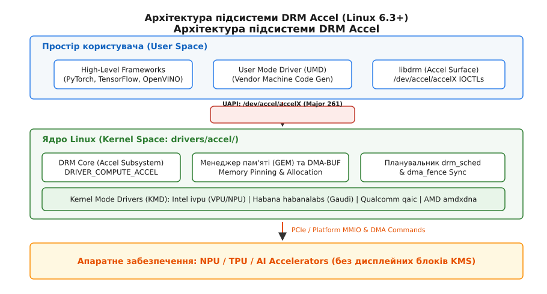
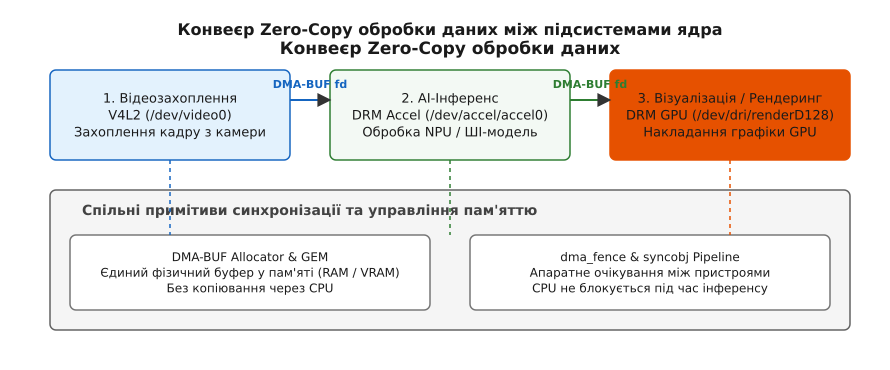

<preknowlist>
- [Символьні та блочні пристрої](topic:sys-unix/character-and-block-devices) — як ядро Linux експортує пристрої у `/dev` та мапить мажорні й мінорні номери.
- [Підсистема DRM та KMS](topic:sys-unix/drm-kms-object-model) — базова архітектура Direct Rendering Manager та менеджер пам'яті GEM.
- [Механізм DMA-BUF](topic:sys-unix/dma-buf) — безкопійний обмін буферами пам'яті між драйверами ядра та пристроями.
- [Примітиви синхронізації dma_fence](topic:sys-unix/dma-fence-sync) — асинхронні бар'єри виконання між CPU, GPU та прискорювачами.
</preknowlist>

# Підсистема прискорювачів DRM Accel (/dev/accel/accelX для NPU та AI-чіпів)

Коли сучасний сервер або персональний комп'ютер починає виконувати задачу нейромережевого інференсу, прискорювач штучного інтелекту — будь то нейронний процесор NPU (англ. *Neural Processing Unit*), тензорний процесор TPU (англ. *Tensor Processing Unit*) чи матричний прискорювач — має отримати гігабайти вагових коефіцієнтів моделей, заблокувати їх у фізичній пам'яті, сформувати черги команд для тензорних ядер і синхронізувати результат із графічним процесором. Якщо декілька застосунків (наприклад, веб-браузер, фоновий сервіс розпізнавання облич та середовище аналізу відео) одночасно звертаються до NPU, ядро Linux повинно забезпечити сувору ізоляцію їхніх віртуальних просторів адрес, асинхронне чергування команд та захист від зависання обладнання. Якщо такий прискорювач спробує використати класичний графічний стек DRM, виклик сканування графічних виходів або кадрових буферів завершиться помилкою, а бібліотеки типу Mesa або Vulkan loader під час старту системи впадуть у рекурсивну помилку, намагаючись ініціалізувати растровий графічний конвеєр на чіпі, у якому фізично відсутні дисплейні блокувачі та розгортка.

Підсистема **DRM Accel** (від лат. *accelerare* — прискорювати), представлена в ядрі Linux починаючи з версії 6.3, розв'язує цю архітектурну суперечність. Вона виокремлює обчислювальні можливості ядра Direct Rendering Manager (DRM) — управління пам'яттю, планування завдань та асинхронну синхронізацію — у самостійний фреймворк, ізольований від графічного виводу та дисплейних систем.


*Загальна архітектура підсистеми DRM Accel та розділення інтерфейсів між простором користувача, ядром та апаратним забезпеченням.*

## 1. Анатомія розриву: Чому AI-прискорювачі не є відеокартами

Класичний графічний процесор (GPU, англ. *Graphics Processing Unit*) створювався довкола ідеї растрової графіки та дисплейного виводу. Його апаратна архітектура історично об'єднує два принципово різних блоки:

1. **Обчислювальне ядро (Compute Engine):** Масив SIMT-процесорів (Single Instruction, Multiple Threads), шейдерні блоки, конвеєри векторних та матричних обчислень, вершини та піксельні процесори.
2. **Дисплейний контролер (Display Engine / KMS):** Контролери фізичних виходів HDMI/DisplayPort, фізичні трансивери PHY, транскодери, блоки генерації кадрових синхросигналів (vblank), плоскості (planes), кадрові буфери, апаратні ROP-блоки та контролери апаратного накладання зображення.

На противагу GPU, сучасні AI-прискорювачі (NPU, TPU, VPU) є абсолютно «сліпими» обчислювальними пристроями. Усередині кремнієвого кристала NPU розташовано двовимірний системний масив тензорних помножувачів (англ. *Systolic Array*), векторні обчислювальні блоки (VPU) для виконання елементних операцій (ReLU, GELU, Softmax), локальну статичну пам'ять SRAM (Scratchpad Memory) високої пропускної здатності для збереження активацій та DMA-контролери. У ньому немає жодного транзистора, який би відповідав за формування відеосигналу, підключення монітора, кодування курсора миші чи растеризацію трикутників.

Спроба інтегрувати такі пристрої у звичайний графічний драйвер DRM призвела до хаосу: вендори або писали закриті драйвери у `drivers/misc`, що призводило до фрагментації API, або реєстрували свої NPU як графічні вузли рендерингу `/dev/dri/renderD128`. Другий підхід призвів до того, що графічні середовища (X11, Wayland) та бібліотеки OpenCL/Vulkan знаходили вузол `/dev/dri/renderD128`, опитували його на предмет підтримки дисплейних режимів (KMS, Kernel Mode Setting) і падали через повернення помилок `EINVAL`. Детальніший аналіз того, як спільнота ядра пройшла шлях від хаосу в `drivers/misc` до створення уніфікованої підсистеми, описано в [історичному розвитку від drivers/misc до окремої підсистеми](topic:sys-unix/drm-accel-compute-subsystem/hist-habana-to-drm-accel.md).

## 2. Архітектура та реєстрація пристроїв `/dev/accel/accelX`

Концептуальне рішення DRM Accel полягає у поділі підсистеми DRM на два незалежні класи пристроїв при збереженні спільного інфраструктурного ядра.

```
                         ┌─────────────────────────────────────────┐
                         │              DRM Core                   │
                         │ (GEM, dma_fence, drm_sched, DMA-BUF)    │
                         └────────────────────┬────────────────────┘
                                              │
                    ┌─────────────────────────┴─────────────────────────┐
                    ▼                                                   ▼
 ┌──────────────────────────────────────┐            ┌──────────────────────────────────────┐
 │         Графічний DRM (GPU)          │            │          DRM Accel (NPU/AI)          │
 │ Прапорець: DRIVER_GEM | DRIVER_MODESET│            │ Прапорець: DRIVER_COMPUTE_ACCEL      │
 │ Вузли: /dev/dri/cardX, renderDX      │            │ Вузли: /dev/accel/accelX             │
 │ Клас sysfs: /sys/class/drm/          │            │ Клас sysfs: /sys/class/accel/        │
 └──────────────────────────────────────┘            └──────────────────────────────────────┘
```

Коли розробник ядра пише драйвер режимів для NPU (Kernel Mode Driver, KMD), він оголошує структуру `drm_driver` і вказує прапорець `DRIVER_COMPUTE_ACCEL`:

```c
static const struct drm_driver my_npu_drm_driver = {
    .driver_features = DRIVER_COMPUTE_ACCEL | DRIVER_GEM,
    .name = "intel_vpu",
    .desc = "Intel Versatile Processing Unit / NPU",
    .major = 1,
    .minor = 0,
    .fops = &accel_driver_fops,
    .ioctls = npu_private_ioctls,
    .num_ioctls = ARRAY_SIZE(npu_private_ioctls),
};
```

При реєстрації такого драйвера ядро Linux виконує наступний послідовний алгоритм викликів:

1. **Ініціалізація об'єкта пристрою:** Викликається `drm_dev_alloc()`, яка створює базову структуру `struct drm_device`.
2. **Виділення мінорного номера:** Внутрішня функція `accel_minor_alloc()` призначає пристрою тип `DRM_MINOR_ACCEL` та виділяє новий мінорний номер (`0`, `1`, `2`...).
3. **Прив'язка мажорного номера:** Пристрій зв'язується з мажорним номером `261` (`ACCEL_MAJOR`), виділеним у підсистемі Linux у заголовочному файлі `include/uapi/linux/major.h` спеціально для обчислювальних прискорювачів.
4. **Створення вузла пристрою:** Викликається `cdev_add()` та `device_create()`, створюючи файл символьного пристрою у каталозі `/dev/accel/accel0`, `/dev/accel/accel1` тощо.
5. **Реєстрація у sysfs:** Пристрій експортується у дерево `/sys/class/accel/accelX`, що дозволяє утилітам адміністрування чітко розрізняти графічні процесори та ШІ-прискорювачі.
6. **Маскування KMS IOCTL:** Підсистема DRM Accel перехоплює таблицю викликів і функцією `drm_ioctl_permit()` автоматично блокує всі IOCTL, пов'язані з підсистемою KMS (дисплейні режими, плоскості, vblank). Будь-який запит користувача на виконання графічних IOCTL миттєво відхиляється ядром з кодом помилки `-EINVAL`.

Детальний перелік дозволених та заблокованих IOCTL, а також внутрішню структуру каталогу sysfs наведено у [довіднику UAPI-інтерфейсів та структури sysfs](topic:sys-unix/drm-accel-compute-subsystem/api-accel-uapi-sysfs.md).

## 3. Менеджмент пам'яті: GEM, DMA-BUF та Memory Pinning

AI-моделі глибокого навчання оперують двома типами даних: ваговими коефіцієнтами (weights), які можуть займати гігабайти та залишаються статичними протягом роботи програми, і вхідними/вихідними тензорами (tensors), які динамічно змінюються під час кожного проходу інференсу.

Для ефективного управління цими масивами DRM Accel використовує інфраструктуру **GEM (Graphics Execution Manager)**.

### 3.1 Життєвий цикл об'єкта GEM у NPU

Коли користувацький драйвер (User Mode Driver, UMD) бажає завантажити тензор у прискорювач, виконується наступний ланцюжок дій:

1. **Alloc (Виділення):** UMD надсилає драйверу прискорювача драйверно-специфічний IOCTL створення GEM-буфера. Драйвер ядра виділяє фізичні сторінки пам'яті (у системній RAM або спеціалізованій VRAM/SRAM прискорювача) і повертає UMD цілочисельний ідентифікатор — **GEM handle**.
2. **Memory Pinning (Фіксація сторінок):** Оскільки DMA-контролер NPU зчитує дані напряму з фізичних адрес пам'яті, ядро фіксує відповідні сторінки RAM в оперативній пам'яті за допомогою функцій `pin_user_pages_fast()` або `get_user_pages()`, унеможливлюючи їх витіснення у файл підкачки (swap) або переміщення підсистемою compaction під час активних обчислень.
3. **Scatter-Gather Mapping:** Драйвер будує таблицю `sg_table` (Scatter-Gather Table), яка описує фрагментовані фізичні сторінки RAM, та викликає `dma_map_sgtable()` для налаштування блоку IOMMU (або ARM SMMUv3 / Intel VT-d), щоб NPU бачив цей буфер як єдиний суцільний віртуальний діапазон адрес IOWA (IO Virtual Address).
4. **mmap (Мапування):** UMD запитує зміщення (mmap offset) для створеного GEM-хендла і виконує системний виклик `mmap()`, отримуючи вказівник у своєму віртуальному просторі адрес для копіювання тензорів.

### 3.2 Безкопійний обмін через DMA-BUF та P2PDMA

Критичною перевагою базування DRM Accel на кодовій базі DRM є повна підтримка фреймворку **DMA-BUF**. Це дозволяє реалізувати Zero-Copy конвеєри між пристроями різних класів.

Уявімо задачу автономного водіння або інтелектуального відеоспостереження:
- Камера захоплює кадр через підсистему V4L2 (`/dev/video0`).
- Драйвер V4L2 виділяє буфер пам'яті та експортує його як дескриптор файла `dma_buf_fd` за допомогою `dma_buf_export()`.
- UMD прискорювача передає цей `dma_buf_fd` у драйвер `/dev/accel/accel0` через IOCTL імпорту `DRM_IOCTL_PRIME_FD_TO_HANDLE`.
- Драйвер NPU викликає `dma_buf_attach()` та `dma_buf_map_attachment()`, отримуючи доступ до фізичних сторінок буфера V4L2.
- NPU виконує інференс (детекцію об'єктів) безпосередньо з буфера V4L2 без жодного копіювання даних через CPU RAM.
- Результат детекції експортується у новий `dma_buf_fd` і передається графічному процесору `/dev/dri/renderD128` для накладання рамки детекції та виводу на екран.

Крім того, для серверних систем підтримується техніка **PCIe Peer-to-Peer DMA (P2PDMA)**. Якщо NPU та NVMe-накопичувач підключені до одного PCIe-комутатора (PCIe Switch), вагові коефіцієнти моделей розміром у сотні гігабайт зчитуються з NVMe безпосередньо у пам'ять HBM NPU, взагалі минаючи системну оперативну пам'ять (Host RAM) та процесор.


*Конвеєр Zero-Copy обробки даних між підсистемою відеозахоплення (V4L2), AI-прискорювачем (DRM Accel) та графічним процесором (DRM GPU).*

## 4. Подання завдань та синхронізація: drm_sched та dma_fence

Обчислювальні завдання для NPU формуються у вигляді командних буферів (Command Buffers). Командний буфер містить машинний код для обчислювальних ядер NPU: адреси вагових коефіцієнтів у пам'яті, розмірність матриць, типи активаційних функцій (ReLU, GELU) та конфігурацію масивів помножувачів.

### 4.1 Відсутність DRM Master та контекстна ізоляція

У класичному графічному DRM існує концепція **DRM Master** — лише один процес у системі (Display Server / Wayland Compositor) має право керувати виводом на дисплей. Для обчислювальних прискорювачів ця концепція є шкідливою. 

У DRM Accel концепція DRM Master повністю відсутня. Будь-який процес у просторі користувача, який має права на відкриття файла `/dev/accel/accelX`, отримує власний екземпляр `struct drm_file`. Драйвер створює для кожного клієнта ізольований обчислювальний контекст (Compute Context) з власним простором віртуальних адрес, таблицями трансляції MMU та власною чергою команд.

### 4.2 Планування через drm_sched

Для керування чергами завдань від багатьох процесів драйвери DRM Accel використовують загальний планувальник ядра **`drm_sched` (DRM GPU Scheduler)**.

```
 Простір користувача (UMD)                Ядро Linux (DRM Accel KMD)           Апаратне забезпечення (NPU)
┌───────────────────────────┐           ┌─────────────────────────────┐       ┌───────────────────────────┐
│ Процес A: PyTorch Tensor  │──CS IOCTL─▶│  drm_sched (Ring Buffer A)  │───────▶│ HW Engine 0 (Matrix Core) │
└───────────────────────────┘           └──────────────┬──────────────┘       └─────────────┬─────────────┘
                                                       │                            │
                                           Повертає sync_file (fd)             Сигналізує dma_fence
                                                       │                            │
┌───────────────────────────┐           ┌──────────────▼──────────────┐             │
│ Процес B: OpenVINO Model  │──CS IOCTL─▶│  drm_sched (Ring Buffer B)  │─────────────┘
└───────────────────────────┘           └─────────────────────────────┘
```

1. **Submission (Подання):** UMD надсилає IOCTL подання команд (Command Submission, CS).
2. **Job Creation:** KMD загортає командний буфер у структуру `struct drm_sched_job` і додає його до кільцевого буфера відповідного сутності `drm_sched_entity`.
3. **Dependency Tracking:** Планувальник перевіряє вхідні `dma_fence`. Якщо завдання залежить від попереднього обчислення (наприклад, завершення роботи GPU), воно залишається у стані очікування.
4. **Execution (Виконання):** Коли апаратна черга прискорювача звільняється, фоновий потік `drm_sched` передає командний буфер на DMA-кільце пристрою через колбек драйвера `run_job()`, записуючи вказівник WPTR (Write Pointer) у регістри MMIO NPU.
5. **Completion Notification:** Кожен відправлений пакет супроводжується об'єктом `dma_fence`. По завершенню обчислень NPU генерує апаратне переривання (IRQ), драйвер переводить `dma_fence` у сигнальний стан, і підсистема пробуджує чекаючий процес простору користувача.

Повний приклад реалізації викликів ініціалізації та виділення пам'яті для прискорювача у просторі користувача мовами C та C++ наведено у розділі [повноцінний приклад подання завдань користувацьким драйвером](topic:sys-unix/drm-accel-compute-subsystem/proj-accel-submission.md).

## 5. Драйверний ландшафт у ядрі Linux

Починаючи з Linux 6.3, підсистема DRM Accel активно поповнюється новими драйверами для споживчих та серверних AI-рішень:

### 5.1 Intel `ivpu` (Intel VPU / NPU)
Драйвер `ivpu` обслуговує вбудовані нейронні процесори, інтегровані в процесори Intel Meteor Lake, Arrow Lake, Lunar Lake та новіші серії. Пристрої ідентифікуються як Versatile Processing Unit (VPU). Драйвер завантажує спеціалізовану прошивку (firmware) у пам'ять NPU через заповнення файлу прошивки `request_firmware()`, організовує обмін повідомленнями через поштовий ящик IPC (Inter-Process Communication), використовує `drm_sched` для чергування задач від OpenVINO та експортує вузол `/dev/accel/accel0`.

### 5.2 Habana Labs `habanalabs` (Intel Gaudi)
Драйвер для високопродуктивних серверних прискорювачів навчання та інференсу Intel Gaudi, Gaudi2 та Gaudi3. Був повністю мігрований з `drivers/misc/` у `drivers/accel/habanalabs/`. Драйвер підтримує роботу з власною високошвидкісною пам'яттю HBM2/HBM3, мапування багатовузлових мережевих інтерфейсів (RDMA/RoCE) та керування масивом матричних обчислювачів у серверних кластерах.

### 5.3 Qualcomm `qaic` (Cloud AI 100)
Драйвер `qaic` керує PCIe-картками прискорення ШІ Qualcomm Cloud AI 100. Він реалізує складний механізм нарізання обчислювальних ядер (Spatial Partitioning), дозволяючи розділити один фізичний прискорювач між десятками віртуальних машин або контейнерів з експортом окремих системних контекстів DRM Accel.

### 5.4 AMD `amdxdna` (AMD XDNA NPU)
Розробка AMD для підтримки архітектури XDNA NPU, інтегрованої в процесори Ryzen AI. Драйвер використовує фреймворк DRM Accel для інтеграції з розширеннями екосистеми XRT (Xilinx Runtime), керування масивом плиток AIE (AI Engine) та ONNX Runtime.

## 6. Діагностика, моніторинг та телеметрія

Адміністрування та налагодження пристроїв DRM Accel здійснюється за допомогою стандартних інтерфейсів ядра Linux.

### 6.1 Перевірка активних процесів
Оскільки `/dev/accel/accelX` є символьним пристроєм, перевірити, які саме процеси простору користувача виконують інференс на NPU, можна через `lsof` або `fuser`:

```bash
$ lsof /dev/accel/accel0
COMMAND   PID USER   FD   TYPE DEVICE SIZE/OFF NODE NAME
python3  4102 user    3u   CHR  261,0      0t0 1523 /dev/accel/accel0
```

### 6.2 Отримання інформації через debugfs

Ядро DRM Accel створює розширену структуру налагодження у `/sys/kernel/debug/accel/`:

```bash
$ cat /sys/kernel/debug/accel/0/name
intel_vpu
$ cat /sys/kernel/debug/accel/0/clients
command pid   dev master a   uid  magic
python3 4102    0   n    y  1000      0
```

### 6.3 Трасування викликів через Tracepoints

Підсистема повністю підтримує стандартні трасувальні точки DRM (tracepoints). За допомогою `trace-cmd` або `perf` можна відстежувати затримки виконання командних буферів та стани `dma_fence`:

```bash
# Включення трасування подій DRM Accel та dma_fence
$ trace-cmd record -e drm:drm_sched_job -e dma_fence:dma_fence_signaled
# Аналіз часу виконання задач NPU
$ trace-cmd report
```

Виокремлення підсистеми DRM Accel у Linux 6.3 створило чітку архітектурну межу в ядрі Linux. Використання перевірених підсистем GEM, DMA-BUF та `dma_fence` дало змогу виробникам ШІ-прискорювачів не повторювати помилок минулого і будувати безпечні, асинхронні та високопродуктивні гетерогенні обчислювальні конвеєри без засмічення графічного стека.
