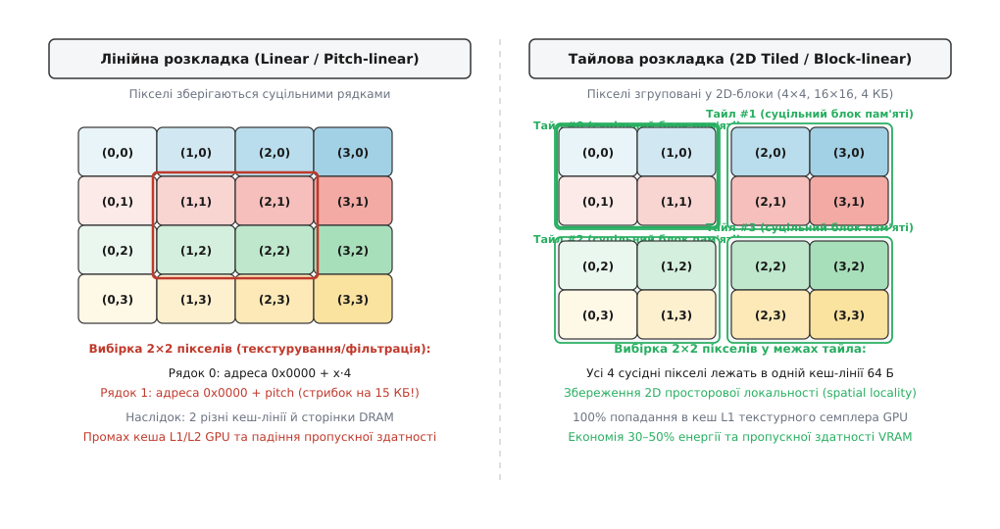
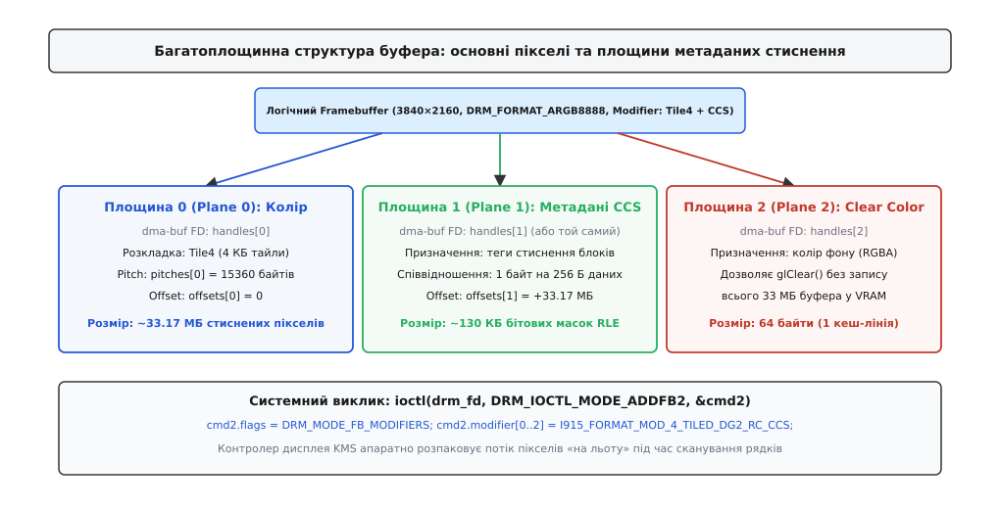
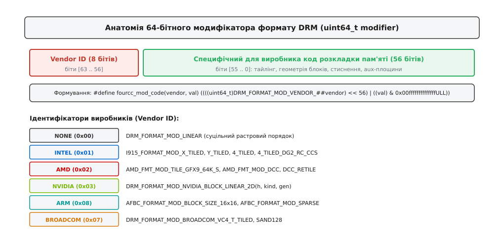
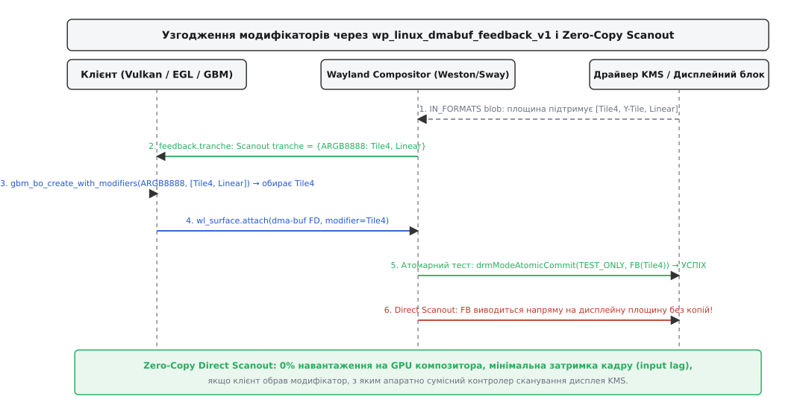

# Формати й модифікатори буфера: fourcc і розкладка пам'яті

<preknowlist>
- [DRM і KMS: модель графічного пристрою в ядрі](topic:sys-unix/drm-kms-object-model) — графічний чип як символьний пристрій, вузли керування та площини KMS.
- [dma-buf: спільний буфер між драйверами](topic:sys-unix/dma-buf) — механізм передачі фізичної пам'яті через файлові дескриптори між різними пристроями.
- [GEM: об'єкти пам'яті графічного чипа](topic:sys-unix/gem-buffer-objects) — виділення та життєвий цикл графічних буферів у відеопам'яті та системному ОЗП.
- [Керівний канал до драйвера: ioctl](topic:sys-unix/ioctl-interface) — передача структур конфігурації між простором користувача та ядром.
- [Конвеєр відображення DRM KMS](topic:sys-unix/drm-buffers-formats-and-prime) — площини (Planes), CRTC, кодери та конектори в апаратному виведенні кадру.
- [dma-fence і sync_file](topic:sys-unix/dma-fence-sync) — асинхронна синхронізація черг рендерингу та сканування.
</preknowlist>

Сучасна тривимірна гра або відеопрогравач генерує 4K-кадр із роздільністю 3840×2160 пікселів у форматі ARGB8888. Кожен окремий піксель займає 4 байти, а весь нестиснений масив кадру вимагає понад 33 мегабайти пам'яті. Графічний процесор (GPU) рендерить цей кадр за допомогою Vulkan або OpenGL, передає його віконному композитору Wayland через дескриптор [dma-buf](topic:sys-unix/dma-buf), а композитор віддає буфер дисплейному контролеру ядра DRM KMS для сканування на монітор із частотою 120 Гц.

Якщо передати дисплейному контролеру лише ширину 3840, висоту 2160, крок рядка 15360 байтів та код формату `DRM_FORMAT_ARGB8888`, екран замість чіткого зображення покриється діагональними розірваними смугами, мозаїкою з битих пікселів або контролер дисплея зазнає апаратного скидання.

Причина полягає в тому, що графічний процесор ніколи не зберігає пікселі послідовними рядками. Задля збереження просторової локальності та економії пропускної здатності шини GPU рендерить зображення у двовимірні блоки (тайли) розміром 4 КБ або 64 КБ і стискає їх апаратними алгоритмами без втрат (Intel CCS, AMD DCC, Arm AFBC). Контролер дисплея, очікуючи лінійний растровий порядок байтів, зчитує ці тайли та блоки метаданих як випадковий шум.

Щоб різні апаратні блоки — 3D-прискорювач, дисплейний процесор, відеодекодер V4L2 та композитор — могли однозначно домовлятися про фізичну геометрію байтів у спільній пам'яті, у графічній підсистемі Linux було впроваджено концепцію **модифікаторів формату DRM** (англ. *DRM Format Modifiers*).

Історію переходу від негласних домовленостей ранніх X-серверів до єдиного 64-бітного стандарту викладено у вставці [Від неявного тайлінгу DRI2 до явних 64-бітних модифікаторів DRM](topic:sys-unix/drm-format-modifiers/hist-modifiers-revolution.md).

## Піксельні формати DRM FourCC: кодування кольору та геометрія площин

Кожен графічний буфер у Linux має дві фундаментальні характеристики: **формат пікселів** (що означають біти) та **модифікатор розкладки** (де саме ці біти фізично лежать у пам'яті).

Формат пікселів описує колірну модель, кількість бітів на канал, наявність альфа-каналу, субдискретизацію колірності та кількість логічних колірних площин. У підсистемі Direct Rendering Manager (DRM) ядра Linux формати позначаються чотирисимвольними кодами **FourCC** (англ. *Four Character Code*, від лат. *quattuor* — чотири та грец. *charaktēr* — знак).

FourCC пакується у 32-бітне беззнакове число за правилом молодшого порядку байтів (Little-Endian):

```
fourcc_code('A', 'R', '2', '4')
= ('A' << 0) | ('R' << 8) | ('2' << 16) | ('4' << 24)    [визначення fourcc_code: пакування байтів]
= 0x41 | (0x52 << 8) | (0x32 << 16) | (0x34 << 24)       [ASCII-коди символів у шістнадцятковому вигляді]
= 0x34325241                                             [побітове складання у 32-бітне ціле Little-Endian]
```

### Анатомія та класифікація форматів

Усі формати DRM FourCC, визначені у системному заголовковому файлі `<drm/drm_fourcc.h>`, поділяються на дві великі категорії:

1. **Паковані формати RGB (Packed Formats):** усі колірні компоненти пікселя (червоний, зелений, синій та прозорість) зберігаються разом в одному машинному слові.
   * `DRM_FORMAT_XRGB8888`: 32-бітне слово, де 24 біти відведено під колір (по 8 бітів на R, G, B), а старші 8 бітів X ігноруються. Це базовий формат більшості стільниць Linux.
   * `DRM_FORMAT_ARGB8888`: аналогічний до XRGB8888, але канал A містить 8-бітне значення прозорості (альфа).
   * `DRM_FORMAT_RGB565`: 16-бітний формат для пристроїв із низьким енергоспоживанням (5 бітів R, 6 бітів G, 5 бітів B).
   * `DRM_FORMAT_XBGR2101010` та `DRM_FORMAT_ABGR2101010`: 10-бітні формати високого динамічного діапазону (HDR / 10-bit Deep Color), де на кожен колірний канал виділено 10 бітів, а 2 біти займає альфа або вирівнювання.

2. **Планарні та напівпланарні формати YUV (Planar & Semi-planar Formats):** застосовуються у відеокамерах, відеоплеєрах, V4L2 та апаратних кодеках (VA-API). Вони розділяють яскравість (Luma, `Y`) та колірність (Chroma, `U`/`V`), застосовуючи просторову субдискретизацію (наприклад, 4:2:0, де один блок колірності 2×2 пікселі припадає на чотири точки яскравості).
   * `DRM_FORMAT_YUV420`: повністю планарний формат із трьома окремими площинами (Plane 0: Y розміром W×H, Plane 1: U розміром W/2×H/2, Plane 2: V розміром W/2×H/2).
   * `DRM_FORMAT_NV12`: напівпланарний формат із двома площинами (Plane 0: повна площина Y, Plane 1: перемежовані байти U та V у єдиному масиві W×H/2). NV12 є де-факто стандартом апаратного декодування H.264, HEVC та AV1 у Linux.
   * `DRM_FORMAT_P010`: напівпланарний 10-бітний формат для HDR-відео, де кожен компонент займає 16-бітне слово з 6 бітами нульового доповнення.

Повний перелік форматів, констант і макросів зібрано в довіднику [Інтерфейс модифікаторів DRM: FourCC, UAPI ядра, GBM та Wayland Feedback](topic:sys-unix/drm-format-modifiers/api-drm-modifiers-ref.md).

### Пастка порядку байтів у пам'яті

Найменування форматів у DRM FourCC описує позиції бітів у **регістрі процесора**, коли 32-бітне слово вже прочитане з пам'яті у порядку Little-Endian.

Для формату `DRM_FORMAT_ARGB8888` бітова розкладка у 32-бітному цілому числі виглядає як `[A:31..24, R:23..16, G:15..8, B:7..0]`. Проте у фізичній пам'яті за зростанням адрес байти розміщуються навпаки:
* Байт за адресою `ptr + 0`: компонент Blue (B)
* Байт за адресою `ptr + 1`: компонент Green (G)
* Байт за адресою `ptr + 2`: компонент Red (R)
* Байт за адресою `ptr + 3`: компонент Alpha (A)

Саме тому той самий масив байтів, який ядро DRM називає `ARGB8888`, графічна бібліотека Vulkan позначає як `VK_FORMAT_B8G8R8A8_UNORM`, а бібліотека OpenGL — як `GL_BGRA_EXT`.

Проте знання FourCC дає відповідь лише на питання «як інтерпретувати біти пікселя». Воно нічого не повідомляє про те, де саме у пам'яті розташовано сусідній піксель за координатами `(x, y + 1)`.

## Проблема розкладки пам'яті: чому лінійний буфер вбиває продуктивність GPU

Найпростіший спосіб розмістити двовимірне зображення у пам'яті — лінійна розкладка (англ. *linear* або *pitch-linear*). У ній пікселі записуються підряд горизонтальними рядками: рядок 0, рядок 1, рядок 2. Відстань у байтах між початком одного рядка та початком наступного називається кроком рядка (англ. *stride* або *pitch*):

```
адреса(x, y) = базовий_покажчик + (y · stride) + (x · байтів_на_піксель)
```

Лінійна розкладка ідеально підходить для електронно-променевих трубок або найпростіших дисплейних контролерів, які сканують екран суворо зліва направо та зверху вниз. Проте для сучасного графічного процесора лінійне розташування пам'яті є катастрофою продуктивності.

### Фізика пам'яті DRAM та кешів GPU

Динамічна оперативна пам'ять (DRAM, чи то DDR5 на системній платі, чи GDDR6/HBM3 у відеокарті) організована у вигляді банків та рядків сторінок (англ. *DRAM rows* розміром від 1 КБ до 8 КБ). Щоб прочитати бодай один байт, контролер пам'яті мусить виконати операцію активації рядка (англ. *Row Activate*), переписавши його у внутрішній буфер рядка (англ. *Row Buffer*). 

Якщо наступне звернення відбувається до того самого рядка (англ. *Row Hit*), затримка становить лічені наносекунди. Якщо ж наступне звернення йде в інший рядок того самого банку (англ. *Row Conflict* або *Page Miss*), контролер змушений спочатку закрити попередній рядок (команда `Precharge`), знову виконати `Activate` і лише потім прочитати дані.

При виконанні графічних операцій (білінійна фільтрація текстур, растеризація трикутників, рендеринг шрифтів, розмиття за Гаусом, згладжування MSAA) графічний процесор оперує не ізольованими горизонтальними лініями, а **двовимірними блоками** (наприклад, фрагментами 2×2 або 4×4 пікселі).



*Лінійна розкладка змушує контролер пам'яті стрибати між віддаленими сторінками DRAM для сусідніх по вертикалі пікселів; 2D-тайлінг групує просторові блоки в межах однієї кеш-лінії.*

Розглянемо вибірку блоку 2×2 пікселі у 4K-зображенні (`stride = 15360` байтів):
1. **У лінійній пам'яті:** пікселі `(0, 0)` та `(1, 0)` лежать поруч за адресою `0x0000`. Але пікселі `(0, 1)` та `(1, 1)` лежать за адресою `0x0000 + 15360` (через 15 кілобайтів!). Це гарантовано інша кеш-лінія L1/L2 GPU і майже завжди інша сторінка DRAM. Звернення до чотирьох сусідніх пікселів породжує дві незалежні транзакції шини пам'яті з промахом кеша.
2. **У тайловій пам'яті:** пікселі `(0, 0)`, `(1, 0)`, `(0, 1)` та `(1, 1)` фізично запаковані в один неперервний блок розміром 64 байти (одна кеш-лінія). Одне звернення до шини завантажує в кеш текстурного семплера весь двовимірний фрагмент одразу.

Втрата просторової локальності (англ. *spatial locality*) у лінійному буфері знижує реальну пропускну здатність пам'яті на операціях текстурування та блендингу на 50–70% і призводить до колосального перевитрачання енергії на постійне перезаряджання банків DRAM.

### Архітектура тайлінгу (Tiled / Block-Linear)

Щоб ліквідувати це вузьке місце, усі виробники GPU групують пікселі у двовимірні блоки — **тайли** (англ. *tiles*, від лат. *tegula* — черепиця).

Тайлінг будується за ієрархічним принципом:
* **Мікро-тайли (Micro-tiles):** маленькі блоки розміром 4×4 або 8×8 пікселів (відповідають одній кеш-лінії 64 або 128 байтів). Усередині мікро-тайла пікселі впорядковуються за фрактальними кривими заповнення простору — Z-порядком Мортона (англ. *Morton Z-order curve*) або кривою Гільберта. Завдяки цьому крок у будь-якому напрямку (вгору, вниз, по діагоналі) залишається мінімальним за адресною відстанню.

#### Математика перемішування бітів кривої Мортона

Впорядкування за Z-кривою Мортона обчислюється шляхом бітового перемежування (англ. *bit interleaving*) двійкових координат пікселя `x` та `y`. Якщо координати точки мають двійкове представлення `x = (x₃ x₂ x₁ x₀)₂` та `y = (y₃ y₂ y₁ y₀)₂`, то зміщення пікселя всередині тайла `z` отримується почерговим розташуванням бітів `y` та `x`:

```
z = (y₃ x₃ y₂ x₂ y₁ x₁ y₀ x₀)₂
```

Завдяки такій структурі будь-який квадрат 2×2 пікселі (біти `x₀` та `y₀`) завжди займає 4 послідовні адреси пам'яті `[0..3]`, квадрат 4×4 пікселі займає 16 послідовних адрес `[0..15]`, а блок 8×8 — рівно одну кеш-лінію з 64 байтів. Коли текстурний процесор GPU виконує фільтрацію сусідніх точок, апаратний блок декодування адрес миттєво обчислює адресу пам'яті через таблиці зсувів без операцій множення на крок рядка `stride`.

* **Макро-тайли (Macro-tiles):** блоки розміром 4 КБ або 64 КБ (відповідають сторінці MMU або сторінці DRAM). Макро-тайли рівномірно чергуються між різними фізичними каналами пам'яті та банками GPU, забезпечуючи паралельну роботу всіх контролерів шини. Наприклад, в архітектурі AMD RDNA адреси макро-тайлів піддаються операції XOR над вищими бітами сторінки, що унеможливлює ситуацію, коли всі графічні ядра одночасно звертаються до одного фізичного банку пам'яті (Bank Conflict).

Кожен виробник розробляє власні специфічні розкладки:
* **Intel X-Tiling:** розмір тайла 512×8 байтів (4096 байтів). Оптимізовано для сканування рядків старими дисплейними блоками.
* **Intel Y-Tiling:** розмір тайла 128×32 байти (4096 байтів). Значно вища 2D-локальність для 3D-конвеєра (покоління Gen6–Gen11).
* **Intel Tile4:** сучасний тайлінг поколінь DG2 (Arc) та Meteor Lake. Тайл 4 КБ розбитий на суб-тайли по 64 байти з упорядкуванням за схемою шахівниці для оптимізації роботи кешів L3 (LLC).
* **AMD GFX9/GFX10 64K Tiling:** архітектури Vega та RDNA оперують макро-тайлами по 64 КБ (`AMD_FMT_MOD_TILE_GFX9_64K_S` для шейдерів та `64K_D` для дисплея), які перемішують адресні біти за допомогою операції XOR над адресами каналів і конвеєрів (Pipe XOR).
* **NVIDIA Block-Linear:** пам'ять розбивається на базові блоки GOB (англ. *Group of Bytes* розміром 512 байтів: 64 байти завширшки на 8 ліній заввишки). Блоки GOB складаються у супер-тайли заввишки 1, 2, 4, 8, 16 або 32 GOB.
* **Arm Mali:** кадровий буфер ділиться на фіксовані блоки 16×16 пікселів.

Проте сучасні графічні процесори пішли ще далі: тайловані блоки почали стискати просто на льоту.

## Апаратне стиснення без втрат та допоміжні площини (Auxiliary Planes)

Зростання роздільності моніторів до 4K (8.3 мегапікселя) та 8K (33.2 мегапікселя) із частотою оновлення 120–240 Гц створило критичний дефіцит пропускної здатності.

**Розрахунок навантаження на шину пам'яті лише для виведення 4K кадру на екран:**

```
розмір кадру  = 3840 · 2160 · 4 Б       = 33.1776 МБ
частота       = 120 Гц
трафік читання= 33.1776 МБ · 120        = 3.98 ГБ/с
трафік запису = рендеринг GPU 120 fps   = 3.98 ГБ/с
сумарний потік= 3.98 · 2                = 7.96 ГБ/с
```

Вісім гігабайтів за секунду витрачається виключно на транспортування фінальних пікселів між відеопам'яттю та екраном, не враховуючи накладання текстур, буфера глибини (Z-Buffer) та проміжних проходів пост-обробки.

Щоб подолати цей бар'єр, виробники створили апаратні блоки стиснення кадрового буфера без втрат (англ. *Lossless Framebuffer Compression*).

### Механізми стиснення: Intel CCS, AMD DCC та Arm AFBC

Алгоритми стиснення в GPU використовують надлишковість візуальної інформації (великі області одного кольору на робочому столі, градієнти, плоскі полігони в іграх):

1. **Intel CCS (Color Control Surface / Compression Control Surface):**
   * Буфер розбивається на блоки даних. Для кожних 256 байтів піксельних даних виділяється 1 байт у спеціальній додатковій області — поверхні керування кольором (CCS).
   * Байт CCS кодує режим стиснення: чи збережено блок у повному обсязі, чи стиснено за алгоритмом RLE/дельта-кодування, чи блок повністю одноколірний.
   * **Fast Clear (швидке очищення):** коли гра викликає `glClear()`, GPU не записує гігабайти нулів у VRAM. Він лише позначає всі байти в CCS-поверхні як «очищені» і записує колір фону в окрему 64-байтну комірку (Clear Color). При читанні апаратний блок дисплея бачить біт очищення і миттєво підставляє колір фону без звернення до основного буфера.

2. **AMD DCC (Delta Color Compression):**
   * Архітектури Radeon RDNA використовують окрему поверхню метаданих DCC. Блоки пікселів стискаються за дельта-алгоритмом (зберігається базовий колір блоку та короткі побітові відхилення для кожного пікселя). Якщо дельти нульові, блок вважається константним.
   * DCC скорочує використання смуги пропускання пам'яті в іграх на 30–50%.

3. **Arm AFBC (Arm FrameBuffer Compression):**
   * Корпорація Arm створила формат AFBC для мобільних систем Mali. Зображення розбивається на тайли 16×16 пікселів.
   * На початку буфера розміщується заголовок (AFBC Header), де для кожного тайла записано 16-байтний дескриптор: зміщення стисненого тіла тайла у пам'яті, його розмір та прапорці колірної трансформації (наприклад, оборотне перетворення RGB у YUV для покращення коефіцієнта стиснення).

### Перетворення логічного буфера на багатоплощинну структуру

Поява стиснення призвела до того, що **один логічний кадровий буфер став фізично багатоплощинним**.



*Логічний буфер кадру ARGB8888 складається з трьох фізичних поверхонь: основних тайлованих пікселів, площини метаданих CCS та комірки Clear Color.*

Для відображення одного зображення `DRM_FORMAT_ARGB8888` зі стисненням Intel CCS ядро та драйвер повинні оперувати трьома площинами:
* **Площина 0 (Primary Data Plane):** стиснений масив пікселів у розкладці Tile4 (наприклад, зміщення `offset = 0`, `pitch = 15360`).
* **Площина 1 (Auxiliary CCS Plane):** поверхня метаданих стиснення (зміщення `offset = 34816000`, `pitch = 256`).
* **Площина 2 (Clear Color Plane):** 64 байти метаданих із числовим значенням кольору швидкого очищення (RGBA).

Якщо програма передасть такий буфер дисплейному контролеру як простий лінійний масив, контролер покаже на екрані нерозпаковані стиснені блоки, а область CCS-метаданих з'явиться внизу екрана як смуга хаотичних точок.

Саме для формалізації цієї складної структури було розроблено 64-бітні модифікатори форматів.

## 64-бітні модифікатори DRM: структура, простір імен та семантика

Модифікатор формату DRM — це 64-бітне беззнакове число `uint64_t modifier`, яке повністю й однозначно описує внутрішню фізичну розкладку пам'яті, алгоритм тайлінгу, геометрію та параметри стиснення буфера.



*Старші 8 бітів ідентифікують виробника (Vendor ID), а молодші 56 бітів повністю виділені під апаратний опис розкладки пам'яті.*

### Анатомія 64-бітного значення

Модифікатор будується за допомогою макроса `fourcc_mod_code(vendor, val)`:

```
+------------------------+----------------------------------------------------+
| Vendor ID (біти 63..56)| Код розкладки та параметри стиснення (біти 55..0)  |
+------------------------+----------------------------------------------------+
```

1. **Vendor ID (старші 8 бітів, `[63:56]`):** числовий ідентифікатор компанії, що розробила розкладку. Це унеможливлює просторові колізії.
   * `0x00`: `DRM_FORMAT_MOD_VENDOR_NONE` (стандартизовані універсальні модифікатори)
   * `0x01`: `DRM_FORMAT_MOD_VENDOR_INTEL`
   * `0x02`: `DRM_FORMAT_MOD_VENDOR_AMD`
   * `0x03`: `DRM_FORMAT_MOD_VENDOR_NVIDIA`
   * `0x04`: `DRM_FORMAT_MOD_VENDOR_SAMSUNG`
   * `0x05`: `DRM_FORMAT_MOD_VENDOR_QCOM` (Qualcomm)
   * `0x07`: `DRM_FORMAT_MOD_VENDOR_BROADCOM`
   * `0x08`: `DRM_FORMAT_MOD_VENDOR_ARM`

2. **Драйверо-специфічний опис (молодші 56 бітів, `[55:0]`):** структура цих бітів визначається кожним виробником індивідуально. Вони кодують:
   * Тип тайлінгу (Linear, Tile4, Y-Tile, GFX9 64K, Block-Linear).
   * Наявність та версію допоміжної площини метаданих (CCS, DCC, AFBC).
   * Режим стиснення (Render Compression, Media Compression для відеодекодерів).
   * Наявність площини швидкого очищення (Clear Color).

### Універсальні стандартизовані модифікатори

У просторі `DRM_FORMAT_MOD_VENDOR_NONE` зафіксовано два фундаментальні значення:

* **`DRM_FORMAT_MOD_LINEAR` (значення `0ULL`):**
  Гарантує, що буфер зберігається у строгому растровому порядку рядків без будь-якого тайлінгу, перемішування бітів чи стиснення. Цей модифікатор є універсальним спільним знаменником: його здатні прочитати будь-який дисплейний контролер, програмний рендерер (Pixman, CPU-програмний стек) та виклик `mmap()` центрального процесора.
* **`DRM_FORMAT_MOD_INVALID` (значення `0x00ffffffffffffffULL`):**
  Слугує маркером «модифікатор не вказано або невідомий». Використовується застарілим програмним забезпеченням як запит до драйвера обрати неявну розкладку на власний розсуд.

## Інтерфейс ядра DRM/KMS: ADDFB2 та властивість IN_FORMATS

Щоб зареєструвати кадровий буфер у підсистемі ядра DRM KMS (англ. *Kernel Mode Setting*), простір користувача використовує спеціалізований системний виклик `ioctl`.

### Еволюція системного виклику: від ADDFB до ADDFB2

Історично в ядрі Linux існував системний виклик `DRM_IOCTL_MODE_ADDFB`. Він приймав лише один числовий хендл пам'яті, ширину, висоту, глибину кольору та крок рядка. `ADDFB` не знав про FourCC, не підтримував багатоплощинні формати YUV і принципово не міг працювати з тайлінгом.

Йому на зміну прийшов розширений виклик `DRM_IOCTL_MODE_ADDFB2` зі структурою `struct drm_mode_fb_cmd2`:

```
struct drm_mode_fb_cmd2 {
    uint32_t fb_id;          /* [out] Призначений ядром ідентифікатор кадрового буфера */
    uint32_t width;          /* Ширина в пікселях */
    uint32_t height;         /* Висота в пікселях */
    uint32_t pixel_format;   /* 32-бітний FourCC (наприклад, DRM_FORMAT_ARGB8888) */
    uint32_t flags;          /* DRM_MODE_FB_MODIFIERS для ввімкнення поля modifier */

    uint32_t handles[4];     /* GEM-хендли пам'яті для кожної площини */
    uint32_t pitches[4];     /* Крок (stride) у байтах для кожної площини */
    uint32_t offsets[4];     /* Байтне зміщення площини від початку GEM-об'єкта */
    uint64_t modifier[4];    /* 64-бітні модифікатори формату для кожної площини */
};
```

Якщо у полі `flags` встановлено біт `DRM_MODE_FB_MODIFIERS`, ядро зчитує масив `modifier[4]`. Драйвер перевіряє, чи підтримує апаратний контролер саме таку комбінацію FourCC та модифікатора, після чого конфігурує дисплейний блок на автоматичний апаратний детайлінг та декомпресію під час сканування рядків.

### Властивість площини IN_FORMATS

Як віконний композитор дізнається, які саме модифікатори підтримує конкретна апаратна площина дисплея?

У моделі атомарного KMS (Atomic KMS) кожна площина дисплея (`struct drm_plane`) експортує незмінну властивість із назвою **`IN_FORMATS`**. Ця властивість містить ідентифікатор бінарного блобу `struct drm_format_modifier_blob`.

Структура блобу містить:
1. Масив 32-бітних кодів `uint32_t formats[]` — усі формати FourCC, які розуміє площина.
2. Масив структур `struct drm_format_modifier modifiers[]`. Кожен елемент містить 64-бітне значення модифікатора та 64-бітну бітову маску `formats`. Якщо біт `N` у масці встановлено в `1`, це означає, що даний модифікатор підтримується для формату `formats[N]`.

Композитор зчитує блоб `IN_FORMATS`, парсить перелік пар «формат-модифікатор» і використовує цей список для конфігурації графічних клієнтів.

Практичну реалізацію роботи з GBM, експорту дескрипторів та реєстрації через `drmModeAddFB2WithModifiers()` наведено у вставці [Створення тайлованого буфера GBM, експорт dma-buf та імпорт у KMS FB2](topic:sys-unix/drm-format-modifiers/proj-dmabuf-modifier-pipeline.md).

## Багатопристроєве узгодження розкладки: Wayland, Mesa та Zero-Copy Scanout

У типовій графічній сесії Linux взаємодіють щонайменше чотири незалежні підсистеми:

```
+-----------------------------------------------------------------------------+
| Клієнт (Гра / Відеоплеєр: Vulkan / EGL / VA-API / Mesa)                     |
+-----------------------------------------------------------------------------+
                                       |
                                       | 1. Запит буфера з модифікаторами
                                       v
+-----------------------------------------------------------------------------+
| Бібліотека виділення буферів GPU (Generic Buffer Management - GBM)          |
+-----------------------------------------------------------------------------+
                                       |
                                       | 2. Передача dma-buf FD + Modifier
                                       v
+-----------------------------------------------------------------------------+
| Віконний композитор (Wayland: Weston / Mutter / KWin / Sway / wlroots)      |
+-----------------------------------------------------------------------------+
                                       |
                                       | 3. Атомарний вивід (Zero-Copy)
                                       v
+-----------------------------------------------------------------------------+
| Дисплейний контролер ядра Linux (DRM KMS / CRTC / Plane)                    |
+-----------------------------------------------------------------------------+
```

Виникає фундаментальний конфлікт інтересів:
* **Графічний процесор 3D (Mesa/Vulkan)** прагне виділити буфер із найагресивнішим тайлінгом і стисненням (наприклад, `I915_FORMAT_MOD_4_TILED_DG2_RC_CCS`), щоб заощадити 50% енергії та отримати максимальний FPS.
* **Дисплейний контролер (KMS Plane)** на зовнішньому порту DisplayPort/HDMI може виявитися старішим апаратним блоком, який підтримує максимум `I915_FORMAT_MOD_X_TILED` або вимагає суворо `DRM_FORMAT_MOD_LINEAR`.

Якщо клієнт самостійно виділить буфер із модифікатором, який не підтримується контролером дисплея, композитор не зможе вивести його на екран напряму. Йому доведеться імпортувати буфер клієнта як текстуру у власний 3D-конвеєр, намалювати його на власному кадровому буфері й лише потім показати на моніторі. Це створює додаткове копіювання (композитинг), витрачає ресурси GPU та збільшує затримку введення (Input Lag).

### Протокол узгодження Wayland: wp_linux_dmabuf_feedback_v1

Для автоматичного пошуку оптимального модифікатора між усіма учасниками конвеєра консорціум Wayland розробив розширення протоколу **`wp_linux_dmabuf_feedback_v1`** (розвиток базового `zwp_linux_dmabuf_v1`).



*Композитор надсилає клієнту транші пріоритетів: клієнт обирає модифікатор, що забезпечує прямий апаратний вивід без проміжного композитингу.*

Робота протоколу складається з п'яти послідовних кроків:

1. **Опитування заліза:** композитор зчитує властивість `IN_FORMATS` первинної площини KMS монітора, на якому розташоване вікно клієнта.
2. **Формування траншів зворотного зв'язку (Feedback Tranches):**
   * **Транш прямого сканування (Scanout Tranche):** містить перелік модифікаторів, які підтримуються апаратною площиною дисплея (позначається прапорцем `SCANOUT`).
   * **Резервний транш рендерингу (Render Tranche):** містить модифікатори, які підтримуються 3D-рушієм композитора для звичайного компонування.
3. **Виділення буфера клієнтом:** клієнт (через EGL, Mesa WSI або Vulkan) отримує транші від композитора. Якщо вікно повноекранне, клієнт обирає перший доступний модифікатор із траншу `SCANOUT` (наприклад, Intel Tile4).
4. **Передавання dma-buf:** клієнт створює буфер через `gbm_bo_create_with_modifiers2()`, експортує дескриптори `dma-buf` для кожної площини та передає їх композитору повідомленням `zwp_linux_buffer_params_v1.create_immed()` разом із 64-бітним модифікатором.
5. **Zero-Copy Direct Scanout:** композитор отримує буфер і перевіряє можливість прямого виведення через тестовий виклик `drmModeAtomicCommit(..., DRM_MODE_ATOMIC_TEST_ONLY)`. Оскільки модифікатор було узгоджено заздалегідь, ядро повертає успіх. Композитор монтує буфер клієнта безпосередньо на площину CRTC монітора.

У результаті досягається **Zero-Copy Direct Scanout**: жоден байт пам'яті не копіюється, GPU композитора повністю спить, а гра виводиться з нульовою затримкою та максимальною швидкістю.

## Модифікатори у Vulkan: розширення VK_EXT_image_drm_format_modifier

Сучасні тривимірні ігри та рушії під Linux працюють через графічний API Vulkan. Щоб Vulkan-застосунок міг створити зображення (`VkImage`) із точним контролем розкладки пам'яті та експортувати його у Wayland, консорціум Khronos стандартизував розширення **`VK_EXT_image_drm_format_modifier`**.

Механізм роботи у Vulkan складається з трьох операцій:
1. **Запит списку властивостей:** викликом `vkGetPhysicalDeviceFormatProperties2()` програма перевіряє, які модифікатори DRM підтримує драйвер GPU для цільового `VkFormat`.
2. **Створення зображення зі списком модифікаторів:** структура `VkImageCreateInfo` доповнюється ланцюжком `pNext`, куди передається структура `VkImageDrmFormatModifierListCreateInfoEXT`. У ній вказується масив модифікаторів, отриманих від Wayland-композитора. Драйвер обирає найкращий модифікатор під час виклику `vkCreateImage()`.
3. **Отримання фізичних параметрів:** після виділення пам'яті виклик `vkGetImageDrmFormatModifierPropertiesEXT()` повертає остаточно обраний 64-бітний модифікатор, кількість площин пам'яті та їхні зміщення. Програма прив'язує виділену пам'ять (`VkDeviceMemory`) та експортує її у файловий дескриптор `dma-buf` за допомогою розширення `VK_KHR_external_memory_fd`.

## Апаратне відеодекодування та напівпланарний YUV (V4L2 / VA-API)

Окремим важливим доменом використання модифікаторів є конвеєр відтворення відео. Апаратні відеодекодери (Intel QuickSync, AMD VCN, NVIDIA NVDEC, ARM VPU) записують декодовані кадри у напівпланарний формат `DRM_FORMAT_NV12` або 10-бітний `DRM_FORMAT_P010`.

У традиційній застарілій схемі відеоплеєр був змушений завантажувати кадр NV12 як дві окремі текстури в шейдер GPU, виконувати перетворення колірного простору YUV у RGB матричним множенням і малювати прямокутник у буфер вікна.

Завдяки модифікаторам та багатоплощинному KMS конвеєр стає повністю апаратним:
1. Драйвер VA-API або підсистема ядра [V4L2](topic:sys-unix/media-controller-graph) декодує відеопотік безпосередньо у буфер NV12 з модифікатором апаратного тайлінгу (наприклад, Intel Tile4 або Arm AFBC).
2. Дескриптор `dma-buf` передається композитору Wayland із вказівкою двох площин: `Plane 0` (Y) та `Plane 1` (перемежовані UV) з відповідними зміщеннями та кроками.
3. Композитор перенаправляє буфер на апаратну **оверлейну площину** (англ. *Overlay Plane*) контролера дисплея KMS.
4. Контролер дисплея самостійно виконує детайлінг, інтерполяцію колірності 4:2:0 та перетворення YUV→RGB на апаратних цифрових фільтрах сканування в реальному часі. Центральний процесор і 3D-ядра GPU не задіюються взагалі, що зменшує споживання енергії під час перегляду відео на порядок.

## Гетерогенні системи та PRIME: передача буферів між двома GPU

На сучасних ноутбуках із двома відеокартами (інтегрована графіка процесора Intel/AMD + дискретний прискорювач NVIDIA/AMD) модифікатори розв'язують проблему сумісності технології PRIME.

Дискретний GPU малює сцену у власній швидкісній пам'яті VRAM із пропрієтарним тайлінгом (наприклад, NVIDIA Block-Linear або AMD GFX10 64K). Але вихід на екран фізично підключений до інтегрованого відеоядра процесора (Display Engine iGPU). Контролер дисплея iGPU фізично не здатний прочитати закритий тайлінг дискретної карти.

Завдяки явним модифікаторам стек рендерингу функціонує за чітким алгоритмом:
1. Дискретний драйвер зчитує властивість `IN_FORMATS` інтегрованого дисплейного ядра.
2. Якщо спільний апаратний модифікатор відсутній (що зазвичай і трапляється між різними виробниками), дискретний GPU виділяє фінальний спільний буфер кадру з модифікатором `DRM_FORMAT_MOD_LINEAR`.
3. Після завершення 3D-рендерингу дискретний прискорювач виконує швидке апаратне копіювання з детайлінгом (англ. *detiling blit*) зі свого внутрішнього тайлованого буфера у лінійний буфер `dma-buf`.
4. Інтегроване відеоядро імпортує лінійний буфер через `drmModeAddFB2WithModifiers(..., modifier=DRM_FORMAT_MOD_LINEAR)` та сканує його на дисплей без жодних збоїв та артефактів.

## Приклад коду: аналіз та перевірка модифікаторів у просторі користувача

Нижче наведено практичну реалізацію функцій аналізу та декодування модифікаторів DRM FourCC мовами C та C++. Код демонструє вилучення ідентифікатора виробника, визначення типу розкладки та перевірку властивостей стиснення.

:::tabs
```c
/* modifier_inspect.c — декодування та аналіз 64-бітних модифікаторів DRM */
#include <inttypes.h>
#include <stdbool.h>
#include <stdint.h>
#include <stdio.h>
#include <drm_fourcc.h>

/* Отримання назви виробника за 8-бітним ідентифікатором */
const char *drm_modifier_vendor_name(uint8_t vendor)
{
    switch (vendor) {
        case DRM_FORMAT_MOD_VENDOR_NONE:     return "Generic (Standard)";
        case DRM_FORMAT_MOD_VENDOR_INTEL:    return "Intel";
        case DRM_FORMAT_MOD_VENDOR_AMD:      return "AMD";
        case DRM_FORMAT_MOD_VENDOR_NVIDIA:   return "NVIDIA";
        case DRM_FORMAT_MOD_VENDOR_SAMSUNG:  return "Samsung";
        case DRM_FORMAT_MOD_VENDOR_QCOM:     return "Qualcomm";
        case DRM_FORMAT_MOD_VENDOR_VIVANTE:  return "Vivante";
        case DRM_FORMAT_MOD_VENDOR_BROADCOM: return "Broadcom";
        case DRM_FORMAT_MOD_VENDOR_ARM:      return "Arm (AFBC)";
        case DRM_FORMAT_MOD_VENDOR_ALLWINNER:return "Allwinner";
        case DRM_FORMAT_MOD_VENDOR_AMLOGIC:  return "Amlogic";
        default:                             return "Unknown Vendor";
    }
}

/* Декодування опису конкретного модифікатора */
void print_drm_modifier_info(uint64_t modifier)
{
    if (modifier == DRM_FORMAT_MOD_INVALID) {
        printf("Модифікатор: DRM_FORMAT_MOD_INVALID (Неявний вибір драйвером)\n");
        return;
    }

    if (modifier == DRM_FORMAT_MOD_LINEAR) {
        printf("Модифікатор: DRM_FORMAT_MOD_LINEAR (Суцільний растровий порядок рядків, CPU-сумісний)\n");
        return;
    }

    uint8_t vendor = fourcc_mod_get_vendor(modifier);
    uint64_t val = modifier & 0x00ffffffffffffffULL;

    printf("Модифікатор: 0x%016" PRIx64 "\n", modifier);
    printf("  Виробник: %s (ID: 0x%02x)\n", drm_modifier_vendor_name(vendor), vendor);
    printf("  Код конфігурації: 0x%014" PRIx64 "\n", val);

    if (vendor == DRM_FORMAT_MOD_VENDOR_INTEL) {
        switch (modifier) {
            case I915_FORMAT_MOD_X_TILED:
                printf("  Тип розкладки: Intel X-Tiled (Тайли 512x8 байтів, 4 КБ)\n");
                break;
            case I915_FORMAT_MOD_Y_TILED:
                printf("  Тип розкладки: Intel Y-Tiled (Тайли 128x32 байти, 4 КБ, 2D-локальність)\n");
                break;
            case I915_FORMAT_MOD_4_TILED:
                printf("  Тип розкладки: Intel Tile4 (Базовий тайлінг DG2 / Meteor Lake)\n");
                break;
            case I915_FORMAT_MOD_4_TILED_DG2_RC_CCS:
                printf("  Тип розкладки: Intel Tile4 + Render Decompression (Апаратне стиснення CCS)\n");
                break;
            default:
                printf("  Тип розкладки: Intel Специфічний тайлінг/стиснення\n");
                break;
        }
    } else if (vendor == DRM_FORMAT_MOD_VENDOR_ARM) {
        uint64_t block_size = val & 0x0f;
        printf("  Тип розкладки: Arm FrameBuffer Compression (AFBC)\n");
        if (block_size == 1) printf("  Розмір суперблока: 16x16 пікселів\n");
        else if (block_size == 2) printf("  Розмір суперблока: 32x8 пікселів\n");

        if (modifier & AFBC_FORMAT_MOD_YTR)
            printf("  Опція: YTR (Трансформація колірного простору RGB->YUV увімкнена)\n");
        if (modifier & AFBC_FORMAT_MOD_SPARSE)
            printf("  Опція: SPARSE (Підтримка розріджених порожніх блоків)\n");
    }
}
```
```cpp
// modifier_inspect.cpp — об'єктно-орієнтований інспектор модифікаторів C++20
#include <cstdint>
#include <iomanip>
#include <iostream>
#include <string>
#include <string_view>
#include <drm_fourcc.h>

namespace drm {

class FormatModifier {
public:
    constexpr explicit FormatModifier(uint64_t mod = DRM_FORMAT_MOD_INVALID) noexcept
        : modifier_(mod) {}

    [[nodiscard]] constexpr uint64_t raw() const noexcept { return modifier_; }
    [[nodiscard]] constexpr uint8_t vendor_id() const noexcept {
        return static_cast<uint8_t>((modifier_ >> 56) & 0xff);
    }
    [[nodiscard]] constexpr uint64_t value() const noexcept {
        return modifier_ & 0x00ffffffffffffffULL;
    }

    [[nodiscard]] constexpr bool is_linear() const noexcept {
        return modifier_ == DRM_FORMAT_MOD_LINEAR;
    }
    [[nodiscard]] constexpr bool is_invalid() const noexcept {
        return modifier_ == DRM_FORMAT_MOD_INVALID;
    }

    [[nodiscard]] std::string_view vendor_name() const noexcept {
        switch (vendor_id()) {
            case DRM_FORMAT_MOD_VENDOR_NONE:     return "Generic (Standard)";
            case DRM_FORMAT_MOD_VENDOR_INTEL:    return "Intel";
            case DRM_FORMAT_MOD_VENDOR_AMD:      return "AMD";
            case DRM_FORMAT_MOD_VENDOR_NVIDIA:   return "NVIDIA";
            case DRM_FORMAT_MOD_VENDOR_SAMSUNG:  return "Samsung";
            case DRM_FORMAT_MOD_VENDOR_QCOM:     return "Qualcomm";
            case DRM_FORMAT_MOD_VENDOR_VIVANTE:  return "Vivante";
            case DRM_FORMAT_MOD_VENDOR_BROADCOM: return "Broadcom";
            case DRM_FORMAT_MOD_VENDOR_ARM:      return "Arm (AFBC)";
            case DRM_FORMAT_MOD_VENDOR_ALLWINNER:return "Allwinner";
            case DRM_FORMAT_MOD_VENDOR_AMLOGIC:  return "Amlogic";
            default:                             return "Unknown Vendor";
        }
    }

    void dump_info() const {
        if (is_invalid()) {
            std::cout << "Модифікатор: DRM_FORMAT_MOD_INVALID (Неявний вибір драйвером)\n";
            return;
        }
        if (is_linear()) {
            std::cout << "Модифікатор: DRM_FORMAT_MOD_LINEAR (Суцільний растровий порядок рядків, CPU-сумісний)\n";
            return;
        }

        std::cout << "Модифікатор: 0x" << std::hex << std::setw(16) << std::setfill('0')
                  << modifier_ << std::dec << "\n"
                  << "  Виробник: " << vendor_name()
                  << " (ID: 0x" << std::hex << static_cast<int>(vendor_id()) << std::dec << ")\n"
                  << "  Код розкладки: 0x" << std::hex << value() << std::dec << "\n";

        if (vendor_id() == DRM_FORMAT_MOD_VENDOR_INTEL) {
            if (modifier_ == I915_FORMAT_MOD_4_TILED_DG2_RC_CCS) {
                std::cout << "  Опис: Intel Tile4 з апаратним стисненням Render Compression (Arc DG2)\n";
            } else if (modifier_ == I915_FORMAT_MOD_4_TILED) {
                std::cout << "  Опис: Intel Tile4 нестиснений (DG2 / Meteor Lake)\n";
            } else if (modifier_ == I915_FORMAT_MOD_Y_TILED) {
                std::cout << "  Опис: Intel Y-Tiled (Класичний тайлінг 4 КБ Gen6-Gen11)\n";
            }
        } else if (vendor_id() == DRM_FORMAT_MOD_VENDOR_ARM) {
            std::cout << "  Опис: Arm FrameBuffer Compression (AFBC)\n";
            if (modifier_ & AFBC_FORMAT_MOD_YTR) {
                std::cout << "  Опція: YTR (Колірна трансформація простору)\n";
            }
        }
    }

private:
    uint64_t modifier_{DRM_FORMAT_MOD_INVALID};
};

} // namespace drm
```
:::

## Порівняльна таблиця стратегій організації пам'яті кадру

Підсумуємо характеристики трьох фундаментальних підходів до організації кадрового буфера у графічній підсистемі Linux:

| Характеристика | Лінійна розкладка (Linear) | Двовимірний тайлінг (Tiling) | Тайлінг зі стисненням (CCS/DCC/AFBC) |
| :--- | :--- | :--- | :--- |
| **Модифікатор DRM** | `DRM_FORMAT_MOD_LINEAR` | `I915_FORMAT_MOD_4_TILED`, `AMD_FMT_MOD_TILE_GFX9_64K_S` | `I915_FORMAT_MOD_4_TILED_DG2_RC_CCS`, `AFBC_FORMAT_MOD_BLOCK_SIZE_16x16` |
| **Організація пікселів** | Послідовні рядки (Raster row-major) | Блоки 4 КБ / 64 КБ (Morton / Hilbert Z-curve) | Блоки даних + окремі метадані стиснення |
| **Кількість площин у ADDFB2** | 1 (для RGB) або 2–3 (для YUV) | 1 (для RGB) | 2–3 (основні пікселі + метадані + Clear Color) |
| **Прямий доступ CPU (`mmap`)** | Повний, прозорий та ефективний | Потребує апаратного або програмного детайлінгу | Неможливий без повної декомпресії |
| **Ефективність кешу 3D GPU** | Низька (промахи кеша L1/L2 на кожному рядку) | Висока (100% просторова 2D-локальність) | Максимальна (найменший трафік шини VRAM) |
| **Економія пропускної здатності**| 0% (еталонний базовий рівень) | 20–35% завдяки зменшенню промахів DRAM | 40–60% завдяки усуненню надлишкових байтів |
| **Сумісність із дисплеєм** | Універсальна (усі контролери) | Більшість сучасних GPU/KMS площин | Сучасні Display Engine (Intel Gen9+, AMD DCN, Mali DPU) |

Модифікатори форматів DRM завершили еволюцію графічного стека Linux від ізольованих драйверів 1990-х років до високопродуктивної гетерогенної екосистеми. Завдяки явному опису геометрії пам'яті через 64-бітний модифікатор ядро Linux, композитор Wayland та драйвери Mesa здатні направляти потік пікселів безпосередньо між апаратними блоками без жодного зайвого копіювання байтів, забезпечуючи максимальну продуктивність і мінімальне енергоспоживання сучасних комп'ютерів.
