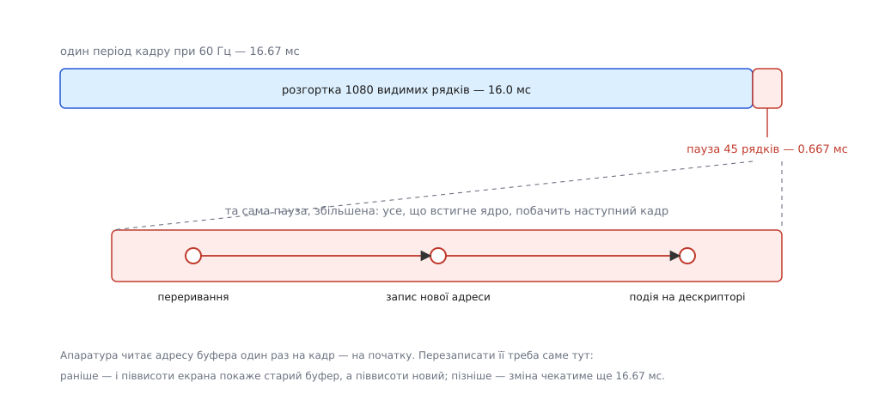
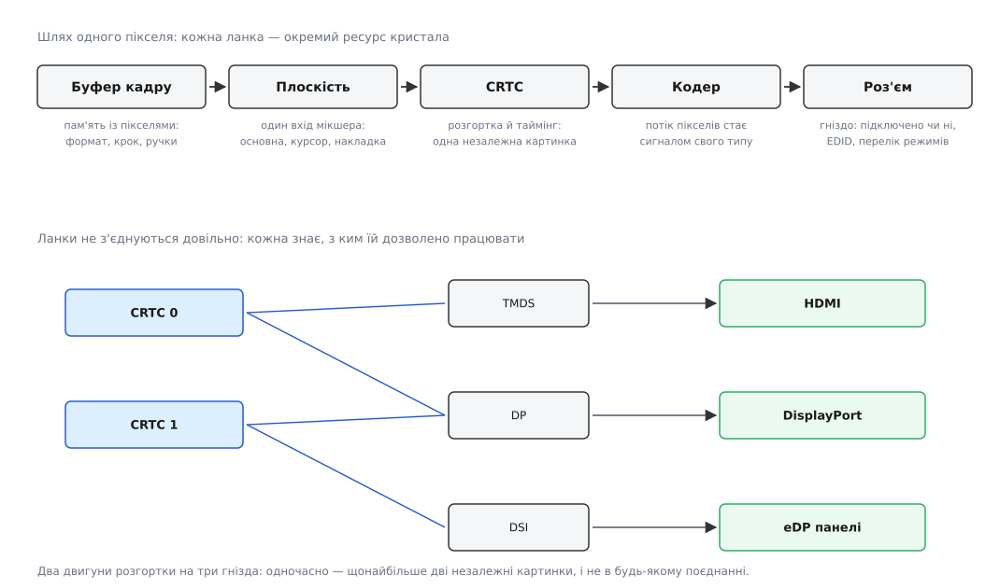
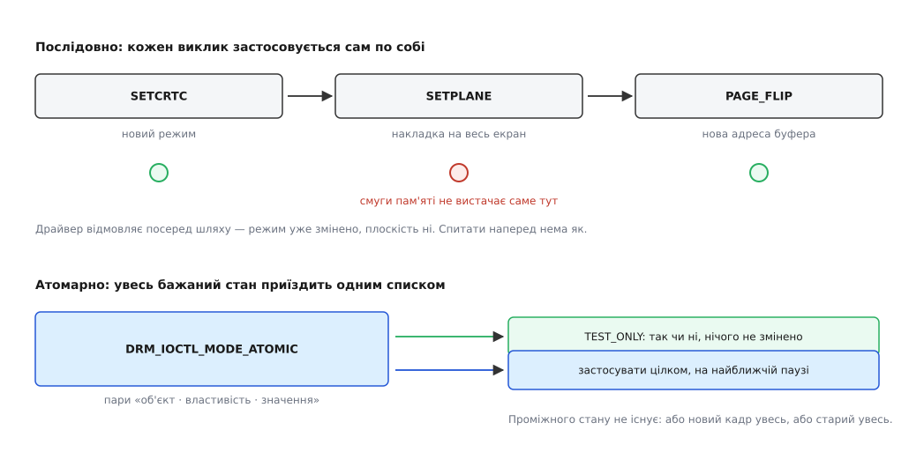

# DRM і KMS: модель графічного пристрою в ядрі

<preknowlist>
- [Файл пристрою: символьний і блоковий](root:sys-unix/device-file-model) — вузол у `/dev`, за яким стоїть драйвер, а не вміст на носії.
- [Файловий дескриптор](root:sys-unix/file-descriptor) — число, за яким процес тримає відкритий об'єкт ядра.
- [Керуючий канал до драйвера: ioctl](root:sys-unix/ioctl-interface) — виклик із номером команди і структурою-аргументом, коли `read`/`write` не передають наміру.
- [mmap: файл і пам'ять як одне](root:sys-unix/mmap-model) — відображення чужої пам'яті у власний адресний простір.
- [Кадровий буфер](root:sf-visual/framebuffer) — прямокутник пам'яті, у якому кожному пікселю екрана відповідає своя комірка.
- [Інтерфейси панелей](root:hw-motion/panel-interfaces) — пікселі течуть у панель безперервним потоком зі своїм тактом і службовими паузами.
- [Подвійна буферизація](root:hw-motion/display-double-buffering) — чому малювати в той самий буфер, який зараз показують, дає розрив кадру.
- [DMA і відображення буферів у ядрі](root:sys-unix/dma-and-buffers) — пристрій читає оперативну пам'ять сам, повз процесор.
- [dma-buf: спільний буфер між драйверами](root:sys-unix/dma-buf) — буфер як дескриптор, який можна віддати іншій підсистемі.
</preknowlist>

До ноутбука під'єднали зовнішній монітор — і за секунду на ньому з'явилося зображення потрібної роздільності. Нічого не перезапускали, ніхто не питав дозволу. Щоб зрозуміти, хто це зробив і чому саме так, варто спершу глянути, що відбувається між пам'яттю й склом у ті хвилини, коли на екрані нерухома картинка.

А відбувається безперервна робота. Монітор нічого не запам'ятовує: він показує те, що йому подають просто зараз, і якщо потік урвати, екран згасне. Тож у графічному чипі є блок, який раз за разом обходить пам'ять із пікселями — рядок за рядком, зліва направо, згори вниз — і виштовхує кожен піксель у дріт у строго відміряний момент. Цей обхід звуть **розгорткою** (англ. *scanout* — «вичитування назовні»). Вона не питає дозволу й не робить пауз на прохання: панель на 60 герц вимагає повного обходу шістдесят разів на секунду, рівно.

Обхід не суцільний. Між останнім видимим рядком одного кадру й першим рядком наступного лишається порожній проміжок — спадок часів електронно-променевої трубки, де променю треба було встигнути повернутися вгору, і збережений у цифрових стандартах як місце для службових даних. Порахуймо, скільки він триває, бо саме з цього числа виростає все інше.

**Скільки часу дає пауза між кадрами.** Візьмімо режим 1920×1080 при 60 кадрах за секунду за стандартом CEA-861:

```
повний кадр (з паузами)  = 2200 × 1125 тактів пікселя
видима частина           = 1920 × 1080
такт пікселя             = 2200 · 1125 · 60      = 148 500 000 Гц = 148.5 МГц
період кадру             = 1 / 60                ≈ 16.67 мс
видимі рядки             = 1080 · 2200 / 148.5e6 ≈ 16.00 мс
пауза між кадрами        =   45 · 2200 / 148.5e6 ≈ 0.667 мс
```

Дві третини мілісекунди на кадр — ось увесь час, коли зображення нікуди не тече й адресу буфера можна перезаписати непомітно. Схибити не можна в жоден бік: зміниш раніше — верхня половина екрана лишиться зі старого буфера, а нижня піде з нового; спізнишся — зміна почекає ще шістнадцять із половиною мілісекунд.



*Апаратура читає адресу буфера один раз на кадр. Уся підміна має вміститися у вузьку смужку між кадрами — тому її робить обробник переривання, а не програма, що «саме зараз згадала».*

## Чому цим займається ядро

З такої вимоги випливає перше й найважче: у регістрів розгортки має бути **один** господар. Не тому, що так акуратніше, а тому, що стан цих регістрів — узгоджений набір: такт пікселя, кількість рядків, тривалості пауз, адреса буфера, формат пікселя. Двоє, що пишуть у них зі свого уявлення про поточний стан, дають не компроміс, а сміття.

Господарів на одну машину набирається кілька. Текстову консоль малює саме ядро. Графічний сервер хоче ту саму панель. Заставка завантажувача теж малює. Повідомлення про паніку ядро мусить показати тоді, коли всі інші вже мертві. Довго ці ролі співіснували незручно: режим виставляв графічний сервер із простору користувача, ядро про нього не знало, і кожне перемикання між консоллю та сервером означало, що два різні шматки коду по черзі програмують один кристал. Сервер, який упав, лишав чип у стані, якого не знав ніхто, — звідси й чорний екран замість тексту помилки.

Тому виставляння режиму переїхало всередину ядра. Ця частина так і зветься — **KMS**, *Kernel Mode Setting*, «виставляння режиму в ядрі»; у Linux вона з'явилася в березні 2009 року, у версії 2.6.29, разом із підтримкою в драйвері `i915`. Живе вона не окремо, а всередині старшої підсистеми **DRM** (*Direct Rendering Manager* — «розпорядник прямого малювання»), яку 1999 року почала писати компанія Precision Insight — за головного розробника був Рікард Файт — щоб кілька програм могли безпечно ділити один графічний чип для тривимірного малювання. [Як виставляння режиму пройшло шлях від відеоBIOS до ядра](root:sys-unix/drm-kms-object-model/hist-from-ums-to-kms.md) — окремий сюжет: чому спроба лишити це в просторі користувача трималася так довго і що довелося доробити в ядрі, перш ніж переїзд став можливим.

## Пристрій, у якого нема чого читати

Графічний чип видно в системі як символьний файл `/dev/dri/card0` зі старшим номером 226. Вузол створює `udev` за подією від ядра, а поруч у `/sys/class/drm/` лежить дерево з описом усього, що на цьому чипі є.

Спокуса вважати, що «все є файлом» буквально, тут нічого не дає: `cat /dev/dri/card0` не покаже картинки, а запис у цей вузол не намалює нічого. Пікселі туди не течуть — вони й так уже в оперативній пам'яті, і копіювати їх крізь дескриптор було б безглуздо. Файл тут потрібен для іншого — і кожна з чотирьох звичних операцій над ним має власний, цілком конкретний сенс.

`open` дає дескриптор і разом із ним **власний простір імен**: усі об'єкти, які процес створить на цьому пристрої, будуть видимі лише через цей дескриптор. `ioctl` — керуючий канал: кожна команда несе структуру з номерами об'єктів і тим, що з ними зробити. `mmap` кладе пам'ять буфера в адресний простір процесу, щоб малювати прямо туди. А `read` — і це та рідкість, коли читання з вузла пристрою справді має сенс — віддає **події**: «підміна буфера відбулася», «почалася пауза між кадрами», кожна з номером кадру й міткою часу. Чекати на них можна звичайним `poll`, разом з усіма іншими джерелами програми.

> 🔧 **Навіщо це.** Композитор робочого столу не має власного годинника й не спить фіксованими проміжками: він тримає дескриптор `card0` у тому самому наборі, що й сокети клієнтів, і прокидається на події з нього. Ритм малювання задає апаратура, а не таймер, — саме тому анімація не «пливе» при завантаженій системі.

## П'ять сутностей, які не можна злити в одну

Тепер про те, чим власне керують ці команди. Спокусливо описати екран однією річчю: «дисплей із роздільністю такою-то». Але тоді неможливо буде виразити половину того, що кристал уміє: показати на двох моніторах різне, вивести відео поверх робочого столу без перемальовування, лишити курсор рухатися, поки решта зображення стоїть. Кожна з цих можливостей — окремий фізичний ресурс, і ресурсів різного типу різна кількість. Тому модель KMS називає п'ять сутностей окремо.

**Буфер кадру** (framebuffer, FB) — не пам'ять сама по собі, а її **опис**: формат пікселя, крок рядка в байтах, зсуви й посилання на об'єкти пам'яті, у яких лежать площини зображення. Пам'ять може бути одна, а описів на неї — кілька.

**Плоскість** (plane) — один вхід апаратного мікшера. Розгортка читає не один буфер, а кілька й змішує їх на льоту, поки дані все одно течуть повз. Часу це майже не коштує, а заощаджує найдорожче: щоб посунути курсор, не треба перемальовувати екран, а щоб показати відео у вікні — не треба щокадру копіювати кадр у робочий стіл. Плоскості бувають основні, курсорні й накладні.

**CRTC** — двигун розгортки: генератор таймінгу плюс той самий мікшер. Назва історична, від *CRT controller*, контролера електронно-променевої трубки, і з нинішнім залізом уже не в'яжеться, але лишилася. Головне число тут — **скільки CRTC має кристал**: стільки й буде одночасних незалежних зображень, ані на одне більше.

**Кодер** (encoder) перетворює потік пікселів на сигнал певного типу — TMDS для HDMI, лінії DisplayPort, DSI для панелі телефона. **Роз'єм** (connector) — фізичне гніздо разом із тим, що в нього ввімкнули: чи є підключення, який кабель, і головне — перелік режимів, які приймає під'єднаний пристрій. Перелік цей не вигаданий: монітор віддає його сам, окремим службовим каналом, у вигляді [структури EDID](root:hw-motion/edid) — кілька сотень байтів, де записані виробник, розміри екрана й таблиця підтримуваних таймінгів. Ядро зчитує їх при під'єднанні й публікує як властивість роз'єму; звідси й береться та «потрібна роздільність», що з'явилася сама.



*Кожна ланка — окремий ресурс кристала, і ланки не з'єднуються довільно. Плоскість знає, до яких CRTC її можна причепити, кодер — з якими CRTC працює. Тому це граф із обмеженнями, а не конвеєр.*

Обмеження — не дрібниця, а суть моделі. У кристала може бути три роз'єми й два CRTC; накладна плоскість буває доступна лише першому CRTC; два кодери можуть ділити один блок і тому не вмикатися одночасно. Простір користувача читає ці обмеження як бітові маски дозволених поєднань і мусить із них скласти працездатну конфігурацію сам.

## Об'єкт, властивість, значення

Перелічити сутності мало — треба ще якось описувати те, що з ними роблять, а роблять із ними різне на кожному поколінні заліза: поворот зображення, масштабування, режим змішування, криві кольору, підтримка HDR. Якби кожна така можливість приходила своєю командою `ioctl`, то будь-яка новинка вимагала б узгодженої пари «нове ядро — нова програма», і старий композитор ніколи не побачив би нової функції.

Тому всі сутності KMS збудовані однаково: кожна має 32-бітний номер, а все, що в ній можна прочитати чи змінити, виражене **властивістю** — іменованим типізованим значенням. Властивості перелічувані: програма питає в ядра, що є в цього об'єкта, і дізнається про можливості чипа під час роботи, а не під час складання. Незнайому властивість вона просто не чіпає. [Перелік сутностей, стандартних властивостей і команд](root:sys-unix/drm-kms-object-model/api-kms-objects.md) зібрано окремо — там видно, з чого насправді складається стан екрана.

Із цього однакового вигляду й виростає ключова операція підсистеми.

## Одна зміна замість послідовності

Довгий час зміни вносили по одній команді: `SETCRTC` виставляє режим, `SETPLANE` перевішує накладку, `PAGE_FLIP` підміняє адресу буфера. Кожна застосовувалася окремо — і звідси дві біди, обидві невиправні в такій схемі.

Перша: **проміжні стани**. Ресурси кристала спільні, передусім смуга пам'яті, з якої всі плоскості одночасно тягнуть пікселі. Конфігурація A працездатна, конфігурація B працездатна, а той стан, що виникає посередині — коли режим уже новий, а плоскість ще стара, — не влазить у смугу. Драйвер виявляє це на другій команді з трьох і повертає помилку, коли частину вже застосовано й екран уже блимнув.

Друга: **спитати наперед нема як**. Композитор хоче знати, чи можна вивести це відео накладною плоскістю замість того, щоб змішувати його самому на GPU. Єдиний спосіб дізнатися — спробувати, тобто зіпсувати картинку, якщо не вийде.

Обидві біди зникають, якщо зміна приїжджає **цілком**. Команда `DRM_IOCTL_MODE_ATOMIC` несе не дію, а бажаний стан — список трійок «об'єкт, властивість, значення», хоч на весь екран одразу. Ядро складає з поточного стану й цього списку повну картину, перевіряє її як ціле й лише тоді застосовує. Прапорець `TEST_ONLY` зупиняє на перевірці: відповідь «так» або «ні», нічого не змінено — тепер спитати наперед можна. Прапорець `ALLOW_MODESET` окремо дозволяє повне перевиставляння режиму, бо воно коштує помітної паузи на екрані й не має ставатися випадково. Без нього ядро відмовить, якщо зміна вимагає більшого, ніж підміна адреси.



*Атомарність тут не про паралелізм, а про видимість: проміжного стану не існує ні для заліза, ні для ока. Наступний кадр піде або весь новий, або весь старий.*

Атомарний інтерфейс збирали роками; основу внесли на початку 2015 року, у версії 3.19, а протягом наступних випусків на нього перейшла більшість драйверів. Застосування прив'язане до тієї самої паузи між кадрами, з якої почалася розмова: ядро готує нові значення регістрів заздалегідь, а записує їх з обробника переривання розгортки — і потім кладе на дескриптор подію, щоб той, хто чекає, дізнався номер кадру й час.

## Звідки береться пам'ять під картинку

Стан посилається на буфери — лишається питання, звідки вони й хто ними володіє. Буфер у DRM — це об'єкт ядра, а програма тримає на нього **ручку** (handle): 32-бітне число, дійсне тільки в межах того дескриптора, через який його створили. У сусідньому процесі те саме число означає інший буфер або нічого.

Свого часу для передавання буферів між процесами існували глобальні імена — і виявилися дірою: ім'я було просто числом у спільному просторі, тож будь-хто міг перебрати їх і зазирнути у чужий екран. Нинішній шлях інший: ручку **експортують** у дескриптор `dma-buf` і передають його як звичайний дескриптор через сокет. Права тоді визначає не вгадуваність числа, а те, кому ти цей дескриптор віддав.

Окремо стоїть простий випадок. Щоб намалювати текстову консоль, заставку чи вікно встановлювача, тривимірний двигун не потрібен — потрібен звичайний лінійний прямокутник пам'яті. Для нього є команда `CREATE_DUMB`: ядро виділяє буфер, повертає ручку й зсув для `mmap`, і цього досить, щоб отримати пікселі під пером без жодного драйвера тривимірної графіки. Такі буфери з'явилися 2011 року саме заради того, щоб проста програма могла показати щось на будь-якому чипі.

І одна тонкість, на якій легко зламатися. Формат пікселя не описує розкладку байтів повністю. GPU майже ніколи не пише зображення рядками поспіль: він розкладає його плитками й нерідко ще й стискає — так вигідніше його власним кешам. Розгортка мусить читати рівно в тій самій розкладці, інакше на екрані буде мозаїка. Тому разом із форматом буфер описують **модифікатором** — числом, що називає конкретну розкладку. Опис буфера створюють командою `ADDFB2`, яка приймає і формат, і модифікатори; збіг цих чисел між тим, хто малює, і тим, хто показує, — обов'язкова умова, і саме її звіряють, коли буфер мандрує між пристроями.

## Хто має право

Режим — ресурс усієї машини, і міняти його дозволено не всім. Серед усіх дескрипторів, відкритих на `card0`, привілей має рівно один — його звуть **майстром** (DRM master). Тільки він може виставляти режим і рухати плоскості; решта отримає відмову.

Звідси природно виходить перемикання сеансів. Коли ви йдете з графічного сеансу в текстову консоль, служба сеансів забирає привілей у композитора командою `DROP_MASTER` і віддає новому власникові через `SET_MASTER`. Композитор при цьому не помирає: він просто перестає бути тим, кого слухає залізо, і чекає, поки привілей повернуть. Хто саме роздає ці права й за яким правилом, вирішує [служба сеансів і місць](root:sys-unix/logind-sessions-seats) — вона знає, чий сеанс зараз активний на цьому наборі пристроїв, і вона ж відкриває дескриптор і передає його програмі, якій не дали прав на сам вузол.

Але велика частина роботи з графічним чипом до екрана взагалі не має стосунку. Обчислення на GPU, апаратне декодування відео, малювання в буфер для передавання далі — усе це не чіпає ні режиму, ні плоскостей, а вимагати заради нього привілею майстра означало б пускати до екрана кожен обчислювальний процес. Тому в того самого чипа є другий вузол — `/dev/dri/renderD128`, **вузол малювання**. Він виставляє назовні лише непривілейовану частину команд: створити буфер, подати роботу, дочекатися результату. Майстра там немає, бо нема чим командувати монопольно, і права на нього можна давати вільніше. З'явилися такі вузли у версії 3.12 наприкінці 2013 року, а типово ввімкнені з 3.17. Те, що відбувається за ними — черги команд, планувальник і подавання роботи на GPU, — окрема тема з власною логікою: [як робота потрапляє на графічний процесор](root:sys-unix/gpu-command-submission).

Лишається останнє питання, без якого стан не має сенсу. Ядро готове перемкнути буфер у найближчу паузу — але звідки воно знає, що GPU **дописав** цей буфер? Годинником тут не обійтися. Разом із атомарним станом плоскості можна передати вхідну **огорожу** (fence) — дескриптор, що спрацює, коли автор буфера закінчить; ядро зачекає на неї й лише тоді перемкне. У зворотний бік воно віддає вихідну огорожу — сигнал «цей кадр уже на екрані», за яким наступний власник буфера дізнається, що старий кадр більше нікому не потрібен. [Як влаштовані огорожі й чому вони не звичайні м'ютекси](root:sys-unix/dma-fence-sync) — окрема тема.

Тепер видно, якої форми набуває будь-яка програма, що малює на екран: зібрати бажаний стан списком властивостей, спитати `TEST_ONLY`, послати атомарну зміну, заснути на `poll`, прокинутися від події про кадр — і знову. [Найкоротша працездатна програма, яка сама виставляє режим і показує картинку](root:sys-unix/drm-kms-object-model/proj-atomic-modeset.md) — від відкриття вузла до підміни буферів по вертикальній паузі — розібрана окремо, з підводними каменями, на яких вона зазвичай ламається.
